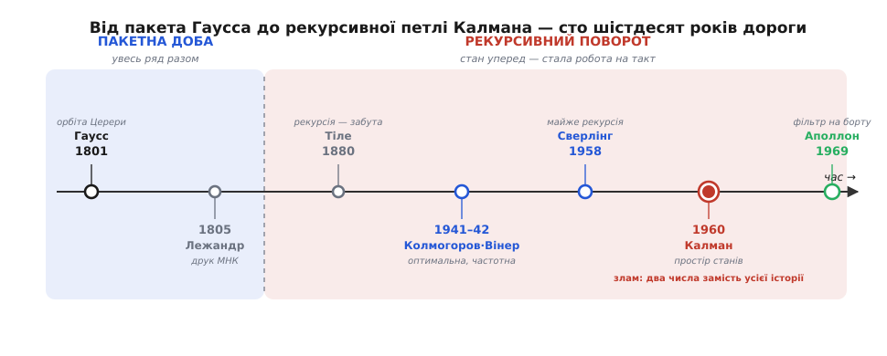

# 📜 Від пакета до петлі: народження рекурсивного оцінювання

Півтора століття найкращий спосіб витягти правду з неточних вимірів вимагав тримати при собі **всі** виміри й щоразу припасовувати їх наново — аж поки в середині XX століття оцінювання не навчилося забувати минуле й жити в петлі з двох чисел. Ось як стався цей поворот і чому саме він, а не якась хитріша формула зважування, відкрив дорогу живим машинам.

## Пакетна доба: усе відразу

Почалося все з астрономії. 1 січня 1801 року італійський астроном **Джузеппе Піацці** (Giuseppe Piazzi) у Палермо помітив на небі нову цятку — карликову планету **Цереру** (Ceres). Простежити її він устиг лише десь 40 днів, зробивши кілька десятків спостережень, — і Церера сховалася в сонячному сяйві. Щоб відшукати її знову за півроку, з тієї жменьки неточних відліків треба було вирахувати цілу орбіту.

Це зробив 24-річний **Гаусс** (Carl Friedrich Gauss) своїм [методом найменших квадратів](root:math-probability/least-squares) — і наприкінці того ж року Цереру знайшли майже точно там, куди він указав. Але придивімося не до тріумфу, а до **форми** самого обчислення. Гаусс мав перед собою **весь** ряд Піаццієвих спостережень — усі відразу, на столі — і склав їх в одну систему рівнянь, підібравши орбіту так, щоб сумарна похибка вийшла найменшою. Це **пакетне** оцінювання (англ. *batch* — «оберемок, партія»): усі дані беруть разом, одним оберемком, і розв'язують за один раз. З'явилося нове спостереження — усю систему складають і розв'язують наново, від самого початку.

Про сам метод, до речі, точиться давня суперечка про пріоритет. Надрукував його першим француз **Лежандр** (Adrien-Marie Legendre) — 1805 року, у праці про орбіти комет. Гаусс же опублікував свій виклад аж 1809-го (у «Theoria Motus»), заявивши, що користується методом ще з 1795 року. Хто був перший «на папері» — безперечно Лежандр; хто раніше «в шухляді» — імовірно Гаусс, хоча твердо довести це годі. Безсумнівний внесок Гаусса інший: він підвів під метод **імовірнісну** основу, зв'язавши найменші квадрати з [нормальним розподілом](root:math-probability/normal-distribution) похибок — і тим пояснив, **чому** цей спосіб оптимальний, а не лише **як** ним рахувати.

## Чому пакет не годиться живій машині

Для астронома пакет — то ідеал. Спостереження нечасті, дорогі, і часу на обчислення — місяці. Але уяви тепер не астронома з нотатником, а **машину**, що мусить відповідати на питання «де я?» **сотні разів на секунду** й **роками** без упину: літак, підводний апарат, ракету.

Пакетний спосіб тут смертельний одразу з двох причин. По-перше, **пам'ять**: щоб припасувати все наново, треба зберігати **кожен** минулий відлік — а їх за годину польоту вже сотні тисяч, і купа росте без меж. По-друге, **робота**: якщо на кожному такті наново розв'язувати систему по всій історії, обчислень щоразу більшає, і врешті машина захлинеться власним минулим.

```
пакет:  щотакту припасувати наново ВСІ N відліків  →  робота ∝ N,  пам'ять ∝ N
        за годину при 100 Гц:  N = 360 000  і далі росте без меж
петля:  оновити оцінку та її невпевненість         →  робота стала,  пам'ять — 2 числа
        за годину, за добу, за місяць польоту:      та сама
```

Тож питання середини XX століття було не «як точніше», а **«як дістати ту саму оптимальну відповідь, не тримаючи при собі минулого»**. Відповіддю мала стати **рекурсія** (лат. *recurrere* — «вертатися, бігти назад»): кожен крок спирається лише на результат попереднього кроку, а не переглядає все спочатку. Хто ж перетворив разове пакетне припасування на таку вічну петлю?


*Дорога від пакета до петлі. Ліворуч — пакетна доба: Гаусс і Лежандр складають увесь ряд спостережень разом (оптимально, але треба тримати все й рахувати наново). Праворуч — рекурсивний поворот: від забутого здогаду Тіле через оптимальну, та частотну й стаціонарну теорію Вінера–Колмогорова й майже-рекурсію Сверлінга до Калманової форми у просторі станів — і на борт «Аполлона». Червоний вузол — злам: стан і його невпевненість замість усієї історії, стала робота на такт.*

## Данський провісник: Тіле, 1880

Першим, хто — як ми тепер бачимо — намацав рекурсивну петлю, був данець **Торвальд Тіле** (Thorvald Nicolai Thiele): астроном, актуарій і статистик воднораз. Ще **1880 року** в праці про «майже систематичні» похибки він розглянув задачу, де справжня величина сама поволі блукає (те, що нині звемо броунівським рухом — за ботаніком Робертом Брауном), а спостерігаємо її крізь шум, — і вивів процедуру, що оновлює оцінку крок за кроком, у міру надходження даних.

Мовою свого часу Тіле, звісно, не казав «фільтр» чи «простір станів». Що в його викладі ховалася, по суті, рекурсивна форма майбутнього фільтра Калмана, розгледіли **лише в ретроспективі** — данський статистик Стеффен Лауріцен (Steffen Lauritzen) показав це аж 1981 року. Сам здогад Тіле випередив час на вісім десятиліть і... загубився: він не мав продовжувачів, лінія обірвалася. Тож історія рекурсивного оцінювання починається двічі — раз тихо, у 1880-му, і вдруге гучно, у 1960-х, і між цими двома початками немає прямого спадкоємства.

## Оптимально, та лиш для спокійного світу: Колмогоров і Вінер

Наступний штурм прийшов із війною. У 1940-х двоє математиків, незалежно один від одного, збудували першу **строго оптимальну** теорію фільтрації.

Радянський (російський) математик **Андрей Колмогоров** (Андрей Колмогоров) 1941 року розв'язав задачу для дискретних рядів: як найкраще передбачити наступне значення випадкової послідовності за минулими. Американець **Норберт Вінер** (Norbert Wiener) під час війни розв'язав неперервний варіант — задля наведення зеніток на маневрений літак; його засекречений звіт 1942 року вийшов такий важкий для читання, що через жовту обкладинку й математичну неприступність інженери прозвали його «жовтою напастю», а відкрито праця з'явилася 1949-го. Разом їхній доробок звуть **фільтром Вінера–Колмогорова**.

Це був справжній прорив — уперше **доведено найкраща** обробка шуму. Та для живої машини вона лишалася незручною одразу з двох боків. По-перше, теорія працює в **частотній** царині й вимагає, щоб сигнал був **стаціонарний** (лат. *stationarius* — «нерухомий») — тобто щоб його статистика не мінялася в часі. А реальний апарат маневрує, розганяється, гальмує — він якраз **не** стаціонарний. По-друге, щоб застосувати фільтр, треба наперед, «на столі», розв'язати рівняння Вінера–Гопфа по всьому спектру — знову обчислення над усією історією, а не легкий крок уперед. Оптимально для радіо зі сталим шумом; незграбно для рухливого апарата й бортового обчислювача.

## Сверлінг: майже

Наприкінці 1950-х до рекурсивної петлі підійшли впритул. Американець **Пітер Сверлінг** (Peter Swerling), працюючи над стеженням за штучними супутниками, 1958 року описав **поетапну** процедуру: оцінку орбіти виправляють потроху, з кожним новим спостереженням окремо, не переставляючи наново всю задачу. Це вже майже те — рекурсія в дії.

Сверлінг згодом і сам обстоював свій пріоритет, і у вузькому сенсі мав рацію: для конкретної задачі оцінювання орбіт його рекурсивний рецепт вийшов друком **раніше** за славетну статтю Калмана. Але — і це важлива різниця — Сверлінг дав **рецепт для свого випадку**, а не загальну **форму**, у якій ту саму задачу побачив би кожен. Тому історія, справедливо чи ні, запам'ятала не його ім'я.

## Калман: рекурсія у просторі станів

Загальну форму дав **Рудольф Калман** (Rudolf Emil Kálmán) — угорець-американець (народився 1930 року в Будапешті, 1943-го ще підлітком виїхав із родиною до США). Його стаття 1960 року з навмисно гучною назвою — «A New Approach to Linear Filtering and Prediction Problems», «Новий підхід до задач лінійної фільтрації та передбачення» (Journal of Basic Engineering) — зробила той самий поворот, що його шукали двадцять років.

Хід Калмана полягав не в новій формулі зважування, а в **зміні опису**. Замість того щоб длубатися в частотах і спектрах, він описав систему в **просторі станів** (state space): є прихований **стан** (положення, швидкість…), який крок за кроком штовхає вперед відома модель руху, і є шумні виміри цього стану. Тоді все минуле можна стиснути у дві речі — **поточну оцінку стану** та **її невпевненість** (коваріацію), — і оновлювати їх рекурсивно: модель штовхає оцінку вперед і роздуває невпевненість, вимір підтягує оцінку до себе й невпевненість стискає. Передбач → виправ, крок за кроком.

І ось у чому справжній **стрибок**. Ця форма, по-перше, працює в **часі**, а не в частоті, тож їй байдуже, стаціонарний сигнал чи ні, — апарат може маневрувати як завгодно. По-друге, і головне, вона **по-справжньому рекурсивна**: щоб зробити наступний крок, машині досить результату попереднього — тих самих двох чисел, — а вся історія вимірів у них уже стиснута. Робота на такт **стала**, пам'ять **стала**, хоч скільки годин триває політ. Саме **це** — не оптимальність саму собою, її мали ще Вінер із Колмогоровим, а **сталу ціну кроку** — і означало: оптимальне зважування нарешті вміститься в живу машину.

Невдовзі теорію докінчили й інші руки. Американець **Річард Бʼюсі** (Richard S. Bucy) 1961 року вивів неперервний у часі відповідник — звідси друга назва, **фільтр Калмана–Бʼюсі**. А незалежно, по інший бік залізної завіси, радянський фізик **Руслан Стратонович** (Руслан Стратонович) будував загальнішу, нелінійну теорію фільтрації, окремим випадком якої є лінійний фільтр Калмана; частину відповідних рівнянь він отримав ще до їхньої зустрічі на московській конференції 1961 року. Пріоритет тут поділений чесно: ідея визрівала одночасно в кількох головах, але саме Калманова форма у просторі станів стала тією, яку прийняв увесь світ.

## Плата за квиток: Аполлон

Найкращий доказ, навіщо була потрібна саме **петля**, а не краща формула, дала космічна програма. Щойно Калманова стаття вийшла, інженер **Стенлі Шмідт** (Stanley F. Schmidt) у дослідному центрі NASA Ames ухопився за неї для найгарячішої тодішньої задачі — оцінювання траєкторії корабля програми **Аполлон** (Apollo). Задача була нелінійна, тож Шмідт розширив фільтр, щоб той давав раду й кривим траєкторіям, — так народився **розширений фільтр Калмана** (extended Kalman filter), той самий, що й досі стоїть у кожному дроні та смартфоні.

І ось де вся історія сходиться в одну точку. Бортовий обчислювач «Аполлона» мав лічені кілобайти пам'яті. Пакетний спосіб Гаусса — тримати всі виміри й припасовувати їх наново — на такій машині не протримався б і секунди: не було куди складати минуле й ніколи його перебирати. А рекурсивна петля Калмана крутилася на ній усю дорогу до Місяця, бо коштувала щотакту однаково — дві жмені чисел уперед. Від разового розрахунку Гаусса над сорока днями спостережень Церери до петлі, досить маленької, щоб живою летіти до Місяця, — ось і весь поворот: не нова математика зважування, а нова **форма** старої. Уся вона згодом склалася в те, що ми звемо [фільтром Калмана](root:com-signal/kalman-ekf).
