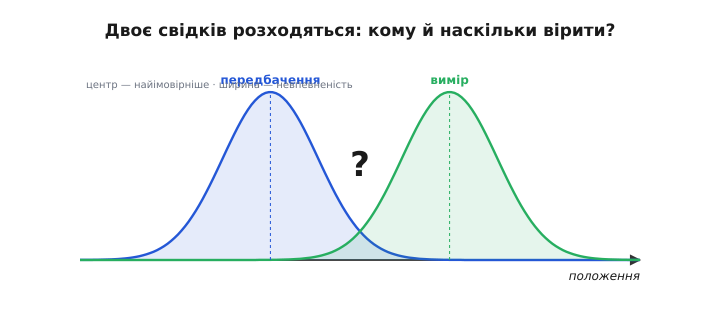
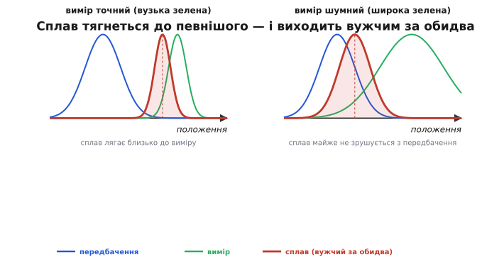
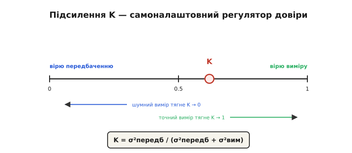
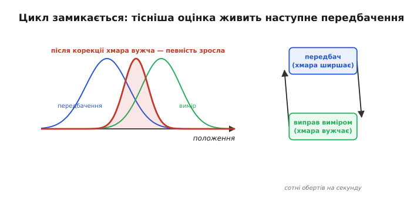

# Передбачення vs вимір

<preknowlist>
- [Модель руху](root:com-signal/motion-model) — обґрунтований здогад, де апарат буде далі, з «хмарою» невпевненості; це і є передбачення, яке стаття зважує з виміром.
- [Нормальний розподіл](root:math-probability/normal-distribution) — «хмара» невпевненості є дзвоноподібною кривою; її ширину задає дисперсія σ², якою тут міряють довіру до передбачення й виміру.
</preknowlist>

[Модель руху](root:com-signal/motion-model) дає **передбачення** (лат. *prae-* «наперед» + *dicere* «казати») — обґрунтований здогад, де апарат буде, з його «хмарою» невпевненості. Поряд приходить **вимір** (лат. *mensura*, від *metiri* «міряти») від давача — і майже завжди він **не збігається** з передбаченням. Хто має рацію? Відповідь на це питання і є серцем усього **поєднання** (лат. *fusio*, від *fundere* «зливати, плавити»): не вибрати одне, а **зважено злити** обидва в одну оцінку. Ця тема — про мистецтво такого зважування.

### Двоє свідків, кожен непевний

Уяви двох свідків події. Передбачення каже: «апарат отут» — упевнено настільки, наскільки тісна його хмара. Вимір каже: «ні, отам» — теж зі своєю похибкою. Вони розходяться.


*Передбачення й вимір розходяться. Кожне — «хмара» на осі положення: центр — найімовірніше значення, ширина — невпевненість. Передбачення (синє) каже одне, вимір давача (зелене) — інше. Вибрати лише одне погано (стрибки або дрейф), просте середнє несправедливе (а раптом один певніший?). Оцінку кладуть між ними, зважено за шириною хмар.*

Перша спокуса — вибрати когось одного. Та обидва крайнощі погані: повірити **тільки виміру** — і оцінка стрибатиме на кожному шумі давача; повірити **тільки передбаченню** — і вона дрейфуватиме, ігноруючи реальність. Друга спокуса — взяти **просте середнє**, по півдорозі. Але й це хибно: а що, як один свідок дивився в окуляр, а другий — крізь туман? Рівно їх слухати несправедливо. Правильно — **зважити за певністю**: лягти ближче до того, чия хмара вужча.

### Сплав, ближчий до певнішого

Отут і криється головна ідея. Зведена оцінка лягає **між** передбаченням і виміром, але **не посередині**, а **ближче до того, хто певніший** — чия хмара вужча, тобто похибка менша.


*Сплав тягнеться до певнішого. Ліворуч вимір точний (вузька зелена) — сплав (червоний) лягає близько до виміру. Праворуч вимір шумний (широка зелена) — сплав майже не зрушується з передбачення. У типовому випадку (незалежні, добре змодельовані виміри) зведена хмара виходить вужчою за обидві вхідні: поєднання двох свідчень знає більше, ніж кожне окремо.*

Поглянь на два випадки. Якщо **вимір точний** (вузька зелена хмара), а передбачення розпливлося — сплав тягнеться майже до виміру: свіжому точному відліку віримо більше. Якщо ж **вимір шумний** (широка зелена), а передбачення тісне — навпаки, сплав майже не зрушується з передбачення: навіщо псувати добру оцінку шумом? І найважливіше: коли свідчення **незалежні й правильно змодельовані**, зведена хмара виходить **вужчою за обидві вхідні** — ми знаємо більше, ніж із кожного окремо. У тім і виграш поєднання: не компроміс, а **підсилення певності**. (Якщо ж вимір зміщений, скорельований чи геть хибний — «викид», — він може й **зіпсувати** оцінку; саме тому фільтр відсіює неправдоподібні виміри «брамою» — *innovation gate*.)

> 📜 Цю науку — як оптимально зважувати непевні свідчення — дав світові **Карл Фрідріх Гаусс**. 1801 року астроном Джузеппе Піацці відкрив карликову планету **Цереру**, простежив її лиш близько 40 днів — і втратив у сонячному сяйві. Здавалося, знайти знов неможливо: замало даних, ще й зашумлених. Та 24-річний Гаусс застосував свій **[метод найменших квадратів](root:math-probability/least-squares)** — спосіб скласти короткий ряд неточних спостережень так, щоб похибка вийшла найменшою, **зважуючи** кожне за його точністю, — і вирахував орбіту. Наприкінці того ж року Цереру знайшли **точно там, де він указав**. Метод найменших квадратів Гаусса — це й є прабатько оптимального зважування, на якому через півтора століття постане фільтр Калмана.

### Регулятор довіри: підсилення

Як апарат вирішує, **наскільки** зрушитися від передбачення до виміру? Через одне число — **підсилення** (англ. *gain* — коефіцієнт підсилення), що грає роль регулятора довіри.


*Підсилення K — регулятор довіри. Нова оцінка = передбачення + K × (вимір − передбачення). При K=0 вимір ігнорують (лишаються на передбаченні), при K=1 стрибають на вимір, між ними — сплав. K = σ²пер / (σ²пер + σ²вим): шумний вимір (велика σ²вим) тягне K до 0, точний — до 1. K сам перетікає за відносною певністю — це й є підсилення Калмана.*

Працює воно за простою формулою. Спершу беруть **різницю** між виміром і передбаченням — «несподіванку» (англ. *innovation* — нова інформація у вимірі): наскільки реальність розійшлася з очікуванням. Тоді нову оцінку дістають так:

```
несподіванка = вимір − передбачення
нова оцінка  = передбачення + K × несподіванка
```

де **K** — підсилення від 0 до 1. При **K = 0** вимір геть ігнорують (лишаються на передбаченні); при **K = 1** стрибають прямо на вимір; між ними — зважений сплав. А визначає K **відносна певність**: K дорівнює невпевненості передбачення, поділеній на суму невпевненостей передбачення й виміру. Тому шумний вимір (велика похибка) тягне K до нуля, а точний — до одиниці. Найкраще те, що K **сам перетікає** за обставинами: щойно передбачення розпливлося (давач довго мовчав) — K росте, і наступний вимір беруть охочіше; щойно вимір зашумів — K падає. Це й є знамените **підсилення Калмана**: автоматичний, самоналаштовний регулятор довіри.

> 🔧 **Навіщо це.** Так само влаштоване поєднання в польотному контролері: оцінювач щотакту бере передбачення інерціяльної моделі й вимір GPS/баро та зважує їх рівно цією формулою. Заявиш давач точнішим, ніж він є (мала `r`), — фільтр стрибатиме на його шум; заявиш надто шумним (велика `r`) — майже не слухатиме й дрейфуватиме. Тонке настроювання оцінювача — це і є чесне зважування довіри.

Підставимо числа, щоб побачити зважування на дотик. Хай передбачення кладе апарат на **10.0 м** з невпевненістю (дисперсією) **σ²пер = 4.0**, а давач міряє **16.0 м** з дисперсією **σ²вим = 1.0** (давач певніший — менша дисперсія). Несподіванка велика, +6.0 м, але K сам вирішить, наскільки їй вірити.

:::tabs
```cpp
// Скалярне поєднання за один такт: один стан, один вимір.
// p — дисперсія передбачення (σ²пер), r — дисперсія виміру (σ²вим).
float x_pred = 10.0f;   // передбачення моделі, м
float p      = 4.0f;    // σ²пер: модель невпевнена
float z      = 16.0f;   // вимір давача, м
float r      = 1.0f;    // σ²вим: давач певніший

float K   = p / (p + r);          // 4 / (4 + 1) = 0.8 — тягне до виміру
float x   = x_pred + K * (z - x_pred);  // 10 + 0.8·(16 − 10) = 14.8 м
float p_new = (1.0f - K) * p;     // (1 − 0.8)·4 = 0.8 — хмара звузилась
```
```python
# Скалярне поєднання за один такт: один стан, один вимір.
# p — дисперсія передбачення (σ²пер), r — дисперсія виміру (σ²вим).
x_pred = 10.0   # передбачення моделі, м
p      = 4.0    # σ²пер: модель невпевнена
z      = 16.0   # вимір давача, м
r      = 1.0    # σ²вим: давач певніший

K     = p / (p + r)              # 4 / (4 + 1) = 0.8 — тягне до виміру
x     = x_pred + K * (z - x_pred)  # 10 + 0.8·(16 − 10) = 14.8 м
p_new = (1.0 - K) * p            # (1 − 0.8)·4 = 0.8 — хмара звузилась
```
:::

Оцінка вийшла **14.8 м** — між 10 і 16, але ближче до точнішого виміру, бо K = 0.8. А нова дисперсія **0.8** менша і за 4.0 (передбачення), і за 1.0 (вимір): дві непевні цифри, злиті разом, дали певнішу за кожну окремо. Якби давач був шумнішим за модель (скажімо, `r = 9`), вийшло б K = 4 ⁄ 13 ≈ 0.31, оцінка ≈ 11.8 м — сплав ледь зрушився б від передбачення. Те саме число K тихо робить усю роботу зважування.

### Певність зростає — і цикл замикається

Складімо обидва кроки докупи. Маємо повний **цикл оцінювання**: [передбачення](root:com-signal/motion-model) штовхає оцінку вперед, розширюючи хмару; корекція підтягує її до виміру, **звужуючи** хмару назад.


*Цикл замикається. Дві широкі хмари — передбачення й вимір — поєднуються у вужчу: після корекції певність зростає. Ця тісніша оцінка стає станом для наступного передбачення, і цикл «передбач → виправ» крутиться сотні разів на секунду, щоразу тримаючи оцінку настільки певною, наскільки дозволяють давачі.*

І ось ключове: після корекції оцінка **певніша**, ніж була, — і саме вона стає вихідним станом для **наступного** передбачення. Цикл замикається: передбач → виправ → передбач → виправ, сотні разів на секунду, і щоразу оцінка лишається настільки певною, наскільки дозволяють давачі. Саме цей невпинний оберт і дає апаратові його стабільне, довірене відчуття себе — те, на якому тримається все керування. А коли до цих двох кроків додати математику «хмар» (коваріацію) і формулу підсилення K — вийде вже не якісна картинка, а [**фільтр Калмана**](root:com-signal/kalman-ekf) в усій повноті.
