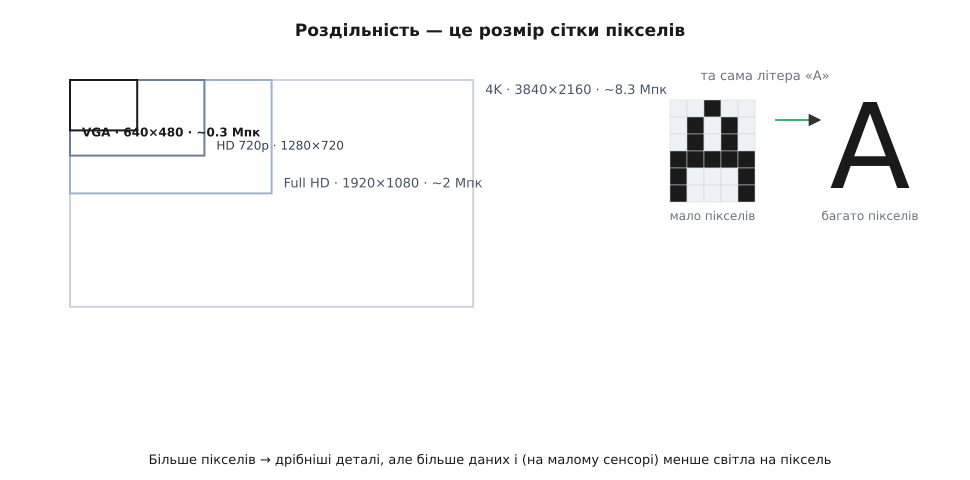
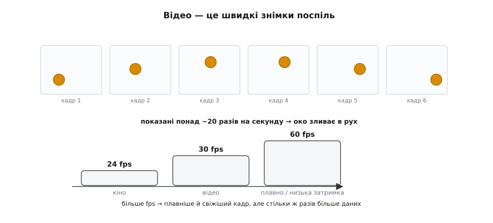
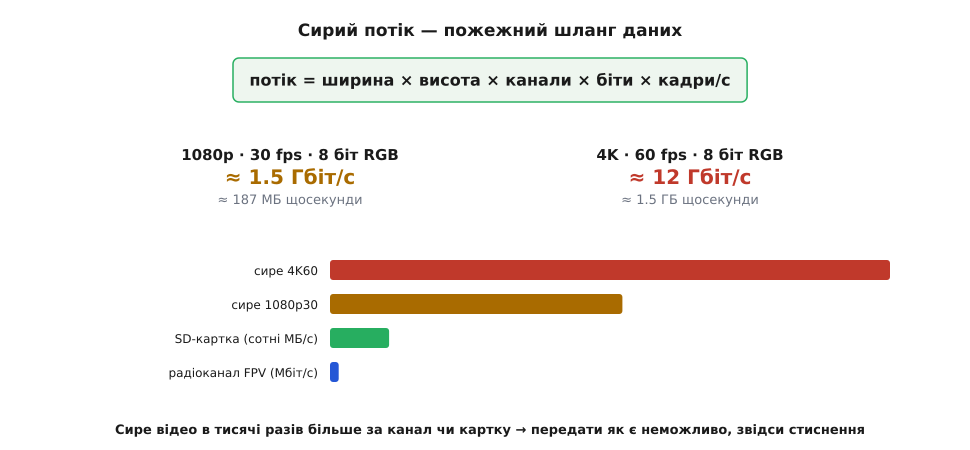
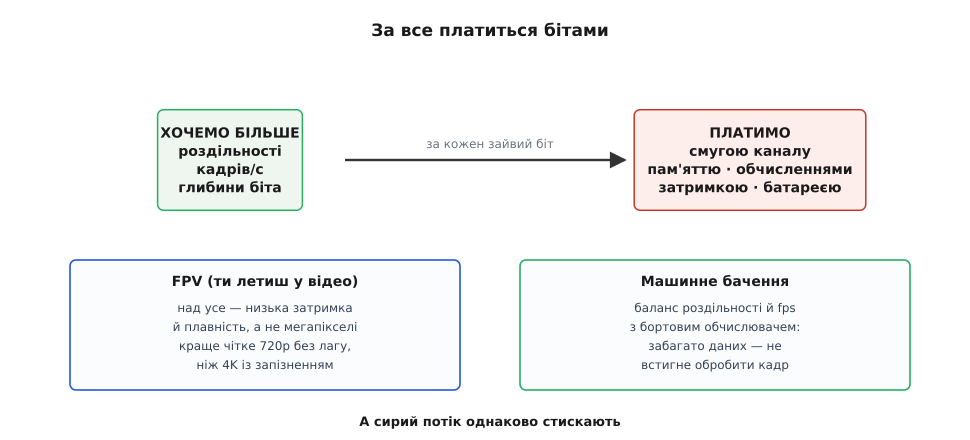

# Роздільність і частота кадрів (обсяг даних)

Якість одного [кадру](topic:hw-sensing/image-sensor) — це одне; відео ж описують ще дві цифри, що задають його як **потік**: **роздільність** (скільки пікселів у кадрі) і **частота кадрів** (скільки кадрів за секунду). Разом вони визначають, **скільки даних** ллється з камери щомиті — а це число вражає й диктує дуже багато: стиснення, канал, обчислення на борту.

### Роздільність: скільки відерець у кадрі

**Роздільність** (від латинського *resolvere* — «розкладати на частини»: наскільки дрібно картину розкладено на пікселі) — це просто розмір сітки пікселів: ширина × висота. VGA — 640×480 (≈0.3 Мпк), HD «720p» — 1280×720, Full HD «1080p» — 1920×1080 (≈2 Мпк), 4K — 3840×2160 (≈8 Мпк). Що більше пікселів, то **дрібніші деталі** видно — текст здалеку, тонку лінію, малу ціль.


*Роздільність — розмір сітки пікселів. Від VGA (640×480, ~0.3 Мпк) до 4K (3840×2160, ~8.3 Мпк): що більше пікселів, то дрібніші деталі видно — груба «А» з кількох пікселів проти чіткої. Але кожен зайвий піксель — це ще одне число для зчитування, передачі й обробки, а на малому сенсорі ще й менше світла на піксель.*

Та «мегапікселі» — палиця на два кінці. Так, більше пікселів дає різкість. Але кожен зайвий піксель — це ще одне число, яке треба зчитати, передати, зберегти й обробити. До того ж на крихітному сенсорі більше пікселів означає **менший** піксель — менше світла на кожен, [більше шуму](topic:hw-sensing/dynamic-range-noise). Тому гонитва за мегапікселями має межу: для дрона часто **корисніша** скромна роздільність із чистим, швидким кадром, ніж гори зашумлених пікселів.

### Частота кадрів: рух із застиглих знімків

Відео не існує — є тільки **послідовність знімків**, показаних так швидко, що око зливає їх у рух. Скільки знімків за секунду — це **частота кадрів** (англійське *frame rate*, у цифрах — fps, *frames per second*, кадрів за секунду).


*Відео — це швидкі знімки поспіль. Камера знімає окремі кадри (м'яч у різних місцях); показані понад ~20 разів на секунду, вони зливаються в безперервний рух. Кіно йде на 24 fps, звичайне відео — 30, плавне — 60. Більше fps дає плавніший рух і меншу затримку на кадр — але стільки ж разів більше даних щосекунди.*

Поріг злиття руху — десь **за 20 кадрів/с**: вже від цього темпу окремі знімки перестають читатися нарізно й зливаються в плин. Тому кіно йде на 24, звичайне відео — 30, плавне — 60, а для сповільненої зйомки знімають сотні кадрів за секунду. Більше fps дає не лише **плавніший** рух, а й — важливо для апарата — **меншу [затримку](topic:com-protocol/video-latency)**: новий кадр приходить частіше, тож керування бачить свіжіший світ. Плата очевидна: 60 кадрів/с — це **вдвічі** більше даних, ніж 30.

> 📜 Що рух — це насправді **низка застиглих миттєвостей**, уперше довів **Едвард Майбрідж** у червні 1878 року. Залізничний магнат Ліленд Стенфорд посперечався, чи відриває кінь у галопі всі чотири копита від землі воднораз, — і найняв Майбріджа це зняти. Той вишикував уздовж бігової доріжки на фермі в Пало-Альто **низку камер**, у кожної затвор спускався ниткою-розтяжкою: кобила на ім'я Саллі Гарднер пробігала, ногами рвала нитки — і камери клацали одна за одною. Знімки **довели**: так, є мить, коли всі копита в повітрі. А наступного, 1879 року Майбрідж склав ці кадри на диск свого **зоопраксископа** й закрутив — і застиглі миттєвості **ожили рухом**. Це й був прабатько кіно: рух, розкладений на кадри й зібраний назад, — рівно те, що робить камера твого дрона 30 разів на секунду.

### Сирий потік: пожежний шланг даних

Тепер перемножмо все й жахнімося. Скільки даних дає камера за секунду?


*Сирий потік — пожежний шланг. Потік = ширина × висота × канали × біти × кадри/с. Навіть скромне 1080p30 (8 біт, RGB) — це ≈1.5 Гбіт/с (≈187 МБ щосекунди); 4K60 — ≈12 Гбіт/с (≈1.5 ГБ/с). А радіоканал FPV тягне одиниці-десятки Мбіт/с, SD-картка — сотні МБ/с. Сире відео в тисячі разів більше — передати його як є неможливо, звідси стиснення.*

Рахунок простий: **потік = ширина × висота × канали × біти × кадри/с**. Для скромного 1080p, 30 кадрів/с, по 8 біт на кожен із трьох (RGB) каналів виходить:

```
пікселів у кадрі = 1920 × 1080      = 2 073 600
бітів на піксель = 3 каналів × 8    = 24
бітів на кадр    = 2 073 600 × 24   ≈ 49.8 Мбіт
бітів за секунду = 49.8 Мбіт × 30   ≈ 1.49 Гбіт/с   (≈ 187 МБ/с)
```

А 4K на 60 кадрах — близько **12 Гбіт/с**, півтора гігабайта за секунду. Це **пожежний шланг**: звичайна microSD (десятки-сотні МБ/с) і тим паче радіоканал FPV (одиниці-десятки Мбіт/с) такого й близько не проковтнуть (хіба найшвидші карти потягнуть нижні режими). Сире відео в **тисячі разів** більше за те, що можна реально передати чи зберегти.

Корінь біди — у тому, що кожен «двигун» цифри множиться на решту. Тому є й зворотний хід: зменшити дані ще **до** стиснення, прорідивши те, чого око майже не помічає. Колір ми розрізняємо грубіше за яскравість — тож **колірне субдискретування** (chroma subsampling) лишає повну яскравість, але бере відтінок не з кожного пікселя, а з кожного другого чи четвертого; замість трьох повних 8-бітних каналів виходить у середньому ~12 біт на піксель — і потік одразу падає вдвічі. На самому сенсорі діє споріднена хитрість — **бінінг** (binning): сусідні пікселі складають в один ще на кристалі, тож і кадр менший, і світла на «об'єднаний» піксель більше (менше шуму) — ціною роздільності.

> 🔧 **Навіщо це.** Перш ніж вибирати кодек чи радіомодем, порахуй сирий потік камери — це твоя верхня межа. 1080p30 — це вже ~1.5 Гбіт/с; жоден FPV-канал стільки не везе, тож питання не «чи стискати», а «наскільки сильно» (у скільки разів кодек має втиснути потік у твою смугу). Той самий рахунок одразу каже, чи влізе запис на картку потрібної швидкості й чи встигне процесор прожувати кадр вчасно.

### Компроміс: за все платиться бітами

Звідси головне про дані: роздільність і fps — **не** «що більше, то краще», а **вибір під ресурси**.


*За все платиться бітами. Хочемо більше (роздільності, fps, глибини) — платимо смугою каналу, пам'яттю, обчисленнями, затримкою й розрядом батареї. Тому вибір залежить від задачі: для FPV над усе низька затримка й плавність (а не мегапікселі), для машинного бачення — баланс із бортовим обчислювачем. А сирий потік однаково стискають.*

Кожен доданий піксель, кадр чи біт глибини коштує **смуги** каналу, **пам'яті**, **обчислень** і **батареї** — а часто й **затримки**. Тому розумний вибір залежить від задачі. Для **FPV** (ти летиш, дивлячись у відео) над усе — **низька затримка** й плавність, а не мегапікселі: краще чітке 720p без лагу, ніж розкішне 4K, що приходить із запізненням. Для **машинного бачення** роздільність і fps балансують із тим, скільки потягне [бортовий обчислювач](topic:hw-arch/compute-cost): забагато даних — і він не встигне обробити кадр вчасно. А оскільки сирий потік не тягне ніхто, його неминуче [**стискають**](topic:math-information/why-compress) — жертвуючи дрібкою якості заради в рази меншого обсягу.

Саме тому позначка «4K60» на коробці камери — ще не обіцянка. Зняти такий потік сенсор, може, і здатний, але провести його далі без стиснення нікуди: інтерфейс від сенсора, канал у небо й картка для запису — усі вужчі за сирі 12 Гбіт/с на порядки. 4K60 живе лише вже стиснутим; нездоланне тут — саме **сире** число, а не сам формат.

Підсумовуючи: відео описують двома цифрами потоку — **роздільність** (ширина × висота пікселів: більше деталей, але менший і шумніший піксель та більше даних) і **частота кадрів** (знімків за секунду: понад ~20 око зливає їх у рух; більше fps — плавніше й менша затримка, та й удвічі більше даних). Перемножені — ширина × висота × канали × біти × fps — вони дають **сирий потік**, що навіть для 1080p30 сягає ~1.5 Гбіт/с, а для 4K60 — ~12: у тисячі разів більше, ніж проковтне канал чи картка. Тому роздільність і fps завжди **обирають під ресурси** (для FPV — низьку [затримку](topic:com-protocol/video-latency), для машинного бачення — баланс із [бортовим обчислювачем](topic:hw-arch/compute-cost)), а сирий потік неодмінно [**стискають**](topic:math-information/why-compress) — лише так пожежний шланг даних влазить у вузьку трубу каналу чи картки.

---
