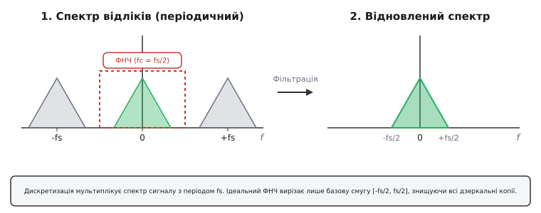
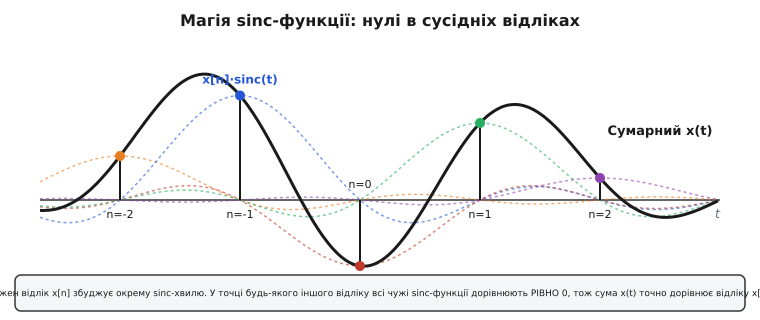
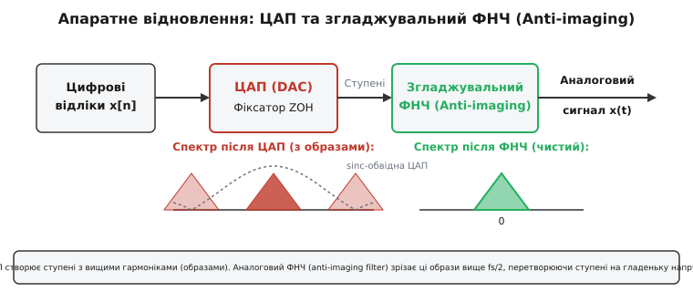
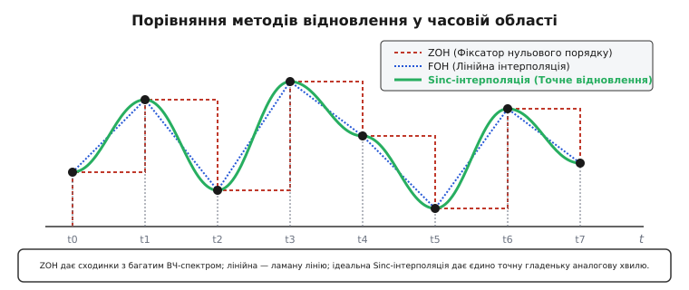

# Відновлення сигналу з відліків

<preknowlist>
- [Частота дискретизації, Найквіст, аліасинг](root:com-signal/nyquist-aliasing) — теорема Найквіста-Котельникова та умова відсутності спектрального накладання.
- [Аналого-цифрове та цифрово-аналогове перетворення](root:hw-analog/sampling-quantization) — принцип дискретизації у часі та квантування за рівнем.
- [RC-фільтр](root:hw-analog/pwm-filter-sizing) — аналоговий фільтр низьких частот для формування та відновлення сигналів.
</preknowlist>

Коли цифровий мікроконтролер, звуковий DSP-процесор чи графічна карта завершують обчислення, результат існує у вигляді сухого масиву чисел — миттєвих відліків напруги, знятих або розрахованих через рівні інтервали часу `Ts = 1 / fs`. Фізичний світ, однак, не сприймає абстрактних масивів і таблиць пам'яті. Динамік акустичної системи потребує гладенької неперервної зміни струму в котушці, електродвигун сервоприводу вимагає плавного аналогового сигналу керування без різких стрибків, а радіопередавач — чистої несучої хвилі без вищих гармонік. Завдання перетворення нескінченно вузьких часових точок у неперервну фізичну величину зветься **відновленням сигналу (*signal reconstruction*)**.

На перший погляд здається, що для відновлення достатньо з'єднати сусідні точки відліків прямими лініями або просто витримувати постійну напругу на виході до приходу наступного числа. Проте інженерна реальність значно суворіша: найпростіші способи з'єднання точок спотворюють спектр, створюють високі дзеркальні гармоніки, викликають ультразвукове тремтіння й перегрів підсилювачів. Справжнє точне відновлення вимагає глибшого розуміння спектральної природи дискретизації та застосування спеціальних аналогових і цифрових фільтрів.

---

### Спектральна механіка: звідки беруться образи

Щоб зрозуміти, чому відновлення сигналу є складним інженерним завданням, слід подивитися на дискретизацію у частотній області. У мить, коли аналогово-цифровий перетворювач (АЦП) вимірює напругу, він фактично множить неперервний сигнал на нескінченну послідовність коротких імпульсів (гребінець Дірака). У частотній області ця операція призводить до фундаментального наслідку: **спектр дискретизованого сигналу стає періодичним**.

Початковий аналоговий сигнал мав спектр `X(f)`, обмежений найвищою частотою `fmax`. Після дискретизації з частотою `fs` цей корисний спектр дублюється нескінченну кількість разів уздовж всієї осі частот. Довкола кожної кратної частоти `fs`, `2·fs`, `3·fs` утворюються симетричні дзеркальні копії — так звані **образотворчі частоти (*images*, спектральні образи)**.


*Дискретизація мультиплікує спектр сигналу з періодом fs. Ідеальний ФНЧ вирізає лише базову смугу [-fs/2, fs/2], знищуючи всі дзеркальні копії.*

Звідси випливає фундаментальний спектральний висновок: цифровий масив відліків одночасно містить і початковий низькочастотний сигнал, і нескінченний набір його високочастотних дзеркальних двійників.

Отже, **відновити сигнал — це означає повністю вилучити всі високочастотні дзеркальні образи**, залишивши лише первинну фундаментальну смугу частот від `-fs/2` до `+fs/2`. З математичного боку для цього потрібен ідеальний прямокутний фільтр низьких частот (ФНЧ) із частотою зрізу `fc = fs/2`. Якщо такий фільтр пропускає без змін усі частоти нижче за `fs/2` і повністю зрізає все, що лежить вище, то на його виході з'явиться абсолютно чистий початковий аналоговий сигнал.

Еволюція цієї ідеї від абстрактних інтерполяційних рядів XIX століття до практичних формул зв'язку докладно розкрита у зносці [📜 Історія формули Котельникова-Шеннона](root:com-signal/sampling-reconstruction/hist-whittaker-shannon.md).

---

### Магія sinc-інтерполяції у часовій області

Що означає множення спектра на прямокутне вікно ФНЧ, якщо перевести цю операцію у часову область? За теоремою згортки, множенню у частотній області відповідає згортка сигналів у часовій області. 

Зворотне перетворення Фур'є від ідеального прямокутного вікна ФНЧ дає імпульсну характеристику у вигляді **кардинального синуса**:

```
h(t) = sinc(fs · t) = sin(pi · fs · t) / (pi · fs · t)
```

Коли послідовність дискретних відліків `x[n]` подається на вхід такого ідеального ФНЧ, кожен окремий відлік збуджує у фільтрі власну неперервну хвилю вигляду `x[n] · sinc(fs·t - n)`. Підсумковий відновлений аналоговий сигнал `x(t)` є точною сумою всіх цих розсунутих у часі хвильових сплесків:

```
x(t) = ∑ x[n] · sinc( (t - n·Ts) / Ts )
```

Цей вираз відомий як **формула відновлення Віттакера-Котельникова-Шеннона**. На перший погляд здається дивним, що сума нескінченної кількості осцилюючих хвиль `sinc` може точно відтворити гладеньку первинну криву без найменшої похибки. Секрет полягає в унікальній математичній властивості функції `sinc`.


*Кожен відлік x[n] збуджує окрему sinc-хвилю. У точці будь-якого іншого відліку всі чужі sinc-функції дорівнюють РІВНО 0, тож сума x(t) точно дорівнює відліку x[n].*

У точці самого відліку `t = n·Ts` значення `sinc(0)` дорівнює строго `1`. У точках усіх інших відліків `t = m·Ts` (де `m ≠ n`) аргумент стає цілим числом, а `sin(pi · k)` перетворюється на строго `0`. Це означає, що у мить кожного виміру `t = n·Ts` відновлений сигнал дорівнює значенню відліку `x[n]`, бо внески всіх інших відліків тотожно дорівнюють нулю. А у проміжках між відліками плавні згасаючі хвости функцій `sinc` алгебраїчно додаються, утворюючи єдино можливу гладеньку лінію.

Крім того, базисні функції `sinc(t / Ts - n)` володіють ортогональністю у просторі сигналів із квадратним інтегруванням `L²`. Це означає, що кожен відлік несе строго незалежну частку енергії сигналу, а загальна енергія неперервної відновленої хвилі дорівнює сумі квадратів відліків, помноженій на крок дискретизації `Ts` (теорема Парсеваля для дискретних систем).

Детальне математичне виведення цієї формули та доведення ортогональності наведені у вставці [🧮 Математичний вивід ідеальної sinc-інтерполяції](root:com-signal/sampling-reconstruction/math-sinc-reconstruction.md).

---

### Пастка нереалізовності та ефект Гіббса

Якби ідеальний `sinc`-фільтр можна було вільно зібрати з мікросхем чи реалізувати в коді, проблема відновлення була б розв'язана остаточно. Проте ідеальна `sinc`-інтерполяція наражається на три суворі фізичні та обчислювальні обмеження:

1. **Некаузальність (порушення принципу причинності).** Функція `sinc(t)` простягається у часі від `-∞` до `+∞`. Вона починає осцилювати задовго до того, як настане сам момент відліку. Щоб обчислити напругу `x(t)` у поточну секунду, аналогова чи цифрова система мала б знати відліки, які настануть у майбутньому через хвилини, години чи роки.
2. **Нескінченна затримка.** Щоб зробити `sinc`-фільтр каузальним у часі, його довелося б зсунути вправо на нескінченний інтервал часу, створивши нескінченну затримку сигнального тракту.
3. **Повільний спад хвостів.** Амплітуда осциляцій `sinc(t)` згасає дуже повільно — як `1/t`. Якщо штучно обрізати рядок, враховуючи лише сусідні `N` відліків, на відновленому сигналі з'являються паразитичні осциляції та амплітудні викиди поблизу швидких перепадів — так званий **ефект Гіббса (*Gibbs phenomenon*)**.

При учені `sinc`-фільтра прямокутним вікном максимальна величина першого перерегулювання біля різкого стрибка напруги становить приблизно **8.95% від висоти перепаду**, незалежно від кількості збережених відліків `N`. Для усунення цих осциляцій у практичних цифрових інтерполяторах застосовують гладкі згладжуючі вікна (Ланцоша, Геммінга, Блекмана).

Тому в реальній інженерній практиці ідеальний `sinc` замінюють компромісними наближеннями: апаратними ЦАП із фіксаторами та аналоговими згладжувальними фільтрами, або цифровими віконними інтерполяторами.

---

### Реальне апаратне відновлення: ЦАП та Anti-Imaging фільтр

У реальних електронних пристроях відновлення сигналу розбивають на два послідовні етапи: **цифро-аналогове перетворення (ЦАП)** та **аналогову згладжувальну фільтрацію**.


*ЦАП створює ступені з вищими гармоніками (образами). Аналоговий ФНЧ (anti-imaging filter) зрізає ці образи вище fs/2, перетворюючи ступені на гладеньку напругу.*

#### Етап 1: Фіксатор нульового порядку (ZOH)

Більшість класичних ЦАП (від найпростіших резистивних матриць `R-2R` та ШІМ-виходів до інтегральних мікросхем) працюють за принципом **фіксатора нульового порядку (*Zero-Order Hold, ZOH*)**. Отримавши черговий цифровий код `x[n]`, ЦАП миттєво змінює вихідну напругу й утримує її незмінною протягом усього періоду `Ts` до приходу наступного відліку.

На виході ZOH утворюється ступенчаста напруга. З точки зору математики, така ступенчата хвиля є згорткою дискретних відліків із прямокутним імпульсом шириною `Ts`. Спектральний відгук ZOH суттєво відрізняється від ідеального прямокутника:

```
H_zoh(f) = Ts · sinc(f · Ts) · e^(-j · pi · f · Ts)
```

Ця формула розкриває дві головні проблеми ступенчастого відновлення ЦАП:

1. **Залишкові дзеркальні образи:** Модуль `sinc(f·Ts)` згасає повільно. Ступенчатий сигнал ЦАП містить значну енергію високочастотних дзеркальних копій на частотах `fs`, `2·fs`, `3·fs`. Якщо подати таку ступенчату напругу безпосередньо на звуковий підсилювач, високочастотні гармоніки перевантажать твітери (ВЧ-динаміки) та викликатимуть інтермодуляційні спотворення.
2. **Амплітудний спад у корисній смузі (sinc roll-off):** Функція `sinc(f·Ts)` починає спадати ще всередині корисної смуги. На самій межі Найквіста `f = fs / 2` амплітуда відновленого сигналу зменшується до:

```
sinc(1/2) = sin(pi / 2) / (pi / 2) = 2 / pi ≈ 0.6366  (-3.92 дБ)
```

Це означає, що високі частоти корисного сигналу (наприклад, верхні ноти в аудіо) виявляються заглушеними майже на 30% за амплітудою порівняно з низькими частотами.

#### Етап 2: Згладжувальний фільтр (Anti-Imaging Фільтр)

Щоб перетворити ступенчасту напругу ЦАП на чисто відтворений аналоговий сигнал, після ЦАП обов'язково ставлять аналоговий фільтр низьких частот, який називають **згладжувальним або відновлювальним фільтром (*anti-imaging filter / reconstruction filter*)**.

⚠️ **Не плутайте anti-imaging фільтр із anti-aliasing фільтром!**
- **Anti-aliasing filter** стоїть *перед АЦП* (в аналоговому тракті зчитування) і зрізає ВЧ-шуми, щоб запобігти аліасингу (складанню частот униз).
- **Anti-imaging filter** стоїть *після ЦАП* (в аналоговому вихідному тракті) і зрізає дзеркальні копії (*images*), що виникли внаслідок дискретизації, перетворюючи ступені на гладеньку хвилю.

Вимоги до відновлювального фільтра висуваються високі: він повинен пропускати частоти до `fs/2` без затухання й фазових спотворень і глибоко пригнічувати все, що лежить вище за `fs/2`. Якщо частота дискретизації взята близько до теоретичної межі Найквіста (наприклад, `fs = 44.1 кГц` для аудіо з верхньою межею 20 кГц), переходна смуга між 20 кГц та 22.05 кГц виявляється дуже вузькою. Побудувати аналоговий фільтр із такою крутою характеристикою зрізу надзвичайно важко — для цього потрібні складні активні фільтри Баттерворта чи Чебишова 7–9-го порядків на операційних підсилювачах.

---

### Інженерний рятувальник: цифровий Oversampling

Щоб уникнути будування важких і дорогих аналогових фільтрів високого порядку, у сучасних цифро-аналогових перетворювачах (аудіо-ЦАП, медичні стимулятори, SDR-передавачі) застосовують прийом **передискретизації (*oversampling*)**.

Ідея полягає у перенесенні важкої фільтрації з аналогового світу в цифровий:

```
[Цифрові відліки fs] ──► [Цифровий 8x FIR-інтерполятор] ──► [ЦАП на 8·fs] ──► [Простий RC-фільтр]
```

1. **Цифрова інтерполяція:** Цифровий сигнал із початковою частотою `fs` (наприклад, 44.1 кГц) надходить у цифровий FIR-фільтр, який вставляє між кожними двома відліками 7 нульових точок і обчислює їх методом цифрової `sinc`-інтерполяції. Частота дискретизації підвищується у 8 разів — до `8·fs` (352.8 кГц).
2. **Відсунення дзеркальних образів:** Завдяки цифровому підняттю частоти перша дзеркальна копія спектра виникає тепер не на 44.1 кГц, а аж на частоті `8·fs = 352.8 кГц`.
3. **Спрощення аналогового фільтра:** Відстань між корисною смугою (20 кГц) та першим дзеркальним образом (352.8 кГц) стає гігантською. Замість крутого аналогового фільтра 9-го порядку тепер достатньо поставити найпростіший аналоговий [RC-фільтр](root:hw-analog/pwm-filter-sizing) 1-го або 2-го порядку!

Крім того, цифровий фільтр усередині ЦАП може заздалегідь застосувати **компенсацію sinc-спаду (*inverse sinc filter*)**, піднявши амплітуду високих частот на `+3.92 дБ` на межі Найквіста, щоб повністю компенсувати затухання ZOH.

---

### Неідеальності реальних ЦАП: Джиттер, Кліпінг та Шум

У реальних інженерних системах відновлення сигналу піддається впливу додаткових фізичних дефектів:

1. **Тактовий джиттер (*clock jitter*).** Завдання теореми Котельникова вимагає строго рівних проміжків часу між відліками. Якщо часовий генератор ЦАП має часову нестабільність (джиттер) із середньоквадратичним відхиленням `σ_t`, момент видачі аналогової напруги випадково зсувається на `Δt`. Це створює похибку амплітуди `ΔV ≈ (dv/dt) · Δt`, яка проявляється як додатковий високочастотний шум. Граничне відношення сигнал/шум через джиттер обчислюється як `SNR_jitter = -20 · log10(2 · pi · f · σ_t)`. У прецизійних аудіо-ЦАП джиттер тактового генератора зменшують до пікосекундного рівня (`σ_t < 1...10 пс`).
2. **Переповнення при sinc-інтерполяції (*inter-sample clipping*).** Оскільки функція `sinc` має осцилюючі бічні пелюстки, при відновленні сигналу між двома відліками з максимальною амплітудою (наприклад, `+1.0` та `+1.0`) відновлена неперервна хвиля може підніматися до значень `+1.12... +1.15` (до `+1.5 дБ` над максимумом відліків). Якщо цифровий інтерполятор ЦАП працює без запасного діапазону (*headroom*), це викликає жорсткий цілочисловий кліпінг і сильні спотворення.
3. **Нелінійність шкали ЦАП (INL/DNL).** Диференціальна та інтегральна нелінійність реальних резистивних чи струмових ключів ЦАП створює гармонійні спотворення (THD), що проявляються у вигляді паразитичних частотних піків у спектрі аналогового сигналу.

---

### Програмні методи інтерполяції в DSP

Якщо відновлення сигналу виконується не аналоговими мікросхемами, а програмно (наприклад, при зміні частоти дискретизації аудіофайлу, перерахунку координат у графіці чи роботі з давачами), застосовують різні алгоритми цифрової інтерполяції.


*ZOH дає сходинки з багатим ВЧ-спектром; лінійна — ламану лінію; ідеальна Sinc-інтерполяція дає єдино точну гладеньку аналогову хвилю.*

#### 1. Фіксатор нульового порядку (ZOH / Nearest Neighbor)
Береться значення найближчого або попереднього відліку. 
- *Переваги:* Швидкодія `O(1)`, не вимагає арифметичних операцій.
- *Недоліки:* Ступенчаста форма, сильні ВЧ-гармоніки, спад `sinc` у спектрі.

#### 2. Лінійна інтерполяція (FOH / First-Order Hold)
Сусідні відліки `x[n]` та `x[n+1]` з'єднуються похилою прямою лінією. Імпульсна характеристика — трикутне вікно шириною `2·Ts`.
- *Переваги:* Дуже проста обчислювальна складність (`O(1)`), відсутність розривів першого роду.
- *Недоліки:* Спектральний спад пропорційний `sinc²(f·Ts)`, що сильно згладжує високі частоти й викликає помітне розмиття високих частот у звуці та зображеннях.

#### 3. Кубічна інтерполяція та сплайни (Cubic Spline / Hermite)
Інтерполяція проводиться кубічними поліномами по 4 сусідніх точках із забезпеченням неперервності як самого сигналу, так і його першої похідної.
- *Переваги:* Добре компромісне гладке відновлення для графіки й відео без значних витрат ресурсів.

#### 4. Віконна Sinc-інтерполяція (Lanczos Interpolation)
Ідеальна функція `sinc(x)` множиться на скінченне вікно Ланцоша радіуса `a` (зазвичай `a = 3` або `a = 4` відліки):

```
L(x) = sinc(x) · sinc(x / a)   [для |x| < a, і 0 для |x| ≥ a]
```

- *Переваги:* Забезпечує найвищу спектральну точність, близьку до теореми Котельникова, з ефективним пригніченням дзеркальних частот понад 80 дБ.
- *Недоліки:* Вимагає `2·a` множень на кожен відновлений відлік.

Повні робочі вихідні тексти реалізації цих трьох методів наведені у вставці [⚙️ Реалізація інтерполятора на C та C++](root:com-signal/sampling-reconstruction/proj-sinc-interpolator.md).

---

### Приклади застосування в галузях інженерії

Вимоги до відновлення сигналу суттєво відрізняються залежно від галузі застосування:

1. **Медична електроніка (ЕКГ та ЕЕГ).** При відновленні біоелектричних сигналів серця чи мозку критично важливо зберегти форму хвилі та відсутність фазових спотворень. Застосування аналогових ФНЧ із нелінійною фазою (наприклад, Чебишова) змінює форму зубців ЕКГ і може призвести до хибного діагнозу. Тому у медичних пристроях використовують передискретизацію з цифровими FIR-фільтрами лінійної фази або аналогові ФНЧ Бесселя.
2. **Промислові сервоприводи та автоматика.** Вихідні сигнали керування швидкістю моторів (0...10 В або 4...20 мА) формуються за допомогою ЦАП мікроконтролера. Ступені ZOH викликають високочастотні струмові удари в обмотках двигуна та підвищене зношення механіки. Для захисту моторів на виході ЦАП ставлять аналогові згладжувальні RC-ланцюги або програмну сплайн-інтерполяцію траєкторії.
3. **Програмно-визначене радіо (SDR).** У SDR-передавачах цифровий квадратурний потік (I/Q) відновлюється в аналогові радіочастотні сигнали. Будь-які залишкові дзеркальні образи створюють побічні випромінювання у сусідніх радіоканалах, що заборонено стандартами FCC/ETSI. У SDR застосовують глибоку цифровий oversampling (до 64x...128x) за допомогою поліфазних FIR-інтерполяторів та спеціальних струмових ЦАП (current-steering DACs).

---

### Практичний інженерний розрахунок і приклад

Розглянемо практичну задачу побудови звукового тракту ЦАП для відтворення сигналу з частотою дискретизації `fs = 48 кГц`.

```
Вихідні дані:
  - Частота дискретизації: fs = 48 кГц
  - Смуга корисного сигналу: f_user = 0 ... 20 кГц
  - Межа Найквіста: fs / 2 = 24 кГц
  - Перший дзеркальний образ без oversampling: f_img1 = fs - f_user = 48 - 20 = 28 кГц

Сценарій 1: Прямий вихід ZOH ЦАП без передискретизації
  - Спад амплітуди ZOH на частоті 20 кГц:
    sinc(20 / 48) = sin(pi · 20/48) / (pi · 20/48)
                  = sin(0.4167 · pi) / (1.309)
                  = 0.9659 / 1.309 ≈ 0.738 (-2.64 дБ)
  - Аналоговий Anti-Imaging фільтр мусить зрізати рівень на 28 кГц щонайменше на -40 дБ,
    зберігаючи 20 кГц. Перехідна смуга: від 20 кГц до 28 кГц (всього 8 кГц!).
    Потрібен активний фільтр Чебишова 5-го порядку (3 операційні підсилювачі, 10 точних конденсаторів).

Сценарій 2: Вихід із 8x Oversampling (частота ЦАП 384 кГц)
  - Перший дзеркальний образ переноситься на:
    f_img_new = 384 - 20 = 364 кГц
  - Цифровий FIR-фільтр автоматично компенсує sinc-спад на 20 кГц.
  - Перехідна смуга для аналогового фільтра: від 20 кГц до 364 кГц!
  - Достатньо аналогового RC-фільтра 2-го порядку зі смугою зрізу ~35 кГц:
    R = 1.0 кОм, C = 4.7 нФ
```

Порівняння двох сценаріїв показує, як цифрова передискретизація спрощує аналогову схемотехніку пристрою, зменшуючи ціну, габарити та енергоспоживання плати.

При обробці сигналів у коді важливо пам'ятати про управління переповненням (*headroom*). Оскільки віконна `sinc`-інтерполяція може давати перерегулювання амплітуди біля стрімких перепадів (до +1.5 дБ над максимумом відліків), вихідний цифровий потік має залишати невеликий запас за шкалою (-1.5...-2 дБ), щоб уникнути цілочислового кліпінгу (*inter-sample clipping*) під час передискретизації.

> 🔧 **Навіщо це.**
> Пам'ятайте головне інженерне правило відновлення: **не випускайте ступені ЦАП безпосередньо у фізичний світ**. Навіть якщо ваша система керує повільним мотором чи виводить напругу на датчик, ступенчасті перепади ZOH містять високі гармоніки, які спричиняють радіозавади, нагрівають котушки та створюють шум.
> 
> У високоякісному аудіо та радіозв'язку завжди використовуйте комбінацію цифрового oversampling-фільтра та аналогового ФНЧ 2-го порядку. У вимірювальних системах мікроконтролерів (де швидкість ЦАП обмежена) завжди ставте на виході щонайменше просту [RC-ланцюг](root:hw-analog/pwm-filter-sizing) з частотою зрізу трохи вищою за найвищу корисну частоту сигналу.
