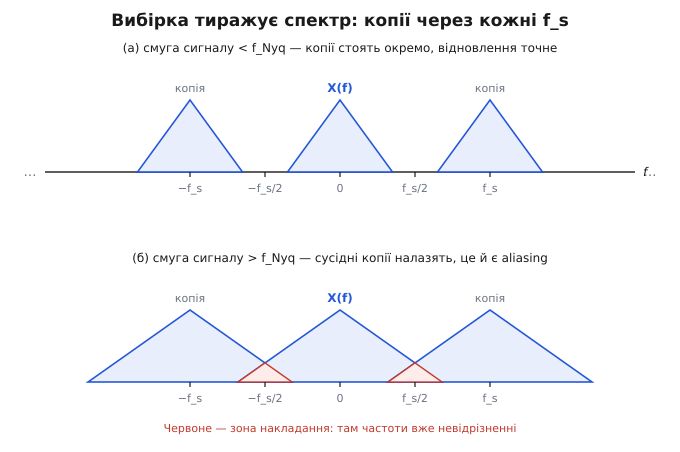
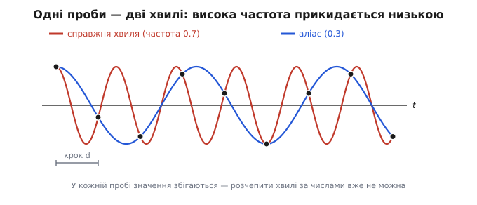

# Теорема відліків Найквіста–Шеннона

<preknowlist>
- [Спектр](topic:math-analysis/spectrum) — будь-який сигнал розкладається на суму хвиль різної частоти; спектр каже, яких частот у ньому скільки і яка з них найвища.
- [Ідея Фур'є](topic:math-analysis/fourier-idea) — подання сигналу сумою синусоїд; звідси й мова про «смугу частот», якою тут усе тримається.
</preknowlist>

Неперервну величину — звук, що тисне на мембрану, напругу на виході давача, яскравість уздовж рядка кадру — рано чи пізно доводиться заміряти не суцільно, а окремими пробами через рівний проміжок. Щойно між сусідніми пробами лишається порожнеча, постає питання, старше за будь-який пристрій: **чи можна за рідкими значеннями чесно відновити те, що діялося між ними?** Здається, це дрібниця техніки — бери проби частіше, та й по всьому. Насправді тут проходить різка, математично точна межа. Частоти нижчі за неї проби доносять **без жодної втрати**: сигнал відновлюється точно, до останньої дрібниці. Частоти вищі за неї проби **підмінюють чужими**, повільнішими, і жоден дальший алгоритм цього вже не виправить. Де саме лежить межа і чому по різні її боки все так по-різному — каже **теорема відліків** (*sampling theorem*, від англ. *to sample* — «брати пробу»).

## Головна умова: сигнал має бути обмежений за смугою

Перш ніж питати «скільки проб треба», з'ясуймо, від чого це залежить. Будь-який сигнал розкладається на суму синусоїд різної частоти — його **спектр** каже, яких частот у ньому скільки. Сигнал зветься **обмеженим за смугою** (*band-limited*), якщо в його спектрі є **найвища частота** `f_max`, а вище — порожньо: жодних коливань, дрібніших за неї. Це не технічна дрібниця, а серце всієї теореми: питання «чи вистачить проб» має сенс лише тоді, коли є що ловити, тобто коли зверху сигнал десь **закінчується**.

Частота тут — не обов'язково «за секунду». У звуку вона звична: скільки коливань за секунду, у герцах. Але частота живе в будь-якому сигналі. У зображенні вона **просторова** — скільки разів яскравість устигає змінитися на одиницю довжини: дрібний частокіл тонких смужок несе **високу** просторову частоту (світле-темне міняється на коротких відстанях), плавний градієнт неба — **низьку**. Різниця лише в осі, вздовж якої міряємо зміну — час чи простір; сама механіка дискретизації для них однакова, тож усе далі стосується і звуку, і кадру, і будь-якого потоку чисел із давача.

## Скільки проб на цикл: межа Найквіста

Тепер головне. Хай ми беремо проби через рівний крок `d` — проміжок часу між замірами або відстань між сусідніми пікселями. Частота проб тоді `f_s = 1/d`. Питання: яку найвищу частоту сигналу ці проби ще здатні **однозначно** відтворити?

Відповідь напрочуд проста. Щоб узагалі відрізнити коливання від сталого поля, на один повний цикл «більше-менше-більше» потрібно **щонайменше дві проби**: одна має впасти ближче до гребеня, друга — ближче до западини. Одна проба на цикл дає лише одне значення раз за разом — ніби сигнал і не коливається. Звідси **умова Найквіста**: частота проб мусить бути щонайменше вдвічі вища за найвищу частоту сигналу.

```
f_s ≥ 2 · f_max          умова чесної вибірки
```

Половину частоти проб — ту стелю, до якої вибірка ще правдива, — звуть **частотою Найквіста** (*Nyquist frequency*, на честь Гаррі Найквіста):

```
f_Nyq = f_s / 2 = 1 / (2·d)
```

Проби з кроком `d` чесно несуть **усі** частоти аж до `f_Nyq` — і **жодної** вище. При кроці `d = 1` це `f_Nyq = 0.5` циклу на крок: дві проби на найкоротший цикл, який сітка ще здатна намацати.

І це не просто «вдасться розрізнити» — теорема стверджує сильніше: якщо сигнал обмежений смугою нижче за `f_Nyq`, то набір проб визначає його **повністю**. Не «приблизно», не «на око» — точно, як єдину неперервну криву, що проходить через ці точки й не має в собі частот вище за межу. Як саме її звідти дістати — побачимо трохи згодом; спершу треба зрозуміти, **чому** межа падає рівно на половину.

## Чому саме половина: спектр тиражується

Інтуїція «дві проби на цикл» переконлива, та справжня причина глибша, і саме вона пояснює, що коїться з надто високими частотами. Річ у тім, що вибірка робить зі спектром цілком певну річ.

Узяти проби через крок `d` — це те саме, що помножити неперервний сигнал на нескінченну гребінку тонких сплесків, розставлених рівно через `d` (у кожній точці проби — сплеск, між ними — нуль). А множенню в часі відповідає [згортка](topic:com-signal/convolution) у частоті: спектр добутку — це спектр сигналу, «розмазаний» по спектру гребінки. Спектр же рівномірної гребінки — знову гребінка, тільки в частоті, зі сплесками через `f_s = 1/d`. Згорнути спектр сигналу з такою частотною гребінкою означає **поставити його копію біля кожного зубця** — тобто **розтиражувати** початковий спектр нескінченними двійниками, зсунутими один від одного рівно на `f_s`.

Ось звідки береться межа. Доки сигнал містить лише частоти нижчі за `f_Nyq = f_s/2`, кожна копія завширшки менша за половину періоду `f_s`, і сусідні копії **стоять окремо**, не торкаючись. Тоді центральну копію (справжній спектр) можна відділити від решти — і сигнал відновити без утрат. Але щойно в сигналі є частота **вища** за `f_Nyq`, копія стає задовгою: її край **залазить** на сусідній двійник, копії перекриваються — і в зоні перекриття вже не сказати, де чия частота.


*Угорі: сигнал у смузі до f_Nyq — копії спектра розділені чистим проміжком, центральну легко виділити. Внизу: смуга ширша за f_Nyq — сусідні копії перекриваються, і накладена ділянка вже нерозв'язна. Уся теорема — про те, торкаються копії чи ні.*

Тепер видно, що межа Найквіста — не поріг «розрізнення на око», а точна геометрична умова: **копії спектра не перекриваються тоді й лише тоді, коли смуга сигналу вужча за половину частоти проб.** «Дві проби на цикл» — це те саме, сказане в часі.

## Aliasing: коли зайві частоти перевдягаються

Розберімо, що ж діється в зоні перекриття. Частоти вище за Найквіст не зникають — вони **перевдягаються** в чужі, нижчі, і цей маскарад зветься **aliasing** (англ. *alias* — «інше ім'я, псевдонім»: частота буквально виступає під чужим іменем). У числах підміна дуже проста. Відбита, хибна частота — це відстань справжньої частоти до найближчого вузла частотної гребінки:

```
f_alias = | f_signal − k·f_s |     де k·f_s — найближчий вузол сітки
```

Візьмімо крок `d = 1`, отже `f_s = 1`, а Найквіст `0.5`. Покладімо в сигнал коливання частотою `f_signal = 0.7` — це **вище** за межу. Тоді:

```
f_alias = | 0.7 − 1.0 | = 0.3
```

Справжнє коливання частотою `0.7` пристрій покаже як **повільніше** — частотою `0.3`, ширше, ніж воно є. Це не помилка коду й не шум: це сама фізика рідкої вибірки. Наочно двійники нерозрізненні: висока синусоїда й її повільний аліас проходять через **ті самі** точки проб, тож за пробами їх ніяк не розчепити.


*Дві різні хвилі, зняті однією сіткою проб, дають однакові числа: у відліках висока частота прикидається низькою. Саме тому підміну неможливо помітити постфактум — обидві криві однаково законні для цих точок.*

Ту саму механіку легко відчути очима. Крути колесо й фотографуй його раз на оберт: на кожному знімку спиця в тому самому місці — здається, колесо стоїть. Знімай трохи рідше за оберт — колесо ніби повзе назад. Проби надто рідкі, щоб упіймати справжній рух, і підсовують **хибну, повільнішу** картину; у кіно це «ефект візка» (колеса диліжанса крутяться навспак). Видимий наслідок aliasing на регулярних візерунках — **муар** (*moiré*, від назви хвилястого шовку): райдужні розводи там, де в сцені була рівна дрібна сітка. У звуці той самий механізм дає сторонній свист-призвук, якого в оригіналі не було.

> 🔧 **Навіщо це.** Межа Найквіста — це чесний стелаж роздільності будь-якого вимірювача. Коли в специфікації звукової карти, осцилографа чи сенсора пишуть частоту дискретизації, реально «розрізняються» лише частоти **до** її половини. Практичне правило: якщо деталь, яку треба впіймати (високий обертон, тонка різьба, швидкий фронт), лежить вище за твій Найквіст — прилад її не покаже, а підмінить повільнішим двійником, ще й непомітно. Тоді або бери густішу сітку проб (вища частота дискретизації, більше пікселів), або звужуй сам сигнал, зрізаючи верх іще до вибірки.

## Відновлення: як саме з'єднати проби

Досі йшлося про те, коли відновлення **можливе**. Але теорема дає більше — вона каже, **як** його зробити, і то однозначно. Це і робить її теоремою, а не просто застереженням.

Спокуса — з'єднати проби прямими або якоюсь гладкою кривою на власний смак. Але правильна крива рівно одна. Якщо копії спектра не перекрилися, відновити сигнал означає **лишити тільки центральну копію**, викинувши всі двійники, — тобто пропустити набір проб крізь ідеальний фільтр, що зрізає все вище за Найквіст. У часі такому фільтрові відповідає цілком певна форма — функція **sinc**:

```
sinc(u) = sin(π·u) / (π·u),   причому sinc(0) = 1
```

Її властивість — ключова: `sinc(u)` дорівнює `1` у своєму центрі й **точно нулю** в кожній цілій точці ліворуч і праворуч. Тож формула відновлення (її звуть інтерполяційним рядом **Віттекера–Шеннона**) саджає в кожну пробу свій sinc, зважений значенням проби, і додає їх:

```
x(t) = Σ  x[n] · sinc( (t − n·d) / d )
       n
```

Прочитаймо, що вона робить. У момент самої проби `t = n·d` її власний sinc дає `1`, а всі чужі — рівно `0`; отже сума точно дорівнює `x[n]`. Крива **проходить через усі проби** — це очікувано. Несподіване інше: **між** пробами кожен sinc додає свій точно виважений внесок, і сума виходить **єдиною** кривою, у якій немає жодної частоти вище за Найквіст. Тобто ряд не «домальовує правдоподібно» — він відтворює **той самий** обмежений за смугою сигнал, з якого бралися проби, без жодної похибки. «З'єднати точки» — так, але єдино правильною кривою, а не прямими й не довільним сплайном.

Звідси й строга межа можливого. Повернути можна лише те, що лежало **в межах смуги**; деталь дрібнішу за Найквіст сітка не виміряла взагалі, і жодна інтерполяція її не воскресить — вона або втрачена, або (гірше) перевдяглася в аліас. Тому теорема — це рівно і обіцянка, і заборона: **усе до межі — точно; за межею — нічого.**

## Захист: зрізати верхнє ще до вибірки

З aliasing випливає незатишний висновок: **після** вибірки підміну не прибрати — хибна частота арифметично тотожна справжній низькій, розчепити їх нічим. Лишається одне: **не пустити небезпечні частоти до вибірки взагалі.** Саме це робить **антиаліасинговий фільтр** (*anti-aliasing filter*): він зрізає все вище за межу Найквіста ще **перед** тим, як узяти проби.

Логіка пряма. Aliasing трапляється лише з частотами вище за `f_Nyq`. Відітни їх заздалегідь — і в базовій смузі складатися вже **не буде чому**: копії спектра стоятимуть окремо, кожна проба нестиме чесну частоту. Фільтр свідомо **жертвує** дрібкою верхніх частот, які однаково не передалися б чесно, — заради того, щоб не з'явилися куди помітніші артефакти. Класичний інженерний обмін: програти краплю деталі, виграти відсутність муару й хибних двійників.

Утілення залежить від того, що дискретизуємо, а принцип той самий. У звуковому тракті це аналоговий низькочастотний фільтр **перед** аналого-цифровим перетворювачем: він гасить усе вище половини частоти дискретизації, тож при записі на 44.1 кГц чесно проходить смуга приблизно до 20–22 кГц (уся чутна). У камері це **оптичний** низькочастотний фільтр (*OLPF*) — тонка пластина перед сенсором, що ледь **розмиває** зображення, аби деталі, дрібніші за межу Найквіста сітки пікселів, до сенсора не дійшли. Матеріал і середовище різні, а правило залізне: **захист ставлять перед вибіркою, бо після неї вже пізно.**

## Де теорема стикається з реальністю

Теорема ідеальна, а світ — ні, і корисно знати, де ідеалізація протікає.

По-перше, **ідеального обмеження смуги не буває**: реальний фільтр зрізає верх не миттєво, а на перехідній смузі скінченної крутості. Тому частоту проб беруть із запасом над `2·f_max`, лишаючи фільтрові місце «доїхати» до нуля. Звідси й «зайві» 44.1 кГц для звуку зі стелею 20 кГц: різниця — це захисний проміжок під нахил фільтра. Той самий важіль працює і в інший бік — **надлишкова вибірка** (*oversampling*): узяти проби значно частіше, відсунути Найквіст далеко за корисну смугу, і тоді груба вимога до крутості аналогового фільтра слабшає, а головну фільтрацію роблять уже в цифрі.

По-друге, **сам ідеальний sinc недосяжний**: він нескінченний в обидва боки, тож точне відновлення потребувало б усіх проб від «мінус нескінченності». На практиці sinc обрізають вікном — і платять дрібною похибкою на краях смуги. По-третє, **сама межа `f = f_Nyq` ненадійна**: синусоїду рівно на частоті Найквіста можна впіймати нещасливо — усіма пробами в її нулях — і не побачити зовсім; тому строга умова — саме **строга** нерівність `f_s > 2·f_max`, а не «дорівнює».

І тонше уточнення: важлива не так «найвища частота», як **ширина смуги**. Якщо сигнал живе у вузькому діапазоні високо вгорі (скажімо, радіосмуга навколо великої несучої), його можна брати навіть **рідше** за `2·f_max` — так званою смуговою вибіркою (*bandpass sampling*), свідомо загорнувши смугу вниз через контрольований aliasing. Теорема від цього не ламається: чесна умова — щоб копії спектра **не перекрилися**, а це залежить від ширини зайнятої смуги, не від абсолютної висоти.

## Де це працює

Одна умова — «дві проби на найдрібніше» — керує напрочуд різними речами. У **звуці** вона задає стандарти запису: 44.1 кГц для компакт-диска, 48/96/192 кГц у студії; антиаліасинговий фільтр перед АЦП і згадані запаси — прямий наслідок теореми. У **зображенні** вона пояснює, чому «12 мегапікселів» не означає 12 мільйонів чесних деталей і навіщо перед сенсором ставлять OLPF; а коли одну сцену знімають **кількома переплетеними решітками** з різним кроком — як у [баєрівському сенсорі](topic:sf-visual/bayer-demosaic), де зелені пікселі стоять удвічі густіше за червоні й сині, — кожна решітка має **свою** межу Найквіста, і дрібний візерунок, що лежить між ними, зривається в aliasing на різних частотах, даючи несправжній колір. У **цифровій обробці** (*DSP*) теорема стоїть під децимацією, передискретизацією й будь-яким переходом між частотами дискретизації, а у **вимірюванні** — під вибором частоти опитування давача, щоб мережева наводка чи вібрація не згорнулися вниз, у смугу корисного сигналу.

## Хто відкрив: колективний результат

Теорему часто звужують до одного імені — тож варто чесно назвати всіх, бо відкривали її незалежно кілька разів. Англійський математик **Едмунд Тейлор Віттекер** (*E. T. Whittaker*) дав інтерполяційну формулу (той самий ряд із sinc) ще 1915 року. **Гаррі Найквіст** (*Harry Nyquist*, 1889–1976) — інженер Bell Labs, **народжений у Швеції** (містечко Нільсбю) і натуралізований у США після переїзду 1907-го — сформулював умову на швидкість передавання в роботі про телеграфію 1928 року. Радянський інженер **Володимир Котельников** довів сувору форму теореми 1933-го; його пріоритет визнано міжнародно — нагородою Фонду Едуарда Райна 1999 року. А **Клод Шеннон** (*Claude Shannon*) дав канонічне формулювання в теорії інформації (1948–1949), прямо посилаючись на Віттекера.

Тож це **колективний результат** (усталений факт, не спірний): чесні назви — теорема Найквіста–Шеннона, ширше Віттекера–Котельникова–Шеннона. Котельникова згадуємо не як «радянський пріоритет понад усе», а як справжнього співавтора з доведеним внеском — так само, як не приписуємо весь результат жодній одній країні чи особі.

## Підсумок

Зведімо ланцюг докупи. Питання «чи можна за пробами відновити неперервне» має точну відповідь — але лише для сигналу, **обмеженого за смугою**, у якого є найвища частота `f_max`. Тоді проби з кроком `d` чесно несуть усе до **межі Найквіста** `f_Nyq = 1/(2d)` — половини частоти проб; це та сама вимога «щонайменше дві проби на цикл». Причина рівно в тому, що вибірка **тиражує спектр** копіями через `f_s`: доки смуга вужча за половину — копії стоять окремо й сигнал відновлюється **точно**, інтерполяційним рядом Віттекера–Шеннона (кожна проба саджає свій sinc); щойно ширша — копії налазять, і частоти вище межі **перевдягаються** в нижчі за правилом `f_alias = |f_signal − k·f_s|`, даючи муар, призвук чи несправжній колір. Прибрати підміну після вибірки неможливо, тож надлишок частот зрізають **до** проб — антиаліасинговим фільтром, свідомо жертвуючи краплею дрібної деталі. Тому за рідкими пробами не можна **повернути** те, що дрібніше за межу, — можна лише точно відтворити те, що в межу вклалося. Знати, де ця межа, — і означає розуміти, докуди виміряному сигналу взагалі можна вірити.
