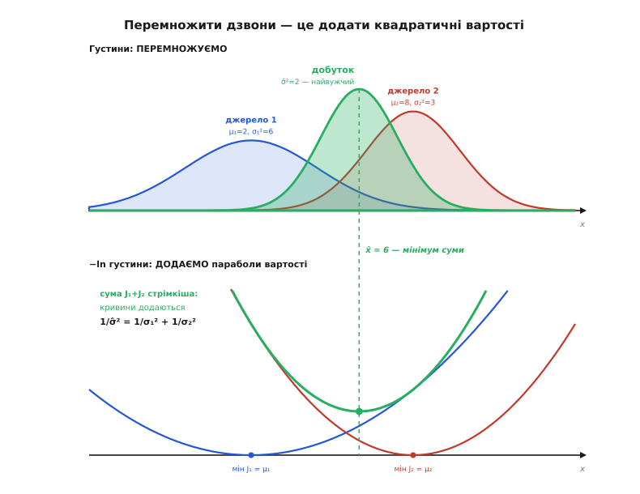

# 🧮 Добуток двох гаусіан: звідки береться обернено-дисперсійне зважування

Дві «магічні» формули оптимального злиття — центр оцінки лягає в зважене середнє з вагами 1/σ², а точності просто додаються — тут виведені з одного нехитрого факту: добуток двох гаусових щільностей знову гаусів. А насамкінець із тієї самої алгебри випаде коефіцієнт Калмана K = P⁻/(P⁻+R) — не новий об'єкт, а те саме зважування, згорнуте в один символ.

<preknowlist>
- [Нормальний (гаусів) розподіл](topic:math-probability/normal-distribution) — щільність N(x; μ, σ²) = 1/√(2πσ²)·exp(−(x−μ)²/2σ²): дзвін із вершиною при x = μ, і що менша дисперсія σ², то він вужчий та гостріший.
- [Середнє й дисперсія](topic:math-probability/mean-variance) — дисперсія σ² міряє розкид оцінки; обернена до неї величина 1/σ² — **точність**, тобто наскільки джерело певне.
- [Байєсове оцінювання](topic:math-probability/bayesian-estimation) — апостеріорна щільність пропорційна добутку апріорної на правдоподібність: новий вимір домножує попереднє переконання.
</preknowlist>

## Дві щільності, один добуток

Джерело, що стверджує «величина десь коло μ, з розкидом σ», описують [нормальною щільністю](topic:math-probability/normal-distribution) над невідомим x:

```
N(x; μ, σ²) = 1/√(2πσ²) · exp( −(x−μ)² / (2σ²) )
```

Дзвін із вершиною при x = μ; що менша дисперсія σ², то він вужчий. Маємо два незалежні джерела, N(x; μ₁, σ₁²) і N(x; μ₂, σ₂²), і хочемо оцінку, що враховує **обидва** їхні твердження воднораз. Для незалежних свідчень «і те, і те» — це добуток щільностей:

```
p(x) = N(x; μ₁, σ₁²) · N(x; μ₂, σ₂²)
```

Множники 1/√(2πσᵢ²) від x не залежать — це сталі, що лише масштабують криву, не зсуваючи й не звужуючи її. Тому стежмо за **формою**, тобто за залежністю від x, а сталі приберемо під знак пропорційності ∝:

```
p(x) ∝ exp( −(x−μ₁)²/(2σ₁²) ) · exp( −(x−μ₂)²/(2σ₂²) )
     = exp( −[ (x−μ₁)²/(2σ₁²) + (x−μ₂)²/(2σ₂²) ] )
```

Добуток експонент — це експонента суми показників. Отже вся задача звелася до одного: спростити суму двох квадратів у дужках. Якщо вона згорнеться назад в **один** квадрат виду (x − щось)², то й добуток виявиться гаусіаною — і ми одразу прочитаємо її центр та ширину.

## Зводимо два квадрати в один

Позначмо показник (без мінуса) через E і зведімо два дроби до спільного знаменника 2σ₁²σ₂²:

```
E = (x−μ₁)²/(2σ₁²) + (x−μ₂)²/(2σ₂²)

  = [ σ₂²·(x−μ₁)² + σ₁²·(x−μ₂)² ] / (2σ₁²σ₂²)
```

Розкриймо квадрати в чисельнику й зберімо за степенями x:

```
чисельник = (σ₁²+σ₂²)·x²  −  2·(μ₁σ₂² + μ₂σ₁²)·x  +  (μ₁²σ₂² + μ₂²σ₁²)
```

Це квадратний тричлен від x. Винесімо коефіцієнт при x² — саме він задасть ширину майбутнього дзвона. Дамо двом комбінаціям, що зараз з'являться, короткі імена:

```
1/σ̂²  =  (σ₁²+σ₂²)/(σ₁²σ₂²)         =  1/σ₁² + 1/σ₂²                      ← сума точностей
μ̂    =  (μ₁σ₂² + μ₂σ₁²)/(σ₁²+σ₂²)  =  (μ₁/σ₁² + μ₂/σ₂²)/(1/σ₁² + 1/σ₂²)  ← зважений центр
```

(другу рівність у кожному рядку дістаємо, поділивши чисельник і знаменник на σ₁²σ₂²). З цими іменами показник стає прозорим:

```
E = (1/(2σ̂²))·[ x² − 2·μ̂·x ] + C₀            C₀ — усе, що не містить x
```

Лишилося **доповнити квадрат**: вираз x² − 2μ̂·x — це (x − μ̂)² з відрахованим зайвим μ̂². Той μ̂² від x не залежить, тож переходить до сталої:

```
x² − 2·μ̂·x = (x − μ̂)² − μ̂²

E = (x − μ̂)² / (2σ̂²) + C₁                     C₁ = C₀ − μ̂²/(2σ̂²)
```

Підставмо це назад в експоненту. Стала C₁ дає лише множник exp(−C₁), знову-таки незалежний від x, — його поглинає нормування. Лишається чиста форма:

```
p(x) ∝ exp( −(x − μ̂)² / (2σ̂²) )
```

Це **знову гаусіана** — з центром μ̂ і дисперсією σ̂². Добуток двох дзвонів (з точністю до нормувальної сталої) є третій дзвін; жодної іншої форми звідси не постає. Алгебра скінчилася — лишилося прочитати, що вона сказала.

## Два висновки, обидва важать

**Точності додаються.** Природна валюта тут — не дисперсія σ², а обернена до неї величина 1/σ², **точність**: наскільки гострий дзвін, наскільки джерело певне. І саме точності склалися напряму:

```
1/σ̂² = 1/σ₁² + 1/σ₂²
```

> 🔧 **Навіщо це.** Точність — це «кількість інформації» про величину, і вона **адитивна**: два незалежні свідчення дають рівно стільки певності, скільки їх сума. Тому оцінювач вигідно вести не саму дисперсію, а її обернену — тоді об'єднати джерела означає просто додати точності. Дисперсії ж напряму не складаються ніколи; менша спільна дисперсія — лише наслідок цього додавання.

**Спільна оцінка вужча за обидві.** З того самого рівняння σ̂² = σ₁²σ₂²/(σ₁²+σ₂²). Розпишімо його як добуток:

```
σ̂² = σ₁² · σ₂²/(σ₁²+σ₂²) < σ₁²          (бо дріб σ₂²/(σ₁²+σ₂²) < 1)
   = σ₂² · σ₁²/(σ₁²+σ₂²) < σ₂²
```

Отже σ̂² менша **за кожну** вхідну дисперсію — навіть за меншу з двох. Додавши ще один незалежний погляд, ми ніколи не втрачаємо певності: два свідчення тісніше замикають істину, ніж будь-яке поодинці. А центр μ̂ — це [зважене середнє](topic:math-probability/weighted-average) μ₁ і μ₂ з вагами 1/σ₁² та 1/σ₂²: оцінка лягає ближче до певнішого (вужчого) джерела, бо його вага більша.

## Геометрія: перемножити дзвони = додати параболи

За цією алгеброю ховається одна проста картина. Візьмімо не саму щільність, а її **логарифм зі знаком мінус** — і кожна гаусіана обертається на параболу:

```
−ln N(x; μ, σ²) = (x−μ)² / (2σ²) + стала
```

Це чаша, що дотикається нуля при x = μ і росте, коли x відходить, — своєрідна **вартість** відхилення від того, що каже джерело. А крутість чаші — рівно точність 1/σ²: гострий дзвін дає стрімку параболу (велика ціна за відхід), розпливчастий — пологу.

Тепер згадаймо, що логарифм добутку — це сума логарифмів. Перемножити два дзвони — те саме, що **скласти дві параболи**. А сума двох парабол — знову парабола, і про неї все відомо шкільною алгеброю: її кривина є сумою кривин (**точності додаються**), а вершина сидить у зваженому центрі (**це і є μ̂**). «Доповнити квадрат» із попереднього розділу — це буквально «знайти вершину складеної параболи». І ще одне видно лише в цій картині: мінімум суми піднятий над нулем — рівно на стільки, наскільки далеко розійшлися μ₁ і μ₂. Це той самий сталий член C₁, незалежний від x: він не рухає й не звужує оцінку, а лише міряє **незгоду** джерел — і тому нормування прибирає його без сліду.


*Уся алгебра добутку одним поглядом. Згори густини перемножуються: зелений дзвін (добуток) вужчий за обидва вхідні й сидить ближче до певнішого. Знизу ті самі криві в лог-масштабі стають параболами вартості J(x) = (x−μ)²/2σ²; добуток обертається на їхню суму (зелена) — стрімкішу (кривини, тобто точності, склалися) з вершиною при x̂ = 6. Мінімум суми піднятий на 2 — це міра незгоди джерел, той сталий член, що зникає при нормуванні.*

**Числом.** Візьмімо ширше джерело з μ₁ = 2, σ₁² = 6 і вужче джерело з μ₂ = 8, σ₂² = 3:

```
1/σ̂² = 1/6 + 1/3 = 1/2                       →  σ̂² = 2       (менше і за 3, і за 6)
μ̂    = (2/6 + 8/3) / (1/2) = (1/3 + 8/3)/(1/2) = 3/(1/2) = 6
```

Спільна оцінка — 6 ± √2: вужча за обидва джерела й зсунута від їхньої середини (5) до певнішого джерела (8). Дві грубі оцінки сплавилися в точнішу за кожну.

## Один крок Байєса — і поява коефіцієнта Калмана

Той самий добуток — це один такт [байєсівського оновлення](topic:math-probability/bayesian-estimation): апостеріорна щільність пропорційна добутку апріорної на правдоподібність.

```
апостеріор(x) ∝ пріор(x) · правдоподібність(вимір | x)
```

Нехай **пріор** — це передбачення оцінювача: гаусіана N(x; θ⁻, P⁻) з центром θ⁻ і дисперсією P⁻. **Правдоподібність** дає давач: він показав z, і його шум має дисперсію R, тобто p(z | x) = N(z; x, R). Як функція від невідомого x це

```
p(z | x) ∝ exp( −(z−x)²/(2R) ) = exp( −(x−z)²/(2R) )  =  N(x; z, R)
```

— знову гаусіана, тільки з центром у z і дисперсією R. Отже правдоподібність — це рівно «друге джерело» нашого добутку, з μ₂ = z, σ₂² = R (а пріор — перше, з μ₁ = θ⁻, σ₁² = P⁻). Підставмо у вже виведені формули:

```
θ = μ̂ = (θ⁻/P⁻ + z/R) / (1/P⁻ + 1/R)          1/P = 1/P⁻ + 1/R
```

Це той самий оптимум. А тепер — головний фокус: перепишімо це зважене середнє **в один символ**. Домножмо чисельник і знаменник на P⁻·R:

```
θ = (R·θ⁻ + P⁻·z) / (P⁻ + R)                   ← зважене середнє передбачення й виміру
```

Далі винесімо θ⁻, скориставшись тим, що R·θ⁻ = (P⁻+R)·θ⁻ − P⁻·θ⁻:

```
θ = θ⁻ + P⁻·(z − θ⁻) / (P⁻ + R)
  = θ⁻ + K·(z − θ⁻),        де  K = P⁻ / (P⁻ + R)
```

Ось і все. **Коефіцієнт Калмана K = P⁻/(P⁻+R) — це не новий об'єкт, а обернено-дисперсійна вага виміру, згорнута в одну літеру.** Форма «передбачення плюс K на нев'язку (z − θ⁻)» алгебраїчно тотожна зваженому середньому: додаткової ідеї в ній немає — лише зручніший для рекурсії запис. Так само й оновлення дисперсії — це те саме додавання точностей:

```
1/P = 1/P⁻ + 1/R   →   P = P⁻·R/(P⁻+R) = (1 − K)·P⁻
```

(остання рівність: (1−K)·P⁻ = (R/(P⁻+R))·P⁻ = P⁻R/(P⁻+R)). Межі одразу читаються з K = P⁻/(P⁻+R): певний вимір (R → 0) дає K → 1, і оцінка стрибає на нього; марний вимір (R → ∞) дає K → 0, і оцінка тримається передбачення. А оскільки 1/P = 1/P⁻ + 1/R ≥ 1/P⁻, дисперсія на оновленні **ніколи не росте**.

Зіставмо два записи на тих самих числах — хай передбачення буде θ⁻ = 16.6° з P⁻ = 13, а вимір z = 22° з R = 9:

```
через коефіцієнт:  K = 13/(13+9) = 0.591
                   θ = 16.6 + 0.591·(22 − 16.6) = 19.79°
                   P = (1 − 0.591)·13           = 5.32

через добуток:     θ = (9·16.6 + 13·22)/(13+9) = 435.4/22 = 19.79°
                   1/P = 1/13 + 1/9             → P = 5.32
```

Обидва шляхи — і згорнутий у K коефіцієнт, і розписане зважене середнє — дають той самий кут і ту саму дисперсію до останньої цифри. Бо це одне: [фільтр Калмана](topic:com-signal/kalman-filter) щотакту просто перемножує дзвін передбачення на дзвін виміру, а «коефіцієнт підсилення» — лише ім'я тієї частки, з якою певніший дзвін перетягує оцінку на себе.
