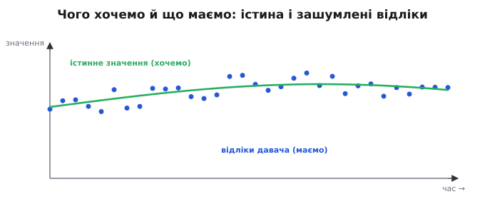
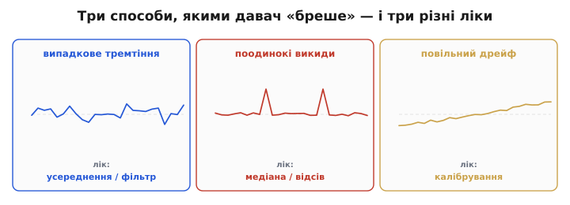
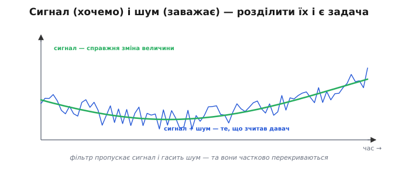
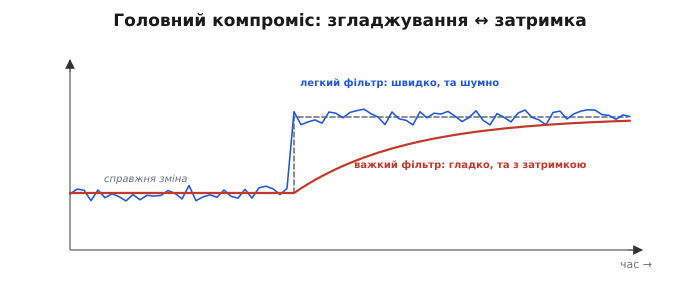
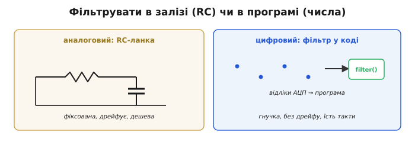
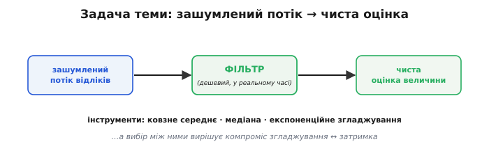

# Шум у сигналі: чому давачі «брешуть»

Якщо під'єднати будь-який давач і просто роздрукувати його відліки, побачите не рівну лінію, а **стрибанину**: число тремтить навколо справжнього значення, час від часу вистрілює дикий викид, а за хвилини непомітно сповзає вбік. Давач ніби «бреше» — і це не несправність, а норма. Причина проста: на кожній ланці вимірювального ланцюга — від [самого чутливого елемента](topic:hw-sensing/what-is-a-sensor) до АЦП — додається своя порція безладу, а [ціль і середовище](root:embedded/contactless-distance) підкидають ще. Питання цієї статті — **як саме** виглядає ця брехня в цифровому потоці й чому її не можна просто проігнорувати.

А чому взагалі не лишити сирий потік як є? Бо нефільтрований шум **проникає в рішення**. Регулятор, що слухає тремтливу відстань, сам почне сіпати моторами в такт шуму; поріг, що спрацьовує на випадковий викид, дасть фальшиву тривогу; число на екрані з шістьма цифрами шуму лише вводить в оману. Шум — не косметична вада, а реальна завада керуванню й логіці; тому фільтрація — це не «причепуритися», а зробити давач узагалі **придатним** для рішень.

### Що ми хочемо — і що насправді отримуємо

Уявімо, що давач міряє величину, яка плавно змінюється — відстань до стіни, температуру, нахил. Ми **хочемо** ту плавну криву. А **отримуємо** хмару точок, розкиданих навколо неї:


*Реальність кожного давача. Зелена крива — справжнє значення, яке ми хотіли б знати; сині точки — те, що насправді віддає АЦП: ті самі значення, але з накиданим шумом. Завдання фільтра — з хмари точок відновити криву.*

Кожен окремий відлік — це **справжнє значення плюс випадкова добавка**. Іноді добавка мала, іноді більша; знак її щоразу інший. Якби нам треба було одне-єдине число «раз і назавжди», ми б усереднили багато відліків — і шум, завдяки [статистиці випадкового розкиду](topic:hw-sensing/drift-hysteresis-noise), спав би як 1/√N. Та біда в тому, що величина **сама змінюється**, і ми хочемо стежити за нею **в реальному часі**: не «яка була температура за останню годину», а «яка вона **зараз**». Ось де починається справжня задача фільтрації.

Варто відчути різницю між двома задачами. **Лабораторна**: зміряти **сталу** величину якнайточніше — тут просто беруть тисячу відліків і усереднюють, і шум майже зникає, а час необмежений. **Реального часу**: стежити за величиною, що **живе**, віддаючи свіже число багато разів на секунду, поки апарат їде чи стабілізується. У першій задачі усереднюй скільки завгодно; у другій кожен зайвий усереднений відлік — це **затримка**, за яку доведеться платити. Уся фільтрація реального часу — про другу, найважчу задачу: очистити, **не відставши**.

І ще одне обмеження реального часу, про яке легко забути: фільтр **причинний** (від лат. *causa* — причина) — у момент t він знає лише **минулі** й поточний відліки, а майбутніх ще нема. Маючи на руках увесь запис наперед (офлайн), можна згладжувати «симетрично», зазираючи і вперед, і назад, — і затримки нема. Та апарат живе в теперішньому: він мусить віддати очищене число **зараз**, спираючись лише на те, що вже сталося. Саме причинність і породжує затримку — щоб згладити, фільтр чекає кількох відліків, а чекання це і є відставання.

### Три способи, якими давач бреше

«Шум» — слово збірне; насправді давач спотворює показ кількома **різними** способами, і дивитися на них варто вже з прицілом на ліки в коді. Розрізняти їх критично, бо кожному потрібен **інший** фільтр.


*Три обличчя «брехні» давача. Випадкове **тремтіння** — дрібні швидкі коливання навколо істини (лік — усереднення). Поодинокі **викиди** — рідкі дикі значення (лік — медіана, відсів). Повільний **дрейф** — систематичне сповзання (лік — калібрування, не фільтр).*

- **Випадкове тремтіння** (англ. *jitter* — дрож, тремтіння): дрібні швидкі коливання навколо правильного значення — [тепловий шум](topic:ph-condensed/thermal-noise), [квантування АЦП](topic:hw-analog/sampling-quantization), наводки. Воно **симетричне** й **усереднюване**: багато відліків, і їхнє середнє сходиться до істини. Це «класичний» шум, проти якого й працює більшість фільтрів.
- **Поодинокі викиди** (англ. *outlier* — те, що лежить осторонь; *spike* — сплеск): рідкі, але **дикі** значення — збій передачі, привид [багатопроменевості](topic:hw-sensing/distance-errors), випадкова наводка. Один викид може бути в десятки разів більший за корисний сигнал, і **усереднення його не лікує**, а лише розмазує. Проти викидів потрібен інший інструмент — [медіана](topic:sf-algorithms/median-filter).
- **Повільний дрейф** (англ. *drift* — повільне знесення, від *to drive* — гнати): систематичне сповзання нуля чи нахилу з температурою й часом. Це взагалі **не шум** — він не випадковий, тож жоден згладжувальний фільтр його не прибере. Дрейф лікують [калібруванням](topic:hw-sensing/calibration), і плутати його з шумом — значить лікувати не те.

Корисно уявити їх **за формою**. Тремтіння лягає симетричним «дзвоном» навколо істини ([гаусів розкид](topic:hw-sensing/drift-hysteresis-noise)), тож його середнє **і є** істина — звідси сила усереднення. Викид стоїть **осторонь** дзвона, поодинокою дикою точкою, і саме тому одне-єдине таке значення здатне зіпсувати середнє багатьох чесних — а медіану ні. Дрейф же зовсім не належить до розкиду: він повільно **тягне весь дзвін** убік, тож хоч скільки усереднюй миттєвий шум, центр усе одно поповзе. Три різні геометрії — три різні ліки, і весь фокус у тому, щоб упізнати, з якою саме маєш справу.

> 🔧 **Навіщо це.** Перше питання перед будь-яким фільтром: **яким саме способом** давач бреше? Тремтить рівномірно — усереднюй. Зрідка вистрілює — став медіану. Повільно повзе — калібруй, фільтр тут безсилий. Від цієї відповіді прямо залежить, **який рядок коду** ви напишете. Найгрубіша помилка — лити всі три біди в один «згладжувач» і дивуватися, чому не допомагає.

### Сигнал проти шуму: чому не можна просто згладити все

Здавалося б, рецепт простий: сильно згладжуй — і шум зникне. Та є пастка: разом із шумом фільтр гасить і **корисну зміну** самої величини. Бо «сигнал» (те, що ми хочемо, — справжня зміна) і «шум» (те, що заважає, — випадкова добавка) **співіснують в одному потоці чисел**, і відрізнити їх не завжди легко.

Наскільки погано — це можна **зміряти**. Беруть **відношення сигнал/шум** (англ. *signal-to-noise ratio*, SNR) — у скільки разів корисний розмах сигналу більший за розкид шуму; де воно велике, давачу можна вірити майже як є, а де мале — без фільтра не обійтися. Як саме його рахують і чому міряють у [децибелах](topic:com-signal/signal-noise/math-snr.md), варто знати наперед — від цього числа залежить, скільки взагалі треба згладжувати.

**Приклад (на скільки шумний цей давач).** Корисний сигнал гойдається з амплітудою A ≈ 1000 одиниць АЦП, а шум має середньоквадратичний розкид σ ≈ 8 одиниць. Чи треба тут узагалі фільтрувати?

```cpp
// SNR у децибелах: 20·log10(амплітуда / σ)
float A     = 1000.0f;          // розмах корисного сигналу, одиниці АЦП
float sigma = 8.0f;             // RMS-шум, ті самі одиниці
float snr_db = 20.0f * log10f(A / sigma);
//           = 20 · log10(125)
//           = 20 · 2.097  ≈  41.9 dB
```

41.9 дБ — це чистий сигнал: шум розміром у вісім одиниць губиться на тлі тисячного розмаху, і легке згладжування дасть зайву надійну цифру майже задарма. А впади SNR до ~20 дБ (шум уже десята частка сигналу) — фільтрувати довелося б серйозно. Одне число одразу підказує **масштаб біди**.


*Сигнал і шум в одному потоці. Зелена крива — справжня зміна величини (сигнал, який треба зберегти); синя — те, що зчитав давач (сигнал плюс шум). Фільтр має пропустити повільну зелену зміну й погасити швидке синє тремтіння — але якщо вони схожі за швидкістю, ідеально розділити їх не вийде.*

Рятує те, що шум і сигнал зазвичай **різняться за швидкістю**: корисна величина змінюється **повільно** (температура повзе секундами, відстань — поки рухаєшся), а шум смикається **швидко** (від відліку до відліку). Тому фільтр і будують як «**пропускач повільного, гасник швидкого**»: він довіряє плавним тенденціям і відкидає різкі сіпання. Та коли сигнал і шум **однаково швидкі** (різкий рух об'єкта проти різкого викиду), фільтр не може їх розрізнити — і будь-яке згладжування неминуче зачепить трохи й корисного. Це не дефект конкретного фільтра, а принципова межа, з якої виростає головний компроміс усієї фільтрації.

Цю різницю у швидкості зручно називати **частотою**: повільний сигнал — це низькі частоти, швидкий шум — високі. Тоді фільтр, що пропускає повільне й гасить швидке, — це **фільтр низьких частот**, і вся фільтрація, по суті, про різні способи збудувати його в коді. Сама мова частот — окрема велика тема (як [розкласти будь-який сигнал на частоти](topic:math-analysis/fourier-idea)), а тут досить інтуїції: «повільне — корисне, швидке — сміття». Вона вірна доти, доки корисна величина справді повільніша за шум; коли ж вони зливаються по швидкості, навіть найрозумніший фільтр безсилий розділити неподільне.

### Головний компроміс: згладжування проти затримки

Ось він, стрижень усієї фільтрації. Що **сильніше** фільтр згладжує (більше відліків усереднює, повільніше реагує), то **чистіший** вихід — але то **довше** він наздоганяє справжню зміну. Слабкий фільтр спритно стежить за величиною, та лишає шум; сильний дає гладку лінію, але **відстає** від подій.


*Згладжування ↔ затримка. Коли величина різко змінилась (сіра сходинка), легкий фільтр (синій) одразу стрибає за нею, але тремтить; важкий (червоний) дає гладку лінію, проте доповзає до нового значення з помітним запізненням. Безкоштовно очистити не можна — за гладкість платять швидкістю.*

Це не недолік, який можна «полагодити правильним фільтром», а **фундаментальна плата**: зменшуючи шум, ви неминуче додаєте затримку, і навпаки. Уся майстерність фільтрації — знайти на цій шкалі точку, що пасує **вашій** задачі: для повільної кімнатної температури можна згладжувати щедро (затримка байдужа), а для стабілізації, що мусить реагувати вмить, доводиться терпіти більше шуму заради швидкості. Саме цей [компроміс згладжування проти затримки](topic:com-signal/smoothing-vs-lag) і вирішує вибір фільтра.

Ціна затримки буває дорогою. Робот, що бачить перешкоду крізь важкий фільтр, дізнається про неї на частку секунди пізніше — а на швидкості це зайві сантиметри гальмівного шляху. Тому точку на шкалі «гладко ↔ швидко» обирають не на смак, а з двох чисел: **як швидко змінюється** справжня величина і **як швидко мусиш реагувати** на її зміну.

**Приклад (за гладкість платять затримкою).** Усереднення N відліків давить шум приблизно у √N разів, але затримує вихід десь на половину вікна:

```
N = 16:  шум ÷4,   та затримка ≈ 8 відліків
N = 4:   шум ÷2,   затримка ≈ 2 відліки
```

Хочеш удвічі тихіше — плати вчетверо довшим вікном і вчетверо більшою затримкою. Безкоштовного згладжування не буває: кожен крок до тиші — це крок до повільності.

> 🔧 **Навіщо це.** Не питайте «який фільтр найкращий» — питайте «**наскільки швидко мені треба реагувати**». Повільна величина, реакція не горить (кімнатна температура) — згладжуйте щедро. Треба ловити швидкі події (удар, різкий рух) — тримайте фільтр легким і миріться з шумом. Сила згладжування — це не «що точніше», а інженерне рішення під конкретну **динаміку** задачі.

### Чому в програмі, а не в залізі

Шум можна гасити й **до** АЦП — аналоговою [RC-ланкою](topic:hw-analog/rc-low-pass) просто у [вхідному тракті давача](topic:hw-sensing/sensor-input-matching). Та коли сигнал уже **в мікроконтролері як числа**, частіше фільтрують **у програмі**, і на те є вагомі причини.


*Дві площадки для фільтра. Аналогова RC-ланка перед АЦП дешева й проста, але **фіксована** (номінали не поміняєш у польоті) і сама **дрейфує**. Цифровий фільтр — кілька рядків коду над відліками: **гнучкий** (параметри міняй на льоту), **без дрейфу**, та коштує тактів процесора й пам'яті.*

Цифровий фільтр **гнучкий**: силу згладжування міняють одним числом у коді, навіть під час роботи; його легко скопіювати на десяток давачів; він **не дрейфує** від температури й старіння, бо це чиста арифметика, а не аналогові деталі. Плата — він працює лише з тим, що **вже оцифровано** (грубий шум варто прибрати аналогово ще до АЦП, поки він не зіпсував відліки), і їсть **такти** процесора та трохи пам'яті. На практиці використовують **обидва**: легка аналогова RC прибирає найвищі частоти й захищає АЦП, а тонке розумне очищення роблять уже цифрою.

Цифра вміє й те, чого аналог не може взагалі. RC-ланка згладжує **лінійно** — вона завжди трохи усереднює сусідні значення; а [медіанний](topic:sf-algorithms/median-filter) фільтр, що викидає поодинокий викид, не лишивши й сліду, — операція **нелінійна**, і лінійною аналоговою схемою (як-от RC-ланкою) її не зробиш. Так само легко цифрою змінити поведінку залежно від ситуації: пригальмувати згладжування під час швидкого руху й посилити в спокої. Плата за цю гнучкість — пам'ять під збережені відліки й такти на обчислення; тому на кволому МК фільтр теж добирають за **ціною** (саме тому [експоненційне згладжування](topic:com-signal/ema), найдешевше з усіх, таке популярне). І рахують у фільтрах часто **цілими** числами ([fixed-point](topic:hw-arch/fixed-point)), бо ділення з плаваючою комою на простому ядрі дороге.

> 🔧 **Навіщо це.** Аналоговий і цифровий фільтри не суперники, а напарники. Аналогова ланка перед АЦП — обов'язкова перша лінія (вона ще й [антиаліасна](topic:com-signal/nyquist-aliasing)); цифровий фільтр — гнучке доочищення вже в коді. Грубу високочастотну завалу глуши до АЦП, а тонке згладжування й відсів викидів роби програмою, де це дешево й мінливо.

### Скриня фільтрів

Отже, задачу можна сформулювати в одному рядку: **із зашумленого потоку відліків у реальному часі відновити чисту оцінку справжньої величини** — дешево й на скромному мікроконтролері. Просте формулювання — а за ним ховається весь баланс точності, швидкості й ціни обчислень.


*Карта фільтрації. Зашумлений потік відліків проходить крізь фільтр і виходить чистою оцінкою. Основні інструменти: [ковзне середнє](topic:com-signal/moving-average), [медіана](topic:sf-algorithms/median-filter), [експоненційне згладжування](topic:com-signal/ema) — а керує їхнім вибором [компроміс згладжування ↔ затримка](topic:com-signal/smoothing-vs-lag).*

Для цього є три прості, але різні за вдачею інструменти. [Ковзне середнє](topic:com-signal/moving-average) — найпряміше усереднення останніх кількох відліків; чудове проти тремтіння. [Медіанний фільтр](topic:sf-algorithms/median-filter) — бере не середнє, а **середній за величиною** елемент; незамінний проти викидів. [Експоненційне згладжування](topic:com-signal/ema) — найдешевше на МК, плавно «забуває» старе; зручне там, де пам'ять і такти на вагу золота. Кожен має свою сильну зону, і [вибір між ними](root:embedded/choosing-a-filter) — окрема інженерна вправа.

Чому аж три, а не один універсальний? Бо давач бреше по-різному, і **жоден** фільтр не добрий проти всього. Ковзне середнє чудово гладить тремтіння, але викид розмаже на сусідів; медіана вбиває викид, та слабше гладить дрібний шум; EMA найдешевша, але має свій характер затримки. Часто їх навіть **поєднують** у ланцюжок: спершу медіана прибере викиди, потім середнє чи EMA догладить решту. Тобто фільтрація — не пошук одного «найкращого», а складання **ланцюга** під конкретну суміш брехні, рівно як [вимірювальний тракт давача](topic:hw-sensing/what-is-a-sensor) складають з окремих ланок.

Та перш ніж брати інструмент, варто чесно засвоїти головне: давач не бреше «зі зла» — він чесно віддає правду, замішану з шумом, викидами й дрейфом. Наша робота — не повірити сирому числу й не відкинути його, а **розумно очистити**, знаючи, з якою саме брехнею маємо справу. І варто пам'ятати межу: фільтр не **створює** правди, якої нема у відліках, — він лише розумно зважує те, що давач уже сказав. Тому навіть очищений показ лишається **оцінкою**, а не одкровенням; фільтр робить її кращою, не ідеальною.

---
