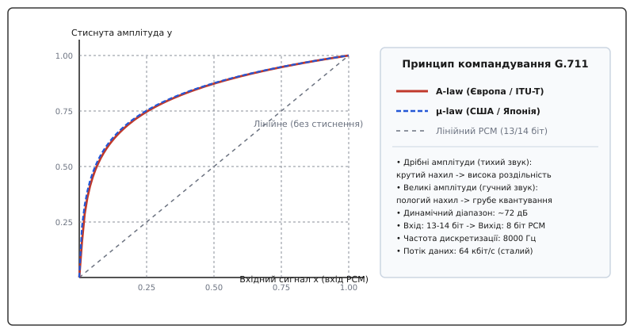
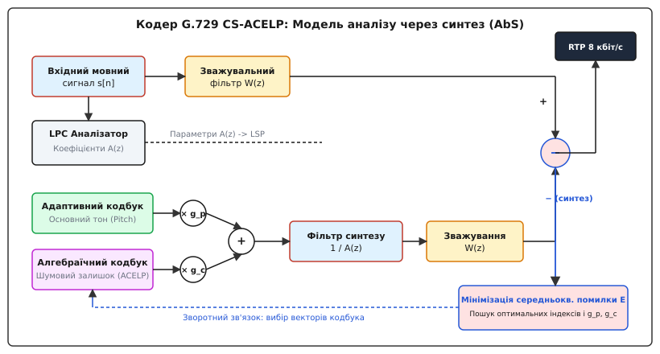
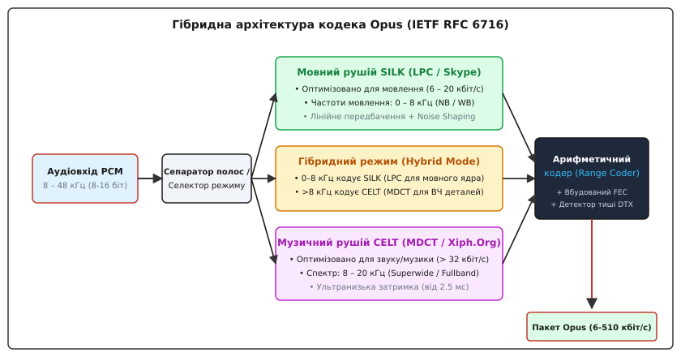
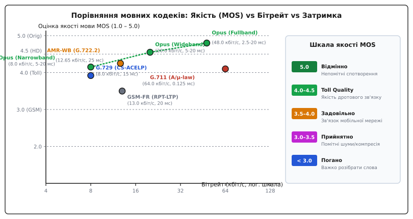

# Мовні кодеки: G.711, G.729, Opus

<preknowlist>
- [Дискретизація та теорема Котельникова](root:com-signal/sampling-reconstruction) — оцифрування неперервного аналогового сигналу за частотою Найквіста.
- [Квантування сигналу](root:com-signal/nyquist-aliasing) — перетворення неперервних амплітуд у дискретні рівні та шуми квантування.
- [Дискретне косинусне перетворення](root:sf-visual/video-color-standards-gamut-transfer) — спектральний аналіз і компактне представлення сигналів у частотній області.
</preknowlist>

Передавання акустичного сигналу людського голосу через телекомунікаційні мережі зіштовхується з жорстким фізичним обмеженням: передавання нестиснутого лінійного 16-бітного PCM-аудіо із частотою дискретизації 8 кГц (128 кбіт/с) або 48 кГц (768 кбіт/с) через тисячі одночасних телефонних каналів чи нестабільні бездротові IP-мережі швидко вичерпує пропускну здатність каналів та ресурси збереження. Просте зменшення частоти дискретизації чи зменшення розрядності квантування викликає катастрофічний шум квантування та знищує високочастотні форманти, перетворюючи мову на металевий роботизований гул. Мовні кодеки вирішують цю проблему не за рахунок універсальних алгоритмів стиснення даних, а завдяки використанню фізики голосоутворення (акустичної моделі голосового тракту) та психоакустики, що дозволяє стиснути мову на порядок — до 8 кбіт/с чи навіть 6 кбіт/с — при збереженні її високої розбірливості та природності.

Історично мовна компресія пройшла шлях від простих хвильових алгоритмів миттєвого компандування до складних аналітико-синтетичних моделей та сучасних уніфікованих гібридних кодеків реального часу. [Історія мовної компресії](root:com-signal/speech-codecs/hist-speech-codecs.md) показує, як еволюція від вокодера Гомера Дадлі до стандарту Opus була продиктована потребами фізичних каналів зв'язку.

## 1. Фізична природа мовного сигналу та межі лінійного оцифрування

Людська мова суттєво відрізняється від довільного акустичного звуку або інструментальної музики. Процес голосоутворення описується акустичною джерельно-фільтровою моделлю (Source-Filter Model). Анатомічно мовний апарат людини складається з двох основних функціональних блоків:
1. **Джерело збудження** (гортань та голосові зв'язки): під тиском повітря з легень голосові зв'язки періодично змикаються та розмикаються, генеруючи послідовність акустичних імпульсів із частотою основного тону `F₀` (від 80 Гц до 150 Гц у чоловіків, від 150 Гц до 250 Гц у жінок та понад 300 Гц у дітей). Це збудження створює дзвінкі мовні звуки (голосні `а`, `о`, `у`). Якщо ж голосові зв'язки розслаблені, а повітря з турбулентністю проходить через вузькі щілини мовного тракту, виникає шуподібне збудження, яке формує глухі приголосні (`с`, `ф`, `ш`).
2. **Акустичний фільтр** (голосовий тракт): глотка, ротова та носова порожнини діють як резонатор зі змінною геометрією. Цей тракт посилює певні резонансні частоти та послаблює інші. Резонансні піки огинаючої спектра називаються *формантами* (від лат. *formans* — той, що надає форми). Положення перших трьох формант (перша форманта `F₁` від 300 Гц до 900 Гц, друга `F₂` від 800 Гц до 2400 Гц, третя `F₃` від 2000 Гц до 3500 Гц) повністю визначає фонетичний зміст сказаного голосного звуку.

Мовний сигнал є квазістаціонарним: його спектральні характеристики лишаються відносно сталими лише на коротких інтервалах часу тривалістю 10–30 мілісекунд. Для спектрального аналізу сигнал розбивають на коротівіконні кадри за допомогою зважувальних вікон Хеммінга або Блекмана, що виключає спектральний витік на межах блоків.

У класичному лінійному оцифруванні PCM (Pulse Code Modulation) мовний сигнал дискретизується з частотою 8000 Гц (згідно з теоремою Найквіста-Котельникова, це покриває смугу частот до 4000 Гц, що достатньо для телефонного зв'язку) та квантується 16 бітами на відлік. Це створює потік даних:

```
B_linear = 8000 відліків/с · 16 біт/відлік = 128 000 біт/с = 128 кбіт/с
```

Спроба зменшити цей потік шляхом лінійного зменшення розрядності до 8 біт дає 64 кбіт/с, однак призводить до нестерпного рівня шуму квантування на тихих ділянках сигналу. Оскільки людське вухо сприймає гучність звуку за логарифмічною шкалою (закон Вебера-Фехнера), рівномірна сітка квантування є некоректною: вона витрачає занадто багато рівнів на високі амплітуди, які бувають рідко, та катастрофічно спотворює дрібні амплітуди тихих звуків.

Для стиснення мови використовують два принципово різних підходи:
- **Хвильові кодеки (Waveform Codecs)**: кодують безпосередньо форму акустичної хвилі без прив'язки до анатомії мовлення. Вони мають мінімальну затримку та високу простість, але обмежений коефіцієнт стиснення (наприклад, G.711).
- **Модельні кодеки (Model-based / Vocoders)**: аналізують мовний сигнал, вилучають математичні параметри джерела збудження та фільтра голосового тракту, передають лише ці параметри, а на приймальній стороні синтезують мову заново (наприклад, G.729).

## 2. Перша ера IP-телефонії: Хвильовий кодек G.711 та логарифмічне квантування

Стандарт ITU-T G.711, прийнятий у 1972 році, є фундаментом цифрової телефонії TDM (Time-Division Multiplexing) та першого покоління VoIP. G.711 кодує мовний сигнал із частотою дискретизації 8000 Гц та розрядністю 8 біт на відлік, забезпечуючи сталий бітрейт 64 кбіт/с.

Секрет успіху G.711 полягає у застосуванні миттєвого логарифмічного компандування (від англ. *companding*: *compressing* + *expanding*). Замість рівномірного квантування, вхідний лінійний 13-бітний або 14-бітний PCM-сигнал стискається логарифмічною функцією перед квантуванням у 8 біт, а при декодуванні розгортається назад.

Стандарт визначає дві рівноцінні логарифмічні характеристики:
1. **A-law (A-закон)**: використовується в Європі, Азії та міжнародних каналах.
2. **µ-law (mu-law, micro-law)**: використовується в Північній Америці та Японії.

Передавальна характеристика A-law описується відрізково-лінійною апроксимацією логарифмічної функції:

```
y(x) = sign(x) · ( A · |x| ) ÷ ( 1 + ln(A) ),                 при 0 ≤ |x| ≤ 1/A
y(x) = sign(x) · ( 1 + ln(A · |x|) ) ÷ ( 1 + ln(A) ),        при 1/A < |x| ≤ 1
```

де `A = 87.6` — константа стиснення. На практиці ця характеристика апроксимується 13 лінійними сегментами (хордами). Для малих сигналів (нижче `1/A`) функція є строго лінійною з максимальним нахилом, що забезпечує точне квантування тихих звуків та мінімальний шум квантування. Для великих сигналів нахил логарифмічно зменшується.

Характеристика µ-law описується формулою:

```
y(x) = sign(x) · ln( 1 + μ · |x| ) ÷ ln( 1 + μ )
```

де `μ = 255`. Вона апроксимується 15 лінійними сегментами та має дещо краще співвідношення сигнал/шум квантування (SQNR) для зовсім тихих сигналів. Середнє значення SQNR для обох законів лишається майже незмінним на рівні 38 дБ у широкому динамічному діапазоні вхідних сигналів понад 40 дБ.


*Характеристики стиснення амплітуди A-law та µ-law у кодеку G.711: нелінійний нахил розширює динамічний діапазон 8-бітного квантування до рівня 13–14 біт.*

Завдяки логарифмічному квантуванню 8-бітний байт G.711 забезпечує динамічний діапазон близько 72 дБ для A-law та 78 дБ для µ-law, що еквівалентно 13-бітному та 14-бітному лінійному PCM відповідно.

Формат 8-бітного кадру G.711 A-law містить три поля:
- **Біт 7 (MSB)**: знаковий біт `s` (`1` для додатних амплітуд, `0` для від'ємних).
- **Біти 6–4**: 3 біти номера сегмента `eee` (значення від 000 до 111, яке визначає експоненту або масштабний інтервал).
- **Біти 3–0**: 4 біти квантованої мантиси `ssss` (позиція всередині сегмента).

Кодування реалізується без обчислення логарифмів — за допомогою швидких побітових зсувів або таблиць LUT. [Реалізація кодека G.711](root:com-signal/speech-codecs/proj-g711-codec.md) демонструє робочий C та C++ код перетворення PCM у A-law/µ-law та зворотного декодування.

Ключові параметри та компроміси G.711:
- **Смуга частот**: 300 – 3400 Гц (узкосмуговий телефонний канал, Narrowband).
- **Затримка (Algorithmic Delay)**: 0.125 мс (рівно 1 відлік при 8000 Гц). Обчислювальне навантаження становить менше 1 MIPS на канал.
- **Оцінка якості мови MOS (Mean Opinion Score)**: 4.1 з 5.0 (так звана якість дротового каналу, Toll Quality).
- **Недолік**: високий сталий бітрейт 64 кбіт/с (плюс заголовки IP/UDP/RTP створюють підсумковий потік ~87.2 кбіт/с).

## 3. Друга ера: Модельний кодек G.729 та лінійне передбачення (ACELP)

З появою IP-телефонії 1990-х років та супутникових каналів зв'язку потік 64 кбіт/с виявився занадто дорогим. Стандарт ITU-T G.729, прийнятий у 1996 році, досяг фундаментального прориву: він зменшив бітрейт у 8 разів — до **8 кбіт/с** — зберігши якість мови на рівні MOS 3.92 (майже невідмітно від G.711).

В основі G.729 лежить алгоритм **CS-ACELP** (Conjugate-Structure Algebraic Code-Excited Linear Prediction). Алгоритм базується на джерельно-фільтровій моделі та лінійному передбаченні (LPC).

### Лінійне передбачення (LPC) та рекурсія Левінсона-Дурбіна
Голосовий тракт моделюється авторегресійним цифровим фільтром 10-го порядку `1 / A(z)`. Поточний відлік мови `s[n]` передбачається як лінійна комбінація 10 попередніх відліків:

```
s[n] = ∑_{k=1}^{10} a[k] · s[n-k] + e[n]
```

де `a[k]` — коефіцієнти передбачення, а `e[n]` — залишок передбачення (помилка). 

Кодер обчислює коефіцієнти `a[k]` один раз на кадр (10 мс, 80 відліків) шляхом мінімізації енергії залишку `e[n]`. Це приводить до системи автокореляційних рівнянь Юла-Вокера, яка розв'язується через [математичну рекурсію Левінсона-Дурбіна](root:com-signal/speech-codecs/math-lpc-acelp.md). Отримані коефіцієнти перетворюються у стійку до помилок квантування форму лінійних спектральних пар (Line Spectral Pairs, LSP).

### Модель аналізу через синтез (Analysis-by-Synthesis, AbS)
Просте відкрите кодування залишку `e[n]` не забезпечує високої якості при низькому бітрейті. Тому G.729 застосовує замкнений цикл зворотної реакції — аналіз через синтез.


*Контур аналізу через синтез кодера G.729: генератори адаптивного та алгебраїчного кодбуків створюють кандидатний вектор збудження, який пропускається через фільтр синтезу та порівнюється із цільовим мовним сигналом.*

Як видно зі схеми, кодер G.729 містить у собі повний декодер. Для кожного субкадру (5 мс, 40 відліків) кодер генерує вектор збудження `u[n]`, який складається з двох компонентів:

```
u[n] = g_p · v[n] + g_c · c[n]
```

1. **Адаптивний кодбук (Adaptive Codebook)**: генерує вектор `v[n]`, що моделює періодичність основного тону голосу (Pitch Lag). Вбудований аналізатор шукає затримку основного тону `T` у діапазоні від 19.5 до 143 відліків з дробовою точністю до 1/3 відліку (за допомогою інтерполяційних sinc-фільтрів) та множник підсилення `g_p`.
2. **Алгебраїчний інноваційний кодбук (Algebraic Codebook)**: генерує розріджений вектор `c[n]` з 4 ненульових імпульсів амплітудою `±1`, що моделює шумовий залишок та фонемні транзієнти.

Згенероване збудження пропускається через фільтр синтезу `1 / A(z)`, після чого обидва сигнали (вхідна мова та синтезована) пропускаються через **психоакустичний зважувальний фільтр W(z)**:

```
W(z) = A( z / γ₁ ) ÷ A( z / γ₂ ),             де γ₁ = 0.9, γ₂ = 0.6
```

Фільтр `W(z)` пригнічує шуми квантування у спектральних долинах між формантами та ховає їх під піками формант, де людське вухо їх не чує (ефект частотного маскування).

Кодер виконує перебір індексів кодбуків та шукає комбінацію, яка мінімізує середньоквадратичну зважену помилку `E`:

```
E = ∑_{n=0}^{39} ( x[n] - y[n] )²
```

де `x[n]` — зважений вхідний мовний сигнал, а `y[n]` — зважений синтезований сигнал.

### Структура кадру G.729 (80 біт на 10 мс)
Уся інформація про 10 мс мови упаковується рівно у 80 біт (8000 біт/с):

| Параметр кадру G.729 | Кількість біт | Опис |
| :--- | :--- | :--- |
| **Коефіцієнти LSF (LSP)** | 18 біт | Спектральна огинаюча (векторне квантування 10 пар LSF) |
| **Затримка Pitch (Субкадр 1)** | 8 біт | Затримка основного тону адаптивного кодбука (дробова точність) |
| **Затримка Pitch (Субкадр 2)** | 5 біт | Диференційна затримка основного тону |
| **Парність Pitch (Parity)** | 1 біт | Біт виявлення помилок для захисту основного тону |
| **Алгебраїчний кодбук (Субкадр 1)** | 13 біт | Позиції та знаки 4 імпульсів ACELP |
| **Алгебраїчний кодбук (Субкадр 2)** | 13 біт | Позиції та знаки 4 імпульсів ACELP |
| **Підсилення g_p, g_c (Субкадр 1)** | 11 біт | Спільне сопряжене векторне квантування підсилень |
| **Підсилення g_p, g_c (Субкадр 2)** | 11 біт | Спільне сопряжене векторне квантування підсилень |
| **Всього на кадр 10 мс** | **80 біт** | **Бітрейт: 80 біт / 0.01 с = 8000 біт/с** |

Часові характеристики G.729:
- **Тривалість кадру**: 10 мс (80 відліків).
- **Алгориметричний Lookahead**: 5 мс (додаткове вікно аналізу майбутнього сигналу).
- **Загальна алгоритмічна затримка**: 10 мс + 5 мс = 15 мс.
- **Обчислювальна складність**: близько 20 MIPS, вимагає спеціалізованого DSP-процесора.

Модифікації стандарту: **G.729A** (спрощена версія з низьким навантаженням DSP ~10 MIPS, сумісна за бітовим потоком) та **G.729B** (з підтримкою детектора тиші VAD та генератора комфортного шуму CNG, що дозволяє зменшити середній бітрейт у паузах розмови до 2 кбіт/с).

## 4. Сучасне коронування: Гібридний універсальний кодек Opus (RFC 6716)

Розвиток інтерактивних мультимедійних сервісів (WebRTC, конференції HD, ігрові голосові чати Discord, месенджери Telegram та WhatsApp) виявив обмеження застарілих кодеків: G.711 споживав забагато трафіку, G.729 спотворював музику та фонові звуки до непізнаваності, а класичні аудіокодеки (MP3, AAC) мали нестерпні для розмови затримки (100–200 мс).

У вересні 2012 року IETF прийняв стандарт **Opus** (RFC 6716), який став результатом об'єднання розробок Skype (кодек SILK) та Xiph.Org (кодек CELT). Opus є абсолютно відкритим кодеком без патентних відрахувань.

### Гібридна архітектура
Opus об'єднує два принципово різних рушії кодування всередині одного архітектурного каркаса:


*Гібридна структура Opus: вхідний аудіопотік аналізується та спрямовується у мовний LPC-рушій SILK, спектральний MDCT-рушій CELT або в обоє одночасно у гібридному режимі.*

1. **Рушій SILK**: заснований на алгоритмі LPC із передбаченням багаторазового порядку та шумовими фільтрами (Shaped Noise Insertion). Оптимізований для розпізнавання мови на низьких бітрейтах (від 6 до 20 кбіт/с) у вузькосмуговому (NB, 8 кГц) та широкосмуговому (WB, 16 кГц) діапазонах.
2. **Рушій CELT (Constrained-Energy Lapped Transform)**: заснований на модифікованому дискретному косинусному перетворенні (MDCT). Він не використовує модель людського мовного тракту, а кодує частотні смуги енергії за психоакустичною моделлю маскування. Оптимізований для передавання музики та звуку з наднизькою затримкою (від 2.5 мс) на бітрейтах від 32 до 510 кбіт/с.
3. **Гібридний режим (Hybrid Mode)**: унікальна риса Opus для передавання мови високої чіткості (Fullband Speech). Низькочастотну основу мови (0 – 8 кГц) кодує LPC-рушій SILK для збереження форми формант, а високочастотні деталі (8 – 20 кГц) паралельно кодує MDCT-рушій CELT.

### Динамічна адаптивність Opus
Opus є найгнучкішим аудіокодеком у світі. Перемикання режимів відбувається на льоту всередині бітового потоку без розриву з'єднання чи викривлень звуку:

- **Частоти дискретизації**: 8000 Гц (NB), 12000 Гц (MB), 16000 Гц (WB), 24000 Гц (SWB), 48000 Гц (FB).
- **Бітрейт**: від 6 кбіт/с (вузькосмугова мова) до 510 кбіт/с (Hi-Res стереоаудіо). Підтримуються режими постійного (CBR), змінного (VBR) та обмежено-змінного (Constrained VBR) бітрейту.
- **Розмір кадру (затримка)**: 2.5 мс, 5 мс, 10 мс, 20 мс, 40 мс, 60 мс, 80 мс, 100 мс, 120 мс. Мінімальна алгоритмічна затримка становить всього 5 мс (кадр 2.5 мс + 2.5 мс lookahead у режимі CELT).

### Вбудовані механізми стійкості до втрат пакетів
Opus розроблявся для нестабільних IP-мереж Інтернету (Wi-Fi, LTE, 5G), де втрати пакетів можуть досягати 10–20%:
- **Вбудована компенсація втрат пакетів (In-band Forward Error Correction, FEC)**: кодер додає у поточний пакет дубльовану стиснуту інформацію низької роздільності про *попередній* кадр. Якщо попередній пакет губиться у мережі, декодер вилучає його резервну копію з наступного пакета без запиту повторного передавання (ARQ).
- **Маскування втрат пакетів (Packet Loss Concealment, PLC)**: якщо пакет остаточно втрачено, декодер синтезує плавну екстраполяцію мовного сигналу на основі історії збудження LPC та тональності Pitch.
- **Детектор тиші (DTX) та комфортний шум (CNG)**: під час пауз у розмові передавання пакетів припиняється, а на приймальній стороні підмішується комфортний фоновий шум, що економить до 50% мережевого трафіку.
- **Арифметичний ентропійний кодер (Range Encoder)**: усі коефіцієнти SILK та CELT упаковуються високорентабельним арифметичним кодером діапазону.

Програмування інтеграції Opus здійснюється через C-бібліотеку `libopus`. [API бібліотеки libopus](root:com-signal/speech-codecs/api-opus-encoder.md) дає вичерпну довідку по керуванню структурою кодера, налаштуванню складності (Complexity 0–10) та обробці помилок.

## 5. Системний порівняльний аналіз та компроміси інженерії

Вибір мовного кодека для телекомунікаційної системи завжди є пошуком компромісу між чотирма фундаментальними ресурсами: **смугою пропускання (бітрейтом)**, **затримкою (латентністю)**, **якістю відтворення (оцінкою MOS)** та **обчислювальною складністю (MIPS/RAM)**.


*Порівняльна діаграма ефективності мовних кодеків: Opus перевершує за якістю (MOS) традиційні стандарти на будь-якому бітрейті, зберігаючи мінімальну затримку.*

### Зведена порівняльна таблиця характеристик кодеків

| Характеристика / Кодек | G.711 A-law / µ-law | G.729 / G.729A | Opus (Narrowband) | Opus (Fullband HD) |
| :--- | :--- | :--- | :--- | :--- |
| **Організація-розробник** | ITU-T (1972) | ITU-T (1996) | IETF / Skype / Xiph (2012) | IETF / Skype / Xiph (2012) |
| **Тип кодувальника** | Хвильовий (PCM Log) | Модельний (CS-ACELP) | Гібридний (SILK/LPC) | Гібридний (CELT/MDCT) |
| **Бітрейт мовного ядра** | 64 кбіт/с (сталий) | 8 кбіт/с (сталий) | 6 – 12 кбіт/с (динам.) | 24 – 510 кбіт/с (динам.) |
| **Смуга аудіочастот** | 300 – 3400 Гц (NB) | 300 – 3400 Гц (NB) | 50 – 4000 Гц (NB) | 20 – 20000 Гц (FB) |
| **Частота дискретизації** | 8000 Гц | 8000 Гц | 8000 Гц | 48000 Гц |
| **Тривалість кадру** | 0.125 мс (1 відлік) | 10 мс | 20 мс (від 2.5 мс) | 20 мс (від 2.5 мс) |
| **Алгоритмічна затримка** | 0.125 мс | 15 мс (10 кадр + 5 lookahead) | 25 мс (20 кадр + 5 lookahead) | 5 мс (2.5 кадр + 2.5 lookahead) |
| **Оцінка якості мови (MOS)** | 4.10 | 3.92 | 4.15 | 4.85 |
| **Обчислювальна складність** | < 1 MIPS | ~20 MIPS (G.729A ~10 MIPS) | ~15 MIPS | ~25–40 MIPS |
| **Патентний статус** | Вільний (патент вигас) | Патентований (вигас 2017) | Відкритий / Роялті-фрі | Відкритий / Роялті-фрі |
| **Стійкість до втрат (Packet Loss)** | Низька (потрібен PLC) | Середня (залежність кадрів) | Надвисока (In-band FEC + DTX) | Надвисока (In-band FEC) |

> 🔧 **Навіщо це.**
> У розробці сучасних WebRTC-застосунків, SIP-АТС (Asterisk, FreeSWITCH) та SFU-серверів (Mediasoup, Janus) правильний вибір та конфігурація кодека визначає стабільність зв'язку під навантаженням.
> 
> 1. **Шіппінг трафіку та розрахунок оверхеду RTP**:
>    Пакет мови передається за стеком `Ethernet / IPv4 / UDP / RTP`. Сумарний розмір заголовків становить `14 (Eth) + 20 (IPv4) + 8 (UDP) + 12 (RTP) = 54 байти`. У випадку протоколу IPv6 розмір IP-заголовка збільшується з 20 до 40 байт, підвищуючи оверхед до 74 байт.
>    - Для **G.711** (кадр 20 мс = 160 байт мови): підсумковий потік дорівнює `(160 + 54) байти · 50 пакетів/с · 8 біт = 85.6 кбіт/с`.
>    - Для **G.729** (кадр 20 мс = 20 байт мови): підсумковий потік дорівнює `(20 + 54) байти · 50 пакетів/с · 8 біт = 29.6 кбіт/с`. Заголовки займають 73% усього мережевого трафіку! Вирішенням є транскодування або об'єднання кадрів (packing factor 2 = 40 мс на пакет).
>    - Для **Opus**: завдяки динамічному бітрейту WebRTC-протокол через алгоритм GCC (Google Congestion Control) аналізує `RTT` та втрати пакетів `RTCP Receiver Report`. При погіршенні мережі сервер віддає команду Opus зменшити бітрейт з 32 кбіт/с до 8 кбіт/с та включити `OPUS_SET_INBAND_FEC(1)` без розриву сесії.
> 
> 2. **Простеження процесу через Linux sysfs/procfs та tracepoints**:
>    Під час аналізу продуктивності медіа-сервера під навантаженням 10 000 голосових каналів, системні інженери відстежують навантаження на CPU та стек сокетів UDP через системний інтерфейс `/proc/net/udp` та утиліту `perf`:
>    ```bash
>    # Моніторинг втрат пакетів UDP на рівні ядра Linux
>    cat /proc/net/snmp | grep Udp:
>    # Поля InErrors та RcvbufErrors показують пропуски через переповнення буферів сокета
> 
>    # Простеження викликів кодування Opus у медіа-сервері за допомогою perf trace
>    sudo perf trace -e override__opus_encode --call-graph fp -p $(pgrep asterisk)
>    ```
> 
> 3. **Перекодування (Transcoding) та Generation Loss**:
>    Декодування G.729 у лінійний PCM з подальшим кодуванням у G.711 на медіа-шлюзі створює затримку обробки та накопичувальні спотворення (Generation Loss). Якщо сервер працює в режимі Passthrough (без перекодування, пряма пересилка RTP-пакетів між абонентами), навантаження на CPU прямує до нуля, а затримка зводиться до мережевого RTT. Сучасна інженерна архітектура будується на уніфікованому стандарті Opus від клієнта до клієнта.
