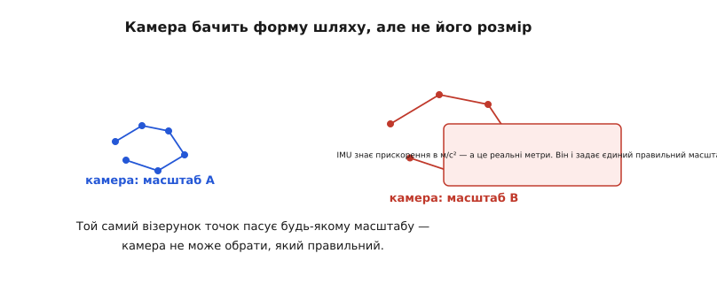
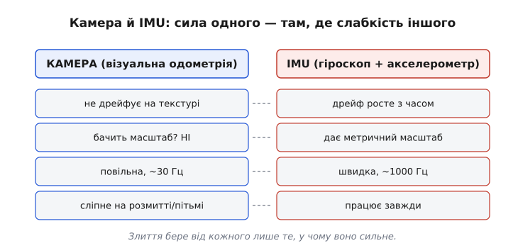
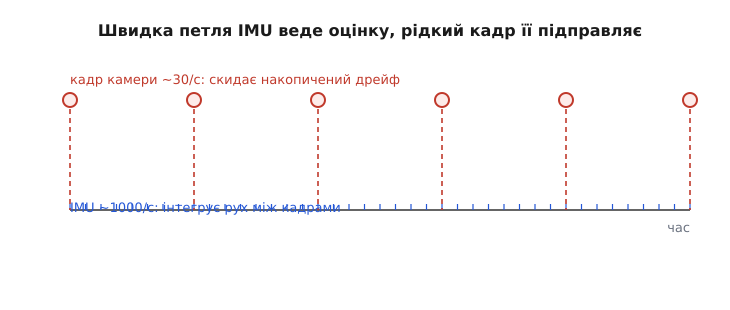

# Візуально-інерціальна одометрія

Дайте дрону дві прості речі — маленьку камеру, що дивиться вниз, і дешевий інерційний давач завбільшки з рисове зернятко, — і він знатиме, де він, з точністю до сантиметрів, без жодного супутника, у темному складі чи в марсіанському каньйоні. Це вже не фантастика: саме так тримає позицію ваш телефон у доповненій реальності й саме так літав марсіанський вертоліт. Секрет — у тому, як ці два давачі стуляються докупи. Візуально-інерціальна одометрія (одометрія — від грецьких *hodós* «шлях» і *métron* «міра»; *інерціальна* — від латинського *inertia* «нерухомість, млявість», бо йдеться про давач, що чує саму інерцію тіла) — це мистецтво зліпити з ока-камери й вуха-інерції одне надійне чуття власного руху там, де жодне з двох поодинці не витягує.

Щоб зрозуміти, чому саме ця пара, а не якась інша, треба спершу чесно глянути, чого кожному з двох давачів бракує наодинці. Бо вся ідея VIO виростає рівно з того, що їхні слабкості — **дзеркальні**.

> 🔧 **Навіщо це.** Візуально-інерціальна одометрія — це те, що дає рухомій машині чуття положення там, де GPS мовчить: у приміщенні, під мостом, у тунелі, в ущелині, на іншій планеті. Дрон утримується над однією точкою в складі; робот-кур'єр їде коридором лікарні; телефон ставить віртуальний диван у вашу кімнату так, що той не «пливе». Скрізь, де треба знати «де я» без зовнішнього маяка, але з камерою й інерцією на борту, працює саме VIO.

## Дві однобокі оцінки

Почнімо з камери. [Візуальна одометрія](root:sf-visual/optical-flow) дивиться, як між двома кадрами зсунулися характерні точки сцени — кут ящика, плямка на підлозі, — і з цього зсуву обчислює, як перемістилася сама камера. Світ поїхав на кадрі ліворуч — отже, камера зрушила праворуч. Це напрочуд точне джерело: на текстурній, багатій прикметами сцені воно майже **не дрейфує накоротко**, бо кожен кадр — це свіжий погляд на реальні нерухомі орієнтири, а не сліпе інтегрування.

Та в камери є дві вроджені вади, і обидві болючі. Перша: вона **сліпне** там, де оку немає за що зачепитися — гладка біла стіна, темрява, туман, різке розмиття від швидкого руху. Немає прикмет — немає й оцінки зсуву, і на цих кадрах візуальна одометрія просто провалюється. Друга, ще підступніша: одна камера **не бачить масштабу**. Вона чесно каже вам форму шляху — «зсунулися отуди, повернули отак», — але не може сказати, чи це був сантиметр, чи метр. Маленька близька сцена й велика далека дають на кадрі однаковий зсув точок.


*Однакове зміщення характерних точок між кадрами відповідає і маленькому шляху зблизька, і великому здалеку — сама камера не має чим обрати правильний. Інерційний давач міряє прискорення в реальних метрах за секунду в квадраті й тим прив'язує візуальну форму до єдиного справжнього масштабу.*

Тепер — [інерційний давач (IMU)](root:hw-sensing/imu). Він міряє прискорення й кутову швидкість самого тіла, і робить це часто (тисячу разів на секунду) та **завжди** — його не турбують ні темрява, ні розмиття, ні брак текстури. Головне: акселерометр міряє прискорення в справжніх фізичних одиницях, у метрах за секунду в квадраті, а це — реальні метри. Ось де ховається метричний масштаб, якого так бракувало камері.

Але й IMU наодинці безпорадний по положенню, і причина фундаментальна. Щоб дістати з прискорення відстань, його треба інтегрувати **двічі** — спершу в швидкість, потім у відстань. А інтеграл накопичує не лише сигнал, а й похибку. Крихітне стале зміщення нуля в показі акселерометра (воно є завжди) після першого інтегрування стає швидкістю, що росте лінійно, а після другого — відстанню, що росте **квадратично**. Тому сама лише інерційна оцінка положення розсипається за секунди: дешевий IMU «заїде» на десятки метрів за хвилину, просто лежачи на столі.

Порівняймо їх пліч-о-пліч — і побачимо, що це створені одне для одного напарники:


*Камера не дрейфує на текстурі, але не знає масштабу, повільна й сліпне на розмитті. IMU дає масштаб, швидкий і працює завжди, зате його оцінка положення швидко дрейфує. Кожен сильний рівно там, де другий слабкий, — і саме це робить їхнє злиття осмисленим.*

Бачите візерунок? Це той самий принцип, що стоїть за будь-яким [поєднанням давачів](root:com-signal/sensor-fusion): коли два недосконалі джерела тієї самої величини хибують у **протилежному**, з них можна зліпити оцінку, кращу за кожне окремо. Камера дає стійку до дрейфу, але масштабно-сліпу форму руху; IMU дає масштаб і швидкість, але дрейфує. Стуливши їх, дістаємо рух і масштабований правильно, і не спливаючий з часом.

## Дві петлі різної швидкості

Ключ до того, **як** саме їх стулити, — у величезній різниці їхніх темпів. IMU видає дані десь тисячу разів на секунду; камера — заледве тридцять. Це не прикрість, а якраз можливість: між двома кадрами вміщається кількадесят інерційних вимірів, і саме вони заповнюють проміжок.

Схема виходить природна. IMU працює **швидкою петлею**: щомиті інтегрує своє прискорення й кутову швидкість, ведучи оцінку положення гладко й без пауз — точно як [числення шляху за рухом](root:com-signal/odometry). Ця оцінка чудова накоротко, але, лишена сама на себе, поволі попливе через подвійне інтегрування. І ось тут, кожні тридцять чи скількись там разів на секунду, приходить **кадр** — і працює **повільною петлею корекції**: камера каже, як насправді зсунулися прикмети сцени, і цим спостереженням підтягує накопичену інерцією оцінку назад до правди, гасячи дрейф.


*Часті інерційні виміри інтегрують рух між кадрами, ведучи положення гладко й безперервно. Рідкі кадри камери раз у раз спостерігають реальні орієнтири й скидають накопичений за проміжок дрейф. Швидке джерело тягне динаміку, повільне — прибиває її до реальності.*

Це та сама пара ролей, що й в одометрії з супутником: одне джерело веде рух гладко й часто, друге раз у раз прив'язує його до правди. Тільки тут «абсолютний орієнтир» — не супутник, а сама сцена перед камерою: повернувся погляд до тих самих кутів і плям, які нікуди не зрушили, — отже, є за чим звірити свій дрейф.

> 🔧 **Навіщо це.** Саме різниця темпів робить VIO придатним для керування апаратом у польоті. Контуру стабілізації дрона потрібна оцінка положення й швидкості сотні разів на секунду — камера на тридцяти кадрах цього не дасть і сама по собі. Але швидка інерційна петля дає керуванню плавний, високочастотний потік, а рідка камера лише стежить, щоб цей потік не поплив. Так апарат летить рівно між кадрами й не накопичує дрейфу впродовж хвилин.

## Як кадр виправляє дрейф

Механізм корекції — це серце VIO, тож розберімо його на очах. У кожну мить система тримає **оцінку стану**: де вона, куди повернута, з якою швидкістю летить. Швидка петля IMU весь час штовхає цей стан уперед своїм інтегруванням — це **передбачення**. А коли надходить кадр, система вже наперед **знає, де на зображенні мали б опинитися** знайомі прикмети, якби її передбачення було ідеальним. Камера ж показує, де вони опинилися **насправді**.

Різниця між «де мало бути» і «де є» — це і є сигнал помилки, [нев'язка (англ. *innovation* — «нова інформація»)](root:com-signal/predict-vs-measure). Вона каже точно, у чому й наскільки передбачення розійшлося з реальністю. І тоді система підправляє весь свій стан — положення, швидкість, а головне, повільно наростле зміщення нуля самого IMU — так, щоб зменшити цю розбіжність.

Наскільки сильно підправляти? Не наосліп. Задачу зважування довіри — коли передбаченню вірити більше, а коли виміру — строго й автоматично розв'язує [фільтр Калмана та його розширення для нелінійності (EKF)](root:com-signal/kalman-ekf). Він на кожному кроці рахує, наскільки непевні зараз передбачення й вимір, і зливає їх у зваженому компромісі: певнішому — більша вага. VIO — це, по суті, такий фільтр, чий стан несе позу камери, а виміром слугує розташування прикмет на кадрі.

Особливо цінно, що фільтр виправляє **не лише положення, а й саме зміщення IMU**. Спостерігаючи знову й знову ту саму нерухому сцену, він поступово вираховує, наскільки й куди бреше акселерометр із гіроскопом, і віднімає цю брехню. Виходить самонавчання: камера тихо калібрує інерцію просто в польоті, і тому дешевий, «брехливий» IMU у парі з нею працює краще, ніж коштував би сам.

**Приклад (одна корекція за кадром).** Уявімо крихітний шматок фільтра в оцінці однієї координати `x`. Швидка петля IMU передбачила `x = 2.00 м`. Камера, глянувши на знайомі прикмети, дає вимір `x = 2.06 м`. Непевність передбачення й виміру фільтр звів у **коефіцієнт підсилення** `K = 0.30` (більше довіри поточному передбаченню, менше — шумкому кадру). Тоді:

:::tabs
```cpp
float x_pred = 2.00f;   // передбачення від інтегрування IMU, м
float z_meas = 2.06f;   // те, що дала камера цього кадру, м
float K      = 0.30f;   // підсилення Калмана: скільки довіри виміру

float innov  = z_meas - x_pred;      // нев'язка: 0.06 м розходження
float x_new  = x_pred + K * innov;   // підтягли оцінку до виміру
//             2.00f   + 0.30f*0.06f
//             2.00f   + 0.018f       ==  2.018f  (м)
```
```python
x_pred = 2.00   # передбачення від інтегрування IMU, м
z_meas = 2.06   # те, що дала камера цього кадру, м
K      = 0.30   # підсилення Калмана: скільки довіри виміру

innov = z_meas - x_pred      # нев'язка: 0.06 м розходження
x_new = x_pred + K * innov   # підтягли оцінку до виміру
#       2.00   + 0.30*0.06
#       2.00   + 0.018        ==  2.018  (м)
```
:::

Оцінка зсунулася до `2.018 м` — на 30% шляху від передбачення до виміру. Не стрибнула цілком на камерні `2.06` (той кадр шумкий, вірити йому повністю не можна), але й не лишилася глухою до нього. За багато кадрів ці делікатні підтягування **не дають** IMU накопичити дрейф, а оцінка тим часом лишається гладкою й швидкою між кадрами.

## Що робить це важким

Звучить струнко, та в реальному коді VIO наражається на кілька справжніх пасток, і саме вони відрізняють іграшку від системи, що витримає політ.

**Синхронізація часу.** Кадр камери й вимір IMU мають бути прив'язані до **одного** годинника. Якщо кадр «доїхав» до процесора на десяток мілісекунд пізніше, ніж стався, фільтр звірятиме сьогоднішній вимір із учорашнім передбаченням — і сам собі напридумує руху, якого не було. На швидкому дроні десять мілісекунд неузгодженості — це відчутна помилка. Тому [затримки й точна синхронізація міток часу](root:com-signal/latency-sync) — не дрібниця, а окрема інженерна турбота: часто камера має апаратний сигнал, що позначає точну мить зйомки кадру.

**Затвор, що котиться.** Дешева камера читає кадр не весь одразу, а рядок за рядком згори вниз (англ. *rolling shutter* — «затвор, що котиться»). За ті мілісекунди, поки зчитуються рядки, апарат уже зрушив, і низ кадру знято з іншої точки, ніж верх. На нерухомій сцені це дрібниця, а на рвучкому дроні пряма лінія на кадрі вигинається, і прикмети «пливуть». Тому в серйозних апаратах ставлять камеру з **глобальним затвором** (весь кадр за одну мить) — саме таку, до слова, обрали для марсіанського вертольота.

**Сцена без прикмет.** Найважча ситуація — коли камера просто не має за що зачепитися: летимо над гладким снігом, у пітьмі, крізь туман. Візуальні корекції зникають, і система на цей час лишається **сама з IMU** — а він, ми знаємо, швидко дрейфує. Тут порятунок у тому, щоб цей провал був **коротким**: поки прикмети зникли на секунду-дві, інерція ще тримає оцінку прийнятно, а щойно текстура повернулася — перший же кадр скидає накопичене. Тому надійні VIO ще й **стежать за здоров'ям** візуального каналу: бачать, що прикмет обмаль, — тимчасово більше довіряють IMU, як тільки картинка ожила — повертають вагу камері.

**Ініціалізація масштабу.** На самому старті система ще не знає масштабу — його треба «намацати». Для цього апарат мусить трохи порухатися **зі змінним прискоренням**: лише тоді акселерометр дасть відчутний сигнал, який фільтр зможе зіставити з візуальним зсувом і зі співвідношення вивести справжній масштаб. Якщо ж рухатися рівно, без прискорення, масштаб лишиться невизначеним — акселерометр у сталому русі показує чистий нуль (окрім тяжіння) і мовчить про розмір.

## Тісно чи вільно зв'язувати

Є два способи стулити камеру з IMU, і різниця між ними — важлива інженерна розвилка.

**Вільне зв'язування (loosely coupled).** Спершу камера сама, окремим блоком, рахує свою візуальну оцінку руху. Потім готовий результат віддають фільтрові, який зливає його з інерцією — як два незалежні голоси. Це простіше зібрати (візуальний блок можна взяти готовий), але коштує точністю: доки прикмет мало для власної повної оцінки, їхню часткову інформацію просто викидають.

**Тісне зв'язування (tightly coupled).** Тут у фільтр подають **сирі** спостереження — самі позиції окремих прикмет на кадрі, — і він зливає їх з інерцією разом, в одному спільному розрахунку. Це складніше, зате точніше й куди стійкіше: користь іде навіть з однієї-двох видимих прикмет, а вони й інерція взаємно підпирають одна одну. Майже всі серйозні сучасні VIO — тісно зв'язані.

> Одна прикмета, помічена з кількох послідовних кадрів, накладає на весь відрізок шляху жорстке геометричне обмеження — і зробити це можна навіть без того, щоб зберігати в стані фільтра її тривимірні координати. Саме цей ощадливий трюк — тримати в стані лише низку недавніх поз камери, а не хмару точок — і зробив VIO придатним для крихітних бортових процесорів. Детально його математику, нуль-просторову проєкцію та алгоритм розібрано в окремій темі [Візуально-інерціальна одометрія MSCKF](root:com-signal/msckf-odometry).

## Де VIO незамінна

Підсумуймо чесно, бо саме межі роблять метод корисним.

VIO **сяє там, де немає зовнішнього маяка, але є текстура й рух.** Приміщення, тунель, підмостовий простір, ліс, ущелина, чужа планета — усюди, де GPS німий, а навколо є за що зачепитися оком, VIO дає сантиметрову оцінку положення на власному борту, без жодної інфраструктури. Вона гладка й швидка (бо веде IMU) і не дрейфує надовго (бо править камера) — рівно те, чого потребує керування рухомим апаратом.

VIO **підводить там, де камера сліпне надовго, а рух рівний.** Тривалий туман, суцільна пітьма, безпричальна гладінь без прикмет — і візуальні корекції зникають надовго, а самий IMU дрейф не втримає. Так само на дуже рівному, без прискорень русі масштаб може «попливти». Тому в найвідповідальніших системах VIO **не лишають наодинці**: до пари додають далекомір чи лідар (він прямо міряє відстань і закриває масштаб навіть без прискорень), а на відкритому небі — той самий GPS, щоб гасити навіть повільний залишковий дрейф на довгій дистанції.

І головна думка: VIO — це не хитромудра камера й не розумний IMU, а **їхній союз**, у якому кожен закриває сліпу пляму іншого. Камера бачить світ, але не знає його розміру й час від часу сліпне; IMU знає розмір і не сліпне ніколи, але сам собі бреше дедалі більше. Разом вони дають те, чого жоден не дасть нізащо: чуття власного руху, водночас **масштабоване правильно, гладке щомиті й вірне впродовж хвилин**, — і саме тому маленький дрон утримується над точкою в темному складі, а вертоліт завбільшки з кавовий столик літає над каньйонами Марса.
