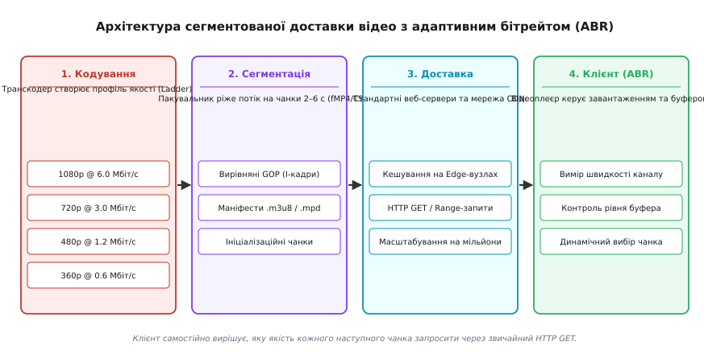
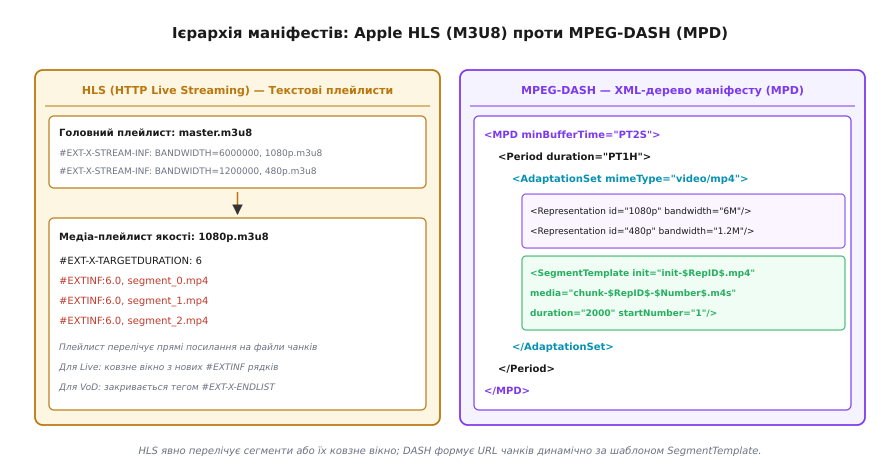
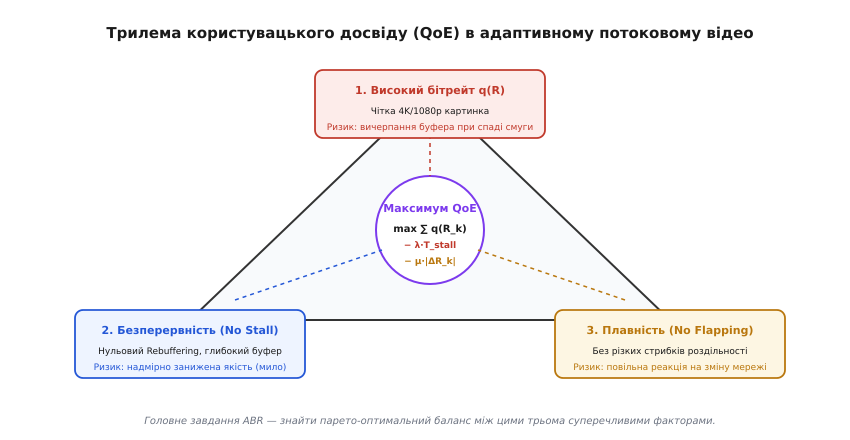
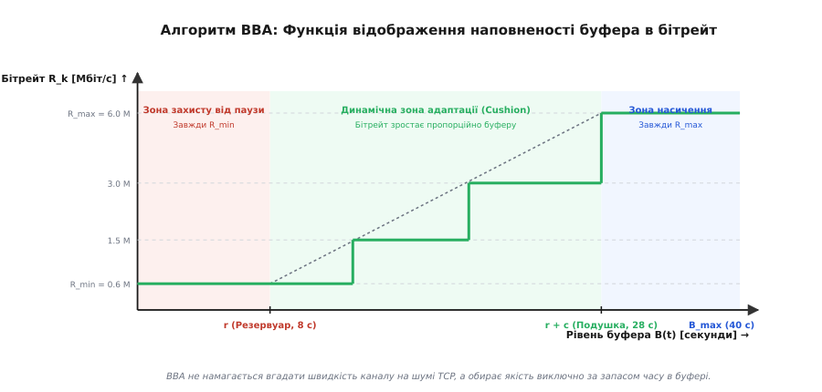
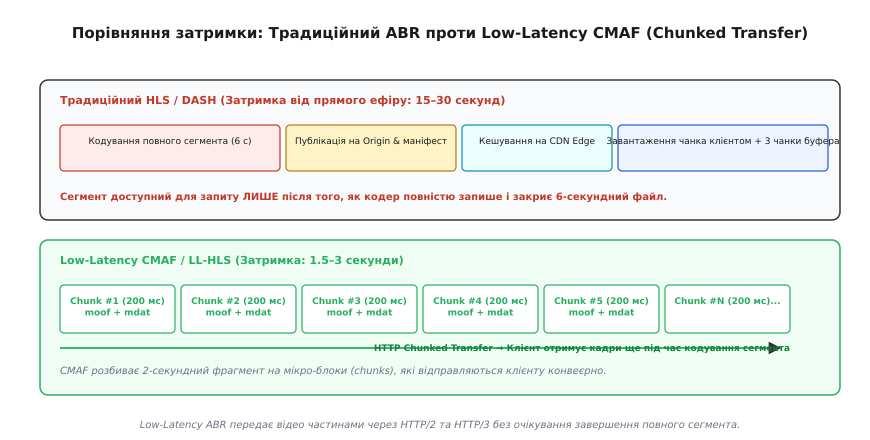

# Адаптивний бітрейт (ABR): HLS, DASH та алгоритми

<preknowlist>
- [Пропускна здатність і втрати](root:com-transport/bandwidth-loss) — смуга пропускання каналу, втрати пакетів, джитер і роль буфера.
- [Транспортні протоколи TCP і UDP](root:com-transport/tcp-vs-udp) — гарантована доставка потоку через TCP та відмінність від UDP.
- [Керування перевантаженням TCP](root:com-transport/tcp-congestion-control) — механізми адаптації швидкості відправника до стану мережі.
- [Міжкадрове стиснення відео](root:com-signal/inter-frame) — GOP, I-кадри, P-кадри та залежність декодування між кадрами.
</preknowlist>

Коли користувач дивиться відео високої чіткості в рухомому транспорті, фізична ємність мобільного радіоканалу коливається кожні кілька секунд: перешкоди міської забудови, віддалення від базової станції стільникового зв'язку чи перехід між секторами антени здатні миттєво обвалити пропускну здатність від 50 Мбіт/с до 1.5 Мбіт/с. Якщо відео закодовано з монолітним сталим бітрейтом (наприклад, 8 Мбіт/с для 1080p), за першого ж глибокого просідання каналу швидкість надходження даних стає меншою за швидкість їхнього споживання декодером. За кілька секунд відеобуфер вичерпується, картинка застигає, і на екрані з'являється анімація очікування (Rebuffering Stall). Якщо ж закодувати відео з надмірно низьким бітрейтом (наприклад, 400 кбіт/с), воно не зависатиме, але користувач на гігабітному оптоволокні бачитиме каламутне піксельне зображення.

Технологія **адаптивного бітрейту** (англ. *Adaptive Bitrate Streaming*, ABR) розв'язує цю дилему через фундаментальну зміну архітектури доставки: замість передачі одного безперервного файлу відеопотік на сервері паралельно кодується з кількома рівнями якості та розрізається на короткі незалежні сегменти (чанки). Клієнтський відеоплеєр під час перегляду безперервно аналізує стан власного буфера та реальну швидкість завантаження мережі, автономно обираючи найкращу роздільну здатність для кожного наступного шматочка.

---

### Архітектура сегментованої доставки через HTTP

Традиційні протоколи прямої трансляції 1990-х років (RTSP/RTP поверх UDP або RTMP поверх TCP) вимагали від медіасервера підтримання індивідуального стану з'єднання (Stateful Connection) для кожного глядача. При підключенні сотень тисяч користувачів центральні сервери вичерпували пам'ять і процесорний ресурс на обробку сокетів задовго до вичерпання мережевої смуги. Детальніше про причини краху цієї моделі та еволюцію підходів розповідає [історія переходу від сокетів до адаптивних чанків](root:com-transport/adaptive-bitrate/hist-streaming-evolution.md).

Сучасне потокове мовлення повністю перейшло на безсесійну (Stateless) модель поверх стандартного протоколу HTTP. Увесь наскрізний конвеєр доставки складається з чотирьох послідовних етапів:


*Конвеєр адаптивного потокового відео. Транскодер паралельно формує драбину бітрейтів із вирівняними ключовими кадрами; пакувальник ріже потік на чанки по 2–6 секунд і генерує маніфести; веб-сервери та мережа CDN кешують чанки як звичайні статичні файли; клієнтський ABR-рушій динамічно обирає якість кожного наступного сегмента.*

1. **Транскодування та драбина бітрейтів (Encoding Ladder):**
   Вхідний майстер-відеопотік надходить у багатопотоковий транскодер, який стискає його одночасно у 4–10 паралельних варіантів різної якості. Кожен варіант (Rendition) має власну комбінацію роздільної здатності, бітрейту кодека та профілю стиснення.

2. **Сегментація та вирівнювання груп кадрів (GOP Alignment):**
   Пакувальник (Packager) розрізає кожен закодований потік на окремі медійні файли-сегменти фіксованої тривалості (зазвичай від 2 до 6 секунд). 
   Найсуворіший інваріант сегментації полягає в **ідеальному вирівнюванні груп кадрів (GOP, Group of Pictures)**: кожен чанк у кожному профілі якості зобов'язаний починатися із замкненого ключового кадру (Closed IDR / I-кадру) з абсолютно однаковою часовою міткою презентації (PTS, Presentation Time Stamp). Завдяки цьому плеєр може завантажити сегмент #42 у роздільній здатності 720p, а наступний сегмент #43 — у 1080p, і апаратний декодер склеїть їх без найменшого візуального артефакту чи розриву звуку.

3. **Кешування в глобальній мережі CDN:**
   Оскільки кожен сегмент є звичайним статичним файлом (наприклад, `segment_1042.m4s`), для його роздачі не потрібні спеціалізовані медіасервери. Стандартні граничні вузли CDN (Edge Caches) під управлінням Nginx, Varnish або Apache зберігають затребувані чанки в оперативній пам'яті, віддаючи їх мільйонам глядачів за стандартними HTTP GET-запитами з мінімальною затримкою.

4. **Автономний клієнтський плеєр:**
   Уся інтелектуальна логіка адаптації винесена на сторону клієнта (відеопрогравача в браузері, мобільному застосунку чи Smart TV). Плеєр спочатку завантажує легкий покажчик-маніфест, що перелічує доступні профілі та адреси чанків, після чого його внутрішній ABR-рушій бере на себе керування завантаженням.

---

### Формати медіаконтейнерів: від MPEG-2 TS до CMAF fMP4

Упродовж першого десятиліття розвитку ABR у сегментованому відео домінував контейнер **MPEG-2 Transport Stream** (`.ts`), успадкований від стандартів цифрового телебачення DVB. 

Контейнер `.ts` розбивав потік на мікропакети фіксованого розміру по 188 байтів. Кожен такий пакет ніс 4 байти обов'язкового заголовка:

```
[Заголовок TS: 4 байти] [Корисне навантаження кадру: 184 байти]
```

Накладні витрати заголовків TS забирали від 2.5 % до 5 % корисної смуги пропускання. Крім того, формат погано підходив для сучасних кодеків HEVC (H.265), AV1 та VP9 і вимагав обов'язкового мультиплексування аудіо та відео в один спільний файл, що змушувало сервери дублювати відеоряд для кожної додаткової мовної аудіодоріжки.

Сучасним стандартом став **фрагментований MP4** (англ. *Fragmented MP4*, `fMP4`), стандартизований у специфікації **CMAF** (Common Media Application Format, ISO/IEC 23000-19).

У структурі fMP4 відеофайл розділено на дві сутності:
1. **Ініціалізаційний сегмент (`init.mp4`):** крихітний файл (1–2 КБ), що містить базові метадані кодека (SPS/PPS для H.264, розміри матриці пікселів, дескриптори треків) в атомах `ftyp` та `moov`. Медіакадри в ньому відсутні. Плеєр завантажує його лише один раз при старті або зміні доріжки.
2. **Медіасегменти (`chunk.m4s`):** файли тривалістю 2–6 секунд, що складаються з двох кореневих атомів:
   - `moof` (Movie Fragment Box): містить таблицю часових міток PTS/DTS, розмірів та прапорців ключових кадрів для цього фрагмента.
   - `mdat` (Media Data Box): безпосередній бінарний потік стиснених відеокадрів.

Перехід на fMP4 дав змогу відокремити відеопотік від аудіодоріжок: клієнт завантажує один спільний відеопотік і паралельно підтягує потрібний аудіофайл обраною мовою (Demuxed Audio/Video), що заощаджує до 40 % дискового простору на серверах сховища.

---

### Маніфести: ієрархія Apple HLS проти MPEG-DASH

Щоб клієнт міг орієнтуватися в доступних варіантах якості та знати, за якими URL-адресами запитувати наступні частини відео, сервер публікує файли маніфестів. В індустрії співіснують два домінуючих стандарти: **Apple HLS** та міжнародний відкритий стандарт **MPEG-DASH**.


*Порівняння структури маніфестів. HLS використовує текстові файли плейлистів .m3u8 із явним переліком посилань на чанки. MPEG-DASH використовує ієрархічний XML-документ .mpd, де адреси сегментів генеруються динамічно за шаблоном SegmentTemplate.*

#### 1. Apple HLS (HTTP Live Streaming)
Маніфести HLS — це текстові файли списків відтворення M3U8 у кодуванні UTF-8:
- **Master Playlist (`master.m3u8`):** містить теги `#EXT-X-STREAM-INF`, де для кожного варіанту якості явно вказано атрибути `BANDWIDTH` (бітрейт у біт/с), `RESOLUTION` (роздільна здатність, наприклад `1920x1080`), `CODECS` та посилання на дочірній плейлист.
- **Media Playlist (`1080p.m3u8`):** перелічує прямі посилання на файли сегментів із тегами `#EXTINF:6.0` (тривалість сегмента в секундах).

Повний перелік параметрів тегів `#EXT-X-TARGETDURATION`, `#EXT-X-MEDIA-SEQUENCE`, `#EXT-X-MAP` та синтаксис мікрочанків LL-HLS наведено у вставці [довідник тегів HLS та структури XML-маніфестів DASH](root:com-transport/adaptive-bitrate/api-manifest-formats.md).

#### 2. MPEG-DASH (ISO/IEC 23009-1)
Стандарт DASH використовує єдиний структурований XML-документ **MPD** (Media Presentation Description):
- Корінь `<MPD>` задає глобальні часові параметри та мінімальний розмір буфера `minBufferTime`.
- Елемент `<Period>` задає часовий блок трансляції (наприклад, окрема телепередача або рекламна пауза).
- Елемент `<AdaptationSet>` групує взаємозамінні потоки одного типу (наприклад, усі відеопотоки).
- Елементи `<Representation>` описують конкретні профілі якості (бітрейт `bandwidth`, ширину `width`, висоту `height`).

Головна перевага DASH — використання елемента `<SegmentTemplate>`: замість запису мільйонів рядків із посиланнями на кожен окремий файл маніфест містить математичний шаблон підстановки:

```xml
<SegmentTemplate initialization="init-$RepresentationID$.mp4"
                 media="chunk-$RepresentationID$-$Number%05d$.m4s"
                 startNumber="1" duration="2000" timescale="1000" />
```

Плеєр самостійно вираховує URL-адресу потрібного чанка за його порядковим номером `$Number$` або часовою міткою `$Time$`, що скорочує розмір маніфесту для 24-годинної трансляції з десятків мегабайтів до кількох кілобайтів.

---

### Трилема якості QoE (Quality of Experience)

Робота будь-якого клієнтського алгоритму адаптації зводиться до оптимізації суб'єктивного сприйняття відео глядачем. В інженерії потокового відео ця задача відома як **трилема QoE** — компроміс між трьома взаємовиключними цілями:


*Трилема оптимізації QoE. Максимізація роздільної здатності підвищує ризик спорожнення буфера й зупинки відтворення. Надмірно обережне утримання буфера знижує якість картинки. Спроби надто швидко відстежувати будь-який сплеск мережі викликають дратівливе мерехтіння якості (Quality Flapping).*

1. **Максимізація середнього бітрейту та роздільної здатності `q(R_k)`:**
   Глядач прагне бачити чітке зображення без артефактів блочності. Проте вибір високого бітрейту під саму стелю смуги пропускання ставить систему під загрозу: якщо зв'язок раптово просяде, буфер спорожніє раніше, ніж завершиться завантаження чергового великого файлу.

2. **Мінімізація або повна ліквідація пауз (Rebuffering Stalls):**
   Зупинка відео посеред перегляду — найгірша подія для глядача. Дослідження показують, що одна секунда паузи викликає таке саме роздратування, як перегляд усього фільму зі зниженою вдвічі роздільною здатністю. Щоб гарантовано уникнути пауз, алгоритм мав би завжди обирати найнижчий бітрейт (360p), але тоді картинка перетвориться на розмите «мило».

3. **Плавність перемикання та відсутність мерехтіння якості (No Quality Flapping):**
   Часті стрибки якості (наприклад, 1080p -> 480p -> 1080p кожні 4 секунди) втомлюють зір значно сильніше, ніж стабільний перегляд на середньому рівні 720p. Алгоритм зобов'язаний згладжувати перехідні процеси.

Математично задача формулюється як пошук послідовності бітрейтів `{R_k}`, що максимізує інтегральну функцію корисності за вирахуванням штрафів за паузи `T_stall` та перемикання `|ΔR_k|`:

```math
QoE = ∑_{k=1}^{N} q(R_k) − λ · ∑_{k=1}^{N} T_stall[k] − μ · ∑_{k=1}^{N-1} |q(R_{k+1}) − q(R_k)|
```

Детальний математичний аналіз цільових функцій, логарифмічних законів корисності Вебера–Фехнера та рівнянь дрейфу черги наведено у вставці [математичне формулювання цільової функції QoE та алгоритмів BBA/BOLA/MPC](root:com-transport/adaptive-bitrate/math-abr-algorithms.md).

---

### Алгоритми адаптації на стороні клієнта

За способом прийняття рішень сучасні ABR-алгоритми поділяють на три великі класи: на базі пропускної здатності (Throughput-based), на базі наповненості буфера (Buffer-based) та гібридні/контрольно-теоретичні моделі.

#### 1. Алгоритми на базі оцінки пропускної здатності (Throughput-Based)

Найперші алгоритми (використовувалися в ранніх версіях Flash Player та Smooth Streaming) базувалися на прямолінійній логіці: плеєр вимірює швидкість завантаження попереднього сегмента й обирає для наступного найбільший бітрейт, що не перевищує отриманої оцінки з деяким коефіцієнтом безпеки:

```math
T_k = (Розмір\_сегмента\_у\_бітах) / (Час\_завантаження)
R_{k+1} ≤ γ · T_k   (де γ ≈ 0.8 ... 0.85)
```

##### Пастка пульсуючого трафіку (The ON-OFF Pacing Trap)
На практиці цей підхід постійно зазнає збоїв через специфіку протоколу [TCP](root:com-transport/tcp-vs-udp). Коли відеобуфер заповнюється до максимуму, плеєр зупиняє запити (фаза OFF). 

За час паузи TCP-з'єднання перебуває в бездіяльності, і стек операційної системи скидає вікно перевантаження `cwnd` до початкового розміру. Коли плеєр надсилає наступний запит (фаза ON), передача стартує з повільного старту (TCP Slow Start), і сегмент завантажується значно повільніше реальної ємності каналу. Алгоритм помилково сприймає це як погіршення зв'язку і безпідставно скидає якість відео до мінімуму.

##### Гармонійне середнє проти арифметичного
Щоб захиститися від короткочасних помилок вимірювань, застосовують **гармонійне середнє** (Harmonic Mean) за останніми `W` сегментами в поєднанні з експоненційним фільтром низьких частот (EWMA):

```math
T_harm = W / ∑_{i=1}^{W} (1 / T_i)
Ĉ_k = α · T_harm + (1 − α) · Ĉ_{k-1}
```

Гармонійне середнє природно відсікає штучні сплески швидкості (наприклад, коли короткий чанк злітає з кешу CDN за лічені мілісекунди) і дає точну оцінку стійкої фізичної смуги каналу.

---

#### 2. Алгоритми на базі наповненості буфера (Buffer-Based, BBA)

У 2014 році дослідники зі Стенфордського університету розробили алгоритм **BBA** (Buffer-Based Adaptation, Huang et al.). Його ключова ідея: **в усталеному режимі швидкість мережі вимірювати взагалі не потрібно**.

Буфер плеєра вже є природним інтегратором балансу між надходженням і споживанням даних. Якщо буфер зростає — канал гарантовано витримує поточний бітрейт; якщо буфер падає — мережа перевантажена.


*Геометрія зон алгоритму BBA. У зоні резервуара [0..r] алгоритм обирає мінімальний бітрейт для порятунку від зупинки. У зоні подушки [r..r+c] бітрейт плавно зростає разом із рівнем буфера. У зоні насичення [> r+c] завжди обирається максимальна якість.*

Алгоритм ділить буфер на три інтервали:
- **Резервуар `[0, r]` (типово 8 секунд):** зона захисту. Якщо запас менший за `r`, плеєр завжди обирає найнижчий бітрейт `R_min`, запобігаючи зупинці.
- **Подушка `[r, r + c]` (типово від 8 до 24 секунд):** робоча зона. Бітрейт обирається за неперервною функцією `f(B)`:
  ```math
  f(B) = R_min + ( (B − r) / c ) · (R_max − R_min)
  ```
- **Зона насичення `[B ≥ r + c]`:** буфер максимально глибокий, завжди обирається `R_max`.

BBA повністю ліквідував проблему ON-OFF коливань TCP, оскільки стан буфера не залежить від скидання вікна `cwnd`.

---

#### 3. Гібридні та контрольно-теоретичні алгоритми

Сучасні комерційні плеєри використовують передові комбіновані моделі:

1. **BOLA (Buffer Occupancy based Lyapunov Algorithm):**
   Перетворює задачу вибору бітрейту на строгу оптимізацію за Ляпуновим (Lyapunov Drift-plus-Penalty). На кожному кроці алгоритм обирає профіль, що максимізує відношення зваженої корисності та поточного буфера до розміру сегмента `(V · q(R) + B) / S(R)`. BOLA є математично доведеним оптимальним онлайн-алгоритмом без потреби прогнозування каналу.

2. **RobustMPC (Model Predictive Control):**
   Будує оптимізаційний прогноз на ковзному горизонті глибиною у 5 наступних сегментів. Алгоритм прораховує всі можливі комбінації вибору бітрейтів на найближчі 20 секунд, моделює траєкторію виснаження буфера з урахуванням найгіршого сценарію похибки прогнозу швидкості каналу і застосовує перший крок оптимального плану.

3. **Pensieve (Deep Reinforcement Learning):**
   Сучасний підхід на базі навчання з підкріпленням. Нейромережа тренується на мільйонах реальних мережевих треків (4G, 5G, Wi-Fi), навчаючись тонко передбачати нелінійні взаємодії між розмірами VBR-кадрів та динамікою буфера.

Робочий вихідний код автономного ABR-рушія з гармонійним оцінювачем, BBA-автоматом та тестами на C, C++ та Python наведено у вставці [програмна реалізація гібридного ABR-рушія на C та C++](root:com-transport/adaptive-bitrate/proj-abr-engine.md).

---

### Побудова бітрейт-драбини: оптимізація Rate-Distortion та Per-Title

Історично медіакомпанії використовували єдину фіксовану «драбину бітрейтів» (Static Encoding Ladder) для всього каталогу контенту. Наприклад, профіль 1080p завжди кодувався на швидкості 6 Мбіт/с, 720p — на 3 Мбіт/с, а 480p — на 1.2 Мбіт/с.

Проте такий підхід є фундаментально неоптимальним через різницю у просторово-часовій складності відео (Spatial-Temporal Complexity):
- **Низька динаміка (анімація, студійні інтерв'ю, лекції):** кадр містить великі площини однорідного кольору та мінімальний рух між кадрами. Для бездоганної якості 1080p у форматі H.264 достатньо лише 1.8–2.2 Мбіт/с. Витрачання 6 Мбіт/с є марнуванням 65 % смуги CDN і каналу глядача.
- **Висока динаміка (спорт, водні бризки, феєрверки, бойовики):** хаотичний рух дрібних деталей вимагає колосальної кількості бітів для передачі векторів руху та коефіцієнтів квантування. На швидкості 6 Мбіт/с картинка 1080p покриється блочними артефактами. Для такого контенту набагато вищу суб'єктивну чіткість дає транскодування у 720p на тих самих 6 Мбіт/с (менше пікселів, але без артефактів розпаду).

```
VMAF (Якість) ↑
 100 ┌───────────────────── Опукла оболонка (Convex Hull)
     │                • 1080p @ 4.5M (VMAF 96)
  90 │           • 720p @ 2.5M (VMAF 91)
     │      • 720p @ 1.5M (VMAF 84)
  80 │ • 480p @ 0.8M (VMAF 76)
     │
   0 └───────────────────────────────────────→ Бітрейт R [Мбіт/с]
```

У 2015 році компанія Netflix представила концепцію **потитульної оптимізації (Per-Title Encoding)**, яка згодом еволюціонувала в пофрагментну оптимізацію (Per-Shot Encoding). 

Перед фінальним стисненням аналізатор прораховує криву залежності спотворення від швидкості (Rate-Distortion Curve) для кожного окремого епізоду або сцени. Оптимізатор будує опуклу оболонку (Convex Hull) у просторі координат «Бітрейт — Метрика якості (VMAF/SSIM)» і динамічно підбирає унікальний набір пар «роздільна здатність — бітрейт» саме для цього відео. Це дозволяє зменшити середній бітрейт на 20–35 % при одночасному підвищенні візуальної оцінки VMAF.

---

### Декодерні буферні моделі: обмеження VBV та CPB

Адаптивне відео зі змінним бітрейтом (VBR) створює пікові сплески навантаження на апаратний декодер приймача. Якщо кодер випустить сегмент, у якому складна сцена вимагатиме миттєвого піку в 25 Мбіт/с при номіналі профілю 6 Мбіт/с, клієнтський чипсет може переповнити внутрішню апаратну пам'ять кадрів.

Для запобігання переповненню або спустошенню апаратного буфера декодера кожен профіль стискається під жорстким контролем гіпотетичного еталонного декодера (HRD, Hypothetical Reference Decoder):
- **Віртуальний буфер верифікатора відео (VBV, Video Buffer Verifier у H.264):** визначається двома параметрами в конфігурації кодера:
  - `vbv-maxrate`: максимальна швидкість заповнення апаратного буфера декодера (наприклад, `6600k` для профілю 6000 кбіт/с).
  - `vbv-bufsize`: фізичний розмір буфера верифікатора в кілобітах (типово встановлюється в діапазоні `1.5 × vbv-maxrate` або `2 × vbv-maxrate`, наприклад `12000k`).

Якщо сцена стає занадто складною, алгоритм стиснення кодека зобов'язаний примусово збільшити параметр квантування (QP), погіршивши якість окремих блоків, але втримавши обсяг даних у межах параметрів VBV. Це гарантує, що телевізійна приставка або мобільний телефон зможуть безперервно декодувати відеокадри зі стабільною швидкістю 60 кадрів/с без пропуску кадрів (Frame Drops) на апаратному рівні.

---

### Стандартизація клієнтської телеметрії: специфікації CMCD та CMSD

У класичному ABR-мовленні проміжні сервери CDN обслуговували HTTP-запити клієнта «наосліп», не маючи жодного уявлення про те, навіщо плеєр запитує той чи інший файл, який поточний рівень буфера і чи не загрожує глядачеві аварійна пауза.

Для координації роботи плеєра та мережі доставки асоціація CTA стандартизувала відкриту специфікацію **CMCD** (Common Media Client Data, CTA-5004).

Плеєр додає до кожного HTTP-запиту сегмента стандартизовані HTTP-заголовки або query-параметри:

```http
GET /video/1080p/segment_1042.m4s HTTP/2
Host: edge.cdn.example.com
CMCD-Request: br=6000, d=2000, mtp=6000
CMCD-Status: bl=14200, rtp=1200, bs
CMCD-Session: sid="sess-9a8b7c", cid="movie-42", pr=1.0, sf=h
```

#### Семантика ключових полів CMCD:
1. `bl` (Buffer Length): поточний залишок відеобуфера клієнта в мілісекундах (наприклад, `bl=14200` — у буфері 14.2 секунди). Якщо граничний вузол CDN бачить `bl < 2000`, він надає цьому запиту найвищий пріоритет у черзі планувальника введення-виведення.
2. `br` (Bitrate): номінальний бітрейт запитуваного сегмента (6000 кбіт/с).
3. `d` (Duration): точна тривалість чанка в мілісекундах (2000 мс).
4. `rtp` (Requested Throughput): розрахована плеєром мінімальна швидкість передачі, необхідна для запобігання спустошенню буфера.
5. `bs` (Buffer Starvation): булевий прапорець, що свідчить про стан повної зупинки відтворення (Rebuffering прямо зараз).

На основі даних CMCD граничні сервери CDN оптимізують попереднє прогрівання кешу (Pre-fetching наступного сегмента з центрального сховища), формують черги передачі TCP та балансують навантаження між дата-центрами.

У відповідь сервер може надсилати заголовки **CMSD** (Common Media Server Data, CTA-5006), повідомляючи плеєр про максимальну пропускну здатність вузла або динамічне перевантаження edge-сервера, що дозволяє клієнтському ABR-рушію превентивно обмежити бітрейт ще до появи перших втрат пакетів.

---

### Динамічна вставка реклами: SSAI проти CSAI

Монетизація онлайн-трансляцій спирається на показ персоналізованих рекламних роликів. В архітектурі ABR існують два протилежні підходи до інтеграції реклами:

1. **Клієнтська вставка (CSAI, Client-Side Ad Insertion):**
   Плеєр призупиняє основне відео, створює другий прихований відеотег, завантажує рекламний маніфест за протоколами VAST/VMAP і після показу повертається до основного потоку. 
   *Вади:* висока ймовірність затримок і чорного екрана на стиках, конфлікти кодеків та легке блокування реклами розширеннями браузера (AdBlock).

2. **Серверна безшовна вставка (SSAI, Server-Side Ad Insertion / Ad Stitching):**
   Проміжний проксі-сервер або пакувальник на льоту модифікує текстовий маніфест HLS або DASH для кожного окремого глядача на основі міток SCTE-35 (цифрових маркерів рекламних пауз у телевізійному сигналі).
   Рекламні ролики заздалегідь перекодовуються в ту саму бітрейт-драбину, що й основний контент, і вставляються безпосередньо в таймлайн як звичайні чанки:
   - У HLS перед рекламними чанками вставляється тег `#EXT-X-DISCONTINUITY`.
   - У MPEG-DASH реклама виділяється в окремий часовий елемент `<Period>`.

Оскільки реклама надходить у тому самому медіапотоці з тих самих CDN-серверів, користувач отримує абсолютно плавний телевізійний перехід без пауз, а блокувальники реклами не можуть відрізнити рекламні сегменти від основного фільму.

---

### Передача через CDN та транспортні протоколи: HTTP/2, HTTP/3 і Low-Latency

Адаптивне відео накладає специфічні вимоги на транспортні протоколи передачі даних.

#### Еволюція транспортного рівня
- **HTTP/1.1:** Кожен запит на сегмент вимагав окремого TCP-з'єднання або працював у режимі конвеєризації (Pipelining), що страждав від блокування початку черги (Head-of-Line Blocking) на рівні прикладного протоколу.
- **HTTP/2:** Ввів бінарне мультиплексування потоків усередині одного TCP-з'єднання. Плеєр зміг одночасно завантажувати аудіо, відео та субтитри без відкриття додаткових портів. Проте блокування початку черги на рівні TCP залишалося: втрата одного пакета зупиняла передачу всіх мультиплексованих потоків.
- **HTTP/3 (QUIC):** Працює поверх протоколу [UDP](root:com-transport/tcp-vs-udp) із незалежним шифруванням і контролем втрат для кожного окремого потоку. Втрата пакета у відеотреку більше не блокує доставку сусідньої аудіодоріжки чи оновлення маніфесту, що скорочує час повторної буферизації на нестабільному мобільному зв'язку на 20–30 %.

#### Low-Latency Streaming: подолання 30-секундної затримки

У класичному HLS / DASH затримка від реальної події (Glass-to-Glass Latency) становить 15–30 секунд. Ця затримка складається з фізичної необхідності транскодера повністю закодувати 6-секундний файл, опублікувати його в маніфесті та дати плеєру накопичити щонайменше 3 сегменти в буфері для безпеки.

Для спортивних трансляцій, аукціонів та інтерактивних шоу така затримка неприйнятна. Технології **LL-HLS** (Apple) та **LL-DASH** у поєднанні з контейнером **CMAF Chunked Transfer** зменшили затримку до **1.5–3 секунд**:


*Принцип роботи Low-Latency CMAF. Пакувальник розбиває 2-секундний сегмент на мікрочанки (Chunks) по 200–300 мс. За допомогою механізму HTTP Chunked Transfer Encoding сервер починає віддавати байти клієнту ще під час процесу кодування сегмента, скорочуючи затримку до мінімуму.*

Замість очікування повного закриття файлу транскодер записує атоми `moof` + `mdat` кожні 200–300 мілісекунд і транслює їх крізь веб-сервер через потоковий механізм Chunked Transfer Encoding. Плеєр починає декодувати кадри першої секунди ще до того, як кодер завершив запис другої секунди того самого сегмента.

> 🔧 **Навіщо це в реальній розробці.**
> 1. **Вибір тривалості чанка:** Для звичайного VoD (фільми, серіали) обирайте довжину сегмента **4–6 секунд**. Це максимізує ефективність міжкадрового стиснення кодека (менше накладних I-кадрів) і суттєво підвищує коефіцієнт влучання в кеш CDN (Cache Hit Ratio > 98 %).
> 2. **Налаштування Low-Latency:** Для живих трансляцій спорту налаштовуйте CMAF із сегментами **2 секунди** та мікрочанками (Parts) по **250–330 мс** у поєднанні з HTTP/2 або HTTP/3.
> 3. **Інваріант вирівнювання GOP:** У конфігурації кодера FFmpeg обов'язково вказуйте фіксований крок ключових кадрів `-g (fps * chunk_sec) -keyint_min (fps * chunk_sec) -sc_threshold 0`. Будь-який випадковий I-кадр на зміні сцени зруйнує синхронізацію бітрейт-драбини.
> 4. **Керування кешуванням CDN:** Завжди віддавайте незмінні медіасегменти (`.m4s`, `.ts`) із заголовком `Cache-Control: public, max-age=31536000, immutable`, а живі маніфести `.m3u8` / `.mpd` — із коротким TTL `max-age=1` або блокуючим опитуванням.
