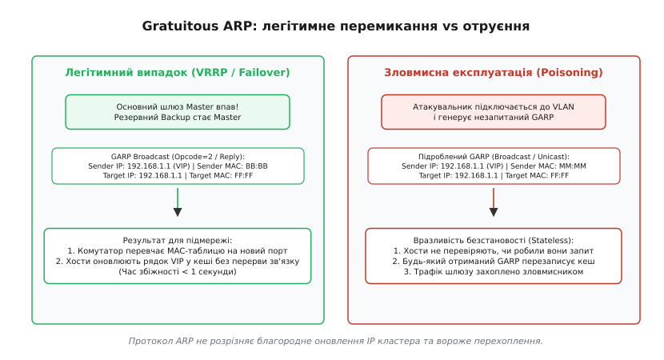
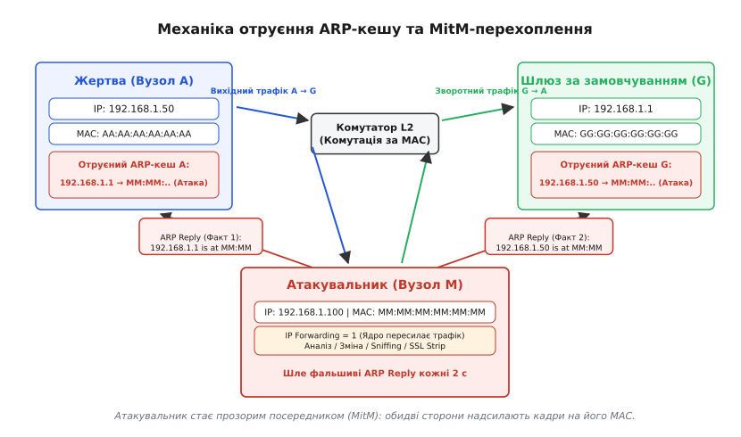
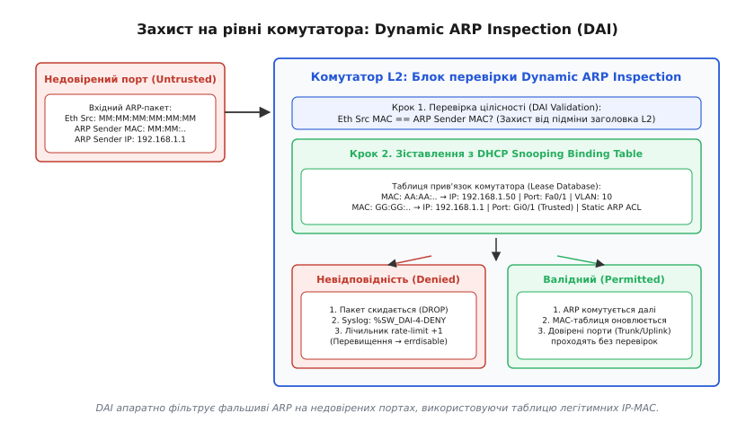

# Безпека ARP: отруєння кешу та захист

<preknowlist>
- [MAC, IP і ARP](topic:com-transport/mac-ip-arp) — принцип зіставлення апаратних і мережевих адрес, роль ARP-таблиці та широкомовних запитів у локальному сегменті.
- [Кадр Ethernet](topic:com-transport/ethernet-frame) — будова канального кадру, поля MAC-адрес відправника та одержувача, передача широкомовних кадрів.
- [DHCP і DNS](topic:com-transport/dhcp-dns) — динамічний розподіл IP-адрес, оренда конфігурації та відповідність MAC-IP у вузлах.
</preknowlist>

Комп'ютер бухгалтерії з IP-адресою `192.168.1.50` передає конфіденційне платіжне доручення через корпоративний шлюз `192.168.1.1`. Усі робочі станції підключено до сучасного керованого комутатора, де кожен порт апаратно ізольовано в таблиці комутації: кадри, призначені шлюзу, фізично не надходять на порти інших співробітників. Проте сусідній ноутбук у тій самій віртуальній мережі (VLAN) генерує один єдиний кадр Ethernet розміром 42 байти — і вся фінансова сесія непомітно перенаправляється через сторонній мережевий адаптер.

Комутатор не зупинив перехоплення, оскільки він сумлінно виконував своє базове завдання: комутував кадри за адресами канального рівня (MAC). Проте саму цільову MAC-адресу комп'ютер жертви обрав на основі власної локальної таблиці відповідностей — ARP-кешу. Той, хто отримує контроль над записом шлюзу в ARP-кеші хоста, отримує повну владу над маршрутом його трафіку всередині локального сегмента.

З'ясуймо першопричину цієї вразливості: чому протокол перекладу адрес позбавлений засобів автентифікації, як зловмисники експлуатують його безстанову природу для атак Man-in-the-Middle і якими апаратними механізмами комутатори повертають контроль над канальним рівнем.

---

### Анатомія протокольної вразливості: архітектура RFC 826

Протокол розв'язання адрес ARP (англ. *Address Resolution Protocol*, лат. *resolutio* — розв'язання, перетворення) було стандартизовано в 1982 році в документі RFC 826 для динамічного зв'язування 32-бітних логічних адрес IPv4 з 48-бітними фізичними MAC-адресами Ethernet.

У моделі комп'ютерних мереж протокол ARP займає проміжне положення між канальним (L2) та мережевим (L3) рівнями: мережевий застосунок завжди оперує IP-адресами, але апаратний контролер може відправити кадр у дріт лише тоді, коли йому відома фізична MAC-адреса наступного вузла. Детальний аналіз історичних передумов створення протоколу в середовищі повної академічної довіри наведено у вставці [Від локальної довіри до атак у комутованих мережах: історія моделі безпеки ARP](topic:com-transport/arp-security/hist-arp-trust-model.md).

Фундаментальна проблема безпеки ARP полягає в тому, що протокол проєктувався за трьома принципами, які в сучасних умовах є критичними архітектурними вадами:

#### 1. Безстанова природа обробки (Stateless Architecture)

Операційна система хоста не зберігає стан надісланих запитів. Коли вузол надсилає широкомовний запит `ARP Request` («У кого IP `192.168.1.1`?»), він не створює захищеної транзакції з унікальним криптографічним ідентифікатором і не очікує відповіді суворо від конкретного джерела.

Якщо на мережевий інтерфейс надходить кадр `ARP Reply` («IP `192.168.1.1` знаходиться за MAC `MM:MM:MM:MM:MM:MM`»), мережевий стек операційної системи не перевіряє, чи запитував він взагалі цю адресу. Ядро беззастережно вважає будь-яку отриману відповідь правдивою і негайно записує або оновлює відповідний рядок у своїй таблиці сусідів (*Neighbor Table*).

#### 2. Відсутність автентифікації та контролю повноважень

У структурі пакета ARP немає жодного поля для цифрового підпису, гешу пароля чи перевірки сертифіката. Будь-який вузол, підключений до фізичного порту або точки доступу Wi-Fi, має технічну можливість згенерувати пакет ARP із довільними значеннями в полях адреси відправника (`Sender IP` та `Sender MAC`).

Не існує механізму, за допомогою якого хост міг би запитати у маршрутизатора: «Чи справді комп'ютер з апаратною адресою `MM:MM:...` має право заявляти себе адресою `192.168.1.1`?». Мережевий стек приймає твердження кожного учасника на віру.

#### 3. Агресивне оновлення кешу при прослуховуванні (Cache Update on Snoop)

Згідно з алгоритмом RFC 826, для мінімізації кількості широкомовних запитів у мережі реалізовано правило: якщо вузол отримує будь-який пакет ARP (навіть чужий запит, адресований іншій машині), і в його локальному кеші вже існує запис для IP-адреси відправника цього кадру, вузол зобов'язаний негайно оновити збережену MAC-адресу на нову.

Це означає, що зловмиснику навіть не обов'язково чекати, поки жертва надішле запит: достатньо надіслати один широкомовний пакет у підмережу, щоб оновити таблиці трансляції десятків комп'ютерів одночасно.

---

### Gratuitous ARP: легітимна оптимізація та зброя перехоплення

Окремим випадком використання протоколу є так званий незапитаний або «безпричинний» ARP (англ. *Gratuitous ARP*, GARP). Це повідомлення ARP (запит або відповідь), у якому логічна адреса відправника (`Sender Protocol Address`) повністю збігається з логічною адресою цілі (`Target Protocol Address`).

Повна побайтова специфікація всіх полів кадру ARP та службових форматів наведена у довіднику [Специфікація протоколу ARP та інтерфейс DAI](topic:com-transport/arp-security/api-arp-frame.md).

```text
+-------------------------------------------------------------------------+
|                  Структура пакета Gratuitous ARP Reply                  |
+------------------------------------+------------------------------------+
| Hardware Type: 0x0001 (Ethernet)   | Protocol Type: 0x0800 (IPv4)       |
| Hardware Size: 6 bytes             | Protocol Size: 4 bytes             |
| Opcode: 2 (Reply)                  |                                    |
| Sender MAC: MM:MM:MM:MM:MM:MM      | Sender IP: 192.168.1.1 (Шлюз)      |
| Target MAC: FF:FF:FF:FF:FF:FF      | Target IP: 192.168.1.1 (Шлюз)      |
+------------------------------------+------------------------------------+
```

У нормальному житті мережі Gratuitous ARP виконує критично важливі системні функції:

1. **Детектування дублювання IP-адрес (Address Conflict Detection, ACD / RFC 5227)**: коли операційна система ініціалізує статичну IP-адресу або отримує оренду від DHCP, вона надсилає GARP-запит. Якщо у відповідь приходить хоча б один кадр — адреса вже зайнята іншим пристроєм, і мережевий інтерфейс блокує її використання, запобігаючи IP-конфлікту.
2. **Оновлення таблиць комутації після міграції або заміни заліза**: коли віртуальна машина переміщується між фізичними серверами (*Live Migration*) або системний адміністратор перемикає кабель в іншу мережеву карту, надсилання GARP змушує комутатори негайно перенавчити таблиці MAC-адрес (*CAM-таблиці*) на новий порт без очікування 300-секундного тайм-ауту застарівання.
3. **Забезпечення відмовостійкості шлюзів (Кластери VRRP, HSRP, CARP)**: якщо основний маршрутизатор кластера виходить із ладу, резервний маршрутизатор миттєво перебирає віртуальну IP-адресу (`VIP`) і вистрілює в мережу пакет GARP зі своєю власною апаратною MAC-адресою. Усі клієнти сегмента за мілісекунди оновлюють запис шлюзу, і користувачі не помічають перерви в роботі сервісів.


*Зліва: легітимний кластер VRRP перемикає трафік на резервний шлюз за допомогою GARP. Справа: зловмисник використовує той самий механізм для несанкціонованого безстанового переписування кешів сусідів.*

Проте зворотний бік цієї оптимізації фатальний: оскільки протокол не вимагає перевірки автентичності, будь-який шкідливий вузол може згенерувати фальсифікований GARP, оголосивши себе новим власником IP-адреси корпоративного сервера чи шлюзу. Мережевий стек сусідніх машин без вагань перезапише свої таблиці, відкриваючи шлях до перехоплення даних.

---

### Механіка атаки ARP Cache Poisoning (ARP Spoofing)

Атака отруєння ARP-кешу (англ. *ARP Cache Poisoning* або *ARP Spoofing*) полягає у навмисному впровадженні недійсних або фальсифікованих записів «IP-MAC» у таблиці розв'язання адрес мережевих вузлів.

Розглянемо класичний сценарій повнодуплексного перехоплення трафіку (англ. *Full-Duplex Man-in-the-Middle*, MitM) у сегменті `192.168.1.0/24`:
* Жертва (Вузол A): IP `192.168.1.50`, реальний MAC `AA:AA:AA:AA:AA:AA`;
* Шлюз (Маршрутизатор G): IP `192.168.1.1`, реальний MAC `GG:GG:GG:GG:GG:GG`;
* Атакувальник (Вузол M): IP `192.168.1.100`, реальний MAC `MM:MM:MM:MM:MM:MM`.

```text
                +------------------------------------+
                |        Легітимний шлюз (G)         |
                |  IP: 192.168.1.1                   |
                |  MAC: GG:GG:GG:GG:GG:GG            |
                +-----------------+------------------+
                                  │
                                  ▼
                +------------------------------------+
                |       Комутатор доступу (L2)       |
                +--------+------------------+--------+
                         │                  │
         Кадри до A      │                  │ Кадри від A
    пересилаються на M   │                  │ йдуть на MAC M
                         ▼                  ▼
       +-----------------------+      +-----------------------+
       |   Атакувальник (M)    |      |      Жертва (A)       |
       | IP: 192.168.1.100     |◄─────┤ IP: 192.168.1.50      |
       | MAC: MM:MM:MM:MM:MM:MM|      | MAC: AA:AA:AA:AA:AA:AA|
       +-----------------------+      +-----------------------+
```

#### Послідовність виконання атаки

Атакувальник реалізує перехоплення у чотири кроки:

1. **Отруєння кешу жертви**: вузол M формує та надсилає комп'ютеру A фальсифіковану одноадресну відповідь `ARP Reply`:
   * `Sender Protocol Address (SPA)` = `192.168.1.1` (IP шлюзу);
   * `Sender Hardware Address (SHA)` = `MM:MM:MM:MM:MM:MM` (MAC атакуючого);
   * `Target Protocol Address (TPA)` = `192.168.1.50` (IP жертви);
   * `Target Hardware Address (THA)` = `AA:AA:AA:AA:AA:AA` (MAC жертви).
   
   Отримавши цей кадр, комп'ютер A оновлює свій кеш: відтепер він вважає, що маршрутизатор `192.168.1.1` має апаратну адресу `MM:MM:MM:MM:MM:MM`.

2. **Отруєння кешу шлюзу**: паралельно вузол M надсилає маршрутизатору G симетричну підроблену відповідь `ARP Reply`:
   * `Sender Protocol Address (SPA)` = `192.168.1.50` (IP жертви);
   * `Sender Hardware Address (SHA)` = `MM:MM:MM:MM:MM:MM` (MAC атакуючого);
   * `Target Protocol Address (TPA)` = `192.168.1.1` (IP шлюзу);
   * `Target Hardware Address (THA)` = `GG:GG:GG:GG:GG:GG` (MAC шлюзу).
   
   Шлюз G оновлює свій кеш: відтепер увесь зворотний трафік, призначений хосту `192.168.1.50`, він також надсилатиме на MAC-адресу `MM:MM:MM:MM:MM:MM`.

3. **Активація маршрутизації в ядрі (IP Forwarding)**:
   Якщо вузол M просто прийматиме чужі пакети, комп'ютер A втратить вихід в інтернет, зв'язок обірветься і користувач помітить аварію. Щоб залишатися непомітним, зловмисник вмикає транзит пакетів на рівні ядра своєї операційної системи:
   `sysctl -w net.ipv4.ip_forward=1`.

   Тепер, коли комп'ютер A відправляє IP-пакет до зовнішнього вебсервера (наприклад, банківського сайту), кадр канального рівня приходить на мережевий адаптер M. Ядро вузла M зчитує пакет, дозволяє локальним програмам-аналізаторам скопіювати дані, змінює в заголовку Ethernet поле `Destination MAC` на реальну адресу шлюзу `GG:GG:GG:GG:GG:GG` і виштовхує пакет назад у мережу. Зворотний потік від шлюзу до жертви обробляється аналогічно.

4. **Утримання стану (Боротьба за кеш / Race Condition)**:
   У живій мережі легітимний шлюз періодично розсилає власні кадри, які на короткий час повертають кеш жертви у нормальний стан. Щоб стабільно контролювати канал, утиліти атак кожні 1–2 секунди повторно генерують фальсифіковані ARP-відповіді, примусово перезаписуючи таблицю пам'яті.


*Повнодуплексне отруєння кешу (Full-Duplex Poisoning): атакуючий стає прозорим посередником між жертвою та шлюзом, контролюючи весь вихідний і зворотний трафік.*

#### Варіації атаки: однонаправлене отруєння та синергія з MAC Flooding

Залежно від цілей зловмисника та топології мережі розрізняють кілька модифікацій цієї техніки:

* **Однонаправлене (напівдуплексне) отруєння (*Half-Duplex Spoofing*)**: атакуючий труїть кеш лише жертви A, не чіпаючи шлюз G. У цьому разі атакуючий бачить лише вихідний трафік клієнта (наприклад, HTTP POST-запити з паролями), тоді як відповіді від сервера повертаються безпосередньо жертві від шлюзу. Такий метод створює вдвічі менше аномального трафіку в мережі та знижує ризик детектування системами моніторингу.
* **Синергія з переповненням CAM-таблиці (*MAC Flooding*)**: зловмисник одночасно генерує потік із десятків тисяч фіктивних MAC-адрес відправника (`macof`), переповнюючи пам'ять комутатора. Коли CAM-таблиця вичерпується, простий комутатор переходить у режим збою (*Fail-Open / Hub Mode*) і починає транслювати кожен кадр на всі фізичні порти. Поєднання MAC Flooding з ARP Spoofing перетворює локальну мережу на повністю відкритий радіоефір.
* **Експлуатація Proxy ARP (RFC 1027)**: якщо на маршрутизаторі ввімкнено функцію Proxy ARP, він відповідає власною MAC-адресою на будь-який ARP-запит щодо IP-адрес за межами локальної маски підмережі. Зловмисник може надсилати масові запити для неіснуючих вузлів, змушуючи маршрутизатор відповідати на кожен із них і витрачати системні ресурси процесора.

#### Вектори реалізації загроз після встановлення MitM

Після успішного закріплення в позиції посередника канального рівня атакуючий може застосувати цілий арсенал деструктивних дій:

* **Пасивне прослуховування (Sniffing)**: перехоплення відкритих облікових даних у протоколах без шифрування (HTTP, FTP, Telnet, незахищені запити DNS, службовий трафік SNMP, SIP-телефонія).
* **Примусове зняття шифрування (SSL Stripping)**: перехоплюючи початковий HTTP-запит жертви на перехід до захищеного сайту, атакуючий підміняє перенаправлення `301/302 Redirect (HTTPS)` на відкритий протокол HTTP. Жертва взаємодіє з атакуючим через відкритий HTTP, а атакуючий тримає валідне TLS-з'єднання з цільовим сервером.
* **Підміна DNS-відповідей (DNS Spoofing)**: оскільки всі незашифровані UDP-запити до DNS-серверів проходять через машину посередника, атакуючий миттєво генерує фальшиву DNS-відповідь, повертаючи жертві IP-адресу власного фішингового сервера замість справжнього сайту.
* **Відмова в обслуговуванні (Blackholing / DoS)**: якщо атакуючий вимкне `ip_forward` або вкаже як MAC-адресу шлюзу вигадану неіснуючу адресу (наприклад, `00:00:00:00:00:00`), усі пакети жертви будуть безслідно скидатися в порожнечу (*чорну діру*), повністю блокуючи роботу вузла без можливості встановити причину на рівні L3/L4.

---

### Рівень захисту №1: Статичні прив'язки та тюнінг ядра хоста

Першим і найстарішим способом протидії отруєнню кешу є налаштування параметрів безпеки безпосередньо на кінцевих операційних системах.

#### 1. Статичні записи ARP (Static ARP Entries)

Операційні системи дозволяють закріпити відповідність між IP та MAC-адресою у статичному режимі. Статичний запис позначається станом `PERMANENT` і володіє абсолютним імунітетом: операційна система повністю ігнорує будь-які динамічні ARP-відповіді або GARP-пакети для цієї адреси.

У сучасних дистрибутивах Linux створення статичного запису виконується через утиліту `iproute2`:

```text
# Створення постійного статичного запису для шлюзу
sudo ip neigh add 192.168.1.1 lladdr 00:00:0c:9f:f0:01 dev eth0 nud permanent

# Перевірка стану сусідів
ip neigh show 192.168.1.1
# Результат: 192.168.1.1 dev eth0 lladdr 00:00:0c:9f:f0:01 PERMANENT
```

> 🔧 **Навіщо це.** Статичні записи ідеально підходять для критичної фіксованої інфраструктури: зв'язки між сервером бази даних і шлюзом сховища SAN, або зв'язку промислового контролера PLC з панеллю оператора SCADA. Проте у динамічних офісних мережах цей підхід є адміністративним глухим кутом: якщо в мережі змінюється апаратний маршрутизатор або сотні ноутбуків переходять між Wi-Fi та Ethernet, ручне оновлення статичних таблиць вимагає колосальних трудовитрат.

#### 2. Тюнінг мережевого стека Linux через `sysctl`

Ядро Linux містить захисні параметри обробки ARP, які суттєво звужують простір для проведення атак у мультихомінгових середовищах:

```text
# 1. Відповідати на ARP лише тоді, коли IP налаштована на вхідному інтерфейсі
sudo sysctl -w net.ipv4.conf.all.arp_ignore=1

# 2. Використовувати лише первинну IP вихідного інтерфейсу у полі Sender IP
sudo sysctl -w net.ipv4.conf.all.arp_announce=2

# 3. Заборонити створення нових записів у кеші від незапитаних GARP
sudo sysctl -w net.ipv4.conf.all.arp_accept=0

# 4. Перевіряти маршрут у таблиці FIB перед надсиланням відповіді
sudo sysctl -w net.ipv4.conf.all.arp_filter=1
```

* `arp_ignore = 1`: вирішує проблему так званої «слабкої моделі хоста» (*Weak Host Model*). За замовчуванням Linux відповідає на ARP-запит щодо будь-якої своєї IP-адреси, навіть якщо запит прийшов через зовсім інший мережевий інтерфейс. Значення `1` змушує ядро відповідати лише тоді, коли цільова адреса належить саме тому фізичному порту, який прийняв кадр.
* `arp_accept = 0`: запобігає автоматичному створенню нових рядків у таблиці сусідів від сторонніх пакетів Gratuitous ARP.
* `arp_announce = 2`: обмежує вибір IP-адреси відправника при надсиланні ARP-запитів. Ядро завжди обирає первинну адресу того підключення, через яке фізично надсилається кадр, унеможливлюючи випадковий або навмисний витік адрес інших віртуальних інтерфейсів.
* `arp_filter = 1`: активує перевірку таблиці прямої маршрутизації FIB. Якщо IP-адреса запиту досяжна через інший мережевий інтерфейс з кращою метрикою, ядро Linux відмовляється генерувати відповідь на поточному інтерфейсі, блокуючи асиметричні маршрутні атаки.

---

### Рівень захисту №2: Захист на комутаторах — Dynamic ARP Inspection (DAI)

Оскільки захист на рівні кінцевих операційних систем не масштабується і не захищає від скомпрометованих пристроїв користувачів, сучасна архітектура мережевої безпеки переносить контроль за дотриманням правил на рівень комутаційної матриці комутаторів доступу (L2).

Головною технологією апаратного захисту канального рівня є **Dynamic ARP Inspection (DAI)**.

#### Фундамент: прив'язка до бази даних DHCP Snooping

Dynamic ARP Inspection не може функціонувати самостійно, оскільки комутатор за замовчуванням не знає, яка саме IP-адреса законно належить комп'ютеру на конкретному фізичному порті.

Тому перед активацією DAI у віртуальній мережі обов'язково розгортається служба **DHCP Snooping** (відстеження обміну DHCP):
1. Комутатор аналізує всі транзакції протоколу DHCP між клієнтами та легітимним DHCP-сервером.
2. При перехопленні підтвердження оренди `DHCPACK` комутатор автоматично заносить запис у захищену базу даних `DHCP Snooping Binding Database`:
   `MAC-адреса ↔ IP-адреса ↔ Номер VLAN ↔ Фізичний порт ↔ Час оренди`.


*Конвеєр Dynamic ARP Inspection: апаратна перевірка полів кадру на недовірених портах доступу за базою даних оренди DHCP Snooping.*

#### Апаратна архітектура: TCAM проти черги CPU Punt

На сучасному мережевому комутаторі (ASIC на базі Broadcom, Cisco Silicon One, Marvell) обробка кадрів розподіляється між двома площинами:

1. **Площина передачі даних (*Data Plane*)**: реалізована в кремнії на основі асоціативної пам'яті, що адресується за вмістом (*TCAM, Ternary Content-Addressable Memory*). Коли DHCP Snooping фіксує легітимну оренду, драйвер комутатора програмує рядок у TCAM. Усі кадри ARP від авторизованого клієнта перевіряються безпосередньо в кремнії за 1 такт тактової частоти ASIC без залучення центрального процесора комутатора.
2. **Площина управління (*Control Plane / CPU Punt*)**: якщо на недовірений порт надходить ARP-кадр від невідомого джерела (відсутній у TCAM), апаратний конвеєр перенаправляє (*punts*) його в чергу обробки центрального процесора комутатора. Процесор перевіряє списки доступу ARP ACL та системні бази даних. Якщо перевірка провалюється — кадр знищується.

#### Принцип роботи конвеєра DAI

Після активації DAI комутатор класифікує всі свої інтерфейси на дві категорії:
* **Довірені порти (*Trusted Ports*)**: порти, підключені до інших комутаторів ядра, магістральних маршрутизаторів та корпоративних DHCP-серверів. На цих портах фільтрація вимикається: пакети комутуються на апаратній швидкості ASIC без перевірок.
* **Недовірені порти (*Untrusted Ports*)**: усі абонентські порти доступу за замовчуванням.

Коли на недовірений порт надходить будь-який пакет ARP (запит або відповідь), комутатор перехоплює його і спрямовує на апаратну перевірку:

1. **Звірка з базою даних DHCP Snooping**: комутатор порівнює пару `(Sender MAC, Sender IP)` у тілі ARP-пакета з активними записами таблиці прив'язок. Якщо для цього порту та VLAN зафіксовано саме таку комбінацію IP та MAC — пакет визнається легітимним і комутується адресату.
2. **Звірка зі статичними списками ARP ACL**: якщо пристрій має статичну IP-адресу (наприклад, локальний сервер або мережевий принтер), він відсутній у базі DHCP. Для таких хостів адміністратор створює статичний список дозволів `arp access-list`, який комутатор перевіряє перед зверненням до бази DHCP Snooping.
3. **Реакція на порушення**: якщо відповідності в базах немає (зловмисник спробував оголосити чужу IP-адресу), комутатор негайно скидає пакет (*DROP*), блокуючи його поширення у сегменті, інкрементує лічильник атак та генерує тривожне повідомлення в системний журнал Syslog і SNMP Trap.

#### Додаткові перевірки цілісності: DAI Validation

Комутатори бізнес-класу дозволяють увімкнути додатковий контроль полів кадру за допомогою директиви `ip arp inspection validate`:
* `src-mac`: порівнює поле `Sender Hardware Address (SHA)` у тілі ARP з полем `Source MAC` у заголовку кадру Ethernet. Відсікає атаки, де зловмисник виставляє власну MAC у кадрі, але підробляє тіло протоколу;
* `dst-mac`: перевіряє для відповідей `ARP Reply`, щоб поле `Target Hardware Address (THA)` збігалося з полем `Destination MAC` канального кадру;
* `ip`: перевіряє коректність адрес, відкидаючи невалідні IP (як-от `0.0.0.0`, широкомовні адреси та адреси мультикасту).

#### Захист комутатора від DoS: обмеження частоти (Rate Limiting)

Оскільки перевірка пакетів на недовірених портах вимагає ресурсів процесора або черги обробки керуючого модуля, зловмисник може спробувати перевантажити комутатор штормом із тисяч фальшивих ARP-запитів на секунду (атака *Control Plane DoS*).

Для запобігання перевантаженню DAI встановлює ліміт швидкості (*Rate Limit*, за замовчуванням 15 пакетів на секунду на порт). Якщо хост перевищує встановлений поріг, порт негайно переводиться в аварійний стан блокування `errdisable` і повністю вимикається на фізичному рівні. Для серверів із високою інтенсивністю мережевих транзакцій або термінальних шлюзів ліміт збільшують до 100–200 pps, або налаштовують захисний інтервал сплесків `burst interval`.

#### Тріада L2-безпеки: синергія Port Security, DAI та IP Source Guard

Dynamic ARP Inspection не є ізольованим рішенням — максимальна надійність досягається лише в поєднанні трьох технологій комутатора:

1. **Port Security**: контролює виключно фізичні MAC-адреси на порту (рівень L2). Обмежує максимальну кількість MAC-адрес на інтерфейсі до 1–2 пристроїв і блокує атаки типу MAC Flooding;
2. **Dynamic ARP Inspection (DAI)**: контролює цілісність службових пакетів ARP (рівень L2/L3), запобігаючи отруєнню кешу;
3. **IP Source Guard (IPSG)**: контролює всі звичайні корисні пакети даних IPv4 (TCP, UDP, ICMP на рівні L3). Комутатор створює динамічний фільтр портів ACL, пропускаючи лише ті IP-пакети, джерело яких відповідає базі даних DHCP Snooping. Якщо зловмисник спробує надіслати підроблений TCP SYN-пакет із чужої IP-адреси напряму в обхід ARP, IPSG знищить його на вході в апаратний порт.

#### Експлуатаційні підводні камені: втрата бази прив'язок при перезавантаженні

Критичним моментом експлуатації DAI є збереження таблиці DHCP Snooping. За замовчуванням динамічна таблиця зберігається виключно в оперативній пам'яті комутатора (RAM).

Якщо в офісній будівлі раптово зникає електроживлення, комутатор перезавантажується з порожньою базою прив'язок. Усі підключені робочі станції продовжують працювати зі своїми старими IP-адресами, оскільки час оренди DHCP ще не вичерпано. Коли хости надсилають звичайні ARP-запити, комутатор із увімкненим DAI виявляє, що записів у базі немає, і блокує 100% трафіку всієї підмережі.

Для запобігання цій аварії інженери зобов'язані налаштувати постійне збереження бази (*DHCP Snooping Database Agent*):
```text
ip dhcp snooping database flash:/dhcp_snoop.db
ip dhcp snooping database write-delay 60
```
Комутатор кожні 60 секунд скидає стан прив'язок на енергонезалежний накопичувач Flash або віддалений сервер TFTP/FTP, відновлюючи базу одразу після старту системи.

---

### Еволюція в IPv6: Neighbor Discovery Protocol (NDP) та нові виклики

У шостій версії протоколу IP (IPv6) протокол ARP було повністю вилучено зі специфікації. Його місце посів протокол виявлення сусідів **Neighbor Discovery Protocol (NDP / RFC 4861)**, що працює поверх повідомлень ICMPv6.

NDP замінив широкомовні розсилки на ефективні мультикастові групи адресації (*Solicited-Node Multicast* виду `ff02::1:ffxx:xxxx`), проте успадкував ту саму базову модель довіри:

```text
+-------------------------------------------------------------------------+
|                  Порівняння безпеки IPv4 ARP та IPv6 NDP                |
+------------------------------------+------------------------------------+
| Характеристика / Рівень            | IPv4 (ARP)       | IPv6 (NDP)      |
+------------------------------------+------------------------------------+
| Базовий протокол                   | L2/L3 ARP        | ICMPv6 Type 135/136|
| Адресація запитів                  | L2 Broadcast     | Multicast (Solicited)|
| Типова атака перехоплення          | ARP Spoofing     | Rogue RA / NA Spoof|
| Апаратний захист на комутаторі     | DAI              | IPv6 RA Guard / ND Inspection|
| Криптографічна автентифікація      | Відсутня         | SEND (RFC 3971, CGA)|
+------------------------------------+------------------------------------+
```

У середовищі IPv6 атакуючі використовують підроблені оголошення маршрутизаторів (*Rogue Router Advertisements, RA*), оголошуючи свій хост шлюзом за замовчуванням через автоконфігурацію SLAAC. Для захисту від таких атак сучасні комутатори використовують аналоги DAI: технології **IPv6 RA Guard (RFC 6105)** та **IPv6 Neighbor Discovery Inspection**, що валідують повідомлення ICMPv6 за базою даних IPv6 Binding Table.

---

### Рівень захисту №3: Моніторинг та виявлення атак у мережі

Окрім апаратного блокування на комутаторах, у корпоративних мережах розгортаються незалежні системи виявлення вторгнень канального рівня:

1. **`arpwatch`**: класичний демон пасивного моніторингу. Сервер підключається до дзеркального порту комутатора (*SPAN / Port Mirroring*) і збирає всі широкомовні кадри. Демон підтримує власну базу даних пар «IP-MAC» і при виявленні змін (подія `flip-flop`, поява нової станції або зміна адреси шлюзу) генерує сповіщення системному адміністратору.
2. **`ArpON` (ARP handler inspection)**: активний і пасивний демон безпеки для хостів. Підтримує два режими:
   * **SARPI (Static ARP Inspection)**: захист для статичних мереж на основі заздалегідь визначеного списку довіри;
   * **DARPI (Dynamic ARP Inspection)**: динамічний захист, який перевіряє легітимність відповідей через двонаправлені запити-підтвердження.

Повний вихідний код і детальний архітектурний розбір створення власного високоефективного монітора канального рівня мовами C та C++ наведено у проектній вставці [Розробка L2-монітора та детектора ARP-отруєння](topic:com-transport/arp-security/proj-arp-monitor.md).

#### Практичний аналіз слідів атаки в Wireshark та SIEM

Під час проведення розслідування інциденту мережеві криміналісти (*Digital Forensics*) виявляють атаку ARP Spoofing за характерними артефактами в мережевих дампах PCAP:

1. **Фільтр виявлення підроблених відповідей**:
   `arp.opcode == 2 && eth.src != arp.src.hw_mac`
   Цей вираз знаходить кадри, де апаратна адреса відправника в заголовку Ethernet суперечить значенню в полі SHA всередині ARP.
2. **Фільтр дублювання IP-адрес**:
   `arp.duplicate-address-detected`
   Вбудований евристичний механізм Wireshark сигналізує про виявлення двох різних MAC-адрес для однієї IP-адреси протягом короткого часового вікна.
3. **Фільтр аномальних сплесків Gratuitous ARP**:
   `arp.isgratuitous == 1`
   Дозволяє виявити циклічні генерації GARP від утиліт `bettercap` або `arpspoof`.

---

### Порівняльна матриця та інженерний вибір засобів захисту

Вибір комплексу заходів безпеки канального рівня визначається масштабом інфраструктури, вимогами до відмовостійкості та типом підключеного обладнання.

| Рівень реалізації | Технологія | Переваги | Обмеження та підводні камені | Сфера застосування |
| :--- | :--- | :--- | :--- | :--- |
| **Кінцевий хост** | Статичні записи ARP (`nud permanent`) | Абсолютна стійкість до будь-яких фальшивих відповідей у мережі. Не потребує підтримки з боку комутаторів. | Повна відсутність масштабованості. Руйнує роботу відмовостійких кластерів (VRRP/CARP) при перемиканні шлюзів. | Критичні ізольовані сервери, зв'язки з SAN/NAS, промислові контролери SCADA. |
| **Кінцевий хост** | Тюнінг ядра Linux (`sysctl arp_*`) | Просте впровадження через групові політики або конфігураційні файли. Запобігає витоку адрес при мультихомінгу. | Не запобігає прямому отруєнню записів шлюзу при отриманні адресних фальшивих відповідей. | Усі корпоративні робочі станції та сервери під управлінням Linux. |
| **Комутатор L2** | Dynamic ARP Inspection (DAI) + DHCP Snooping | Апаратне блокування атак у кремнії до потрапляння в мережу. Повна прозорість для кінцевих користувачів. | Вимагає керованих комутаторів з підтримкою DAI. Потребує ручного створення ARP ACL для статичних хостів. | Корпоративні кампусні мережі, центри обробки даних (ЦОД), офісні будівлі. |
| **Комутатор L2** | DAI Validation (`src-mac`, `dst-mac`, `ip`) | Захист від комбінованих атак зі спотворенням заголовків різних рівнів L2/L3. | Мінімальний додатковий оверхед на перевірку полів у конвеєрі комутації. | Рекомендований обов'язковий стандарт при конфігурації DAI. |
| **Комутатор L2** | DAI Rate Limiting | Захист процесора керування комутатора від атак типу Control Plane DoS. | Неправильно обраний поріг може заблокувати порт легітимного сервера при завантаженні (переведення в `errdisable`). | Усі клієнтські порти доступу (рекомендований ліміт 15–30 pps). |
| **Мережевий нагляд** | Пасивний моніторинг (`arpwatch`, SIEM) | Не впливає на продуктивність мережі. Фіксує повну історію змін топології для аудиту безпеки. | Реакція лише постфактум: фіксує факт атаки, але не блокує перехоплення на льоту. | Центри моніторингу кібербезпеки (SOC), контури аудиту мережевої інфраструктури. |

Сучасний підхід до безпеки канального рівня базується на концепції нульової довіри (*Zero Trust Local Area Network*). Він передбачає комплексну взаємодію: автентифікацію порту за стандартом IEEE 802.1X, динамічне призначення VLAN, примусову перевірку DHCP Snooping, Dynamic ARP Inspection для захисту L2-адресації та IP Source Guard для захисту L3-трафіку. Лише одночасне застосування цих механізмів перетворює вразливу шину з довірою сорокарічної давнини на захищене корпоративне комутаційне середовище.
