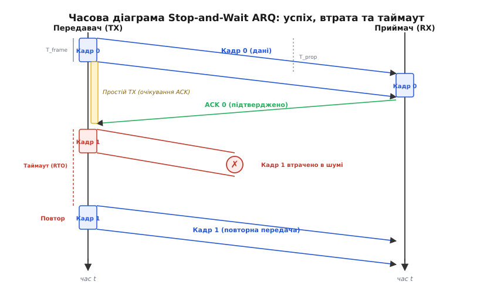
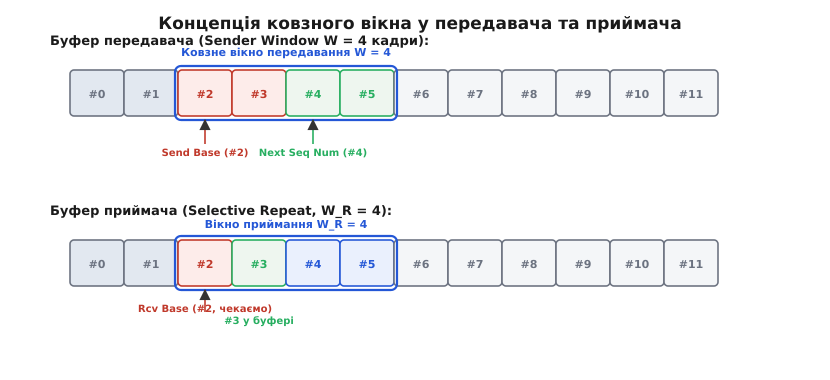
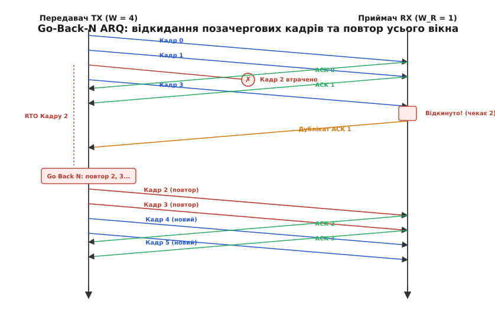
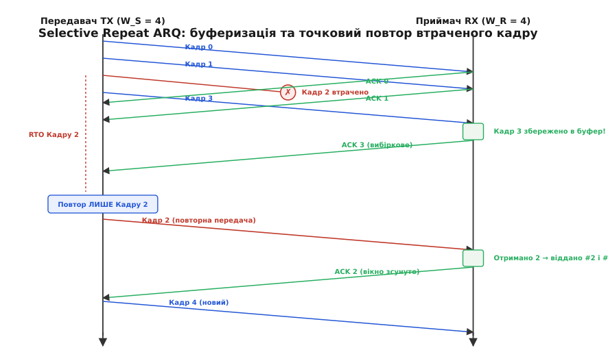
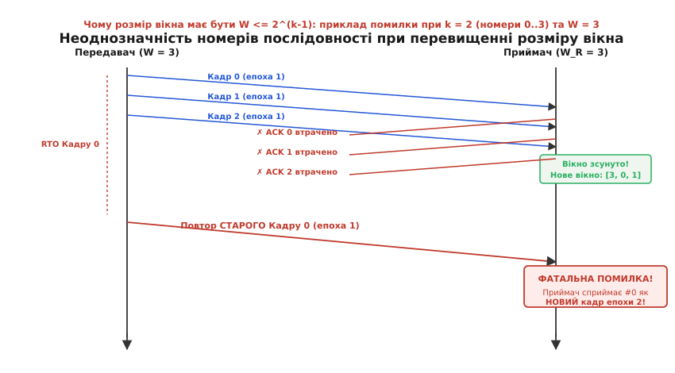
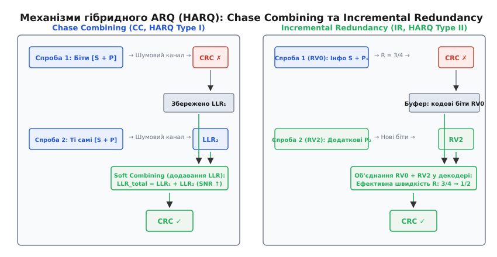

# Протоколи ARQ: Stop-and-Wait, Go-Back-N та Selective Repeat

<preknowlist>
- [Надійний зв'язок поверх ненадійного середовища](topic:com-transport/reliable-link) — виявлення помилок, контрольні суми CRC, базові принципи підтверджень та виявлення втрат.
- [Формування та структура мережевого пакета](topic:com-transport/packet-design) — поля заголовка, корисне навантаження, трейлер та розміщення номерів послідовності.
- [Керування потоком даних](topic:com-transport/flow-control) — узгодження швидкості передавача з місткістю буфера приймача через віконний механізм.
</preknowlist>

Коли цифровий передавач випромінює послідовність бітів у мідний кабель, оптоволокно чи атмосферне радіосередовище, сигнал неминуче піддається впливу фізичних завад. Тепловий шум, інтерференція від сусідніх випромінювачів, імпульсні сплески напруги та багатопроменеве завмирання спотворюють амплітуду й фазу сигналу, інвертуючи окремі біти. Якщо канальний рівень захищає кадри контрольною сумою CRC, приймач виявляє пошкодження й без вагань викидає зіпсований блок, щоб не передавати спотворені байти прикладній програмі. 

У результаті потік даних зазнає безповоротних втрат: із десяти відправлених пакетів до приймача доходять дев'ять, черговість порушується, а прикладний процес зависає в очікуванні відсутнього фрагмента файлу чи команди телеметрії. Якщо канал зв'язку фізично ненадійний, створити ілюзію безперервного й непомильного потоку даних можна лише одним шляхом: змусити приймач надсилати відправникові інформацію про долю кожного кадру, а відправника — автоматично повторювати передачу втрачених або пошкоджених блоків.

Цей клас протоколів зворотного зв'язку дістав назву **автоматичного запиту повторної передачі** (англ. *Automatic Repeat reQuest*, ARQ, від лат. *repetere* — повторювати та *quaerere* — запитувати). Замість участі людини-оператора алгоритм протоколу самостійно відстежує проходження кожного байта, керує таймерами очікування та повторює передачу доти, доки блок не буде гарантовано прийнятий без спотворень.

> Детальну історію розвитку цих систем — від першого 7-бітового телетайпного коду ван Дюрена 1947 року до супутникових магістралей та появи вибіркових підтверджень SACK — викладено у вставці [📜 Від коду Ван Дюрена до 5G: історія автоматичного повтору запиту](topic:com-transport/arq-retransmission-schemes/hist-arq-evolution.md).

---

## Фізика затримки та параметри циклу зворотного зв'язку

Будь-який протокол ARQ базується на обміні двома типами повідомлень: **кадрами даних** (англ. *Data frames*), які рухаються прямим каналом від джерела до одержувача, та **службовими підтвердженнями** (англ. *Acknowledgment*, `ACK`), що повертаються зворотним каналом.

Щоб оцінити продуктивність будь-якої схеми повторної передачі, необхідно розділити повний час доставки пакета на фізичні складові. Нехай джерело транслює кадри фіксованої довжини `L` бітів у канал із бітовою швидкістю передачі `R` біт/с, а фізична довжина лінії зв'язку становить `d` метрів.

```
      Прямий канал: Кадр даних (L біт, швидкість R)
TX ──────────────────────────────────────────────────► RX
   ◄──────────────────────────────────────────────────
      Зворотний канал: Службовий ACK (L_ack біт)
```

Часовий бюджет передачі одного блоку складається з чотирьох величин:

1. **Час випромінювання кадру (`T_frame` або `T_f`):** час, протягом якого передавач утримує фізичний інтерфейс зайнятим, послідовно виштовхуючи всі `L` бітів кадру в лінію:
```
T_frame = L / R
```
Наприклад, для кадру довжиною `1500` байтів (`12 000` бітів) на каналі `100` Мбіт/с час передачі становить `12 000 / 100 000 000 = 0.00012` с (`120` мкс).

2. **Час поширення електромагнітної хвилі (`T_prop` або `T_p`):** час, необхідний фронту сигналу для проходження фізичної відстані `d` зі швидкістю поширення `v` (у міді та оптоволокні `v ≈ 2·10⁸` м/с, у вакуумі та відкритому просторі `v ≈ 3·10⁸` м/с):
```
T_prop = d / v
```
Для оптоволоконного кабелю довжиною `3000` км час поширення становить `3 000 000 / (2·10⁸) = 0.015` с (`15` мс).

3. **Час апаратної обробки на приймачі (`T_proc`):** час розрахунку контрольної суми CRC, виділення пам'яті та формування відповіді (у сучасних трансиверах та мікроконтролерах це частки мікросекунди, тому типово `T_proc ≈ 0`).

4. **Час передачі підтвердження (`T_ack`):** тривалість випромінювання короткого службового пакета `ACK` довжиною `L_ack` бітів (`T_ack = L_ack / R`). Оскільки `L_ack << L`, цим значенням часто нехтують.

Повний час кругового обігу сигналу (англ. *Round-Trip Time*, `RTT`) визначає мінімальний інтервал між початком відправлення першого біта даних і моментом, коли передавач отримує звістку про успішний прийом:

```
RTT = T_frame + 2 · T_prop + T_proc + T_ack ≈ T_frame + 2 · T_prop
```

Співвідношення між часом поширення та часом випромінювання описується безрозмірним параметром **нормалізованої затримки** `a`:

```
a = T_prop / T_frame = (d · R) / (v · L)
```

Параметр `a` показує, скільки пакетів даних може одночасно перебувати «в польоті» всередині фізичного середовища, наче в довгій трубі. Добуток бітової швидкості на час поширення `R · T_prop` (або `R · RTT`) називають **добутком пропускної здатності на затримку** (англ. *Bandwidth-Delay Product*, BDP). Якщо `a << 1` (короткий мідний кабель між двома платами), середовище спорожнюється швидше, ніж закінчується кадр. Якщо ж `a >> 1` (супутниковий лінк або швидкісна магістраль 10 Гбіт/с через континент), канал зв'язку перетворюється на велетенський конвеєр, здатний утримувати тисячі пакетів одночасно.

---

## Stop-and-Wait ARQ: строга послідовність та ціна простою

Найпростішою схемою забезпечення надійності є протокол **Stop-and-Wait** («Зупинись і чекай»).

Алгоритм передавача гранично прямолінійний: надіслати один кадр даних, повністю зупинити передачу, увімкнути таймер очікування повтору (англ. *Retransmission Timeout*, `RTO`) і чекати надходження пакета `ACK`. Якщо `ACK` приходить до спливання таймера, передавач переходить до наступного кадру. Якщо таймер закінчується, а підтвердження немає, передавач надсилає той самий кадр повторно.


*Часова діаграма роботи Stop-and-Wait ARQ: при успішній передачі передавач простоює час 2 · T_prop, а при втраті кадру час простою зростає на повну тривалість таймауту RTO.*

### Проблема запізнілих підтверджень та чергування бітів (Alternating Bit Protocol)

На перший погляд здається, що для протоколу Stop-and-Wait нумерація кадрів узагалі не потрібна: у каналі завжди перебуває щонайбільше один пакет. Проте це оманливе враження. 

Розгляньмо ситуацію, коли прямий кадр дійшов до приймача неушкодженим, але **зворотний пакет `ACK` загубився через заваду** або затримався в черзі маршрутизатора довше за таймаут `RTO`. Передавач вирішує, що кадр утрачено, і відправляє його точну копію. Якщо кадри не пронумеровані, приймач сприйме цей дублікат як абсолютно новий незалежний блок даних і запише його у файл двічі.

Щоб уникнути непомітного дублювання, кадр повинен мати хоча б мінімальну нумерацію. Оскільки передавач не надсилає кадр `i + 1`, доки не отримає підтвердження на кадр `i`, для розрізнення двох сусідніх станів достатньо рівно **1 біта** в заголовку (номери `0` та `1`). Такий протокол називають **протоколом чергування бітів** (англ. *Alternating Bit Protocol*):

1. Передавач відправляє кадр із позначкою `Seq = 0` і чекає на `ACK 0`.
2. Приймач очікує кадр `Seq = 0`. Отримавши його, він віддає дані застосунку, надсилає `ACK 0` і змінює свій стан очікування на `Seq = 1`.
3. Якщо приймач повторно отримує кадр `Seq = 0` (через втрату першого `ACK 0`), він бачить, що цей номер не відповідає очікуваному `Seq = 1`. Приймач негайно відкидає тіло кадру, не передаючи його застосунку, але повторно відправляє `ACK 0`, щоб розблокувати завислий передавач.
4. Отримавши `ACK 0`, передавач переходить до відправлення наступного блока з номером `Seq = 1`.

### Коефіцієнт використання каналу та катастрофа супутникового зв'язку

Головним недоліком Stop-and-Wait є його катастрофічно низька ефективність на каналах із великим часом поширення або високою бітовою швидкістю. 

**Коефіцієнтом використання каналу** (англ. *channel utilization*, `U`) називають частку часу, протягом якої лінія передає корисні дані:

```
U = T_frame / T_cycle
```

В ідеальному каналу без втрат (`p = 0`) повний цикл передачі одного кадру дорівнює:

```
T_cycle = T_frame + 2 · T_prop
```

Поділивши чисельник і знаменник на `T_frame`, отримуємо фундаментальну залежність від параметра `a`:

```
U_SW = T_frame / (T_frame + 2 · T_prop)      [означення U = T_frame / T_cycle]
     = 1 / (1 + 2 · (T_prop / T_frame))      [ділення чисельника і знаменника на T_frame]
     = 1 / (1 + 2 · a)                       [підстановка параметра a = T_prop / T_frame]
```

Якщо в каналі виникають помилки з імовірністю `p`, кожна втрата кадру чи `ACK` вимагає додаткових спроб передачі. Середня кількість спроб до першого успіху підпорядковується геометричному розподілу і становить `1 / (1 - p)`. Тоді реальна утилізація каналу становить:

```
U_SW = (1 - p) / (1 + 2 · a)
```

**Числовий розрахунок.** Розгляньмо супутниковий канал геостаціонарного зв'язку:
* Бітова швидкість лінії: `R = 10` Мбіт/с.
* Затримка поширення до орбіти й назад: `T_prop = 270` мс.
* Розмір кадру: `L = 1500` байтів (`12 000` бітів).

Розрахуємо час випромінювання та коефіцієнт `a`:
```
T_frame = 12 000 / 10 000 000 = 1.2 мс = 0.0012 с
a = T_prop / T_frame = 0.270 / 0.0012 = 225
1 + 2 · a = 1 + 2 · 225 = 451
```

Коефіцієнт використання становить:
```
U_SW = 1 / 451 ≈ 0.002217  (0.22%)
```

Реальна пропускна здатність 10-мегабітної супутникової лінії становить лише `0.002217 · 10 Мбіт/с ≈ 22.17 кбіт/с`. Передавач працює `1.2` мс, після чого `540` мс (понад пів секунди) простоює в мертвому очікуванні відповіді. Лінія зайнята корисним сигналом менше чверті відсотка часу.

> Повний математичний аналіз утилізації каналів, виведення геометричного розподілу спроб та розв'язання прикладних інженерних задач наведено у вставці [🧮 Математичний аналіз ефективності та пропускної здатності протоколів ARQ](topic:com-transport/arq-retransmission-schemes/math-channel-utilization.md).

---

## Концепція конвеєризації та ковзне вікно (Sliding Window)

Щоб усунути простої передавача, протокол повинен відмовитися від правила «один непідтверджений пакет за раз». Джерело має право транслювати наступні кадри безперервно один за одним, заповнюючи фізичну лінію даними, поки перші підтвердження ще летять у зворотному напрямку.

Така техніка називається **конвеєризацією** (англ. *pipelining*), а механізм контролю за кількістю випущених у лінію пакетів — **ковзним вікном** (англ. *Sliding Window*).


*Структура буферів ковзного вікна: передавач зберігає відправлені, але ще не підтверджені кадри між покажчиками `Send Base` та `Next Seq Num`, а приймач утримує вікно очікуваних номерів.*

Передавач виділяє в оперативній пам'яті буфер і керує двома числовими межами:
1. `Send Base` (база вікна) — номер найстарішого надісланого кадру, на який підтвердження ще не надійшло.
2. `Next Seq Num` — номер, який отримає наступний новий кадр від прикладного процесу.

Максимальна кількість пакетів, яким дозволено одночасно перебувати в польоті без підтвердження, називається **розміром вікна передавання** `W` (або `W_S`). Доки різниця між `Next Seq Num` та `Send Base` менша за `W`, передавач вільно випромінює нові пакети. Щойно вікно вичерпується (`Next Seq Num - Send Base = W`), передавач блокує прийом нових даних від застосунку доти, доки не надійде `ACK`, який зсуне базу `Send Base` вперед.

Щоб повністю ліквідувати простої і досягти `100%` завантаження каналу в ідеальному середовищі (`U = 1`), тривалість передачі всієї пачки кадрів `W · T_frame` повинна повністю перекривати час очікування відповіді на перший кадр:

```
W · T_frame ≥ T_frame + 2 · T_prop
W ≥ 1 + 2 · (T_prop / T_frame) = 1 + 2 · a
```

Якщо розмір вікна `W` вибрано з урахуванням ємності BDP (`W ≥ 1 + 2a`), передавач ніколи не припиняє роботу, а пропускна здатність каналу досягає фізичного максимуму `R`.

Залежно від того, як передавач і приймач реагують на втрату окремого кадру всередині конвеєра, протоколи ковзного вікна поділяються на два класи: **Go-Back-N** та **Selective Repeat**.

---

## Go-Back-N ARQ (GBN): масовий повтор та нульовий буфер приймача

У протоколі **Go-Back-N** (англ. *Go-Back-N*, «повернення назад на N кроків») приймач спроєктовано максимально просто й дешево: він має розмір вікна `W_R = 1` і взагалі не містить буфера для зберігання пакетів, що надійшли з порушенням черговості (англ. *out-of-order*).

### Кумулятивні підтвердження та скидання позачергових кадрів

Приймач GBN підтримує єдиний лічильник — `Expected Sequence Number` (номер очікуваного кадру). 

Правила роботи приймача GBN:
1. Якщо прибуває неушкоджений кадр, чий номер `Seq` **суворо збігається** з `Expected Seq`, приймач приймає його, передає застосунку й збільшує лічильник: `Expected Seq = Expected Seq + 1`. У відповідь надсилається **кумулятивне підтвердження** (англ. *Cumulative ACK*), яке засвідчує, що всі пакети до вказаного номера включно благополучно доставлені.
2. Якщо прибуває кадр із будь-яким іншим номером (наприклад, кадр `3`, коли очікувався `2`), приймач **негайно викидає його в смітник**. Жодні позачергові дані не зберігаються. Приймач повторно генерує останній дійсний `ACK` (наприклад, `ACK 1`), сигналізуючи, що він усе ще чекає на кадр `2`.


*Динаміка Go-Back-N при втраті кадру: приймач не має буфера для позачергових пакетів і скидає кадри #3, змушуючи передавач після таймауту повторювати всі пакети від #2.*

### Поведінка передавача при збої

Передавач GBN підтримує **один єдиний апаратний або програмний таймер**, запущений для найстарішого непідтвердженого кадру на позиції `Send Base`.

Коли в каналі губиться кадр (наприклад, `#2` із вікна `0, 1, 2, 3`):
1. Кадри `#0` та `#1` доходять до приймача й підтверджуються. База зміщується: `Send Base = 2`.
2. Кадр `#2` втрачено.
3. Наступний кадр `#3` успішно долає лінію і прибуває до приймача. Оскільки приймач чекає на `#2`, він відкидає кадр `#3` і шле дублікат `ACK 1`.
4. На передавачі спливає таймер `RTO` для кадру `#2`.
5. **Фаза Go Back N:** Передавач констатує аварію, скидає покажчик черги назад до `Send Base` і **повторно випромінює абсолютно всі кадри відкритого вікна** — тобто знову надсилає кадр `#2`, а слідом за ним ще раз кадр `#3`, навіть якщо кадр `#3` минулого разу дійшов без жодної помилки.

### Ефективність та вразливість Go-Back-N

Якщо ймовірність спотворення пакета становить `p`, кожна помилка призводить до знищення та повторної передачі не лише збійного пакета, а й усіх `W - 1` наступних кадрів вікна. Математичне сподівання кількості переданих слотів на один успішно доставлений кадр зростає до `1 + (W · p) / (1 - p)`.

Коефіцієнт використання каналу для GBN при `W ≥ 1 + 2a` становить:

```
U_GBN = (1 - p) / (1 + (W - 1) · p)
```

Якщо розмір вікна `W = 100`, а рівень втрат у каналі становить лише `1%` (`p = 0.01`), знаменник виразу перетворюється на `1 + 99 · 0.01 = 1.99`, що знижує корисну пропускну здатність лінії вдвічі. Якщо ж `p = 0.05`, ефективність падає майже в 6 разів.

Go-Back-N ідеально підходить для дешевих мікроконтролерів із пам'яттю в кілька кілобайтів (наприклад, сенсорні вузли на базі архітектур AVR чи Cortex-M0) на чистих коротких лініях, де приймач принципово не може дозволити собі буферизацію пам'яті. Однак на швидкісних каналах із великою затримкою масовий повтор цілих вікон стає неприпустимим марнотратством смуги.

---

## Selective Repeat ARQ (SR): точкове відновлення та буферизація

Протокол **Selective Repeat** (вибірковий повтор) усуває марнотратство Go-Back-N ціною ускладнення логіки та виділення оперативної пам'яті під буфер на боці приймача.

### Індивідуальні підтвердження та заповнення дірок

У Selective Repeat обидва вузли мають вікна однакового розміру: `W_S = W_R = W`.

Приймач Selective Repeat має буфер із `W_R` комірок. Його робота підпорядковується правилам:
1. Якщо надходить кадр, номер якого потрапляє в діапазон поточного вікна прийому `[Rcv Base .. Rcv Base + W_R - 1]`, приймач зберігає його у відповідній комірці буфера (навіть якщо перед ним є пропущені номери).
2. На кожен отриманий правильний кадр приймач надсилає **вибіркове підтвердження** (англ. *Selective ACK*), у якому вказує точний номер щойно збереженого пакета.
3. Якщо збережений кадр опинився на позиції нижньої межі `Rcv Base`, приймач перевіряє ланцюжок наступних комірок: усі накопичені послідовні кадри виймаються з буфера й гуртом передаються застосунку, а межа `Rcv Base` зсувається вправо до найближчої незаповненої дірки.


*Робота Selective Repeat: приймач буферизує позачерговий кадр #3 і надсилає вибіркове підтвердження, тож передавач після таймауту пересилає виключно втрачений кадр #2.*

### Поведінка передавача Selective Repeat

Передавач відстежує стан кожного слота вікна окремо. Замість одного загального таймера кожен непідтверджений кадр має **власний незалежний таймер `RTO`** (або обслуговується єдиною чергою подій):

1. Коли приходить вибірковий `ACK 3`, передавач помічає слот `#3` як підтверджений і вимикає його таймер. Кадр `#3` більше ніколи не буде передаватися повторно.
2. Коли таймер для втраченого кадру `#2` добігає кінця, передавач повторно надсилає **виключно кадр `#2`**, не зачіпаючи кадр `#3`.
3. Отримавши повторений кадр `#2`, приймач вкладає його у пропущену комірку, склеює з уже збереженим у буфері кадром `#3`, видає застосунку обидва блоки `#2` та `#3` у суворій черговості й надсилає підтвердження `ACK 2`.
4. Бази обох вікон (`Send Base` та `Rcv Base`) синхронно зміщуються вправо на 2 позиції.

### Ефективність Selective Repeat

Оскільки жоден неушкоджений кадр не надсилається в лінію повторно, передача кожного блока є повністю незалежною від інших. Середня кількість спроб передачі будь-якого кадру становить `1 / (1 - p)`.

Коефіцієнт використання каналу за умови `W ≥ 1 + 2a` дорівнює:

```
U_SR = 1 - p
```

**Головна перевага Selective Repeat:** продуктивність протоколу взагалі **не залежить від фізичної затримки каналу `a`** чи розміру вікна `W`, а лінійно зменшується лише на відсоток реальних втрат `p`. На трансатлантичній магістралі з втратами `0.1%` Selective Repeat зберігає `99.9%` пропускної здатності там, де Go-Back-N втрачає майже все.

> Повнофункціональну робочу реалізацію симулятора Go-Back-N та Selective Repeat мовами C та C++, включаючи алгоритми ковзного вікна, циклічну арифметику покажчиків та керування чергою таймерів, наведено у вставці [⚙️ Симулятор ковзного вікна: Go-Back-N та Selective Repeat у C та C++](topic:com-transport/arq-retransmission-schemes/proj-sliding-window.md).

---

## Обмеження простору номерів послідовності: теореми про розмір вікна

У реальних мережевих заголовках номер послідовності `Seq` не може рости до нескінченності: під нього виділяється фіксована кількість бітів `k`. Це означає, що номери належать скінченному кільцю лишків `0, 1, 2, ..., M - 1`, де `M = 2^k`. Після номера `M - 1` лічильник циклічно переповнюється і знову стає рівним `0`.

Ця циклічність створює фундаментальну небезпеку: якщо розмір вікна вибрати занадто великим відносно `M`, приймач не зможе розрізнити новий кадр наступного кола нумерації від повтору старого кадру попереднього кола при втраті підтверджень.


*Колапс адресації при W > 2^(k-1): при втраті всіх підтверджень повтор старого кадру #0 потрапляє у зміщене вікно приймача і помилково сприймається як новий кадр наступного циклу.*

### Обмеження вікна для Go-Back-N: W ≤ 2^k - 1

У протоколі Go-Back-N розмір вікна передавача обмежений умовою:

```
W_S ≤ 2^k - 1 = M - 1
```

**Доведення від супротного.** Нехай `k = 2`, що дає `M = 2² = 4` (номери `0, 1, 2, 3`). Припустимо, що ми проігнорували правило і встановили розмір вікна рівним розміру простору: `W = M = 4`.

1. Передавач транслює 4 кадри: `0, 1, 2, 3`.
2. Усі 4 кадри успішно надходять до приймача. Приймач приймає їх, передає застосунку й зсуває своє очікування вперед на 4 позиції: `Expected Seq = (0 + 4) mod 4 = 0`. Приймач чекає на кадр `0` **нового, другого кола**.
3. Приймач надсилає підтвердження на всі кадри, але **абсолютно всі ці `ACK` губляться в каналі**.
4. На передавачі спливає таймаут для кадру `0`. Передавач вважає, що кадр `0` першого кола не дійшов, і надсилає його повторно.
5. Приймач бачить надходження кадру з номером `Seq = 0`. Оскільки його поточний лічильник `Expected Seq` дорівнює `0`, він вважає, що це прибув **новий кадр `0` другого циклу**, і знову передає старі байти прикладній програмі.

Виникає фатальний збій: застосунок отримує дублікат старих даних під виглядом нових. Щоб унеможливити таку неоднозначність, розмір вікна передавача не повинен перевищувати `M - 1` (для `k = 3` біти `W_max = 7`).

### Обмеження вікна для Selective Repeat: W ≤ 2^(k - 1)

У протоколі Selective Repeat буфер мають обидві сторони зв'язку. Тут діє ще жорсткіше обмеження:

```
W_S + W_R ≤ 2^k = M
```

Якщо розміри вікон передавача й приймача однакові (`W_S = W_R = W`), отримуємо канонічну формулу:

```
W ≤ 2^(k - 1) = M / 2
```

**Аналіз збою при порушенні правила (приклад на діаграмі).** Розгляньмо систему з 2-бітовими номерами (`k = 2`, `M = 4`, номери `0, 1, 2, 3`). Спробуємо встановити розмір вікна `W = 3` (що задовольняє правило GBN `3 ≤ 4 - 1`, але порушує правило SR `3 > 4 / 2`):

1. Вікно передавача: `[0, 1, 2]`. Вікно приймача: `[0, 1, 2]`.
2. Передавач транслює кадри `0, 1, 2`. Усі вони прибувають до одержувача.
3. Приймач буферизує всі три пакети, віддає їх застосунку і зміщує своє приймальне вікно вправо на 3 позиції: нове вікно приймача охоплює номери `[3, 0, 1]` (де `0` і `1` належать уже наступному колу!).
4. Усі три пакети `ACK 0`, `ACK 1`, `ACK 2` губляться через імпульсну заваду.
5. На передавачі спливає таймаут `RTO` для найстарішого кадру `0`. Передавач виконує повтор кадру `0` (старого кадру першого кола).
6. Кадр `0` прибуває до приймача. Приймач дивиться у своє поточне відкрите вікно `[3, 0, 1]`. Номер `0` **присутній у його вікні**! Приймач вирішує, що це прибув новий кадр `0` наступного кола, зберігає його в буфері й віддає користувачеві як нові дані.

**Висновок:** Щоб старе вікно передавача і зміщене нове вікно приймача гарантовано ніколи не перетиналися в кільці лишків, розмір вікна Selective Repeat не може перевищувати **половину розміру простору номерів** `2^(k - 1)`. Для 3-бітової нумерації максимальний розмір вікна становить `8 / 2 = 4`, а для 16-бітової нумерації — `32 768`.

---

## Керування часом: адаптивний розрахунок RTO та сигналізація втрат

Усі протоколи ARQ критично залежать від точності таймера повторної передачі `RTO`.

Якщо значення `RTO` вибрати **занадто малим** (меншим за реальний час обігу сигналу `RTT`), таймер спрацьовуватиме до приходу дійсного підтвердження. Передавач заповнить канал непотрібними повторними копіями пакетів, що на повільних каналах викликає лавиноподібне самоблокування — колапс заторів. Якщо ж встановити `RTO` **занадто великим** (наприклад, кілька секунд при `RTT = 20` мс), після кожної втрати пакета лінія простоюватиме в очікуванні, зводячи швидкість нанівець.

### Алгоритм Вана Джейкобсона (Jacobson / Karels Algorithm)

У реальних мережах затримка `RTT` не є сталою величиною: вона постійно коливається через зміну довжини черг у буферах маршрутизатора (джиттер затримки). 

У 1988 році Ван Джейкобсон запропонував формулу динамічного обчислення `RTO`, яка стала стандартом транспортного рівня інтернету (RFC 6298). Алгоритм безперервно вимірює затримку доставки поточних пакетів (`RTT_sample`) і обчислює дві статистичні оцінки:
1. `SRTT` (англ. *Smoothed Round-Trip Time*) — експоненційно згладжене середнє значення `RTT`.
2. `RTTVAR` (англ. *Round-Trip Time Variation*) — згладжене середнє абсолютне відхилення (оцінка дисперсії).

Формули оновлення після кожного нового вимірювання:

```
delta = RTT_sample - SRTT
SRTT = SRTT + α · delta                 [типово α = 1/8 = 0.125]
RTTVAR = RTTVAR + β · (|delta| - RTTVAR) [типово β = 1/4 = 0.25]
RTO = SRTT + 4 · RTTVAR
```

Множник `4 · RTTVAR` забезпечує захисний інтервал: якщо затримка в мережі стабільна (`RTTVAR ≈ 0`), `RTO` встановлюється впритул до середнього часу обігу; якщо в мережі починаються різкі коливання, `RTO` миттєво відсувається вправо, запобігаючи фальшивим повторам.

### Алгоритм Карна-Партріджа та експоненційний відступ

При роботі адаптивного таймера виникає парадокс неоднозначності: якщо кадр було відправлено повторно після таймауту, а через 10 мс надійшов `ACK`, передавач не знає, на яку саме спробу надійшла відповідь — на першу (яка просто запізнилася) чи на другу.

**Правило Філа Карна (Karn's Algorithm, 1987):**
1. Ніколи не оновлювати значення `SRTT` та `RTTVAR` на основі вибірок `RTT` для пакетів, які передавалися повторно.
2. При кожному черговому таймауті для того самого кадру застосовувати **експоненційний відступ** (англ. *Exponential Backoff*): подвоювати поточне значення таймауту:
```
RTO = 2 · RTO
```
Подвоєння триває до досягнення верхньої стелі (типово 60 секунд), знімаючи навантаження з переповненої мережі.

### Прискорення реакції: швидкий повтор (Fast Retransmit) та NACK

Очікування спливання таймера `RTO` — це завжди втрата десятків мілісекунд. Сучасні протоколи доповнюють таймаути евристиками швидкого виявлення втрат:

1. **Явний сигнал `NACK` (Negative ACK):** Якщо приймач виявляє дірку в потоці номерів (прибув кадр `#5`, коли очікувався `#2`), він негайно генерує службовий пакет `NACK 2`. Передавач повторює кадр `#2` миттєво, не чекаючи таймера.
2. **Швидкий повтор за дубльованими підтвердженнями (Fast Retransmit):** У протоколах із кумулятивними `ACK` (як TCP) прихід кожного позачергового пакета змушує приймач генерувати повторну копію попереднього `ACK`. Отримання передавачем **трьох дубльованих `ACK` поспіль** слугує статистичним доказом того, що наступний пакет утрачено, і передавач запускає позачергову повторну передачу.

---

## Сучасні стандарти: TCP SACK, Block ACK та QUIC

У сучасних протоколах класичні ідеї ARQ адаптовані до специфіки конкретних середовищ передачі:

1. **TCP Selective Acknowledgment (SACK, RFC 2018):** Класичний TCP використовував суворе кумулятивне підтвердження Go-Back-N. Опція SACK дозволяє приймачеві додавати до заголовка TCP до чотирьох неперервних блоків байтів (діапазонів `[Left Edge, Right Edge)`), інформуючи передавача про ізольовані «острови» успішно прийнятих даних і перетворюючи транспортний рівень на повноцінний Selective Repeat.
2. **Wi-Fi Block ACK (IEEE 802.11n/ac/ax/be):** На канальному рівні Wi-Fi передача окремого підтвердження на кожен мікропакет призводила б до катастрофічних накладних витрат через час перемикання трансивера (SIFS) та преамбули кадрів. Механізм Block ACK об'єднує підтвердження для цілої пачки з 64 або 256 агрегованих кадрів (A-MPDU) в одну 64-розрядну бітову карту (англ. *Bitmap*), де кожен біт сигналізує успіх чи збій конкретного кадру.
3. **QUIC ACK Frames (RFC 9000):** Протокол QUIC (основа HTTP/3) остаточно відмовився від фіксованих опцій TCP. Кожен кадр підтвердження QUIC містить компактно закодовані структури змінної довжини, здатні описати десятки розрізнених інтервалів втрачених і збережених пакетів в одному UDP-дейтаграмі.

> Повний технічний довідник бітових форматів заголовків TCP SACK, бітових карт Wi-Fi Block ACK, структур 3GPP RLC Status PDU та кадрів QUIC ACK наведено у вставці [📋 Специфікація полів TCP SACK та параметрів керування LTE/5G HARQ](topic:com-transport/arq-retransmission-schemes/api-tcp-sack-fields.md).

---

## Гібридний ARQ (HARQ): злиття завадостійкого кодування та повторів

У бездротових стільникових мережах 3G (HSDPA), 4G (LTE) та 5G NR класичний канальний чи транспортний ARQ виявляється занадто повільним: затримка обробки в десятки мілісекунд неприпустима для мобільного радіоефіру з високою швидкістю завмирання.

Рішенням стало створення **гібридного ARQ** (англ. *Hybrid ARQ*, HARQ), реалізованого на найнижчому апаратному рівні — фізичному (PHY) та рівні керування доступом до середовища (MAC).


*Архітектура гібридного ARQ: Chase Combining накопичує енергію LLR однакових повторів для підняття SNR, тоді як Incremental Redundancy надсилає додаткові біти парності, знижуючи кодову швидкість декодера.*

### Принцип збереження енергії: відмова від викидання пакетів

У класичному ARQ спотворений кадр, який не пройшов перевірку CRC, безслідно знищується. Приймач забуває про нього і починає прийом повторної копії з чистого аркуша.

В основі HARQ лежить принципово інша філософія: навіть якщо прийнятий блок містить помилки, аналоговий сигнал несе величезний обсяг корисної інформації про передані біти. Демодулятор приймача обчислює для кожного біта **логарифмічне відношення правдоподібності** (англ. *Log-Likelihood Ratio*, `LLR`):

```
LLR(b) = ln( P(b = 0 | y) / P(b = 1 | y) )
```

Знак величини `LLR` вказує на найбільш імовірне значення біта (`0` або `1`), а її абсолютна величина — на ступінь упевненості приймача. Якщо перевірка CRC зазнає невдачі, масив `LLR` не викидається, а зберігається в спеціальному **буфері м'яких рішень** (англ. *Soft Buffer*).

### Дві схеми об'єднання: Chase Combining проти Incremental Redundancy

1. **Chase Combining (CC, HARQ Type I):**
   При повторній передачі передавач випромінює в точності той самий набір бітів, що й першого разу. Приймач побітово додає нові значення `LLR` до збережених у буфері:
```
LLR_combined = LLR_old + LLR_new
```
   Оскільки шум у каналі є некорельованим випадковим процесом, а корисний сигнал збігається за фазою, енергія сигналу накопичується. Відношення сигнал/шум (SNR) зростає пропорційно кількості спроб, дозволяючи декодеру успішно відновити дані після 2–3 повторів навіть у глибокій тіні радіозавад.

2. **Incremental Redundancy (IR, HARQ Type II/III):**
   У цій схемі повторна передача містить **принципово інші біти**. Первинний блок кодується завадостійким кодом (турбо-кодом або LDPC) з низькою базовою швидкістю (наприклад, `R = 1/3`). Спочатку передавач надсилає лише частину перевірочних бітів (наприклад, підмножину `RV0` зі швидкістю `R = 3/4`). Якщо декодер не справляється, передавач при повторі надсилає наступну порцію перевірочних бітів парності (`RV2`, `RV3`). Декодер на приймачі об'єднує всі отримані перевірочні рівняння, динамічно знижуючи ефективну швидкість коду (наприклад, до `R = 1/2`, а потім до `R = 1/3`). Це дозволяє виправити помилки без збільшення потужності передавача.

### Багатопроцесний апаратний Stop-and-Wait

Щоб уникнути складного керування буферами ковзного вікна на наносекундних швидкостях базових станцій, HARQ використовує архітектуру **паралельних процесів Stop-and-Wait** (англ. *Multi-Process Stop-and-Wait*):

* У LTE FDD виділяється **8 паралельних процесів HARQ**, а в 5G NR — до **16 процесів**.
* Передавач надсилає блок для процесу `#0` за принципом Stop-and-Wait. У наступному часовому слоті, поки для процесу `#0` триває розрахунок CRC і поширення сигналу, передавач транслює блок для процесу `#1`, потім `#2` і так далі.
* До моменту, коли черга доходить знову до слота `#0`, відповідь `ACK/NACK` на перший блок уже отримана. Конвеєр завантажений на `100%`, а кожен окремий процес зберігає абсолютну простоту кінцевого автомата Stop-and-Wait.

---

## Зведена інженерна характеристика та компроміси вибору

Вибір конкретної схеми автоматичного повтору визначається балансом між доступними апаратними ресурсами, параметрами фізичного каналу зв'язку та вимогами до затримки:

| Параметр порівняння | Stop-and-Wait ARQ | Go-Back-N ARQ | Selective Repeat ARQ | Гібридний ARQ (HARQ) |
| :--- | :--- | :--- | :--- | :--- |
| **Розмір вікна передавача `W_S`** | `1` | `≤ 2^k - 1` | `≤ 2^(k-1)` | 1 на процес (до 16 процесів) |
| **Розмір вікна приймача `W_R`** | `1` | `1` (нульовий буфер) | `W_S` (буфер обов'язковий) | 1 на процес (Soft Buffer LLR) |
| **Тип підтверджень** | Індивідуальний (1 біт) | Кумулятивний ACK | Вибірковий ACK (SACK/Bitmap) | 1-бітний ACK/NACK на процес |
| **Утилізація `U` (без втрат)** | `1 / (1 + 2a)` | `min(1, W / (1 + 2a))` | `min(1, W / (1 + 2a))` | `1.0` (конвеєр процесів) |
| **Утилізація `U` (при втратах `p`)** | `(1 - p) / (1 + 2a)` | `(1 - p) / (1 + (W - 1) · p)` | `1 - p` | Наближається до ємності Шеннона |
| **Чутливість до затримки `a`** | Критична (`~ 1/a`) | Залежить від `W · p` | Відсутня (при `W ≥ 1 + 2a`) | Мінімальна (апаратний конвеєр) |
| **Складність реалізації** | Мінімальна | Низька (1 таймер) | Висока (черги, буфери) | Надвисока (DSP/FPGA декодери) |
| **Типова сфера застосування** | Прості UART/RS-485, датчики | Вбудовані стеки, LoRaWAN | TCP SACK, QUIC, Wi-Fi | Радіоінтерфейси LTE, 5G NR |

Сучасні телекомунікаційні системи не обирають якийсь один протокол ARQ, а будують **багаторівневу ієрархію надійності**. На фізичному рівні (PHY/MAC) базової станції 5G діє надшвидкий апаратний HARQ, який за 1–2 мілісекунди виправляє понад 90% випадкових помилок радіоефіру. Ті рідкісні пакети, які не вдалося відновити за 4 спроби HARQ, перехоплюються рівнем керування радіозв'язком RLC AM за допомогою Selective Repeat, а надійність наскрізного з'єднання через глобальний інтернет гарантується протоколами TCP SACK або QUIC на транспортному рівні. Кожен шар розв'язує задачу надійності у своєму часовому масштабі, перетворюючи фізично нестабільне середовище на бездоганний канал зв'язку.
