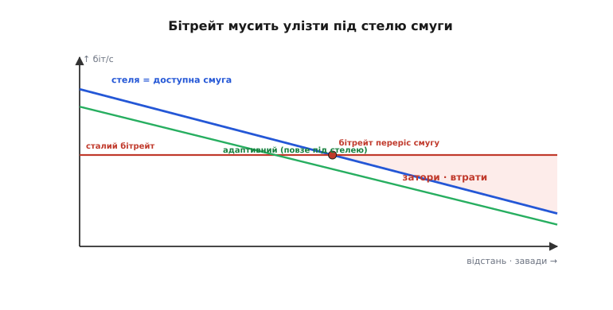
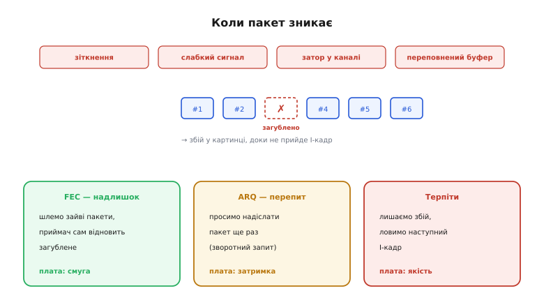
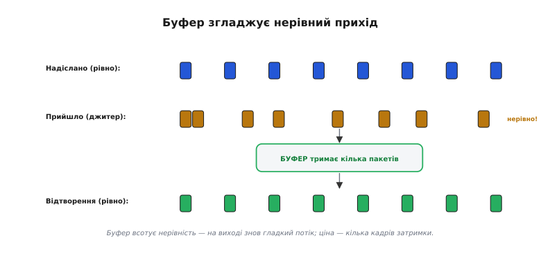
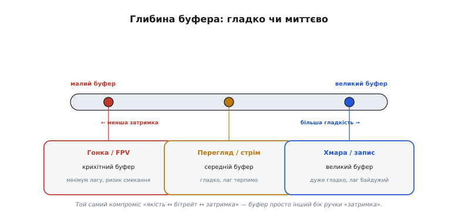

# Пропускна й втрати

<preknowlist>
- [Передача відео цифровою мережею](root:com-transport/video-transmission) — відео як потік цифрових пакетів, що біжать каналом.
- [Відеобітрейт](root:com-signal/quality-bitrate) — скільки біт за секунду з'їдає закодований потік і як він в'яжеться з якістю.
- [Межа Шеннона](root:math-information/bandwidth-capacity) — чому ємність каналу падає, коли слабшає сигнал проти шуму.
- [I-кадр](root:com-signal/inter-frame) — опорний кадр, від якого залежить, доки тягнеться збій від загубленого пакета.
</preknowlist>

Коли відео доправляють [цифровою мережею](root:com-transport/video-transmission), вилазять реалії, на які натикаєшся щокроку: скільки біт за секунду канал насправді витягне (**пропускна здатність**), що буде, коли пакети **зникають** (втрати), і як черга-**буфер** згладжує нерівний прихід. Саме ця трійця вирішує, чи потік іде гладко, чи смикається й розсипається.

### Пропускна здатність: бітрейт мусить улізти під стелю

**Пропускна здатність** (англ. *bandwidth* — «ширина смуги»; інженери ще кажуть *throughput* — «протік», скільки даних реально протікає за секунду) — це скільки біт за секунду канал доправляє. І вона **не стала**: що далі апарат, що більше завад і перешкод, то слабший сигнал — а отже, нижча стеля. Так працює [межа Шеннона](root:math-information/bandwidth-capacity): менше відношення сигнал/шум — менша ємність каналу. Твій [відеобітрейт](root:com-signal/quality-bitrate) мусить іти **під** цією стелею, та ще й із запасом.


*Бітрейт під стелею смуги. Доступна смуга падає з відстанню й завадами. Поки сталий бітрейт іде під нею — усе гаразд; та щойно стеля опускається нижче, бітрейт її переростає, і починаються затори й втрати (червона зона). Рятунок — адаптивний бітрейт: кодек сам знижує потік, повзучи під стелею, тож якість плавно падає, а зв'язок тримається. Аналоговий канал так не вміє — у нього бітрейт зашитий у форму хвилі.*

Якщо бітрейт **перевищить** доступну смугу — канал захлинається: пакети стають у чергу, спізнюються, губляться. Ось чому розумні цифрові системи крутять **адаптивний бітрейт**: коли смуга вужчає, кодувальник сам знижує потік ([грубіше квантування](root:com-signal/jpeg-intra)) — картинка м'якшає, але зв'язок живий. Це і є та плавність проти обриву: адаптивність перетворює різкий розрив на поступове згасання якості.

### Втрати: коли пакет зникає

Хоч як добре влізли під стелю, **пакети все одно гублять** (англ. *packet loss* — «втрата пакетів») — і дорогою, і в самому приймачі. Причини: зіткнення в ефірі, слабкий сигнал, затор у каналі, переповнення буфера. А наслідок для відео простий: загублений пакет — це збій у картинці, що тягнеться аж до наступного [I-кадру](root:com-signal/inter-frame).


*Коли пакет зникає. Пакет губиться від зіткнень, слабкого сигналу, заторів чи переповнення буфера — і в картинці буде збій, доки не прийде I-кадр. Три відповіді, і кожна за свою плату: FEC (шлемо надлишкові пакети, приймач сам відновлює загублене — плата смугою), ARQ (просимо надіслати пакет ще раз — плата затримкою), терпіти (лишаємо збій, чекаємо наступний I-кадр — плата якістю).*

Проти втрат є рівно три ходи, і кожен бере свою ціну. **FEC** (англ. *forward error correction* — «упереджувальне виправлення помилок»): шлемо трохи надлишкових пакетів, з яких приймач сам відновить загублене, нічого не перепитуючи — плата йде смугою. **ARQ** (англ. *automatic repeat request* — «автоматичний запит повтору»): приймач просить надіслати втрачений пакет ще раз — надійно, та зворотний запит коштує затримки, тому для живого відео майже непридатний (спізнілий кадр уже нікому не потрібен). **Терпіти**: просто лишити збій і дочекатися наступного I-кадру — плата якістю. Тобто загублений пакет завжди обходиться **смугою, затримкою або якістю** — задарма його не повернеш.

> 🔧 **Навіщо це.** Втрати по-різному б'ють по різному трафіку. Для **відео** загублений пакет — це секундний збій картинки до наступного I-кадру, тож лікуємо його FEC, не перепитом. Для **телеметрії** (координати, висота, заряд) важить не цілість кожного байта, а свіжість: краще дістати **новий** замір, ніж перепитувати застарілий, — тому телеметрію шлють короткими самодостатніми пакетами, де кожен наступний скасовує попередній. А ось прошивку чи фото з борту хочеться **без жодної діри** — там доречний саме ARQ, бо затримка байдужа, а цілість критична.

### Корисна швидкість: не все, що тече, доходить ділом

Стеля смуги — це «грубі» біти на дроті. Та користувачеві важить не вони, а **корисна швидкість** (англ. *goodput* — «корисний протік», на противагу *throughput*): скільки **корисних** даних за секунду доходить до застосунку. Між ними — двоє відрахувань. По-перше, **втрати**: усе, що загубилося (а з ARQ — ще й перепитані копії), корисної роботи не зробило. По-друге, **накладні** (англ. *overhead* — «те, що зверху»): кожен пакет несе **заголовки** (адреси, номери, контрольні суми), службові підтвердження й, коли ввімкнено FEC, надлишкові пакети — усе це їде каналом, але корисним вантажем не є.

Грубо корисну швидкість оцінюють так:

```math
корисна швидкість = пропускна × (1 − втрати) − накладні
```

⚙️ **Worked-приклад.** Канал тримає **8 Мбіт/с**, утрачається **3 %** пакетів, заголовки й службовий трафік з'їдають **0.6 Мбіт/с**. Скільки корисного відео реально долетить?

:::tabs
```c
// оцінка корисної швидкості каналу для відеобітрейту
float link_bps   = 8.0e6f;   // пропускна, біт/с
float loss       = 0.03f;    // частка втрат (3 %)
float overhead   = 0.6e6f;   // накладні: заголовки + ARQ-підтвердження, біт/с

float goodput = link_bps * (1.0f - loss) - overhead;
//            = 8.0e6 * 0.97 - 0.6e6
//            = 7.76e6 - 0.6e6
//            = 7.16e6  ≈ 7.16 Мбіт/с

// бітрейт кодека ставимо НИЖЧЕ за це, із запасом ~20 %:
float target_bitrate = goodput * 0.8f;   // ≈ 5.7 Мбіт/с
```
```python
# оцінка корисної швидкості каналу для відеобітрейту
link_bps  = 8.0e6    # пропускна, біт/с
loss      = 0.03     # частка втрат (3 %)
overhead  = 0.6e6    # накладні: заголовки + ARQ-підтвердження, біт/с

goodput = link_bps * (1.0 - loss) - overhead
#       = 8.0e6 * 0.97 - 0.6e6
#       = 7.76e6 - 0.6e6
#       = 7.16e6  ≈ 7.16 Мбіт/с

# бітрейт кодека ставимо НИЖЧЕ за це, із запасом ~20 %:
target_bitrate = goodput * 0.8    # ≈ 5.7 Мбіт/с
```
:::

Канал начебто «8-мегабітний», а корисного під відео лишилося **7.16**, і ставити бітрейт варто ще нижче — близько **5.7 Мбіт/с**. Ось чому «налити канал по паспортній цифрі» — певний шлях до заторів: паспорт міряє грубі біти, а відео живе на корисних.

Накладні не лихо, а плата за надійність і адресацію: без заголовків пакет нікуди не дійде, без FEC не відновиться втрата. Але рахувати треба саме корисну швидкість — бо на екран іде вона, а не паспортна цифра каналу.

### Джитер і буфер: згладити нерівний прихід

Навіть коли пакети доходять усі, вони приходять **нерівно**: мережа щоразу затримує їх трохи по-різному. Цю нерівність приходу звуть **джитером** (англ. *jitter* — «тремтіння»). Якби кадри віддавали на екран рівно в міру приходу — відео б смикалося. Рятує **буфер** (англ. *buffer* — «прокладка, що пом'якшує поштовх»): невелика черга, що тримає кілька пакетів напоготові, аби на екран завжди йшов рівний потік.


*Джитер і буфер. Пакети шлють рівно, але мережа доправляє їх нерівно (десь густо, десь із розривом). Буфер тримає кілька пакетів у черзі, тож на виході знов виходить рівний, гладкий потік на екран. Ціна — кілька кадрів затримки: кожен пакет чекає в черзі своєї миті.*

Буфер **всотує** нерівність: швидкі пакети чекають у черзі, повільні встигають надійти — і відтворення йде гладко. Та за це платять **затримкою**: усе, що лежить у буфері, чекає своєї миті. Саме тут і криється головний компроміс буферизації.

### Глибина буфера: гладко чи миттєво

Скільки пакетів тримати в буфері — це і є ручка між **гладкістю** і **затримкою**.


*Глибина буфера — компроміс. Малий буфер дає малу затримку, та на джитері смикається й губить (бракне запасу). Великий гладко й стійко всотує і джитер, і дрібні втрати, та додає лаг. Тож гонка й FPV беруть крихітний буфер (миттєвість понад усе), перегляд і стрім — середній (гладко, лаг терпимо), а хмара й запис — великий (лаг байдужий). Це той самий компроміс «якість ↔ бітрейт ↔ затримка» — буфер просто інший бік ручки «затримка».*

**Малий** буфер дає малу затримку, та на джитері легко смикається й губить (не встигає підстрахувати спізнілий пакет). **Великий** буфер гладко всотує і джитер, і дрібні втрати — але кожен зайвий пакет у черзі додає лагу. Тому гонка й ручне FPV ріжуть буфер мало не до нуля (миттєвість понад усе, хай і смикне), перегляд і стрім тримають середній (гладко, а десяток мілісекунд лагу не шкода), а запис у хмару чи на картку не шкодує буфера зовсім (лаг там байдужий). Це, по суті, **той самий компроміс** [«якість ↔ бітрейт ↔ затримка»](root:com-signal/quality-bitrate): буфер — просто інший бік ручки «затримка».

> 📜 **Як ідея пережити ядерну війну зробила відео стійким до втрат.** Чому загублений пакет лише дряпає картинку, а не рве зв'язок? Бо відео йде **незалежними пакетами** — а цю ідею народила холодна війна. На початку 1960-х інженер **Пол Беран** із корпорації RAND шукав, як збудувати мережу зв'язку, що **переживе ядерний удар**: якщо ворог вирве кілька вузлів, решта має працювати. Його розв'язок (доповіді «On Distributed Communications», 1964 рік; перші праці — ще з 1960–62) був радикальний: не тягнути один тендітний провід від А до Б, а **порізати** повідомлення на дрібні порції даних (*message blocks*), пустити кожну **самостійно** через комірчасту мережу найшвидшим вільним шляхом — і зібрати докупи на тому кінці. Незалежно від нього те саме 1965 року придумав британець **Дональд Девіс** із NPL — і саме він назвав ці порції **пакетами** (англ. *packet* — «пакунок»; слово він дібрав, порадившись із мовознавцем). Військові спершу махнули рукою (а телефонна монополія AT&T казала, що це не запрацює), та згодом ідея лягла в основу **ARPANET**, а далі — усього інтернету. І твого відеолінка теж: коли цифровий потік летить незалежними пакетами, втрата кількох — лише збій, а не розрив: решта приходять самі й збираються в кадр. (Щоправда, «знайти **інший шлях**» уміють маршрутизовані й комірчасті мережі; у звичайному двоточковому дрон-лінку шлях один, тож загублений пакет просто втрачено — рятують незалежність пакетів і FEC, а не перемаршрутизація.) Стійкість, задумана проти бомби, щодня рятує твою картинку від звичайних завад.

> 🔧 **Навіщо це.** Постав відеобітрейт **нижче корисної** швидкості каналу (не паспортної смуги!), із запасом — і ввімкни **адаптивний** режим, якщо є: хай кодек сам сповзає за стелею, а не б'ється об обрив. Не наливай канал по вінця — повний канал означає затори, а отже втрати. Для наживо лікуй втрати **FEC**, не перепитом (ARQ додасть лаг). Крути **буфер** під місію: гонка — мінімум (хай смикне, аби миттєво), запис — більший (гладко). І стеж за **статистикою лінка** (смуга, втрати, джитер): саме вони, а не «магія», вирішують, чи долетить картинка.
