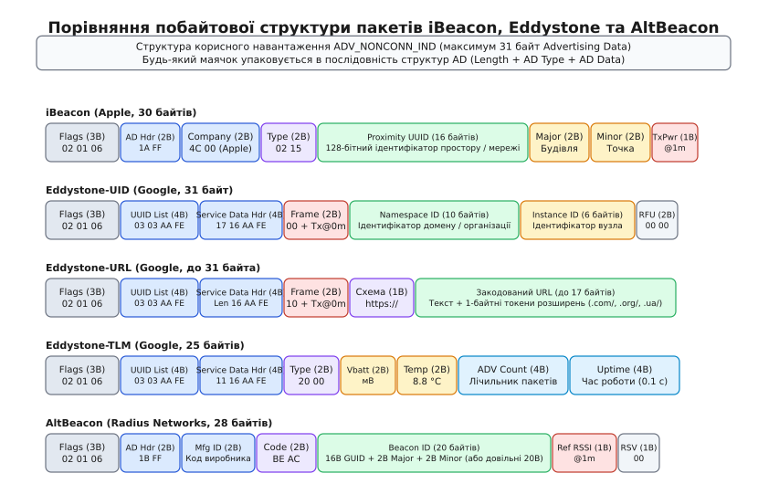
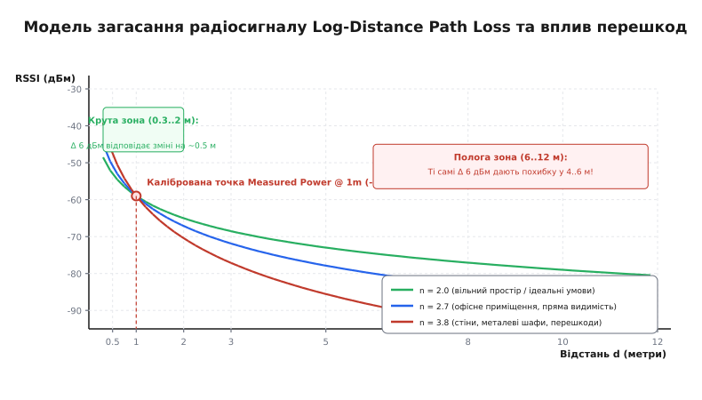
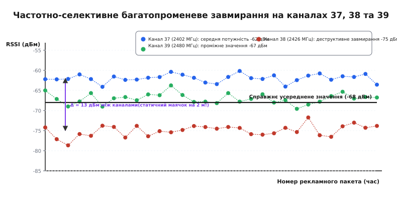
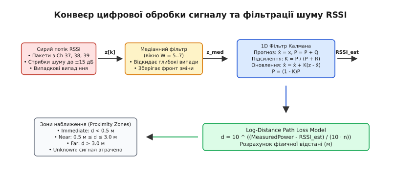

# Формати BLE-маячків: iBeacon, Eddystone та AltBeacon

<preknowlist>
- [BLE GAP](topic:com-transport/ble-gap) — ролі мовника й спостерігача, первинні канали рекламування та структура подій.
- [Дизайн пакетів](topic:com-transport/packet-design) — канальні блоки PDU, заголовки, поля довжини та корисне навантаження.
- [Загасання у просторі](topic:com-medium/free-space-loss) — модель спадання потужності радіосигналу з відстанню.
- [Багатопроменевість](topic:com-medium/multipath-fading) — інтерференція та частотно-селективне завмирання радіохвиль.
</preknowlist>

Коли мобільний пристрій потрапляє у закрите приміщення — складський термінал, торговельну залу, підземний тунель чи лікарняний корпус, — сигнали супутникової навігації GPS/ГЛОНАСС згасають через залізобетонні стіни та перекриття на 30–40 дБ і стають непридатними для визначення координат. Спроба розгорнути мережу двостороннього бездротового зв'язку для локалізації на основі стандартних з'єднань Bluetooth стикається з нездоланними апаратними обмеженнями: узгодження сесії між центральним і периферійним вузлом вимагає сотень мілісекунд, пам'ять мікроконтролера переповнюється таблицями активних підключень, а приймач споживає постійний струм 10–15 мА, через що літієвий дисковий елемент CR2032 ємністю 220 мА·год розряджається менш ніж за 20 годин. Щоб забезпечити автономне просторове маркування з енергоспоживанням у кілька мікроамперів і терміном служби від однієї мініатюрної батареї до 3–5 років, радіоінтерфейс переносять у режим строго асиметричного одностороннього мовлення — радіомаячків (англ. *Bluetooth Beacons*).

Маячок не встановлює двосторонніх сесій і ніколи не вмикає приймач для очікування відповідей: він періодично прокидається на частку мілісекунди, транслює стандартизований цифровий відбиток у непідключуваному рекламному пакеті `ADV_NONCONN_IND` і негайно повертається в стан глибокого енергозбереження зі струмом менше 1.5 мкА. Для структурованого кодування ідентифікаторів простору, вебадрес, діагностичної телеметрії батареї та каліброваних рівнів випромінювання індустрія виробила три конкуруючі формати двійкових фреймів: пропрієтарний **Apple iBeacon**, відкрите модульне сімейство **Google Eddystone** та відкритий стандарт **Radius Networks AltBeacon**.

---

### Анатомія непідключуваного мовлення: від Link Layer до AD Structures

Фундаментом функціонування будь-якого маячка є роль мовника (Broadcaster) у профілі [BLE GAP](topic:com-transport/ble-gap). На канальному рівні (Link Layer) передавач транслює канальний блок **ADV_NONCONN_IND** (від англ. *Advertising Non-Connectable Undirected Event*, «непідключувана неспрямована рекламна подія»).


*Порівняння побайтової структури корисного навантаження iBeacon, Eddystone-UID, Eddystone-URL, Eddystone-TLM та AltBeacon усередині 31-байтного контейнера Advertising Data.*

Канальний блок PDU (від англ. *Protocol Data Unit*) містить 2-байтний заголовок, 6-байтну апаратну адресу передавача (`AdvA`, 48-бітна MAC-адреса) та поле корисних даних `AdvData` розміром від 0 до 31 байта. У специфікаціях BLE 4.0/4.2 саме це 31-байтне вікно є абсолютним обмеженням, у яке розробники протоколів змушені щільно пакувати всю ідентифікаційну інформацію, метадані та калібрувальні коефіцієнти, як показано у [побайтовій специфікації двійкових структур маячків](topic:com-transport/ble-beacon-formats/api-beacon-payloads.md).

Усередині поля `AdvData` інформація упаковується у послідовність уніфікованих структур **AD Structure** (від англ. *Advertising Data Structure*). Кожна структура формується трьома елементами:
1. `Length` (1 байт) — визначає кількість байтів, що слідують за цим полем (тобто довжина типу `AD Type` плюс довжина корисних даних `AD Data`);
2. `AD Type` (1 байт) — стандартизований числовий тип даних за специфікацією Bluetooth SIG;
3. `AD Data` (`Length - 1` байтів) — безпосередній бінарний вміст структури.

Будь-який коректний маячок починається з обов'язкової 3-байтної структури прапорців `Flags` (`AD Type = 0x01`):
* `0x02` (довжина: 2 байти далі);
* `0x01` (тип: Flags);
* `0x06` (значення бітової маски: `0x02` — *LE General Discoverable Mode* \| `0x04` — *BR/EDR Not Supported*).

Ці 3 байти інформують сканери, що пристрій працює виключно за стандартом Bluetooth Low Energy і відкритий для виявлення всіма спостерігачами. У результаті для корисного навантаження власне формату маячка залишається рівно `31 - 3 = 28` байтів.

#### Розклад канального мовлення та захист від колізій `advDelay`

Рекламування відбувається пачками — подіями рекламування (*Advertising Events*). Під час однієї події передавач вмикається і послідовно випромінює однаковий пакет на трьох первинних рекламних каналах: **37 (2402 МГц)**, потім **38 (2426 МГц)** і **39 (2480 МГц)**. Повний цикл передачі на трьох частотах триває від 1.5 до 2.5 мс залежно від довжини пакета.

Якщо два сусідні маячки мають однаковий період рекламування `advInterval = 1000 мс`, їхні радіоімпульси рано чи пізно синхронізувалися б у часі, викликаючи постійні взаємні колізії в ефірі. Щоб уникнути цього, специфікація Bluetooth Core вимагає додавати до кожного інтервалу випадкову псевдовипадкову затримку **advDelay**:

```
T_event = advInterval + advDelay,   де advDelay ∈ [0 .. 10] мс
```

Завдяки цьому фази випромінювання сусідніх маячків постійно зсуваються відносно один одного, гарантуючи успішне декодування пакетів сканером без радіоколізій.

---

### Apple iBeacon: пропрієтарний стандарт мікропозиціонування

Компанія Apple представила специфікацію iBeacon (від давньосканд. *Blátǫnn* та англ. *beacon* — сигнальний вогонь, маяк) у 2013 році разом із операційною системою iOS 7. Метою протоколу було створення механізму визначення мікролокації (англ. *proximity sensing*) усередині приміщень без внесення змін до специфікації Bluetooth Core.

iBeacon використовує структуру даних виробника **Manufacturer Specific Data** (`AD Type = 0xFF`). Повна структура корисного навантаження має довжину 27 байтів (разом із полем довжини та типу), що у сумі з 3-байтним блоком `Flags` дає рівно 30 байтів:

```
       0                   1                   2                   3
       0 1 2 3 4 5 6 7 8 9 0 1 2 3 4 5 6 7 8 9 0 1 2 3 4 5 6 7 8 9 0 1
      +-+-+-+-+-+-+-+-+-+-+-+-+-+-+-+-+-+-+-+-+-+-+-+-+-+-+-+-+-+-+-+-+
      |  Len (0x1A)   | AD Type (0xFF)|      Company ID (0x004C)      |
      +-+-+-+-+-+-+-+-+-+-+-+-+-+-+-+-+-+-+-+-+-+-+-+-+-+-+-+-+-+-+-+-+
      |Type Len (0x15)|Beacon Type(02)|                               |
      +-+-+-+-+-+-+-+-+-+-+-+-+-+-+-+-+                               +
      |                                                               |
      +                                                               +
      |                 Proximity UUID (16 байтів)                    |
      +                                                               +
      |                                                               |
      +                               +-+-+-+-+-+-+-+-+-+-+-+-+-+-+-+-+
      |                               |        Major ID (2B)          |
      +-+-+-+-+-+-+-+-+-+-+-+-+-+-+-+-+-+-+-+-+-+-+-+-+-+-+-+-+-+-+-+-+
      |        Minor ID (2B)          | Measured Power|
      +-+-+-+-+-+-+-+-+-+-+-+-+-+-+-+-+-+-+-+-+-+-+-+-+
```

#### Поля кадру iBeacon

1. **Company Identifier (2 байти, Little Endian):** значення `0x004C` (у порядку передачі в ефірі: `0x4C, 0x00`), офіційно закріплений за Apple Inc. у реєстрі Bluetooth SIG.
2. **Beacon Type (1 байт) та Subtype Length (1 байт):** константа `0x02` ідентифікує підтип iBeacon, а `0x15` (21 у десятковій системі) вказує на кількість наступних байтів корисного навантаження.
3. **Proximity UUID (16 байтів / 128 бітів, Big Endian):** унікальний глобальний ідентифікатор розгортання. Зазвичай одна організація (наприклад, мережа супермаркетів або аеропорт) прошиває однаковий UUID у всі свої маячки.
4. **Major ID (2 байти / 16 бітів, Big Endian):** старший ієрархічний номер для групування просторів (наприклад, конкретна будівля, торговельний центр чи поверх). Діапазон значень: `0..65535`.
5. **Minor ID (2 байти / 16 бітів, Big Endian):** молодший ієрархічний номер для точкової локалізації (конкретний відділ, стелаж, каса чи експонат музею). Діапазон: `0..65535`.
6. **Measured Power (1 байт, знакове `int8_t` у доповняльному коді):** заводськи відкаліброване значення потужності прийому (RSSI) на відстані рівно **1 метр** від випромінювача. Наприклад, байт `0xC5` відповідає `-59` дБм. Цей параметр є ключовим для математичного розрахунку відстані.

#### Системна інтеграція в iOS: Monitoring проти Ranging

Операційна система iOS оптимізує енергоспоживання через поділ взаємодії з iBeacon на два рівні у фреймворку CoreLocation:

* **Моніторинг регіонів (Region Monitoring):** застосунок реєструє Proximity UUID і може бути повністю вивантажений із пам'яті. Диспетчер ядра операційної системи здійснює пасивне сканування ефіру з низькою шпаруватістю. Коли користувач підходить до маячка, iOS фіксує перетин межі (`didEnterRegion`), "будить" застосунок у фоновому режимі на кілька секунд і передає йому сповіщення.
* **Визначення відстані (Ranging):** коли застосунок працює на передньому плані (Foreground) або тимчасово активований фоном, радіомодуль переходить у режим безперервного сканування (частота 1 Гц), формуючи масив виявлених маячків із точними значеннями RSSI та розрахунковою дистанцією.

> 🔧 **Навіщо це.** Трьохрівнева ієрархія `UUID -> Major -> Minor` дозволяє одному мобільному застосунку відстежувати десятки тисяч точок присутності без зміни клієнтського коду: мобільний додаток реєструє в ОС лише один `UUID`, а точну мапу об'єктів формує динамічно через локальну базу даних або REST API за комбінацією `Major` і `Minor`.

---

### Google Eddystone: відкрите мультифреймове сімейство

У липні 2015 року компанія Google представила відкритий кросплатформний стандарт Eddystone (названий на честь відомого скельного маяка Еддістон в Англії). На відміну від закритої та жорстко фіксованої схеми iBeacon, Eddystone побудований як відкритий протокол під ліцензією Apache 2.0 і підтримує динамічне чергування різних типів кадрів.

Eddystone базується на стандартній структурі даних сервісу **Service Data** (`AD Type = 0x16`) з виділеним 16-бітним ідентифікатором сервісу **0xFEAA** (у порядку Little Endian: `0xAA, 0xFE`), офіційно зареєстрованим Google у Bluetooth SIG. Рекламний пакет додатково включає структуру повного списку 16-бітних сервісів (`AD Type = 0x03`, байти `0x03, 0x03, 0xAA, 0xFE`).

Усі кадри сімейства Eddystone мають спільний заголовок даних сервісу, після якого перший байт визначає тип кадру (**Frame Type**):
* `0x00` — **Eddystone-UID** (ідентифікатор об'єкта);
* `0x10` — **Eddystone-URL** (пряме гіперпосилання);
* `0x20` — **Eddystone-TLM** (діагностична телеметрія);
* `0x30` — **Eddystone-EID** (ефемерний захищений ідентифікатор).

Маячок може транслювати ці кадри по черзі (англ. *interleaved advertising*): наприклад, кожні 100 мс транслювати UID, а раз на 10 секунд — кадр телеметрії TLM.

```
                  Кадри сімейства Google Eddystone (0xFEAA)
                                      │
        ┌──────────────────┬──────────┴──────────┬──────────────────┐
        ▼                  ▼                     ▼                  ▼
  Eddystone-UID      Eddystone-URL         Eddystone-TLM      Eddystone-EID
  • Frame: 0x00      • Frame: 0x10         • Frame: 0x20      • Frame: 0x30
  • Tx @ 0m          • Tx @ 0m             • Версія: 0x00     • Tx @ 0m
  • Namespace (10B)  • Схема URL (1B)      • Vbatt (мВ)       • Ефемерний ID (8B)
  • Instance (6B)    • Стиснений URL (17B) • Температура      • AES-128 ротація
  • RFU (2B)                               • Лічильник ADV
                                           • Час роботи (0.1с)
```

---

#### 1. Eddystone-UID: ієрархічна хмарна адресація

Кадр призначений для асоціації фізичного об'єкта з хмарними реєстрами (Google Proximity Beacon API):

* **Frame Type (1 байт):** фіксоване значення `0x00`.
* **Ranging Data (1 байт, `int8_t`):** калібрована потужність сигналу на відстані **0 метрів** (дБм). Зверніть увагу: на відміну від iBeacon (де точка відліку 1 м), Eddystone використовує точку 0 м.
* **Namespace ID (10 байтів):** унікальний простір імен компанії чи корпоративної інфраструктури (може генеруватися як SHA-1 хеш від доменного імені або випадковий GUID).
* **Instance ID (6 байтів):** індивідуальний ідентифікатор конкретного маячка (часто використовується 48-бітна MAC-адреса мікроконтролера).
* **Reserved (2 байти):** поле `0x0000`, зарезервоване для майбутніх розширень.

---

#### 2. Eddystone-URL: ініціатива Physical Web

Eddystone-URL дозволяє мобільному телефону виявляти вебсайти навколишніх фізичних об'єктів (розумний автобусний розклад, меню ресторану, паркомат) без попереднього встановлення спеціального мобільного застосунку.

Оскільки корисне навантаження обмежене 18 байтами, стандарт реалізує побайтове стиснення схеми та суфіксів доменних імен:

1. **URL Scheme Prefix (1 байт):**
   * `0x00` — `http://www.`;
   * `0x01` — `https://www.` (стандарт вимагає використання захищеного протоколу HTTPS);
   * `0x02` — `http://`;
   * `0x03` — `https://`.

2. **Encoded URL (до 17 байтів):** текстові символи передаються у стандартному кодуванні ASCII, а найпоширеніші доменні закінчення замінюються 1-байтними токенами:
   * `0x00` — `.com/`, `0x01` — `.org/`, `0x02` — `.edu/`, `0x03` — `.net/`, `0x04` — `.info/`, `0x05` — `.biz/`, `0x06` — `.gov/`;
   * `0x07` — `.com`, `0x08` — `.org`, `0x09` — `.edu`, `0x0A` — `.net`, `0x0B` — `.info`, `0x0C` — `.biz`, `0x0D` — `.gov`.

Завдяки цьому URL-адреса `https://www.example.com/` кодується лише у 9 байтів: `[0x01, 'e', 'x', 'a', 'm', 'p', 'l', 'e', 0x00]`.

---

#### 3. Eddystone-TLM: моніторинг стану та телеметрія

Кадр TLM забезпечує централізовану діагностику парку маячків без підключення до них:

* **TLM Version (1 байт):** `0x00` (незашифрований кадр).
* **Battery Voltage (`VBATT`, 2 байти, Big Endian):** поточна напруга живлення батареї у мілівольтах (роздільна здатність 1 мВ / LSB). Значення `0x0BEE` відповідає 3054 мВ (3.054 В).
* **Beacon Temperature (2 байти, Big Endian, формат 8.8):** температура кристала мікроконтролера у градусах Цельсія зі знаком. Старший байт містить цілу частину, молодший — дробову частину в одиницях 1/256 °C. Приклад: `0x1940` відповідає `25 + 64/256 = 25.25 °C`.
* **ADV PDU Count (4 байти, Big Endian):** лічильник загальної кількості рекламних пакетів, випромінених передавачем від моменту останнього скидання живлення.
* **Time Since Boot (4 байти, Big Endian):** час безперервної роботи вузла в одиницях 0.1 секунди (лічильник тиків таймера).

---

#### 4. Eddystone-EID: захист від копіювання та конфіденційність

Статичні ідентифікатори iBeacon або Eddystone-UID є загальнодоступними в ефірі: зловмисник може перехопити UUID/Major/Minor за допомогою сканера й створити дублікат маячка (beacon spoofing).

Eddystone-EID розв'язує цю загрозу шляхом генерації псевдовипадкового 8-байтного ефемерного ідентифікатора (**Ephemeral ID**), який змінюється кожні кілька хвилин за криптографічним алгоритмом AES-128. Початковий секретний ключ генерується за протоколом Діффі-Гелмана на еліптичних кривих (ECDH) під час реєстрації маячка у захищеному хмарному сервісі. Лише авторизований сервер або клієнтський застосунок, що володіє ключем розв'язання, здатен розпізнати поточний EID і пов'язати його з реальним фізичним об'єктом.

---

### Radius Networks AltBeacon: відкритий стандарт прямої адресації

У 2014 році компанія Radius Networks розробила специфікацію AltBeacon як повністю відкриту й вендор-нейтральну альтернативу Apple iBeacon, що не вимагає ліцензійних угод і вільна від патентних претензій.

AltBeacon також упаковується в структуру `Manufacturer Specific Data` (`AD Type = 0xFF`), проте його заголовок містить універсальний код маячка `0xBEAC`:

```
       0                   1                   2                   3
       0 1 2 3 4 5 6 7 8 9 0 1 2 3 4 5 6 7 8 9 0 1 2 3 4 5 6 7 8 9 0 1
      +-+-+-+-+-+-+-+-+-+-+-+-+-+-+-+-+-+-+-+-+-+-+-+-+-+-+-+-+-+-+-+-+
      |  Len (0x1B)   | AD Type (0xFF)|      Manufacturer ID (2B)     |
      +-+-+-+-+-+-+-+-+-+-+-+-+-+-+-+-+-+-+-+-+-+-+-+-+-+-+-+-+-+-+-+-+
      |      Beacon Code (0xBEAC)     |                               |
      +-+-+-+-+-+-+-+-+-+-+-+-+-+-+-+-+                               +
      |                                                               |
      +                                                               +
      |                   Beacon ID (20 байтів)                       |
      +       (типово: 16B GUID + 2B Major ID + 2B Minor ID)          +
      |                                                               |
      +                               +-+-+-+-+-+-+-+-+-+-+-+-+-+-+-+-+
      |                               | Ref RSSI @ 1m | Mfg Reserved  |
      +-+-+-+-+-+-+-+-+-+-+-+-+-+-+-+-+-+-+-+-+-+-+-+-+-+-+-+-+-+-+-+-+
```

1. **Manufacturer ID (2 байти, Little Endian):** код виробника обладнання за класифікацією Bluetooth SIG (наприклад, `0x0118` для Radius Networks, `0x0059` для Nordic Semiconductor).
2. **Beacon Code (2 байти, Big Endian):** магічне число `0xBEAC` (від англ. *Beacon*).
3. **Beacon ID (20 байтів):** розширене ідентифікаційне поле. На відміну від 20-байтної фіксованої структури iBeacon (16B UUID + 2B Major + 2B Minor), у стандарті AltBeacon ці 20 байтів є монолітним полем, яке розробник може структурувати довільно або інтерпретувати як 16-байтний GUID та два 16-бітні суб-ідентифікатори.
4. **Reference RSSI (1 байт, `int8_t`):** середній рівень сигналу на відстані **1 метр** від передавача.
5. **Manufacturer Reserved (1 байт):** байт для спеціальних прапорців виробника.

---

### Радіофізика оцінки дистанції: модель Log-Distance Path Loss

Ключова прикладна задача сканера маячків — перетворення виміряного рівня напруженості поля `RSSI` (англ. *Received Signal Strength Indication*, дБм) у фізичну відстань `d` у метрах.


*Залежність рівня RSSI від фізичної відстані за моделлю Log-Distance Path Loss для різних коефіцієнтів загасання n. Висока чутливість (крута крива) на відстанях до 2 м змінюється пологою зоною на відстанях понад 5 м, де флуктуація сигналу на 6 дБм спричиняє похибку у кілька метрів.*

У вільному просторі потужність сферичної радіохвилі спадає обернено пропорційно квадрату відстані відповідно до закону [загасання у просторі](topic:com-medium/free-space-loss) (FSPL). Усередині приміщень через відбиття, затінення перешкодами та дифракцію процес моделюється логарифмічно-дистанційним рівнянням загасання (**Log-Distance Path Loss Model**):

```
RSSI(d) = MeasuredPower - 10 · n · log₁₀(d / d₀) + X_σ
```

Де:
* `RSSI(d)` — виміряна потужність на відстані `d` (дБм);
* `MeasuredPower` — калібрована потужність на опорній відстані `d₀ = 1 м` (дБм);
* `n` — безрозмірний показник загасання траси (*Path Loss Exponent*);
* `X_σ` — нормальна випадкова величина логнормального затінення з дисперсією `σ²` (типово `σ = 3..8 дБ`).

Аналітичне розв'язання рівняння відносно відстані `d` має вигляд:

```
d = 10 ^ ((MeasuredPower - RSSI) / (10 · n))
```

Строге математичне обґрунтування моделі, оцінка коефіцієнта `n` методом найменших квадратів та покроковий розрахунок наведені у [математичному виведенні моделі загасання та фільтра Калмана](topic:com-transport/ble-beacon-formats/math-rssi-ranging.md).

#### Зведення калібрувальних точок: 0 метрів проти 1 метра

Оскільки Eddystone калібрує вихідну потужність на нульовій дистанції `P_0m`, а iBeacon та AltBeacon — на відстані 1 метр `P_1m`, для коректного порівняння необхідно враховувати втрати на першому метрі траси:

```
FSPL(1m) = 20 · log₁₀(4 · π · 1 / λ) ≈ 41 дБ   (для f = 2.44 ГГц)
MeasuredPower_1m = Eddystone_TxPower_0m - 41
```

#### Нелінійність чутливості та зони наближення

Логарифмічна залежність призводить до фундаментальної просторової неоднорідності:
1. **Зона високої роздільної здатності (0.1..2 м):** похідна `|d(RSSI)/d(d)|` велика. Зміна відстані з 0.5 м до 1.0 м викликає спад сигналу на `10 · n · log₁₀(2) ≈ 6..9` дБм. Тут навіть простий приймач надійно фіксує переміщення.
2. **Зона низької роздільної здатності (> 5 м):** крива стає пологою. Зміна відстані з 6 м до 10 м змінює сигнал лише на `10 · 2 · log₁₀(10/6) ≈ 4.4` дБм. Будь-яка випадкова радіозавада амплітудою всього 4–5 дБ викликає стрибок розрахованої відстані на кілька метрів.

З цієї причини в інженерній практиці замість точного числового метричного значення дистанцію часто квантують на три якісні **зони наближення** (англ. *Proximity Zones*):
* **Immediate (Безпосередня близькість):** `d < 0.5 м` (висока точність, торкання мітки);
* **Near (Поруч):** `0.5 м ≤ d ≤ 3.0 м` (знаходження в межах однієї кімнати чи перед вітриною);
* **Far (Далеко):** `d > 3.0 м` (присутність у зоні дії в межах зали);
* **Unknown (Невизначено):** сигнал відсутній або рівень нижчий за поріг чутливості `-95 дБм`.

---

### Частотно-селективне завмирання на каналах 37, 38 та 39

Найбільшим джерелом помилок при вимірюванні RSSI є не апаратний тепловий шум приймача, а інтерференційні ефекти [багатопроменевості](topic:com-medium/multipath-fading).


*Рівень RSSI від статичного маячка на фіксованій відстані 2 м, виміряний на первинних рекламних каналах 37 (2402 МГц), 38 (2426 МГц) та 39 (2480 МГц). Інтерференція створює постійний зсув до 13 дБм між каналами.*

BLE транслює рекламні пакети послідовно на трьох первинних каналах: **37 (2402 МГц)**, **38 (2426 МГц)** та **39 (2480 МГц)**. Довжина хвилі на цих частотах різниться:
* `λ₃₇ = 3 · 10⁸ / 2.402 · 10⁹ = 12.489 см`;
* `λ₃₉ = 3 · 10⁸ / 2.480 · 10⁹ = 12.096 см`.

Різниця довжин хвиль у кілька міліметрів означає, що при відбитті радіохвилі від бетонної стіни з різницею ходу променів, наприклад, 1.5 метра, на каналі 37 прямий і відбитий промені можуть скластися у протифазі (деструктивна інтерференція, глибокий спад сигналу на 10–15 дБ), тоді як на каналі 39 — у фазі (конструктивне підсилення).

Якщо приймач не враховує номер каналу і просто змішує всі вхідні пакети в один масив, виміряний RSSI статичного маячка стрибає на 10–15 дБ щомиті, роблячи сирі дані непридатними для розрахунку координат.

#### Вплив поглинання тілом людини (Human Body Shadowing)

Радіохвилі діапазону 2.4 ГГц активно поглинаються водою. Оскільки тіло людини на 60–70% складається з води, присутність людини на прямій лінії між маячком і приймачем викликає додаткове загасання сигналу на **3–10 дБ** (затінення). Якщо людина стоїть спиною до маячка і тримає смартфон перед собою, її власне тіло екранує сигнал, що алгоритмічно сприймається приймачем як віддалення на 2–4 метри.

Крім того, діаграма спрямованості мініатюрних друкованих (PCB) та керамічних антен маячків не є ідеально сферичною. Залежно від орієнтації корпусу в просторі коефіцієнт підсилення антени може коливатися в межах 4–6 дБ, що вимагає калібрування пристрою безпосередньо у фінальному монтажному положенні на стіні чи стелі.

---

### Цифрова фільтрація шуму RSSI: конвеєр обробки

Для стабілізації оцінки дистанції формується конвеєр цифрової фільтрації вхідного потоку радіопакетів.


*Конвеєр цифрової обробки сигналу: від сирого потоку пакетів на трьох каналах через ковзний медіанний фільтр, одновимірний фільтр Калмана до логарифмічного перетворення у метричну відстань і зони близькості.*

#### 1. Медіанний фільтр ковзного вікна (Moving Median)
Сирі значення RSSI надходять у кільцевий буфер фіксованого розміру `W` (типово `W = 5..7` зразків). Медіанний фільтр впорядковує елементи вікна за зростанням і обирає центральне значення:

```
z_med[k] = median(RSSI[k], RSSI[k-1], ..., RSSI[k-W+1])
```

На відміну від простого середнього арифметичного (SMA), медіана повністю відсікає глибокі поодинокі інтерференційні провали й аномальні викиди, не розмиваючи круті фронти при швидкому наближенні користувача до маячка.

#### 2. Одновимірний фільтр Калмана (1D Discrete Kalman Filter)
Відфільтроване значення `z_med` надходить на вхід дискретного фільтра Калмана, що відстежує внутрішній стан сигналу `x[k]` та дисперсію помилки `P[k]`:

```
[Крок прогнозу (Predict)]
x̂⁻[k] = x̂[k-1]
P⁻[k] = P[k-1] + Q

[Крок корекції (Update)]
K[k] = P⁻[k] / (P⁻[k] + R)
x̂[k] = x̂⁻[k] + K[k] · (z_med[k] - x̂⁻[k])
P[k] = (1 - K[k]) · P⁻[k]
```

* `Q` (коваріація шуму процесу, `0.01..0.1`): визначає, наскільки швидко реальний рівень сигналу може змінюватися через фізичний рух користувача;
* `R` (коваріація шуму вимірювання, `2.0..6.0`): відображає дисперсію залишкового радіошуму приймача.

Повна програмна реалізація конвеєра наведена у вихідному коді [парсера та фільтра маячків](topic:com-transport/ble-beacon-formats/proj-beacon-parser.md).

---

### Топології навігації та методи позиціонування всередині приміщень

Отримання стабільних оцінок відстані від кількох маячків дозволяє реалізувати повноцінне просторове позиціонування мобільного об'єкта. У сучасних системах навігації використовують два основні підходи:

#### 1. Геометрична трилатерація (Trilateration)
Якщо в зоні досяжності сканера розташовано щонайменше три маячки з відомими координатами `(x_i, y_i)` і розрахованими відстанями `d_i`, положення приймача `(x, y)` визначається розв'язанням системи рівнянь кіл:

```
(x - x₁)² + (y - y₁)² = d₁²
(x - x₂)² + (y - y₂)² = d₂²
(x - x₃)² + (y - y₃)² = d₃²
```

Через похибки вимірювання кіл кола не перетинаються в одній точці. Задачу лінеаризують шляхом віднімання останнього рівняння від попередніх і знаходять глобальний оптимум методом найменших квадратів (Linear Least Squares, LLS) або нелінійними ітераціями Гаусса-Ньютона.

#### 2. Метод радіовідбитків (Fingerprinting)
У приміщеннях зі складною геометрією та металевими перешкодами трилатерація має похибку 3–5 метрів через спотворення хвильового фронту. Метод радіовідбитків вирішує цю проблему у дві фази:
* **Фаза калібрування (Offline Phase):** інженер обходить приміщення з дискретним кроком (наприклад, 1 метр) і записує вектор рівнів RSSI від усіх видимих маячків `V = [RSSI₁, RSSI₂, ..., RSSI_M]` у просторову базу даних (радіомапу).
* **Фаза навігації (Online Phase):** мобільний пристрій сканує ефір і знаходить найближчий збіг у базі за алгоритмом k-найближчих сусідів (k-NN) у просторі евклідових відстаней сигнатур. Це забезпечує точність позиціонування до 1–1.5 метра навіть в умовах сильного багатопроменевого відбиття.

---

### Безпека, підробка міток (Beacon Spoofing) та еволюція стандарту

Поширена проблема відкритих широкомовних протоколів — легкість копіювання ідентифікаторів. Оскільки пакети iBeacon та AltBeacon передаються у відкритому незашифрованому вигляді, зловмисник може перехопити `UUID`, `Major` та `Minor` за допомогою звичайного смартфона та налаштувати власний маячок на трансляцію тих самих параметрів (атака клонування / beacon spoofing). Це створює загрози в системах обліку робочого часу персоналу або програмах лояльності з автоматичним нарахуванням бонусів при вході до магазину.

Для захисту від атак спуфінгу застосовують три лінії оборони:
1. **Криптографічна ротація ідентифікаторів (Eddystone-EID):** трансляція псевдовипадкових хешів, згенерованих спільним ключем AES-128, унеможливлює повторне відтворення застарілих пакетів.
2. **Перехресна верифікація сенсорів:** мобільний застосунок зіставляє факт виявлення маячка з видимими BSSID довколишніх мереж Wi-Fi або даними стільникових веж.
3. **Bluetooth 5.1 Direction Finding (AoA / AoD):** у специфікації Bluetooth 5.1 концепція маячків еволюціонувала від оцінки потужності RSSI до вимірювання кута приходу сигналу (Angle of Arrival, AoA) за допомогою антенних решіток і спеціального безмодуляційного суфікса CTE (Constant Tone Extension), що дозволило знизити похибку позиціонування з кількох метрів до кількох десятків сантиметрів.

---

### Порівняльний аналіз форматів BLE-маячків

Кожен зі стандартів орієнтований на свій клас прикладних задач:

| Характеристика | Apple iBeacon | Google Eddystone | Radius Networks AltBeacon |
| :--- | :--- | :--- | :--- |
| **Статус ліцензії** | Пропрієтарний (Apple MFi) | Відкритий (Apache 2.0) | Відкритий специфікаційний |
| **Інкапсуляція BLE** | `Manufacturer Data` (`0xFF`) | `Service Data` (`0x16`, `0xFEAA`) | `Manufacturer Data` (`0xFF`) |
| **Корисне навантаження** | 21 байт (UUID + Major + Minor) | 12..18 байтів на кадр | 24 байти (20B Beacon ID + Ref RSSI) |
| **Опорна точка калібрування** | **1 метр** (`Measured Power`) | **0 метрів** (`Ranging Data`) | **1 метр** (`Reference RSSI`) |
| **Підтримка гіперпосилань** | Ні (тільки через хмару) | **Так** (Eddystone-URL) | Ні (тільки ідентифікатор) |
| **Вбудована телеметрія** | Ні | **Так** (Eddystone-TLM) | Ні |
| **Захист від клонування** | Ні (статичні ID) | **Так** (Eddystone-EID, AES-128) | Ні (статичні ID) |
| **Фонова робота в iOS** | **Нативна** (CoreLocation wakes) | Обмежена (тільки foreground scan) | Через кастомний CoreBluetooth |
| **Підтримка Android** | Через сторонні бібліотеки | Нативна / Google Play Services | Через AltBeacon Android Library |

---

### Енергоекономіка та оптимізація автономної роботи

Енергетичний баланс маячка визначається двома параметрами: **інтервалом рекламування** (`advInterval`, від 20 мс до 10.24 с) та **потужністю передавача** (`txPower`, від `-40` до `+4` або `+8` дБм).

Середній струм споживання `I_avg` розраховується за формулою інтегрального заряду за період події `T_adv`:

```
I_avg = (Q_active + I_sleep · T_sleep) / T_adv
```

* Під час передачі рекламної пачки на каналах 37, 38 і 39 мікроконтролер (наприклад, Nordic nRF52832) активний протягом `t_active ≈ 2.5 мс` зі струмом `I_tx ≈ 6.5 мА` (при потужності `0 дБм` з DC-DC перетворювачем), витрачаючи заряд `Q_active = 6.5 мА · 2.5 мс = 16.25 мкКл`.
* У режимі глибокого сну (System ON / RTC idle) струм становить `I_sleep ≈ 1.5 мкА`.

#### Вплив внутрішнього опору елемента живлення CR2032
Літій-діоксидмарганцеві елементи живлення (Li-MnO₂) типу CR2032 мають специфічну характеристику розряду: на початку терміну служби внутрішній опір становить 10–20 Ом, проте в міру вичерпання хімічного ресурсу він зростає до 100–300 Ом. Імпульсний струм передавача 10–15 мА викликає просідання напруги на внутрішньому опорі `ΔU = I_pulse · R_int ≈ 15 мА · 200 Ом = 3.0 В`. Якщо паралельно батареї не встановлено накопичувальний керамічний конденсатор ємністю 10–47 мкФ, напруга на мікроконтролері короткочасно опускається нижче порогу Brown-Out Reset (1.7 В), викликаючи циклічне перезавантаження чипа задовго до повного вичерпання хімічної ємності елемента.

#### Залежність терміну служби від інтервалу мовлення (CR2032, 220 мА·год)

| Інтервал `T_adv` | Середній струм `I_avg` | Термін служби від CR2032 | Призначення |
| :--- | :--- | :--- | :--- |
| **100 мс (10 Гц)** | `164.0 мкА` | ~55 днів (1.8 місяця) | Швидка динамічна навігація людей, що біжать |
| **350 мс (~3 Гц)** | `47.9 мкА` | ~190 днів (6.3 місяця) | Стандартне позиціонування покупців у магазині |
| **1000 мс (1 Гц)** | `17.8 мкА` | ~515 днів (1.4 року) | Оптимальний баланс для складського обліку |
| **5000 мс (0.2 Гц)** | `4.8 мкА` | ~1900 днів (5.2 року) | Стаціонарний моніторинг клімату та датчиків |

Грамотне налаштування періоду рекламування та вибір протоколу (наприклад, комбінація швидких кадрів iBeacon для позиціонування та рідкісних кадрів Eddystone-TLM для контролю заряду) дозволяє проектувати надійні бездротові маячки зі стабільною роботою протягом багатьох років без технічного обслуговування.
