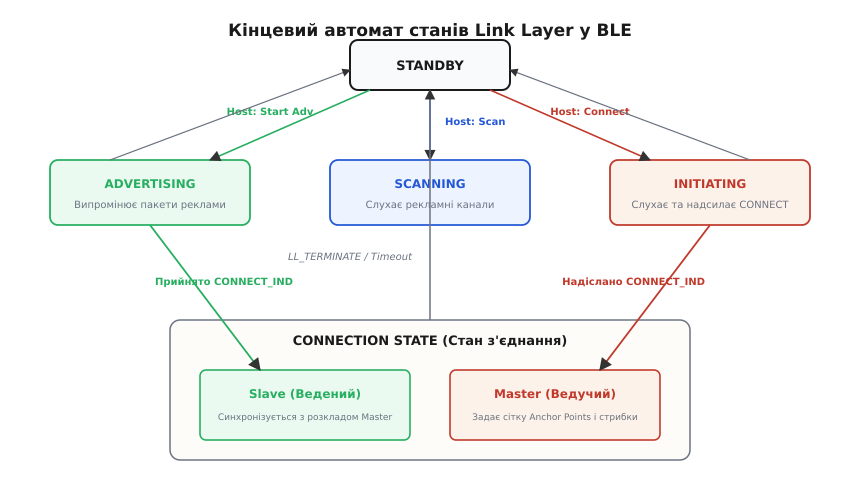
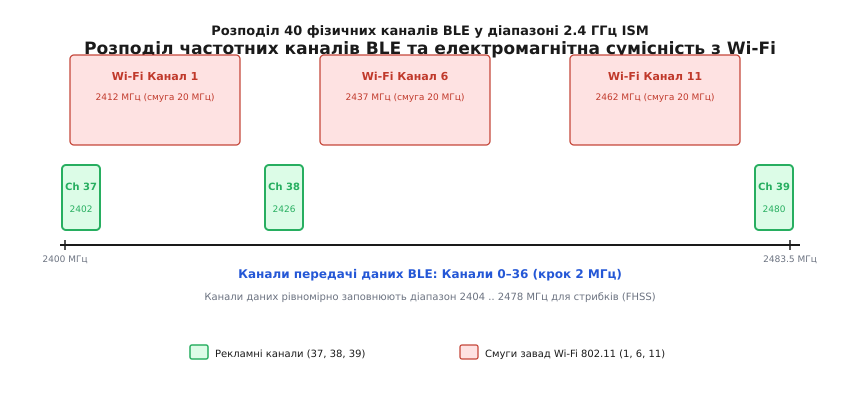
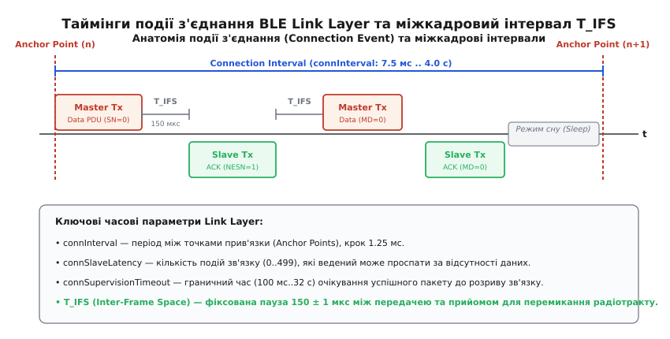
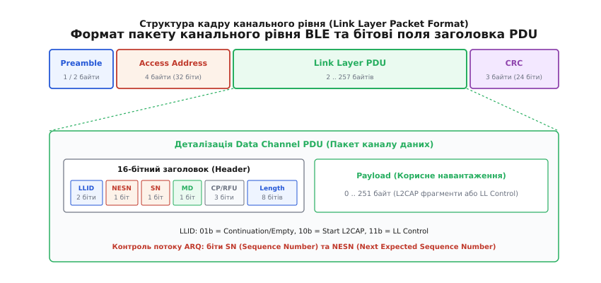
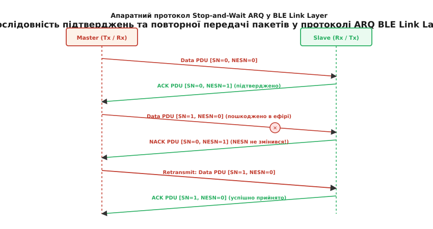

# BLE Link Layer: канальний стрибок і connection events

<preknowlist>
- [BLE GAP](root:com-transport/ble-gap) — рекламування, ролі пристроїв та параметри з'єднання.
- [Дизайн пакетів](root:com-transport/packet-design) — канальні блоки PDU, заголовки, корисне навантаження та контроль цілісності CRC.
- [Протокол ARQ](root:com-transport/arq-retransmission-schemes) — механізми автоматичного повтору передачі та підтвердження Stop-and-Wait.
</preknowlist>

Коли автономний бездротовий датчик випромінює радіосигнал у неліцензованому діапазоні 2.4 ГГц ISM (*Industrial, Scientific, and Medical*), його електромагнітна хвиля потрапляє у вкрай агресивне середовище. Поруч працюють точки доступу Wi-Fi (IEEE 802.11 b/g/n/ax), випромінюючи широкосмугові завади потужністю до 100 мВт у смугах шириною 20–40 МГц; побутові мікрохвильові печі генерують несинхронізовані імпульсні завади потужністю до 1000 Вт; а відбиття радіохвиль від стін, меблів та металевих конструкцій спричиняє багатопроменеве завмирання (*multipath Rayleigh fading*), за якого амплітуда сигналу на окремій частоті може просідати на 20–30 дБ (у сотні разів).

При цьому мікроконтролер сенсора живиться від дискового літієвого елемента CR2032 номінальною ємністю 220 мА·год. Якщо тримати радіоприймач постійно увімкненим зі струмом споживання 10–15 мА, джерело живлення вичерпається менш ніж за добу. Щоб забезпечити надійну двосторонню передачу даних протягом кількох років від однієї батарейки, протокол зв'язку не може покладатися на безперервне прослуховування ефіру чи збільшення потужності передавача. Він вимагає математично суворого розкладу мікросекундного ввімкнення радіотракту, апаратної синхронізації та динамічного обходу заблокованих частот.

У стеку Bluetooth Low Energy (від давньоскандинавського *Blátǫnn* — епонім короля Гаральда, та англ. *Low Energy* — низька енергія) цими задачами керує **канальний рівень** — **Link Layer** (LL, від англ. *link* — ланка/зв'язок та *layer* — шар/рівень). Розташований безпосередньо над фізичним рівнем радіотрансивера (PHY) та під інтерфейсом хост-контролера (HCI), Link Layer є єдиним рівнем стека, що працює в режимі жорсткого реального часу (*hard real-time*): він контролює кінцевий автомат радіомодуля, реалізує псевдовипадковий канальний стрибок (FHSS), витримує міжкадрові інтервали `T_IFS` та гарантує цілісність даних через апаратний протокол Stop-and-Wait ARQ.

---

## 1. Кінцевий автомат станів Link Layer

Поведінка радіомодуля на канальному рівні формалізована у вигляді кінцевого автомата (англ. *Finite State Machine*, FSM). На відміну від класичного Bluetooth (BR/EDR), де пристрій утримує складну топологію пікомережі з багатьма проміжними режимами сну (Sniff, Hold, Park), канальний рівень BLE мінімізований до п'яти чітких операційних станів.


*П'ять станів кінцевого автомата Link Layer: переходи між режимами мовлення, сканування та ініціалізації з'єднання з переходом у ролі Master та Slave.*

### 1.1. Опис станів автомата

1. **Standby (Очікування):** стан спокою та найглибшого енергозбереження. Радіомодуль повністю знеструмлений, активним залишається лише низькочастотний таймер сну (типово на кварці 32.768 кГц). У стані Standby пристрій не передає і не приймає радіосигналів. Це вихідна точка для переходу в будь-який інший режим за командою хоста.
2. **Advertising (Рекламування):** радіомодуль періодично прокидається для випромінювання рекламних пакетів (PDU) на трьох виділених первинних каналах (37, 38, 39). Після відправки кожного пакету передавач короткочасно перемикається в режим прийому, очікуючи на можливий запит сканування (`SCAN_REQ`) або запит підключення (`CONNECT_IND`).
3. **Scanning (Сканування):** стан пасивного або активного прослуховування ефіру на рекламних каналах. У пасивному режимі вузол лише фіксує чужі трансляції, а в активному — надсилає запити `SCAN_REQ` для отримання додаткового блоку даних `SCAN_RSP` від мовника.
4. **Initiating (Ініціалізація):** вузол прослуховує рекламні канали з єдиною метою: вловити рекламний пакет від конкретного цільового пристрою і негайно, рівно через 150 мкс, відповісти йому пакетом створення сесії `CONNECT_IND`.
5. **Connection (З'єднання):** стан двостороннього зв'язку між двома пристроями. У цьому стані радіомодуль працює виключно на 37 каналах передачі даних (0–36) за узгодженим розкладом точок прив'язки (*Anchor Points*).

### 1.2. Розподіл ролей у стані Connection

Коли пакет `CONNECT_IND` успішно передано та прийнято, обидва учасники одночасно переходять зі своїх попередніх станів у стан **Connection**, але набувають кардинально різних ролей:
* Пристрій, що перебував у стані **Initiating**, стає **Master (Ведучим / Central)**. Ведучий бере на себе повний контроль над зв'язком: задає опорну часову сітку, визначає моменти початку подій зв'язку, формує бітову маску дозволених частот та ініціює кожен обмін кадрами.
* Пристрій, що перебував у стані **Advertising**, стає **Slave (Веденим / Peripheral)**. Ведений підлаштовує свій локальний таймер під розклад Master, прокидається безпосередньо перед очікуваним приходом сигналу і ніколи не починає передачу першим.

> 🔧 **Апаратне суміщення станів у сучасних чіпах.** Ранні специфікації Bluetooth 4.0 вимагали від контролера виконання лише одного стану в кожен момент часу. Починаючи з версії 4.1 та в сучасних SoC (Nordic nRF52/nRF53, ESP32-C3/S3, TI CC26xx), апаратний планувальник Link Layer підтримує топологію множинних з'єднань (*Multi-role*): контролер може одночасно бути Master для кількох сенсорів, Slave для смартфона і в проміжках між подіями зв'язку сканувати ефір.

---

## 2. Частотний спектр: первинне рекламування та канали даних

Діапазон 2.4 ГГц ISM (2400.0–2483.5 МГц) у стандарті BLE розділений на **40 фізичних радіочастотних каналів** із міжцентровим інтервалом 2.0 МГц. Центральна частота каналу з фізичним номером `k` (`k ∈ [0, 39]`) визначається як:

```
f = 2402 + k · 2.0 МГц
```

Архітектура протоколу строго розділяє ці 40 каналів на дві функціональні групи з кардинально різною радіоповедінкою.


*Розміщення частотних каналів BLE у діапазоні 2.4 ГГц: канали 37, 38 та 39 розташовані в захисних проміжках між головними неперекривними смугами Wi-Fi 1, 6 та 11, тоді як канали 0–36 формують сітку для передачі даних.*

### 2.1. Первинні рекламні канали (37, 38, 39)

Канали з логічними номерами **37 (2402 МГц)**, **38 (2426 МГц)** та **39 (2480 МГц)** виділені для трансляції маячків, пошуку вузлів та ініціалізації сесій. Вибір саме цих трьох частот є класичним зразком електромагнітної інженерії.

У тому самому спектрі 2.4 ГГц домінують бездротові мережі стандарту Wi-Fi (IEEE 802.11), кожен канал яких займає смугу 20–22 МГц. Щоб точки доступу не заважали одна одній, у світі використовують три неперекривні канали: 1 (2412 МГц), 6 (2437 МГц) та 11 (2462 МГц). Частоти рекламування BLE розміщені так:
* Канал 37 (2402 МГц) лежить нижче нижньої межі випромінювання 1-го каналу Wi-Fi.
* Канал 38 (2426 МГц) потрапляє в центральний захисний проміжок між 1-м та 6-м каналами Wi-Fi.
* Канал 39 (2480 МГц) розташований вище верхньої межі 11-го каналу Wi-Fi.

Завдяки такій топології, навіть якщо офісний чи промисловий простір повністю насичений потужним Wi-Fi трафіком на всіх трьох каналах, принаймні один із трьох рекламних каналів BLE залишається у відносно чистому радіосередовищі, гарантуючи встановлення контакту.

### 2.2. Канали передачі даних (0–36)

Решта **37 каналів** (з індексами 0..36, що охоплюють частоти 2404–2478 МГц) використовуються виключно після того, як сесія встановлена. Оскільки жоден фіксований канал даних не захищений від потрапляння у смугу Wi-Fi, Link Layer використовує постійне псевдовипадкове перемикання частоти між цими 37 смугами для кожного наступного пакета.

---

## 3. Механізм канального стрибка (Frequency Hopping)

Якщо під час передачі великого масиву даних радіоканал зафіксується на одній частоті, будь-який спалах завади або зміна положення тіла людини в кімнаті (деструктивна інтерференція хвиль) призведе до повної втрати зв'язку. Щоб усунути цю вразливість, Link Layer застосовує псевдовипадкове стрибання за частотами (FHSS).

Кожен новий сеанс зв'язку (*Connection Event*) відбувається на іншій радіочастоті. Специфікація стандарту містить два алгоритми вибору каналу: **CSA #1** (Bluetooth 4.0–4.2) та **CSA #2** (Bluetooth 5.0+).

### 3.1. Базовий алгоритм CSA #1 (Channel Selection Algorithm #1)

Алгоритм CSA #1 працює за рекурентною формулою лінійної конгруентності за модулем 37:

```
unmappedChannel = (lastUnmappedChannel + Hop_Increment) mod 37
```

де:
* `lastUnmappedChannel` — невідображений канал попередньої події зв'язку (ініціалізується нулем).
* `Hop_Increment` — фіксований цілочисельний крок у діапазоні від 5 до 16, що обирається Master під час надсилання `CONNECT_IND`.

Оскільки 37 є простим числом, а `Hop_Increment` не ділиться на 37, послідовність формує повний цикл довжиною 37: кожен канал гарантовано опитується рівно один раз за 37 кроків.

#### Ремапінг заблокованих частот (Channel Remapping)
У реальних умовах деякі частоти можуть бути постійно заблоковані (наприклад, активним завантаженням файлів через Wi-Fi канал 6). Master періодично оцінює якість каналів (рівень помилок CRC та RSSI) і формує бітову маску дозволених частот — **Channel Map** (37 бітів).

Якщо обчислений `unmappedChannel` виявляється заблокованим, він відображається на масив активних каналів за формулою:

```
remappingIndex = unmappedChannel mod k_used
transmissionChannel = sortedUsedChannels[remappingIndex]
```

де `k_used` — загальна кількість активних каналів, а `sortedUsedChannels` — масив їхніх фізичних номерів, відсортований за зростанням.

> Повний математичний апарат, покрокові числові приклади обчислення та розбір алгоритму Bluetooth 5.0 CSA #2 на основі псевдовипадкових перестановок PRNG та множення на `0x2EAB` винесено в окрему вставку [🧮 Алгоритми канального стрибка BLE: математичний апарат CSA #1 та CSA #2](root:com-transport/ble-link-layer/math-hopping-csa.md).

---

## 4. Події з'єднання (Connection Events) та міжкадрові інтервали

Після переходу в стан Connection радіообмін втрачає неперервний характер і розпадається на дискретні часові інтервали — **події з'єднання** (англ. *Connection Events*). Весь інший час радіотракт вимкнений, а мікроконтролер перебуває в режимі сну з мікроамперним споживанням.


*Анатомія події з'єднання: прив'язка до Anchor Point, обмін пакетами між Master та Slave через інтервали T_IFS = 150 мкс, механізм продовження за прапорцем MD та перехід у режим глибокого сну.*

### 4.1. Точка прив'язки (Anchor Point) та структура події

Кожна подія зв'язку розпочинається в строго розрахований момент часу, який називається **точкою прив'язки** (англ. *Anchor Point*). 

1. У момент Anchor Point ведучий перемикає свій трансивер на новий канал за алгоритмом CSA і випромінює перший пакет даних.
2. Ведений пристрій прокидається на тому самому каналі за кілька мікросекунд до Anchor Point і вмикає приймач.
3. Отримавши пакет від Master, ведений зобов'язаний надіслати відповідь рівно через фіксований час **`T_IFS`** (англ. *Inter-Frame Space*), який за стандартом становить строго **150 ± 1 мкс**. Навіть якщо ведений не має нових прикладних даних, він зобов'язаний відправити порожній пакет підтвердження (*Empty PDU*).
4. Якщо в заголовках переданих пакетів встановлено біт наявності додаткових даних `MD = 1` (*More Data*), Master і Slave можуть продовжити обмін наступною парою кадрів через черговий інтервал `T_IFS`, не чекаючи наступної події.
5. Коли в обох сторін `MD = 0` або виникає помилка прийому, подія з'єднання закривається, і обидва вузли переходять у режим глибокого сну до наступного Anchor Point.

### 4.2. Трійка фундаментальних часових параметрів

Конфігурація зв'язку описується трьома параметрами, які передаються в кадрі `CONNECT_IND` і можуть змінюватися на льоту процедурою `LL_CONNECTION_UPDATE_IND`:

```
┌────────────────────────────────────────────────────────────────────────────────────────┐
│                          Параметри таймінгів Link Layer                                │
├──────────────────────────┬─────────────────────────────────┬───────────────────────────┤
│ Параметр                 │ Діапазон значень                │ Опис фізичного змісту     │
├──────────────────────────┼─────────────────────────────────┼───────────────────────────┤
│ connInterval             │ 7.5 мс .. 4.0 с (крок 1.25 мс)  │ Період між точками        │
│                          │ (значення N = 6 .. 3200)        │ Anchor Points             │
├──────────────────────────┼─────────────────────────────────┼───────────────────────────┤
│ connSlaveLatency         │ 0 .. 499 подій зв'язку          │ Кількість подій, які      │
│                          │                                 │ Slave може проспати       │
├──────────────────────────┼─────────────────────────────────┼───────────────────────────┤
│ connSupervisionTimeout   │ 100 мс .. 32.0 с (крок 10 мс)   │ Час без зв'язку до        │
│                          │ (значення N = 10 .. 3200)       │ аварійного розірвання     │
└──────────────────────────┴─────────────────────────────────┴───────────────────────────┘
```

#### 1. Інтервал з'єднання (`connInterval`)
Час між двома сусідніми точками прив'язки:

```
t_interval = connInterval · 1.25 мс
```

Для задач із високою пропускною здатністю чи низькою затримкою (наприклад, бездротові ігрові миші або передача звуку) обирають мінімальний `connInterval = 7.5 мс` (`N = 6`). Для автономних термометрів чи медичних моніторів значення встановлюють на рівні 1.0–2.0 с.

#### 2. Затримка веденого (`connSlaveLatency`)
Кількість послідовних подій з'єднання, які ведений має право повністю проігнорувати і не вмикати радіотракт, якщо в нього немає даних у черзі на відправку.

Якщо `connSlaveLatency = 9`, а `connInterval = 100 мс`, периферійний пристрій може прокидатися лише раз на 1 секунду (пропускаючи 9 подій поспіль). Але якщо на датчику раптово виникає подія (наприклад, натиснуто кнопку), він не чекає завершення латентності, а відповідає на найближчому ж Anchor Point через 100 мс. Це дає змогу поєднати низьке енергоспоживання у стані спокою з миттєвою реакцією на події.

#### 3. Таймаут нагляду (`connSupervisionTimeout`)
Максимальний проміжок часу від останнього успішно прийнятого валідного пакету до моменту, коли контролер Link Layer вважає зв'язок втраченим і примусово повертається в стан Standby:

```
t_timeout = connSupervisionTimeout · 10.0 мс
```

#### Головний інваріант узгодженості таймінгів
Щоб Slave під час дозволеного глибокого сну на максимальну кількість подій `connSlaveLatency` випадково не спричинив спрацьовування таймауту нагляду, специфікація вимагає обов'язкового дотримання математичної нерівності:

```
connSupervisionTimeout > (1 + connSlaveLatency) · connInterval · 2
```

Множник 2 гарантує, що ведений матиме щонайменше дві спроби зв'язатися з ведучим навіть у разі повної втрати одного сеансу через випадкову радіозаваду.

---

### 4.3. Дрейф кварцового генератора та розширення вікна прийому (Window Widening)

У режимі глибокого сну мікроконтролер вимикає високочастотний кварцовий резонатор (типово 32–64 МГц) і тактується від низькочастотного генератора 32.768 кГц. Будь-який реальний кристал має температурну похибку та технологічний розкид, що вимірюється в **ppm** (англ. *parts per million* — частин на мільйон, `10⁻⁶`).

Якщо точність кварцу Master становить `±50 ppm`, а точність Slave — `±250 ppm`, їхня сумарна відносна похибка сягає `±300 ppm`. За час сну `t_sleep = 1.0 с` взаємний зсув внутрішніх годинників може досягти:

```
Δt = 300 · 10⁻⁶ · 1.0 с = 300 мкс
```

Якщо ведений увімкне приймач точно за власним розрахунком часу, він запізниться або почне слухати зарано, повністю пропустивши передачу Master, тривалість якої на швидкості 1 Мбіт/с може становити лише 80–300 мкс.

```
                  Розрахунок вікна розширення прийому (Rx Window)
                                         │
        ◄─────────────── Загальна ширина вікна прийому ────────────────►
       ┌─────────────────────┬───────────────────┬─────────────────────┐
       │   Window Widening   │ Номінальний кадр  │   Window Widening   │
       │   (раннє ввімкнення)│   (Master Tx)     │  (пізнє очікування) │
       └─────────────────────┴───────────────────┴─────────────────────┘
                             ▲                   ▲
                             │                   │
                  Очікуваний початок       Очікуваний кінець
```

Щоб гарантовано захопити пакет, Link Layer веденого застосовує механізм **розширення вікна прийому** (**Window Widening**). Ведений умикає радіоприймач раніше на величину `Δt_widening` і тримає його відкритим довше:

```
windowWidening = (SCA_master + SCA_slave) · t_sleep + 16 мкс
```

де `SCA` (*Sleep Clock Accuracy*) — клас точності кварцу, переданий у бітах заголовка `CONNECT_IND`, а 16 мкс — апаратний захисний запас на фазовий джиттер таймера.

> 🔧 **Ціна дешевого кварцу.** Що вища похибка низькочастотного резонатора (наприклад, використання внутрішнього RC-генератора мікроконтролера з точністю `±500 ppm` замість зовнішнього кварцу `±20 ppm`), то ширшим має бути вікно прийому `windowWidening`. Оскільки під час очікування радіотракт споживає повний струм прийому (6–12 мА), широке вікно може збільшити середнє енергоспоживання пристрою у 2–4 рази.

---

## 5. Анатомія кадру канального рівня (Link Layer Packet)

На фізичному рівні LE 1M та LE 2M радіокадр передається послідовно біт за бітом, починаючи від наймолодшого біта (LSB first).


*Формат радіокадру канального рівня: преамбула, адреса доступу Access Address, 16-бітний заголовок PDU з бітами керування потоком, корисне навантаження та 24-бітна контрольна сума CRC.*

### 5.1. Преамбула (Preamble)
Преамбула складається з 1 байта (для PHY 1 Мбіт/с) або 2 байтів (для PHY 2 Мбіт/с). Вона являє собою послідовність суворого чергування одиниць і нулів:
* `01010101b` — якщо молодший біт наступного поля (Access Address) дорівнює `0`.
* `10101010b` — якщо молодший біт Access Address дорівнює `1`.

Таке правило виключає наявність двох однакових бітів поспіль на межі преамбули та адреси, що забезпечує автоматичне підстроювання підсилення (AGC) та фазове захоплення частоти демодулятора приймача.

### 5.2. Адреса доступу (Access Address)
Поле розміром 4 байти (32 біти), що слугує апаратним фільтром пакетів у радіоефірі:
* Для всіх рекламних пакетів адреса є фіксованою константою: `0x8E89BED6`.
* Для каналів даних генерується випадкове 32-бітне значення під час кожного нового з'єднання. 

Стандарт накладає суворі статистичні обмеження на вибір адреси даних (не більше 6 однакових бітів поспіль, обов'язкова наявність щонайменше 2 переходів між 0 і 1 у старших 6 бітах, відмінність від рекламної адреси мінімум на 2 біти), щоб унеможливити хибне спрацьовування корелятора приймача на шумі ефіру.

### 5.3. Заголовок PDU каналу даних (Data Channel PDU Header)
Канальний блок даних PDU містить 16-бітний заголовок наступного формату:

```
Біти 0..1   : LLID   (2 біти) — тип логічного каналу (Start L2CAP / Continuation / Control)
Біт 2       : NESN   (1 біт)  — Next Expected Sequence Number (номер наступного очікуваного кадру)
Біт 3       : SN     (1 біт)  — Sequence Number (номер послідовності поточного кадру)
Біт 4       : MD     (1 біт)  — More Data (прапорець продовження сеансу)
Біти 5..7   : CP/RFU (3 біти) — Constant Tone Extension / Резерв
Біти 8..15  : Length (8 бітів) — довжина поля Payload (0 .. 251 байт)
```

Поле **LLID** (*Logical Link Identifier*) визначає тип вмісту:
* `01b` — кадр продовження фрагментованого пакету L2CAP або порожній кадр підтвердження (*Empty PDU*, якщо `Length == 0`).
* `10b` — перший фрагмент нового пакету протоколу L2CAP.
* `11b` — керівне повідомлення канального рівня (*LL Control PDU*).

### 5.4. Контрольна сума CRC-24
Завершує кожен радіокадр 24-бітна контрольна сума, яка обчислюється над усім полем PDU (заголовок + корисне навантаження). Обчислення виконується апаратним лінійним регістром зсуву зі зворотним зв'язком (LFSR) за незвідним генераторним поліномом:

```
P(x) = x²⁴ + x¹⁰ + x⁹ + x⁶ + x⁴ + x³ + x + 1   (шістнадцятковий вигляд: 0x00065B)
```

Початковий стан регістру `CRCInit` (24 біти) є унікальним для кожної сесії і передається в кадрі `CONNECT_IND`. Якщо обчислена приймачем контрольна сума не збігається з переданою в кінці кадру, пакет негайно і беззастережно відкидається на апаратному рівні.

> Повну побітову специфікацію всіх типів рекламних пакетів (`ADV_IND`, `ADV_DIRECT_IND`, `CONNECT_IND`), пакетів даних та керівних процедур `LL_CONTROL` зібрано у вставці [📋 Специфікація PDU та керівних процедур Link Layer у Bluetooth Low Energy](root:com-transport/ble-link-layer/api-ll-pdu.md).

---

## 6. Апаратний контроль потоку Stop-and-Wait ARQ

Для забезпечення абсолютної надійності передачі поверх фізично нестабільного радіоефіру Link Layer реалізує протокол автоматичного повторного запиту **Stop-and-Wait ARQ** (*Automatic Repeat reQuest*), інтегрований безпосередньо в 16-бітний заголовок кожного PDU.

Контроль потоку базується на парі 1-бітних прапорців:
* **SN (Sequence Number):** біт послідовності, що ідентифікує поточний пакет відправника (приймає значення `0` або `1`).
* **NESN (Next Expected Sequence Number):** біт квитанції, що вказує, який саме номер кадру приймач очікує отримати наступним.


*Часова діаграма протоколу Stop-and-Wait ARQ: чергування бітів SN/NESN при нормальній доставці, виявлення втрати за відсутністю зміни NESN та негайна повторна передача пошкодженого кадру.*

### 6.1. Алгоритм роботи передавача (Transmitter)

1. Під час надсилання нового пакету відправник встановлює біт `SN` у поточне значення свого внутрішнього лічильника передачі `transmitSeqNum`.
2. Відправник заповнює біт `NESN` значенням свого внутрішнього лічильника прийому `nextExpectedSeqNum`, підтверджуючи всі раніше отримані від сусіда кадри.
3. Пакет відправляється в ефір і зберігається в буфері повторної передачі.
4. Отримавши відповідь від співрозмовника, відправник перевіряє її валідність (CRC-24) та аналізує отриманий біт `NESN`:
   * Якщо отриманий `NESN` **відрізняється** від відправленого `SN` (`NESN == 1 - SN`), це означає, що співрозмовник успішно прийняв пакет і чекає наступний. Відправник очищає буфер відправки та інвертує свій лічильник: `transmitSeqNum = 1 - transmitSeqNum`.
   * Якщо отриманий `NESN` **збігається** з відправленим `SN` (або відповідь не прийшла зовсім / містить помилку CRC), відправник розцінює це як негативну квитанцію (NACK). Він зобов'язаний повторно надіслати той самий пакет із тим самим значенням `SN` у наступному сеансі обміну.

### 6.2. Алгоритм роботи приймача (Receiver)

1. Приймач очікує пакет із номером `SN`, що дорівнює його внутрішньому значенню `nextExpectedSeqNum`.
2. Якщо прийнятий пакет має валідну контрольну суму CRC-24:
   * Якщо `SN == nextExpectedSeqNum`, це новий пакет. Приймач передає корисне навантаження вищому рівню (L2CAP) та інвертує свій лічильник очікування: `nextExpectedSeqNum = 1 - nextExpectedSeqNum`.
   * Якщо `SN != nextExpectedSeqNum`, це дублікат (раніше надісланий пакет, підтвердження на який загубилося в ефірі). Приймач відкидає тіло пакета, не передаючи його вище, проте формує підтвердження з актуальним `nextExpectedSeqNum`, щоб розблокувати відправника.
3. Якщо прийнятий пакет пошкоджено (помилка CRC), приймач не змінює `nextExpectedSeqNum`. У відповіді він транслює старе значення `NESN`, що автоматично сигналізує відправнику про необхідність ретрансмісії.

> 🔧 **Абсолютна безвитратність квитування.** У протоколі BLE Link Layer квитанція ACK/NACK не вимагає окремого службового пакету. Підтвердження «вмонтоване» в біт `NESN` будь-якого зустрічного кадру або порожнього службового кадру *Empty PDU* (довжиною всього 80 мкс на 1M PHY), що зводить накладні витрати зворотного зв'язку до нуля.

---

## 7. Програмна емуляція та верифікація Link Layer

Для верифікації часових інваріантів, розрахунку дрейфу годинника та налагодження логіки ARQ розробники використовують програмні симулятори канального рівня. Це дає змогу моделювати поведінку стека в умовах екстремальних радіозавад, штучно інжектувати бітові помилки CRC та перевіряти стійкість алгоритмів до втрати зв'язку без тривалого тестування на реальному залізі.

> Повну робочу реалізацію симулятора кінцевого автомата Link Layer, розрахунку вікна розширення прийому `windowWidening` та алгоритму Stop-and-Wait ARQ мовами C та сучасним C++20 наведено у вставці [⚙️ Симуляція канального рівня BLE: кінцевий автомат, таймінги та протокол ARQ](root:com-transport/ble-link-layer/proj-ll-fsm-sim.md).

---

## 8. Розширення фізичного рівня: LE 2M, LE Coded та DLE

Специфікації Bluetooth 4.2 та 5.0 докорінно розширили можливості канального рівня, додавши гнучке керування швидкістю, дальністю та довжиною кадрів.

```
Параметр                  Bluetooth 4.0/4.1      Bluetooth 4.2 (DLE)    Bluetooth 5.0 (2M / Coded)
──────────────────────────────────────────────────────────────────────────────────────────────────
Символьна швидкість PHY   1 Мсимв/с (LE 1M)      1 Мсимв/с (LE 1M)      2 Мсимв/с (2M) / 125 кбіт/с (S=8)
Максимальний Payload      27 байтів              251 байт               251 байт
Час передачі макс. кадру  ~328 мкс               ~2120 мкс (1M)         ~1060 мкс (2M)
Корисна швидкість L2CAP   до 60–100 кбіт/с       до 700–800 кбіт/с      до 1.4–1.6 Мбіт/с (2M)
Чутливість приймача       ~ -93 дБм              ~ -93 дБм              до -103 дБм (Coded S=8)
```

### 8.1. Розширення довжини даних (Data Length Extension, DLE)
У ранніх версіях Bluetooth 4.0/4.1 максимальний розмір корисного навантаження PDU становив лише 27 байтів. Для передачі 1 КБ даних стек мав розбивати масив на 40 окремих транзакцій, для кожної з яких витрачався час на заголовки, CRC та паузи `T_IFS = 150 мкс`. 

Механізм **DLE** (введений у Bluetooth 4.2) збільшив максимальний розмір поля Payload до **251 байта**. Процедура узгодження `LL_LENGTH_REQ` / `LL_LENGTH_RSP` дозволяє контролерам домовитися про максимальний розмір буферів (`MaxRxOctets`, `MaxTxOctets`) та час перебування в ефірі (`MaxRxTime`, `MaxTxTime`), що збільшило реальну пропускну здатність каналу майже в 8 разів.

### 8.2. Високошвидкісний рівень LE 2M PHY
Фізичний рівень **LE 2M** подвоює швидкість передачі символів до 2 Мсимв/с, зберігаючи ту саму смугу каналу 2 МГц завдяки зміні індексу модуляції Gaussian Frequency Shift Keying (GFSK). 
* Час передачі кожного біта скорочується з 1.0 мкс до 0.5 мкс.
* Оскільки тривалість радіовипромінювання зменшується вдвічі, загальне енергоспоживання трансивера на один переданий байт падає майже на 50%.
* Перемикання на LE 2M ініціюється процедурою `LL_PHY_REQ` і застосовується синхронно обома вузлами в момент Anchor Point, визначений лічильником `Instant`.

### 8.3. Далекобійний рівень LE Coded PHY (S=2 та S=8)
Для задач, що вимагають передачі даних на сотні метрів крізь стіни та перешкоди, стандарт Bluetooth 5.0 запровадив кодований фізичний рівень **LE Coded PHY**. Він використовує алгоритм прямої корекції помилок (FEC, *Forward Error Correction*) на основі згорткового кодування:
* **Схема S=2 (500 кбіт/с):** кожен інформаційний біт кодується 2 символами в ефірі (енергетичний виграш близько +3 дБ).
* **Схема S=8 (125 кбіт/с):** кожен біт кодується 8 символами (енергетичний виграш +6..+8 дБ, що еквівалентно збільшенню радіуса дії у 2–4 рази).

На рівні LE Coded кадр містить розширену 80-бітову преамбулу та поле покажчика кодування Coding Indicator (CI), що дозволяє приймачу декодувати слабкі сигнали на межі чутливості до -103 дБм.

---

## 9. Практичні рекомендації з налаштування параметрів канального рівня

Під час проектування комерційних пристроїв вибір конфігурації Link Layer завжди є компромісом між трьома взаємовиключними вимогами: швидкістю реакції (затримкою), пропускною здатністю та енергоспоживанням від батареї.

```
Тип пристрою               connInterval       connSlaveLatency    connSupervisionTimeout   Рекомендований PHY
─────────────────────────────────────────────────────────────────────────────────────────────────────────────
Бездротова миша / геймпад  7.5 – 11.25 мс     0                   500 мс                   LE 2M PHY
Оновлення прошивки (OTA)   15 – 30 мс         0                   2000 мс                  LE 2M PHY + DLE (251)
Пульсометр / ЕКГ           100 – 200 мс       1 – 2               4000 мс                  LE 1M PHY
Бездротовий термометр      1000 – 2000 мс     4 – 9               10000 мс                 LE 1M / LE Coded
Маячок відкриття дверей    500 мс             19                  16000 мс                 LE 1M PHY
```

* **Мінімізація затримки:** встановлюйте `connInterval` на мінімально дозволене значення (7.5–15 мс) та `connSlaveLatency = 0`. Це забезпечує затримку передачі менше 15 мс, але підвищує середній струм споживання до 1–3 мА.
* **Максимізація терміну служби батареї:** збільшуйте `connInterval` до 500–1000 мс і застосовуйте високі значення `connSlaveLatency` (4..19). За відсутності нових подій середній струм споживання впаде до 5–15 мкА, забезпечуючи 3–5 років роботи від елемента CR2032.
* **Стійкість до агресивних завад:** завжди вмикайте алгоритм **CSA #2** замість застарілого CSA #1 та встановлюйте `connSupervisionTimeout` із запасом не менше 3–5 секунд, щоб перекрити тимчасові сплески завад від мікрохвильових печей або Wi-Fi передавачів.
