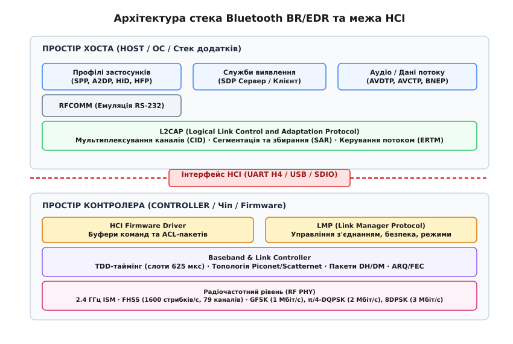
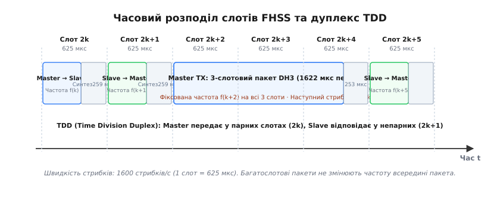
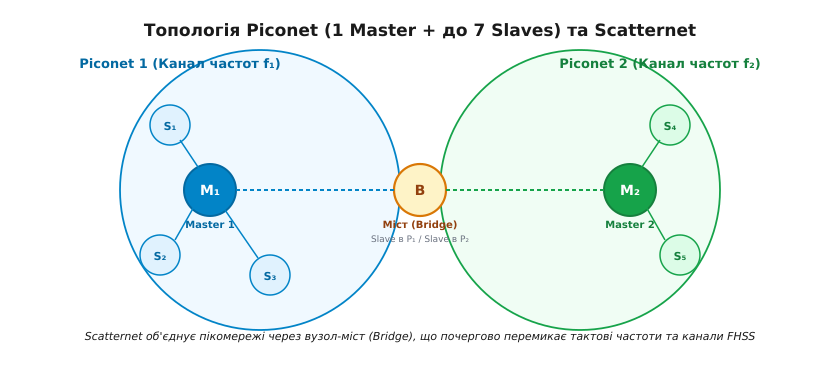
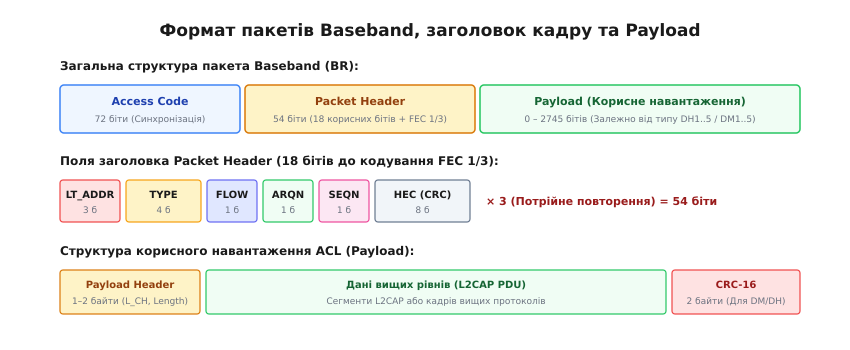
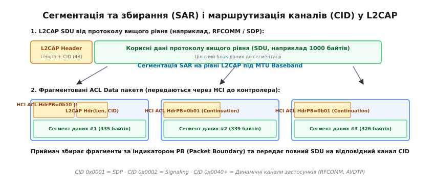

# Стек протоколів Bluetooth Classic (BR/EDR)

<preknowlist>
- [Широкосмуговий зв'язок та смуга ISM](root:sys-notary/ism-bands)
- [Модуляції FSK та PSK](root:com-modulation/fsk-psk)
- [Послідовний інтерфейс UART](root:com-devices/async-serial)
- [Завадостійкі коди FEC та контрольні суми](root:com-modulation/fec-codes)
</preknowlist>

Коли бездротова аудіогарнітура передає стереозвук високої чіткості або послідовний порт передає телеметрію в неліцензованому діапазоні 2.4 ГГц, радіосигнал стикається з масивними завадами від працюючих поруч маршрутизаторів Wi-Fi, мікрохвильових печей та інших передавачів. Одночасна робота в одній смузі без координації призводить до взаємного придушення сигналів, викривлення бітів та втрати синхронізації. Стек Bluetooth Classic (BR/EDR) розв'язує цю фундаментальну проблему за допомогою суворої багаторівневої ієрархії: швидкої перебудови частоти в часі, розподілу доступу в синхронізованих часових слотах, апаратного підтвердження кадрів та адаптивного мультиплексування високорівневих потоків даних.

Архітектура стека Bluetooth чітко розділена стандартизованим апаратно-програмним кордоном на дві функціональні частини: **Controller** (радіомодуль із вбудованим мікрокодом реального часу) та **Host** (програмний стек операційної системи або прикладного процесора).


*Архітектура стека Bluetooth BR/EDR: поділ рівнів між Host та Controller через інтерфейс HCI*

Нижній шар (Controller) бере на себе жорсткі таймінги радіоефіру та перемикання синтезатора частот, тоді як верхній шар (Host) керує маршрутизацією каналів, реєстрацією прикладних служб та організацією користувацьких сесій. Зв'язок між цими частинами здійснюється через уніфікований інтерфейс хост-контролера HCI.

---

## Фізичний рівень радіозв'язку (BR/EDR Radio PHY)

Фізичний рівень Bluetooth Classic використовує частотний діапазон [ISM (Industrial, Scientific, Medical)](root:sys-notary/ism-bands) у межах від 2400.0 до 2483.5 МГц. Цей спектр розбивається на 79 дискретних радіочастотних каналів шириною по 1.0 МГц. Центральна частота каналу з індексом `k` (`0 ≤ k ≤ 78`) обчислюється як `f[k] = 2402 + k` МГц.

```
       2400.0 МГц           2402 МГц           2403 МГц                      2480 МГц          2483.5 МГц
          ├────── 2.0 МГц ─────┼───── 1.0 МГц ────┼─── ... ───┼───── 1.0 МГц ────┼────── 3.5 МГц ─────┤
          │   Нижня смуга      │     Канал 0      │  Канал 1  │     Канал 78     │   Верхня смуга     │
          │   захисту спектра  │    (2402 МГц)    │(2403 МГц) │    (2480 МГц)    │   захисту спектра  │
```

Для випромінювання сигналу визначено три класи потужності передавача:
- **Class 1**: максимальна потужність до 100 мВт (+20 дБм), радіус дії до 100 метрів. Обладнання класу 1 зобов'язане підтримувати динамічне керування потужністю передавання (англ. *Transmit Power Control*, TPC) з кроком від 2 до 8 дБ для запобігання перевантаженню вхідних каскадів сусідніх приймачів.
- **Class 2**: потужність до 2.5 мВт (+4 дБм), типовий радіус дії 10 метрів (найпоширеніший клас для смартфонів, гарнітур та ноутбуків).
- **Class 3**: потужність до 1.0 мВт (0 дБм), радіус дії до 1 метра.

### Метод псевдовипадкового стрибання частоти (FHSS)

Для забезпечення стійкості до вузькосмугових радіозавад та запобігання інтерференції радіоканал перебудовує несучу частоту за законом псевдовипадкового перемикання (англ. *Frequency Hopping Spread Spectrum*, FHSS). У режимі активного передавання даних номінальна швидкість стрибків становить рівно **1600 стрибків за секунду**.

Тривалість перебування на одній частоті дорівнює одному часовому слоту `T_slot = 1 / 1600 с = 625 мкс`. Послідовність перемикання формується апаратним поліноміальним генератором на основі 24-бітної адреси ведучого пристрою (LAP) та поточного значення внутрішнього апаратного годинника контролера `CLK`.


*Часовий дуплекс TDD зі слотами 625 мкс та передаванням 3-слотового пакету на фіксованій частоті*

У кожному слоті тривалістю 625 мкс безпосереднє випромінювання сигналу 1-слотового кадру триває не більше 366 мкс. Решта 259 мкс відводиться під захисний інтервал (Guard Time), необхідний для перемикання синтезатора частот (PLL) на нову несучу та стабілізації радіотракту. Повний розрахунок часового бюджету та втрат на перемикання наведено у [математичному розрахунку слотів FHSS](root:com-transport/bluetooth-classic-stack/math-fhss-slots.md).

Під час процедур пошуку нових пристроїв (Inquiry) та підключення (Page) швидкість перемикання частоти подвоюється до **3200 стрибків за секунду** (`T_hop = 312.5 мкс`), що дозволяє передавати по два короткі пакети ідентифікації ID на різних частотах у межах кожного 625-мікросекундного слота для прискорення знаходження пристрою.

### Адаптивна перебудова частоти (AFH)

У специфікації Bluetooth 1.2 з'явився механізм адаптивного стрибання частоти (англ. *Adaptive Frequency Hopping*, AFH). Контролер постійно сканує рівень фонового шуму (RSSI) та лічильники помилок CRC на всіх 79 каналах, формуючи бітову маску стану ефіру (Channel Map).

Якщо у певному сегменті діапазону виявлено постійну заваду (наприклад, активний канал [Wi-Fi шириною 20 або 40 МГц](root:com-transport/wifi)), ведучий пристрій виключає зашумлені частоти з робочої послідовності. Псевдовипадковий генератор відображає вихідні індекси заблокованих каналів на решту чистих частот за допомогою таблиці заміщення (Aliasing Function). За вимогами міжнародних регуляторів зв'язку, мінімальна кількість активних каналів в алгоритмі AFH не може бути меншою за 20.

### Схеми цифрової модуляції: Basic Rate та Enhanced Data Rate

Фізичний рівень підтримує три схеми модуляції сигналу, які визначають канальну швидкість передавання символів:

1. **Базова швидкість (Basic Rate, BR — 1 Мбіт/с)**:
   Використовує двійкову частотну маніпуляцію з гауссівською фільтрацією (англ. *Gaussian Frequency Shift Keying*, GFSK). Кожен мікросекундний символ кодує рівно 1 біт інформації (`BT = 0.5`, девіація частоти від 140 до 175 кГц). Модуляція GFSK відрізняється високою енергетичною ефективністю та високою стійкістю до нелінійних спотворень у вихідних підсилювачах потужності.
2. **Підвищена швидкість EDR 2 Мбіт/с (π/4-DQPSK)**:
   Використовує диференційну квадратурну фазову маніпуляцію зі зсувом на π/4. Кожен фазовий перехід передає 2 біти за один символ (символьна швидкість 1 Мбод дає канальну швидкість 2 Мбіт/с).
3. **Підвищена швидкість EDR 3 Мбіт/с (8DPSK)**:
   Використовує восьмипозиційну диференційну фазову маніпуляцію. Кожен стрибок фази носія кодує 3 біти інформації (канальна швидкість 3 Мбіт/с).

У режимі EDR преамбула, код доступу та канальний заголовок завжди передаються базовою модуляцією GFSK зі швидкістю 1 Мбіт/с для збереження зворотної сумісності. Після заголовка вставляється короткий захисний інтервал синхронізації фази (Guard Time 5 мкс та Sync Sequence 11 мкс), після чого тіло пакету модулюється схемами π/4-DQPSK або 8DPSK.

---

## Рівень Baseband та топологія радіомережі

Рівень Baseband керує апаратним каналом зв'язку, формує кадрову структуру ефіру, забезпечує дуплексний обмін та контролює стан логічних каналів.

### Часовий дуплекс (TDD) та організація обміну

Обмін даними між пристроями будується за схемою дуплексу з часовим розділенням (англ. *Time-Division Duplex*, TDD). Усі часові слоти по 625 мкс суворо прив'язані до тактування ведучого пристрою (Master Clock):
- **Парні слоти** (`CLK[1] = 0`): передає виключно ведучий пристрій (Master).
- **Непарні слоти** (`CLK[1] = 1`): відповідає ведений пристрій (Slave), до якого ведучий звернувся у попередньому парному слоті.

Ведений вузол не має права розпочинати передавання самостійно: зв'язок ведеться суворо за принципом опитування (Polling). Якщо ведучий передає багатослотовий пакет тривалістю 3 або 5 слотів (DH3, DH5), радіочастота не змінюється протягом усього пакету, а наступні 2 або 4 слоти вважаються заблокованими для зворотної передачі. Ведений відповідає рівно в наступному вільному непарному слоті.

### Топологія Piconet та Scatternet

Базовою структурною одиницею мережі Bluetooth є **пікомережа** (англ. *Piconet*).


*Топологія пікомережі Piconet (1 Master + до 7 Slave) та утворення мосту Scatternet через спільний ведений вузол*

Пікомережа складається з одного ведучого пристрою (Master) та максимум семи одночасно активних ведених пристроїв (Active Slaves). Ведучий визначає частотну послідовність стрибків за власною апаратною адресою (BD_ADDR) та забезпечує єдиний часовий простір тактування для всіх ведених. Кожен активний ведений вузол отримує унікальну 3-бітну логічну адресу члена мережі `LT_ADDR` (від `0b001` до `0b111`; адреса `0b000` зарезервована для широкомовних пакетів broadcast).

Якщо до пікомережі підключається більше семи ведених, додаткові пристрої переводяться в припаркований стан (**Park State**). Припаркований вузол зберігає синхронізацію з годинником Master, але втрачає адресу `LT_ADDR` і переходить на спостереження за ефіром за допомогою 8-бітної адреси `PM_ADDR` (до 255 припаркованих вузлів у мережі).

Кілька незалежних пікомереж можуть об'єднуватися в розподілену мережу — **Scatternet**. Об'єднання відбувається через вузли-мости (Bridge Nodes). Один і той самий фізичний пристрій може бути веденим в одній пікомережі та ведучим в іншій (Master/Slave bridge) або одночасно веденим у двох різних пікомережах (Slave/Slave bridge). Оскільки сусідні пікомережі мають різні тактові генератори та різні псевдовипадкові частотні послідовності, вузол-міст розділяє свій робочий час між мережами за допомогою протоколу перемикання слотів (Hold/Sniff slots), що знижує його сумарну пропускну здатність у кожній із мереж.

---

## Формат пакетів Baseband та апаратний протокол ARQ

Кадровий формат канального рівня Baseband оптимізовано для швидкої апаратної демодуляції та корекції помилок в умовах зашумленого ефіру:


*Структура канального кадру Baseband: код доступу, захищений заголовок з FEC 1/3 та корисне навантаження*

### 1. Код доступу (Access Code — 72 біти)
Використовується приймачем для детектування початку сигналу в ефірі, синхронізації бітового корелятора та компенсації зсуву частоти гетеродина:
- **Preamble** (4 біти): бітова послідовність `0101` або `1010` для фіксації фази демодулятора.
- **Sync Word** (64 біти): псевдовипадковий код, сформований на базі 24-бітної адреси LAP ведучого або спеціального службового індикатора (IAC/GIAC). Відрізняється винятковими автокореляційними властивостями з кодовою відстанню не менше 14 бітів.
- **Trailer** (4 біти): фіксований шаблон `0101` або `1010` для коректного завершення роботи корелятора.

### 2. Заголовок кадру (Packet Header — 54 біти)
Містить 18 корисних бітів керування каналом, які для максимальної стійкості захищені завадостійким кодуванням [FEC 1/3](root:com-modulation/fec-codes) із потрійним повторенням кожного біта (`18 × 3 = 54` біти):
- **`LT_ADDR`** (3 біти): логічна адреса цільового веденого пристрою в пікомережі (`0b001`–`0b111`).
- **`TYPE`** (4 біти): тип пакету Baseband (визначає довжину в слотах, схему модуляції та наявність внутрішнього FEC).
- **`FLOW`** (1 біт): апаратний прапор керування потоком Baseband (`0` — буфер приймача заповнений, призупинити надсилання; `1` — приймач готовий до нових даних).
- **`ARQN`** (1 біт): підтвердження прийому попереднього пакету (`1` — ACK, позитивне підтвердження; `0` — NAK, запит повторного передавання).
- **`SEQN`** (1 біт): чергування номера послідовності (`0` або `1`) для фільтрації дублікатів пакетів.
- **`HEC`** (8 бітів): контрольна сума заголовка (Header Error Check) на базі поліному CRC-8.

### 3. Корисне навантаження (Payload)
Складається з заголовка навантаження (Payload Header — 1 або 2 байти), тіла даних та 16-бітної контрольної суми CRC-16.

### Класифікація пакетів Baseband

Специфікація визначає чотири функціональні групи пакетів:

| Група пакетів | Типи пакетів | Призначення та особливості |
| :--- | :--- | :--- |
| **Службові пакети** | `NULL`, `POLL`, `FHS`, `ID` | `NULL` (лише 126 бітів коду та заголовка без тіла) повертає статус `ARQN`/`FLOW`; `POLL` перевіряє активність веденого; `FHS` передає годинник `CLK` та `BD_ADDR` при підключенні; `ID` використовується під час пейджингу. |
| **Синхронні голосові (SCO / eSCO)** | `HV1`, `HV2`, `HV3`, `EV3`, `EV4`, `EV5`, `2-EV3`, `3-EV3` | Передають нестиснений або стиснений мовний потік 64 кбіт/с у заздалегідь зарезервованих парах слотів реального часу без повторів (SCO) або з обмеженим вікном повторів (eSCO). |
| **Асинхронні захищені (DM — Data Medium)** | `DM1` (17 Б), `DM3` (121 Б), `DM5` (224 Б) | Корисне навантаження захищене кодом [FEC 2/3 (скорочений код Геммінга)](root:com-modulation/fec-codes). Розраховані на роботу в умовах сильних радіозавад. |
| **Асинхронні високошвидкісні (DH / 2-DH / 3-DH)** | `DH1` (27 Б), `DH3` (183 Б), `DH5` (339 Б), `2-DH5` (679 Б), `3-DH5` (1021 Б) | Дані передаються без надлишкового кодування FEC з контролем цілісності CRC-16. Забезпечують максимальну швидкість передачі даних (до 2.18 Мбіт/с у режимі 3-DH5). |

### Апаратний механізм Stop-and-Wait ARQ

Для гарантованої доставки даних на рівні Baseband реалізовано апаратний алгоритм автоматичного запиту повторення з очікуванням (англ. *Stop-and-Wait Automatic Repeat reQuest*, ARQ):
1. Передавач відправляє пакет із поточним значенням біта `SEQN` (наприклад, `SEQN = 0`) і зберігає копію у буфері передавання.
2. Приймач перевіряє цілісність корисного навантаження за допомогою `CRC-16`. Якщо сума зійшлася і біт `SEQN` відповідає очікуваному:
   - Приймач приймає дані, інвертує очікуваний стан `SEQN` для наступного кадру та повертає в наступному зворотному слоті пакет із бітом `ARQN = 1` (ACK).
3. Якщо контрольна сума CRC не зійшлася або пакет втрачено:
   - Приймач повертає `ARQN = 0` (NAK). Передавач негайно надсилає той самий пакет повторно з тим самим значенням `SEQN = 0`.
4. Якщо зворотний пакет із підтвердженням ACK було втрачено в ефірі, передавач перевідправить кадр з `SEQN = 0`. Приймач, побачивши повтор уже обробленого номера `SEQN`, відкине дублікат даних, але повторно надішле `ARQN = 1`.

---

## Протокол керування зв'язком (LMP)

Протокол керування каналом зв'язку (англ. *Link Manager Protocol*, LMP) відповідає за встановлення з'єднань, автентифікацію, узгодження режимів роботи та керування енергоспоживанням. Пакети LMP передаються безпосередньо через кадри Baseband із найвищим пріоритетом (позначаються прапором `L_CH = 0b11` у заголовку корисного навантаження) і обробляються виключно вбудованим мікрокодом контролера, залишаючись невидимими для операційної системи хоста.

```
       КОНТРОЛЕР А (Ініціатор)                         КОНТРОЛЕР B (Відповідач)
                 │                                               │
                 │─── LMP_features_req (Маска можливостей) ─────▶│
                 │◀── LMP_features_res (Маска можливостей) ──────│
                 │                                               │
                 │─── LMP_au_rand (Випадкове число RAND) ───────▶│
                 │◀── LMP_sres (Підпис SRES / E1) ───────────────│
                 │                                               │
                 │─── LMP_encryption_mode_req (Шифрування) ─────▶│
                 │◀── LMP_accepted ──────────────────────────────│
                 │                                               │
                 │─── LMP_setup_complete ───────────────────────▶│
                 │◀── LMP_setup_complete ────────────────────────│
```

### Ключові процедури протоколу LMP

1. **Узгодження характеристик (Feature Negotiation)**:
   Обмін повідомленнями `LMP_features_req` та `LMP_features_res` передає 64-бітну бітову маску апаратних можливостей (підтримка EDR, багатослотових пакетів, розширеного опитування eSCO, адаптивного AFH, Secure Simple Pairing).
2. **Автентифікація та спарювання (Pairing & Authentication)**:
   Контролери перевіряють наявність спільного секретного 128-бітного ключа зв'язку (**Link Key**). Процедура виконується за схемою «виклик-відповідь»: ініціатор генерує випадкове 128-бітне число `RAND` (`LMP_au_rand`), а відповідач повертає 32-бітний хеш `SRES` (`LMP_sres`), розрахований за криптографічним алгоритмом E1. У сучасних версіях Bluetooth (2.1+) застосовується безпечне просте спарювання (**Secure Simple Pairing, SSP**) на базі еліптичної криптографії Діффі-Гелмана (ECDH) із захистом від атак посередника (Man-in-the-Middle, MITM).
3. **Управління шифруванням (Encryption)**:
   Після успішної автентифікації контролери узгоджують активацію потокового шифрування E0 або блокового шифрування AES-CCM (Bluetooth 4.1+) командою `LMP_encryption_mode_req`. Сторони узгоджують розмір ключа шифрування (від 1 до 16 байтів).
4. **Зміна ролей (Master/Slave Switch)**:
   Якщо ведений пристрій (наприклад, смартфон, що підключається до гарнітури) повинен стати центром нової пікомережі, контролери ініціюють команду `LMP_slot_offset` та `LMP_switch_req`. Радіомодулі синхронізують зміщення годинників, після чого ведений стає ведучим, а частотна сітка перемикається на його BD_ADDR без розриву логічного з'єднання.
5. **Енергоощадні режими каналу (Power Modes)**:
   - **Sniff Mode**: ведений узгоджує періодичний інтервал сну `T_sniff` (від кількох мілісекунд до кількох секунд). Ведений слухає ефір лише протягом кількох визначених слотів `Sniff Attempt`, а в решту часу повністю вимикає радіоприймач, що знижує споживання струму з 20–30 мА до часток мікроампера.
   - **Hold Mode**: канал зв'язку заморожується на фіксований час `T_hold`. Ведений може виконувати внутрішні операції сканування або передавати дані в іншій пікомережі Scatternet.
   - **Park State**: пристрій звільняє активну адресу `LT_ADDR` та періодично слухає службовий широкомовний маяк пікомережі.

---

## Інтерфейс хост-контролера (HCI)

Інтерфейс хост-контролера (англ. *Host Controller Interface*, HCI) визначає стандартизований програмний та апаратний протокол взаємодії між Host та Controller через фізичні інтерфейси [UART](root:com-devices/async-serial), USB або SDIO.

У вбудованих системах переважає транспорт **UART H4**, який передає потік байтів із додаванням однобайтового префікса типу кадру:
- `0x01` — **HCI Command Packet** (Host → Controller): заголовок 3 байти (`OpCode` 16 бітів, `Param Length` 8 бітів) + параметри. Поле `OpCode` ділиться на групу `OGF` (6 бітів) та команду `OCF` (10 бітів).
- `0x02` — **HCI ACL Data Packet** (Host ⇄ Controller): заголовок 4 байти (`Connection Handle` 12 бітів, `PB Flag` 2 біти, `BC Flag` 2 біти, `Data Length` 16 бітів) + сегмент кадру L2CAP.
- `0x03` — **HCI Synchronous Data Packet** (Host ⇄ Controller): передавання голосових потоків SCO/eSCO (заголовок 3 байти).
- `0x04` — **HCI Event Packet** (Controller → Host): заголовок 2 байти (`Event Code` 8 бітів, `Param Length` 8 бітів) + параметри події.

### Кредитне керування буферами даних (Buffer Credit Flow Control)

Оскільки пам'ять SRAM радіоконтролера обмежена, пряме надсилання великих обсягів даних від процесора хоста неминуче призвело б до переповнення буферів чіпа. Протокол HCI реалізує механізм буферних кредитів:

```
       ХОСТ                                КОНТРОЛЕР
        │─── HCI_Read_Buffer_Size ────────────▶│
        │◀── Command_Complete (Кредити = 8) ───│  [Виділено 8 буферів ACL]
        │                                      │
        │─── ACL Packet 1 (Handle 0x0001) ────▶│  [Кредити: 8 -> 7]
        │─── ACL Packet 2 (Handle 0x0001) ────▶│  [Кредити: 7 -> 6]
        │                                      │  [Контролер передав пакети в ефір]
        │◀── HCI_Number_Of_Completed_Packets ──│  (Звільнено 2 буфери)
        │    (Handle 0x0001, Count = 2)        │  [Кредити: 6 + 2 = 8]
```

1. Під час ініціалізації хост надсилає команду `HCI_Read_Buffer_Size` та дізнається ліміт контролера (наприклад, 8 буферів по 1021 байт).
2. За кожен надісланий пакет ACL хост списує один кредит. Якщо лічильник кредитів сягає нуля, надсилання блокується.
3. Після передавання пакетів у радіоефір та отримання апаратного підтвердження Baseband ARQ контролер повертає подію `HCI_Number_Of_Completed_Packets`, поповнюючи лічильник кредитів хоста.

Повний перелік команд, подій та структур пакетів викладено у [довіднику пакетів HCI UART](root:com-transport/bluetooth-classic-stack/api-hci-uart.md).

---

## Рівень L2CAP: мультиплексування та сегментація (SAR)

Протокол логічного керування каналом та адаптації (англ. *Logical Link Control and Adaptation Protocol*, L2CAP) є центральним диспетчером стека: він приймає пакети вищих служб (SDU) розміром до 64 кілобайтів і розбиває їх на дрібні фрагменти, які вкладаються в ліміти буферів HCI ACL контролера.


*Сегментація повнорозмірних повідомлень L2CAP SDU на асинхронні фрагменти HCI ACL та мультиплексування за ідентифікатором CID*

### Структура кадру та простір ідентифікаторів каналів (CID)

Базовий заголовок L2CAP B-frame має фіксовану довжину 4 байти:
- **Length** (16 бітів): довжина корисного навантаження SDU.
- **Channel ID (CID)** (16 бітів): числовий ідентифікатор логічного каналу:
  - `0x0001`: сигнальний канал L2CAP Signaling (обмін командами конфігурації, відкриття та закриття каналів).
  - `0x0002`: безз'єднувальний канал прийому широкомовних пакетів (Connectionless Reception).
  - `0x0003`–`0x003F`: зарезервовані стандартні службові канали (ATT, SMP, AMP).
  - `0x0040`–`0xFFFF`: динамічно виділені канали застосунків (сесії SDP, RFCOMM, BNEP, AVDTP).

### Механізм сегментації та збирання (SAR)

Коли прикладний протокол (наприклад, [RFCOMM](root:com-transport/bluetooth-classic-stack)) надсилає блок даних розміром 2048 байтів, L2CAP розбиває його на порції відповідно до розміру буфера контролера:
1. **Перший фрагмент (`PB = 0b10`)**: містить 4 байти заголовка L2CAP (`Length = 2048`, `CID = 0x0040`) та перші 335 байтів корисного навантаження (разом 339 байтів для пакету DH5).
2. **Продовжувальні фрагменти (`PB = 0b01`)**: несуть виключно тіло даних без повторення заголовка L2CAP.
3. Приймач відстежує прапори `PB Flag`, накопичує байти в контексті відповідного `Connection Handle` і після прийому всіх 2048 байтів передає зібраний SDU диспетчеру відповідного CID.

### Режими роботи L2CAP

- **Basic Mode**: базовий режим без додаткового захисту (надійність покладається на Baseband ARQ).
- **Enhanced Retransmission Mode (ERTM)**: захищений режим із нумерацією кадрів I-frame, супервізорними кадрами підтвердження S-frame (`RR`, `REJ`, `SREJ`) та обов'язковою контрольною сумою FCS (CRC-16-CCITT). Дозволяє вибірково перевідправляти пошкоджені блоки.
- **Streaming Mode (SM)**: потоковий режим без підтверджень для аудіо/відео в реальному часі (пакети, що запізнилися, скидаються).

Повну програмну реалізацію автомата стану збирання пакетів наведено у [практичній реалізації рушія L2CAP SAR](root:com-transport/bluetooth-classic-stack/proj-l2cap-sar.md).

---

## Протокол виявлення служб (SDP)

Протокол виявлення служб (англ. *Service Discovery Protocol*, SDP) дозволяє пристроям динамично дізнаватися про доступні служби та профілі на віддаленому вузлі без попередньої конфігурації. SDP використовує архітектуру «клієнт-сервер» і працює через виділений динамічний канал L2CAP (`PSM = 0x0001`).

```
       КЛІЄНТ (Хост)                                      СЕРВЕР (Гарнітура / Модуль)
             │                                                        │
             │─── SDP_ServiceSearchAttributeRequest ─────────────────▶│
             │    (UUID: AudioSource 0x110A, AttrIDs: All)            │
             │                                                        │
             │◀── SDP_ServiceSearchAttributeResponse ────────────────│
             │    (RecordHandle: 0x00010001, ProtocolList: AVDTP/L2CAP)│
```

### Структура бази даних сервісних записів (Service Records)

Сервер SDP підтримує таблицю сервісних записів. Кожен запис описує окрему функціональну службу (наприклад, послідовний порт Serial Port Profile або профіль гучного зв'язку Hands-Free Profile) і складається зі списку універсальних атрибутів:
- **`ServiceRecordHandle`** (`0x0000`): унікальний 32-бітний числовий дескриптор запису в пам'яті сервера.
- **`ServiceClassIDList`** (`0x0001`): список 128-бітних ідентифікаторів UUID, що визначають клас служби (наприклад, `0x1101` для SPP, `0x110A` для A2DP Audio Source, `0x111E` для Hands-Free).
- **`ProtocolDescriptorList`** (`0x0004`): стек протоколів, необхідний для підключення до служби, та їхні параметри (наприклад, номер каналу RFCOMM `ServerChannel = 1` або ідентифікатор `PSM = 0x0019` для AVDTP).
- **`ServiceName`** (`0x0100`): зрозуміла людині текстова назва служби в кодуванні UTF-8.

### Формат кодування Data Element

Усі дані у запитах та відповідях SDP кодуються універсальними блоками Data Element, які мають структуру TLV (Type-Length-Value):

```
+───────────────────────────┬───────────────────────────┬───────────────────────────+
|   Type Descriptor (5 біт)  |   Size Descriptor (3 біти) |  Value (0 .. 2^32 байтів) |
+───────────────────────────┴───────────────────────────┴───────────────────────────+
```

Типи дескриптора включають: `0` — Null, `1` — Unsigned Integer (1, 2, 4, 8, 16 байтів), `2` — Signed Two's Complement Integer, `3` — UUID (16, 32 або 128 бітів), `4` — Text String, `5` — Boolean, `6` — Data Element Sequence (вкладений список елементів).

Якщо відповідь сервера на пошуковий запит перевищує розмір узгодженого буфера L2CAP MTU, SDP використовує механізм **Continuation State**: сервер повертає непрозорий маркер продовження (від 1 до 16 байтів), передаючи який у наступному запиті клієнт послідовно вичитує наступні фрагменти списку атрибутів.

---

## Архітектура прикладних профілів (RFCOMM, SPP, A2DP, HFP)

Специфікація Bluetooth визначає вертикальні профілі застосунків (англ. *Profiles*), які описують стандартні правила використання протоколів стека для вирішення конкретних прикладних задач:

```
+───────────────────────────────────────────────────────────────────────────+
|                           ПРИКЛАДНІ ПРОФІЛІ                               |
|   Serial Port (SPP)   │   Audio Streaming (A2DP)  │   Hands-Free (HFP)    |
+───────────────────────┼───────────────────────────┼───────────────────────+
|     RFCOMM (RS-232)   │           AVDTP           │   AT-команди / RFCOMM |
+───────────────────────┴───────────────────────────┴───────────────────────+
|                                  L2CAP                                    |
+───────────────────────────────────────────────────────────────────────────+
|                                   HCI                                     |
+───────────────────────────────────────────────────────────────────────────+
|                                 Baseband                                  |
|            Канали асинхронних даних ACL           │  Голосові канали eSCO |
+───────────────────────────────────────────────────┴───────────────────────+
```

### 1. Протокол RFCOMM та профіль послідовного порту (SPP)
Протокол RFCOMM базується на стандарті ETSI TS 07.10 і забезпечує емуляцію 9-провідного послідовного інтерфейсу RS-232 поверх каналу L2CAP (`PSM = 0x0003`). Він підтримує до 30 незалежних мультиплексованих сесій (Server Channels / DLCI):
- **Кадри SABM / UA**: встановлення та підтвердження відкриття логічного каналу сесії.
- **Кадри UIH (Unnumbered Information with Header)**: потокове передавання байтів даних без додаткових підтверджень.
- **Кадри MSC (Modem Status Command)**: передавання стану віртуальних ліній керування модемом (RTS, CTS, DTR, DSR, DCD, RI).
- **Кадри RPN (Remote Port Negotiation)**: конфігурація швидкості бод, парності та кількості стоп-бітів для віртуального UART.

Профіль **SPP (Serial Port Profile)** служить фундаментальною основою для передавання телеметрії, консолей мікроконтролерів та застарілих протоколів модемного зв'язку.

### 2. Профіль високоякісного стереозвуку (A2DP) та сигналізація AVDTP
Профіль **A2DP (Advanced Audio Distribution Profile)** забезпечує односпрямовану передачу стереофонічного аудіопотоку високої чіткості від джерела (Audio Source) до приймача (Audio Sink):
- Сигналізація конфігурації кодеків здійснюється через протокол **AVDTP (Audio/Video Distribution Transport Protocol)** над окремим динамічним каналом L2CAP (`PSM = 0x0019`).
- Джерело опитує можливості приймача (`AVDTP_GET_CAPABILITIES`) та погоджує параметри аудіокодека: обов'язковий базовий кодек **SBC (Low Complexity Subband Codec)**, або просунуті кодеки **AAC, aptX, LDAC**.
- Після відкриття медіапотоку аудіокадри упаковуються в пакети RTP (Real-time Transport Protocol) і передаються безпосередньо через асинхронні кадри L2CAP у потоковому режимі або режимі з обмеженим Flush Timeout (зазвичай 10–50 мс) для запобігання фатальному відставанню звуку.

### 3. Профіль бездротової гарнітури (HFP)
Профіль **HFP (Hands-Free Profile)** реалізує двосторонній зв'язок для автомобільних систем гучного зв'язку та телефонних гарнітур, розділяючи трафік на два принципово різні шляхи:
- **Канал сигналізації керування викликами**: реалізується через текстові AT-команди (прийняти виклик `ATA`, відхилити `AT+CHUP`, набрати номер `ATD`, передати рівень сигналу `+CIEV`) поверх віртуального послідовного порту RFCOMM/SPP.
- **Голосовий канал реального часу**: створюється окремо на рівні Baseband як синхронний дуплексний канал **eSCO** (пакети `EV3` або `2-EV3`) з базовим оцифруванням CVSD 8 кГц або широкосмуговим кодеком mSBC 16 кГц (HD Voice), минаючи високорівневий шар L2CAP для забезпечення мінімальної апаратної затримки.

---

## Архітектура безпеки та захист каналу зв'язку

Специфікація Bluetooth Classic реалізує багаторівневу модель безпеки для запобігання несанкціонованому перехопленню трафіку (Eavesdropping), підміні пристроїв (Spoofing) та атакам посередника (Man-in-the-Middle, MITM):

### Режими безпеки (Security Modes)
- **Security Mode 1**: режим повної відсутності безпеки (автентифікація та шифрування вимкнені). Заборонений у сучасних пристроях.
- **Security Mode 2**: гнучка безпека на рівні сервісів (автентифікація ініціюється після встановлення каналу L2CAP перед доступом до конкретної служби SDP/RFCOMM).
- **Security Mode 3**: безпека на рівні з'єднання Link Level (автентифікація виконується протоколом LMP безпосередньо під час пейджингу до дозволу створення будь-яких L2CAP-каналів).
- **Security Mode 4**: обов'язковий стандартний режим (введений у Bluetooth 2.1), що вимагає застосування алгоритмів **Secure Simple Pairing (SSP)** на базі криптографії на еліптичних кривих ECDH (криві P-192 або P-256).

### Моделі асоціації Secure Simple Pairing (SSP)
Залежно від наявності дисплея та кнопок введення на обох пристроях, протокол LMP автоматично обирає одну з чотирьох моделей узгодження ключів:
1. **Numeric Comparison (Числове порівняння)**: обидва пристрої мають дисплей і кнопки підтвердження (наприклад, смартфон і ноутбук). Обидві сторони обчислюють однаковий 6-значний числовий код; користувач звіряє цифри на екранах і натискає «Підтвердити». Забезпечує повний захист від MITM.
2. **Just Works**: використовується, якщо хоча б один із пристроїв не має ані дисплея, ані кнопок (наприклад, бездротові навушники). Процедура виконується аналогічно до Numeric Comparison, але підтвердження генерується автоматично без участі користувача (захищає від пасивного прослуховування, але вразлива до активного MITM під час спарювання).
3. **Passkey Entry (Введення пароля)**: один пристрій має дисплей, інший — цифрову клавіатуру (наприклад, комп'ютер і Bluetooth-клавіатура). Дисплей показує випадкове 6-значне число, яке користувач вводить на клавіатурі.
4. **Out-of-Band (OOB)**: обмін публічними криптографічними ключами здійснюється через альтернативний фізичний канал зв'язку малого радіуса дії (наприклад, [NFC](root:com-modulation/nfc-protocols)).

---

## Діагностика та простеження стека у системі Linux

У сучасних дистрибутивах Linux діагностика та простеження стека Bluetooth здійснюється за допомогою утиліт BlueZ та системної підсистеми журналювання ядра.

Для перегляду стану апаратного контролера та активних параметрів Baseband використовується утиліта `hciconfig`:

```bash
# Перегляд переліку доступних адаптерів HCI
hciconfig -a

# Вивід інформації про тактування, буфери та режим роботи:
# hci0:   Type: Primary  Bus: UART
#         BD Address: DC:A6:32:1B:44:89  ACL MTU: 1021:8  SCO MTU: 64:8
#         UP RUNNING PSCAN ISCAN
#         RX bytes:4182921 acl:4812 sco:0 events:1240 errors:0
#         TX bytes:891204 acl:4102 sco:0 commands:412 errors:0
#         Features: 0xbf 0xfe 0x8d 0xfe 0xd8 0x3d 0x7b 0x87
#         Packet type: DM1 DM3 DM5 DH1 DH3 DH5 2-DH1 2-DH3 2-DH5 3-DH1 3-DH3 3-DH5
#         Link policy: RSWITCH HOLD SNIFF PARK
#         Link mode: SLAVE ACCEPT
```

Для захоплення та детального аналізу бітового потоку всіх рівнів стека в реальному часі використовується утиліта `btmon`:

```bash
# Запуск монітора трафіку Bluetooth
btmon
```

Приклад аналізу перехопленого пакету встановлення зв'язку та відкриття каналу L2CAP:

```text
< HCI Command: Create Connection (0x01|0x0005) plen 13
        Address: 00:1B:DC:07:31:82 (Foxconn International)
        Packet type: 0xcc18 (DM1, DH1, DM3, DH3, DM5, DH5)
        Page scan repetition mode: R1 (0x01)
        Clock offset: 0x0000
        Role switch: Allow (0x01)
> HCI Event: Command Status (0x0f) plen 4
        Create Connection (0x01|0x0005) status: 0x00 ncmd 1
> HCI Event: Connection Complete (0x03) plen 11
        Status: Success (0x00)
        Handle: 64
        Address: 00:1B:DC:07:31:82 (Foxconn International)
        Link type: ACL (0x01)
        Encryption: Disabled (0x00)
< ACL Data TX: Handle 64 flags 0x02 dlen 12
      L2CAP(s): Connection Req: dcid 0x0040 psm 1 (SDP)
> ACL Data RX: Handle 64 flags 0x02 dlen 16
      L2CAP(s): Connection Rsp: dcid 0x0040 scid 0x0045 result 0 (Success)
```

Такий детальний журнал дозволяє безпосередньо спостерігати зміну станів зв'язку від рівня радіоконтролера Baseband до високорівневих сервісних протоколів L2CAP та SDP.
