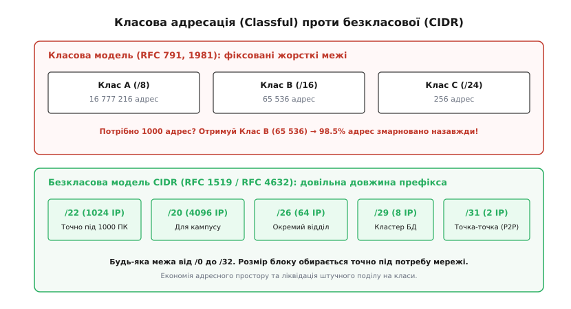
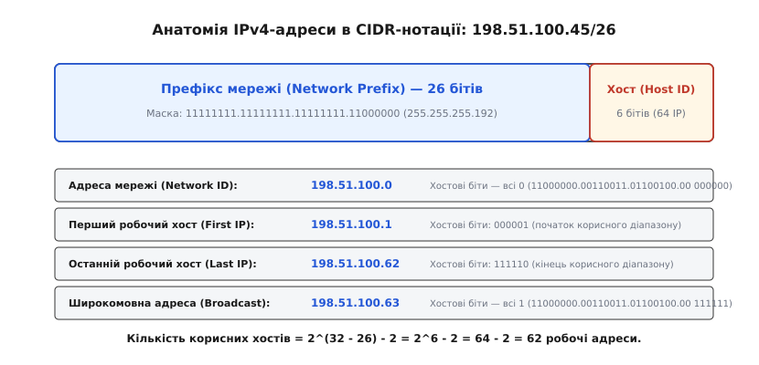
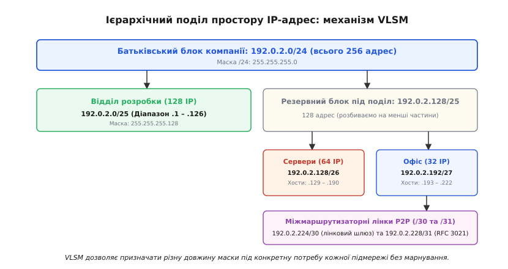
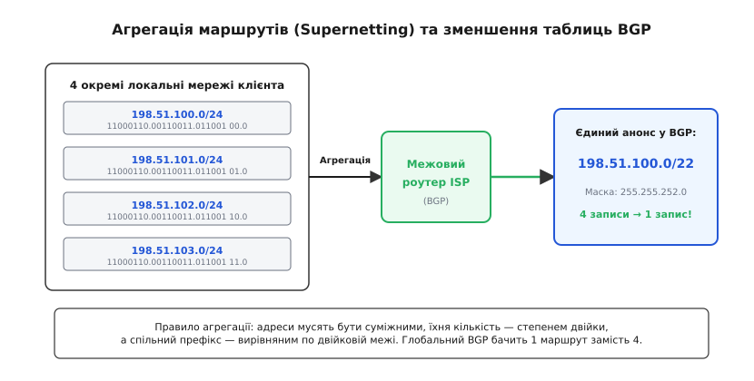
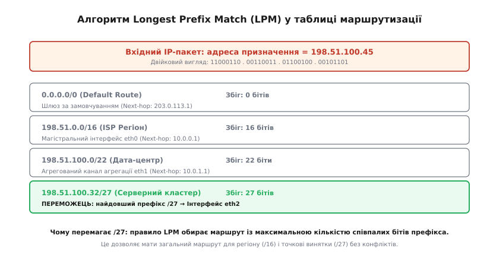
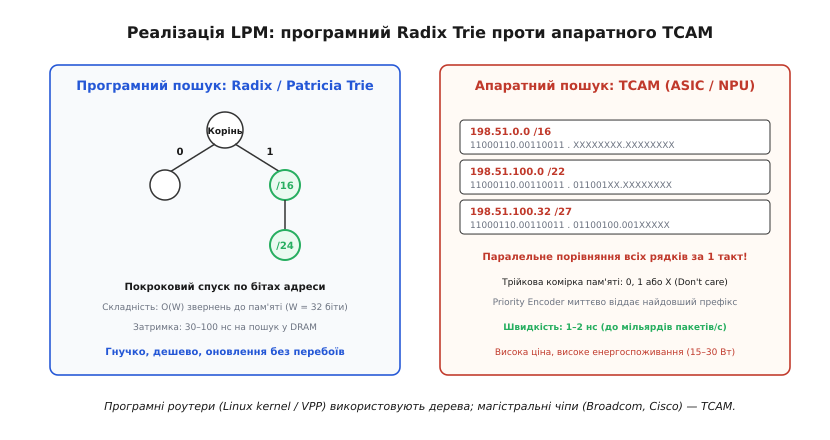

# CIDR і префікси

<preknowlist>
- [Маршрутизація IP](root:com-transport/ip-routing) — таблиці маршрутів, next-hop, підмережі, маски, default route.
- [MAC, IP і ARP](root:com-transport/mac-ip-arp) — адресація та поділ канального й мережевого рівнів.
- [BGP: протокол зв'язку між автономними системами](root:com-transport/bgp-peering-economics-and-security) — глобальна міждоменна маршрутизація, автономні системи та масштабування інтернету.
</preknowlist>

На початку 1990-х років глобальний Інтернет опинився за півтора року від повного технічного вичерпання. За початковою схемою адресації RFC 791 кожен мережевий пристрій у світі належав до одного з трьох жорстких класів: Клас A (маска `/8`, понад 16.7 мільйона адрес), Клас B (маска `/16`, 65 536 адрес) або Клас C (маска `/24`, лише 254 адреси). Коли комерційній компанії, фабриці, університету чи банку було потрібно під'єднати 500 комп'ютерів, мережа Класу C була для них замалою, а блоки Класу A не виділялися нікому, крім урядових та військових відомств США. Організація вимагала й отримувала блок Класу B на 65 536 адрес. Із них реально призначалося менше 1%, а решта 65 000 адрес назавжди ставали «замороженими» й недосяжними для решти людства.

Водночас магістральні маршрутизатори захлиналися від лавини нових маршрутів: таблиці маршрутизації глобального ядра подвоювалися кожні дев'ять місяців, а обчислювальні процесори та оперативна пам'ять тогочасного мережевого обладнання були фізично не в змозі обчислювати сотні тисяч окремих мереж.

Порятунком світової мережі стала фундаментальна архітектурна реформа 1993 року — впровадження **CIDR** (англ. *Classless Inter-Domain Routing*, безкласова міждоменна маршрутизація, стандартизована в RFC 1519 та оновлена в RFC 4632). CIDR повністю скасував поділ адресного простору на класи, зробив межу між номером мережі та номером вузла довільною й запровадив механізм **агрегації маршрутів** (supernetting), що дозволив об'єднувати тисячі дрібних маршрутів в один компактний анонс.

---

### Відмова від класів: довільний префікс та скісна нотація

Суть класової проблеми полягала у жорстких бітових кордонах, закладених на початку 1980-х років. В оригінальній системі приналежність IP-адреси до певного класу визначалася значенням кількох старших бітів її першого октету:
- якщо перший біт дорівнював `0`, адреса належала до Класу A (діапазон `1.0.0.0 – 126.255.255.255`, фіксована маска `255.0.0.0` або `/8`);
- якщо перші два біти були `10`, це був Клас B (діапазон `128.0.0.0 – 191.255.255.255`, фіксована маска `255.255.0.0` або `/16`);
- якщо перші три біти були `110`, адреса потрапляла до Класу C (діапазон `192.0.0.0 – 223.255.255.255`, фіксована маска `255.255.255.0` або `/24`).

Тодішні протоколи маршрутизації (RIPv1, IGRP, EGP) взагалі не передавали інформацію про маску підмережі в повідомленнях оновлення. Кожен маршрутизатор у світі жорстко «знав» межу мережі за першим октетом. Це унеможливлювало гнучке виділення адрес: між 254 хостами (Клас C) та 65 534 хостами (Клас B) не існувало жодного проміжного варіанта.

CIDR ліквідував цю штучну прив'язку. IP-адреса перестала бути «адресою Класу B» чи «адресою Класу C». Вона перетворилася на єдине неперервне 32-бітне двійкове число, де межа між ідентифікатором мережі та ідентифікатором хоста може проходити по **будь-якому біту від 0 до 32**.

Частина адреси, яка визначає мережу, отримала назву **префікс** (від лат. *praefixus* — «прикріплений спереду»). Префікс позначає неперервну послідовність фіксованих старших бітів, спільних для всіх пристроїв певної підмережі. Для запису мереж було стандартизовано **скісну нотацію** (англ. *slash notation* або *CIDR prefix length*), де після IP-адреси ставиться скісна риска та десяткове число, яке вказує точну кількість одиничних бітів у масці підмережі:

```
198.51.100.0/22  ->  22 біти мережі, 10 бітів хостів (1024 адреси)
192.0.2.0/28     ->  28 бітів мережі,  4 біти хостів (16 адрес)
```


*Класова модель ділила адресу на фіксовані блоки A, B і C, змушуючи організації брати надлишковий Клас B (65 536 адрес) і марнувати 98% адрес. CIDR дозволяє виділяти блок будь-якої довжини префікса точно під фізичну потребу.*

Завдяки цьому замість блоку на 65 536 адрес організація на 500 хостів почала отримувати префікс `/22` (1024 адреси), а невеликий віддалений офіс на 10 робочих станцій — префікс `/28` (16 адрес). Розподіл адресного простору став пропорційним реальним потребам інфраструктури. Повну хронологію цієї кризи та подробиці роботи групи ROAD викладено у вставці про [історію виникнення CIDR та подолання кризи 1993 року](root:com-transport/cidr/hist-classful-exhaustion.md).

---

### Двійкова арифметика масок і розрахунок параметрів підмережі

Маска підмережі в CIDR — це 32-бітне число, яке завжди складається з послідовності одиничних бітів, за якими йдуть суцільні нульові біти. Одиниці вказують на розряди, що належать префіксу мережі, а нулі — на розряди номерів хостів усередині цієї мережі. Маска не може містити розривів: комбінації на кшталт `11110011` заборонені стандартом IP.

Розгляньмо внутрішню анатомію адреси `198.51.100.45/26`:

```
IP-адреса  : 198.51.100.45    ->  11000110 . 00110011 . 01100100 . 00 101101
Маска (/26): 255.255.255.192 ->  11111111 . 11111111 . 11111111 . 11 000000
                                  └──────── префікс (26 бітів) ────────┘ └хост┘
```


*Структура адреси 198.51.100.45/26: 26 бітів префікса мережі та 6 бітів хоста. Перша адреса зі всіма нулями в хостовій частині позначає саму мережу, а остання зі всіма одиницями — спрямоване широкомовлення.*

Для точного розрахунку характеристик підмережі мережевий стек операційної системи застосовує шість базових математичних операцій:

1. **Кількість хостових бітів (`h`):**
   Визначається відніманням довжини префікса `n` від повної довжини адреси IPv4 (32 біти):
   ```
   h = 32 - n
   ```
   Для префікса `/26`: `h = 32 - 26 = 6` хостових бітів.

2. **Загальна ємність адресного простору (`N_total`):**
   Кількість можливих комбінацій значень у хостових розрядах:
   ```
   N_total = 2^h = 2^(32 - n)
   ```
   Для `/26`: `2⁶ = 64` IP-адреси.

3. **Адреса мережі (Network Identifier):**
   Обчислюється побітовою кон'юнкцією (логічне «І», AND) між 32-бітною адресою вузла та маскою підмережі:
   ```
   198.51.100.45 & 255.255.255.192
   11000110.00110011.01100100.00101101 & 11111111.11111111.11111111.11000000
   = 11000110.00110011.01100100.00000000 (198.51.100.0)
   ```
   У результаті всі біти хостової частини обнуляються. Адреса мережі позначає весь сегмент як ціле і ніколи не призначається окремому фізичному пристрою.

4. **Інверсна маска (Wildcard Mask):**
   Обчислюється побітовою інверсією маски підмережі (або відніманням маски від `255.255.255.255`):
   ```
   ~255.255.255.192 = 0.0.0.63 (00000000.00000000.00000000.00111111)
   ```
   Інверсна маска використовується в конфігураціях списків контролю доступу (ACL) та протоколах динамічної маршрутизації (OSPF, EIGRP).

5. **Спрямована широкомовна адреса (Directed Broadcast Address):**
   Обчислюється побітовою диз'юнкцією (логічне «АБО», OR) адреси мережі з інверсною маскою, що встановлює всі хостові біти в стан `1`:
   ```
   198.51.100.0 | 0.0.0.63
   = 11000110.00110011.01100100.00111111 (198.51.100.63)
   ```
   Пакет, надісланий на цю адресу, дублюється мережевим комутатором усім вузлам цієї локальної підмережі.

6. **Кількість робочих хостів (`N_usable`):**
   Оскільки адреса мережі (всі нулі) та широкомовна адреса (всі одиниці) зарезервовані службовими протоколами, кількість корисних адрес становить:
   ```
   N_usable = 2^(32 - n) - 2
   ```
   Для `/26`: `64 - 2 = 62` робочі адреси (діапазон `198.51.100.1` – `198.51.100.62`).

Винятком із формули `2^(32-n) - 2` є стандарт **RFC 3021** («Using 31-Bit Prefixes on IPv4 Point-to-Point Links»). На прямих транзитних каналах між двома маршрутизаторами широкомовні кадри не мають сенсу, оскільки в сегменті фізично відсутні інші учасники. За стандартом RFC 3021 на префіксах `/31` дозволено використовувати обидві адреси (`.0` та `.1`) як робочі хости інтерфейсів, що економить мільйони адрес в інфраструктурі провайдерів. Повний перелік усіх 33 масок та системні команди наведено у вставці [повну зведену таблицю префіксів IPv4 та довідник команд](root:com-transport/cidr/api-cidr-calc.md).

---

### Змінна довжина маски підмережі (VLSM)

До впровадження CIDR існувало жорстке обмеження: якщо організація ділила виділений їй простір на підмережі, усі вони мусили мати **строго однакову маску**. Якщо адміністратор розбивав мережу Класу B на підмережі `/24` (по 254 хости), то навіть для з'єднання двох маршрутизаторів через послідовний кабель доводилося виділяти цілий блок `/24`, у якому 252 адреси марнувалися назавжди.

Технологія **VLSM** (англ. *Variable Length Subnet Masking*, маскування підмереж змінної довжини) зняла це обмеження. Вона дозволяє **ієрархічно розбивати виділений префікс на підмережі довільного, різного розміру** відповідно до топологічних потреб кожного окремого сегмента.

Розгляньмо типову задачу проектування корпоративної мережі. Компанії виділено єдиний блок `192.0.2.0/24` (256 адрес). Необхідно адресизувати чотири функціональні зони:
1. Відділ розробки: 100 комп'ютерів (найближчий степінь двійки — `2⁷ = 128`, префікс `/25`);
2. Серверна ферма: 50 серверів (потрібно `2⁶ = 64` адреси, префікс `/26`);
3. Офіс адміністрації: 20 робочих станцій (потрібно `2⁵ = 32` адреси, префікс `/27`);
4. Два канали зв'язку між маршрутизаторами: по 2 хости на лінк (префікси `/30` або `/31`).


*VLSM розбиває єдиний батьківський блок 192.0.2.0/24 на підмережі різної довжини: /25 під великий відділ, /26 під сервери, /27 під офіс та /30 і /31 під міжмаршрутизаторні лінки.*

Двійковий розрахунок цього плану виконується за принципом послідовного бінарного поділу:

```
Батьківський блок: 192.0.2.0/24 (діапазон .0 – .255, 256 адрес)

Крок 1. Відділ розробки (/25, займає першу половину блоку):
  Мережа:    192.0.2.0/25   (адреси .0 – .127, хости .1 – .126)
  Залишок:   192.0.2.128/25 (адреси .128 – .255, вільні 128 IP)

Крок 2. Сервери (/26, беремо першу половину залишку):
  Мережа:    192.0.2.128/26 (адреси .128 – .191, хости .129 – .190)
  Залишок:   192.0.2.192/26 (адреси .192 – .255, вільні 64 IP)

Крок 3. Офіс (/27, беремо першу половину нового залишку):
  Мережа:    192.0.2.192/27 (адреси .192 – .223, хости .193 – .222)
  Залишок:   192.0.2.224/27 (адреси .224 – .255, вільні 32 IP)

Крок 4. P2P-лінки (/30, нарізаємо з початку залишкового блоку):
  Лінк 1:    192.0.2.224/30 (адреси .224 – .227, хости .225, .226)
  Лінк 2:    192.0.2.228/30 (адреси .228 – .231, хости .229, .230)
  Вільний резерв: 192.0.2.232/29 (8 адрес) та 192.0.2.240/28 (16 адрес)
```

Жодна підмережа не перекривається з іншою, адреси розподілені без жодного розриву, а в кінці діапазону залишився вільний резерв під майбутнє розширення підприємства.

---

### Агрегація маршрутів (Supernetting / Route Summarization)

Якщо технологія VLSM ділить великий адресний блок на менші частини вниз за топологією, то **агрегація маршрутів** (англ. *route summarization* або *supernetting*, від лат. *aggregatio* — «збирання до купи» та лат. *super* — «понад, зверх») виконує зворотну дію: вона **об'єднує декілька суміжних менших префіксів в один узагальнений маршрут (супермережу)** вгору за ієрархією.

Уявімо інтернет-провайдера (ISP), який надає підключення чотирьом незалежним клієнтам із сусідніми мережами `/24`:
- Клієнт A: `198.51.100.0/24`
- Клієнт B: `198.51.101.0/24`
- Клієнт C: `198.51.102.0/24`
- Клієнт D: `198.51.103.0/24`

У класовій маршрутизації провайдер мусив анонсувати у світову магістраль BGP всі чотири маршрути окремими записами. У моделі CIDR межовий маршрутизатор провайдера зіставляє двійкову структуру цих префіксів:

```
198.51.100.0/24  ->  11000110 . 00110011 . 011001 00 . 00000000
198.51.101.0/24  ->  11000110 . 00110011 . 011001 01 . 00000000
198.51.102.0/24  ->  11000110 . 00110011 . 011001 10 . 00000000
198.51.103.0/24  ->  11000110 . 00110011 . 011001 11 . 00000000
                     └────── спільні 22 біти ─────┘
```

Усі чотири мережі мають ідентичні старші 22 біти (`11000110.00110011.011001`). Межовий маршрутизатор об'єднує їх в один агрегований анонс: **`198.51.100.0/22`** (маска `255.255.252.0`).


*Чотири суміжні мережі /24 зі спільними 22 старшими бітами об'єднуються межовим маршрутизатором в один анонс супермережі 198.51.100.0/22. Глобальні маршрутизатори BGP зберігають один запис замість чотирьох.*

Для коректного формування супермережі мають одночасно виконуватися три суворі математичні умови:
1. **Неперервність адресного блоку:** мережі мають бути суміжними, без проміжних нерозподілених адрес;
2. **Кратність степеню двійки:** кількість об'єднуваних блоків має дорівнювати `2^k` (2, 4, 8, 16, 32...);
3. **Двійкове вирівнювання на межу блоку:** початкова адреса першої підмережі має бути кратною загальному розміру супермережі. Наприклад, мережі `198.51.100.0` – `198.51.103.0` об'єднуються у `/22`, тому що число `100` у третьому октеті ділиться націло на 4. Мережі `198.51.101.0` – `198.51.104.0` об'єднати в один префікс `/22` неможливо, оскільки `101` не вирівняне по двійковій межі степеня 4.

Агрегація маршрутів дає світовій мережі два фундаментальних захисних механізми:
- **Радикальне стиснення таблиць BGP:** сотні мільйонів локальних підмереж кінцевих користувачів згортаються у менш ніж один мільйон агрегованих анонсів автономних систем у глобальній таблиці пересилання;
- **Демпфування нестабільності (Route Flap Damping):** якщо в одного з клієнтів обірвався кабель і його підмережа `198.51.102.0/24` втратила зв'язок, провайдерський маршрутизатор не надсилає жодних службових повідомлень у зовнішній Інтернет. Магістральні роутери світу продовжують стабільно пересилати трафік на незмінний префікс `/22`, що ізолює глобальну мережу від локальних аварій.

Під час агрегації маршрутів у протоколі BGP виникає важлива тонкість збереження інформації про автономні системи джерел. Коли межовий маршрутизатор об'єднує маршрути, що прийшли з різних ASN, він формує спеціальний невпорядкований набір `AS_SET` (RFC 4271 §5.1.2), щоб запобігти виникненню петель маршрутизації у зовнішніх автономних системах.

---

### Алгоритм Longest Prefix Match (LPM)

Введення супермереж та масок довільної довжини створило нову ситуацію: у таблиці маршрутизації одного вузла для однієї цільової IP-адреси може одночасно підходити **декілька різних маршрутних записів**.

Нехай таблиця маршрутизації магістрального маршрутизатора містить такі записи:

```
Рядок 1 :  0.0.0.0/0          ->  Next-Hop: 203.0.113.1  (Default gateway)
Рядок 2 :  198.51.0.0/16      ->  Next-Hop: 10.0.0.1     (Регіональний транзит)
Рядок 3 :  198.51.100.0/22    ->  Next-Hop: 10.0.1.1     (Агрегат дата-центру)
Рядок 4 :  198.51.100.32/27   ->  Next-Hop: 10.0.2.1     (Окремий кластер баз даних)
```

Маршрутизатор отримує транзитний пакет, спрямований на адресу **`198.51.100.45`**.

Перевіримо накладання масок для кожного рядка таблиці:
```
1. 198.51.100.45 & /0  = 0.0.0.0          == 0.0.0.0          -> ЗБІГ (довжина 0)
2. 198.51.100.45 & /16 = 198.51.0.0       == 198.51.0.0       -> ЗБІГ (довжина 16)
3. 198.51.100.45 & /22 = 198.51.100.0     == 198.51.100.0     -> ЗБІГ (довжина 22)
4. 198.51.100.45 & /27 = 198.51.100.32    == 198.51.100.32    -> ЗБІГ (довжина 27)
```

Усі чотири записи відповідають адресі призначення. За яким маршрутом слід передати пакет?

Фундаментальне правило безкласової маршрутизації стверджує: **перемагає маршрут із найдовшим збігом префікса — Longest Prefix Match (LPM)**.


*Для вхідного пакета 198.51.100.45 підходять чотири маршрути різної довжини. Правило LPM обирає найдовший збіг /27 (27 бітів збігу), що дозволяє утримувати точкові винятки всередині великих супермереж.*

Префікс `/27` містить найбільше одиничних бітів у масці (27 бітів збігу), тобто описує найвужчу, найконкретнішу підмережу. Маршрутизатор спрямовує пакет на інтерфейс `Next-Hop: 10.0.2.1`.

Правило LPM має вирішальне значення для світової інфраструктури: воно дозволяє операторам анонсувати великі узагальнені агрегати (наприклад, `/16` для цілої країни) і водночас за потреби виділяти окремі точкові префікси (`/24` чи `/28`) через інших провайдерів без конфліктів та без руйнування загального анонсу.

---

### Деагрегація маршрутів та безпека BGP (RPKI / ROA)

Хоча CIDR надав усі інструменти для стиснення маршрутів, у реальному Інтернеті діє протилежна економічна та інженерна сила — **деагрегація маршрутів** (англ. *route de-aggregation* або *disaggregation*).

Коли корпоративна автономна система підключається до двох незалежних провайдерів (схема *Multi-homing*), вона прагне розподілити вхідний трафік: наприклад, пустити веб-трафік через провайдера A, а трафік баз даних — через провайдера B. Завдяки правилу LPM найпростіший спосіб гарантовано затягнути трафік до себе через провайдера A — це анонсувати туди точніший суб-префікс `/24`, а через провайдера B — загальний блок `/23`. Усі маршрутизатори світу оберуть шлях до провайдера A для цієї підмережі `/24`, проігнорувавши агрегат `/23`.

Через масове використання цього прийому сотнями тисяч компаній глобальна таблиця маршрутизації BGP (так звана зона *Default-Free Zone*, DFZ) сьогодні перевищує 950 000 маршрутів. Більше ніж половина цих записів є деагрегованими префіксами `/24`. Щоб стримати це зростання, оператори зв'язку ввели глобальне консенсусне правило: **жоден магістральний маршрутизатор Інтернету не приймає і не передає анонси з маскою, довшою за `/24`** (префікси `/25`–`/32` у глобальний BGP не допускаються).

З правилом LPM пов'язана також вразливість до **BGP-перехоплення** (Prefix Hijacking). Якщо зловмисник анонсує чужу мережу точнішим префіксом (наприклад, `/24` замість `/22`), світовий трафік через LPM піде до нього. Для захисту від таких атак впроваджено криптографічну систему **RPKI** (Resource Public Key Infrastructure), де власник реєструє об'єкт **ROA** із зазначенням параметра `MaxLength`: якщо префікс у BGP довший за дозволений або надходить із неавторизованого ASN, магістральні роутери вважають його недійсним (`Invalid`) та відкидають.

---

### Програмна та апаратна реалізація LPM: Radix Trie та TCAM

Швидкість пошуку найдовшого префікса є головним фактором продуктивності будь-якого мережевого обладнання. Якщо таблиця пересилання (FIB) містить 1 000 000 префіксів, а потік пакетів на інтерфейсі 100 Гбіт/с становить 148 мільйонів пакетів за секунду, час обробки одного заголовка обмежений кількома наносекундами.

У сучасних комутаційних системах застосовують два принципово різних підходи:

#### 1. Програмний пошук: Двійкові дерева Radix Trie
В операційних системах загального призначення (ядро Linux, підсистема `net/ipv4/fib_trie.c`, стеки BSD) таблиця FIB будується у вигляді двійкового префіксного дерева (Radix Trie / Level-Compressed Trie).

Шлях від кореня дерева до цільового вузла визначається послідовністю бітів адреси призначення: біт `0` веде ліворуч, біт `1` — праворуч. Вузли, які відповідають зареєстрованим префіксам, зберігають адресу next-hop та вихідний інтерфейс.

Під час надходження пакета процесор спускається деревом від кореня вниз, зчитуючи біти IP-адреси. Останній пройдений вузол, у якому був зафіксований дійсний маршрут, і є результатом LPM. Складність пошуку становить строго `O(W)`, де `W = 32` для IPv4 (і `W = 128` для IPv6), і **не залежить від кількості маршрутів у системі**.

В операційній системі Linux архітектура пересилання побудована на розподілі між простором користувача та ядром:
- Протокольні демони маршрутизації (FRRouting, BIRD) працюють у просторі користувача і ведуть базу маршрутів RIB (Routing Information Base).
- За допомогою інтерфейсу Netlink (`RTM_NEWROUTE`) демони передають активні префікси в ядро, де будується компактна таблиця пересилання FIB у пам'яті.
- Для безпечного паралельного доступу багатьох ядер процесора до префіксного дерева ядро застосовує механізм **RCU** (Read-Copy-Update, `rcu_read_lock()`), що дозволяє шукати маршрути на мільйонах пакетів взагалі без використання блокувальних м'ютексів.

Стан префіксного дерева ядра Linux можна безпосередньо проінспектувати через віртуальну файлову систему procfs:

```bash
cat /proc/net/fib_trie
```

Цей файл виводить повну ієрархію вузлів ядра: кореневі розгалужувачі, стиснуті піддерева та кінцеві листи маршрутів із зазначенням довжини префікса. Коли мережевий стек обробляє пакет, ядро викликає функцію `fib_lookup()`, яка спускається по цьому дереву в пам'яті.

Для зменшення затримок від промахів кешу процесора (DRAM cache misses) у промислових програмних комутаторах (наприклад, DPDK LPM) використовують оптимізовану схему **DIR-24-8**: перші 24 біти адреси індексують таблицю розміром `2²⁴` записів за одне звернення до пам'яті (`O(1)`), а залишковий блок tbl8 опитується лише для рідкісних префіксів довжиною від `/25` до `/32`. Повний вихідний код і детальний розбір алгоритмів наведено у вставці [детальну реалізацію алгоритму Longest Prefix Match на мовах C та C++](root:com-transport/cidr/proj-radix-lpm.md).

#### 2. Апаратний пошук: Трійкова асоціативна пам'ять TCAM
У магістральних апаратних комутаторах і маршрутизаторах (ASIC Broadcom Tomahawk, Cisco Silicon One, Juniper Express) програмний спуск по дереву замінюють матрицями мікросхем **TCAM** (англ. *Ternary Content-Addressable Memory*).

Звичайна оперативна пам'ять (RAM) приймає адресу комірки й повертає її вміст. Асоціативна пам'ять (CAM) працює у зворотному напрямку: вона приймає дані (IP-адресу) і повертає номер рядка, де ці дані зберігаються.

Трійкова комірка TCAM може зберігати три стани:
- `0` (суворий збіг із двійковим нулем);
- `1` (суворий збіг з одиницею);
- `X` (стан *Don't Care* — біт маскується та ігнорується під час порівняння).

```
Рядок TCAM для 198.51.0.0/16     : 11000110.00110011. XXXXXXXX.XXXXXXXX
Рядок TCAM для 198.51.100.0/22   : 11000110.00110011. 011001XX.XXXXXXXX
Рядок TCAM для 198.51.100.32/27  : 11000110.00110011. 01100100.001XXXXX
```


*Програмні маршрутизатори спускаються по двійковому дереву Radix Trie за O(W) операцій у DRAM; апаратні комутатори ASIC порівнюють усі рядки в матриці TCAM паралельно за один такт генератора.*

Коли на вхід мікросхеми TCAM подається 32-бітна адреса призначення, матриця транзисторів **одночасно й паралельно порівнює її з усіма записами таблиці рівно за один такт тактового генератора (1–2 наносекунди)**. Якщо збіглися декілька рядків, апаратний шифратор пріоритетів (Priority Encoder) миттєво обирає рядок із найдовшим префіксом.

Ціною такої швидкодії є висока вартість кристала та високе енергоспоживання (до 15–30 Вт на одну мікросхему TCAM), оскільки під час кожного такту активуються мільйони логічних вентилів одночасно. Сучасні програмовані комутатори на базі мови P4 (наприклад, Intel Tofino) використовують гнучкі таблиці Match-Action, де TCAM виділяється виключно під LPM-маршрутизацію, а таблиці точного збігу (MAC, Flow-ID) розміщуються в енергоефективній пам'яті SRAM.

---

### Практичний кейс: планування CIDR-адресації дата-центру (Leaf-Spine)

Розгляньмо практичний інженерний приклад планування адресного простору для сучасного дата-центру на базі архітектури Leaf-Spine (Clos-топологія).

Дата-центр містить 4 магістральні комутатори Spine та 16 стійкових комутаторів Leaf. Дата-центру виділено приватний блок **`10.100.0.0/16`** (65 536 адрес).

Інженерна схема розподілу префіксів за принципами CIDR та VLSM будується так:

1. **Loopback-інтерфейси маршрутизаторів (`/32`):**
   Кожен комутатор отримує унікальну 32-бітну адресу для ідентифікатора BGP Router-ID та кінцевих точок тунелів VXLAN VTEP. Виділяється блок `10.100.0.0/24`:
   - Spine-1..4: `10.100.0.1/32` – `10.100.0.4/32`
   - Leaf-1..16: `10.100.0.11/32` – `10.100.0.26/32`

2. **Міжкомутаторні лінки P2P Spine-Leaf (`/31` за RFC 3021):**
   Між 4 Spine та 16 Leaf комутаторами є `4 * 16 = 64` оптичні лінії зв'язку. Кожен лінк потребує рівно 2 адреси. Виділяється блок `10.100.1.0/24`:
   - Лінк Spine-1 <-> Leaf-1: `10.100.1.0/31` (адреси `.0` та `.1`)
   - Лінк Spine-1 <-> Leaf-2: `10.100.1.2/31` (адреси `.2` та `.3`)
   - Лінк Spine-4 <-> Leaf-16: `10.100.1.126/31` (адреси `.126` та `.127`)

3. **Серверні стійки під комутаторами Leaf (`/24` на стійку):**
   Кожна з 16 стійок отримує свій префікс `/24` (до 250 фізичних або віртуальних серверів на стійку):
   - Стійка 1 (Leaf-1): `10.100.16.0/24`
   - Стійка 2 (Leaf-2): `10.100.17.0/24`
   - Стійка 16 (Leaf-16): `10.100.31.0/24`
   Усі 16 стійок утворюють суміжний блок, який на межі дата-центру ідеально агрегується в єдиний компактний префікс **`10.100.16.0/20`** (4096 IP).

4. **Кластери Kubernetes (Pod CIDR, `/24` на робочий вузол):**
   Виділяється блок `10.100.64.0/18` (16 384 адреси), де кожен вузол кластера отримує `/24` для внутрішньої адресації контейнерів.

Завдяки строгому двійковому вирівнюванню та використанню префіксів різного розміру (від `/32` до `/18`), внутрішні таблиці маршрутизації дата-центру містять мінімальну кількість маршрутів, канали зв'язку не марнують адрес, а весь трафік магістралі маршрутизується на максимальній апаратній швидкості.

---

### Префікси у протоколі IPv6: розвиток безкласової моделі

Принципи CIDR виявилися настільки успішними, що під час проектування протоколу нового покоління **IPv6** (RFC 4291) концепцію класів навіть не розглядали: IPv6 від самого початку побудований виключно на безкласовій префіксній адресації.

У протоколі IPv6 взагалі відмовилися від запису масок десятковими числами з крапками (на кшталт `255.255.255.0`): префікси записуються **виключно у CIDR-нотації зі скісною рискою**:
- **`/128`:** одиночний хост або інтерфейс Loopback (`::1/128`);
- **`/64`:** стандартний розмір будь-якої кінцевої підмережі локальної мережі (RFC 4291). Перші 64 біти визначають префікс маршрутизації, а останні 64 біти — ідентифікатор інтерфейсу (Interface ID). Такий великий розмір хостової частини необхідний для безконфігураційного автоналаштування SLAAC (Stateless Address Autoconfiguration, RFC 4862);
- **`/48`:** стандартний блок, який провайдери виділяють одній кінцевій організації або офісу. Організація отримує `2^(64-48) = 2¹⁶ = 65 536` окремих повноцінних підмереж `/64`;
- **`/32`:** стандартний блок, який регіональні реєстратори (RIR) виділяють інтернет-провайдерам.

CIDR став універсальним стандартом мережевої адресації для обох версій протоколу IP.

---

### Ієрархія розподілу адрес та глобальне управління Інтернетом

Завдяки впровадженню CIDR адресний простір Інтернету отримав чотирирівневу деревоподібну ієрархію управління:

```
                      [ IANA (Глобальний пул IPv4 / IPv6) ]
                                      │
            ┌──────────────┬──────────┴───┬──────────────┬──────────────┐
            ▼              ▼              ▼              ▼              ▼
       [ RIPE NCC ]     [ ARIN ]       [ APNIC ]      [ LACNIC ]    [ AFRINIC ]
       (Європа)       (Пн. Америка)    (Азія)       (Лат. Америка)   (Африка)
            │
            ▼
       [ LIR / Національні провайдери Tier-1/Tier-2 (Блоки /16 – /22) ]
            │
            ▼
       [ Корпоративні клієнти та кінцеві споживачі (Блоки /24 – /29) ]
```

1. **IANA (Internet Assigned Numbers Authority):** керує кореневим пулом адрес і виділяє великі магістральні блоки розміру `/8` (по 16.7 млн адрес) регіональним реєстраторам;
2. **RIR (Regional Internet Registries):** п'ять континентальних реєстраторів розподіляють отримані блоки між національними операторами зв'язку та хмарними провайдерами блоками `/12`–`/22`;
3. **LIR (Local Internet Registries) та Tier-1/Tier-2 провайдери:** формують внутрішні пули та виділяють кінцевим абонентам блоки від `/24` до `/29`;
4. **Кінцеві споживачі:** використовують виділені префікси для внутрішньої адресації через VLSM.

Така ієрархія гарантує, що кожен рівень анонсує вгору лише узагальнений агрегований маршрут, повністю приховуючи внутрішню структуру своїх підмереж від зовнішнього світу.

CIDR не збільшив теоретичну кількість 32-бітних адрес IPv4 — їхня фізична межа назавжди становить `4 294 967 296`. Проте він ліквідував критичне марнування простору й усунув загрозу колапсу глобальної маршрутизації BGP. У поєднанні з технологією трансляції адрес NAT, безкласова адресація дала Інтернету понад тридцять років стабільного розвитку, створивши надійний міст для поступового переходу людства на 128-бітний протокол IPv6.
