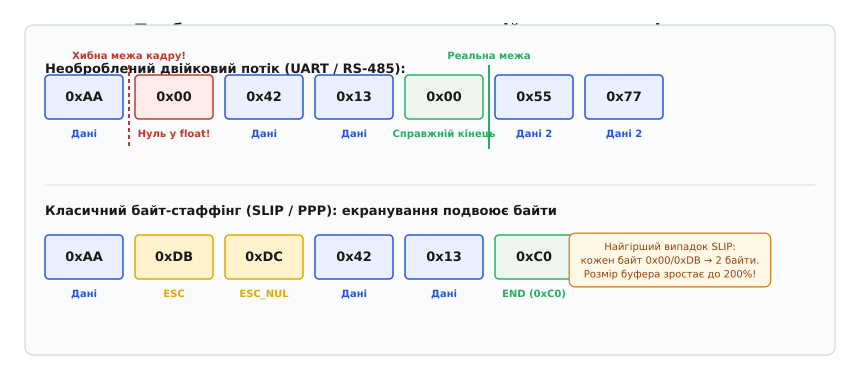
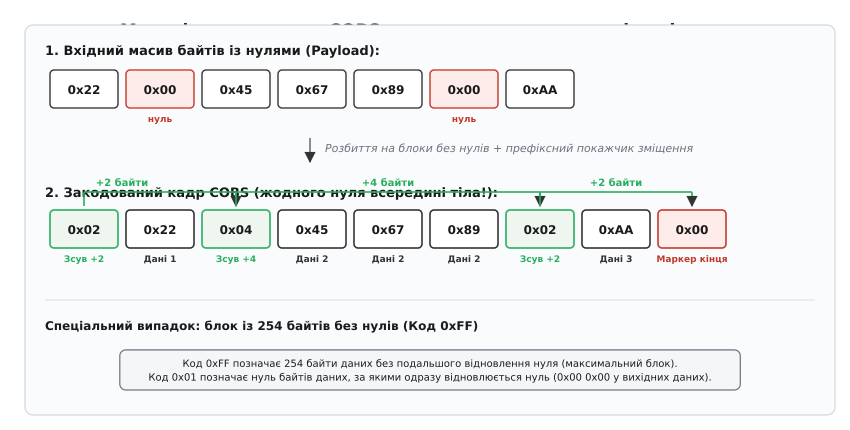
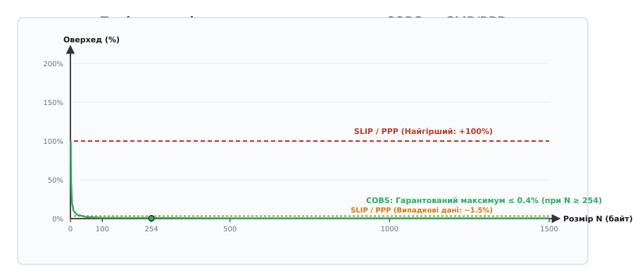
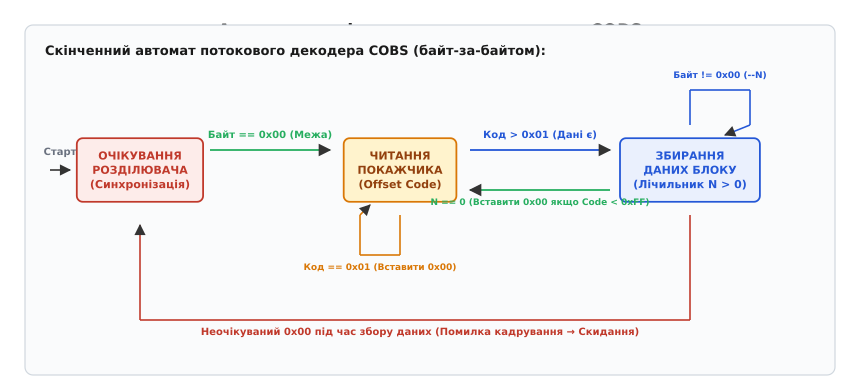
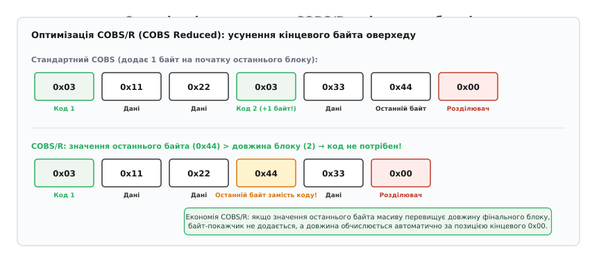

# Кадрування COBS: алгоритм байт-стаффінгу з гарантованим оверхедом

<preknowlist>
- [Асинхронна послідовна передача даних](root:com-devices/async-serial) — передача байтів лінією UART без спільного тактового сигналу, старт-стопові біти та ризик розсинхронізації.
- [Формування та структура мережевого пакета](root:com-transport/packet-design) — виявлення меж блоків у безперервному потоці байтів, призначення розділювачів та захист цілісності.
- [Циклічний надлишковий код (CRC)](root:com-modulation/crc) — алгоритми виявлення апаратних спотворень та перевірки цілісності кадрів у каналі зв'язку.
</preknowlist>

Коли мікроконтролер польотного контролера зчитує показники тривісного гіроскопа, акселерометра, магнітометра й барометра, він формує двійкову структуру мови C із десятків дробових чисел і виштовхує її через апаратний передавач UART або диференціальний трансивер RS-485. У мідній витій парі послідовного інтерфейсу немає окремого тактового дроту чи апаратної лінії стробування вибору мікросхеми (англ. *Chip Select*), які б сигналізували пристрою на іншому кінці кабелю про початок і кінець окремого пакета. Приймач бачить лише нескінченний, однорідний ланцюг октетів, що надходять у кільцевий буфер переривань або накопичуються каналом прямого доступу до пам'яті (англ. *Direct Memory Access*, DMA).

Якщо двадцятибайтовий блок телеметрії транслюється кожні десять мілісекунд, приймач зобов'язаний безпомилково розпізнавати, де закінчився попередній масив вимірювань і де починається наступний. Будь-який випадковий зсув навіть на один байт призводить до руйнівних наслідків: дробові значення кутів орієнтації інтерпретуються як цілі числа, старші байти адрес переплутуються з кодами команд керування, а контрольна сума кадру перестає сходитися. Щоб виділити дискретні повідомлення з неперервного потоку байтів, канальний протокол потребує надійного та математично строгого механізму кадрування (англ. *framing*).

На відміну від інтерфейсів SPI (де активний низький рівень на лінії `CS` апаратно фіксує початок і завершення транзакції) або шини I2C (де стан шини визначається комбінаціями `START` і `STOP` на лініях `SDA`/`SCL`), асинхронні послідовні канали UART та RS-485 оперують лише байтовими квантами. Апаратний рівень UART синхронізує прийом окремих бітів усередині одного октету за допомогою старт-стопових бітів, але не має жодного поняття про межі багатобайтових пакетів. Завдання розмежування пакетів цілком покладається на канальний протокол програмного рівня.

Найпростіший інженерний задум полягає у виборі спеціального унікального значення байта — розділювача (англ. *delimiter*), наприклад нульового октету `0x00`, який передавач відправляє виключно між сусідніми повідомленнями. Проте в двійкових даних нульовий байт зустрічається постійно: дробове число `0.0f` у форматі IEEE 754 кодується чотирма нульовими байтами `0x00 0x00 0x00 0x00`, нульовий кут повороту або скинутий бітовий прапорець статусу містять нулі, а порожні поля структур заповнені значеннями `0x00`. Якщо наївний приймач зустріне такий нуль усередині корисного навантаження, він помилково сприйме його за кінець кадру, розірве структуру навпіл і передасть прикладній програмі пошкоджене сміття.


*Проблема виявлення меж кадру: у наївному потоці нульовий байт усередині числа розриває пакет, а класичне екранування SLIP/PPP подвоює байти екранування, непередбачувано роздуваючи розмір буфера приймача.*

---

## Екранування байтів та глухий кут протоколів SLIP і PPP

Історично для розв'язання цієї проблеми в комп'ютерних мережах застосовували метод **екранування байтів** (англ. *byte stuffing* або *character stuffing*, від лат. *stipare* — набивати, ущільнювати). Якщо в корисних даних з'являється байт, зарезервований під розділювач, передавач підміняє його на двобайтову керівну послідовність (англ. *escape sequence*).

У класичному протоколі SLIP (англ. *Serial Line Internet Protocol*, RFC 1055) кінець кадру позначається октетом `END = 0xC0`. Якщо байт `0xC0` трапляється всередині корисного навантаження, передавач замінює його на два байти: `ESC (0xDB)` та `ESC_END (0xDC)`. Якщо ж у даних зустрічається сам керівний байт `0xDB`, його замінюють парою `ESC (0xDB)` та `ESC_ESC (0xDD)`.

Схожа схема діє в протоколі PPP (англ. *Point-to-Point Protocol*, RFC 1662), де розділювачем слугує прапорець `0x7E`, а екранування здійснюється октетом `0x7D` з інверсією п'ятого біта наступного байта. Крім того, за замовчуванням конфігурації карти контрольних символів ACCM (англ. *Async-Control-Character-Map*) протокол PPP екранує всі 32 керівні символи ASCII в діапазоні `0x00..0x1F`, щоб запобігти конфліктам із застарілим модемним обладнанням.

Ця схема працює, але створює критичну фундаментальну ваду: **розмір закодованого кадру стає непередбачувано змінним і залежить від випадкового внутрішнього вмісту даних**.

Якщо корисне навантаження довжиною `N` байтів містить двійкові структури з великою кількістю нулів або значень `0xDB`, кожен такий байт перетворюється на два. У найгіршому випадку, коли пакет цілком складається з байтів, що вимагають екранування, обсяг переданих даних подвоюється:

```
L_max = 2 · N + 1      [кожен байт даних роздувається до 2 байтів + 1 байт розділювача]
```

Для високопродуктивних серверів подвоєння довжини пакета було прикрою втратою пропускної здатності, але для вбудованих мікроконтролерів із жорсткими обмеженнями пам'яті (STM32, ESP32, AVR) воно перетворилося на архітектурний глухий кут:

1. **Необхідність виділення подвійного буфера:** Якщо прикладний протокол передає пакети розміром до `1024` байтів, приймач зобов'язаний виділити в оперативній пам'яті апаратний буфер розміром щонайменше `2048` байтів на випадок найгіршого сценарію екранування. У мікроконтролері з кількома кілобайтами SRAM резервування подвійної пам'яті під кожен інтерфейс UART швидко виснажує доступні ресурси.
2. **Нестабільність затримки передачі (Jitter):** Час передачі кадру фіксованого прикладного розміру починає коливатися вдвічі залежно від поточних значень датчиків. Для систем керування в реальному часі (наприклад, контурів стабілізації квадрокоптера чи приводів робота) така варіативність часових характеристик є неприпустимою.
3. **Падіння корисної швидкості:** Передача великих масивів калібрувальних таблиць чи нульових матриць призводить до стовідсоткового оверхеду каналу зв'язку.

### Чому префікс довжини (Length-Prefix Framing) не рятує

Альтернативним підходом, який часто розглядають розробники-початківці, є додавання поля довжини на початку кожного пакета (наприклад, 2 байти `Length` перед корисним навантаженням).

На перший погляд, це дозволяє уникнути будь-якого екранування: приймач зчитує поле `Length = 100`, відраховує рівно 100 байтів і завершує прийом кадру. Проте в каналах з апаратними завадами (шум на лінії UART або дребезг контактів RS-485) така схема виявляється вкрай крихкою:
* Якщо завада спотворює байти поля `Length` (наприклад, замість `100` приймач зчитує `65000`), приймач зависає в очікуванні 65 кілобайтів даних, пропускаючи десятки реальних наступних пакетів.
* Якщо один байт у потоці випадає через переповнення апаратного FIFO регістру UART, лічильник зміщується на 1 байт. Усі наступні пакети починають зчитувати поле довжини з випадкового тіла даних, що призводить до тривалої повної розсинхронізації каналу.

Без унікального маркера межі (розділювача) протокол із префіксом довжини не здатний автономно відновити синхронізацію при втраті байтів.

> Докладний історичний аналіз переходу від неекономного екранування SLIP і протоколів сімейства HDLC до сучасних методів кадрування викладено у вставці [📜 Історія створення COBS: від виснаження буферів PPP до стандарту послідовних шин](root:com-transport/cobs-framing/hist-cobs-origin.md).

---

## Ідея COBS: ліквідація нулів за допомогою покажчиків зміщення

У 1997 році дослідники Стенфордського університету Стюарт Чешир (англ. *Stuart Cheshire*) та Мері Бейкер (англ. *Mary Baker*) запропонували фундаментально інший підхід, опублікувавши алгоритм **COBS** (англ. *Consistent Overhead Byte Stuffing* — кодування з фіксованими накладними витратами, від лат. *constans* — постійний, незмінний та англ. *stuffing* — заповнення).

Замість того щоб роздувати кожен заборонений байт двобайтовою послідовністю, COBS **повністю видаляє всі нульові байти з тіла повідомлення**, замінюючи їх числовими покажчиками зміщення (англ. *offset pointers*) на позицію наступного нуля.

У результаті перетворення закодований масив даних має фундаментальну математичну властивість: **усередині тіла закодованого пакета немає жодного байта зі значенням `0x00`**.

Завдяки цьому нульовий октет стає абсолютно надійним, недвозначним маркером межі кадру:
* Байт `0x00` передається **виключно між пакетами** як розділювач.
* Зустріч із байтом `0x00` у будь-який момент часу однозначно свідчить про завершення поточного пакета та готовність до прийому наступного.
* Накладні витрати алгоритму суворо обмежені зверху: рівно **1 додатковий байт на кожні 254 байти корисних даних** (менше ніж `0.4%` оверхеду).


*Принцип розбиття потоку на блоки в COBS: нульові байти замінюються префіксними покажчиками зміщення, що утворюють зв'язаний ланцюжок від початку пакета до маркера 0x00.*

---

## Алгоритм кодування COBS

Алгоритм перетворює довільний вхідний масив байтів довжиною `N` на закодований масив, розбиваючи вхідні дані на послідовність блоків, що не містять нулів.

### Правила формування блоків

1. Вхідний потік даних подумки розбивається на фрагменти (блоки), розділені нульовими байтами `0x00`.
2. Кожен блок містить від `0` до `254` ненульових байтів.
3. Перед кожним блоком записується рівно один службовий байт — **покажчик зміщення** (англ. *code byte* або *offset pointer*), позначимо його як `c`.
4. Значення `c` вказує на відстань (у байтах) від поточної позиції покажчика до позиції наступного службового покажчика в закодованому потоці.

Оскільки байт може набувати значень від `0x00` до `0xFF` (`0..255`), а значення `0x00` суворо зарезервоване під розділювач кадру, покажчик `c` набуває значень у діапазоні від `0x01` до `0xFF` (`1..255`).

Семантика кодового байта `c` визначається двома випадками:

* **Звичайний блок (`0x01 ≤ c ≤ 0xFE`, тобто `1 ≤ c ≤ 254`):**
  Покажчик `c` означає, що за ним слідує рівно `c - 1` ненульових байтів корисних даних, після яких у вихідному повідомленні стояв нульовий байт `0x00`. Під час декодування після зчитування `c - 1` байтів алгоритм автоматично записує у відновлений масив байт `0x00`.
  
  *Приклад:* якщо `c = 0x01`, то `c - 1 = 0`. Це означає, що корисних даних у блоці немає, а у вхідному потоці одразу стояв нуль (два нулі поспіль).
  
  *Приклад:* якщо `c = 0x04`, то за ним слідує `4 - 1 = 3` ненульових байти, після яких відновлюється `0x00`.

* **Максимальний блок без нуля (`c = 0xFF`, тобто `c = 255`):**
  Якщо у вхідному потоці йде довга послідовність із 254 ненульових байтів поспіль, блок досягає своєї максимальної місткості. У цьому випадку записується покажчик `0xFF`, за яким слідують усі `254` байти даних. Але, на відміну від попереднього випадку, **після цих 254 байтів нуль у вихідне повідомлення не вставляється**, оскільки блок завершився не через нуль, а через вичерпання лічильника довжини.

```
Код c = 0x01 :  0 байтів даних  + вставити 0x00 у декодері
Код c = 0x02 :  1 байт даних    + вставити 0x00 у декодері
...
Код c = 0xFE :  253 байти даних + вставити 0x00 у декодері
Код c = 0xFF :  254 байти даних + НЕ вставляти 0x00 (продовження)
```

---

## Покроковий розбір прикладів кодування

Розгляньмо роботу алгоритму на характерних послідовностях даних.

### Приклад 1: Звичайний масив із поодинокими нулями

Нехай вхідне корисне навантаження складається із 7 байтів:
```
Вхід:  [ 0x22, 0x00, 0x45, 0x67, 0x89, 0x00, 0xAA ]
```

1. **Перший блок:** Починається з першого байта `0x22`. До першого нуля маємо 1 байт (`0x22`). Довжина блоку `L = 1`. Покажчик дорівнює `c = L + 1 = 2` (`0x02`).
   Записуємо: `0x02, 0x22`. Нульовий байт з вхідного потоку пропускається (поглинається покажчиком).
2. **Другий блок:** Наступні ненульові байти: `0x45, 0x67, 0x89` (всього 3 байти). До наступного нуля довжина `L = 3`. Покажчик `c = 3 + 1 = 4` (`0x04`).
   Записуємо: `0x04, 0x45, 0x67, 0x89`. Нульовий байт знову поглинається.
3. **Третій блок:** Останній байт `0xAA` (1 байт). Дані закінчилися. Довжина `L = 1`. Покажчик `c = 1 + 1 = 2` (`0x02`).
   Записуємо: `0x02, 0xAA`.
4. **Завершення кадру:** Додається фінальний розділювач `0x00`.

```
Результат COBS: [ 0x02, 0x22, 0x04, 0x45, 0x67, 0x89, 0x02, 0xAA, 0x00 ]
```

Зверніть увагу: початковий розмір був 7 байтів. Закодоване тіло займає 8 байтів (рівно 1 байт оверхеду на початку). Разом із кінцевим маркером довжина становить 9 байтів. Усередині тіла пакета немає жодного нуля.

### Приклад 2: Послідовні нулі (Sparse Data)

Нехай вхідний масив містить послідовні нулі:
```
Вхід:  [ 0x00, 0x00 ]
```

1. Перший нуль зустрічається одразу на позиції 0 (0 байтів даних перед ним). Покажчик `c = 0 + 1 = 0x01`.
2. Другий нуль також не має перед собою даних. Покажчик `c = 0 + 1 = 0x01`.
3. Завершення даних після другого нуля формує фінальний порожній блок із покажчиком `0x01`.

```
Результат COBS: [ 0x01, 0x01, 0x01, 0x00 ]
```

Кожен нуль просто замінюється байтом `0x01`. Розмір збільшився лише на 1 початковий байт покажчика плюс 1 байт кінцевого розділювача.

### Приклад 3: Дані без нулів

Нехай масив довжиною 4 байти взагалі не містить нулів:
```
Вхід:  [ 0x11, 0x22, 0x33, 0x44 ]
```

Оскільки нулів немає, увесь масив утворює єдиний блок довжиною `L = 4`. Покажчик `c = 4 + 1 = 5` (`0x05`).

```
Результат COBS: [ 0x05, 0x11, 0x22, 0x33, 0x44, 0x00 ]
```

### Приклад 4: Довгий блок понад 254 байти (Переповнення лічильника)

Нехай вхідний масив містить `255` ненульових байтів поспіль: `[ 0x01, 0x02, ..., 0xFF ]`.

Оскільки максимальний покажчик обмежений значенням `0xFF` (`254` байти даних), алгоритм формує:
1. Блок максимальної довжини: покажчик `0xFF`, за яким слідують перші `254` байти.
2. Блок залишку: покажчик `0x02` (`1 + 1`), за яким слідує 1 залишковий байт `0xFF`.
3. Розділювач `0x00`.

```
Результат COBS: [ 0xFF, <254 байти даних>, 0x02, 0xFF, 0x00 ]
```

Тут на 255 байтів корисного навантаження було додано лише 2 байти покажчиків (1 байт на кожні 254 байти блоку + 1 залишковий).

---

## Алгоритм декодування COBS

Декодування COBS є надзвичайно швидким і прямолінійним процесом, який не потребує пошуку за таблицями чи складних бітових операцій.

1. Декодер зчитує перший байт кадру як покажчик `c`.
2. Якщо `c == 0x00`, це помилка кадрування (порожній або некоректний кадр), оскільки всередині тіла нулів бути не може.
3. Декодер копіює наступні `c - 1` байтів із вхідного буфера безпосередньо у вихідний буфер корисного навантаження.
4. Якщо значення покажчика було `c < 0xFF`, декодер перевіряє, чи не досягнуто кінця вхідного кадру (за наявністю наступного байта `0x00`). Якщо за поточним блоком слідують інші дані, у вихідний буфер записується відновлений нуль `0x00`.
5. Декодер зчитує наступний байт вхідного потоку як новий покажчик `c` і повторює кроки 2–5, доки не зустріне розділювач `0x00`.

### Декодування безпосередньо в тому самому буфері (In-Place Decoding)

Важливою практичною властивістю COBS є те, що **декодоване повідомлення завжди коротше за закодоване або дорівнює йому за довжиною**.

Оскільки кожен покажчик зміщення `c` займає 1 байт у закодованому потоці, а породжує щонайбільше `(c - 1)` байтів даних плюс один відновлений нуль (разом ті самі `c` байтів), позиція запису у вихідний буфер ніколи не випереджає позицію читання із вхідного буфера:

```
pos_write ≤ pos_read
```

Це дозволяє мікроконтролеру декодувати кадр **in-place** — в одному й тому самому масиві оперативної пам'яті без виділення додаткового вихідного буфера.

---

## Математичні межі накладних витрат

Головною перевагою COBS над усіма іншими схемами байт-стаффінгу є строгий детермінізм накладних витрат.

Для вхідного повідомлення довжиною `N` байтів кількість блоків максимальної довжини `254` становить щонайбільше `ceil(N / 254)` (або `1`, якщо `N = 0`). Кожен такий блок додає рівно 1 байт покажчика зміщення.

Загальна довжина закодованого повідомлення `L_cobs(N)` без урахування кінцевого розділювача `0x00` визначається як:

```
L_cobs(N) = N + ceil(N / 254)      [для N > 0]
L_cobs(0) = 1                      [для порожнього масиву N = 0]
```

Разом із кінцевим нулем-розділювачем повний розмір кадру в лінії зв'язку становить:

```
L_total(N) = N + ceil(N / 254) + 1
```

Розрахуймо максимальні накладні витрати у відсотках для різних розмірів пакетів:

```
N = 1 байт:    L_total = 1 + 1 + 1 = 3 байти
N = 100 байтів: L_total = 100 + 1 + 1 = 102 байти   (оверхед 2.0%)
N = 254 байти:  L_total = 254 + 1 + 1 = 256 байтів  (оверхед 0.78%)
N = 1000 байтів: L_total = 1000 + 4 + 1 = 1005 байтів (оверхед 0.5%)
N = 1500 байтів (MTU Ethernet): L_total = 1500 + 6 + 1 = 1507 байтів (оверхед 0.46%)
```

Асимптотичний оверхед алгоритму при великих `N` визначається співвідношенням:

```
ω_max = lim[N→∞] (ceil(N / 254) / N)
= 1 / 254
≈ 0.003937 (0.3937%)
```


*Порівняння накладних витрат: у той час як найгірший випадок SLIP вимагає подвоєння буфера (+100%), COBS гарантує максимум 1 байт на 254 байти навантаження (~0.4%).*

У таблиці наведено порівняння параметрів кадрування для різних протоколів:

| Параметр кадрування | SLIP (RFC 1055) | PPP / HDLC (RFC 1662) | COBS (Cheshire 1997) |
|---|---|---|---|
| **Тип розділювача** | 1 байт (`0xC0`) | 1 байт (`0x7E`) | 1 байт (`0x00`) |
| **Мінімальний оверхед** | 1 байт (+0%) | 2 байти (+0%) | 1 байт (+1 байт) |
| **Середній оверхед (рандом)** | ~1.5% | ~1.5% | ~0.4% |
| **Найгірший оверхед** | **+100% (2× довжина)** | **+100% (2× довжина)** | **+0.39% (рівно `ceil(N/254)` байтів)** |
| **Розмір буфера приймача** | `2 · N + 1` | `2 · N + 2` | `N + ceil(N/254) + 1` |
| **Можливість In-Place декодування** | Складна | Складна | **Природна та гарантована** |

> Повне строге математичне виведення границь оверхеду та ймовірнісний розподіл надлишковості наведено у вставці [🧮 Математичний аналіз оверхеду: COBS проти SLIP, PPP та біт-стаффінгу](root:com-transport/cobs-framing/math-cobs-overhead.md).

---

## Стійкість до завад та миттєва ресинхронізація

Під час передачі даних лініями зв'язку апаратні завади (електромагнітні наведення, іскріння контактів, дребезг або падіння напруги) можуть спотворити окремі біти або призвести до випадання байтів із потоку.

Кадрування COBS має визначну властивість — **миттєву стійку ресинхронізацію при втраті кадрів**.

### Сценарій 1: Спотворення байта всередині кадру

Якщо шум спотворює байт даних, перетворюючи його на інше ненульове значення, декодер COBS успішно доходить до кінця кадру, збирає повідомлення й передає його на перевірку контрольної суми CRC-16 або CRC-32. Контрольна сума не сходиться, і пошкоджений пакет відкидається.

Якщо шум перетворює ненульовий байт на `0x00`, декодер виявляє **передчасний розділювач** (англ. *unexpected delimiter*): блок даних завершився раніше, ніж очікував поточний покажчик зміщення `c`. Декодер скидає свій внутрішній стан, відкидає частковий буфер і починає збирання наступного кадру відразу з наступного байта.

### Сценарій 2: Спотворення покажчика зміщення

Якщо завада змінює значення самого кодового байта `c` (наприклад, з `0x05` на `0x20`), декодер спробує відрахувати 31 байт замість 4. Натрапивши на справжній розділювач `0x00` раніше, ніж закінчився лічильник блоку, декодер фіксує помилку кадрування (англ. *framing error*) і скидає буфер.

У всіх випадках будь-який збій локалізується **в межах рівно одного пошкодженого пакета**. Як тільки в лінію надходить наступний розділювач `0x00`, приймач гарантовано і безпомилково синхронізується з початком наступного кадру.


*Автомат станів потокового декодера: будь-яке порушення послідовності скидає стан у точку синхронізації при отриманні маркера 0x00.*

---

## Взаємодія з контрольною сумою кадру (CRC)

У повноцінному мережевому стеку кадрування COBS працює в тісному тандемі з алгоритмами виявлення помилок.

Правильна послідовність операцій на передавачі:
1. Застосунок формує корисне навантаження (структуру телеметрії, заголовок пакета, номер послідовності).
2. Обчислюється контрольна сума CRC-16 або CRC-32 від усього корисного навантаження.
3. Байти контрольної суми дописуються в кінець вихідного пакета.
4. **Увесь результуючий блок (дані + CRC) кодується алгоритмом COBS.**
5. До закодованого масиву додається фінальний розділювач `0x00`, після чого потік відправляється в апаратний передавач UART/DMA.

На приймачі виконується дзеркальна послідовність:
1. Потоковий FSM накопичує байти до отримання розділювача `0x00`.
2. Виконується декодування COBS (зокрема in-place в тому самому буфері).
3. Відновлене повідомлення розділяється на корисні дані та завершальні байти CRC.
4. Обчислюється контрольна сума відновлених даних і звіряється з отриманим значенням CRC.
5. Лише за умови збігу контрольної суми пакет передається на обробку вищим рівням стека.

Така архітектура гарантує подвійний захист: COBS забезпечує детерміноване кадрування та швидку синхронізацію, а CRC відсікає будь-які спотворення бітів, що виникли внаслідок шумів у фізичному середовищі.

---

## Порівняння з іншими технологіями кадрування

Щоб повноцінно оцінити місце COBS в інженерному ландшафті, порівняймо його з альтернативними механізмами кадрування, що застосовуються в різних мережевих протоколах:

* **Кадрування шини CAN (ISO 11898):** Шина CAN використовує біт-стаффінг на фізичному рівні: передавач автоматично інвертує біт після 5 однакових бітів поспіль. Кінець кадру позначається незмінним полем із 7 одиничних бітів (`EOF = 1111111`). CAN забезпечує детерміноване апаратне кадрування, але жорстко обмежений довжиною пакета (8 байтів для класичного CAN, 64 байти для CAN-FD) і вимагає спеціалізованого кремнієвого контролера. COBS реалізується чисто програмно на будь-якому універсальному UART.
* **Кадрування Ethernet (IEEE 802.3):** Кадри Ethernet використовують 7 байтів преамбули `0xAA` (`10101010`) та 1 байт початкового розділювача `SFD = 0xAB` (`10101011`), а кінець кадру фіксується за зникненням несучої частоти або кодами фізичного рівня (символи `End-of-Stream` у кодуванні 4B/5B та 8B/10B). Це вимагає складних апаратних трансиверів PHY.
* **Кадрування MIDI:** Протокол MIDI використовує старший біт (`MSB = 1`) для позначення статусних байтів команд, а дані передаються 7-бітними значеннями (`MSB = 0`). Це накладає 12.5% постійного оверхеду та обмежує діапазон значень кожного байта до 128. COBS дозволяє передавати повноцінні 8-бітні двійкові октети з оверхедом менше 0.4%.
* **Кадрування USB (NRZI Bit-Stuffing):** Інтерфейс USB використовує кодування NRZI, у якому після шести поспіль одиниць передавач примусово вставляє нульовий біт для підтримання фазового автопідстроювання частоти (PLL). Закінчення пакета позначається станом `EOP` (Single-Ended Zero на обох лініях D+ та D- протягом двох бітових інтервалів). На відміну від USB, де кадрування прив'язане до специфічних електричних рівнів ліній диференціальної пари, COBS є повністю абстрагованим від фізичного середовища.

---

## Модифікації алгоритму: COBS/R та COBS/ZPE

Базовий алгоритм COBS отримав розвиток у спеціалізованих модифікаціях для зменшення накладних витрат у специфічних сценаріях застосування.

### COBS/R (COBS Reduced)

У класичному COBS останній блок пакета завжди отримує власний покажчик зміщення на початку блоку, навіть якщо за ним одразу слідує кінцевий розділювач `0x00`. Це додає 1 додатковий байт накладних витрат для кожного пакета.

Стюарт Чешир запропонував модифікацію **COBS/R** (англ. *COBS Reduced*), яка усуває цей фінальний байт оверхеду в переважній більшості практичних випадків.

**Принцип COBS/R:**
Нехай довжина фінального блоку пакета становить `L` ненульових байтів (`1 ≤ L ≤ 254`), а значення останнього байта в цьому блоці дорівнює `d_last`.

* Якщо `d_last ≥ L + 1`: замість запису покажчика `L + 1` алгоритм записує на його місце сам байт `d_last`, а останній байт блоку не передається окремо! Під час декодування, якщо довжина блоку, визначена за позицією кінцевого нуля `0x00`, менша за значення покажчика, декодер розуміє, що це значення і є останнім байтом даних, а довжина блоку обчислюється автоматично.
* Якщо `d_last < L + 1`: застосовується звичайне кодування COBS із записом коду `L + 1`.


*Оптимізація COBS/R: значення останнього байта замінює покажчик зміщення, зберігаючи один байт довжини кадру.*

Завдяки COBS/R пакети, у яких останній байт має велике значення (що типово для молодших байтів CRC-16 або CRC-32), передаються **взагалі з нульовими накладними витратами** (довжина закодованого повідомлення дорівнює довжині вхідного плюс 1 байт розділювача `0x00`).

### COBS/ZPE (Zero Pair Elimination)

У телеметричних пакетах систем керування та вимірювальних приладів часто зустрічаються пари нулів `0x00 0x00` (наприклад, 16-бітові нульові лічильники або нульові поля структур).

Модифікація **COBS/ZPE** (англ. *Zero Pair Elimination*) використовує невикористані кодові значення покажчиків зміщення (наприклад, коди `0xE0..0xFE` в спеціальних діапазонах), щоб одним байтом кодувати не один нуль, а пару `0x00 0x00`. Це дозволяє зменшити розмір закодованого кадру навіть порівняно з початковим сирим навантаженням.

> Детальний опис таблиці кодових станів та правила переходів для COBS, COBS/R та COBS/ZPE наведено у вставці [📋 Специфікація форматів COBS, COBS/R та кодових станів](root:com-transport/cobs-framing/api-cobs-codec.md).

---

## Програмна реалізація: компактний потоковий кодек

На мікроконтролерах без динамічного виділення пам'яті кодек COBS реалізується у вигляді компактних функцій блокового перетворення або потокового скінченного автомата.

Нижче наведено високоефективну блокову реалізацію кодування та декодування з перевіркою меж буферів.

:::tabs
```c
#include <stddef.h>
#include <stdint.h>
#include <stdbool.h>

/**
 * Кодування масиву байтів за алгоритмом COBS.
 * @param src Вказівник на вхідний масив корисних даних.
 * @param src_len Довжина вхідного масиву.
 * @param dst Вказівник на вихідний буфер (розмір >= src_len + src_len/254 + 1).
 * @return Кількість записаних байтів у dst (без кінцевого 0x00).
 */
size_t cobs_encode(const uint8_t *src, size_t src_len, uint8_t *dst) {
    if (!src || !dst || src_len == 0) return 0;

    const uint8_t *src_end = src + src_len;
    uint8_t *code_ptr = dst++;
    uint8_t code = 0x01;

    while (src < src_end) {
        if (*src == 0) {
            *code_ptr = code;
            code_ptr = dst++;
            code = 0x01;
            src++;
        } else {
            *dst++ = *src++;
            code++;
            if (code == 0xFF) {
                *code_ptr = code;
                code_ptr = dst++;
                code = 0x01;
            }
        }
    }
    *code_ptr = code;
    return (size_t)(dst - (code_ptr - (code - 1)) + (code == 0x01 ? 0 : 0));
}

/**
 * Декодування масиву COBS. Підтримує роботу in-place (src == dst).
 * @param src Вказівник на закодовані дані (без кінцевого 0x00).
 * @param src_len Довжина закодованих даних.
 * @param dst Вказівник на вихідний буфер.
 * @param out_len Вказівник для збереження довжини відновлених даних.
 * @return true при успішному декодуванні, false при помилці структури кадру.
 */
bool cobs_decode(const uint8_t *src, size_t src_len, uint8_t *dst, size_t *out_len) {
    if (!src || !dst || !out_len || src_len == 0) return false;

    const uint8_t *src_end = src + src_len;
    uint8_t *dst_start = dst;

    while (src < src_end) {
        uint8_t code = *src++;
        if (code == 0) return false; // Помилка: нуль усередині тіла кадру!

        uint8_t copy_len = code - 1;
        if (src + copy_len > src_end) return false; // Покажчик виходить за межі кадру

        while (copy_len--) {
            *dst++ = *src++;
        }

        // Вставляємо неявний нуль, якщо це не блок 0xFF і не кінець кадру
        if (code < 0xFF && src < src_end) {
            *dst++ = 0x00;
        }
    }

    *out_len = (size_t)(dst - dst_start);
    return true;
}
```
```cpp
#include <span>
#include <cstdint>
#include <cstddef>
#include <optional>
#include <expected>

namespace cobs {

enum class DecodeError {
    EmptyBuffer,
    ZeroInsidePayload,
    OffsetOutOfBounds,
    BufferOverflow
};

/**
 * Безпечне кодування COBS із використанням std::span.
 */
[[nodiscard]] size_t encode(std::span<const uint8_t> src, std::span<uint8_t> dst) noexcept {
    if (src.empty() || dst.empty()) return 0;

    size_t write_idx = 1;
    size_t code_idx = 0;
    uint8_t code = 0x01;

    for (uint8_t byte : src) {
        if (byte == 0) {
            dst[code_idx] = code;
            code_idx = write_idx++;
            code = 0x01;
        } else {
            dst[write_idx++] = byte;
            code++;
            if (code == 0xFF) {
                dst[code_idx] = code;
                code_idx = write_idx++;
                code = 0x01;
            }
        }
    }
    dst[code_idx] = code;
    return write_idx;
}

/**
 * Ідіоматичне декодування COBS у C++23 через std::expected.
 */
[[nodiscard]] std::expected<size_t, DecodeError> decode(
    std::span<const uint8_t> src, 
    std::span<uint8_t> dst
) noexcept {
    if (src.empty()) return std::unexpected(DecodeError::EmptyBuffer);

    size_t read_idx = 0;
    size_t write_idx = 0;

    while (read_idx < src.size()) {
        const uint8_t code = src[read_idx++];
        if (code == 0) return std::unexpected(DecodeError::ZeroInsidePayload);

        const size_t copy_len = code - 1;
        if (read_idx + copy_len > src.size()) {
            return std::unexpected(DecodeError::OffsetOutOfBounds);
        }
        if (write_idx + copy_len > dst.size()) {
            return std::unexpected(DecodeError::BufferOverflow);
        }

        for (size_t i = 0; i < copy_len; ++i) {
            dst[write_idx++] = src[read_idx++];
        }

        if (code < 0xFF && read_idx < src.size()) {
            if (write_idx >= dst.size()) return std::unexpected(DecodeError::BufferOverflow);
            dst[write_idx++] = 0x00;
        }
    }

    return write_idx;
}

} // namespace cobs
```
:::

> Повну архітектуру потокового прийому байт-за-байтом через кільцевий буфер переривань UART та обробку помилок кадрування наведено у вставці [⚙️ Реалізація потокового кодека COBS без динамічної пам'яті](root:com-transport/cobs-framing/proj-cobs-codec.md).

---

## Вибір формату кадрування для вбудованих застосунків

Алгоритм COBS став галузевим стандартом де-факто для послідовних шин зв'язку в робототехніці, авіоніці та автономних системах. Він використовується в бібліотеках передачі пакетів (PacketSerial), комунікаційних мостах між мікроконтролерами керування двигунами й одноплатними комп'ютерами (ROS / ROS2 micro-XRCE), бездротових протоколах низької потужності та інтерфейсах USB CDC ACM.

> 🔧 **Навіщо це в реальній розробці.**
> Під час проектування прошивки польотного контролера або системи керування акумуляторною батареєю (BMS) використання COBS усуває необхідність виділяти подвійні буфери прийому DMA. Інженер отримує сувору математичну гарантію: якщо максимальний корисний пакет телеметрії становить `512` байтів, вхідний буфер розміром рівно `516` байтів (`512 + 2 + 1 + 1`) гарантовано прийме будь-який пакет, незалежно від того, скільки нулів чи специфічних послідовностей згенерував датчик.
