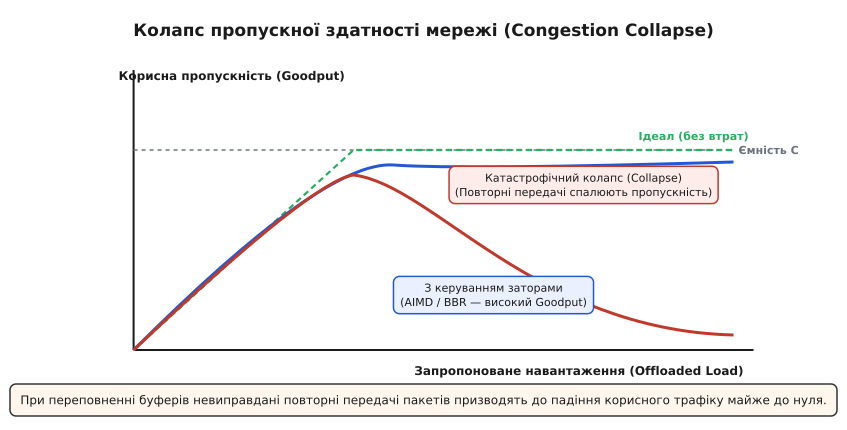
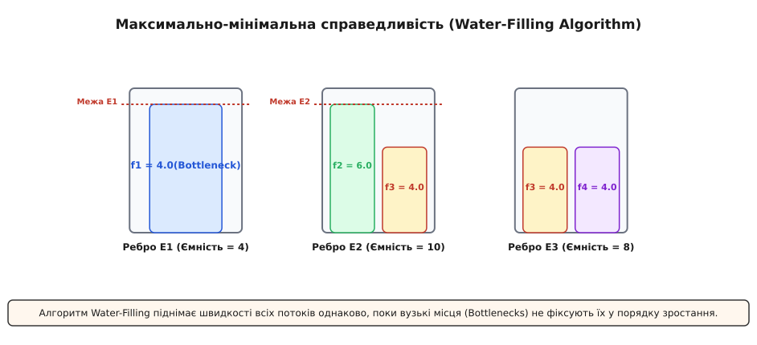
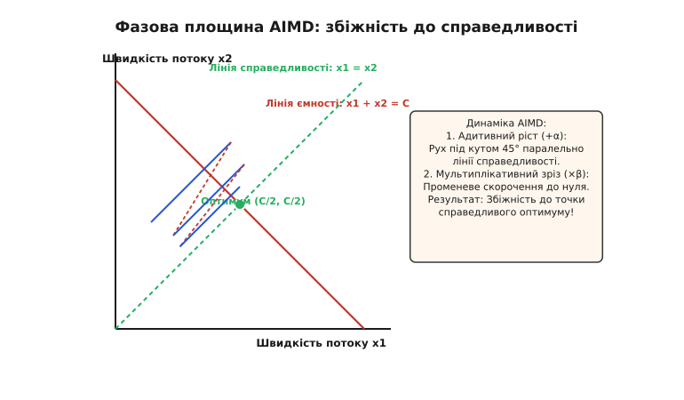
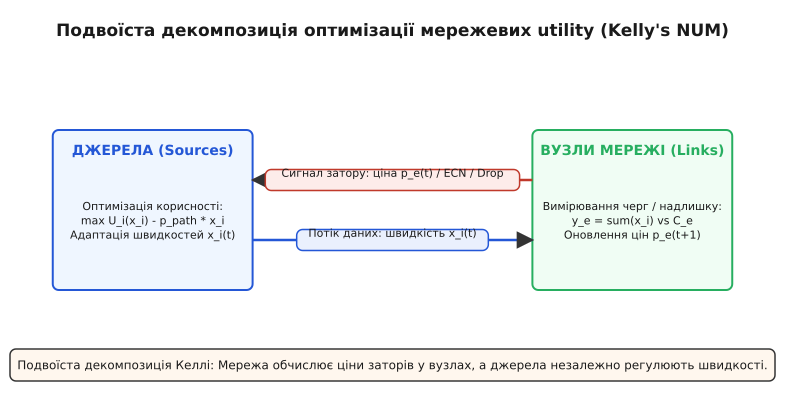
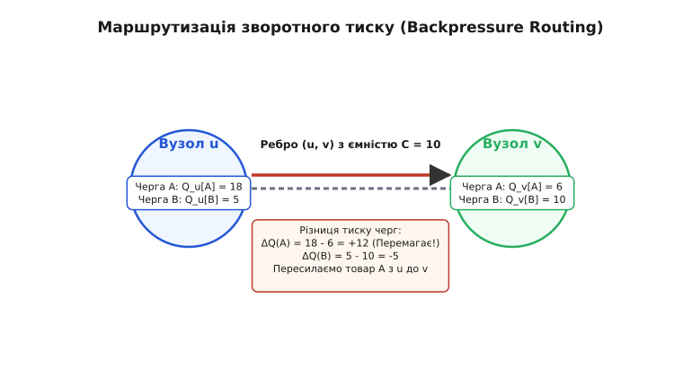

# Управління заторами в графових мережах

<preknowlist>
- [Алгоритм Дейкстри](root:sf-algorithms/dijkstra) — найкоротші шляхи у зваженому графі та маршрутизація.
- [Математичний аналіз](root:math-analysis/derivative) — градієнтний спуск та подвоїстість Лагранжа.
</preknowlist>

У мережевому графі з п'яти маршрутизаторів із пропускною здатністю ребер 10 Гбіт/с сплеск трафіку від 100 джерел зі швидкістю 200 Мбіт/с кожне викликає вичерпання буферів шлюзів за 15 мікросекунд. Без механізму координації швидкостей відправників черги переповнюються, маршрутизатори відкидають 45% пакетів, а повторні передачі втрачених даних призводять до падіння корисної пропускної здатності (Goodput) майже до нуля.

Проблема заторів (Congestion) є фундаментальним наслідком обмеженості ресурсів у будь-якій розподіленій мережевій системі: пропускної здатності каналів зв'язку, розміру буферної пам'яті вузлів та обчислювальної потужності комутаторів. На відміну від контролю потоку (Flow Control), який захищає один конкретний приймач від переповнення його власного буфера повільнішим процесором, управління заторами (Congestion Control) захищає **усю мережеву інфраструктуру** від колективного перевантаження спільно використовуваних ребер графа.

---

## 1. Природа заторів: конфлікт ресурсів та заторний колапс

Кожен маршрутизатор у графі виконує роль комутаційного вузла з кінцевою ємністю буферів черг. Коли сумарна швидкість вхідного трафіку `∑ x[i]` на ребрі `e` перевищує його фізичну пропускну здатність `C[e]`, утворений надлишок пакетів накопичується у буфері.

Затримка пакета складається з чотирьох компонентів:
```
T_total = T_prop + T_proc + T_trans + T_queue
```
де `T_prop` — затримка поширення сигналу в середовищі, `T_proc` — час обробки заголовка процесором, `T_trans = L / C` — час передачі пакета довжиною `L` у канал із ємністю `C`, а `T_queue` — затримка перебування у черзі.

Коли навантаження на ребро наближається до його ємності (`ρ = ∑ x[i] / C → 1`), за теорією масового обслуговування (модель M/M/1) середня затримка у черзі зростає за гіперболічним законом:
```
T_queue = 1 / (C - ∑ x[i])
```

При `ρ ≥ 1` довжина черги прямує до нескінченності, буфер повністю заповнюється, і маршрутизатор змушений відкидати кожний наступний пакет (Drop-tail policy).


*Колапс пропускної здатності: при переповненні буферів невиправдані повторні передачі пакетів призводять до падіння корисного трафіку майже до нуля.*

Якщо джерела не отримують зворотного зв'язку про стан заторів і продовжують надсилати пакети з попередньою швидкістю, виникає ефект повторного вичерпання таймерів підтвердження (RTT timeout). Відправники вважають втрачені пакети недоставленими і ґенерують їх повторні копії. Мережа потрапляє у стан катастрофічного заторного колапсу (Congestion Collapse): магістральні канали заповнюються дублікатами пакетів, які знову відкидаються на наступних вузлах, і реальна корисна робота мережі прямує до нуля. Для глибшого розуміння того, як ця катастрофа паралізувала протокол TCP у перших мережах, перегляньте [історію заторного колапсу ARPANET](root:com-transport/congestion-control/hist-congestion-control.md).

### Диференціація продуктивності: Throughput, Offering Load та Goodput

При аналізі систем управління заторами слід суворо розрізняти три показники продуктивності:
- **Запропоноване навантаження (Offered Load, `λ`):** сумарна швидкість ґенерування трафіку прикладною програмою джерела (включаючи як первинні пакети, так і повторні передачі).
- **Системна пропускна здатність (Throughput, `γ_raw`):** сумарний обсяг байтів на секунду, що фізично пройшов через вихідний інтерфейс мережі.
- **Корисна пропускна здатність (Goodput, `γ_good`):** швидкість доставки **унікальних корисних даних**, успішно отриманих і підтверджених цільовою програмою.

У незатиснутій мережі (`λ < C`) Goodput зростає пропорційно навантаженню `γ_good ≈ λ`. При досягненні насичення (`λ ≈ C`) у разі відсутності управління заторами Goodput катастрофічно падає до нуля (`γ_good → 0`), оскільки Throughput заповнюється на 99% повторними передачами відкинутих даних. Мета будь-якого алгоритму управління заторами — підтримувати `γ_good ≈ C` при довільному навантаженні `λ ≥ C`.

---

## 2. Класифікація підходів до управління заторами

Алгоритми управління заторами діляться за двома основними вимірами: місце прийняття рішення та спосіб сигналізації.

```
                    Управління заторами у графах
                                 │
         ┌───────────────────────┴───────────────────────┐
         ▼                                               ▼
  Open-loop (Без зворотного зв'язку)              Closed-loop (Зі зворотним зв'язком)
  • Traffic Shaping (Token Bucket)               │
  • Traffic Policing (Leaky Bucket)              ├───────────────────────┐
  • Admission Control                            ▼                       ▼
                                           End-to-end               Hop-by-hop
                                           • Loss-based (AIMD)      • Backpressure Routing
                                           • Delay-based (Vegas)    • Credit-based flow
                                           • Bandwidth-based (BBR)  • Explicit Congestion (ECN)
```

### Відкритий контур (Open-loop Control)

Алгоритми відкритого контуру запобігають виникненню заторів заздалегідь без постійного моніторингу поточного стану мережі. Основні механізми:
- **Traffic Shaping (Формування трафіку):** згладжування сплесків трафіку на вході у мережу за допомогою буферної черги. Алгоритм Token Bucket акумулює жетони з фіксованою швидкістю `CIR`, дозволяючи передачу лише при наявності жетонів. Для детальної специфікації структур даних і реалізації перегляньте [специфікацію інтерфейсу Token Bucket Shaper API](root:com-transport/congestion-control/api-traffic-shaper.md).
- **Traffic Policing (Обмеження трафіку):** жорстке відкидання або перемаркування пакетів, що перевищують встановлену швидкість, без їх затримання у буфері.
- **Admission Control (Контроль допуску):** резервування ресурсів уздовж маршруту до початку передачі (наприклад, у протоколі RSVP). Якщо мережа не може гарантувати потрібну пропускну здатність, новий потік відхиляється.

### Закритий контур (Closed-loop Control)

Алгоритми закритого контуру динамічно адаптують швидкість джерел `x[i](t)` на основі сигналів зворотного зв'язку про стан заторів у вузлах графа.

За способом передачі сигналу зворотний зв'язок буває:
1. **Неявним (Implicit Feedback):** джерело самостійно виявляє затор за непрямими ознаками — втратою пакетів (Drop-based) або зростанням кругового часу затримки RTT (Delay-based).
2. **Явним (Explicit Feedback):** маршрутизатори графа активують спеціальні прапорці у заголовках пакетів (Explicit Congestion Notification, ECN) або надсилають керуючі пакети (ICMP Source Quench, DECbit) із зазначенням конкретної ціни затору.

---

## 3. Справедливість розподілу ресурсів: Max-Min Fairness

При наявності багатьох джерел трафіку, що претендують на спільні ребра графа, постає задача визначення "справедливого" розподілу пропускної здатності.

### Концепція Max-Min Fairness

Розподіл швидкостей `x = (x[1], x[2], ..., x[N])` є **максимально-мінімально справедливим (Max-Min Fair)**, якщо неможливо збільшити швидкість будь-якого потоку `x[i]` без одночасного зменшення швидкості іншого потоку `x[j]`, який вже має меншу або рівну швидкість (`x[j] ≤ x[i]`).


*Максимально-мінімальна справедливість (Water-Filling): алгоритм піднімає швидкості всіх потоків однаково, поки вузькі місця не фіксують їх.*

Для обчислення такого розподілу використовується алгоритм Water-Filling ("заповнення водойми"):
1. Усі потоки починають зростати з однаковою швидкістю `λ`.
2. Коли одне з ребер `e` досягає своєї межі ємності (`∑ x[i] = C[e]`), воно стає **вузьким місцем (Bottleneck Link)**.
3. Швидкості всіх потоків, що проходять через це ребро, фіксуються.
4. Решта вільних потоків продовжують піднімати свою швидкість до досягнення наступних вузьких місць.

Детальні формальні докази та покроковий розрахунок для складного графа дивіться у [математичній моделі Max-Min Fairness та Water-Filling](root:com-transport/congestion-control/math-maxmin.md).

---

## 4. Динаміка управління вікном на джерелах: Алгоритм AIMD

Більшість транспортних протоколів (зокрема TCP) використовують механізм ковзного вікна заторів (Congestion Window, `cwnd`). Швидкість відправника визначається як `x = cwnd / RTT`.

### Принцип AIMD (Additive Increase Multiplicative Decrease)

Алгоритм AIMD забезпечує збіжність до справедливого оптимуму за допомогою двох правил:
1. **Адитивне збільшення (Additive Increase):** при кожному успішно отриманому підтвердженні ACK без ознак затору вікно зростає лінійно:
   ```
   cwnd := cwnd + α  (де α = 1 MSS за оборотний час RTT)
   ```
2. **Мультиплікативне зменшення (Multiplicative Decrease):** при виявленні сигналу затору (втрата пакета або ECN) вікно скорочується у фіксовану кількість разів:
   ```
   cwnd := cwnd · β  (де β = 0.5 у TCP Reno або β = 0.7 у CUBIC)
   ```


*Фазова площина AIMD: адитивний приріст і мультиплікативне скорочення забезпечують збіжність до точки справедливості.*

У фазовому просторі швидкостей двох потоків `(x[1], x[2])` вектор адитивного збільшення рухається паралельно лінії справедливості `x[1] = x[2]` під кутом 45 градусів. Вектор мультиплікативного зменшення спрямований строго до початку координат `(0, 0)`. Послідовне чергування цих двох кроків створює пилоподібний цикл, який з кожною ітерацією наближає стан системи до точки перетину лінії ємності `x[1] + x[2] = C` та лінії справедливості `x[1] = x[2]`.

### Покроковий розбір фаз роботи класичного TCP

```
       cwnd ▲
            │                                             /│ /│
            │                                            / │/ │
            │                                           /  │  │ (Congestion Avoidance: +1 MSS/RTT)
            │                                          /   │  │
   ssthresh ├─ ─ ─ ─ ─ ─ ─ ─ ─ ─ ─ ─ ─ ─ ─ ─ ─ ─ ─ ─ /     │  │
            │                             /│        /      │  │
            │                            / │       /       │  │ (Multiplicative Decrease: -50%)
            │                           /  │      /        │  │
            │                          /   │     /         │  │
            │                         /    │    /          │  │
            │   (Slow Start)         /     │   /           │  │
            │   (Експоненційний   /      │  /            │  │
            │    ріст: ×2/RTT)     /       │ /             │  │
            └─────────────────────┴────────┴───────────────┴──┴────────► час
```

1. **Slow Start (Повільний старт):** на початку з'єднання `cwnd = 1 MSS`. З кожним отриманим ACK вікно збільшується на 1 MSS, що призводить до експоненційного подвоєння `cwnd` за кожен RTT. Мета — швидко прозондувати вільну ємність каналу.
2. **Congestion Avoidance (Уникнення заторів):** коли `cwnd` досягає порогу `ssthresh` (Slow Start Threshold), експоненційний ріст перемикається на лінійний (по 1 MSS за RTT).
3. **Fast Retransmit / Fast Recovery (Швидка повторна передача та відновлення):** при отриманні трьох дубльованих ACK відправник не чекає вичерпання RTO, а негайно пересилає вказаний пакет, зменшує `ssthresh = cwnd / 2`, встановлює `cwnd = ssthresh` і продовжує лінійний ріст без повернення до Slow Start.

### Алгоритм Якобсона-Карельса для оцінювання RTO

Надійне управління заторами вимагає надзвичайно точного вимірювання затримки RTT для запобігання передчасним повторним передачам. У 1988 році Ван Якобсон запропонував алгоритм адаптивного оцінювання RTO на основі двох змінних: зваженого середнього `SRTT` та зваженого відхилення `RTTVAR`.

```
  1. Обчислення помилки вимірювання (Err):
     Err = RTT_sample - SRTT

  2. Оновлення зваженого середнього RTT:
     SRTT := SRTT + g · Err              (де g = 1/8)

  3. Оновлення зваженого середнього абсолютного відхилення:
     RTTVAR := RTTVAR + h · ( |Err| - RTTVAR )  (де h = 1/4)

  4. Розрахунок підсумкового таймера повторної передачі (RTO):
     RTO = SRTT + 4 · RTTVAR
```

Якщо під час передачі стається вичерпання таймера RTO, алгоритм Карна (Karn's Algorithm) забороняє використовувати виміряне значення RTT для повторно переданого пакета (оскільки невідомо, на який саме з двох пакетів прийшов ACK) і застосовує експоненційний відкат таймера: `RTO := 2 · RTO`.

---

## 5. Двоїстість мережі: Теорема Келлі та Network Utility Maximization (NUM)

У 1998 році Френк Келлі довів, що управління заторами у графових мережах можна розглядати як розподілений розв'язок математичної задачі оптимізації глобальної корисності.


*Подвоїста декомпозиція Келлі: мережа обчислює ціни заторів у вузлах, а джерела незалежно регулюють швидкості.*

Мережа розглядається як дводольний граф, де джерела `i ∈ {1, ..., N}` оптимізують власну корисність `U[i](x[i])`, а ребра `e ∈ E` контролюють свої пропускні здатності `C[e]`.

Глобальна задача Network Utility Maximization (NUM):
```
  max_{x ≥ 0}  ∑_{i=1}^N U[i](x[i])
  s.t.         ∑_{i: e ∈ R[i]} x[i] ≤ C[e]  для всіх e ∈ E
```

Використовуючи метод подвоїстої декомпозиції Лагранжа, ціна затору `p[e]` на кожному ребрі виступає як множник Лагранжа.
- **Маршрутизатори** обчислюють поточну ціну затору `p[e]` за динамічним рівнянням:
  ```
  p[e](t + 1) = max( 0,  p[e](t) + γ · ( ∑_{i: e ∈ R[i]} x[i](t) - C[e] ) )
  ```
- **Джерела** обчислюють сумарну ціну свого маршруту `q[i] = ∑_{e ∈ R[i]} p[e]` і встановлюють оптимальну швидкість:
  ```
  x[i]*(q[i]) = (U'[i])^{-1} ( q[i] )
  ```

Ця модель доводить, що заторний сигнал у мережі — це не просто випадкова втрата пакета, а **тіньова ціна (Shadow Price)** ресурсу в математичній задачі випуклого програмування.

---

## 6. Динамічна маршрутизація з урахуванням заторів: Backpressure Routing

Класичні алгоритми маршрутизації (такі як алгоритм Дейкстри або Bellman-Ford) обирають шляхи на основі статичних або поволі змінюваних ваг ребер. Однак у мобільних, бездротових та високонавантажених графових мережах такий підхід призводить до локальних перевантажень окремих вузлів при наявності вільних обхідних шляхів.


*Маршрутизація зворотного тиску: вибір напрямку передачі пакетів спирається на найбільший перепад тиску черг між сусідніми вузлами.*

Алгоритм зворотного тиску (Backpressure Routing), розроблений Тассіуласом та Ефімідесом (1992), виконує сумісне планування та маршрутизацію трафіку без знання матриці навантаження:
1. Кожен вузол `u` підтримує вектор черг `Q[u][c]` для кожного призначення `c`.
2. Для кожного спрямованого ребра `(u, v)` обчислюється перепад тиску:
   ```
   W[u][v][c] = Q[u][c] - Q[v][c]
   ```
3. Ребро виділяє свою пропускну здатність для передачі того товару `c*`, який має максимальний позитивний перепад `W[u][v][c*] > 0`.

Алгоритм Backpressure є пропускно-оптимальним (Throughput-Optimal): він гарантує стабільність черг для будь-якого вхідного потоку, що лежить усередині області спроможності мережі (Capacity Region). Якщо ви бажаєте подивитися повну реалізацію симулятора цього алгоритму на C та C++, дивіться [реалізацію алгоритму Backpressure Routing у коді](root:com-transport/congestion-control/proj-backpressure-routing.md).

---

## 7. Активне управління чергами (AQM) та Explicit Congestion Notification (ECN)

Традиційний режим обробки черг у маршрутизаторах — **Drop-Tail (відкидання з хвоста)** — має дві серйозні вади:
- **Lock-in (Блокування):** один монопольний потік може заповнити увесь буфер, позбавивши інші потоки можливості передати навіть один пакет.
- **Global Synchronization (Глобальна синхронізація):** при переповненні буфера відкидаються пакети багатьох потоків одночасно. Усі джерела одночасно скорочують свої вікна `cwnd`, мережа недовантажується, а потім вони одночасно збільшують вікна, знову викликаючи колапс.

Для розв'язання цих проблем розроблено алгоритми **активного управління чергами (Active Queue Management, AQM)**.

```
                  Схема роботи RED (Random Early Detection)
  Ймовірність
  відкидання P
       ▲
   1.0 ┼                                                  ┌───────
       │                                                 /│
       │                                                / │ (100% drop)
       │                                               /  │
    P_max ┼ - - - - - - - - - - - - - - - - - ┌────────    │
       │                                     /│           │
       │                                    / │           │
     0 ┼───────────────────────────────────┴──┴───────────┴────────► Середня довжина
                                         min_th  max_th             черги avg_q
```

### Алгоритм RED (Random Early Detection)

RED обчислює експоненційно зважену середню довжину черги `avg_q = (1 - w) · avg_q + w · q_current`.
- Якщо `avg_q < min_th`: пакети приймаються без обмежень.
- Якщо `min_th ≤ avg_q ≤ max_th`: кожен пакет відкидається (або маркується прапорцем ECN) із ймовірністю `P`, яка лінійно зростає від `0` до `P_max`.
- Якщо `avg_q > max_th`: усі нові пакети відкидаються (100% drop).

Раннє рандомізоване відкидання пакетів запобігає глобальній синхронізації, оскільки сповіщає окремі джерела про наближення затору до того, як буфер повністю вичерпається.

### Проблема Bufferbloat та сучасні дисципліни черг (CoDel, FQ-CoDel, CAKE)

Подешевшання RAM-пам'яті у 2000-х роках призвело до того, що виробники мережевого обладнання почали встановлювати гігабайтні буфери у маршутизатори для виключення втрати пакетів. Виник аномальний феномен **Bufferbloat (набухання буферів)**: затримка у чергах зростала до кількох секунд, оскільки loss-based алгоритми TCP заповнювали гігантські буфери до відмови. Пакети затримувалися на тривалий час, але не відкидалися, через що таймери заторів не спрацьовували.

Для боротьби з Bufferbloat розроблено сучасні алгоритми AQM:
- **CoDel (Controlled Delay):** замість довжини черги у байтах CoDel вимірює мінімальний час перебування пакета у буфері (`Sojourn Time`). Якщо затримка перевищує 5 мс протягом 100 мс, CoDel починає відкидати пакети з інтервалами `Control_Interval / √count`.
- **FQ-CoDel (Fair Queueing CoDel):** поєднує вирівнювання затоків через хешування за 5-tuple (Fair Queueing) із CoDel AQM. Це гарантує найнижчу затримку для інтерактивного трафіку (VoIP, ігри, DNS) при наявності паралельних масивних завантажень.
- **ECN (Explicit Congestion Notification, RFC 3168):** маршрутизатор маркує 2 біти у заголовку IP (`11 = Congestion Encountered`). Приймач повертає цю інформацію прапорцем `ECE` у TCP ACK, інформуючи джерело про необхідність скоротити `cwnd` без відкидання пакетів.

---

## 8. Сучасні алгоритми управління заторами: BBR, DCTCP та RoCEv2

Класичні loss-based алгоритми (TCP Reno, CUBIC) припускають, що втрата пакета є вердиктною ознакою затору. Однак у сучасних швидкісних мережах із гігантськими буферами (Bufferbloat) або у бездротових мережах із випадковими радіозавадами це припущення ломається:
- При Bufferbloat loss-based алгоритми заповнюють буфери до кількох гігабайт, створюючи затримки у сотні мікросекунд без втрати пакетів.
- У бездротових мережах втрата пакета через заваду приймається за затор, змушуючи TCP безпідставно скидати швидкість у 2 рази.

```
                         Модель BBR (Bottleneck Bandwidth and RTT)
      Затримка RTT ▲
                   │                                         / (Зона заповнення буферів: Bufferbloat)
                   │                                        /
          RTprop   ┼───────────────────────────────┐───────/
                   │  (Зона без заторів)           │
                   └───────────────────────────────┴───────────────► Розмір буфера у мережі (BDP)
      Пропускність ▲                                Врожай BDP
         BtleBw    ┼───────────────────────────────┐
                   │                              /│ (Насичення пропускної здатності)
                   │                             / │
                   └────────────────────────────┴──┴──────────────► Вхідний трафік
                                                ▲
                                      Точка оптимуму BBR
```

### Алгоритм BBR (Bottleneck Bandwidth and RTT)

Розроблений компанією Google у 2016 році, BBR керується не втратами і не довжиною черги, а безпосереднім вимірюванням двох фізичних параметрів каналу:
1. **Максимальної пропускної здатності вузького місця (`BtleBw`):** вимірюється як максимальний Goodput за вікном спостереження.
2. **Мінімальної затримки кругового обігу (`RTprop`):** вимірюється як мінімальний RTT при порожніх чергах.

BBR розраховує оптимальний обсяг даних у дорозі (Bandwidth-Delay Product, BDP):
```
BDP = BtleBw · RTprop
```

BBR підтримує розмір вікна `cwnd ≈ BDP`, відправляючи трафік із розрахунковою швидкістю `Pacing Rate = BtleBw`. Це дозволяє максимізувати пропускну здатність при найменшій можливій затримці без заповнення буферів маршрутизаторів.

### Затори у дата-центрах: DCTCP та DCQCN для RoCEv2

У дата-центрах із низькою затримкою (Round-Trip Time < 10 мікросекунд) і високими швидкостями 100/400 Гбіт/с виникає проблема **Incast Congestion**: коли сотні серверів-воркерів одночасно відповідають агрегатору на один запит, короткочасний сплеск трафіку переповнює маленькі буфери комутаторів за мікросекунди.

- **DCTCP (Data Center TCP):** використовує пропорційне оцінювання частки ECN-позначок `α`. Замість скидання вікна на 50%, DCTCP зменшує `cwnd` на величину `cwnd := cwnd · (1 - α / 2)`. При малому заторі (`α → 0`) вікно зменшується лише на пару відсотків.
- **DCQCN (Data Center Quantized Congestion Notification):** протокол управління заторами для безвтратних мереж RoCEv2 (RDMA over Converged Ethernet). Об'єднує сигналізацію ECN на рівнях L2/L3 із апаратним обмеженням швидкості на адаптерах NIC, запобігаючи генерації кадрів паузи PFC (Priority Flow Control) та їх поширенню мережею (PFC Deadlock / Head-of-Line Blocking).

---

## 9. Порівняльний аналіз алгоритмів управління заторами

| Алгоритм | Тип сигналу | Реакція на втрату пакету | Справедливість | Сфера застосування |
| :--- | :--- | :--- | :--- | :--- |
| **TCP Reno** | Loss-based | Зменшення `cwnd` на 50% | AIMD (α=1, β=0.5) | Класичні мережі TCP/IP |
| **TCP CUBIC** | Loss-based | Кубічна функція часу від втрати | Пропорційна CUBIC | ОС Linux/Windows за замовчуванням |
| **TCP Vegas** | Delay-based | Зменшення при зростанні RTT | Пропорційна | Локальні та корпоративні мережі |
| **BBR** | Model-based | Ігнорує поодинокі втрати | Max-Min (BDP pacing) | Центри обробки даних, Google, YouTube |
| **DCQCN / RoCEv2** | ECN + PFC | Швидке мультиплікативне скорочення | Hop-by-hop + End-to-end | Високонавантажені RDMA мережі ЦОД |
| **Backpressure** | Queue Differential | Маршрутизація за градієнтом тиску | Max-Min Throughput | Бездротові mesh-мережі, сенсори |

---

> 🔧 **Навіщо це.**
> Знання механізмів управління заторами є критичним при проектуванні високонавантажених розподілених систем, мікросервісних архітектур та мереж передачі даних:
> - **Усунення Cascading Failures у мікросервісах:** під час сплеску запитів без регулювання швидкостей (Rate Limiting / Circuit Breaker) черги сервісів переповнюються, викликаючи тайм-аути та лавиноподібний колапс усієї системи.
> - **Налаштування мережевого стека Linux (`sysctl`):** вибір алгоритму заторів (`net.ipv4.tcp_congestion_control = bbr`) та дисципліни черг (`net.core.default_qdisc = fq_codel`) дозволяє знизити мережеві затримки (latency) у 5–10 разів на навантажених веб-серверах.
> - **Розробка протоколів ЦОД (RDMA over Converged Ethernet — RoCEv2):** у мережах сучасних суперкомп'ютерів та кластерів штучного інтелекту затори викличуть вичерпання пам'яті графічних прискорювачів (GPU). Застосування комбінації ECN та Priority-Based Flow Control (PFC) забезпечує передачу трафіку без жодної втрати пакетів (Lossless Ethernet).
