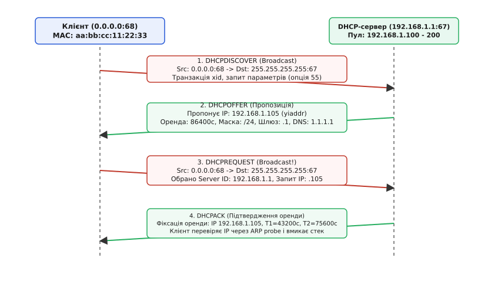
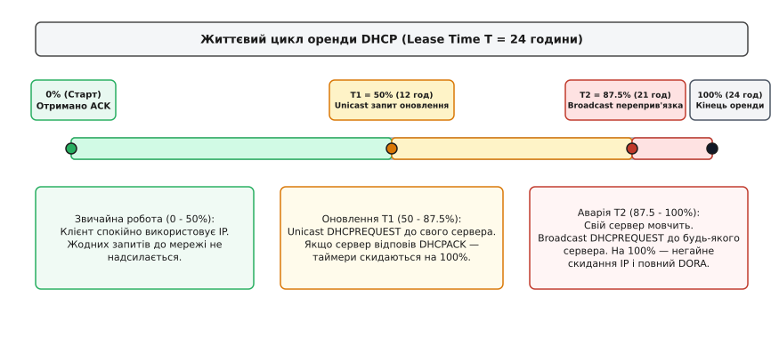
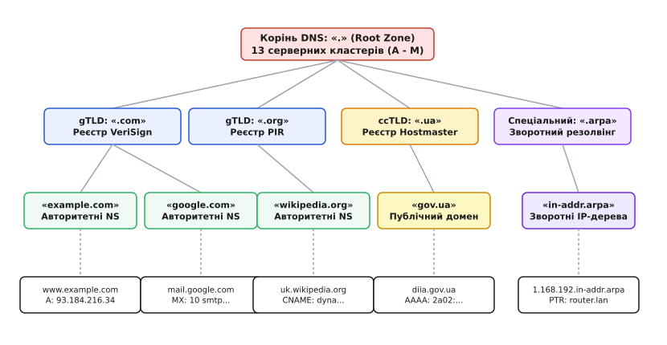
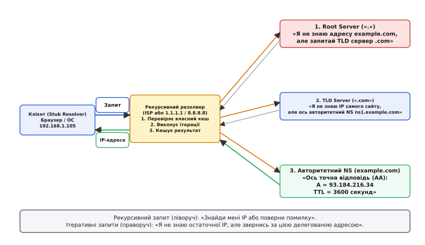
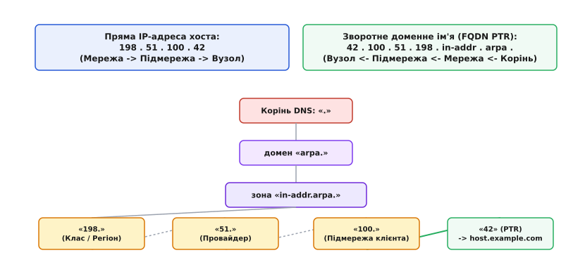

# DHCP і DNS: автоконфігурація та резолвінг у мережах IP

<preknowlist>
- [MAC, IP і ARP](topic:com-transport/mac-ip-arp) — відмінність між апаратною MAC-адресою та ієрархічною IP-адресою, роль протоколу ARP у локальному сегменті.
- [TCP проти UDP](topic:com-transport/tcp-vs-udp) — дейтаграмна модель передачі даних без встановлення з'єднання на портах.
- [Маршрутизація](topic:com-transport/ip-routing) — вибір шлюзу за замовчуванням для передачі пакетів за межі локальної підмережі.
</preknowlist>

Коли мережевий кабель підключається до порту комутатора або радіомодуль Wi-Fi завершує асоціацію з точкою доступу, фізичний і канальний рівні зв'язку вже функціонують, проте пристрій лишається повністю ізольованим від протоколу IP. У нього немає власної IP-адреси для відправки й прийому пакетів, немає маски підмережі для визначення меж локального сегмента, немає адреси маршрутизатора за замовчуванням для виходу в глобальну мережу і немає адреси DNS-сервера для перекладу імен на кшталт `example.com` у двійкові координати хостів. Ручне прописування цих параметрів на кожному смартфоні, ноутбуці чи мікроконтролері призводить до адресних конфліктів, адміністративного колапсу та повної непрацездатності мережі при зміні її топології.

Для автоматизації цього процесу в сучасних мережах співпрацюють дві фундаментальні служби: **DHCP** (англ. *Dynamic Host Configuration Protocol* — «протокол динамічної конфігурації хоста»), що автоматично виділяє вузлу всі параметри мережевого стека, та **DNS** (англ. *Domain Name System* — «система доменних імен»), що забезпечує глобальну розподілену трансляцію символьних назв у числові адреси.

---

## 1. Проблема чистого аркуша: початкова конфігурація без адреси

Початковий стан пристрою, що щойно підключився до мережі, створює очевидний замкнений парадокс: щоб надіслати IP-пакет, пристрій уже повинен мати власну IP-адресу джерела, знати маску підмережі та адресу цільового сервера. Проте на момент увімкнення інтерфейс знає лише власну 48-бітну заводську MAC-адресу, зашиту в апаратуру виробником.

Звідси випливає перша фундаментальна інженерна вимога: процедура автоконфігурації повинна працювати **без попереднього налаштування протоколу IP** і **без встановлення надійного транспортного з'єднання TCP**. Використати протокол TCP на етапі ініціалізації неможливо: триетапне рукостискання TCP вимагає наявності чітко визначеної IP-адреси відправника, обміну сегментами `SYN` / `SYN-ACK` та попереднього розв'язання адрес через ARP.

Тому служба DHCP будується поверх дейтаграмного протоколу **UDP** (англ. *User Datagram Protocol*) з використанням двох виділених номерів портів:
- **Порт 67 (`bootps`):** порт, на якому сервер або ретранслятор слухає вхідні запити від клієнтів.
- **Порт 68 (`bootpc`):** порт, на якому клієнт слухає відповіді від сервера.

> 🔧 **Навіщо розділяти порти UDP на 67 та 68.** Якби клієнт і сервер слухали один і той самий номер порту (наприклад, 67), кожен широкомовний пакет, відправлений одним клієнтом у пошуках сервера, змушував би операційні системи всіх інших клієнтів у цьому ж кабельному сегменті прокидатися, підіймати пакет по стеку до прикладного рівня та марно обробляти чужі запити. Розділення портів дозволяє мережевим стекам клієнтів повністю ігнорувати клієнтські широкомовні запити, реагуючи виключно на повідомлення, надіслані сервером на порт 68.

Клієнт використовує спеціальну службову адресу джерела `0.0.0.0` (невизначена адреса хоста) та адресу призначення обмеженого канального широкомовлення `255.255.255.255`. На канальному рівні Ethernet такий пакет запаковується в кадр із широкомовною MAC-адресою призначення `FF:FF:FF:FF:FF:FF`, що дозволяє доставити його всім активним пристроям у межах поточного L2-сегмента.

---

## 2. Протокол DORA: чотири фази узгодження оренди

Процес отримання параметрів за стандартом RFC 2131 складається з чотирьох послідовних кроків, які утворюють акронім **DORA**: **D**iscover (Виявлення), **O**ffer (Пропозиція), **R**equest (Запит), **A**cknowledge (Підтвердження).


*Повний цикл отримання мережевих параметрів за протоколом DHCP DORA: від широкомовного пошуку (Discover) через пропозицію (Offer) та вибір сервера (Request) до остаточного підтвердження оренди (Ack) і перевірки конфліктів через ARP.*

### Крок 1: DHCPDISCOVER (Виявлення серверів)
Клієнт формує пакет `DHCPDISCOVER`, у якому вказує:
- IP-адресу джерела `0.0.0.0:68` та адресу призначення `255.255.255.255:67`.
- Власну апаратну адресу в полі `chaddr` (Client Hardware Address, наприклад `aa:bb:cc:11:22:33`).
- 32-бітний псевдовипадковий ідентифікатор транзакції `xid` (Transaction ID).
- Опцію 53 зі значенням `1` (`DHCPDISCOVER`).
- Опцію 55 (`Parameter Request List`), що містить перелік кодів параметрів, які потрібні клієнту (маска підмережі, шлюз, DNS-сервери, доменне ім'я).

Пакет відправляється широкомовно на всю локальну мережу.

### Крок 2: DHCPOFFER (Пропозиція конфігурації)
Кожен DHCP-сервер, що отримав `DHCPDISCOVER` і має вільні адреси у відповідному пулі, тимчасово резервує одну адресу за MAC-адресою клієнта і формує відповідь `DHCPOFFER`. У ній сервер передає:
- Поле `yiaddr` («Your IP Address» — запропонована адреса, наприклад `192.168.1.105`).
- Той самий ідентифікатор транзакції `xid`, що надійшов від клієнта.
- Опцію 54 (`Server Identifier`) — власну IP-адресу сервера (наприклад, `192.168.1.1`).
- Опцію 51 (`IP Address Lease Time`) — строк дії оренди в секундах (наприклад, 86400 с = 24 години).
- Мережеві параметри: маску підмережі (Опція 1), шлюз (Опція 3), сервери DNS (Опція 6).

Якщо в сегменті працюють два або три сервери DHCP (наприклад, для резервування), клієнт отримає декілька різних повідомлень `DHCPOFFER`.

### Крок 3: DHCPREQUEST (Вибір конфігурації)
Отримавши пропозиції, клієнт обирає одну з них (зазвичай першу, що надійшла) і формує пакет `DHCPREQUEST`.

Головна архітектурна деталь цього кроку: **пакет `DHCPREQUEST` знову відправляється широкомовно на адресу `255.255.255.255`**, а не адресно обраному серверу. Це критично необхідно через те, що інші сервери, чиї пропозиції були відхилені, також слухають цю широкомовну розсилку. Побачивши в Опції 54 (`Server Identifier`) IP-адресу чужого сервера, вони негайно знімають тимчасове резервування зі своїх запропонованих адрес і повертають їх у пул доступних ресурсів, не чекаючи вичерпання внутрішніх таймаутів.

У повідомленні `DHCPREQUEST` клієнт явно вказує:
- Опцію 50 (`Requested IP Address`): обрану адресу `192.168.1.105`.
- Опцію 54 (`Server Identifier`): адресу обраного сервера `192.168.1.1`.

### Крок 4: DHCPACK (Підтвердження оренди)
Обраний сервер фіксує запис про оренду в системній базі даних (прив'язуючи IP `192.168.1.105` до MAC `aa:bb:cc:11:22:33` на узгоджений строк) і надсилає клієнту фінальне повідомлення `DHCPACK`. Воно містить повний набір підтверджених опцій конфігурації та значення таймерів оновлення T1 і T2.

Якщо ж за час між `Offer` та `Request` запропонована адреса була помилково виділена іншому вузлу або клієнт перемістився в іншу підмережу, сервер надсилає `DHCPNAK` (Negative Acknowledge), після чого клієнт зобов'язаний негайно скинути поточний стан і перезапустити DORA з першого кроку.

### Захист від адресних колізій: ARP Probe
Отримавши `DHCPACK`, клієнт ще не має права негайно підіймати мережевий інтерфейс. Він зобов'язаний виконати перевірку на наявність конфлікту IP-адрес (Address Conflict Detection, RFC 5227).

Для цього клієнт відправляє в локальну мережу **ARP Probe** — спеціальний ARP-запит із нульовою IP-адресою джерела (`0.0.0.0`) та цільовою адресою `192.168.1.105`. Якщо на цей запит надійде хоча б одна відповідь від іншого вузла, це означає, що статично налаштований пристрій уже використовує цю адресу. У такому разі клієнт негайно надсилає серверу пакет `DHCPDECLINE` (відмова від оренди через конфлікт) і повертається до фази `DHCPDISCOVER`.

Якщо відповіді немає, клієнт надсилає **Gratuitous ARP** (оголошення власної прив'язки IP→MAC для оновлення ARP-таблиць комутаторів та сусідніх хостів) і остаточно активує мережевий інтерфейс.

Повний перелік числових кодів, бітових масок заголовка та внутрішній устрій опцій зібрано в окремому довіднику — [формати пакетів і реєстр опцій DHCP](topic:com-transport/dhcp-dns/api-dhcp-options-dns-records.md).

---

## 3. Життєвий цикл оренди: таймери T1, T2 та вивільнення

IP-адреса, видана через DHCP, ніколи не належить клієнту назавжди. Вона надається в **оренду** (англ. *lease*) на обмежений проміжок часу `T` (Lease Time). Цей механізм гарантує, що якщо комп'ютер раптово вимкнуть з розетки або винесуть за межі офісу, його IP-адреса не «зависне» назавжди, а автоматично повернеться до пулу вільних адрес після закінчення строку оренди.

Для забезпечення неперервної роботи клієнт використовує кінцевий автомат із двома внутрішніми таймерами: **T1** (Renewing) та **T2** (Rebinding).


*Часова шкала оренди IP-адреси: від початкового отримання через тихе адресне продовження на таймері T1 (50%) до аварійного широкомовного переприв'язування на таймері T2 (87.5%) та повного анулювання при вичерпанні строку (100%).*

```
Хронологія життєвого циклу оренди DHCP:

0%              50% (T1)                     87.5% (T2)             100% (T)
|-------------------|-----------------------------|---------------------|
[ Оренда активна ]  [ Unicast оновлення до свого ] [ Broadcast аварія ]  [ Скидання IP ]
[  Спокійний стан ] [      сервера (T1)          ] [  до всіх серверів ] [ Повний DORA ]
```

### Таймер T1: адресне оновлення оренди (Renewal, 50% строку)
За замовчуванням таймер T1 спрацьовує, коли минає рівно половина повної оренди (`T1 = 0.5 · T`, наприклад, через 12 годин при 24-годинній оренді).

У момент спрацювання T1 клієнт переходить у стан `RENEWING` і намагається тихо продовжити договір. Оскільки адреса сервера вже відома, клієнт **не створює зайвого широкомовного шуму**: він надсилає адресний unicast-пакет `DHCPREQUEST` безпосередньо на IP-адресу свого сервера (зазначену в `Server Identifier`), вказуючи власну поточну адресу в полі `ciaddr` (Client IP Address).

Якщо сервер доступний, він повертає `DHCPACK` із новим повним часом оренди. Усі таймери клієнта скидаються на початкові значення (відлік 100% починається заново), і пристрій продовжує працювати без жодних розривів відкритих TCP-з'єднань.

### Таймер T2: аварійне переприв'язування (Rebinding, 87.5% строку)
Якщо первинний DHCP-сервер вимкнувся, зазнав апаратної аварії або став недоступним через мережевий збій, він не відповість на запити T1. Клієнт продовжує працювати на раніше отриманій адресі, періодично повторюючи unicast-запити.

Коли спливає 87.5% (7/8) загального терміну оренди (`T2 = 0.875 · T`, наприклад, через 21 годину), клієнт переходить у стан `REBINDING`. Ситуація стає критичною: до повної втрати зв'язку лишається лише 12.5% часу.

На цьому етапі клієнт **знову звертається до широкомовлення**: він надсилає пакет `DHCPREQUEST` на адресу `255.255.255.255`. Будь-який інший працездатний DHCP-сервер у цьому сегменті, який має повноваження для цієї підмережі, може відповісти пакетом `DHCPACK`, переоформивши оренду на себе й врятувавши зв'язок хоста.

### Вичерпання строку (100%) та вивільнення (DHCPRELEASE)
Якщо до моменту настання 100% терміну оренди жоден сервер не відповів `DHCPACK`, оренда остаточно анулюється. Клієнт зобов'язаний негайно:
1. Припинити будь-яке використання призначеної IP-адреси.
2. Розірвати всі активні TCP-сесії та скинути сокети.
3. Очистити таблицю маршрутизації та налаштування DNS.
4. Перейти у стан `INIT` і почати повну процедуру `DHCPDISCOVER` з нуля.

При штатному завершенні роботи операційної системи або відключенні інтерфейсу клієнт надсилає серверу unicast-пакет `DHCPRELEASE`. Сервер негайно позначає адресу як вільну в базі даних, роблячи її доступною для інших вузлів без очікування тайм-ауту.

Про те, як ця система еволюціонувала від ручних списків і статичного протоколу BOOTP, докладно описано у вставці [історія появи BOOTP та DHCP](topic:com-transport/dhcp-dns/hist-bootp-and-hosts.md).

---

## 4. Подолання меж сегмента: DHCP Relay Agent

Оскільки запити `DHCPDISCOVER` відправляються на широкомовну адресу `255.255.255.255`, вони принципово не можуть вийти за межі поточного канального L2-сегмента: будь-який маршрутизатор за стандартом відкидає широкомовні пакети, запобігаючи виникненню глобальних широкомовних штормів.

У корпоративних мережах з сотнями віртуальних локальних мереж (VLAN) це створювало б неприйнятну проблему: довелося б встановлювати окремий фізичний або віртуальний DHCP-сервер у кожній окремій підмережі.

Для подолання цієї межі використовується механізм **DHCP Relay Agent** (ретранслятор DHCP, RFC 3046), інтегрований безпосередньо в маршрутизатори або комутатори L3 (функція `IP Helper-Address`):

```
Клієнт (VLAN 10)  ---> [Broadcast UDP 67] ---> Маршрутизатор (Relay Agent)
(немає IP)                                       | (giaddr = 192.168.10.1)
                                                 v [Unicast UDP 67]
                                            Центральний DHCP-сервер
                                            (10.0.0.50, Дата-центр)
```

### Алгоритм роботи ретранслятора
1. Маршрутизатор перехоплює широкомовний `DHCPDISCOVER` на інтерфейсі клієнтського сегмента (наприклад, `192.168.10.1` у VLAN 10).
2. Ретранслятор записує IP-адресу свого локального інтерфейсу (`192.168.10.1`) у поле заголовка **`giaddr`** (Relay Agent IP Address) і збільшує лічильник `hops` на 1.
3. Ретранслятор додає опцію 82 (`Relay Agent Information`), у якій кодує номер фізичного порту та ідентифікатор комутатора клієнта.
4. Пакет перепаковується у звичайний маршрутизований **unicast-пакет** і відправляється через корпоративну мережу на постійну IP-адресу центрального DHCP-сервера (наприклад, `10.0.0.50`).
5. Центральний сервер, прочитавши поле `giaddr = 192.168.10.1`, однозначно визначає, що клієнт знаходиться у підмережі `192.168.10.0/24`, виділяє відповідну адресу з цього пулу і повертає `DHCPOFFER` назад на IP-адресу ретранслятора.
6. Ретранслятор знімає службову опцію 82 і передає відповідь у клієнтський сегмент VLAN 10.

---

## 5. Безпека канального рівня: DHCP Snooping та підроблені сервери

У відкритих комутованих мережах Ethernet протокол DHCP має вразливість до атак типу Man-in-the-Middle через наявність **підроблених DHCP-серверів** (англ. *Rogue DHCP Servers*). Зловмисник, підключившись до вільного порту комутатора, може запустити власний DHCP-сервер, який відповідатиме на клієнтські запити `DHCPDISCOVER` швидше за легітимний сервер. У повідомленні `DHCPOFFER` зловмисник призначає власну IP-адресу як шлюз за замовчуванням (Option 3) або підроблений DNS-сервер (Option 6), отримуючи повний контроль над усім вихідним трафіком жертви.

Для нейтралізації цієї загрози на комутаторах L2 реалізується функція **DHCP Snooping**:

```
[ Легітимний DHCP ] <--- (Довірений порт / Trusted) --- [ Комутатор L2 ]
                                                              |
[ Зловмисник / Rogue ] <--X- (Недовірений порт: Блокує DHCPOFFER) -+
                                                              |
[ Звичайний клієнт ] <--- (Недовірений порт: Дозволяє DISCOVER) -+
```

### Принцип роботи DHCP Snooping
1. Адміністратор комутатора позначає порти, що ведуть до легітимних серверів або маршрутизаторів, як **довірені** (англ. *Trusted*), а всі користувацькі порти — як **недовірені** (англ. *Untrusted*).
2. Комутатор інспектує кожен DHCP-пакет на апаратному рівні ASIC. Якщо на недовіреному порту з'являється повідомлення від сервера (`DHCPOFFER`, `DHCPACK`, `DHCPNAK`), комутатор негайно скидає такий пакет і блокує порт.
3. Комутатор динамічно формує та підтримує в пам'яті базу даних прив'язок (**DHCP Snooping Binding Database**), у якій фіксуються четвірки: `[MAC-адреса, виділена IP-адреса, номер VLAN, фізичний порт, строк оренди]`.
4. Ця база даних служить фундаментом для подальшого апаратного захисту мережі: технології **DAI** (Dynamic ARP Inspection) для запобігання отруєнню ARP-кешу та **IP Source Guard** для блокування пакетів із підробленими IP-адресами джерела.

Крім того, комутатор обмежує швидкість надходження запитів `DHCPDISCOVER` (Rate Limiting) на недовірених портах, що захищає сервер від атаки **DHCP Starvation** (вичерпання адресного простору шквалом підроблених запитів із випадковими MAC-адресами).

---

## 6. Від числових адрес до людських імен: ієрархія DNS

Після завершення DORA пристрій володіє повним мережевим стеком, проте програми оперують не двійковими адресами, а символьними назвами (`wikipedia.org`, `diia.gov.ua`). Мережеві маршрутизатори не розуміють текстових міток: будь-який пакет на рівні IP вимагає точної 32-бітної (IPv4) або 128-бітної (IPv6) адреси одержувача.

Цю невідповідність розв'язує **DNS** — глобальна, високомасштабована розподілена база даних, організована у вигляді перевернутого ієрархічного дерева простору імен.


*Розподілена ієрархічна структура простору доменних імен DNS: корінь делегує повноваження реєстрам доменів верхнього рівня (gTLD та ccTLD), які переадресовують запити до авторитетних серверів організацій.*

### Рівні ієрархічного дерева DNS

1. **Корінь простору імен (Root Zone, «.»):**
   Вершина дерева позначається крапкою `.` (яка зазвичай пропускається в інтерфейсах користувача, але завжди присутня в повному FQDN — Fully Qualified Domain Name). Корінь обслуговується **13 логічними серверними кластерами** (з іменами від `a.root-servers.net` до `m.root-servers.net`), якими керують 12 незалежних міжнародних організацій (ICANN, NASA, Verisign, RIPE NCC, WIDE тощо).
   Фізично це не 13 комп'ютерів, а понад 1700 географічно розподілених серверних вузлів по всій планеті, об'єднаних за допомогою технології маршрутизації **BGP Anycast**: запит користувача автоматично прямує до топологічно найближчого екземпляра кореневого сервера.

2. **Домени верхнього рівня (Top-Level Domains, TLD):**
   Розташовані безпосередньо під коренем і поділяються на дві основні групи:
   - **Загальні домени (gTLD):** `.com`, `.org`, `.net`, `.edu`, `.info` тощо. Керуються акредитованими реєстрами (наприклад, VeriSign для `.com`).
   - **Національні домени країн (ccTLD):** `.ua` (Україна), `.uk` (Велика Британія), `.de` (Німеччина). Обслуговуються національними адміністраторами (в Україні — компанією «Хостмайстер»).
   - **Спеціальні службові домени:** `.arpa` для інфраструктурних потреб (зокрема для зворотного резолвінгу).

3. **Авторитетні зони другого рівня (Second-Level Domains, SLD) та піддомени:**
   Конкретні доменні імена організацій (`example.com`, `google.com`, `gov.ua`). Права на адміністрування цих зон делегуються їхнім власникам за допомогою записів типу `NS`. Організація розгортає власні **авторитетні сервери імен** (Authoritative Name Servers), які є остаточним джерелом істини для всіх піддоменів і хостів усередині цієї зони (`www`, `mail`, `vpn`, `api`).

---

## 7. Механізм резолвінгу: рекурсія проти ітерації

Процес перетворення імені в IP-адресу базується на фундаментальному розподілі функцій між двома типами учасників: легковажним клієнтським **стаб-резолвером** (Stub Resolver) та повнофункціональним **рекурсивним резолвером** (Recursive Resolver).


*Схема виконання запиту: рекурсивний запит від клієнта до локального резолвера та послідовний ітеративний обхід ієрархії серверів від кореня до авторитетного джерела з подальшим кешуванням відповіді.*

### Рекурсивний запит клієнта (Recursion Desired, RD = 1)
Програми операційної системи (браузер, поштовий клієнт) містять найпростіший стаб-резолвер. Він не вміє самостійно обходити дерево DNS: його єдина функція — надіслати **рекурсивний запит** (з прапорцем `RD = 1`) на адресу DNS-сервера, отриману раніше по DHCP (або на публічні резолвери `1.1.1.1`, `8.8.8.8`).

Семантика рекурсивного запиту означає: «Знайди мені кінцеву IP-адресу для цього імені або поверни повідомлення про помилку; я не хочу отримувати проміжні посилання».

### Ітеративний обхід дерева резолвером
Отримавши рекурсивний запит, проміжний резолвер бере виконання всієї складної роботи на себе. Якщо шуканої відповіді немає в його локальному кеші, він запускає ланцюжок **ітеративних запитів**:

1. **Запит до кореневого сервера:**
   Резолвер звертається до одного з відомих йому кореневих серверів: «Яка IP-адреса хоста `www.example.com`?».
   Кореневий сервер не знає кінцевої адреси, але повертає **делегування (Referral)**: «Я не знаю `www.example.com`, але домен `.com` обслуговують ось такі TLD-сервери: `a.gtld-servers.net`...».

2. **Запит до TLD-сервера:**
   Резолвер звертається до TLD-сервера `.com`: «Де знайти `www.example.com`?».
   TLD-сервер повертає нове делегування: «Звернися до авторитетних серверів зони `example.com`: `ns1.example.com` (`93.184.216.34`)». Разом із цим TLD-сервер надає **склеювальні записи** (англ. *glue records*) — IP-адреси самих серверів імен, якщо їхні імена знаходяться всередині тієї самої зони.

3. **Запит до авторитетного сервера зони:**
   Резолвер запитує безпосередній авторитетний сервер `ns1.example.com`: «Яка адреса `www.example.com`?».
   Авторитетний сервер повертає остаточний запис типу `A` зі значенням `93.184.216.34`, встановленим прапорцем авторитетності `AA = 1` (Authoritative Answer) та часом життя `TTL = 3600`.

4. **Кешування та відповідь клієнту:**
   Рекурсивний резолвер зберігає отриманий результат у своєму кеші на 3600 секунд і повертає кінцеву IP-адресу клієнту. Наступні тисячі користувачів цього провайдера отримають відповідь із кешу за 1 мілісекунду без жодного звернення до кореневих серверів.

---

## 8. Типи ресурсних записів (Resource Records)

База даних DNS складається з типізованих записів, кожен з яких виконує строго визначену функцію:

```
Синтаксис запису в зоновому файлі:
<Ім'я>    <TTL>    <Клас>    <Тип>    <Дані (RDATA)>
```

### Основні типи записів DNS

| Тип | Назва | Призначення | Приклад вмісту |
| :---: | :--- | :--- | :--- |
| **`A`** | Address (IPv4) | Пряме відображення доменного імені на 32-бітну адресу IPv4. | `example.com. IN A 93.184.216.34` |
| **`AAAA`** | Address (IPv6) | Пряме відображення доменного імені на 128-бітну адресу IPv6 («quad-A»). | `example.com. IN AAAA 2606:2800:220:1:248:1893:25c8:1946` |
| **`CNAME`** | Canonical Name | Канонічний псевдонім. Вказує, що це ім'я є псевдонімом іншого доменного імені. | `www.example.com. IN CNAME example.com.` |
| **`MX`** | Mail Exchange | Сервер електронної пошти домену. Містить пріоритет (Preference) та ім'я поштового вузла. | `example.com. IN MX 10 mail.example.com.` |
| **`TXT`** | Text | Довільний текстовий рядок. Використовується для верифікації пошти (SPF, DKIM, DMARC) та доменів. | `example.com. IN TXT "v=spf1 include:_spf.google.com ~all"` |
| **`NS`** | Name Server | Вказує на авторитетний сервер імен, який обслуговує цю зону або піддомен. | `example.com. IN NS ns1.example.com.` |
| **`PTR`** | Pointer | Покажчик зворотного резолвінгу. Відображає IP-адресу у спеціальній зоні на канонічне ім'я. | `34.216.184.93.in-addr.arpa. IN PTR example.com.` |
| **`SOA`** | Start of Authority | Головний запис зони: містить ім'я первинного сервера, email адміністратора, серійний номер та системні таймери синхронізації. | `example.com. IN SOA ns1.example.com. hostmaster.example.com. (2026081801 86400 7200 3600000 300)` |

### Критичне обмеження запису CNAME
Стандарт RFC 1034 встановлює суворе правило: **якщо для доменного вузла існує запис `CNAME`, жоден інший тип запису (`A`, `MX`, `TXT`, `NS`) не може існувати для цього ж імені**.

Це пояснює, чому неможливо створити запис `CNAME` для кореня домену (вершини зони, Zone Apex, наприклад `example.com`): у вершині зони обов'язково повинні існувати записи `SOA` та `NS`. Додавання `CNAME` у корінь зруйнувало б зонну структуру. Тому `CNAME` застосовують виключно для піддоменів (`www`, `api`, `cdn`), тоді як вершина зони завжди налаштовується прямими записами `A` та `AAAA` (або за допомогою спеціальних пропрієтарних псевдозаписів ALIAS/ANAME на стороні DNS-провайдерів).

Як саме здійснюється пошук серверів конкретних служб із балансуванням за вагою та пріоритетом, розкрито в окремій статті — [записи DNS SRV і NAPTR](topic:com-transport/dns-srv-naptr).

---

## 9. Зворотний резолвінг: інверсія октетів у зоні in-addr.arpa

Прямий резолвінг (переклад «ім'я → IP») є природним, оскільки структура доменного імені вже є ієрархічною. Проте в багатьох сценаріях (діагностика мережі через `traceroute`, перевірка поштових серверів на спам через захист PTR/rDNS) виникає протилежна задача: **маючи IP-адресу, дізнатися символьне ім'я комп'ютера**.

Тут виникає інженерна дилема: у прямому імені старші рівні стоять праворуч (`com` -> `example` -> `www`), тоді як у записі IP-адреси старші мережеві октети стоять ліворуч (`198.51.100.42` = мережа `198`, підмережа `51`, хост `42`).

Щоб шукати IP-адреси за тим самим єдиним деревом DNS зверху вниз, інженери створили спеціальний домен верхнього рівня **`.in-addr.arpa`** (для IPv4) та **`.ip6.arpa`** (для IPv6), застосувавши **інверсію порядку октетів**.


*Механізм зворотного резолвінгу: пряма адреса 198.51.100.42 інвертується у доменне ім'я 42.100.51.198.in-addr.arpa для відповідності ієрархії делегування зон від кореня до запису PTR.*

### Процедура зворотного перетворення
1. Береться вихідна IP-адреса: `198.51.100.42`.
2. Порядок чотирьох десяткових октетів розгортається у зворотному напрямку: `42.100.51.198`.
3. Додається суфікс спеціальної зони: `.in-addr.arpa`.
4. Отримане ім'я `42.100.51.198.in-addr.arpa` запитується у резолвера записом типу **`PTR`** (Pointer).

Завдяки інверсії ієрархія делегування збігається з розподілом блоків адрес в Інтернеті:
- Корінь делегує зону `198.in-addr.arpa` регіональному реєстратору (RIR, наприклад RIPE або ARIN).
- Регіональний реєстратор делегує підзону `51.198.in-addr.arpa` інтернет-провайдеру (ISP).
- Провайдер делегує блок `100.51.198.in-addr.arpa` кінцевому клієнту, який на своєму сервері розміщує запис:
```
42.100.51.198.in-addr.arpa.  IN  PTR  host.example.com.
```

---

## 10. Кешування, TTL та безпека

Кешування — головний фактор, завдяки якому глобальна служба DNS витримує трильйони запитів на добу без перевантаження кореневої інфраструктури.

### Позитивне та негативне кешування
Кожен ресурсний запис містить поле **TTL** (Time-To-Live) — час у секундах, протягом якого будь-який проміжний резолвер має право зберігати й повертати цей результат без повторного опитування авторитетного джерела.
- **Позитивне кешування:** успішна відповідь `A = 93.184.216.34` із `TTL = 300` означає, що протягом 5 хвилин резолвер обслуговує всіх клієнтів локально.
- **Негативне кешування (RFC 2308):** якщо авторитетний сервер повернув відповідь `NXDomain` (домен не існує), резолвер зобов'язаний закешувати сам факт відсутності цього імені на строк, вказаний у полі `MINIMUM` запису `SOA` цієї зони. Це захищає авторитетні сервери від DoS-атак шквалом запитів до неіснуючих доменів.

### Вразливість DNS до отруєння кешу (Cache Poisoning)
Оскільки класичний обмін DNS відбувається через UDP без шифрування та аутентифікації, зловмисник може здійснити атаку отруєння кешу (атака Камінського): надіслати на резолвер фальшиву UDP-відповідь із підробленою IP-адресою цілі.

Для захисту від таких атак сучасні резолвери використовують два обов'язкових заходи:
1. **Рандомізація Transaction ID (16 бітів) та номера вихідного UDP-порту (16 бітів):** зловмисник повинен одночасно вгадати `2³² ≈ 4.3 · 10⁹` комбінацій за мілісекунди, що робить сліпе підроблення практично нездійсненним.
2. **DNSSEC (DNS Security Extensions, RFC 4033–4035):** впровадження криптографічних цифрових підписів (записи `RRSIG`, `DNSKEY`, `DS`). Резолвер перевіряє криптографічний ланцюжок довіри від самого кореня до кінцевого запису, унеможливлюючи будь-яку непомітну модифікацію відповідей.

### Динамічне оновлення DNS (Dynamic DNS / DDNS)
У корпоративних мережах DHCP та DNS об'єднуються в автоматизований контур через механізм **Dynamic DNS** (RFC 2136). Коли клієнт отримує нову IP-адресу по DHCP, передавши власне мережеве ім'я в Опції 12 (`Host Name`), DHCP-сервер автоматично надсилає криптографічно підписаний (TSIG) пакет `DNS UPDATE` на авторитетний DNS-сервер. Сервер створює прямий запис `A` (`ноутбук.corp.lan -> 192.168.1.105`) та зворотний запис `PTR`. Щойно оренда закінчується або клієнт надсилає `DHCPRELEASE`, сервер так само автоматично видаляє ці записи, забезпечуючи актуальність локальної адресної книги без участі системного адміністратора.

Як створити власний автономний резолвер на рівні системних викликів, описано у вставці [практична реалізація DNS-клієнта](topic:com-transport/dhcp-dns/proj-dns-client.md).

---

## 11. Синтез: як DHCP і DNS змикають стек мережі

DHCP і DNS утворюють цілісний конвеєр підключення пристрою до глобального Інтернету:

```
[ Кабель / Wi-Fi ] -> Асоціація на L2 (відома лише MAC)
        |
        v
[ Служба DHCP ]    -> Протокол DORA (порти UDP 67/68)
        |             Отримано: IP, Маска, Шлюз за замовчуванням, DNS-сервери
        v
[ Активація L3 ]   -> Перевірка колізій через ARP Probe -> Інтерфейс увімкнено
        |
        v
[ Служба DNS ]     -> Клієнтський стаб-резолвер звертається до отриманого DNS
        |             Ітеративний обхід: Root -> TLD -> Authoritative -> IP
        v
[ Прикладний сокет ]-> Відкриття з'єднання TCP/TLS на отриману IP-адресу
```

Без **DHCP** мережевий стек залишався б «сліпим» аркушем: кожен пристрій вимагав би трудомісткої ручної конфігурації. Без **DNS** мережа залишалася б «німою»: користувачам довелося б оперувати числовими таблицями IP-адрес. Їхня спільна автоматична робота є тією невидимою основою, яка робить підключення будь-якого комп'ютера чи гаджета до всесвітньої мережі миттєвим і безшовним.
