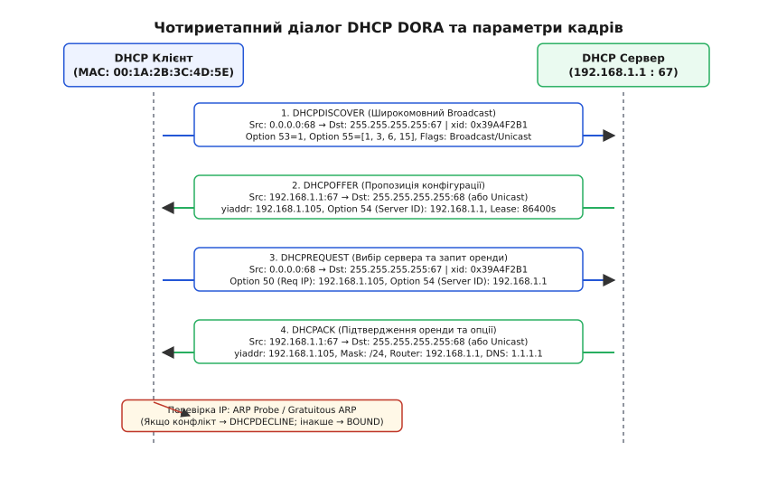
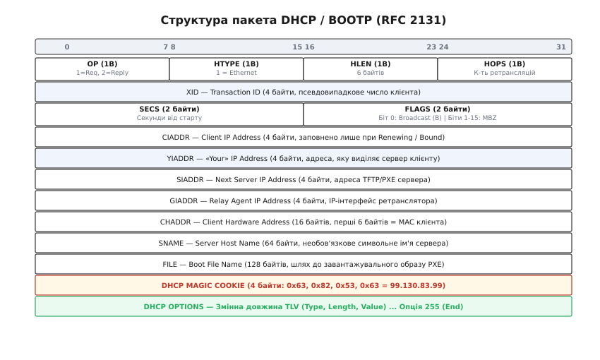
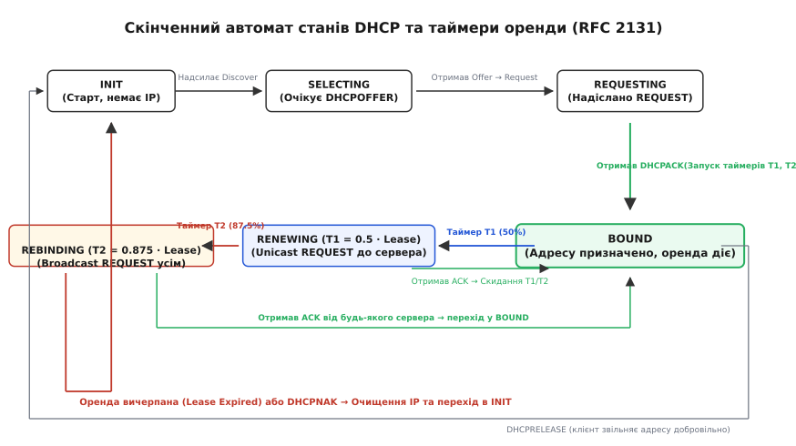
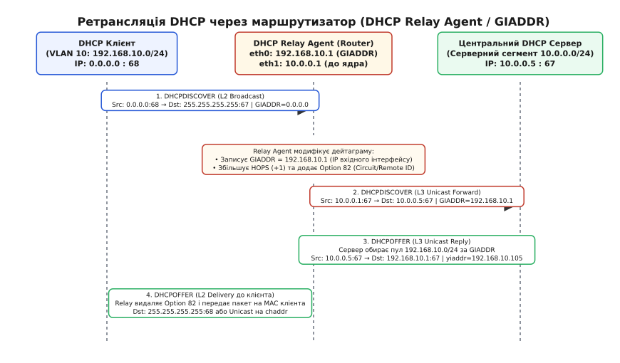
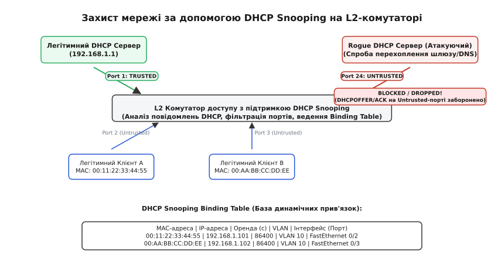

# DHCP: динамічне призначення IP-адрес

<preknowlist>
- [MAC, IP і ARP](root:com-transport/mac-ip-arp) — відмінність канальної MAC-адреси від мережевої IP-адреси та роль протоколу ARP у розв'язанні локальних адрес.
- [Канал і пакет](root:com-transport/channel-band-packet) — дейтаграми, порти та рівнева модель передачі даних у комп'ютерних мережах.
- [Маршрутизація](root:com-transport/ip-routing) — вибір шлюзу за замовчуванням для передачі пакетів за межі локальної підмережі.
- [VLAN та транкінг](root:com-transport/vlan-and-trunking) — логічне розділення доменів широкомовлення на канальному рівні.
</preknowlist>

Коли мережевий кабель підключається до гнізда RJ-45 або смартфон завершує радіочастотну асоціацію з бездротовою точкою доступу Wi-Fi, фізичний і канальний рівні зв'язку вже повністю працездатні, проте мережевий стек пристрою лишається «сліпим» і нездатним надіслати жодного корисного пакета. Пристрій не має власної IP-адреси для ідентифікації на мережевому рівні, не знає маски підмережі для визначення меж локального сегмента, не має адреси шлюзу за замовчуванням для виходу за межі власного комутатора і не володіє адресами серверів DNS для перетворення символьних доменних імен у числові координати.

Ручне прописування цих чотирьох параметрів на кожному вузлі призводить до адресних колізій, колосальних адміністративних витрат та повної неможливості обслуговування мобільних користувачів. Для розв'язання цієї проблеми створено протокол **DHCP** (англ. *Dynamic Host Configuration Protocol* — «протокол динамічної конфігурації хоста», RFC 2131 / RFC 2132), який перетворює процедуру ініціалізації вузла на повністю автоматизований, безпечний та централізовано керований процес.

---

### Проблема чистого аркуша та транспортний рівень UDP

Початковий стан вузла створює фундаментальний інженерний парадокс: щоб надіслати IP-пакет, пристрій уже повинен мати власну IP-адресу відправника, проте мета самого протоколу полягає саме в тому, щоб цю адресу отримати. На момент увімкнення єдиною відомою координатою пристрою є його 48-бітна канальна MAC-адреса, зашита у постійну пам'ять мережевого адаптера.

Із цієї невизначеності випливають три жорсткі архітектурні обмеження:

1. **Неможливість використання протоколу TCP:** Надійний транспорт TCP вимагає триетапного рукостискання (`SYN` → `SYN-ACK` → `ACK`), що принципово неможливо без чітко призначених IP-адрес обох сторін та попередньої перевірки зв'язку через ARP.
2. **Використання дейтаграм UDP:** Протокол конфігурації повинен працювати поверх легковажного протоколу UDP без встановлення з'єднання, інкапсулюючись у спеціальні широкомовні IP-дейтаграми.
3. **Розділення номерів портів (67 та 68):**
   - **Порт 67 (`bootps`):** порт, на якому сервер або агент ретрансляції слухає вхідні запити від клієнтів.
   - **Порт 68 (`bootpc`):** порт, на якому клієнт очікує відповіді від сервера.

> 🔧 **Чому порти розділено на 67 та 68.** Якби клієнт і сервер використовували один спільний порт (наприклад, 67), кожен широкомовний запит одного клієнта змушував би операційні системи сотень інших клієнтів у цьому ж L2-сегменті прокидатися від апаратного переривання мережевої карти, підіймати пакет по стеку протоколів до прикладного рівня та витрачати процесорний час на відхилення чужого запиту. Розділення портів дозволяє мережевим стекам клієнтів апаратно фільтрувати клієнтські широкомовні запити на рівні мережевого адаптера, реагуючи виключно на дейтаграми від сервера, надіслані на порт 68.

На етапі ініціалізації клієнт використовує спеціальну службову адресу джерела `0.0.0.0` (невизначений хост) та адресу призначення обмеженого канального широкомовлення `255.255.255.255`. На канальному рівні Ethernet такий пакет запаковується в кадр із широкомовною MAC-адресою призначення `FF:FF:FF:FF:FF:FF`, що забезпечує доставку повідомлення всім активним серверам у межах поточного сегмента.

Детальний історичний шлях від перших бездискових терміналів Unix та протоколів RARP і BOOTP до сучасного DHCP викладено у вставці [Еволюція протоколів конфігурації: від RARP та BOOTP до DHCP](root:com-transport/dhcp/hist-dhcp-evolution.md).

---

### Чотириетапний діалог DORA: механізм та семантика

Процес первинного отримання параметрів за стандартом RFC 2131 складається з чотирьох послідовних кроків, які утворюють акронім **DORA**: **D**iscover, **O**ffer, **R**equest, **A**cknowledge.


*Чотириетапний цикл автоконфігурації DORA: від широкомовного виявлення (Discover) через пропозицію (Offer) та вибір сервера (Request) до підтвердження оренди (Ack) і локальної перевірки конфліктів через ARP.*

#### 1. DHCPDISCOVER (Виявлення серверів)
Клієнт генерує випадкове 32-бітне число — ідентифікатор транзакції `xid` (Transaction ID) — і розсилає широкомовне повідомлення `DHCPDISCOVER`. У цьому пакеті клієнт вказує:
- Свою апаратну адресу в полі `chaddr` (Client Hardware Address, наприклад `00:1A:2B:3C:4D:5E`).
- Опцію 53 зі значенням `1` (`DHCPDISCOVER`).
- Опцію 55 (`Parameter Request List`), де перелічує коди параметрів, які йому потрібні від сервера (маска підмережі — Опція 1, маршрутизатор — Опція 3, DNS-сервери — Опція 6, доменний суфікс — Опція 15).
- За потреби — Опцію 50 (`Requested IP Address`), якщо клієнт бажає зберегти адресу, яку він мав до перезавантаження.

#### 2. DHCPOFFER (Пропозиція конфігурації)
Кожен DHCP-сервер, що отримав запит і має вільні адреси для відповідного сегмента, тимчасово резервує одну адресу з пулу та формує відповідь `DHCPOFFER`:
- У полі `yiaddr` («Your» IP Address) сервер записує запропоновану IP-адресу (наприклад, `192.168.1.105`).
- У поле `xid` копіюється той самий ідентифікатор транзакції, що надійшов від клієнта.
- У поле `chaddr` підставляється MAC-адреса клієнта.
- Додаються опції конфігурації: Опція 54 (`Server Identifier`, IP-адреса самого сервера), Опція 51 (`IP Address Lease Time`, строк дії оренди в секундах), маска, шлюз та сервери DNS.

Якщо в мережі працює кілька незалежних серверів DHCP (наприклад, для відмовостійкості), клієнт отримає кілька різних пакетів `DHCPOFFER`.

#### 3. DHCPREQUEST (Вибір сервера та запит оренди)
Отримавши пропозиції, клієнт обирає одну з них (зазвичай першу, що надійшла) і формує пакет `DHCPREQUEST`.

> ⚠️ **Чому DHCPREQUEST надсилається широкомовно.** Хоча клієнт уже обрав конкретний сервер, повідомлення `DHCPREQUEST` відправляється **широкомовно** (`255.255.255.255`). У ньому клієнт вказує Опцію 54 з IP-адресою обраного сервера та Опцію 50 з обраною IP-адресою. Цей широкомовний сигнал слугує публічним оголошенням для всієї мережі: обраний сервер розуміє, що його пропозицію прийнято, а всі інші сервери дізнаються, що їхні пропозиції відхилено, і **негайно повертають попередньо зарезервовані адреси назад у вільний пул**, запобігаючи вичерпанню адресного простору.

#### 4. DHCPACK / DHCPNAK (Підтвердження або відмова)
Обраний сервер перевіряє доступність адреси, фіксує прив'язку `MAC → IP` у своїй базі даних оренди та надсилає клієнту фінальне підтвердження `DHCPACK` з повним набором мережевих опцій.

Якщо за час узгодження сталася помилка (наприклад, адміністратор вимкнув пул або адресу було виділено іншому вузлу), сервер надсилає `DHCPNAK` (Negative Acknowledgment). Отримавши відмову, клієнт скидає всі налаштування та негайно повертається до початкової фази `DHCPDISCOVER`.

---

### Прапорець Broadcast Flag (FLAGS.B)

Особливої уваги заслуговує біт 15 у полі `flags` заголовка DHCP — прапорець **Broadcast Flag** (RFC 2131):

```text
 0                   1
 0 1 2 3 4 5 6 7 8 9 0 1 2 3 4 5
+-+-+-+-+-+-+-+-+-+-+-+-+-+-+-+-+
|B|             MBZ             |
+-+-+-+-+-+-+-+-+-+-+-+-+-+-+-+-+
```

Деякі примітивні мережеві стеки та мікропрограми мережевих карт (зокрема старі завантажувачі PXE та операційні системи без повноцінного IP-стека на етапі ініціалізації) не здатні приймати одноадресні (unicast) IP-пакети, спрямовані на адресу `yiaddr`, доки ця IP-адреса не буде офіційно призначена інтерфейсу. Якщо сервер спробує надіслати `DHCPOFFER` одноадресно, мережева карта клієнта просто скине такий кадр.

Встановлюючи біт `B = 1`, клієнт прямо наказує серверу та проміжним ретрансляторам: «Я ще не вмію приймати одноадресний трафік, надсилайте всі відповіді (`DHCPOFFER`, `DHCPACK`) виключно широкомовно на канальну адресу `FF:FF:FF:FF:FF:FF` та IP-адресу `255.255.255.255`». Сучасні операційні системи зазвичай залишають цей біт рівним `0`, дозволяючи серверу відповідати одноадресним L2-кадром прямо на MAC-адресу клієнта (`chaddr`), що суттєво знижує широкомовний шум у комутованій мережі.

---

### Перевірка конфліктів за RFC 5227 та життєві події оренди

Навіть після отримання пакета `DHCPACK` клієнт не має права миттєво активувати IP-адресу. У локальному сегменті міг з'явитися вузол зі статично налаштованою ідентичною адресою, про яку сервер не знає через вимкнений стан вузла на момент генерації пулу.

Для запобігання адресному конфлікту клієнт зобов'язаний виконати сувору процедуру виявлення конфліктів адрес IPv4 за стандартом **RFC 5227** (Address Conflict Detection, ACD):

1. **Фаза зондування (ARP Probe):** Клієнт формує спеціальний ARP-запит, де IP-адреса відправника встановлена в `0.0.0.0`, а цільова IP-адреса — це отримана адреса `yiaddr`. Клієнт відправляє `PROBE_NUM = 3` таких зондувальних запити з випадковим інтервалом від 1 до 2 секунд (`PROBE_MIN = 1s`, `PROBE_MAX = 2s`).
2. **Обробка конфлікту:** Якщо протягом інтервалу зондування надходить хоча б одна ARP-відповідь або сторонній ARP-запит з ідентичною цільовою адресою, адреса вважається зайнятою. Клієнт негайно надсилає серверу повідомлення **`DHCPDECLINE`** (Відхилення), де вказує конфліктну адресу. Сервер позначає цю адресу як пошкоджену (`BAD_ADDRESS` / `Declined`) і вилучає її з пулу роздачі на визначений адміністратором час, а клієнт перезапускає процес з кроку `DHCPDISCOVER`.
3. **Фаза оголошення (ARP Announcement):** Якщо конфліктів не виявлено, клієнт призначає адресу інтерфейсу та відправляє `ANNOUNCE_NUM = 2` безвідплатних запити Gratuitous ARP (де IP відправника та IP цілі дорівнюють новій адресі), оновлюючи ARP-таблиці всіх сусідніх комутаторів та маршрутизаторів. Після цього клієнт переходить у стан **`BOUND`** (Зв'язаний).

Крім базового циклу DORA, протокол підтримує специфічні типи повідомлень:
- **`DHCPRELEASE` (Звільнення):** Коли комп'ютер коректно вимикається або користувач виконує команду відключення мережевого адаптера, клієнт надсилає одноадресне повідомлення `DHCPRELEASE` на сервер, повертаючи орендовану адресу у вільний пул до закінчення терміну дії оренди.
- **`DHCPINFORM` (Запит опцій):** Якщо комп'ютер має статично призначену IP-адресу або отримав її через механізм автоконфігурації IPv6/VPN, йому все одно можуть бути потрібні глобальні параметри локальної мережі (список DNS-серверів, NTP-сервери часу, адреса проксі-сервера WPAD). У цьому випадку клієнт надсилає `DHCPINFORM`, а сервер відповідає пакетом `DHCPACK`, що містить виключно запропоновані опції без виділення нової IP-адреси.
- **Стан `INIT-REBOOT`:** Якщо ноутбук виходить зі стану сну або відновлює зв'язок після короткочасного розриву кабелю, він не починає повний цикл Discover/Offer. Замість цього клієнт переходить у стан `INIT-REBOOT` і надсилає швидкий широкомовний `DHCPREQUEST` з Опцією 50 (Requested IP). Якщо клієнт залишився в тій самій підмережі, сервер миттєво підтверджує його стару адресу пакетом `DHCPACK` (займає лічені мілісекунди). Якщо ж клієнт перемістився в інший VLAN, сервер відповідає `DHCPNAK`, змушуючи клієнта швидко скинути стару адресу та розпочати повний цикл DORA.

---

### Аварійний режим IPv4 Link-Local (APIPA, RFC 3927)

Якщо в мережі відсутній будь-який активний DHCP-сервер або обірвано магістральний канал до ретранслятора, клієнт після кількох невдалих спроб надсилання `DHCPDISCOVER` не залишається повністю без адреси. Мережевий стек активує механізм автоматичного виділення локальних адрес каналу **IPv4 Link-Local** (також відомий як **APIPA** — *Automatic Private IP Addressing*, RFC 3927):

1. **Генерація псевдовипадкової адреси:** Клієнт випадковим чином обирає IP-адресу зі спеціального зарезервованого блоку `169.254.0.0/16` (виключаючи перші та останні 256 адрес, призначені для службових цілей).
2. **Перевірка унікальності через ARP:** Клієнт виконує зондування обраної адреси через ARP Probe. Якщо адреса вільна, вона призначається інтерфейсу з маскою `255.255.0.0` без налаштування шлюзу за замовчуванням.
3. **Фонове опитування DHCP:** Пристрої з адресами `169.254.x.x` можуть вільно спілкуватися між собою у межах одного фізичного комутатора (наприклад, для прямого друку на мережевий принтер або з'єднання двох ноутбуків кабелем). При цьому клієнт продовжує у фоновому режимі періодично (кожні 2–5 хвилин) надсилати `DHCPDISCOVER`. Щойно легітимний сервер DHCP повертається в роботу і надсилає відповідь, клієнт безшовно скидає link-local адресу і переходить на повноцінну оренду.

---

### Формат повідомлення та архітектура опцій TLV

Заголовок повідомлення DHCP зберігає повну двійкову структуру 236-байтного заголовка протоколу BOOTP, що гарантує сумісність із мережевим обладнанням попередніх поколінь.


*Формат двійкового пакета DHCP за стандартом RFC 2131: фіксований 236-байтний заголовок BOOTP, магічне число Magic Cookie та область опцій змінної довжини TLV.*

Одразу після 128-байтного поля `file` розміщується обов'язкове 4-байтне магічне число **Magic Cookie** (`0x63, 0x82, 0x53, 0x63` або `99.130.83.99` у десятковій формі), яке вказує синтаксичному аналізатору на початок області динамічних опцій.

Усі параметри конфігурації кодуються у форматі кортежів **TLV** (англ. *Type-Length-Value*):
- **Код опції (Type, 1 байт):** числовий ідентифікатор параметра від 1 до 254.
- **Довжина (Length, 1 байт):** розмір корисного навантаження в байтах.
- **Значення (Value, N байтів):** двійкові дані параметра в мережевому порядку байтів (Big-Endian).

Винятками з правила TLV є лише дві однобайтні керівні мітки: Опція `0` (`Pad`, заповнювач нулями для вирівнювання слів) та Опція `255` (`End`, прапорець завершення списку опцій).

Повний перелік числових кодів опцій, правила перевантаження полів (Option Overload 52), кодування безкласових статичних маршрутів (Опція 121 / RFC 3442), двійкові зміщення полів заголовка та визначення структур мовами C/C++ наведено у довіднику [Формат повідомлень та опції TLV протоколу DHCP](root:com-transport/dhcp/api-dhcp-options.md). Практичну програмну реалізацію генератора дейтаграм та безпечного синтаксичного аналізатора опцій розібрано у вставці [Парсер та генератор повідомлень DHCP](root:com-transport/dhcp/proj-dhcp-packet.md).

---

### Скінченний автомат станів та математика таймерів оренди

Оренда IP-адреси (Lease) — це тимчасове право на використання мережевих координат. Життєвий цикл клієнта керується детермінованим скінченним автоматом станів (англ. *Finite State Machine*, FSM) та трьома критичними часовими відмітками.


*Скінченний автомат станів DHCP-клієнта: переходи між станами ініціалізації, вибору, прив'язки та двоступеневого поновлення оренди за таймерами T1 (50%) та T2 (87.5%).*

Життєвий цикл розбивається на шість базових станів:

1. **`INIT` (Ініціалізація):** Клієнт не має адреси, формує `DHCPDISCOVER` і переходить у стан вибору.
2. **`SELECTING` (Вибір):** Очікування пропозицій `DHCPOFFER` від серверів. Отримавши варіанти, клієнт формує `DHCPREQUEST` і переходить у стан очікування підтвердження.
3. **`REQUESTING` (Запит оренди):** Очікування фінального пакета `DHCPACK`. Після його отримання та успішної перевірки через ARP клієнт запускає три таймери й переходить у стан повноцінної роботи.
4. **`BOUND` (Зв'язаний):** Робочий стан. Клієнт вільно передає і приймає будь-який IP-трафік. Оренда вважається повністю активною.
5. **`RENEWING` (Поновлення оренди, таймер T1):** Коли спливає 50% часу оренди (`T1 = 0.50 · Lease Time`), клієнт намагається подовжити термін дії адреси. Він надсилає пакет `DHCPREQUEST` **одноадресно (unicast)** безпосередньо на IP-адресу того сервера, який спочатку видав оренду (Опція 54).
   - Якщо сервер доступний і підтверджує подовження, він надсилає `DHCPACK` із новим строком оренди. Клієнт скидає всі таймери й повертається у стан `BOUND`. Мережеві з'єднання та відкриті сокети програм при цьому жодним чином не перериваються.
6. **`REBINDING` (Переприв'язка оренди, таймер T2):** Якщо первинний сервер вийшов з ладу (аварія живлення, мережевий збій) і не відповів на одноадресні запити, клієнт продовжує спокійно працювати на орендованій адресі до досягнення 87.5% терміну оренди (`T2 = 0.875 · Lease Time = (7/8) · Lease Time`).
   - При спрацьовуванні таймера `T2` клієнт переходить у стан відчаю `REBINDING` і починає розсилати `DHCPREQUEST` **широкомовно** (`255.255.255.255`).
   - Будь-який резервний DHCP-сервер у цьому сегменті, налаштований на роботу з відповідним пулом, має право підтвердити оренду пакетом `DHCPACK`, перехопивши обслуговування клієнта на себе.

Якщо до моменту вичерпання повного строку оренди (`T = Lease Time`) жоден сервер не відповів або якщо сервер надіслав повідомлення `DHCPNAK`, клієнт **зобов'язаний негайно припинити використання IP-адреси**. Мережевий стек скидає налаштування інтерфейсу, очищає таблицю маршрутизації, розриває всі активні з'єднання TCP і повертається у початковий стан `INIT`, розпочинаючи новий пошук сервера з нуля.

---

### Ретрансляція через маршрутизатори: DHCP Relay Agent та Option 82

Маршрутизатори за своєю фундаментальною природою розривають домени широкомовлення: жоден стандартний маршрутизатор не пропускає пакети з адресою призначення `255.255.255.255` у сусідні інтерфейси. Це означає, що клієнтський `DHCPDISCOVER` фізично не може вийти за межі власної локальної підмережі.

У великих корпоративних мережах або мережах інтернет-провайдерів тримати окремий фізичний сервер DHCP у кожному окремому VLAN чи кожній будівлі економічно нераціонально. Для обслуговування тисяч підмереж з одного центрального кластера використовується механізм **агента ретрансляції DHCP** (англ. *DHCP Relay Agent* або *IP Helper*).


*Ретрансляція DHCP через маршрутизатор: агент перехоплює широкомовний запит клієнта, підставляє IP-адресу власного інтерфейсу в поле GIADDR та дописує Option 82 перед одноадресною пересилкою на центральний сервер.*

Алгоритм ретрансляції базується на спеціальному полі заголовка **`giaddr`** (Gateway IP Address):

1. Клієнт у підмережі `192.168.10.0/24` розсилає широкомовний `DHCPDISCOVER` на порт 67.
2. Маршрутизатор, на інтерфейсі якого активовано службу Relay Agent, перехоплює цей широкомовний пакет.
3. Маршрутизатор інспектує поле `giaddr`: якщо воно містить `0.0.0.0`, маршрутизатор записує в нього **IP-адресу свого власного локального інтерфейсу** в цій підмережі (наприклад, `192.168.10.1`), збільшує лічильник `hops` на 1 і перепаковує дейтаграму в звичайний **одноадресний (unicast)** IP-пакет, направлений на центральний сервер (наприклад, `10.0.0.5:67`).
4. Центральний DHCP-сервер отримує unicast-пакет і дивиться на поле `giaddr`. Бачачи адресу `192.168.10.1`, сервер миттєво розуміє: клієнт фізично підключений до підмережі `192.168.10.0/24`, отже виділяти IP-адресу потрібно з адресного пулу саме цієї підмережі.
5. Сервер формує відповідь `DHCPOFFER` і відправляє її одноадресно назад на адресу ретранслятора `giaddr` (`192.168.10.1:67`).
6. Маршрутизатор-ретранслятор отримує відповідь від сервера, вилучає службові поля і транслює пакет у локальний сегмент клієнта (одноадресно на MAC-адресу клієнта або широкомовно залежно від прапорця `FLAGS.B`).

#### Опція 82: Інформація агента ретрансляції (RFC 3046) та довірчі межі
У мережах міських провайдерів Ethernet (FTTB/FTTH) одного значення `giaddr` недостатньо: до одного маршрутизатора через комутатори доступу можуть бути підключені сотні квартир у межах одного VLAN. Щоб сервер міг однозначно визначити, з якої саме квартири чи з якого комутаційного порту надійшов запит, ретранслятор додає в пакет **Опцію 82** (Relay Agent Information Option).

Опція 82 містить стандартизовані субопції:
- **`Agent Circuit ID` (Субопція 1):** Локальний ідентифікатор фізичного каналу на комутаторі (номер комутатора, слота, лінійного модуля, номер фізичного порту та номер тегу VLAN).
- **`Agent Remote ID` (Субопція 2):** Глобальний ідентифікатор самого пристрою доступу (MAC-адреса комутатора, серійний номер або логічний ID абонентського вузла).

Політика обробки Опції 82 на комутаторах визначає довірчі межі (Trust Boundaries):
- **`drop` (Скидання):** Якщо пакет надходить від абонента на недовірений порт і вже містить Опцію 82 (спроба спуфінгу параметрів), комутатор миттєво знищує такий пакет.
- **`replace` (Заміна):** Комутатор перезаписує чужу Опцію 82 власними достовірними даними фізичного порту.
- **`keep` / `append`:** Використовується на магістральних портах між довіреними комутаторами ядра.

Завдяки Опції 82 центральний білінговий сервер DHCP призначає абоненту статичну публічну IP-адресу та прив'язує профіль швидкості безпосередньо до фізичного мідного порту в під'їзді, роблячи підміну IP-адреси кінцевим користувачем неможливою.

---

### Безпека канального рівня: загрози та DHCP Snooping

В оригінальній специфікації RFC 2131 автентифікація повідомлень повністю відсутня: протокол проєктувався для довірливого академічного середовища. Будь-який комп'ютер у локальній мережі може вільно надсилати будь-які службові повідомлення DHCP, що відкриває простір для двох небезпечних атак канального рівня:

1. **Атака фальшивого сервера (Rogue DHCP Server / DHCP Spoofing):** Зловмисник запускає в мережі власний нелегітимний DHCP-сервер. Коли жертва надсилає `DHCPDISCOVER`, фальшивий сервер відповідає швидше за легітимний, видаючи клієнту адресу, де як маршрутизатор за замовчуванням (Опція 3) та DNS-сервер (Опція 6) вказано IP-адресу комп'ютера зловмисника. Це дозволяє реалізувати повне перехоплення трафіку (атака Man-in-the-Middle), підміну DNS-відповідей та викрадення незашифрованих паролів або організацію повної відмови в обслуговуванні (DoS).
2. **Атака вичерпання пулу адрес (DHCP Starvation):** Атакуючий генерує сотні тисяч запитів `DHCPDISCOVER` із підробленими випадковими MAC-адресами в полі `chaddr`. Легітимний сервер виділяє під кожен запит унікальну IP-адресу, доки весь пул адрес підмережі не буде повністю вичерпано. Після цього легітимні пристрої компанії більше не можуть отримати зв'язок.


*Механізм DHCP Snooping на L2-комутаторі: захист від фальшивих серверів через розподіл портів на Trusted і Untrusted та динамічне наповнення бази прив'язок DHCP Snooping Binding Table.*

Для нейтралізації цих загроз на керованих комутаторах 2-го рівня застосовується технологія **DHCP Snooping** (стеження за DHCP):

- **Розподіл портів на Довірені (Trusted) та Недовірені (Untrusted):**
  - **Trusted Ports (Довірені):** Порти, до яких підключено легітимні сервери DHCP або магістральні аплінки до ядра мережі. На цих портах дозволено проходження будь-яких повідомлень DHCP.
  - **Untrusted Ports (Недовірені):** Усі абонентські порти доступу, куди підключаються кінцеві комп'ютери, принтери та гостьові пристрої.
- **Фільтрація відповідей сервера:** Якщо на недовірений порт надходить серверне повідомлення `DHCPOFFER`, `DHCPACK` або `DHCPNAK`, комутатор **миттєво скидає такий пакет** і блокує порт зловмисника (переводить у стан `err-disable`). Фальшивий сервер повністю втрачає можливість впливати на мережу.
- **Обмеження інтенсивності (Rate Limiting):** На недовірених портах встановлюється апаратний ліміт кількості запитів DHCP за секунду (наприклад, не більше 15–20 пакетів/с). Спроба атаки DHCP Starvation призводить до негайного вимкнення порту порушника.
- **Побудова бази прив'язок (DHCP Snooping Binding Database):** Комутатор пасивно прослуховує легітимний обмін DORA, витягує з фінального `DHCPACK` параметри оренди і створює динамічний запис:
  ```text
  MAC-адреса | IP-адреса | Час оренди | VLAN ID | Номер фізичного порту
  ```

Ця база даних прив'язок стає фундаментом для двох інших критичних технологій безпеки комутованої мережі:
- **Dynamic ARP Inspection (DAI):** Захист від ARP-спуфінгу. Комутатор перевіряє всі транзитні ARP-пакети за базою DHCP Snooping. Якщо вузол намагається надіслати ARP-відповідь за IP-адресу, яку він не отримував легітимно через DHCP, кадр знищується.
- **IP Source Guard (IPSG):** Захист від підміни IP-адреси відправника. Комутатор апаратно блокує будь-які IP-пакети з порта користувача, якщо IP-адреса джерела в заголовку не відповідає запису в таблиці DHCP Snooping.

---

### Порівняння: DHCPv4 проти IPv6 SLAAC та DHCPv6

З переходом на протокол IPv6 парадигма автоматичної конфігурації зазнала суттєвих змін:

| Характеристика | IPv4 DHCP (DHCPv4) | IPv6 SLAAC (RFC 4862) | IPv6 DHCPv6 (RFC 8415) |
| :--- | :--- | :--- | :--- |
| **Принцип виділення адреси** | Централізований сервер зі станом (Stateful). | Повністю децентралізований без стану (Stateless). | Централізований сервер (Stateful або Stateless). |
| **Механізм виявлення** | Широкомовні дейтаграми UDP на порти 67/68. | Повідомлення ICMPv6 Router Solicitation / Advertisement на групову адресу `ff02::2`. | Багатоадресні дейтаграми UDP на порти 546/547 (адреса `ff02::1:2`). |
| **Генерація адреси** | Сервер обирає адресу з попередньо налаштованого пулу. | Клієнт самостійно комбінує префікс /64 від маршрутизатора з EUI-64 (MAC) або випадковим суфіксом RFC 7217. | Сервер виділяє 128-бітну адресу (Identity Association, IA_NA). |
| **Перевірка колізій** | Безвідплатний ARP (Gratuitous ARP / RFC 5227). | Механізм виявлення дублювання адрес DAD (Duplicate Address Detection via ICMPv6 NS/NA). | Механізм DAD на стороні клієнта. |
| **Делегування префіксів** | Не підтримується базовим протоколом. | Не підтримується. | Підтримується (DHCPv6 Prefix Delegation, IA_PD, Option 25). |

У сучасних мережах подвійного стека (Dual-Stack) клієнти одночасно використовують DHCPv4 для налаштування IPv4 та комбінацію SLAAC + Stateless DHCPv6 для автоматичного отримання адрес IPv6 та списків DNS-серверів.

---

### Діагностика та практичне простеження протоколу

> 🔧 **Навіщо це в реальній розробці та експлуатації.**
> Під час налагодження вбудованих пристроїв, серверної інфраструктури чи локальних мереж інженери регулярно стикаються з відсутністю зв'язку через неполадки в роботі DHCP.

Для глибокого перехоплення та діагностики повідомлень DHCP у середовищі Linux використовуються утиліти `tcpdump` та спеціалізований декодер `dhcpdump`:

```bash
# Перехоплення всіх пакетів DHCP на інтерфейсі eth0 з детальним розбором опцій
sudo tcpdump -i eth0 -n -vvv -s 0 "udp and (port 67 or port 68)"

# Спеціалізований моніторинг обміну DHCP
sudo dhcpdump -i eth0
```

Типовий запис успішного обміну DORA в журналі системного демона `systemd-networkd` або клієнта `dhclient` містить послідовні записи переходів станів:

```text
dhclient[1245]: DHCPDISCOVER on eth0 to 255.255.255.255 port 67 interval 3
dhclient[1245]: DHCPOFFER of 192.168.1.105 from 192.168.1.1
dhclient[1245]: DHCPREQUEST for 192.168.1.105 on eth0 to 255.255.255.255 port 67
dhclient[1245]: DHCPACK of 192.168.1.105 from 192.168.1.1
dhclient[1245]: bound to 192.168.1.105 -- renewal in 43200 seconds.
```

На клієнтських машинах стан поточної оренди та отримані опції зберігаються у відкритому текстовому форматі у файлі бази даних оренди (наприклад, `/var/lib/dhcp/dhclient.leases` або `/run/systemd/netif/leases/`), де завжди можна перевірити значення таймерів T1/T2, адреси шлюзів та перелік отриманих серверів імен.

Протокол DHCP залишається непохитним стандартом динамічної адресації та конфігурації в сучасних мережах. Його модульна архітектура опцій TLV, продумана система оренди та багаторівневий захист на комутаторах забезпечують надійний зв'язок як у домашніх мережах з кількома гаджетами, так і в гігантських дата-центрах та корпоративних інфраструктурах на сотні тисяч вузлів.
