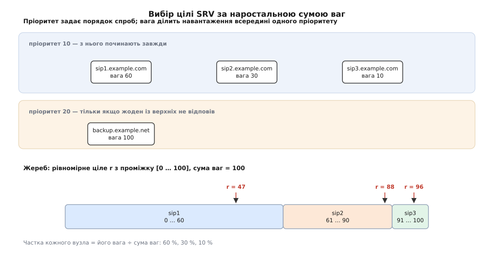
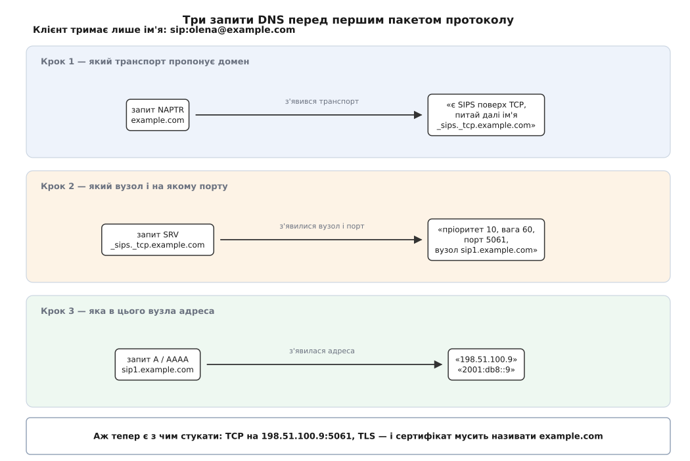
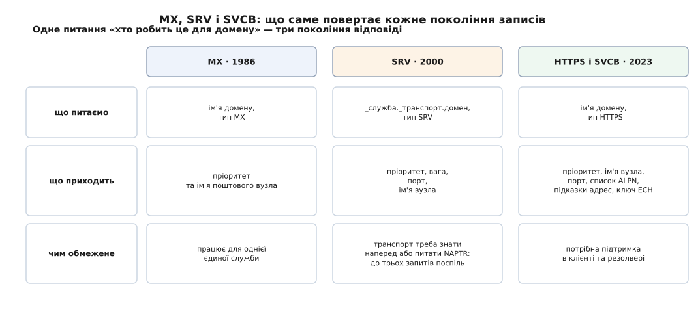

# Записи DNS SRV і NAPTR: пошук сервера служби за іменем домену

<preknowlist>
- [DHCP і DNS](root:com-transport/dhcp-dns) — DNS як розподілена база імен: зона, запис, тип запису, TTL, рекурсивний резолвер.
- [TCP проти UDP](root:com-transport/tcp-vs-udp) — що таке порт і чим транспорти відрізняються між собою.
- [TLS](root:sf-security/tls) — сертифікат прив'язаний до імені, і клієнт звіряє його з тим іменем, яке питав.
</preknowlist>

Щоб відкрити з'єднання, самого імені `example.com` програмі мало. Їй потрібні три речі: на якій машині слухає служба, на якому порту й яким транспортом до неї стукати. Ім'я дає лише перше, та й то через окремий запит, що повертає адресу. Решту програма не питає ні в кого: 443 для вебу, 5222 для чату, 25 для пошти вона тримає всередині себе як сталу, а транспорт бере той, що записаний у специфікації протоколу.

Поки все стоїть на своїх місцях, цього досить. Але ім'я домену — це ім'я *організації*, а не машини. За `example.com` може стояти університет із десятком корпусів, стартап на трьох орендованих серверах або одна людина, що купила домен і роздала служби різним провайдерам: пошту одному, чат другому, відеозустрічі третьому. Жоден із тих серверів не називається `example.com` і нікому не винен слухати на числі, яке хтось колись оголосив загальновідомим.

Виходить, питання, на яке DNS відповідає звично, і питання, яке насправді має клієнт, — різні. Клієнт питає «хто обслуговує **таку-от службу** домену `example.com`», а адресний запис відповідає «яка IP-адреса в машини на ім'я `example.com`». Ці два питання й розводять записи SRV і NAPTR.

## Пошта вперлася в це першою

Перший, хто зіткнувся з розбіжністю, — електронна пошта, і сталося це задовго до вебу. Адреса `user@example.com` має правий бік, схожий на ім'я вузла, але слати листа на машину з таким іменем безглуздо: пошту приймає окремий сервер, часто чужий і названий інакше. Крейг Партрідж у RFC 974 (січень 1986) розв'язав це новим типом запису — **MX**: на запит про домен той повертає ім'я вузла, який приймає для домену пошту, і число *preference*. Менше число — раніша спроба; коли перший вузол мовчить, клієнт спускається до наступного. Так у DNS уперше з'явилася відповідь не «де ця машина», а «хто робить це замість домену».

Механізм правильний, але вузький: MX знає рівно про одну службу. Для будь-якої іншої довелося б заводити свій тип запису, а тип запису в DNS — це число в реєстрі IANA, окремий документ і, найгірше, підтримка в кожному сервері та резолвері світу. Десять служб — десять таких походів, і всі вони мали б відбутися **раніше**, ніж хтось зможе новим протоколом користуватися. Тому наступне десятиліття кожен новий протокол просто прибивав свій порт цвяхом і не мучився.

## Назва служби переїжджає в саме ім'я запиту

Обійти це вдалося не новим типом запису на кожну службу, а переносом назви служби **в ім'я, яке ми питаємо**. Замість «спитай `example.com` записом типу SIP» — «спитай ім'я `_sip._udp.example.com` записом типу SRV». Тип лишається один назавжди, а служб може бути скільки завгодно: кожна нова — просто нова гілка в зоні, яку адміністратор дописує сам, ні в кого не питаючи дозволу.

Лишалася пастка: `sip.example.com` цілком може існувати як справжній вузол, і мітка служби змішалася б з іменем машини. Тому мітки служби й транспорту пишуть **із підкресленням**: `_sip`, `_tcp`. Підкреслення не входить у рекомендований синтаксис імен вузлів (літери, цифри, дефіс — RFC 1035), тому мітка з ним не може бути іменем реальної машини, і зіткнення виключене за побудовою, а не за домовленістю. Згодом таких підкреслених міток набралося стільки, що IANA завела для них окремий реєстр (RFC 8552, Дейв Крокер, березень 2019) — щоб два різні протоколи не претендували на одне `_auth`.

> 🔧 **Навіщо це.** Звідси береться щоденна свобода адміністратора: перенести чат на іншу машину, підняти поруч другий сервер, перевести службу на нестандартний порт — усе це правки в кількох рядках зони, без жодного дотику до налаштувань клієнтів. І навпаки: якщо клієнт службу за SRV не шукає, ідеально виписана зона нічого не змінить — він усе одно піде на вшитий у нього порт.

## Що саме відповідає SRV

Рядок зони виглядає так:

```
_sips._tcp.example.com.  3600  IN  SRV  10  60  5061  sip1.example.com.
```

Праворуч від типу — чотири поля, і кожне закриває свою дірку.

**Пріоритет** (`10`) робить те саме, що preference у MX: упорядковує спроби. Клієнт бере всі записи з найменшим числом і лише тоді, коли жоден із них не відповів, переходить до наступного числа. Це резерв — основний майданчик і запасний, до якого доходять тільки в біді.

**Вага** (`60`) — те, чого в MX не було й чого найбільше бракувало. Усередині одного пріоритету всі вузли рівноправні, але не обов'язково однакові: одна машина тягне втричі більше за іншу. Вага каже, у якій пропорції ділити між ними потік.

**Порт** (`5061`) звільняє службу від загальновідомого числа. Тепер сервер може слухати де завгодно, і клієнт про це дізнається, а не вгадує.

**Ціль** (`sip1.example.com.`) — ім'я вузла, до якого й слід іти. Два правила про неї варті окремої уваги. По-перше, це мусить бути канонічне ім'я з власними адресними записами, а **не псевдонім CNAME**: інакше сервер не може покласти адресу вузла в додаткову секцію тієї самої відповіді, клієнт платить зайвим запитом, а частина резолверів просто плутається. По-друге, ціль `.` — сама лише крапка, корінь — означає не «не знаю», а тверде «цю службу цей домен не надає»; клієнту слід зупинитися, а не шукати обхідних шляхів.

Точний вигляд полів на дроті, дозволені діапазони чисел і перелік уживаних назв служб зібрано окремо — [довідка по записах SRV і NAPTR](root:com-transport/dns-srv-naptr/api-srv-naptr-records.md) стане в пригоді, коли доведеться писати зону або розбирати чужу.

## Жеребкування за вагою

Ділити потік «пропорційно вазі» можна по-різному, і RFC 2782 описує конкретну процедуру — не тому, що інших немає, а тому, що всі клієнти мусять розкладати ту саму відповідь однаково, інакше пропорції попливуть.

**Умова: у пріоритеті 10 три вузли з вагами 60, 30 і 10.**

```
вузол:              sip1    sip2    sip3
вага:                 60      30      10
наростальна сума:     60      90     100

r — рівномірне ціле з проміжку [0 … 100]

r = 47  →  перша сума ≥ 47  →   60  →  sip1
r = 88  →  60 < 88, 90 ≥ 88  →  90  →  sip2
r = 96  →  90 < 96, 100 ≥ 96 → 100  →  sip3
```

Частка кожного дорівнює його вазі, поділеній на суму ваг: 60 %, 30 %, 10 %. Дрібниця, помітна лише при уважному читанні специфікації: `r` беруть від нуля до суми **включно**, тобто значень 101, а не 100 — тому частки виходять дуже близькі до пропорції, але не рівні їй до останньої цифри.


*Ваги вишиковуються наростальною сумою в суцільну шкалу, і випадкове число вибирає той відрізок, у який потрапило. Довжина відрізка — і є частка вузла в потоці.*

Обраний запис викидають зі списку, суми перераховують і жеребкують знову — тож на виході не один вузол, а **весь порядок обходу**. Це важливо: коли перша ціль відмовила у з'єднанні, клієнт іде до другої, не роблячи жодного нового запиту в DNS.

Звідси й трюк із нульовою вагою. Запис із вагою 0 не додає до наростальної суми нічого, тобто його сума дорівнює попередній, і потрапити в нього майже неможливо — але специфікація вимагає ставити такі записи **на початок** списку. Тоді сума першого з них дорівнює нулю, і жереб `r = 0` вибирає саме його. Один шанс зі ста з гаком: нуль означає не «ніколи», а «практично ніколи, поки решта жива» — тобто підмінний вузол, що мовчки чекає своєї години.

Розкласти список за цим правилом, а потім чесно обійти його з відкатами при відмовах — задача, у якій легко зробити тонку помилку й не помітити її роками; [робочий пошуковець служби з повним обходом](root:com-transport/dns-srv-naptr/proj-srv-resolver.md) показує, де саме її роблять.

## Коли невідомий навіть транспорт

В імені `_sips._tcp.example.com` уже зашитий транспорт. Але звідки клієнт знає, що питати треба саме `_tcp`, а не `_udp`? SIP, наприклад, живе поверх усіх трьох варіантів — UDP, TCP і TLS поверх TCP. Клієнт міг би спитати всі три імені й вибрати з того, що знайшлося, — але тоді **вибирає клієнт**, а хто з варіантів кращий для цього домену, знає домен: у нього один сервер шифрований, другий ні, третій ледве тягне UDP.

Отже, потрібен ще один рівень: відповідь на питання «які транспорти ти взагалі пропонуєш і в якому порядку». Її дає **NAPTR** (англ. *naming authority pointer* — вказівник іменувальної влади):

```
example.com.  IN  NAPTR  10  50  "S"  "SIPS+D2T"  ""  _sips._tcp.example.com.
example.com.  IN  NAPTR  20  50  "S"  "SIP+D2T"   ""  _sip._tcp.example.com.
example.com.  IN  NAPTR  30  50  "S"  "SIP+D2U"   ""  _sip._udp.example.com.
```

Поля читаються так. **Order** (`10`, `20`, `30`) — обов'язковий порядок розгляду; **preference** (`50`) розводить записи з однаковим order. **Flags** (`"S"`) кажуть, що робити з результатом: у застосуванні до пошуку серверів `S` означає «результат — ім'я, під яким лежать записи SRV», `A` — «результат — ім'я, для якого треба взяти адресу», а порожній прапорець — «результат — ім'я, де лежить наступний NAPTR», тобто ланцюг триває. **Service** (`"SIPS+D2T"`) — назва того, що пропонується: SIPS, доставлений транспортом TCP. **Regexp** і **replacement** — два взаємовиключні способи дістати наступне ім'я: або підстановка за регулярним виразом, або просто готове ім'я. Тут regexp порожній, отже працює replacement.

Прапорці не визначені самим записом: їх визначає **застосування**, яке ним користується. Для пошуку серверів це RFC 3263 (Джонатан Розенберґ і Хеннінґ Шульцрінне, червень 2002 — саме він задає наведений вище ланцюг для SIP) та узагальнена схема S-NAPTR (RFC 3958, Леслі Дейґл і Ендрю Ньютон, січень 2005), яка взагалі забороняє регулярні вирази й лишає саму лише підстановку імені.

Тоді навіщо той regexp? Бо NAPTR народився не для пошуку серверів. Рон Деніел і Майкл Меллінґ придумали його в RFC 2168 (червень 1997) для зовсім іншої задачі — розв'язання постійних імен ресурсів URN, — а 2002 року узагальнили до **DDDS**, системи динамічного делегованого пошуку (RFC 3401–3404; сам запис описує RFC 3403). Ідея DDDS ширша за DNS: є рядок-ключ, є набір правил перезапису, і кожне правило перетворює ключ на новий ключ, аж поки не дійде до кінцевої відповіді. DNS у цій схемі — лише сховище правил, а NAPTR — форма запису одного правила. Ось тому в ньому й лежить регулярний вираз: ключем не конче має бути ім'я домену.

Найвідоміше таке застосування — [ENUM](root:com-protocol/enum-e164) (RFC 6116, березень 2011): телефонний номер як ім'я в DNS. Номер +380 44 123 45 67 чистять від усього, крім цифр, перевертають, розділяють крапками й дописують домен — виходить `7.6.5.4.3.2.1.4.4.0.8.3.e164.arpa`. NAPTR за цим іменем має прапорець `U` (кінцевий результат — готовий URI) і регулярний вираз, який перетворює номер на `sip:…`. Так телефонний номер стає адресою, за якою можна подзвонити мережею.

## Повний ланцюг

Складімо все докупи. Апарат має набрати `sip:olena@example.com` і починає з голого домену.


*Кожен запит закриває рівно одну з трьох невідомих, і лише після третього в клієнта є повний набір, щоб відкрити з'єднання. Сертифікат при цьому звіряють із початковим іменем домену, а не з іменем вузла, куди привів ланцюг.*

Спершу NAPTR на `example.com` повертає три пропозиції; найменший order у SIPS поверх TCP, отже беруть його й дістають ім'я `_sips._tcp.example.com`. Далі SRV за цим іменем віддає список цілей із пріоритетами й вагами, жереб розкладає його в порядок обходу, і перший у черзі — `sip1.example.com` на порту 5061. Нарешті адресний запит на `sip1.example.com` дає `198.51.100.9`. Аж тепер апарат відкриває TCP, підіймає TLS і шле `INVITE`. Саме цей ланцюг стоїть за тим, як [SIP](root:com-protocol/sip) знаходить сервер чужого домену, не знаючи про нього наперед нічого, крім імені.

Ціна очевидна: три запити поспіль, і кожен наступний не можна почати, поки не прийшов попередній. На каналі з обміном туди-назад у 40 мс це близько 120 мс мовчання ще до першого байта самого протоколу — і це на холодному кеші. Саме ця ціна вирішила долю SRV у вебі.

## Де воно ламається

**Порядок міток.** `_sip._tcp`, а не `_tcp._sip`: спершу служба, потім транспорт. Помилка мовчазна — запису просто немає, клієнт відкочується на вшитий порт і працює «майже правильно» рівно доти, доки сервер не переїде.

**Сертифікат звіряють із доменом, а не з ціллю.** Клієнт питав `example.com`, а прийшов на `sip1.example.com`. Якби він перевіряв сертифікат на ім'я цілі, будь-хто, здатний підмінити відповідь DNS, скерував би його на власний вузол із чесним сертифікатом на власне ім'я — і перевірка пройшла б бездоганно. Тому звіряють із **початковим** іменем: сертифікат мусить називати `example.com`. Ціль SRV — це вказівка, куди йти, а не заява, кому довіряти.

**Сама відповідь DNS нічим не підтверджена.** Підроблений SRV — це не крадіжка одного пароля, а тихе перенаправлення цілої служби домену, і виглядає воно для клієнта як нормальна робота. Єдине, що робить відповідь довіреною, — криптографічний підпис зони: [DNSSEC](root:sf-security/dnssec) додає до записів підписи й ланцюг довіри від кореня, і саме він перетворює «резолвер так сказав» на «власник домену так заявив».

**Опублікувати запис не означає, що його читатимуть.** SRV працює лише там, де клієнт свідомо його шукає: SIP, XMPP (імена `_xmpp-client._tcp` і `_xmpp-server._tcp` з RFC 6120, з відкотом на порти 5222 і 5269, якщо відповіді немає), LDAP і [Kerberos](root:sf-security/kerberos-authentication) у корпоративних каталогах, [DNS-SD у локальній мережі](root:com-transport/mdns-dns-sd), де до SRV додають ще TXT із параметрами й PTR для переліку. Браузери не питають SRV ніколи.

## Той самий крок, зроблений утретє

Веб обійшов SRV не з упертості. HTTP уже стояв на вшитому порту, коли SRV з'явився, і додати заради нього ще один запит — а з NAPTR і два — означало сповільнити кожне перше відкриття сторінки. Але ідея не пропала: RFC 9460 (листопад 2023, Бенджамін Шварц, Майк Бішоп, Ерік Найґрен) описує записи [SVCB і HTTPS](root:com-transport/svcb-https-records), які роблять той самий крок за один запит і з більшим уловом. Відповідь несе не лише вузол і порт, а й параметри з'єднання: перелік підтримуваних протоколів ALPN, підказки IP-адрес, ключ для шифрування імені сервера. Плюс режим псевдоніма, що дозволяє на вершині зони те, чого CNAME там не вміє.


*Питання за сорок років не змінилося — змінилося те, скільки клієнт устигає дізнатися, ще не витративши жодного пакета на сам протокол.*

Дуга замикається так: MX сказав, хто робить це для домену; SRV додав скільки їх, на якому порту і в якій пропорції; SVCB — ще й як саме з'єднуватися. Кожен крок забирав у клієнта чергову вшиту сталу й віддавав її тому, хто єдиний має право її визначати, — власникові домену. [Як ці три покоління змінювали одне одного і чому між ними минуло стільки часу](root:com-transport/dns-srv-naptr/hist-service-location.md) — окрема історія, у якій вистачило і невдалих експериментів, і чужих задач, розв'язаних побіжно.
