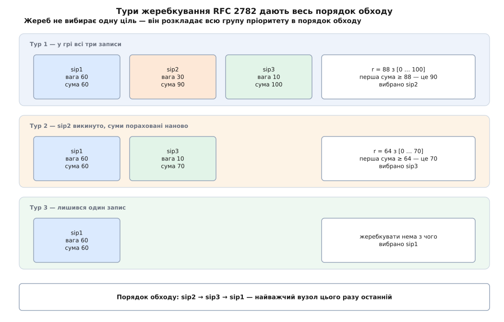

# ⚙️ Пошуковець служби: від імені домену до впорядкованого списку цілей

На вході — саме лише ім'я домену, на виході — черга адрес із портами, яку клієнт обходить згори вниз, доки котрась не пустить його всередину. Ланцюг із трьох запитів DNS пишеться за півгодини; решту часу з'їдають дві речі, на яких помиляються майже всі: жеребкування за вагою, помилку в якому статистика ховає роками, і питання, що робити з готовим планом, коли перша ціль мовчить.

---

## План окремо, з'єднання окремо

Найважливіше рішення ухвалюється ще до першого рядка коду: **пошук і з'єднання — це дві різні функції**, і між ними лежить незмінний список.

Спокуса зробити інакше сильна. Клієнт узяв першу ціль, вона не відповіла — здається природним просто перепитати DNS і взяти наступну. Так робити не можна, і причин три. Відповідь майже напевно прийде з кешу резолвера, тобто набір записів буде той самий — а новий жереб цілком може знову вказати на мертвий вузол. Навіть якщо викинути невдаху вручну, ваги решти вже перекошені: RFC 2782 розписує пропорції для **повного** набору, а не для набору мінус один. І врешті кожне перепитування коштує ще один обмін із резолвером тоді, коли користувач і так уже чекає.

Тому `Resolve` викликають рівно раз на серію спроб. Він повертає **план** — увесь порядок обходу, розіграний наперед. Далі `Dial` іде цим планом, і DNS у ньому вже не з'являється жодного разу.

## Серце: порядок за RFC 2782

Уся тонкість зосереджена в одній функції.

:::tabs
```go
import (
	"context"
	"crypto/tls"
	"errors"
	"fmt"
	"math/rand/v2"
	"net"
	"net/netip"
	"sort"
	"strconv"
	"strings"
	"time"

	"github.com/miekg/dns" // NAPTR у стандартній бібліотеці немає
)

// Target — одна ціль SRV: куди йти, на який порт і з яким місцем у черзі.
type Target struct {
	Host     string // канонічне ім'я вузла, з крапкою на кінці
	Port     uint16
	Priority uint16
	Weight   uint16
	Addrs    []netip.Addr // заповнюється на третьому кроці ланцюга
}

// orderRFC2782 віддає повний порядок обходу: спершу за пріоритетом,
// а всередині кожного пріоритету — жеребкуванням за вагою.
func orderRFC2782(rrs []Target) []Target {
	sort.SliceStable(rrs, func(i, j int) bool { return rrs[i].Priority < rrs[j].Priority })

	out := make([]Target, 0, len(rrs))
	for i := 0; i < len(rrs); {
		j := i
		for j < len(rrs) && rrs[j].Priority == rrs[i].Priority {
			j++
		}
		group := append([]Target(nil), rrs[i:j]...)
		i = j

		// «У будь-якому порядку» зі специфікації — не декорація: це єдине
		// джерело випадковості для групи, у якій усі ваги нульові.
		rand.Shuffle(len(group), func(a, b int) { group[a], group[b] = group[b], group[a] })

		// Нульові ваги — на початок: лише там їхня наростальна сума дорівнює нулю.
		sort.SliceStable(group, func(a, b int) bool {
			return group[a].Weight == 0 && group[b].Weight != 0
		})

		for len(group) > 0 {
			running := make([]int, len(group))
			sum := 0
			for k, t := range group {
				sum += int(t.Weight)
				running[k] = sum
			}

			r := rand.IntN(sum + 1)            // рівномірне ціле з [0 … sum] ВКЛЮЧНО
			pick := sort.SearchInts(running, r) // перша наростальна сума ≥ r

			out = append(out, group[pick])
			group = append(group[:pick], group[pick+1:]...) // викинули — і рахуємо наново
		}
	}
	return out
}
```
```cpp
#include <algorithm>   // stable_sort, shuffle, stable_partition, lower_bound
#include <random>
#include <string>
#include <vector>

// Target — одна ціль SRV: куди йти, на який порт і з яким місцем у черзі.
struct Target {
    std::string       host;          // канонічне ім'я вузла, з крапкою на кінці
    uint16_t          port     = 0;
    uint16_t          priority = 0;
    uint16_t          weight   = 0;
    std::vector<Addr> addrs;         // заповнюється на третьому кроці ланцюга
};

// Один генератор на нитку. Сіяти сталою — це дати всім клієнтам світу
// однаковий жереб і зібрати весь потік на одному вузлі.
static std::mt19937& prng() {
    static thread_local std::mt19937 g{std::random_device{}()};
    return g;
}

// order_rfc2782 віддає повний порядок обходу: спершу за пріоритетом,
// а всередині кожного пріоритету — жеребкуванням за вагою.
std::vector<Target> order_rfc2782(std::vector<Target> rrs) {
    std::stable_sort(rrs.begin(), rrs.end(),
                     [](const Target& a, const Target& b) { return a.priority < b.priority; });

    std::vector<Target> out;
    out.reserve(rrs.size());

    for (auto it = rrs.begin(); it != rrs.end();) {
        const uint16_t p = it->priority;
        auto end = std::find_if(it, rrs.end(), [p](const Target& t) { return t.priority != p; });
        std::vector<Target> group(std::make_move_iterator(it), std::make_move_iterator(end));
        it = end;

        // «У будь-якому порядку» зі специфікації — не декорація: це єдине
        // джерело випадковості для групи, у якій усі ваги нульові.
        std::shuffle(group.begin(), group.end(), prng());

        // Нульові ваги — на початок: лише там їхня наростальна сума дорівнює нулю.
        std::stable_partition(group.begin(), group.end(),
                              [](const Target& t) { return t.weight == 0; });

        while (!group.empty()) {
            std::vector<unsigned> running(group.size());
            unsigned sum = 0;
            for (std::size_t k = 0; k < group.size(); ++k) {
                sum += group[k].weight;
                running[k] = sum;
            }

            std::uniform_int_distribution<unsigned> dice(0, sum);  // [0 … sum] ВКЛЮЧНО
            const unsigned r = dice(prng());
            const auto pick = std::lower_bound(running.begin(), running.end(), r) - running.begin();

            out.push_back(std::move(group[pick]));
            group.erase(group.begin() + pick);   // викинули — і рахуємо наново
        }
    }
    return out;
}
```
:::

Три місця тут виглядають як дрібниці, а насправді кожне з них — окремий спосіб зіпсувати розподіл.

**Перемішування групи.** Специфікація дозволяє розкласти записи «у будь-якому порядку» — і саме це формулювання доводиться читати як обов'язок. Коли всі ваги в групі нульові, сума теж нуль, жереб щоразу дає нуль, а нуль завжди влучає в перший запис списку. Без перемішування «будь-який порядок» перетворюється на «порядок, у якому їх поклав резолвер», і весь потік іде на один вузол. Ваги 0 при цьому цілком законні: їх ставлять, коли ділити нема чого й усі сервери рівні.

**Нульові ваги на початок.** Правило здається примхою, доки не порахувати. Наростальна сума нульового запису дорівнює сумі попереднього, тож вибирають його тільки за точного влучання в межу. Опинившись у кінці списку, він має ту саму суму, що й повна сума ваг, — але шукають **першу** суму, не меншу за жереб, і знаходять сусіда ліворуч. Такий запис не вибереться ніколи. На початку списку його сума дорівнює нулю, і жереб `r = 0` дістається саме йому: один шанс із «сума ваг плюс один». Нуль означає не «ніколи», а «поки решта жива» — це підмінний вузол.

**Межа проміжку включно.** `rand.IntN(sum)` замість `sum+1` виглядає безневинно, а насправді краде одне-єдине значення — найбільше. Платить за нього останній запис списку: його вибирає будь-який жереб, більший за передостанню суму, і таких значень рівно стільки, скільки він важить. Відрізали верхнє — лишилося на одне менше.

**Умова: у пріоритеті три записи з вагами 60, 39 і 1; сума ваг 100.**

```
наростальні суми:            60          99         100

правильно, r з [0 … 100] — 101 значення:
  третій запис бере r = 100         →   1 зі 101   ≈ 0.99 %

помилково, r з [0 … 99] — 100 значень:
  третій запис не бере жодного      →   0 зі 100   =  0 %
```

Вузол із вагою 1 зникає з ротації назавжди. Це найгірший різновид помилки: запасний сервер, який усі вважають робочим, роками не бачить жодного з'єднання, а різниця в статистиці — один відсоток — тоне в добовому шумі й спливає аж тоді, коли на цей сервер довелося покластися.


*Жеребкування повторюють, доки група не спорожніє. Тому на виході стоїть увесь порядок обходу, а не одна ціль, — і вузол із найбільшою вагою цілком може опинитися останнім.*

## Ланцюг: три запити

Тепер обгортка. Перший запит перетворює домен на ім'я служби, другий — ім'я служби на цілі, третій — цілі на адреси.

:::tabs
```go
var errDenied = errors.New("домен не надає цієї служби") // ціль "."

// prefer — що цей клієнт узагалі вміє. Порядок домену (order, потім preference)
// головніший за наш смак: ми тільки викидаємо те, чого не потягнемо.
var prefer = map[string]bool{"SIPS+D2T": true, "SIP+D2T": true, "SIP+D2U": true}

// Крок 1: голий домен → імена, під якими лежать записи SRV.
func serviceNames(ctx context.Context, c *dns.Client, server, domain string) []string {
	m := new(dns.Msg)
	m.SetQuestion(dns.Fqdn(domain), dns.TypeNAPTR)
	resp, _, err := c.ExchangeContext(ctx, m, server)

	var recs []*dns.NAPTR
	if err == nil {
		for _, a := range resp.Answer {
			n, ok := a.(*dns.NAPTR)
			// S-NAPTR: прапорець «S» (далі буде SRV), регулярні вирази заборонені.
			if ok && strings.EqualFold(n.Flags, "S") && n.Regexp == "" &&
				prefer[strings.ToUpper(n.Service)] {
				recs = append(recs, n)
			}
		}
	}
	sort.SliceStable(recs, func(i, j int) bool {
		if recs[i].Order != recs[j].Order {
			return recs[i].Order < recs[j].Order
		}
		return recs[i].Preference < recs[j].Preference
	})

	names := make([]string, 0, len(recs))
	for _, n := range recs {
		names = append(names, dns.Fqdn(n.Replacement))
	}
	if len(names) == 0 { // NAPTR немає — транспорт доводиться припустити самим
		names = append(names, "_sips._tcp."+dns.Fqdn(domain))
	}
	return names
}

// Крок 2: ім'я служби → сирі записи SRV.
func srvTargets(ctx context.Context, c *dns.Client, server, name string) ([]Target, error) {
	m := new(dns.Msg)
	m.SetQuestion(name, dns.TypeSRV)
	resp, _, err := c.ExchangeContext(ctx, m, server)
	if err != nil {
		return nil, err
	}
	var ts []Target
	for _, a := range resp.Answer {
		s, ok := a.(*dns.SRV)
		if !ok {
			continue
		}
		if s.Target == "." { // не «не знаю», а «ні» — і жодних обхідних шляхів
			return nil, errDenied
		}
		ts = append(ts, Target{Host: dns.Fqdn(s.Target), Port: s.Port,
			Priority: s.Priority, Weight: s.Weight})
	}
	return ts, nil
}

// legacy — відкат на вшитий порт. Дозволений ЛИШЕ коли записів немає зовсім.
func legacy(ctx context.Context, domain string) ([]Target, error) {
	addrs, err := net.DefaultResolver.LookupNetIP(ctx, "ip", domain)
	if err != nil {
		return nil, err
	}
	return []Target{{Host: dns.Fqdn(domain), Port: 5061, Addrs: addrs}}, nil
}

// Resolve — увесь ланцюг. Викликається ОДИН раз на серію спроб.
func Resolve(ctx context.Context, server, domain string) ([]Target, error) {
	c := new(dns.Client)
	var plan []Target
	denied := false

	for _, name := range serviceNames(ctx, c, server, domain) {
		ts, err := srvTargets(ctx, c, server, name)
		switch {
		case errors.Is(err, errDenied):
			denied = true
		case err == nil && len(ts) > 0:
			plan = append(plan, orderRFC2782(ts)...)
		}
	}

	if len(plan) == 0 {
		if denied {
			return nil, errDenied // домен сказав «ні»: на вшитий порт іти НЕ можна
		}
		return legacy(ctx, domain) // записів просто немає — дозволений старий шлях
	}

	for i := range plan { // крок 3: адреси; порядок родин лишаємо резолверу
		host := strings.TrimSuffix(plan[i].Host, ".")
		if addrs, err := net.DefaultResolver.LookupNetIP(ctx, "ip", host); err == nil {
			plan[i].Addrs = addrs
		}
	}
	return plan, nil
}
```
```cpp
// Три примітиви транспорту DNS — res_nquery з <resolv.h> плюс ns_parserr
// з <arpa/nameser.h>. Розбір пакета механічний, тому тут лише оголошення.
struct NaptrRec {
    uint16_t    order, preference;
    std::string flags, service, regexp, replacement;
};
std::vector<NaptrRec> query_naptr(const std::string& name);
std::vector<Target>   query_srv(const std::string& name);   // кидає Denied на ціль "."
std::vector<Addr>     query_addr(const std::string& host);  // A і AAAA

// Що цей клієнт узагалі вміє. Порядок домену (order, потім preference)
// головніший за наш смак: ми тільки викидаємо те, чого не потягнемо.
static const std::array<std::string_view, 3> kPrefer{"SIPS+D2T", "SIP+D2T", "SIP+D2U"};

// Крок 1: голий домен → імена, під якими лежать записи SRV.
std::vector<std::string> service_names(const std::string& domain) {
    std::vector<NaptrRec> recs;
    try { recs = query_naptr(domain); } catch (const DnsError&) {}

    // S-NAPTR: прапорець «S» (далі буде SRV), регулярні вирази заборонені.
    std::erase_if(recs, [](const NaptrRec& n) {
        return n.flags != "S" || !n.regexp.empty() ||
               std::find(kPrefer.begin(), kPrefer.end(), n.service) == kPrefer.end();
    });
    std::stable_sort(recs.begin(), recs.end(), [](const NaptrRec& a, const NaptrRec& b) {
        return std::tie(a.order, a.preference) < std::tie(b.order, b.preference);
    });

    std::vector<std::string> names;
    for (const auto& n : recs) names.push_back(n.replacement);
    if (names.empty())                       // NAPTR немає — транспорт припускаємо самі
        names.push_back("_sips._tcp." + domain + ".");
    return names;
}

// legacy — відкат на вшитий порт. Дозволений ЛИШЕ коли записів немає зовсім.
std::vector<Target> legacy(const std::string& domain) {
    return { Target{domain + ".", 5061, 0, 0, query_addr(domain)} };
}

// Увесь ланцюг. Викликається ОДИН раз на серію спроб.
std::vector<Target> resolve(const std::string& domain) {
    std::vector<Target> plan;
    bool denied = false;

    for (const auto& name : service_names(domain)) {          // крок 2
        std::vector<Target> ts;
        try { ts = query_srv(name); }
        catch (const Denied&)   { denied = true; continue; }  // ціль "." — і жодних обхідних шляхів
        catch (const DnsError&) { continue; }
        if (ts.empty()) continue;

        auto ordered = order_rfc2782(std::move(ts));
        plan.insert(plan.end(), std::make_move_iterator(ordered.begin()),
                                std::make_move_iterator(ordered.end()));
    }

    if (plan.empty()) {
        if (denied) throw Denied{domain};   // домен сказав «ні»: на вшитий порт іти НЕ можна
        return legacy(domain);              // записів просто немає — дозволений старий шлях
    }
    for (auto& t : plan) t.addrs = query_addr(t.host);        // крок 3
    return plan;
}
```
:::

> 🔧 **Навіщо це.** Тут ховається розрив, який коштує найдорожче: **порожня відповідь і ціль `.` — не одне й те саме**. Коли записів немає зовсім, домен просто нічого не оголосив, і клієнт має право піти старим шляхом — адресний запис на сам домен плюс загальновідомий порт. Коли ж прийшла ціль `.`, домен сказав уголос: цієї служби тут немає. Клієнт, який на це відповідає відкатом на вшитий порт, стукає туди, куди йому щойно заборонили, — і найчастіше потрапляє на зовсім інший сервіс, що випадково слухає на тому числі. Тому прапорець `denied` тягнеться крізь усю функцію: він відрізняє мовчання від відмови.

Фільтр NAPTR теж не випадковий. Прапорець `S` означає, що результат — ім'я із записами SRV; порожній `regexp` вимагає S-NAPTR, і саме тому в коді немає жодного регулярного виразу. Сортування — за `order`, а за рівності — за `preference`; наш власний перелік умінь у цьому сортуванні не бере участі взагалі. Він працює лише як сито: домен вирішує, що краще, ми — лише що нам під силу.

## Обхід із відкатом

План готовий, і далі все просто рівно доти, доки не подумати про межі.

:::tabs
```go
// Dial іде готовим планом: цілі за порядком, адреси кожної цілі за порядком.
// Жодного нового запиту в DNS: план уже розіграний, перерозігрувати його не можна.
func Dial(ctx context.Context, domain string, plan []Target, budget int) (net.Conn, error) {
	last := errors.New("у плані немає жодної адреси")
	tries := 0

	for _, t := range plan {
		for _, a := range t.Addrs {
			if tries >= budget { // специфікація межі не ставить — ставимо ми
				return nil, fmt.Errorf("бюджет спроб вичерпано: %w", last)
			}
			tries++

			d := net.Dialer{Timeout: 2 * time.Second}
			conn, err := d.DialContext(ctx, "tcp",
				net.JoinHostPort(a.String(), strconv.Itoa(int(t.Port))))
			if err != nil {
				last = err // відмова або таймаут — просто наступна адреса
				continue
			}
			// Ім'я для TLS — ПОЧАТКОВИЙ домен, а не ціль, куди привів SRV.
			tc := tls.Client(conn, &tls.Config{ServerName: domain})
			if err := tc.HandshakeContext(ctx); err != nil {
				tc.Close()
				last = err
				continue
			}
			return tc, nil
		}
	}
	return nil, fmt.Errorf("жодна ціль не відповіла: %w", last)
}
```
```cpp
// dial іде готовим планом: цілі за порядком, адреси кожної цілі за порядком.
// Жодного нового запиту в DNS: план уже розіграний, перерозігрувати його не можна.
Conn dial(const std::string& domain, const std::vector<Target>& plan, int budget) {
    int tries = 0;
    for (const auto& t : plan) {
        for (const auto& a : t.addrs) {
            if (tries++ >= budget)              // специфікація межі не ставить — ставимо ми
                throw Exhausted{"бюджет спроб вичерпано"};

            int fd = connect_to(a, t.port, std::chrono::seconds(2));
            if (fd < 0) continue;               // відмова або таймаут — наступна адреса

            // Ім'я для TLS — ПОЧАТКОВИЙ домен, а не ціль, куди привів SRV.
            if (Conn c = start_tls(fd, domain)) return c;
            ::close(fd);
        }
    }
    throw Exhausted{"жодна ціль не відповіла"};
}
```
:::

Ані RFC 2782, ані RFC 3263 не кажуть, скільки цілей вільно перебрати. Це навмисно: межу ставить не протокол, а той, хто чекає на відповідь. Зона з двадцятьма записами і таймаутом дві секунди на кожен — це сорок секунд, за які встигне здатися й користувач, і зовнішній таймаут навколо. Тому бюджет спроб і [спільний бюджет часу](root:sf-distributed/timeouts-deadlines) — не прикраса, а те, що взагалі робить обхід придатним до вжитку. Коли з'єднання не постало, наступна спроба вимірюється по-різному: [відмова з'єднання](root:com-transport/tcp-connection-lifecycle) приходить за один обмін і майже нічого не коштує, а мовчання з'їдає весь таймаут — і саме воно з'їдає бюджет.

Порядок адрес усередині однієї цілі тут спрощено: код бере їх так, як віддав резолвер. Справжній клієнт цим не задовольняється — він чергує родини й пускає спроби навперейми, щоб зламаний IPv6 не коштував секунд очікування ([Happy Eyeballs](root:com-transport/happy-eyeballs)).

## Складність і пастки

Жеребкування — це `O(n²)` на групу: після кожного вибору суми рахують наново. Для реальних зон, де в пріоритеті одиниці записів, різниця з розумнішими структурами губиться в шумі, і переписувати цикл на дерево часткових сум — марна витрата уваги.

Решта — те, на чому справді горять.

**Ціль-псевдонім.** RFC 2782 прямо забороняє ставити ціллю ім'я, яке насправді `CNAME`. Резолвер такий псевдонім усе одно розгорне, і код працюватиме, — але сервер уже не покладе адресу в додаткову секцію тієї самої відповіді, і кожна ціль коштуватиме зайвого запиту. Чужі зони цієї заборони не дотримуються, тому клієнт мусить бути готовим: покладатися на додаткову секцію можна, вимагати її — ні.

**Порядок міток.** `_sips._tcp.example.com`: спершу служба, потім транспорт. Переставлені місцями мітки дають ім'я, якого просто немає, — а це для коду виглядає точнісінько як «домен нічого не оголосив». Помилка мовчазна: клієнт відкочується на вшитий порт і роками працює «майже правильно».

**Термін життя плану.** План живе не вічно, і не безкінечно мало: його можна тримати доти, доки не мине найменший [TTL](root:com-transport/dhcp-dns) серед записів SRV, з яких він складений. Раніше — марно перепитувати, пізніше — можна не помітити, що адміністратор уже перевів службу на інший вузол. Новий жереб має право статися тільки після того, як план застарів; усередині однієї серії спроб порядок незмінний.

**Повтори понад планом.** Коли план вичерпано, наступним кроком керує вже не DNS: тут вступають [паузи між повторами](root:sf-distributed/retries-backoff). Без них клієнт, що втратив зв'язок разом із тисячею інших, повернеться до відновленого сервера всі разом і покладе його вдруге.

**Ім'я для TLS.** Найкоротший рядок і найдорожча помилка. Сертифікат звіряють із доменом, якого клієнт питав, а не з ім'ям цілі, куди його привів SRV. Підставити `t.Host` у `ServerName` — це зробити підміну відповіді DNS непомітною: чужий вузол пред'явить чесний сертифікат на власне ім'я, перевірка мовчки пройде, і клієнт піде розмовляти не з тим, з ким збирався.
