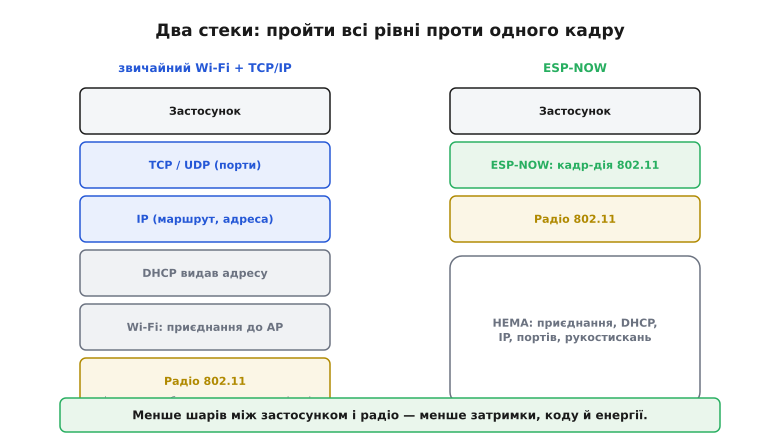
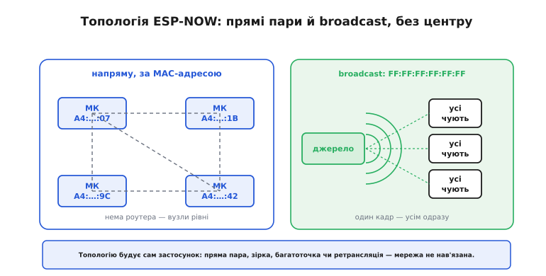
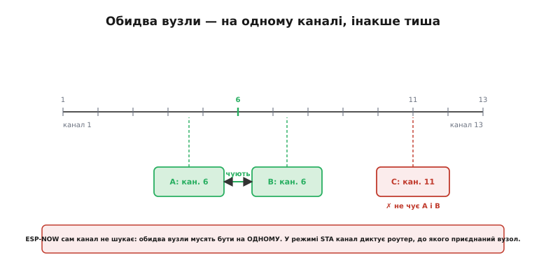
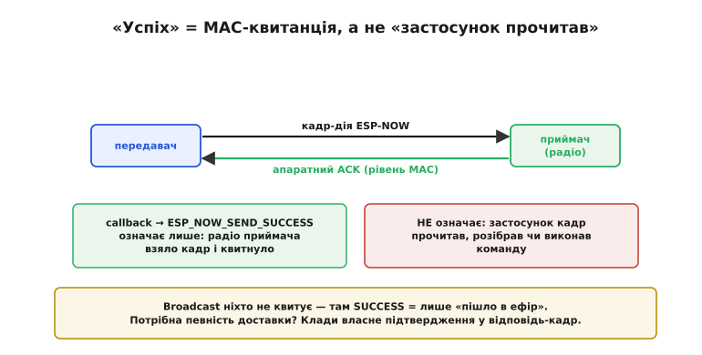

# ESP-NOW

Уяви два мікроконтролери за метр один від одного: кнопка на столі має гасити лампу на полиці. Дротом їх з'єднувати не хочеться. Найпростіше, що спадає на думку, — [Wi-Fi](root:com-transport/wifi). Але Wi-Fi тягне за собою цілий обоз: обидва пристрої мусять приєднатися до роутера, дочекатися видачі IP-адреси, а без роутера взагалі нікуди. Виходить дивно — щоб натиснута кнопка сказала «вимкни» сусідові за метр, сигнал іде до роутера в іншій кімнаті й повертається назад, а якщо роутер вимкнули — зв'язку нема зовсім. Забагато церемоній заради одного біта.

**ESP-NOW** — це відповідь Espressif (шанхайської компанії — розробника чіпів ESP8266 і ESP32) на саме таку задачу: дати двом її чіпам говорити **напряму**, без роутера, без приєднання, без IP. Назва читається як «ESP now» — «ESP просто зараз»: увімкнув два пристрої — вони вже можуть перекинутися даними, без жодних попередніх домовленостей. За це доводиться відмовитися від зручностей великої мережі, і саме цей обмін — простота проти можливостей — визначає, де ESP-NOW доречний, а де ні.

### Викинути всі шари, крім одного

Щоб зрозуміти ESP-NOW, найкорисніше побачити, **чого в ньому немає**. Звичайний обмін по мережі — це висока вежа рівнів, і кожен щось додає, але й коштує. Твої дані спускаються крізь неї згори вниз: застосунок кладе їх у TCP чи UDP (там з'являються порти), TCP пакує це в IP (там — адреси й маршрути), IP спирається на те, що [DHCP уже видав адресу](root:com-transport/wifi), а Wi-Fi — на те, що пристрій уже приєднаний до точки доступу. І лише в самому низу радіо нарешті випромінює кадр в ефір. Щоб два пристрої обмінялися хоч байтом, вони мусять пройти **всю** вежу — і кожен рівень треба спершу підняти.

ESP-NOW зрізає майже все. Він лишає тільки найнижчі рівні — **радіо 802.11** і тонкий шар над ним — і садовить застосунок майже прямо на залізо.


*Звичайний зв'язок проходить усю вежу: застосунок → TCP/UDP → IP → (наперед) DHCP і приєднання до Wi-Fi → радіо. ESP-NOW лишає застосунок, тонкий власний шар і радіо — а приєднання, DHCP, IP, портів і рукостискань просто немає. Менше шарів між застосунком і ефіром означає менше затримки, менше коду й менше витраченої енергії.*

Технічно ESP-NOW живе на **канальному рівні** (англ. *data link layer*, другий рівень моделі OSI) — тому самому, де працюють MAC-адреси, ще до всякого IP. Дані застосунку він запаковує у **кадр-дію** (англ. *action frame*) стандарту 802.11 — це службовий тип Wi-Fi-кадру, який можна відправити, ні до кого не приєднуючись. Espressif бере його «вендорський» (виробничий) підтип — той, що виробник обладнання вільний наповнити на власний розсуд, — і кладе туди твої байти. Для ефіру це звичайний, законний Wi-Fi-кадр; для тебе — прямий канал до сусіднього чіпа. Ось звідки береться вся легкість: не треба тримати з'єднання, бо його немає — кожен кадр самодостатній.

> 🔧 **Навіщо це.** ESP-NOW доречний саме там, де Wi-Fi надто важкий: пульт-приймач, гірлянда давачів, що зрідка кидають по кілька байтів і сплять, обмін між двома платами без жодної інфраструктури. Пристрій прокидається, шле кадр і засинає — не витрачаючи секунди й міліампер-години на приєднання до роутера щоразу. Якщо ж тобі потрібні браузер, хмара чи будь-що з великого інтернету — це вже [робота Wi-Fi](root:com-transport/wifi), і ESP-NOW тут не помічник: у ньому немає IP, отже, немає й виходу в мережу за межі прямого радіодосяжку.

### Адреса — це MAC, і топологію ти будуєш сам

Якщо IP немає, то за чим один вузол знаходить інший? За **MAC-адресою** — тим самим шестибайтним номером (як-от `A4:CF:12:9B:5E:07`), що [випалений у радіо кожного чіпа на заводі](root:com-transport/mac-ip-arp) й унікальний на весь світ. У ESP-NOW MAC — це вся адреса, яка потрібна: щоб надіслати кадр вузлу, ти вказуєш його MAC, і кадр летить саме туди. Вузол, якому ти маєш намір слати дані, спершу додають до внутрішнього списку — як **однолітка** (англ. *peer*, «рівний, ровесник») — і далі адресуєш його за MAC.

Слово «рівний» тут не випадкове й дуже важливе. У Wi-Fi є центр — точка доступу, і всі підключені пристрої нерівноправні: [клієнти говорять не один з одним, а через неї](root:com-transport/wifi). У ESP-NOW центру немає взагалі. Усі вузли рівні: будь-який може адресувати будь-якого напряму. Це означає, що **готової топології (гр. *tópos* — місце + *lógos* — учення; тут: структура зв'язків) немає — її будуєш ти сам** у своєму коді.


*Ліворуч — прямий обмін: вузли адресують один одного за MAC, роутера немає, усі рівні. Праворуч — broadcast на особливу адресу FF:FF:FF:FF:FF:FF: один кадр ловлять усі вузли поблизу одразу. Яку структуру з цього скласти — пряму пару, зірку з одним «збирачем», багатоточку чи ланцюжок-ретрансляцію — вирішує сам застосунок; мережа нічого не нав'язує.*

З цих простих цеглинок складаються різні структури. Найпростіша — **пара точка-точка**: два вузли, кожен знає MAC другого. Далі — **зірка**: один центральний вузол-«збирач» (скажімо, шлюз, що потім вивалює дані у Wi-Fi) тримає в списку багато давачів, а ті шлють дані лише йому. Espressif дозволяє одному вузлу тримати до **20** таких однолітків одночасно — це стеля списку пар, а не межа самої ідеї. Хочеш більше вузлів або більшу зону — вузли **ретранслюють**: крайній ловить кадр і передає далі, наче естафету, і так дані стрибають від сусіда до сусіда, доки не дійдуть. Так виходить **комірчаста мережа** (англ. *mesh*, «сітка»): суцільна структура без центру, де кожен вузол — і джерело, і ретранслятор. Але вся ця маршрутизація — чия рука перекине кадр далі й кому — не вбудована; її пишеш ти, бо ESP-NOW дає лише один крок: «доправ цей кадр отому MAC».

Окрема потужна дрібниця — **broadcast** (англ. «широкомовлення», буквально «розкидати навсібіч»). Якщо надіслати кадр на особливу адресу `FF:FF:FF:FF:FF:FF` (усі біти в одиницях), його ловлять **усі** вузли поблизу, налаштовані на цей канал, — не треба знати MAC кожного окремо. Це ідеально, щоб один пульт керував десятком ламп одночасно, або щоб новий вузол оголосив про себе всім, хто слухає. Плата за зручність — про це нижче: broadcast ніхто не підтверджує.

### Обидва вузли — на одному каналі

Є одне залізне правило, об яке спотикаються майже всі новачки, і воно випливає прямо з фізики радіо. Смуга 2.4 ГГц [поділена на канали](root:com-transport/channel-band-packet), і радіо в кожну мить слухає **рівно один** із них. ESP-NOW **сам канал не шукає** й не узгоджує — він просто випромінює кадр на тому каналі, де радіо стоїть зараз. Тому передавач і приймач мусять сидіти на **однаковому** каналі; інакше кадр летить у порожнечу, і приймач його ніколи не почує, хоч би пристрої лежали впритул.


*Радіо в кожну мить слухає один канал. Два вузли на каналі 6 обмінюються кадрами; третій, що стоїть на каналі 11, не чує ні першого, ні другого — хоч і поруч. ESP-NOW не перемикає канал за тебе: узгодити його — твій обов'язок. Особлива пастка чекає в режимі STA (клієнт Wi-Fi): там канал диктує роутер, до якого приєднаний вузол, а не твоя настройка.*

Здебільшого це просто: задаєш обом вузлам той самий номер каналу — і по всьому. Пастка вилазить, коли ESP-NOW поєднують із живим Wi-Fi на тому ж чіпі (а так роблять часто — шлюз, що збирає дані по ESP-NOW й віддає їх у хмару по Wi-Fi). Щойно вузол приєднався до роутера як **клієнт (STA)**, його канал **більше не твій** — його диктує роутер, і твоя спроба виставити інший номер нічого не змінить. Тоді або тримай усі вузли на тому каналі, що й роутер, або старанно розводь ці два режими. Це джерело зникнень зв'язку, за яких код виглядає бездоганним, а кадри просто нікуди не доходять.

### «Успіх» — це квитанція радіо, а не «застосунок прочитав»

Тепер найтонше місце, і воно варте окремої зупинки, бо саме тут народжується найпідступніший клас помилок. На відміну від голого [best-effort радіо, що стріляє кадром і забуває про нього](root:com-transport/on-chip-radio), unicast у ESP-NOW дає зворотний зв'язок: після кожного адресного відправлення спрацьовує **callback** (англ. «зворотний виклик» — твоя функція, яку стек гукає сам), і в ньому — статус `ESP_NOW_SEND_SUCCESS` або `ESP_NOW_SEND_FAIL`. Спокуса прочитати `SUCCESS` як «сусід отримав і зробив» — і саме вона підводить.

`SUCCESS` означає рівно одне: **радіо приймача взяло кадр і відповіло апаратним підтвердженням** (англ. *acknowledgement*, ACK) на рівні MAC. Це квитанція заліза-приймача залізу-передавача: «кадр долетів до мене». І тільки. Вона не каже, що застосунок на тому боці цей кадр **прочитав, розібрав чи виконав** команду. Між «радіо прийняло» й «програма обробила» лежить прірва: приймач міг бути зайнятий, буфер міг переповнитися, обробник міг відкинути кадр. `SUCCESS` про це не знає нічого.


*Передавач шле кадр, радіо приймача квитує його апаратним ACK на рівні MAC — і callback повертає ESP_NOW_SEND_SUCCESS. Але цей «успіх» означає лише, що радіо приймача взяло кадр, а не що застосунок його прочитав, розібрав чи виконав. Broadcast не квитує ніхто взагалі: там SUCCESS каже тільки «кадр пішов в ефір».*

І окремо — **broadcast підтвердження не отримує зовсім**. Логіка залізна: кадр призначено всім одразу, тож нема кого чекати з квитанцією — котрий із десятка приймачів мав би відповісти? Тому для broadcast `SUCCESS` вироджується до «кадр пішов в ефір» і не свідчить, що бодай хтось його почув. Практичний висновок один: коли доставка справді важлива (замок, керування двигуном, критична команда), **не вір статусу відправлення** — постав **власне підтвердження**. Хай приймач, обробивши команду, відповість кадром-квитанцією назад, а передавач, не діждавшись її за відведений час, повторить. Це рівно [та сама логіка надійного обміну з підтвердженням і повтором](root:com-transport/reliable-link), що будують поверх будь-якого ненадійного каналу; ESP-NOW сам її не робить — крім хіба апаратного ACK, — і решту кладеш ти.

### Скільки даних і чи захищено

Два практичні числа. **Обсяг**: класична версія ESP-NOW несе до **250 байтів** корисних даних в одному кадрі (константа `ESP_NOW_MAX_DATA_LEN`) — межа не випадкова, а впирається в те, що поле довжини у вендорському елементі 802.11-кадру займає лише один байт. Це небагато, зате для типової ноші — стан кнопки, показ давача, коротка команда — цього з головою. Новіша версія протоколу (v2.0) підняла стелю до **1470 байтів** (`ESP_NOW_MAX_DATA_LEN_V2`), але великі порції все одно доводиться різати на шматки самому. ESP-NOW — про **короткі часті повідомлення**, а не про потік мегабайтів; хочеш качати відео чи файли — це знову задача для Wi-Fi.

**Захист**: кадр можна шифрувати, і схема така сама надійна, як у самого Wi-Fi, — **CCMP** (той самий алгоритм на базі шифру AES, що боронить [WPA2-ефір](root:com-transport/wifi)). Працює це двоключово: спільний головний ключ **PMK** (англ. *primary master key*) шифрує індивідуальний ключ пари **LMK** (англ. *local master key*, по 16 байтів кожен), а вже LMK захищає самі кадри між двома конкретними вузлами. Ціна — зашифрованих однолітків вузол тримає менше, ніж звичайних: типово до 7, максимум 17 проти 20 незашифрованих. Broadcast, до речі, не шифрують — він за визначенням для всіх. Отже, для домашньої гірлянди шифрування зайве, а для замка чи будь-чого, де перехоплення чи підробка кадру небезпечні, — обов'язкове.

### Worked-приклад: кнопка гасить лампу на іншому чіпі

Зберімо все в найкоротший живий приклад — рівно та задача з початку. Один ESP32 із кнопкою шле стан іншому ESP32, що керує лампою. Уся суть теми тут видима: **немає жодного приєднання** — лише ініціалізація, додавання одноліток за MAC і надсилання кадру.

**Умова: передавач при натиску кнопки шле сусідові один байт (1 = увімкнути, 0 = вимкнути); приймач за цим байтом керує лампою. Обидва — на каналі за замовчуванням, без Wi-Fi-мережі й без роутера.**

Спершу **передавач**. Зверни увагу: після `esp_now_init()` жодного `WiFi.begin`, жодного очікування IP — одразу додаємо одноліток і шлемо.

:::tabs
```cpp
#include <WiFi.h>
#include <esp_now.h>

// MAC приймача — його друкує сам приймач у себе в консолі (WiFi.macAddress)
uint8_t peerMac[6] = { 0x24, 0x6F, 0x28, 0x11, 0x22, 0x33 };
const int BTN = 0;   // кнопка на GPIO0

// callback: спрацьовує після КОЖНОГО відправлення й каже лише MAC-статус
void onSent(const uint8_t* mac, esp_now_send_status_t status) {
  // SUCCESS = радіо приймача квитнуло кадр; НЕ = «застосунок обробив»
  Serial.println(status == ESP_NOW_SEND_SUCCESS ? "ACK" : "нема ACK");
}

void setup() {
  Serial.begin(115200);
  pinMode(BTN, INPUT_PULLUP);
  WiFi.mode(WIFI_STA);          // радіо вмикаємо, але до мережі НЕ приєднуємось
  esp_now_init();               // піднімаємо ESP-NOW — усе, інфраструктура не потрібна
  esp_now_register_send_cb(onSent);

  esp_now_peer_info_t peer = {};        // опис одноліток
  memcpy(peer.peer_addr, peerMac, 6);   // кому слатимемо — за MAC
  peer.channel = 0;                     // 0 = поточний канал радіо
  peer.encrypt = false;                 // без шифрування (домашній стенд)
  esp_now_add_peer(&peer);              // додати до списку пар
}

void loop() {
  static bool prev = true;
  bool pressed = (digitalRead(BTN) == LOW);
  if (pressed != prev) {                // стан кнопки змінився
    uint8_t cmd = pressed ? 1 : 0;      // один байт: 1 увімкнути, 0 вимкнути
    esp_now_send(peerMac, &cmd, 1);     // відправити кадр саме цьому MAC
    prev = pressed;
  }
  delay(20);                            // проста антидеренчна пауза
}
```
```micropython
import network, espnow
from machine import Pin
from time import sleep_ms

# MAC приймача — його друкує сам приймач у себе в консолі (wlan.config('mac'))
peer_mac = b'\x24\x6f\x28\x11\x22\x33'
btn = Pin(0, Pin.IN, Pin.PULL_UP)   # кнопка на GPIO0

# радіо вмикаємо, але до мережі НЕ приєднуємось
sta = network.WLAN(network.STA_IF)
sta.active(True)

e = espnow.ESPNow()                 # піднімаємо ESP-NOW — інфраструктура не потрібна
e.active(True)
e.add_peer(peer_mac)                # кому слатимемо — за MAC, додати до списку пар

prev = True
while True:
    pressed = (btn.value() == 0)
    if pressed != prev:             # стан кнопки змінився
        cmd = b'\x01' if pressed else b'\x00'   # один байт: 1 увімкнути, 0 вимкнути
        # send повертає True = радіо приймача квитнуло кадр (MAC-ACK),
        # а НЕ «застосунок обробив»
        ok = e.send(peer_mac, cmd)
        print("ACK" if ok else "нема ACK")
        prev = pressed
    sleep_ms(20)                    # проста антидеренчна пауза
```
:::

Тепер **приймач**. Уся його робота — зареєструвати обробник вхідних кадрів; коли кадр приходить, стек сам гукає `onRecv`, і там ми читаємо байт та вмикаємо чи гасимо лампу.

:::tabs
```cpp
#include <WiFi.h>
#include <esp_now.h>

const int LAMP = 2;   // лампа на GPIO2

// callback: стек гукає його на КОЖЕН вхідний кадр ESP-NOW
void onRecv(const esp_now_recv_info_t* info, const uint8_t* data, int len) {
  if (len < 1) return;                  // порожній кадр — ігноруємо
  digitalWrite(LAMP, data[0] ? HIGH : LOW);   // перший байт керує лампою
}

void setup() {
  Serial.begin(115200);
  pinMode(LAMP, OUTPUT);
  WiFi.mode(WIFI_STA);
  Serial.println(WiFi.macAddress());    // ← цей MAC вписуємо в peerMac передавача
  esp_now_init();
  esp_now_register_recv_cb(onRecv);     // усе: тепер кадри приходять у onRecv
}

void loop() {
  // порожньо: уся робота — у callback, коли приходить кадр
}
```
```micropython
import network, espnow
from machine import Pin

lamp = Pin(2, Pin.OUT)              # лампа на GPIO2

sta = network.WLAN(network.STA_IF)
sta.active(True)
print(sta.config('mac'))           # ← цей MAC вписуємо в peer_mac передавача

e = espnow.ESPNow()
e.active(True)                      # усе: тепер кадри можна приймати

# у MicroPython немає recv-callback — читаємо кадри циклом (uasyncio-стилю),
# стек сам будить recv(), щойно кадр прилітає
while True:
    host, data = e.recv()          # блокує, доки не прийде кадр
    if data and len(data) >= 1:    # порожній кадр — ігноруємо
        lamp.value(1 if data[0] else 0)   # перший байт керує лампою
```
:::

Розберімо ключову різницю проти Wi-Fi одним поглядом:

```
Wi-Fi:    WiFi.begin(ssid, pass) → чекати WL_CONNECTED → чекати IP → відкрити з'єднання → слати
ESP-NOW:  esp_now_init() → esp_now_add_peer(mac) → esp_now_send(mac, data, len)
```

Уся вертикаль приєднання, видачі адреси й з'єднання зникла — лишилося «увімкни радіо, назви MAC, шли». Приймач не «слухає порт» і не «приймає з'єднання» — він просто отримує кадри у свій callback, щойно вони прилітають. Це й є та легкість, заради якої ESP-NOW існує.

> 🔧 **Навіщо це.** Робочий шаблон на кожен день: `esp_now_init()`, `esp_now_add_peer()` з MAC сусіда, `esp_now_send()` — і жодного роутера. MAC приймача бери просто з його `WiFi.macAddress()` (надрукуй раз і впиши в передавач). Три речі, що врятують години налагодження, коли «код правильний, а нічого не доходить»: перевір, що обидва вузли на **однаковому каналі** (а в парі з живим Wi-Fi — що канал не перебив роутер); пам'ятай, що `SEND_SUCCESS` — це лише **MAC-квитанція**, тож для важливих команд додавай **власне підтвердження** у відповідь; і не забувай про **межу пакета** (250 байтів у класичній версії) — велике дроби сам. А ще кадр не завадить [прикрити контрольною сумою CRC](root:com-modulation/crc): апаратний ACK каже, що кадр долетів, але не що долетів неушкодженим.

ESP-NOW — це навмисно **вузький і гострий** інструмент. Він робить одне: доправляє короткий кадр від одного чіпа Espressif до іншого напряму, швидко й ощадливо, без ваги великої мережі. За це він відмовляється майже від усього, що дає Wi-Fi, — від IP, виходу в інтернет, готової маршрутизації, гарантій доставки. Тому вибір простий і чіткий: потрібен прямий, дешевий, миттєвий обмін між своїми пристроями поблизу — бери ESP-NOW; потрібні інтернет, надійний потік чи великі обсяги — це вже поле [Wi-Fi і повного стека TCP/IP](root:com-transport/wifi), а те, чого ESP-NOW принципово не дає, доведеться дописати самому.
