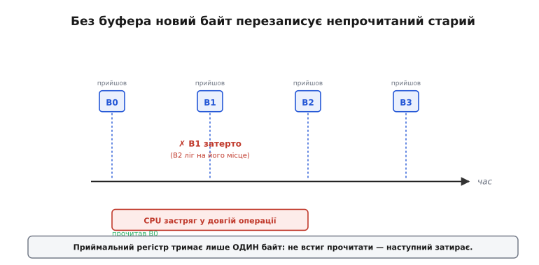
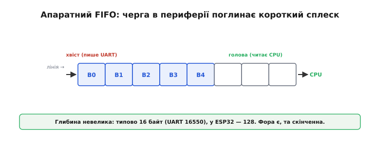
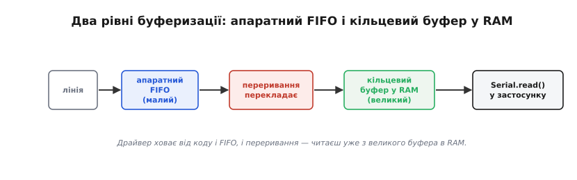
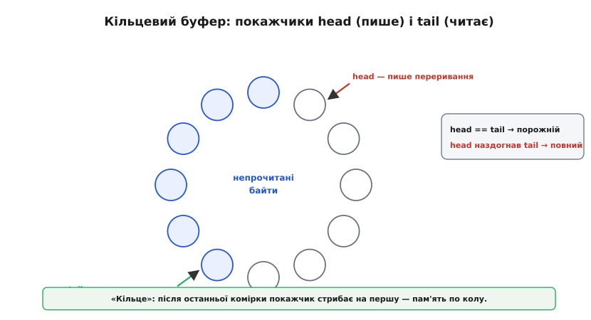
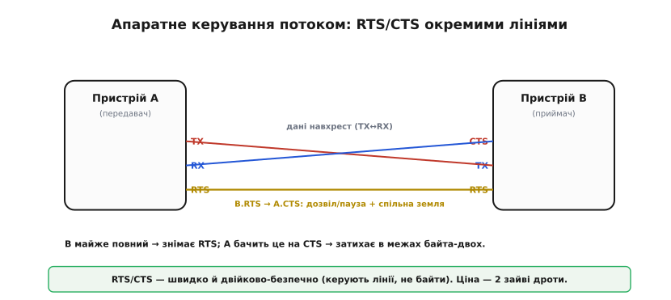
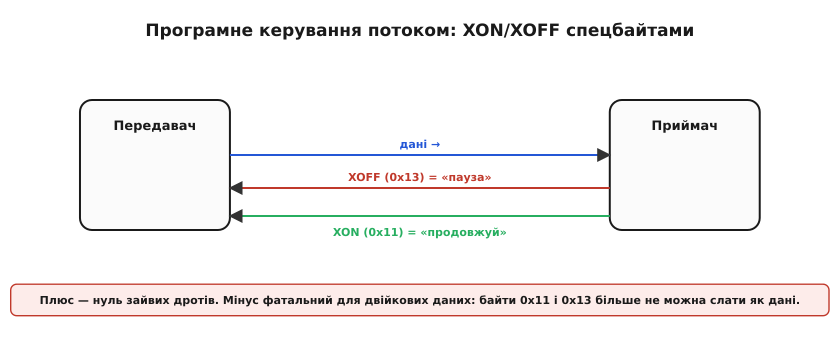

# Керування потоком

В асинхронній лінії передавач — повний господар часу: він шле байт, коли захоче, і нікого не питає, чи готовий приймач. А приймач — звичайний процесор, який і без того зайнятий: щось рахує, моргає світлодіодом, чекає інший давач. І ось у цьому розриві — байти приходять за розкладом передавача, а забирає їх процесор за своїм — ховається ціла родина підступних збоїв. Боротьба з ними тримається на двох опорах: **буфер** згладжує неузгодженість у часі, а **керування потоком** (англ. *flow control* — «керування течією») дозволяє приймачеві сказати передавачеві «зачекай». Перше терпить, доки може; друге втручається активно — і саме воно тут головне.

### Проблема: байт прийшов, а його нема кому забрати

Уявімо найнаївнішу схему: у приймача є один-єдиний регістр, куди UART кладе щойно прийнятий байт, а процесор має його звідти забрати. Поки процесор устигає прочитати кожен байт до приходу наступного — усе гаразд. Та варто йому на мить відволіктися на довшу операцію — і станеться біда.


*Один регістр тримає лише один байт; не встигли його забрати — наступний затирає. Це переповнення приймача (англ. overrun — «переповнення через край»).*

Це **переповнення** (*overrun*) — втрата байта через те, що його не встигли забрати. Воно тихе й підступне: жодного «дзвінка», просто в потоці зникає байт, і повідомлення розсипається. Корінь проблеми — фундаментальна риса асинхронності: передавач не знає й не зважає на те, чим зараз зайнятий приймач. Отже, потрібен спосіб **притримати** прибулі байти, поки процесор до них дійде.

### Апаратний FIFO: черга в периферії

Перший рівень захисту вбудований у саму периферію UART — це невелика **черга** типу «перший прийшов — перший вийшов» (англ. *FIFO, first-in-first-out*). Замість одного регістра приймач має чергу з кількох комірок: нові байти стають у її хвіст, а процесор забирає їх із голови — і вже не мусить ловити кожен байт «у момент».


*Глибина FIFO невелика: типово 16 байт (як у класичного UART 16550), у потужніших чипах на кшталт ESP32 — 128 байт на приймання. Це дає процесору фору, але й вона скінченна.*

FIFO дає дорогоцінну **фору**: процесор може на мить відволіктися — байти зачекають у черзі, а не зникнуть. Та глибина її невелика (історичні 16 байт, у ESP32 — 128), тож якщо процесор затримається надовго, переповниться і вона — і знову почнуться втрати. FIFO згладжує **короткі** сплески, але не рятує від тривалої зайнятості.

### Два рівні: FIFO плюс кільцевий буфер

Тому драйвери надбудовують над апаратним FIFO другий, набагато більший буфер — уже в оперативній пам'яті. Працює це у зв'язці з [перериваннями](topic:hw-arch/interrupts): коли в FIFO накопичуються байти, периферія викликає переривання, і короткий обробник (англ. *ISR, interrupt service routine* — «підпрограма обслуговування переривання») швидко перекладає байти з малого апаратного FIFO у великий програмний буфер. Застосунок же читає вже з цього буфера, коли йому зручно.


*Саме з програмного буфера й читає твій код; драйвер ховає від нього і FIFO, і переривання.*

Ось чому `Serial.read()` майже ніколи не «ловить момент»: він просто дістає байт із великого програмного буфера, який тихо наповнюється у фоні через переривання. Чим більший цей буфер, тим довшу зайнятість процесора потік переживе без втрат.

### Як влаштований кільцевий буфер

Той програмний буфер майже завжди — **кільцевий** (англ. *ring / circular buffer* — «кільцевий буфер»). Ідея елегантна: беремо звичайний масив, але вважаємо, що після останньої комірки знову йде перша — пам'ять використовується «по колу». Двома покажчиками стежимо за станом: **head** (куди переривання **пише** наступний байт) і **tail** (звідки застосунок **читає**).


*Коли tail доганяє head — буфер порожній (нема що читати); коли head, обійшовши коло, ось-ось наздожене tail — буфер повний (класти нікуди).*

Поки head попереду tail — між ними лежать непрочитані байти. Коли застосунок усе вичитав, tail доганяє head — буфер порожній. А якщо застосунок лінується, head, обійшовши коло, ось-ось наздожене tail ззаду — буфер **повний**, і класти нікуди. Що робити в цю мить — або викинути новий байт, або затерти найстаріший, — але хай там як, це знову **втрата даних**. Тобто навіть великий буфер лише **відсуває** межу, за якою процесор «не справляється», але не скасовує її.

> Реалізувати кільце правильно складніше, ніж здається: запис із переривання й читання з основного коду йдуть одночасно, тож порядок дій із head/tail має бути таким, щоб байт ніколи не «розірвало» навпіл. Робочий, безпечний для переривань код кільця — у вставці [«Кільцевий буфер у C»](topic:com-transport/flow-control/proj-ring-buffer.md).

**Приклад (наскільки великий буфер потрібен).** Припустимо, лінія працює на 115200 8N1 (для [кадру 8N1](topic:com-devices/uart-frame) це ≈ 11520 байт/с, або один байт за 86.8 мкс), а процесор раз у раз застрягає на 10 мс — скажімо, записуючи щось у flash. Скільки байтів прилетить за цей час?

```c
// один байт за T = 10 / 11520 с = 86.8 мкс
uint32_t bytes_lost = 10000 / 86.8;   // мкс блокування / мкс на байт
// bytes_lost ≈ 115
```

Отже, щоб пережити навіть одну таку 10-мілісекундну затримку без втрат, потрібен буфер **щонайменше на 115 байт**. Якщо затримки довші або потік щільніший — буфера вже не вистачить, і доведеться брати інший інструмент: **зупиняти передавача**.

> 🔧 **Навіщо це.** Звідси випливає головна практична заповідь роботи з UART: **не блокуй надовго цикл, що читає лінію**. Довгий `delay()`, повільний запис у flash, важкий друк — усе це наповнює буфер, і якщо потік активний, дані почнуть зникати (це той самий мотив [«delay() — зло»](topic:sf-devices/nonblocking-time), що й у роботі з часом без блокування). Якщо переповнення таки трапляються, у тебе три виходи: **збільшити буфер**, **читати частіше** (не блокувати) або **увімкнути керування потоком**.

### Коли буфера замало: апаратне керування потоком RTS/CTS

Буфер — пасивний захист: він терпить, доки може. **Керування потоком** — активне: воно дає приймачеві спосіб **наказати** передавачеві зробити паузу, перш ніж буфер лусне. Цей зворотний тиск «знизу вгору» — від перевантаженого приймача до спритного передавача — інженери називають **протитиском** (англ. *backpressure* — «зустрічний, зворотний тиск»): повільний споживач притримує швидкого постачальника, щоб черги не переповнились. Класичний апаратний варіант протитиску — лінії **RTS** (англ. *Request To Send* — «запит на передавання») і **CTS** (англ. *Clear To Send* — «дозвіл передавати»), дві додаткові до TX/RX.


*Керування йде окремими лініями, тож не заважає даним — можна передавати будь-які байти, зокрема двійкові. Ціна — дві зайві лінії.*

Механіка проста й надійна. Приймач керує лінією, що йде на вхід CTS передавача: «можна слати» / «зачекай». Щойно буфер приймача підходить до краю, він знімає дозвіл — і передавач, побачивши це на CTS, **затихає** в межах байта-двох, аж поки приймач не розвантажиться й не дозволить знову. Головна сила тут — що все це робить апаратура, без участі програми: реакція майже миттєва, і вона не з'їдає тактів процесора, навіть коли той зайнятий чимось іншим.

> Назви RTS і CTS родом із [RS-232](topic:com-medium/rs-485-multidrop-bus), де вони були сигналами рукостискання між комп'ютером і модемом: «я хочу слати» — «можеш слати». У сучасних вбудованих лініях їх застосовують уже як чистий протитиск приймача («мій буфер майже повний — притримай»), тож історична назва трохи ширша за нинішню роль.

### Без зайвих дротів: XON/XOFF

Якщо двох зайвих дротів немає (а часто лінія — це лише TX/RX/GND), застосовують **програмне** керування потоком — **XON/XOFF** (англ. *transmit on / transmit off* — «передавання увімкнути / вимкнути»). Тут «стоп» і «можна» передаються не окремими лініями, а **спеціальними байтами** у зворотному напрямку: **XOFF** (код 0x13) означає «пауза», **XON** (0x11) — «продовжуй».


*Плюс — жодних зайвих дротів. Мінус фатальний для двійкових даних: байти 0x11 і 0x13 тепер не можна передавати як звичайні дані.*

Перевага очевидна — нуль додаткових дротів, працює крізь будь-який послідовний канал. Коди ці не випадкові: 0x11 і 0x13 — це керівні символи DC1 і DC3 із таблиці ASCII (на терміналі це Ctrl+Q і Ctrl+S), які ще телетайп Model 33 наприкінці кадру вмикав і вимикав стрічкозчитувач — звідти й пара «увімкнути / вимкнути потік». Але є й вада, яка перекреслює цей спосіб для багатьох задач: коди 0x11 і 0x13 тепер **зарезервовані** під керування, тож їх не можна слати як корисні дані. Для тексту (де таких байтів не буває) це чудово, а для **двійкового** потоку — неприйнятно: випадковий байт 0x13 у даних приймач сприйме як «стоп». Тому правило таке: XON/XOFF — для тексту, RTS/CTS — для двійкових даних.

### Зупиняти заздалегідь: водяний знак

Лишилася тонкість, без якої керування потоком не працює. Сигнал «стоп» не діє миттєво: поки він дійде до передавача, а той відреагує, кілька байтів уже **в дорозі** й однаково прибудуть. Тому подавати «стоп» треба **не тоді, коли буфер повний, а раніше** — лишивши зверху запас на ці байти.


*Поріг спрацьовування називають водяним знаком (англ. high/low watermark — «верхній/нижній рівень»), за слідом, який лишає вода на стінці посудини.*

Звідси два пороги — **верхній** (подати «стоп») і **нижній** (подати «далі»): такий гістерезис не дає сигналам смикатися щобайта. А загальна картина проста: більшість простих ліній обходяться **зовсім без** керування потоком — три дроти, досить великий буфер і дисципліна «не блокувати». Керування вмикають лише тоді, коли сплески справді переростають буфер або передавач помітно швидший за приймача.

> 🔧 **Навіщо це.** Практичний порядок дій, коли лінія «губить» дані: спершу переконайся, що **не блокуєш** цикл читання; далі **збільш буфер** під найгірший сплеск (порахуй його, як у прикладі вище); і лише якщо потік справді заливає приймача — вмикай **керування потоком** (RTS/CTS для двійкових даних, XON/XOFF — для тексту). А якщо керування таки потрібне, не забудь про запас на «байти в дорозі»: зупиняй заздалегідь.

Буфери й керування потоком розв'язують лише одну частину задачі — надійно **доставити** окремі байти, не втративши їх ні на фізичному рівні, ні через зайнятість процесора. Але потік байтів сам по собі ще не повідомлення: де воно починається, де закінчується, чи не побилося в дорозі? Сирий UART цього не знає — він возить байти, а не змісти. Щоб із байтів зібрати надійне **повідомлення**, поверх UART будують власний [пакет](topic:com-transport/packet-design) із заголовком, довжиною й контрольною сумою.
