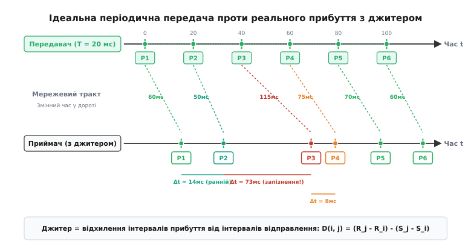
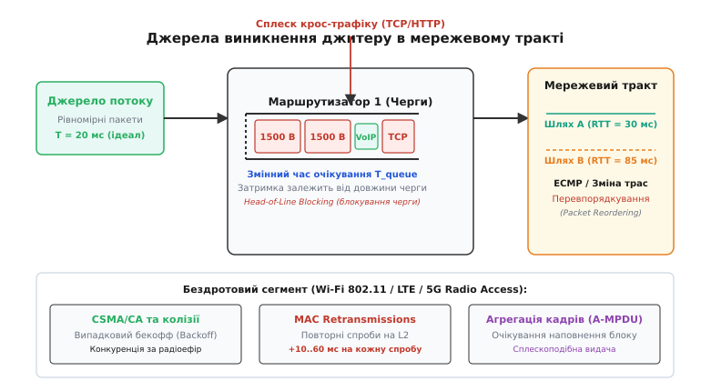
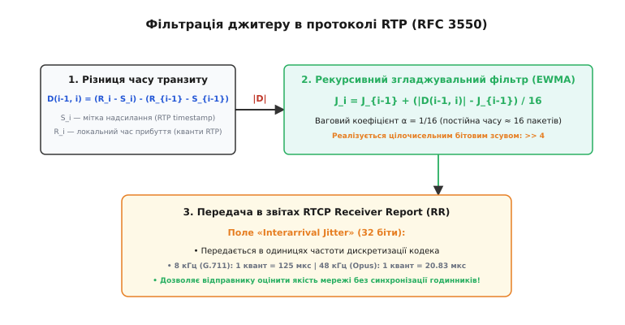
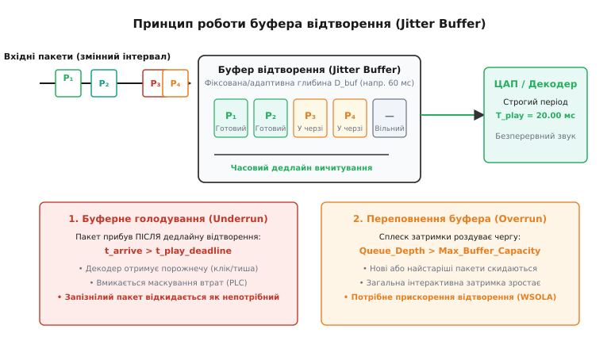
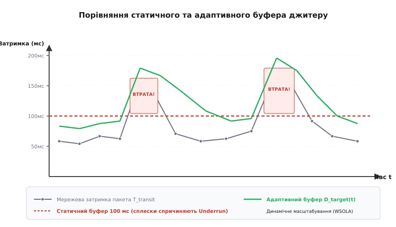

# Джитер: варіація затримки

<preknowlist>
- [Затримка й надійність](root:com-transport/latency-reliability) — одностороння затримка передавання (One-Way Delay) та складові мережевого тракту.
- [Черги в мережах](root:com-transport/queue-theory-networks) — механізм накопичення пакетів у буферах маршрутизаторів та варіація часу очікування.
- [RTP і RTCP](root:com-protocol/rtp-rtcp) — структура заголовків потокового протоколу, часові мітки та порядкові номери.
</preknowlist>

Коли голосовий кодек формує аудіопакет кожні 20 мілісекунд, асинхронна мережа з комутацією пакетів руйнує цю часову періодичність: один пакет долітає за 40 мс, наступний потрапляє в чергу комутатора і прибуває через 120 мс, а третій наздоганяє його за 45 мс. Якщо спрямувати такий нерівномірний потік безпосередньо на цифро-аналоговий перетворювач звукової карти, динамік замовкне в очікуванні запізнілого фрагмента, а потім отримає два пакети поспіль, спричинивши тріск і спотворення мови.


*Часова шкала передавання пакетів: передавач генерує пакети з фіксованим кроком у 20 мс, проте внаслідок коливань затримки в транзитних вузлах інтервали між надходженнями на стороні приймача хаотично змінюються від 8 до 73 мс.*

**Джитер** (від англ. *jitter* — «тремтіння, нервове смикання»; лат. *variatio* — зміна) — це статистична варіація затримки передавання пакетів у часі (Packet Delay Variation, PDV). У цифровому зв'язку цей термін позначає відхилення фактичного інтервалу між надходженням сусідніх пакетів від інтервалу їхнього відправлення. Для файлового трафіку (FTP, HTTP-завантаження) джитер непомітний, оскільки протокол TCP складає байти у фоновому режимі; проте для потокових сервісів реального часу (VoIP, відеоконференції, хмарний рендеринг і дистанційне керування) непередбачуваність часу прибуття виявляється критичнішою за саму величину затримки.

---

### Звідки береться джитер: анатомія мережевої мінливості

Повний час проходження пакета через мережевий шлях складається з чотирьох фізичних компонентів: часу поширення сигналу в середовищі, часу серіалізації на вихідному порту, часу апаратної обробки в комутаторі та часу очікування у чергах буферної пам'яті:

```
T_total = T_propagation + T_serialization + T_processing + T_queue
```

Час поширення `T_propagation` визначається швидкістю світла в оптичному волокні або мідному кабелі (приблизно 5 мікросекунд на кілометр) і є абсолютно сталим для фіксованого географічного маршруту. Час серіалізації `T_serialization = L_packet / C_link` залежить лише від розміру кадру та бітової швидкості інтерфейсу (наприклад, кадр розміром 1500 байтів передається портом 1 Гбіт/с рівно за 12 мікросекунд). Час апаратної обробки заголовка в кремнії мережевого процесора (ASIC) становить частки мікросекунди і практично не має розкиду.

Єдиним джерелом нестабільності залишається **час перебування в буферах черг `T_queue`** на кожному проміжному вузлі маршруту.


*Фізичні причини виникнення джитеру: пульсуючий крос-трафік та блокування початку черги великими TCP-кадрами в маршрутизаторах, динамічна зміна маршрутів (ECMP) та конкуренція за радіоефір у бездротових мережах.*

Мінливість черг породжується чотирма основними мережевими явищами:

1. **Мультиплексування та пачковий фоновий трафік (Cross-Traffic Bursts):**
   Мережевий комутатор обслуговує сотні паралельних з'єднань через спільний вихідний інтерфейс. Коли сусідній клієнт ініціює завантаження файлу або перегляд веб-сторінки, протокол TCP надсилає сплеск із десятків повнорозмірних сегментів (MTU = 1500 байтів). Якщо в цей момент до черги надходить малий голосовий UDP-пакет (наприклад, 60 байтів із кодека G.711), він змушений чекати завершення передачі всіх попередніх кадрів. На лінії 100 Мбіт/с черга з 30 повнорозмірних пакетів створює раптову затримку:
   ```
   T_queue = (30 · 1500 · 8) / 100 000 000 = 3.6 мс
   ```
   На повільніших висхідних каналах (наприклад, ADSL або 10 Мбіт/с Uplink) ця затримка підскакує до 36 мс, перетворюючи плавний потік на дискретні пачки.

2. **Блокування початку черги (Head-of-Line Blocking) та різнорозмірні кадри:**
   За відсутності механізмів пріоритезації трафіку малий аудіопакет опиняється безпосередньо позаду 1500-байтового пакета, чия передача через порт уже розпочалася. Оскільки комутатор не може перервати розпочатий кадр на канальному рівні (L2 Frame Preemption доступний лише в спеціалізованих стандартах типу IEEE 802.1Qbu TSN), пакет реального часу щоразу зазнає випадкового квантування затримки від 0 до `T_frame_max`.

3. **Багатошляхова маршрутизація та перевпорядкування (ECMP та Route Flapping):**
   У магістральних мережах маршрутизатори використовують балансування за рівноцінними маршрутами (Equal-Cost Multi-Path, ECMP). Якщо алгоритм хешування перемикає пакети на інший фізичний лінк, або під час збіжності протоколів динамічної маршрутизації (OSPF, BGP) змінюється топологія, пакети одного сеансу проходять траси різної фізичної довжини. Це не тільки породжує джитер у десятки мілісекунд, але й спричиняє прибуття пакетів у зворотному порядку (Packet Reordering).

4. **Конкуренція та повторні передачі в бездротових мережах (Wi-Fi, LTE, 5G):**
   У мережах Wi-Fi (IEEE 802.11) протокол доступу CSMA/CA вимагає від вузла прослуховування ефіру та вичікування випадкового інтервалу (Exponential Backoff) перед кожним кадром. Якщо виникає колізія або рівень сигналу падає через завмирання, канальний рівень виконує автоматичні повторні передачі (MAC Retransmissions), додаючи від 10 до 80 мс на кожен збійний кадр. Додатковим фактором є агрегація кадрів (A-MPDU): передавач накопичує кілька пакетів перед спільним відправленням у радіоефір, перетворюючи рівномірний вхідний потік на серію сплесків.

5. **Явище роздування буферів (Bufferbloat):**
   Маршрутизатори та кабельні модеми часто оснащуються надлишково великими буферами оперативної пам'яті (мегабайти замість кількох кілобайт), щоб уникнути скидання пакетів. Коли протокол TCP розганяє швидкість передачі, він повністю заповнює цей буфер. У результаті виникає "стояча черга" (Standing Queue), через яку голосові та ігрові пакети проводять у пам'яті модема сотні мілісекунд, а джитер зростає пропорційно активності завантаження файлів.

---

### Математичні стандарти вимірювання: PDV проти Inter-arrival Jitter

У мережевій інженерії склалися два підходи до кількісної оцінки варіації затримки, стандартизовані різними робочими групами IETF:

```
                            Стандарти оцінки джитеру
                                       │
                ┌──────────────────────┴──────────────────────┐
                ▼                                             ▼
       IETF IPPM (RFC 3393 / RFC 5481)                IETF AVT (RFC 3550)
        Метрологічна оцінка каналу                Оперативна фільтрація потоку
       IPDV = (R_j - R_i) - (S_j - S_i)           J_i = J_{i-1} + (|D| - J_{i-1})/16
```

#### Інтервальний джитер RTP (RFC 3550)
Протокол передавання медіаданих реального часу RTP використовує різницю інтервалів надходження для постійної оцінки якості зв'язку без синхронізації годинників вузлів. Для кожної пари послідовно отриманих пакетів `i-1` та `i` обчислюється різниця транзитного часу:

```
D(i-1, i) = (R_i - S_i) - (R_{i-1} - S_{i-1})
```

де `S_i` — часова мітка відправника в заголовку RTP (RTP Timestamp), а `R_i` — локальний час прибуття пакета на приймач, виражений у тих самих одиницях частоти дискретизації.

Оскільки миттєве значення `|D|` зазнає різких стрибків, RFC 3550 застосовує низькочастотний авторегресійний фільтр першого порядку (Exponential Weighted Moving Average — EWMA) з ваговим коефіцієнтом `α = 1/16`:

```
J_i = J_{i-1} + (|D(i-1, i)| - J_{i-1}) / 16
```


*Конвеєр обчислення та передачі джитеру в протоколі RTP/RTCP: від різниці транзитного часу до цілочисельного рекурсивного фільтра EWMA та формування звітів Receiver Report.*

Коефіцієнт `1/16` обрано через апаратну ефективність: ділення на 16 виконується однотактовим правим бітовим зсувом `>> 4`. Постійна часу фільтра становить приблизно 16 пакетів, що для стандартного 20-мілісекундного голосового кадру дає вікно згладжування `16 · 20 = 320` мс.

Докладне математичне виведення взаємного скорочення зсуву годинників, частотний аналіз в Z-просторі та числовий розрахунок наведено у вставці [Математичний апарат оцінювання джитеру](root:com-transport/jitter/math-rtp-jitter.md).

#### Метрики IPDV та PDV (RFC 3393 та RFC 5481)
Для паспортизації каналів зв'язку та SLA-угод (Service Level Agreement) використовують дві метрики:
1. **1-Point Packet Delay Variation (PDV):** зміна затримки пакета відносно базової мінімальної затримки маршруту за певний вимірювальний інтервал:
   ```
   PDV_k = T_transit_k - min_{i}(T_transit_i)
   ```
   Ця величина показує точний обсяг буферної пам'яті, необхідний для запобігання втратам пакетів.
2. **2-Point Packet Delay Variation (IPDV, RFC 3393):** різниця затримок між двома послідовними або фіксовано рознесеними пакетами.

---

### Вплив джитеру на прикладні системи реального часу

Джитер впливає на різні класи потокових додатків залежно від їхньої чутливості до затримки та архітектури декодера.

```
       Чутливість додатків до мережевого джитеру та допустимі пороги
─────────────────────────────────────────────────────────────────────────────
  Додаток             Допустимий джитер      Критичний наслідок порушення
─────────────────────────────────────────────────────────────────────────────
  VoIP / SIP          < 20–30 мс             Буферне виснаження, тріск, втрата складів
  Відеоконференції    < 30–50 мс             Розрив опорних кадрів, застигання картинки
  Хмарний геймінг     < 5–10 мс              Мікрофризи, розрив плавного введення (stutter)
  FPV / Автопілот     < 2–5 мс               Втрата запасу стійкості в контурі керування
─────────────────────────────────────────────────────────────────────────────
```

#### Голосовий зв'язок (VoIP) та аудіопотоки
Людський слух надзвичайно чутливий до переривань фазової структури мовного сигналу. Якщо черговий 20-мілісекундний блок звуку не надійшов до моменту спрацьовування таймера ЦАП, звуковий драйвер стикається з **буферним виснаженням (Buffer Underrun)**. У кращому випадку звукова карта видає фрагмент попереднього звуку або згенерований білий шум (Packet Loss Concealment, PLC); у гіршому — виникає характерне металеве клацання чи «роботизація» голосу. Згідно з рекомендаціями ITU-T G.114, затримка «з уст у вухо» не повинна перевищувати 150 мс, тому нескінченно збільшувати очікування неможливо.

#### Відеоконференції та відеотрансляції
Сучасні [відеокодеки](root:com-transport/video-transmission) (H.264, HEVC, AV1) використовують міжкардове стиснення: великий ключовий кадр (I-frame, IDR) розбивається мережевим рівнем на 10–30 окремих UDP-пакетів через обмеження MTU (1500 байтів). Якщо хоча б один із цих пакетів затримається в мережі через джитер, декодер не зможе зібрати повний кадр і зупинить відтворення всього відеопотоку до надходження наступного ключового кадру, спричиняючи "завмирання" (Freeze) з подальшим різким прискоренням.

#### Хмарний геймінг та FPV-пілотування
У системах дистанційного керування та рендерингу (GeForce NOW, управління безпілотниками) екран оновлюється з частотою 60 або 120 Гц (кадр кожні 16.6 або 8.3 мс). Джитер величиною в 10 мс призводить до пропуску кадрової синхронізації (V-Sync drop): користувач бачить мікроривки картинки (Micro-stuttering) та відчуває запізнення реакції на джойстик, що в задачах автопілотування руйнує стійкість [петлі зворотного зв'язку](root:com-transport/latency-reliability).

---

### Механізм компенсації: буфери відтворення (Jitter Buffer)

Єдиним способом нейтралізації мережевого джитеру на боці приймача є введення контрольованої штучної затримки за допомогою **буфера відтворення (Jitter Buffer)**.

Принцип роботи полягає у перетворенні стохастичного вхідного потоку на строго періодичний вихідний потік шляхом накопичення черги пакетів. Приймач штучно відкладає момент початку відтворення першого пакета на час `D_target`. Усі наступні пакети, що прибувають раніше за свій розрахунковий графік, очікують у черзі FIFO; пакети, що затримуються в дорозі, встигають прибути до настання свого дедлайну відтворення.


*Архітектура буфера відтворення: пакети з нерівномірними інтервалами надходження впорядковуються в черзі та видаються на ЦАП зі строгим періодом. Запізнілі пакети спричиняють виснаження (Underrun), а надлишковий наплив — переповнення (Overrun).*

Буфер відтворення стикається з двома граничними станами:
1. **Буферне виснаження (Underrun / Underflow):** пакет прибув після настання дедлайну `t_arrive > t_play_deadline`. Декодер змушений заповнювати паузу алгоритмом маскування (PLC), а сам запізнілий пакет після прибуття просто викидається (Late Drop).
2. **Переповнення буфера (Overrun / Overflow):** черга пакетів роздувається понад виділену ємність оперативної пам'яті. Нові або найстаріші кадри скидаються, а загальна затримка системи стає неприйнятно високою.

---

### Статичний проти адаптивного буфера

Вибір глибини буфера відтворення становить фундаментальний інженерний компроміс:

```
        Мала затримка буфера                  Велика затримка буфера
  ┌───────────────────────────────┐     ┌───────────────────────────────┐
  │ Низька інтерактивна затримка  │     │ Відсутність випадань звуку    │
  │ Ризик частих Underrun-втрат   │     │ Надмірне розтягнення затримки │
  └───────────────────────────────┘     └───────────────────────────────┘
```

#### Статичний буфер (Static Jitter Buffer)
Має жорстко задану фіксовану затримку (наприклад, 50 мс).
- **Переваги:** абсолютна простота, нульове навантаження на процесор, стабільна тривалість аудіокадрів.
- **Недоліки:** не здатний реагувати на деградацію зв'язку (при сплеску джитеру до 80 мс починаються масові випадання звуку), а на якісних каналах додає зайву невиправдану затримку.


*Поведінка буферів під час сплесків мережевої затримки: статичний поріг призводить до втрати запізнілих пакетів, тоді як адаптивний буфер динамічно збільшує затримку, відстежуючи статистику каналу.*

#### Адаптивний буфер (Adaptive Jitter Buffer, AJB)
Постійно оцінює математичне сподівання `E[D]` та середньоквадратичне відхилення `σ_D` затримки надходження пакетів за останні кілька секунд. Оптимальна цільова затримка обчислюється динамічно:

```
D_target(t) = E[D] + k · σ_D
```

де коефіцієнт `k` (зазвичай від 3 до 4) обирається відповідно до правила трьох сигм для гарантії доставки 99.7% пакетів.

#### Як змінювати розмір буфера під час відтворення звуку
Головна складність адаптивного буфера полягає в тому, що звукова карта вимагає неперервного потоку семплів: не можна раптово змінити затримку черги, не створивши артефакту відтворення. Для безшовного масштабування застосовують два підходи:

1. **Корекція в паузах мовлення (Voice Activity Detection, VAD):**
   Під час розмови людина робить природні паузи між словами і реченнями. Детектор голосової активності (VAD) розпізнає тишу (Comfort Noise Generation, CNG), під час якої алгоритм розширює або стискає тривалість паузи на 10–50 мс без жодного акустичного спотворення для слухача.
2. **Масштабування часу без зміни тональності (WSOLA):**
   Якщо мова триває безперервно, а буфер необхідно терміново спорожнити або розширити, застосовують алгоритм WSOLA (Waveform Similarity Overlap-Add). Він знаходить схожі періоди фундаментального тону голосу і плавно зміщує фазу на 5–10%, скорочуючи або розтягуючи сигнал у часі без зміни висоти звуку (Pitch Shifting).

Повна практична реалізація черги з оцінкою джитеру представлена у вставці [Реалізація адаптивного буфера джитеру на C та C++](root:com-transport/jitter/proj-jitter-buffer.md). Детальний алгоритмічний аналіз методів розтягнення сигналів розглядається в статті [Алгоритм буфера джитеру](root:com-signal/jitter-buffer).

---

### Конвеєр обробки медіапотоку в WebRTC (Архітектура NetEQ)

У сучасних веб-браузерах та мобільних додатках обробка джитеру інтегрована в єдиний конвеєр адаптації звуку, відомий як підсистема **NetEQ** (розроблена Global IP Solutions, нині частина рушія Google WebRTC):

```
UDP Пакети ──► [ Модуль статистики джитеру ] ──► [ Оцінка квантиля затримки ]
                      │                                    │
                      ▼                                    ▼
               [ Черга пакетів ]                 [ Контролер рішень ]
                      │                                    │
                      ▼                                    ▼
               [ Аудіодекодер ] ──► [ DSP Модуль: WSOLA / PLC / Merge ] ──► Аудіокарта
```

Контролер рішень NetEQ щомиті аналізує рівень заповненості черги, частоту втрат і статистику джитеру, обираючи один із режимів обробки для чергового аудіокадру:
- **Normal:** пакет доступний у черзі, декодується і відтворюється без змін (1:1).
- **Expand (PLC):** пакет запізнився або загубився. Генерується синтетичне продовження попереднього звукового відрізка зі спадом енергії.
- **Preemptive Expand:** затримка мережі починає зростати; щоб уникнути майбутнього виснаження, поточний кадр злегка розтягується в часі (на 5–10 мс) за допомогою WSOLA, створюючи запас у черзі.
- **Accelerate:** мережевий сплеск минув, буфер містить забагато накопичених пакетів. Кадр стискається в часі через WSOLA, непомітно зменшуючи інтерактивну затримку розмови.
- **Merge:** згладжування фази між згенерованим PLC-кадром і наступним нарешті прибулим пакетом, що запобігає виникненню акустичного клацання.

---

### Вимірювання та діагностика в протоколах RTP/RTCP та TWAMP

Для моніторингу якості мережі протокол RTCP регулярно (кожні кілька секунд) обмінюється контрольними пакетами між усіма учасниками сеансу.

Приймач формує звіт **RTCP Receiver Report (RR)**, який містить:
- **Fraction Lost:** частка втрачених пакетів за останній звітний інтервал (число від 0 до 255);
- **Cumulative Packets Lost:** сумарна кількість втрачених пакетів за всю сесію;
- **Interarrival Jitter:** поточна оцінка джитеру `J_i`, виражена в одиницях частоти дискретизації медіапотоку;
- **LSR (Last Sender Report Timestamp)** та **DLSR (Delay Since Last Sender Report):** поля для точного розрахунку кругової затримки (RTT) відправником без взаємної синхронізації часу.

Детальний бінарний формат пакетів RTCP, правила складених пакетів (Compound Packets) та формули вилучення затримок розібрано у вставці [Формат звітів RTCP та розрахунок мережевих метрик](root:com-transport/jitter/api-rtcp-jitter.md).

Для високоточного апаратного вимірювання джитеру в опорних мережах телеком-операторів застосовують протокол **TWAMP (Two-Way Active Measurement Protocol, RFC 5357)**. Він використовує апаратні таймштампи мережевих адаптерів (Hardware PTP Timestamping) на фізичному рівні, що дозволяє вимірювати джитер із точністю до одиниць наносекунд.

---

### Джитер у сучасних стандартах: 5G URLLC та Time-Sensitive Networking (TSN)

Традиційний підхід до проектування пакетних мереж ("Best Effort") сприймає джитер як неминуче зло, яке компенсується буферами на приймачі. Проте в промисловій автоматизації, тактильному інтернеті та безпілотному транспорті затримка буфера відтворення є неприпустимою. Нове покоління стандартів усуває джитер детерміністичними методами на рівні середовища передавання:

1. **IEEE 802.1Qbv Time-Aware Shaper (TAS) у TSN:**
   Комутатори відкривають і закривають вихідні черги за строгим розкладом, синхронізованим через протокол точного часу IEEE 1588 (PTP). Для критичного трафіку виділяються персональні часові вікна (Time Slots), під час яких передача будь-якого фонового трафіку блокується. Це гарантує нульову чергу (`T_queue = 0`) і знижує джитер до субмікросекундного рівня.
2. **IEEE 802.1Qbu / 802.3br Frame Preemption:**
   Дозволяє комутатору перервати передачу звичайного 1500-байтового кадру просто посередині байтового потоку, негайно пропустити терміновий пакет реального часу і після цього відновити передачу фонового кадру з місця зупинки. Це повністю ліквідує блокування початку черги (Head-of-Line Blocking).
3. **5G URLLC (Ultra-Reliable Low-Latency Communication):**
   У стандарті 3GPP Release 16 впроваджено гнучкий розподіл слотів радіоінтерфейсу (Mini-slots тривалістю 0.125 мс замість 1 мс), миттєве надання радіоресурсу без попереднього запиту (Configured Grants) та дублювання пакетів різними антенними масивами (Packet Duplication), що обмежує джитер у радіоканалі межею в 1 мс.

---

### Інженерні методи мінімізації джитеру в мережі

Компенсація джитеру буферами відтворення на приймачі — це завжди плата додатковою затримкою. Радикальне розв'язання проблеми полягає в мінімізації самого виникнення варіації затримки на рівні мережевої інфраструктури:

1. **Пріоритезація трафіку (QoS / DiffServ):**
   Маркування чутливих пакетів кодом **DSCP EF (Expedited Forwarding, DSCP 46 / CoS 5)**. Маршрутизатори розміщують такі пакети в окрему чергу суворого пріоритету (Strict Priority Queueing, PQ), яка спустошується раніше за будь-який фоновий TCP-трафік.
2. **Активне керування чергами (AQM проти Bufferbloat):**
   Традиційні буфери Tail Drop тримають сотні мегабайтів стоячої черги, створюючи гігантський джитер. Алгоритми активного керування (**CoDel**, **FQ-CoDel**, **CAKE**) ізолюють кожен потік у власну підчергу (Flow Queueing) і починають скидати пакети або встановлювати позначки ECN, щойно затримка очікування перевищує поріг у 5 мс, підтримуючи черги практично порожніми.
3. **Фрагментація та чергування на низькошвидкісних лініях (LFI):**
   На каналах з обмеженою смугою застосовують технологію **Link Fragmentation and Interleaving (LFI / Multilink PPP)**: великі TCP-кадри примусово нарізаються на фрагменти по 128 байтів, між якими апаратний планувальник вставляє аудіопакети, ліквідуючи блокування початку черги.
4. **Пріоритезація в бездротових мережах (WMM / 802.11e):**
   Стандарт Wi-Fi Multimedia розділяє трафік на 4 категорії доступу: `AC_VO` (Voice), `AC_VI` (Video), `AC_BE` (Best Effort), `AC_BK` (Background). Голосові кадри отримують зменшений інтервал очікування (AIFS) та менше вікно колізій (CWmin), виграючи право на передачу в ефір у 4–8 разів швидше за звичайні дані.

---

> 🔧 **Навіщо це.** Під час налаштування WebRTC-шлюзів, PBX-серверів Asterisk/FreeSWITCH або ігрового мережевого коду (Netcode):
> 1. Завжди диференціюй **постійну затримку** (яка залежить від географічної відстані) та **джитер** (який є симптомом перевантаження буферів або бездротових завад).
> 2. Якщо користувачі скаржаться на "роботизований голос" за нульового відсотка втрат у звітах пінгу — це ознака перевищення джитером розміру статичного буфера відтворення (Late Packet Drops). Перемкни буфер в адаптивний режим або розширте глибину до `MinDelay + 3·Jitter`.
> 3. На маршрутизаторах доступу обов'язково вмикай планувальник **FQ-CoDel** або **Cake**: вони усувають явище роздування буферів (Bufferbloat), знижуючи мережевий джитер під навантаженням із 300–500 мс до комфортних 2–4 мс.
