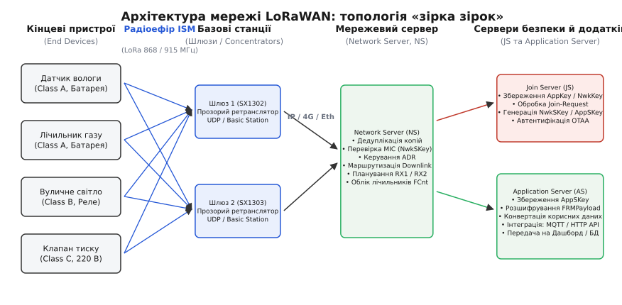
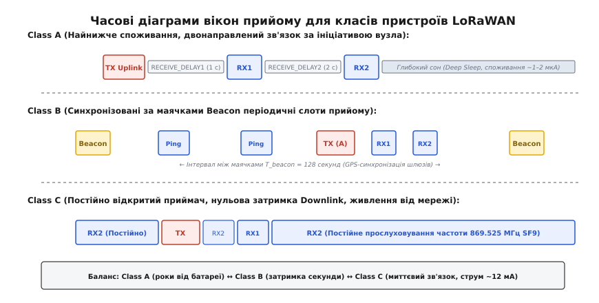
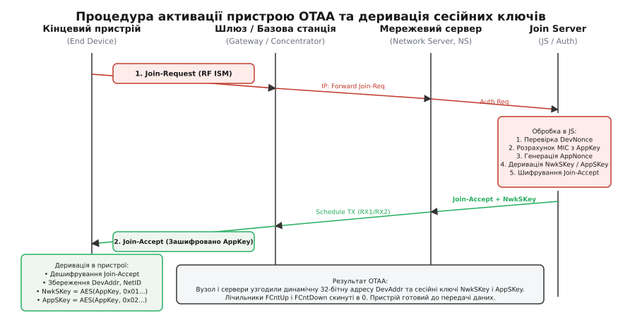
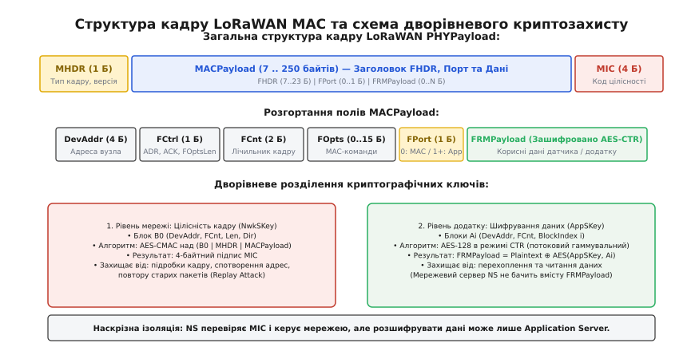
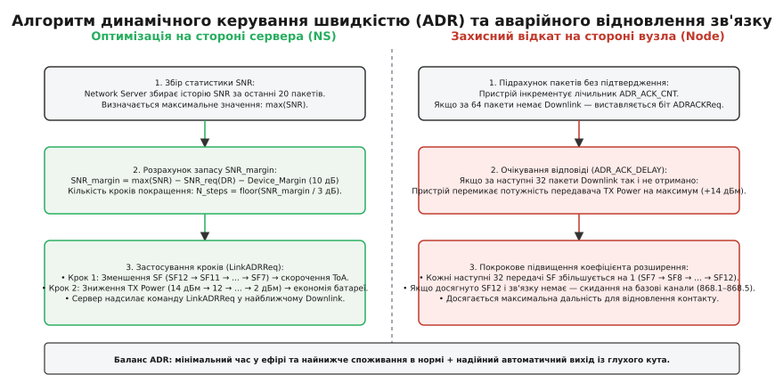

# LoRaWAN: архітектура глобальної мережі низького енергоспоживання

<preknowlist>
* [LoRa (чирп-модуляція)](root:com-modulation/lora)
* [ISM-діапазони](root:sys-notary/ism-bands)
* [Час у ефірі (Time on Air)](root:sys-notary/time-on-air)
* [Бюджет лінії зв'язку](root:com-medium/link-budget)
</preknowlist>

Автономний датчик тиску газу в підземному колодязі має передавати показники раз на годину протягом десяти років від однієї літій-тіонілхлоридної батареї ємністю 2.4 А·год. Якщо для зв'язку використати стільникову мережу LTE-M, модем під час реєстрації на базовій станції та підтримки сигнального протоколу витрачатиме десятки міліампер-годин на добу, вичерпавши заряд за кілька місяців. Класичний радіоканал LoRa на фізичному рівні здатний передати короткий кадр за 50 мілісекунд при середському струмі 30 мА, проте пряме радіоз'єднання не вирішує мережевих завдань: як скоординувати одночасний вихід в ефір десяти тисяч таких датчиків, як безпечно доставити зашифровані дані через базові станції різних власників та як адаптувати потужність передавача до мінливих радіозавад. Цю задачу вирішує LoRaWAN — відкритий протокол канального та мережевого рівнів, оптимізований для глобальних мереж низького енергоспоживання (англ. *Low-Power Wide-Area Networks*, LPWAN).

Історію створення альянсу LoRa Alliance, еволюцію специфікацій від LoRaMAC до сучасних релізів 1.0.4 та 1.1, а також відмову від часового розділення слотів на користь чистого ALOHA викладено в [історичному нарисі стандартизації](root:com-transport/lorawan/hist-lorawan-standard.md).

---

### Топологія мережі «зірка зірок» (Star-of-Stars)

Більшість класичних бездротових сенсорних мереж (Zigbee, 6LoWPAN, Thread) будуються на основі комірчастої топології (англ. *Mesh Topology*). У комірчастій мережі проміжні вузли працюють ретрансляторами, що змушує їх постійно тримати радіоприймач увімкненим для прослуховування ефіру, витрачаючи від 10 до 20 мА струму. За такого підходу батарейне живлення можливе лише на кінцевих листкових вузлах, а вся мережева інфраструктура потребує стаціонарного електроживлення.

LoRaWAN відмовляється від комірчастої ретрансляції на користь топології «зірка зірок» (англ. *Star-of-Stars*). Кінцеві пристрої передають радіопакети безпосередньо в ефір без попереднього опитування середовища чи прив'язки до конкретної базової станції.


*Архітектура мережі LoRaWAN: топологія «зірка зірок», де всі базові станції прозоро транслюють радіопакети до централізованого мережевого сервера*

Мережева архітектура LoRaWAN складається з п'яти функціональних сутностей:

1. **Кінцевий пристрій (End Device):** Сенсор або виконавчий вузол із автономним живленням. Пристрій не підтримує постійного зв'язку з жодною вишкою: він прокидається за власним таймером, випромінює радіопакет на випадково обраному каналі й негайно повертається в режим глибокого сну зі струмом споживання менше 1–2 мкА.
2. **Шлюз / Базова станція (Gateway):** Прозорий багатоканальний радіоретранслятор. Шлюз оснащено восьми- або шістнадцятиканальним концентратором (наприклад, Semtech SX1302/SX1303), здатним одночасно демодулювати пакети на різних коефіцієнтах розширення спектра (SF7–SF12) на фіксованій сітці частот. Шлюз не декодує корисне навантаження і не зберігає стану сесій: він загортає прийнятий сирий радіокадр у TCP/UDP-пакет (через протокол Semtech Packet Forwarder або Basestation) разом із точною міткою часу прийому, виміряним рівнем сигналу RSSI та співвідношенням сигнал/шум SNR, після чого пересилає його через IP-мережу (Ethernet, Wi-Fi, 4G/LTE) на мережевий сервер.
3. **Мережевий сервер (Network Server, NS):** Центральний інтелектуальний вузол мережі. Оскільки радіопакет від одного датчика одночасно фіксується кількома сусідніми шлюзами (просторова надмірність), Network Server виконує дедуплікацію пакетів (англ. *De-duplication*), залишаючи лише одну копію кадру з найкращими радіопоказниками. Крім того, мережевий сервер перевіряє цілісність повідомлення (MIC), керує адаптивною швидкістю передачі (ADR), вибирає оптимальний шлюз для надсилання відповіді (Downlink) з урахуванням залишкового бюджету робочого циклу передавача шлюзу та маршрутизує зашифровані прикладні дані до сервера додатків.
4. **Сервер активації (Join Server, JS):** Сервер безпеки, що зберігає довгострокові кореневі ключі пристроїв (`AppKey`, `NwkKey`). Під час бездротового підключення OTAA (Over-The-Air Activation) Join Server автентифікує пристрій, генерує одноразові сесійні ключі та передає їх мережевому серверу й серверу додатків, запобігаючи витоку криптографічних секретів через операторів базових станцій.
5. **Сервер додатків (Application Server, AS):** Кінцева точка прийому прикладних даних. Сервер додатків володіє сесійним ключем додатку `AppSKey`, розшифровує корисне навантаження `FRMPayload` і транслює показники датчиків через прикладні інтерфейси (MQTT, HTTPS, Webhooks) до бізнес-логіки користувача.

#### Міжоператорський роумінг (Backend Interfaces)
Для глобальних рішень відстеження вантажів (Asset Tracking) специфікація LoRaWAN Backend Interfaces визначає два стандартизовані протоколи роумінгу між незалежними операторами зв'язку:
- **Пасивний роумінг (Passive Roaming):** Гостьова мережа (Forwarding Network Server, fNS) прозоро приймає радіопакети пристрою та пересилає їх через IP-інтерфейс до домашнього мережевого сервера (Home Network Server, hNS) без зміни сесії.
- **Естафетний роумінг (Handover Roaming):** Повне делегування керування радіоканалом (включаючи генерацію команд ADR та вибір каналів) гостьовій мережі на час перебування пристрою в її географічній зоні покриття.

---

### Класи кінцевих пристроїв: Class A, Class B та Class C

Час автономної роботи датчика визначається тим, яку частку часу його радіотракт перебуває в режимі прийому (RX). Специфікація LoRaWAN визначає три функціональні класи кінцевих пристроїв, що пропонують різний компроміс між затримкою доставки команд від сервера (Downlink Latency) та енергоспоживанням.


*Часові діаграми вікон прийому для пристроїв Class A, Class B та Class C*

#### Class A (All / Baseline)
Базовий і найбільш енергоефективний клас, реалізація якого є обов'язковою для всіх пристроїв LoRaWAN. Вузол Class A більшу частину життя спить. Приймач пристрою повністю вимкнений і активується виключно після того, як вузол надішле висхідний пакет (Uplink).

Після закінчення передачі пристрій запускає два високоточні апаратні таймери для відкриття коротких вікон прийому:
- **Перше вікно прийому (RX1):** Відкривається рівно через `RECEIVE_DELAY1` секунд (за замовчуванням 1.0 с). Вікно відкривається на тій самій центральній радіочастоті, на якій транслювався висхідний Uplink, а швидкість передачі (Data Rate) дорівнює або зміщена на фіксовану величину від швидкості Uplink (`RX1DROffset`).
- **Друге вікно прийому (RX2):** Відкривається рівно через `RECEIVE_DELAY2` секунд (за замовчуванням 2.0 с, тобто через 1.0 с після відкриття RX1). Вікно відкривається на фіксованій загальносистемній частоті та швидкості (для плану EU868 — 869.525 МГц із Data Rate DR0 або DR3).

Тривалість прослуховування вікна прийому становить мінімально необхідний час для виявлення преамбули LoRa (зазвичай 5–8 символів, близько 10–30 мс). Якщо за цей час передвісник кадру не зафіксовано, радіочип негайно повертається в режим сну. Якщо сервер передав пакет у вікні RX1, друге вікно RX2 взагалі не відкривається.

#### Class B (Beacon)
Клас для пристроїв з періодичною синхронізацією, призначений для завдань, де сервер повинен мати можливість ініціювати передачу команди на датчик без очікування випадкового висхідного повідомлення (наприклад, дистанційне перекриття засувки газопроводу).

Кожні 128 секунд базові станції мережі синхронно випромінюють радіомаячок (англ. *Beacon*), прив'язаний до секундної мітки супутникового часу GPS (точність до мікросекунд). Маячок містить 8 байтів преамбули, 3 байти ідентифікатора мережі `NetID`, 4 байти точного часу в епосі GPS та 2 байти контрольної суми CRC.

Вузол Class B періодично прокидається для прийому маячка, калібрує внутрішній кварцовий генератор для усунення температурного дрейфу й відкриває короткі періодичні вікна прийому — пінг-слоти (англ. *Ping Slots*) тривалістю 30 мс. Періодичність слотів узгоджується з сервером за допомогою команди `PingSlotInfoReq` і обчислюється за формулою:
```
T_ping = 2^(12 - Periodicity) * 30 мс
```
де `Periodicity ∈ [0..7]`, що забезпечує інтервал між слотами від 1 до 128 секунд.

#### Class C (Continuous)
Клас для стаціонарних пристроїв із необмеженим живленням (вуличні ліхтарі, трансформаторні підстанції, розумні розетки). Приймач пристрою Class C увімкнений безперервно на параметрах другого вікна прийому RX2 у всі моменти часу, коли пристрій не зайнятий власною передачею в ефір.

Коли вузол Class C надсилає висхідний пакет, він відкриває вікно RX1 на частоті Uplink рівно через 1.0 с, а в проміжку між передачею та RX1 і після закінчення RX1 продовжує безперервно слухати канал RX2. Затримка доставки низхідних команд у Class C становить менше 50 мілісекунд, проте струм споживання (10–15 мА постійно) вимагає стаціонарної електромережі.

---

### Регіональні частотні плани та часові обмеження

Оскільки зв'язок LoRaWAN розгортається в неліцензованих частотних смугах ISM (Industrial, Scientific, Medical), параметри фізичного рівня суворо підпорядковуються національним радіорегламентам кожного географічного регіону.

```
Регіональний розподіл смуг:
+---------------+------------------------+---------------------+-------------------------------+
| Регіон        | Частотний діапазон     | Канали за замовч.   | Регуляторні обмеження         |
+---------------+------------------------+---------------------+-------------------------------+
| EU868 (ЄС)    | 863.00 – 870.00 МГц    | 868.1, 868.3, 868.5 | Duty Cycle 1% (G1) / 10% (G3) |
| US915 (США)   | 902.00 – 928.00 МГц    | 64+8 фіксованих     | Dwell Time ≤ 400 мс (FCC)     |
| AS923 (Азія)  | 920.00 – 925.00 МГц    | 923.2, 923.4        | LBT (Listen Before Talk)      |
+---------------+------------------------+---------------------+-------------------------------+
```

1. **EU868 (Європейський Союз):**
   Використовує динамічний частотний план. Специфікація визначає 3 обов'язкові базові канали (868.1, 868.3, 868.5 МГц зі смугою 125 кГц), які повинен підтримувати кожен вузол з фабричної прошивки. Додаткові 5 або більше каналів мережевий сервер призначає динамічно під час підключення через список `CFList` або команду `NewChannelReq`.
   *Часові обмеження:* Європейський стандарт ETSI EN 300 220 забороняє займати піддіапазон 868.0–868.6 МГц більше ніж на 1% часу (не більше 36 секунд сумарної передачі за одну годину для кожного пристрою). Для вікна RX2 використовується спеціальний піддіапазон 869.4–869.65 МГц (G3), де дозволено потужність випромінювання до +27 дБм (500 мВт) та робочий цикл до 10%.
2. **US915 (США та Канада):**
   Використовує фіксовану банківську сітку з 64 висхідних каналів шириною 125 кГц (902.3–914.9 МГц із кроком 200 кГц) та 8 висхідних каналів шириною 500 кГц (903.0–914.2 МГц із кроком 1.6 МГц), а також 8 низхідних каналів шириною 500 кГц (923.3–927.5 МГц).
   *Часові обмеження:* Федеральна комісія зі зв'язку США (FCC Part 15.247) вимагає стрибкоподібної зміни частоти (FHSS) і забороняє безперервне перебування на одній частоті понад 400 мс (Dwell Time Limit), що унеможливлює використання високих коефіцієнтів SF11–SF12 на вузьких смугах.
3. **AS923 (Азійсько-Тихоокеанський регіон):**
   Визначає роботу на частотах 920–925 МГц. Багато країн цього регіону (зокрема Японія) вимагають апаратного попереднього прослуховування ефіру перед кожною трансляцією (англ. *Listen-Before-Talk*, LBT) для виявлення зайнятості каналу іншими радіослужбами.

Детальні таблиці відповідності Data Rate до коефіцієнтів SF/BW та повний реєстр параметрів наведено у [специфікації MAC-команд та форматів кадрів](root:com-transport/lorawan/api-lorawan-mac-commands.md).

---

### Процедури активації: OTAA проти ABP

Щоб кінцевий пристрій міг передавати зашифровані дані, він повинен володіти унікальною 32-бітною мережевою адресою `DevAddr` та парою 128-бітних симетричних сесійних ключів: `NwkSKey` (для захисту цілісності мережевих кадрів) та `AppSKey` (для шифрування прикладних даних). Стандарт LoRaWAN визначає два альтернативні методи введення пристрою в мережу.


*Послідовність обміну повідомленнями та деривації ключів під час бездротової активації OTAA*

#### 1. Бездротова активація OTAA (Over-The-Air Activation)
Стандартний, найбільш безпечний та рекомендований метод. Під час виготовлення пристрою в його захищену пам'ять прошиваються лише незмінні ідентифікатори:
- `DevEUI` (64 біти): глобально унікальний ідентифікатор пристрою (аналог MAC-адреси);
- `JoinEUI` / `AppEUI` (64 біти): глобальний ідентифікатор сервера автентифікації Join Server;
- `AppKey` (128 бітів): кореневий секретний ключ, що ніколи не передається радіоефіром.

Процес підключення відбувається у три кроки:

1. **Join-Request (Вузол → Сервер):**
   Пристрій генерує випадкове одноразове число `DevNonce` (2 байти) і надсилає відкритий радіокадр:
   ```
   Join-Request = MHDR | JoinEUI | DevEUI | DevNonce | MIC
   ```
   Код автентичності `MIC` (4 байти) обчислюється алгоритмом AES-CMAC за допомогою кореневого ключа `AppKey`.
2. **Автентифікація на Join Server:**
   Мережевий сервер передає запит на Join Server. Join Server перевіряє `MIC`, звіряє, чи не використовувалося раніше число `DevNonce` (захист від атак повтору), генерує 3-байтне одноразове число сервера `AppNonce`, виділяє нову 32-бітну адресу `DevAddr` і формує відповідь `Join-Accept`.
3. **Join-Accept (Сервер → Вузол):**
   Сервер передає параметри мережі у кадрі `Join-Accept`:
   ```
   Join-Accept = MHDR | AppNonce | NetID | DevAddr | DLSettings | RxDelay | CFList | MIC
   ```
   Кадр `Join-Accept` шифрується симетричним алгоритмом AES-128 за допомогою кореневого ключа `AppKey`. Прийнявши та розшифрувавши кадр, пристрій та Join Server незалежно розраховують сесійні ключі за стандартизованими формулами:
   ```
   NwkSKey = AES128_encrypt(AppKey, 0x01 | AppNonce | NetID | DevNonce | pad7)
   AppSKey = AES128_encrypt(AppKey, 0x02 | AppNonce | NetID | DevNonce | pad7)
   ```

#### 2. Активація через персоналізацію ABP (Activation By Personalization)
Спрощений метод, за якого пристрій не виконує процедуру підключення. Адреса `DevAddr` та готові ключі `NwkSKey` і `AppSKey` жорстко записуються у Flash-пам'ять пристрою на заводі або вручну перед монтажем.

ABP має критичні недоліки в експлуатації:
- **Вразливість лічильників (FCnt Reset):** Якщо пристрій ABP зазнає раптового перезавантаження живлення, його лічильник висхідних кадрів `FCntUp` скидається в 0. Мережевий сервер відхиляє всі наступні повідомлення як потенційну атаку повтору (Replay Attack), блокуючи роботу датчика до ручного скидання стану на сервері.
- **Неможливість зміни параметрів:** Пристрій не отримує актуального списку каналів `CFList` та налаштувань частотної сітки оператора, вимагаючи жорсткої фіксації конфігурації у вихідному коді.
- **Низька криптографічна стійкість:** Компрометація статичного ключа на одному пристрої відкриває доступ до всього архіву історичного трафіку цього вузла.

---

### Дворівневий криптографічний захист кадру

Безпека в LoRaWAN реалізована за принципом наскрізного розділення мережевих метаданих та користувацьких даних додатків. Жоден проміжний суб'єкт (власник шлюзу, оператор зв'язку чи провайдер мережевого сервера) не має можливості прочитати прикладну інформацію або підробити мережеві команди.


*Дворівнева криптографічна структура кадру LoRaWAN: захист цілісності заголовків (AES-CMAC) та конфіденційності даних (AES-CTR)*

#### 1. Захист цілісності повідомлення (MIC — Message Integrity Code)
Кожен радіопакет закінчується 4-байтним полем `MIC`. Воно розраховується за алгоритмом **AES-CMAC (RFC 4493)** за допомогою мережевого сесійного ключа `NwkSKey` над спеціальним 16-байтним службовим блоком `B0` та всіма байтами заголовків і корисного навантаження кадру.

Службовий блок `B0` містить:
```
B0 = 0x49 | 0x00000000 | Dir (1 Б) | DevAddr (4 Б) | FCnt (4 Б) | 0x00 | len (1 Б)
```
Включення прапорця напрямку `Dir` (0 для Uplink, 1 для Downlink), адреси `DevAddr` та монотонного 32-бітного лічильника кадрів `FCnt` у блок розрахунку `MIC` гарантує:
- Неможливість підміни адреси відправника або одержувача;
- Захист від атак відображення (Reflection Attacks);
- Захист від повторного надсилання перехоплених радіопакетів (Replay Protection): якщо отриманий `FCnt` менший або дорівнює останньому зафіксованому значенню, сервер негайно відкидає пакет без обробки.

#### 2. Наскрізне шифрування корисного навантаження (AES-128 CTR)
Поле корисних даних `FRMPayload` шифрується симетричним блоковим шифром AES-128 у режимі лічильника (CTR):
- Якщо `FPort ≥ 1` (дані користувача), шифрування виконується ключем **`AppSKey`**;
- Якщо `FPort = 0` (службові команди мережевого керування), шифрування виконується ключем **`NwkSKey`**.

Для кожного 16-байтного блоку даних генерується унікальний вектор лічильника `A_i` (де `i = 1, 2, ...`), який шифрується ключем AES для утворення псевдовипадкової гами. Гама додається до відкритого тексту операцією XOR. Завдяки цьому сервер додатків отримує зашифровані байти безпосередньо від вузла, а мережевий сервер має доступ лише до незашифрованих заголовків `FHDR`.

Повну програмну реалізацію алгоритмів AES-CMAC, генерації підключів та шифрування мовами C і C++ наведено у [практичному посібнику з реалізації криптографії](root:com-transport/lorawan/proj-lorawan-mic-cipher.md).

---

### Адаптивне керування швидкістю передачі (Adaptive Data Rate, ADR)

У бездротовій мережі з тисячами вузлів відстань від датчиків до найближчого шлюзу варіюється від десятків метрів до кількох кілометрів. Якщо всі пристрої передаватимуть сигнали з максимальною потужністю (+14 дБм) на найповільнішій швидкості SF12, це призведе до швидкого виснаження батарей близько розташованих вузлів та катастрофічного перевантаження радіоефіру через надмірно великий час перебування в ефірі (Time on Air).

Механізм **ADR (Adaptive Data Rate)** динамічно оптимізує коефіцієнт розширення спектра (SF7–SF12) та вихідну потужність передавача (TX Power) для кожного статичного пристрою індивідуально.


*Кінцевий автомат алгоритму ADR: збір статистики сервером, оптимізація параметрів та захисний відкат у разі втрати зв'язку*

#### 1. Алгоритм розрахунку на мережевому сервері
Коли пристрій встановлює біт `ADR = 1` у байті керування `FCtrl`, мережевий сервер починає накопичувати історію останніх `N` висхідних повідомлень (зазвичай `N = 20` пакетів):
1. Сервер визначає максимальне значення співвідношення сигнал/шум серед усіх прийнятих пакетів історії: `SNR_max = max(SNR_1, SNR_2, ..., SNR_N)`.
2. Знаходиться запас стійкості каналу (англ. *Device Margin*):
   ```
   Margin = SNR_max - SNR_required(DataRate) - Device_Margin_Safety
   ```
   Поріг демодуляції `SNR_required` залежить від коефіцієнта розширення:
   - SF7: −7.5 дБ;
   - SF8: −10.0 дБ;
   - SF9: −12.5 дБ;
   - SF10: −15.0 дБ;
   - SF11: −17.5 дБ;
   - SF12: −20.0 дБ.
   Кожен крок збільшення SF дає додаткові 2.5 дБ енергетичного запасу ціною подвоєння тривалості символу. Гарантійний запас `Device_Margin_Safety` зазвичай приймається рівним 10 дБ.
3. Якщо `Margin > 0`, якість каналу є надлишковою. Сервер покроково збільшує Data Rate (зменшує SF на 1 крок за кожні 3 дБ запасу). Якщо досягнуто максимальної швидкості (SF7), залишок запасу використовується для покрокового зниження потужності передавача `TXPower` (наприклад, із 14 дБм до 11, 8, 5 або 2 дБм).
4. Сервер надсилає пристрою нові радіопараметри у низхідній MAC-команді `LinkADRReq`.

#### 2. Захисний механізм відкату вузла (ADR Fallback)
Якщо радіообстановка раптово погіршилася (наприклад, закрилися металеві двері колодязя), вузол ризикує назавжди втратити зв'язок із сервером на високій швидкості. Щоб запобігти цьому, вузол контролює внутрішній лічильник `ADR_ACK_CNT`:
- Якщо протягом `ADR_ACK_LIMIT` висхідних повідомлень (за замовчуванням 64 пакети) пристрій не отримав жодного низхідного пакета Downlink, він встановлює прапорець `ADRACKReq = 1` у заголовку `FCtrl`. Цей біт є вимогою до сервера обов'язково надіслати відповідь.
- Якщо протягом наступних `ADR_ACK_DELAY` передач (за замовчуванням 32 пакети) відповіді так і не надійшло, пристрій переходить у аварійний режим відновлення зв'язку:
  1. Спочатку вихідна потужність передавача ступінчасто піднімається до максимального значення (`+14 дБм`);
  2. Якщо зв'язок не відновлено, пристрій на кожному наступному кроці збільшує коефіцієнт SF на одиницю (`SF7 → SF8 → ... → SF12`), повертаючись до максимально далекобійного режиму;
  3. Якщо на SF12 зв'язок не відновився, пристрій вмикає всі доступні за замовчуванням частотні канали.

Повні математичні формули розрахунку Time on Air, виведення енергоспоживання та ліміти ємності мережі на базі моделі чистого ALOHA докладно розібрано в [детальній математичній моделі бюджету лінії](root:com-transport/lorawan/math-adr-link-budget.md).

---

### Оновлення програмного забезпечення повітрям (FUOTA)

Для масштабних розгортань із тисячами вузлів фізичне оновлення прошивки через кабельне з'єднання є економічно неможливим. Специфікація LoRaWAN визначає набір прикладних пакетів для оновлення вбудованого ПЗ повітрям (англ. *Firmware Updates Over-The-Air*, FUOTA), що працюють поверх багатоадресних груп (Multicast) у Class B та Class C:

1. **Пакет синхронізації часу (Clock Synchronization Package):** Забезпечує високоточну прив'язку локального годинника мікроконтролера до супутникового часу GPS за допомогою команд `DeviceTimeReq` або `AppTimeReq`. Це дозволяє всім вузлам групи одночасно перейти в режим прийому Class B/C у точно призначений момент часу `Time_start`.
2. **Пакет віддаленого налаштування груп (Remote Multicast Setup Package):** Налаштовує групову адресу `McDevAddr` та сесійні ключі `McNwkSKey` / `McAppSKey` на кожному вузлі індивідуально через захищений одноадресний канал зв'язку (Unicast).
3. **Пакет фрагментації та корекції помилок (Fragmentation Package):** Файл нової бінарної прошивки (розміром 50–200 КБ) розбивається на сотні дрібних фрагментів (по 50–200 байтів). Оскільки окремі пакети в радіоефірі неминуче губляться через колізії та завади, сервер використовує коди прямої корекції помилок (англ. *Forward Error Correction*, FEC) на основі алгоритму Ріда-Соломона (Reed-Solomon M-out-of-N). Вузол відновлює 100% вихідного файлу прошивки, якщо він прийняв будь-які `M` фрагментів із загальної кількості `N` переданих блоків (де надмірність `N - M` зазвичай становить 15–25%), повністю виключаючи необхідність індивідуальних повторних запитів втрачених байтів.

---

### Порівняльний аналіз технологій LPWAN

При проектуванні систем інтернету речей інженер постає перед вибором між трьома домінуючими класами LPWAN: неліцензованими технологіями з відкритою архітектурою (LoRaWAN), пропрієтарними ультра-вузькосмуговими мережами (Sigfox) та ліцензованими стільниковими протоколами операторів зв'язку (NB-IoT, LTE-M).

```
Порівняння архітектурних характеристик LPWAN:
+----------------------------+-----------------------+-----------------------+-----------------------+
| Параметр                   | LoRaWAN               | NB-IoT (3GPP Rel 13)  | Sigfox                |
+----------------------------+-----------------------+-----------------------+-----------------------+
| Частотний спектр           | Неліцензований (ISM)  | Ліцензований (LTE)    | Неліцензований (ISM)  |
| Власність інфраструктури   | Приватна або публічна | Виключно операторська | Виключно операторська |
| Ширина смуги каналу        | 125 / 250 / 500 кГц   | 180 кГц (Resource Bl) | 100 Гц (UNB)          |
| Макс. корисне навантаження | 51 – 222 байти        | До 1600 байтів (IP)   | 12 байтів (Uplink)    |
| Піковий струм передавача   | 25 – 40 мА (SX1262)   | 120 – 250 мА          | 30 – 50 мА            |
| Двосторонній зв'язок       | Повноцінний (A/B/C)   | Повноцінний (симетрич)| Вкрай обмежений (8 Б) |
| Розрахунковий ресурс (Li)  | 10 – 15 років         | 3 – 7 років           | 10 – 15 років         |
+----------------------------+-----------------------+-----------------------+-----------------------+
```

Головна архітектурна перевага LoRaWAN полягає у **повній автономності інфраструктури**: промислове підприємство, агрохолдинг чи муніципалітет можуть розгорнути власну повністю приватну закриту мережу (On-Premise Network Server) на власних шлюзах без абонентської плати стільниковим операторам, без залежності від покриття базових станцій 4G та з гарантованою ізоляцією криптографічних ключів на власних серверах безпеки.

---

### Практичні пастки експлуатації та архітектурні обмеження

Незважаючи на потужні можливості LoRaWAN, спроби застосувати його без урахування фізичних та математичних законів радіоканалу призводять до критичних збоїв у промислових мережах:

1. **Шторм підтверджень (Confirmed Uplink Storm):**
   Використання підтверджених повідомлень (`Confirmed Data Up`) для регулярної телеметрії сотень датчиків є фатальною помилкою. Базові станції LoRaWAN є напівдуплексними: коли шлюз передає квитанцію ACK у низхідному напрямку (Downlink) протягом 100–300 мс, його вхідний тракт повністю блокується, і шлюз сліпне, гублячи десятки висхідних пакетів від інших вузлів. Крім того, робочий цикл передавача шлюзу суворо обмежений законом (1% або 10%). Мережі LoRaWAN розраховані на 95–99% непідтвердженого трафіку `Unconfirmed Uplink`.
2. **Ефект захоплення та блокування ближнім вузлом (Capture Effect & Near-Far Problem):**
   Хоча різні коефіцієнти розширення спектра SF7–SF12 є квазіортогональними і теоретично можуть детектуватися на одній частоті одночасно, рівень міжканальної ізоляції становить лише 16–22 дБ. Якщо датчик, розташований за 20 метрів від шлюзу, випромінює сигнал потужністю +14 дБм на SF7, його потужний сигнал повністю перевантажить вхідний АЦП концентратора SX1302, заглушивши слабкий сигнал (−120 дБм) на SF12 від віддаленого датчика за 5 км. Грамотне налаштування ADR є критично необхідним саме для усунення дисбалансу потужностей поблизу базових станцій.
3. **Дрейф кварцового резонатора та вузькі вікна RX1/RX2:**
   У дешевих мікроконтролерах без термокомпенсованих генераторів (TCXO) температурний дрейф низькочастотного кварцу 32.768 кГц за перепаду температур від −20°C до +50°C може досягати ±50 ppm. За час затримки `RECEIVE_DELAY1 = 1000 мс` помилка відкриття вікна прийому становить `±50 мкс`. Якщо передача здійснюється на швидкому Data Rate (наприклад, SF7 зі смугою 250 кГц), тривалість одного символу LoRa становить лише `0.512 мс`, і похибка синхронізації може призвести до пропуску перших символів преамбули та зриву прийому пакета. Стеки протоколу LoRaWAN (наприклад, LoRaMac-node) повинні програмно розширювати вікно прослуховування на величину накопиченої похибки таймера.
