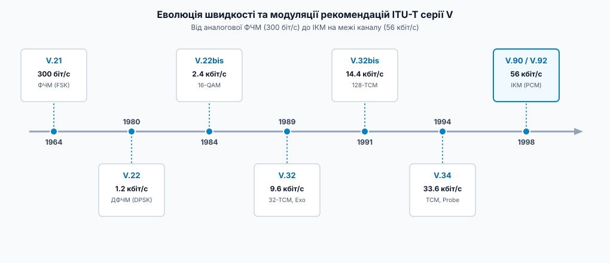
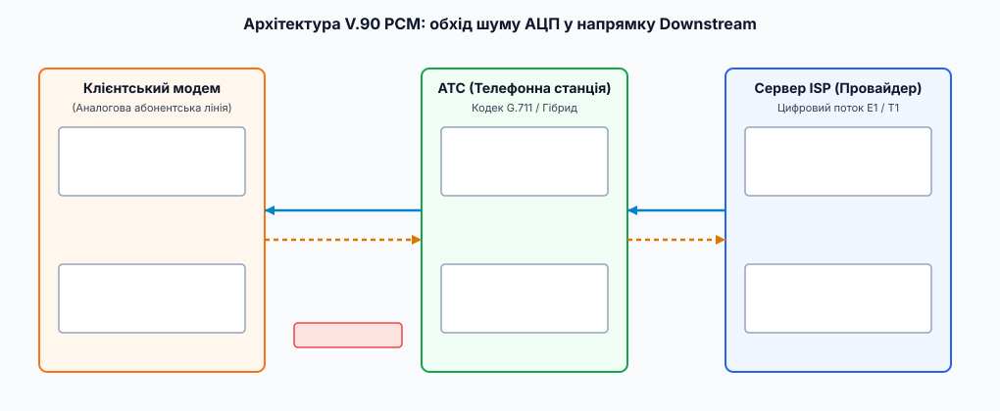
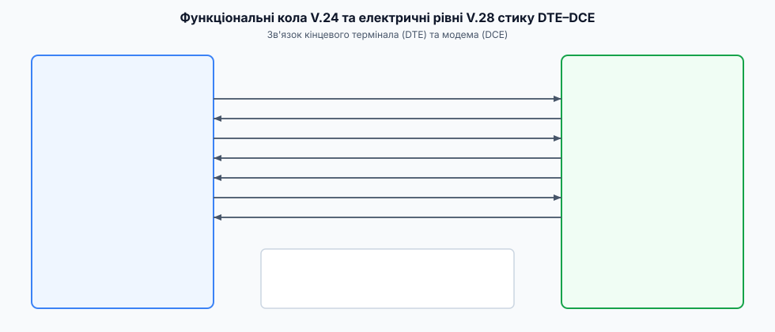

# Стандарти модемів серії V (ITU-T)

<preknowlist>
- [Смуга і межа Шеннона](topic:math-information/bandwidth-capacity) — зв'язок між шириною смуги, рівнем шуму (SNR) і максимальною швидкістю передачі даних у каналі.
- [Квадратурна амплітудна модуляція (QAM)](topic:com-modulation/qam) — принцип поєднання фазової та амплітудної модуляції для ущільнення бітів у кожному символі.
- [Асинхронний послідовний зв'язок](topic:com-devices/async-serial) — старт-стопова фреймова передача та узгодження швидкостей DTE-DCE.
</preknowlist>

Звичайний аналоговий телефонний дріт проєктувався виключно для передачі людського голосу в смузі від 300 до 3400 Гц. Спробувати проштовхнути цифровий прямокутний сигнал безпосередньо через таку лінію неможливо: трансформатори АТС повністю затримують постійну складову струму, паразитна ємність кабелю розмиває гострі фронти імпульсів, а амплітудні та фазові спотворення перетворюють двійкові одиниці й нулі на невиразне хаотичне коливання. Для передачі цифрової інформації потрібен пристрій-посередник — модем (модулятор-демодулятор), який перетворює двійковий потік на звукові гармонійні коливання (модуляцію) на передавальному боці та відновлює біти з аналогового звуку на приймальному.

Для того щоб модеми різних виробників у будь-якій країні світу могли з'єднуватися між собою без помилок, Міжнародний союз електрозв'язку (ITU-T, раніше CCITT) розробив серію рекомендацій, відомих як **серія V** (*V-series recommendations*). Цей комплекс стандартів охоплює фізичні інтерфейси, схеми модуляції від 300 біт/с до 56 кбіт/с, апаратне виправлення помилок, стиснення даних та процедури автоматичного узгодження параметрів зв'язку.

## 1. Анатомія аналогового телефонного каналу (ТФЗК)

Телефонна мережа загального користування (ТФЗК, або PSTN — *Public Switched Telephone Network*) накладає жорсткі фізичні обмеження на передачу сигналу. Абонентська лінія ("остання миля") складається з мідної крученої пари або паралельних дротів, з'єднаних із телефонною станцією (АТС).

Головне обмеження телефонного каналу — ширина смуги пропускання `B`, яка обмежена смуговим фільтром АТС:

```
f_low  = 300 Гц
f_high = 3400 Гц
B = f_high - f_low
  = 3400 - 300
  = 3100 Гц        [доступна смуга частот голосу]
```

Окрім вузької смуги частот, сигнал у телефонній лінії зазнає чотирьох основних видів деградації, які створюють комплексні інженерні виклики:

1. **Загасання (Attenuation):** Зменшення амплітуди сигналу пропорційно довжині кабелю, особливо на високих частотах смуги. На довгих абонентських лініях довжиною понад 3–5 кілометрів загасання на частоті 3000 Гц може досягати 20–30 дБ порівняно з низькими частотами.
2. **Амплітудно-частотні та фазові спотворення:** Різні частотні компоненти сигналу проходять через лінію з різною швидкістю (групова затримка), що призводить до міжсимвольної інтерференції (ISI — *Intersymbol Interference*), коли попередній символ "напливає" на наступний, вимагаючи складних цифрових еквалайзерів для відновлення форми сигналу.
3. **Шум квантування та тепловий шум:** На аналогових АТС джерелом є перехресні наводки та шум контактів, а на цифрових АТС — нелінійний 8-бітний АЦП (кодек G.711 μ-law або A-law), який дає межу співвідношення сигнал/шум `SNR ≈ 38 дБ`.
4. **Ехо (Echo):** Через використання 2-провідної абонентської лінії для одночасної передачі в обох напрямках гібридні трансформатори АТС неминуче відбивають частину потужності переданого сигналу назад у приймач модема. Виділяють близьке ехо (*Near-End Echo*), викликане власною розв'язувальною вилкою, та далеке ехо (*Far-End Echo*), що повертається від віддаленої АТС із затримкою в десятки мілісекунд.


*Хронологічний розвиток швидкостей передачі даних та методів модуляції у стандартах ITU-T серії V від перших 300 біт/с до межі 56 кбіт/с.*

## 2. Еволюція методів модуляції: Від FSK до QAM та TCM

Історія серії V — це послідовне підвищення спектральної ефективності (кількості бітів, що передаються в одному герці смуги частот) шляхом ускладнення сигнальних сузір'їв та математичної обробки сигналів.

### Перше покоління: Частотна модуляція V.21 (300 біт/с)

Стандарт **V.21** (1964 рік) застосовував частотну модуляцію (FSK — *Frequency Shift Keying*). Повнодуплексний режим по двох дротах досягався поділом смуги частот на два незалежні канали:
- **Канал виклику (Originate):** Біт `1` = 980 Гц, Біт `0` = 1180 Гц.
- **Канал відповіді (Answer):** Біт `1` = 1650 Гц, Біт `0` = 1850 Гц.

Спектральна ефективність V.21 становила лише `300 / 3100 ≈ 0.097 (біт/с)/Гц`. Перевагою FSK була простота апаратної реалізації: демодулятор будувався на кількох операційних підсилювачах або фазовому автопідлаштуванні частоти (ФАПЧ / PLL).

Детальний історичний огляд розколу між американськими стандартами Bell та європейськими рекомендаціями CCITT наведено у вставці 📜 [«Історія еволюції рекомендацій серії V: від proprietary-модемів до стандарту ITU-T»](topic:com-transport/modem-standards-v-series/hist-vseries-evolution.md).

Практичний приклад програмування модема V.21 з цифровим синтезатором (NCO) та квадратурним детектором подано у вставці ⚙️ [«Реалізація модема V.21 FSK на C та C++»](topic:com-transport/modem-standards-v-series/proj-v21-fsk-modem.md).

### Перехід до фазової модуляції: V.22 та V.22bis

Збільшення швидкості вимагало переходу від частотної до фазової та амплітудної модуляції:
- **V.22 (1200 біт/с):** Застосував відносну фазову модуляцію (DPSK — *Differential Phase Shift Keying*). Символьна швидкість становила 600 бод. Кожен символ кодував 2 біти (4 фазових стани зсуву: 0°, 90°, 180°, 270°).
- **V.22bis (2400 біт/с):** Перший глобальний стандарт із квадратурною амплітудною модуляцією (16-QAM). При символьній швидкості 600 бод кожен символ кодував 4 біти (16 точок у сигнальному сузір'ї). Для роботи V.22bis у модеми вперше почали вбудовувати цифровий сигнальний процесор (DSP) для адаптивної компенсації міжсимвольних спотворень лінії.

### Ера ехокомпенсації та треліс-кодування: V.32, V.32bis та V.34

До появи V.32 повнодуплексний зв'язок вимагав жорсткого розділення смуги частот на два вузьких канали (як у V.21 та V.22), що утилізувало менше половини ресурсу лінії.

Стандарт **V.32** (1989 рік, 9600 біт/с) зробив технічний прорив: обидва модеми почали передавати й приймати дані **в одній і тій самій смузі частот одночасно**. Це стало можливим завдяки адаптивній ехокомпенсації. Передавач модема будував цифрову модель відбитого ехо-сигналу й віднімав її з вхідної напруги лінії, виділяючи слабкий корисний сигнал віддаленого абонента.

```
V_rx_clean(t) = V_line(t) - V_echo_estimated(t)    [віднімання власного еха]
```

Окрім ехокомпенсації, у V.32 та V.32bis було впроваджено **треліс-кодовану модуляцію (TCM — *Trellis Coded Modulation*)**. Замість звичайного QAM, де кожен вектор обирається незалежно, TCM поєднує згортковий кодер із розширеним сигнальним сузір'ям (наприклад, 32 точки замість 16). Це дає поміхустійкість до 3 дБ без розширення смуги частот.

- **V.32bis (14 400 біт/с):** 128-TCM сузір'я при символьній швидкості 2400 бод (6 бітів даних + 1 біт паритету TCM на символ).
- **V.34 (28 800 / 33 600 біт/с):** Найвищий етап аналогового модемобудування. V.34 ввів фазу зондування лінії (Line Probing), під час якої модем посилав тестові тони на 21 частоті, вимірював рівень шуму й обирав оптимальну символьну швидкість (2400, 2743, 2800, 3000, 3200 або 3429 бод) та розмір сузір'я (аж до 960 точок). Додатково застосовувалися прекодування Томлінсона–Харасіми (*Tomlinson-Harashima Precoding*) та шелл-мапінг (*Shell Mapping*) для мінімізації середньої потужності випромінювання.

## 3. Обхід шуму квантування: Технологія V.90 та V.92 ІКМ (PCM)

Усі суто аналогові модеми (включаючи V.34) впиралися в теоретичну межу Шеннона для аналогово-аналогового телефонного каналу (~33.6 кбіт/с). Головним чинником цього обмеження був шум квантування АЦП на телефонній станції.

```
C = B · log2(1 + SNR)
  = 3100 · log2(1 + 6309)
  ≈ 39.1 кбіт/с     [теоретична стеля Шеннона при SNR = 38 дБ]
```


*Архітектура з'єднання V.90: сервер провайдера надсилає точний цифровий потік ІКМ через цифровий тракт E1/T1 безпосередньо у ЦАП АТС, виключаючи шум АЦП у напрямку Downstream.*

Стандарт **V.90** (1998 рік) обійшов цю межу завдяки зміні архітектури підключення. Сервер провайдера (ISP) підключається до АТС через цифровий потік E1/T1/ISDN. На шляху Downstream (від провайдера до клієнта) **відсутній АЦП**: цифровий сервер надсилає 8-бітні ІКМ-відліки G.711 безпосередньо у ЦАП телефонної станції. ЦАП формує відповідні рівні напруги, які аналоговою лінією доходять до аналогового приймача клієнта.

Оскільки шум квантування АЦП у напрямку Downstream ліквідовано, швидкість обмежується лише дискретизацією АТС (8000 Гц) та рівнем теплового шуму кабелю. Це дозволило підняти швидкість прийому до **56 кбіт/с**. Зворотний напрямок (Upstream) у V.90 залишався аналоговим (V.34, до 33.6 кбіт/с), оскільки сигнал від аналогового модема клієнта обов'язково проходив через АЦП на станції АТС.

Стандарт **V.92** (2000 рік) додав підтримку PCM-модуляції і для зворотної лінії (Upstream до 48 кбіт/с), скоротив час узгодження (QuickConnect) та ввів функцію Modem-on-Hold, яка дозволяла призупиняти інтернет-сесію при надходженні вхідного телефонного дзвінка.

Детальні математичні виведення шуму квантування та розрахунок межі V.90 наведено у вставці 🧮 [«Математичний аналіз межі V.90 та шуму квантування ІКМ»](topic:com-transport/modem-standards-v-series/math-v90-pcm-capacity.md).

## 4. Фізичні та електричні стики DTE–DCE: V.24 та V.28

Модем є пристроєм закінчення каналу даних (DCE — *Data Circuit-terminating Equipment*). Для з'єднання модема з комп'ютером чи терміналом (DTE — *Data Terminal Equipment*) ITU-T визначив два взаємодоповнюючі стандарти:
- **V.24:** Функціональне визначення сигнальних кіл (кола серії 100: TXD, RXD, RTS, CTS, DTR, DSR, DCD, RI).
- **V.28:** Електричні характеристики кіл (двополярна напруга від ±3 В до ±15 В, рівні логічних "0" та "1").

Together V.24 та V.28 є міжнародним еквівалентом американського стандарту **EIA RS-232-C**.


*Схема з'єднання DTE (комп'ютер) та DCE (модем) за допомогою сигнальних кіл V.24 та електричних рівнів V.28.*

Повна специфікація кіл серії 100, призначення контактів роз'ємів DB-25 і DE-9 та алгоритми апаратного керування потоком (RTS/CTS) наведені у вставці 📋 [«Специфікація кіл V.24 та електричні рівні V.28»](topic:com-transport/modem-standards-v-series/api-v24-v28-signals.md).

## 5. Системні стандарти керування, помилок та стиснення

Швидкісна передача даних вимагає не лише модуляції носія, а й надійного протоколу канального рівня для обробки помилок у шумному каналі та стиснення потоку.

```
+-------------------------------------------------------------------+
|  Прикладний рівень (Термінал, AT-команди, PPP, IP-пакети)         |
+-------------------------------------------------------------------+
|  Рівень стиснення даних:  V.42bis (LZW) / V.44 (LZJH)             |
+-------------------------------------------------------------------+
|  Рівень виправлення помилок: V.42 (LAPM / HDLC / CRC-16)          |
+-------------------------------------------------------------------+
|  Рівень узгодження зв'язку: V.8 / V.8bis (Рукостискання, Handshake)|
+-------------------------------------------------------------------+
|  Фізичний рівень модуляції: V.21 / V.22bis / V.32bis / V.34 / V.90 |
+-------------------------------------------------------------------+
```

### Протокол виправлення помилок V.42 (LAPM)

Аналогова лінія регулярно зазнає імпульсних завад і тріску, які спотворюють окремі біти. Стандарт **V.42** описує протокол LAPM (*Link Access Procedure for Modems*), що базується на форматуванні даних у кадри HDLC з обчисленням контрольної суми CRC-16.

При виявленні помилки приймач надсилає запит на повторну передачу кадру (ARQ — *Automatic Repeat Request*). Якщо один із модемів не підтримує V.42, стандарт передбачає зворотну сумісність із протоколом **MNP 4**.

### Алгоритми стиснення даних V.42bis та V.44

Для підвищення ефективної швидкості передачі поверх фізичного каналу застосовуються алгоритми стиснення в реальному часі:
- **V.42bis:** Застосовує адаптивний словниковий алгоритм Лемпеля–Зіва–Велча (LZW). Модем будує динамічне дерево рядків символів, замінюючи часті послідовності байтів короткими кодовими словами. Це дає коефіціент стиснення текстових даних до `4:1` (тобто модем V.34 на 33.6 кбіт/с може забезпечити пропускну здатність до ~115.2 кбіт/с для тексту).
- **V.44:** Більш сучасний стандарт стиснення (прийнятий разом з V.92), що базується на алгоритмі LZJH. Він забезпечує на 20–150% вищий ступінь стиснення некодованих вебсторінок (HTML/XML) порівняно з V.42bis.

### Рукостискання та узгодження V.8 і V.8bis

Перед початком передачі високошвидкісних даних модеми мусять домовитися про спільний стандарт модуляції, наявність стиснення та параметри лінії. Процедура **V.8** виконується одразу після зняття слухавки: модеми обмінюються синусоїдальними тонами помірної частоти (V.8 ANSam тон 2100 Гц із фазовими реверсіями), декларують свої технологічні можливості (сигнали JM та CM) та узгоджують перехід на відповідний фізичний стандарт (V.32bis, V.34 чи V.90).

> 🔧 **Навіщо це у сучасній розробці.**
> Хоча класичні дозвонні модеми dial-up поступливо поступилися місцем оптиці та 4G/5G, принципи рекомендацій серії V у повному обсязі живуть у сучасному радіозв'язку та промислових інтерфейсах. Адаптивне сигнальне сузір'я V.34 та зондування лінії є основою систем Wi-Fi (802.11ax/be) та LTE/5G. Послідовний стик V.24/V.28 (RS-232) лишається головним консольним інтерфейсом для налагодження серверів, роутерів, мікроконтролерів та космічної апаратури.

## 6. Підсумкова порівняльна таблиця рекомендацій серії V

```
+-----------+---------------+--------------------+------------------+------------------------------+
| Стандарт  | Рік прийняття | Макс. швидкість    | Тип модуляції    | Основні технологічні риси    |
+-----------+---------------+--------------------+------------------+------------------------------+
| V.21      | 1964          | 300 біт/с          | FSK              | Двоканальний дуплекс         |
| V.22      | 1980          | 1200 біт/с         | DPSK (4-PSK)     | 600 бод, відносна фаза       |
| V.22bis   | 1984          | 2400 біт/с         | 16-QAM           | 600 бод, адаптивний еквалайзер|
| V.32      | 1989          | 9600 біт/с         | 16-QAM / 32-TCM  | Адаптивна ехокомпенсація     |
| V.32bis   | 1991          | 14.4 кбіт/с        | 128-TCM          | 2400 бод, ретрейнінг лінії   |
| V.34      | 1994          | 33.6 кбіт/с        | Multidim TCM     | Зондування лінії, 3429 бод   |
| V.90      | 1998          | 56k Down/33.6k Up  | PCM (G.711) / QAM| Обхід шуму АЦП у Downstream  |
| V.92      | 2000          | 56k Down/48k Up    | PCM / PCM        | PCM Upstream, QuickConnect   |
+-----------+---------------+--------------------+------------------+------------------------------+
```

Еволюція рекомендацій серії V ITU-T стала яскравим прикладом того, як поєднання теорії інформації Шеннона, цифрової обробки сигналів та міжнародної стандартизації дозволило розширити пропускну здатність звичайного мідного дроту більш ніж у 180 разів, проклавши шлях до сучасної цифрової епохи.
