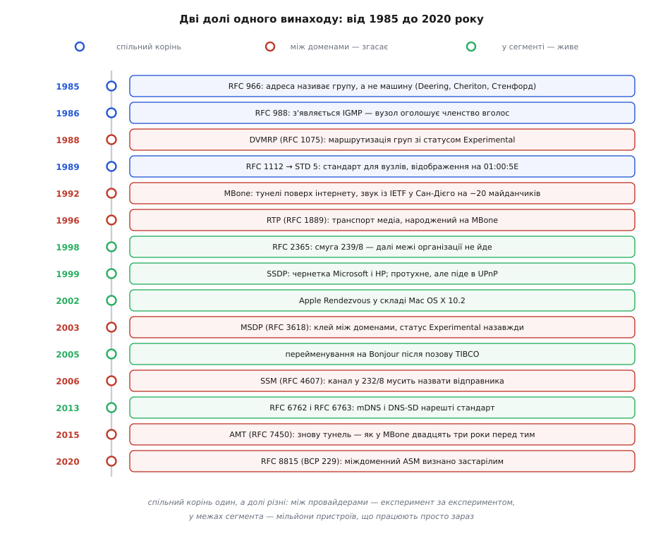
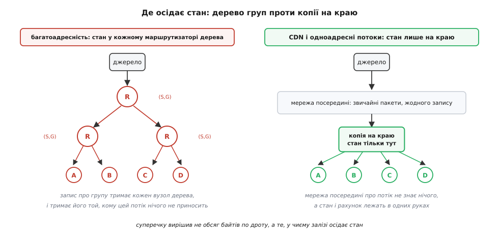

# 📜 Народжена для всього інтернету, вижила в одному сегменті

Адресу, що називає **групу**, а не машину, придумали 1985 року в Стенфорді — і задумували її як спосіб розсилати дані крізь увесь інтернет, а не по одному кабелю. Сьогодні між провайдерами вона мертва, зате жива там, де про неї згадують найменше: у домашньому роутері, у телевізорі, у застосунку, що шукає принтер. Розказати цю історію варто не заради дат: причина такої долі не випадкова й не чиясь недбалість. Те саме проєктне рішення, яке зробило багатоадресність красивою, зробило її **неоплачуваною** — а неоплачуване на межі між різними власниками мереж не живе.

## Задача, з якої все почалося: група процесів, а не глядачі

Перший документ — RFC 966 «Host Groups: A Multicast Extension to the Internet Protocol», грудень 1985, автори S. E. Deering і D. R. Cheriton, Стенфордський університет. Сам RFC зазначає, що його «пристосовано з доповіді, поданої на Ninth Data Communications Symposium», тобто наукова доповідь була раніше, а RFC зробив ідею відкритим текстом для всіх, хто пише стек.

**Девід Роджер Черітон** (David Roger Cheriton) — канадський інформатик, народжений 1951 року у Ванкувері (Британська Колумбія), випускник Університету Британської Колумбії та Університету Ватерлоо, професор Стенфорда й засновник тамтешньої Distributed Systems Group. **Стівен Дірінг** (Stephen E. Deering) працював у цій групі; багатоадресність виросла з його стенфордської роботи, а згодом він став одним із головних авторів IPv6.

І ось перша несподіванка. Групову адресу вигадали **не** для телебачення й не для трансляцій — вона знадобилася розподіленій операційній системі. У Черітоновій групі будували V-System, мікроядрову ОС, розтягнуту на багато машин, і там раз у раз доводилося звертатися не до однієї машини, а до **набору процесів**, розкиданих по мережі. RFC 966 так і каже: «V distributed system uses network-level multicast for implementing efficient operations on groups of processes spanning multiple machines». Серед перелічених застосувань — «distributed, replicated databases, conferencing, distributed parallel computation, including distributed gaming».

А ще там, у списку мотивацій 1985 року, чорним по білому стоїть саме те, заради чого багатоадресність користуються сьогодні: «multicast is a robust and often more efficient alternative to the use of name servers for finding a particular object or service» — надійніша й часто дешевша заміна серверові імен, коли треба **знайти об'єкт або службу**. Виявлення вузлів не було побічним ужитком, який знайшли пізніше. Воно було в найпершому документі — просто тоді здавалося дрібнішим за трансляції.

Дві означальні фрази того RFC варто прочитати уважно, бо з них виросло все подальше. Перша: група вузлів — це «a set of **zero** or more Internet hosts». Нуль. Адреса групи існує, навіть коли її ніхто не слухає; надіслати на неї можна завжди, а чи є кому приймати — питання, на яке відправник не має відповіді й не повинен її мати. Друга фраза: «The sender need not be a member of the destination group. We refer to such a group as **open**». Відкрита група: слати в неї може будь-хто, не питаючись і не оголошуючись.

Обидва рішення красиві та логічні. Вони роблять відправника й одержувача незалежними: одному не треба знати, хто слухає, другому — хто говоритиме. Саме ця незалежність — весь зиск багатоадресності. Вона ж, через тридцять п'ять років, стане причиною, з якої IETF офіційно оголосить міждоменну багатоадресність застарілою.

## Три редакції за чотири роки

Далі йде рідкісний для мереж випадок, коли специфікацію переписували швидко й видно, як думка достигала.

**RFC 988** (липень 1986, S. E. Deering, Стенфорд) заміняє RFC 966 і приносить головне: IGMP — окремий протокол, яким вузол оголошує маршрутизаторові, що слухає групу. У 966-му членство ще уявляли як турботу мережі; у 988-му воно стає тим, що **вузол мусить сказати вголос**.

**RFC 1054** (травень 1988) заміняє 988-й і зсуває відповідальність ще далі до вузла: тепер робота із членством лежить на господарі, а не на маршрутизаторах, і завдяки цьому багатоадресність працює в одному сегменті навіть там, де жодного маршрутизатора з її підтримкою немає.

**RFC 1112** (серпень 1989, S. Deering) заміняє обидва попередні й доживає до статусу STD 5 — повноцінного інтернет-стандарту. Він і сьогодні описує те, що робить твоє ядро, коли ти викликаєш `IP_ADD_MEMBERSHIP`. Звідти ж походить відображення на апаратну адресу, дослівно: «An IP host group address is mapped to an Ethernet multicast address by placing the low-order 23-bits of the IP address into the low-order 23 bits of the Ethernet multicast address 01-00-5E-00-00-00 (hex)».

Двадцять три біти — не круглий вибір, і в ньому видно торг із виробниками апаратури: IANA дістала половину свого блока OUI під ці адреси, а не весь. Наслідок арифметичний і вічний:

```
адреса групи 224.0.0.251
   значущих бітів у групі:      28   (перші чотири — 1110, ознака класу D)
   бітів переносять у MAC:      23
   втрачено:                28 − 23 = 5
   груп на одну апаратну адресу:  2⁵ = 32
```

Мережева карта тридцяти двох різних груп не розрізняє — відсіювати зайве доводиться ядру вже після приймання кадру. Це не помилка й не недогляд: 1989 року фільтр у карті був дорогою мікросхемою, і п'ять бітів точності віддали за дешевизну заліза. Ціна досі в кожному пакеті.

Тепер найважливіше в цьому періоді, і воно приховане в статусах документів. Вузли дістали **стандарт** (STD 5). А маршрутизація групового трафіку — те, як пакет насправді долетить крізь мережі, — лишилася **експериментом**: DVMRP, RFC 1075, листопад 1988, автори D. Waitzman, C. Partridge (BBN) і S. E. Deering, зі статусом Experimental і прямим попередженням у тексті: «This is an experimental protocol, and its implementation is not recommended at this time». Теорія дерев доставки була ґрунтовна — Deering і Cheriton виклали її в ACM Transactions on Computer Systems 8(2), 1990, с. 85–110. Але від теорії дерев до протоколу, який згодні ввімкнути чужі одне одному оператори, дорога виявилася довшою за всі очікування.

Ця асиметрія — стандарт для вузлів, експеримент для мережі — і є вся подальша історія в мініатюрі.



*Спільний корінь один, а долі різні: те, що між провайдерами так і не вийшло з експериментального статусу, у межах сегмента розійшлося мільйонними накладами.*

## MBone: мережа поверх мережі, яка того не вміла

На початку 1990-х склалося патове становище. Вузли багатоадресність уже вміли — код за RFC 1112 був у BSD. Маршрутизатори здебільшого ні, а оператори не бачили причини вмикати те, чого ніхто не використовує, бо ніхто не використовував того, чого не ввімкнено.

Розв'язок обійшов операторів узагалі: якщо маршрутизатори по дорозі групового пакета не розуміють — сховай його всередині звичайного одноадресного. Так з'явився **тунель**: два вузли з програмою `mrouted` домовляються між собою, кожен груповий пакет один загортає в пакет до другого, другий розгортає і роздає у свій сегмент. Мережа посередині нічого не помічає — для неї це буденний потік між двома адресами. З таких тунелів, які люди прокладали вручну й домовлялися про них листами, і зіткали **MBone** (англ. *multicast backbone* — багатоадресний хребет): накладну мережу, чия топологія існувала лише в конфігураційних файлах добровольців.

Перше гучне вживання задокументоване точно. IETF 23 відбувся в Сан-Дієго 16–20 березня 1992 року, приймав його San Diego Supercomputer Center, було 530 учасників — і звук із залу засідань транслювали в мережу приблизно на двадцять майданчиків. Описали цей етер його ж організатори: Stephen Casner і Stephen E. Deering, «First IETF Internet Audiocast», ACM SIGCOMM Computer Communication Review 22(3), 1992, с. 92–97.

Щодо авторства самого MBone статус свідчень слабший, і його варто назвати чесно. Стандартна версія, яку повторюють довідники й ранній MBONE FAQ, звучить так: MBone збудували 1992 року Van Jacobson, Steve Deering і Stephen Casner за пропозицією **Еллісон Манкін** (Allison Mankin). Це усталений переказ учасників, а не витяг із протоколу засідання; сам факт етеру та його автори документовані статтею вище, а от розподіл ролей і чия була початкова думка — на совісті переказу. Ставити тут «хто перший» не варто: збиралося воно з чужих шматків, аудіоінструменти йшли з Лоуренсової лабораторії в Берклі, `mrouted` — від стенфордської гілки, тунелі прокладали десятки людей.

Найдовше з MBone прожило не те, задля чого його робили. Формати пакетів, у яких там возили звук і відео, доросли до **RTP** — RFC 1889, січень 1996, робоча група Audio-Video Transport, автори H. Schulzrinne, S. Casner, R. Frederick, V. Jacobson. Сьогодні RTP возить майже всі відеодзвінки світу — і возить їх **одноадресно** ([RTP і RTCP](root:com-protocol/rtp-rtcp) — тонкий шар над UDP, що додає до датаграми номер, мітку часу й тип корисних даних, щоб приймач міг зібрати потік у правильному порядку й вирівняти його в часі). Багатоадресний хребет помер, а транспорт, народжений на ньому, лишився.

## Чому між провайдерами це не злетіло

Причин чотири, і вони складаються в один ланцюг.

**Перша: стан, який не згортається.** Звичайна маршрутизація тримається на згортанні — маршрутизатор не знає окремих адрес, він знає **префікси**, і мільйон адрес `203.0.113.0/24` уміщається в один рядок таблиці, бо адреси сусідів у мережі схожі й лежать поруч ([маршрутизація](root:com-transport/ip-routing) — маршрутизатор дивиться на адресу призначення, знаходить найдовший префікс, що їй пасує, і віддає пакет у відповідний бік). Адреса групи так не працює. У `232.5.7.9` немає ані натяку на те, де в світі сидять її передплатники: вона називає **тему**, а не місце. Тому згорнути дві сусідні групи в один запис неможливо, і маршрутизатор мусить тримати окремий стан на **кожну активну групу** — і не десь один, а в кожному вузлі дерева доставки. Обсяг того стану залежить не від розміру інтернету, а від того, скільки груп зараз хтось слухає, тобто від чужої поведінки, якою власник маршрутизатора не керує.

**Друга: відкрита група не має відповідального.** Слати в групу може будь-хто — так вирішили 1985 року, і це було правильно для розподіленої ОС у лабораторії. У світі, де мережі належать конкурентам, це означає: одержувач попросив **групу**, а не когось конкретного, тож будь-хто у світі може почати заливати в неї трафік, а мережі доведеться його везти. Немає ані відбору за відправником, ані відповіді на питання «чий це потік і хто за нього платить».

**Третя: клей між доменами так і не подорослішав.** PIM-SM, робочий кінь групової маршрутизації, будує дерево через **точку зустрічі** — маршрутизатор, куди відправники здають трафік, а передплатники по нього приходять. Усередині одного домену це працює: точку зустрічі призначає той, хто володіє мережею. Між доменами точки зустрічі мають дізнаватися про відправників одна в одної — для цього придумали MSDP, і його доля показова. RFC 3618, жовтень 2003, статус — **Experimental**. Він таким і лишився. Той-таки IETF згодом сформулював це без пом'якшень: «there is no IETF interdomain solution at the level of Proposed Standard for IPv4 ASM multicast, because MSDP was the de facto mechanism for the interdomain source discovery problem, and it is Experimental», і додав, що «deployment experience has shown MSDP to be a complex and fragile protocol to manage and troubleshoot», а на IPv6 його не розширювали взагалі. Тобто головний стик міждоменної багатоадресності п'ятнадцять років простояв на протоколі, який ніхто не наважився оголосити навіть запропонованим стандартом.

**Четверта: суперник подешевшав швидше.** Поки узгоджували міждоменні дерева, диски й канали дешевшали, і задачу «роздати одне й те саме мільйону людей» навчилися розв'язувати без жодної допомоги від мереж посередині: постав копію ближче до глядача й віддавай її одноадресно ([CDN](root:sf-distributed/cdn) — мережа кеш-майданчиків біля користувачів; запит іде на найближчий, тож далеко потік летить один раз, а близько розмножується). Порівняння виходить нищівне не за витратою каналу, а за **тим, з ким треба домовитися**. CDN потребує згоди нікого посередині: ти орендуєш майданчики й вішаєш на них свій вміст. Багатоадресність потребує, щоб **кожен** оператор на шляху ввімкнув її, налаштував, тримав стан і розбирався зі скаргами — за трафік, який обслуговує чужих клієнтів і не приносить йому ні копійки.



*Питання, що вирішило суперечку, — не «скільки байтів по дроту», а «у чиєму залізі осідає стан і хто за нього платить».*

> 🔧 **Навіщо це.** З цього виходить робоче правило, а не лише мораль. Багатоадресність вигідна рівно там, де стан і гроші в одних руках: у своєму сегменті, у своїй серверній, у мережі одного оператора. Щойно потік перетинає межу чужої відповідальності — перевагу треба доводити комусь, кому вона не належить, і саме тут вона щоразу програє. Тому перед тим, як закладати групову розсилку в архітектуру, спитай не «скільки заощаджу трафіку», а «хто володіє всіма маршрутизаторами на шляху». Якщо відповідь не «я» — розсилка не доїде.

Латки, звісно, робили, і кожна звужувала початкову обіцянку. IGMPv3 (RFC 3376, жовтень 2002) додав відбір за відправником: вузол тепер каже не просто «слухаю групу», а «слухаю групу від оцих джерел». На ньому виріс SSM (RFC 4607, серпень 2006): у смузі `232.0.0.0/8` канал іменують **парою** (відправник, група), спільного дерева й точки зустрічі не треба взагалі, а отже, не треба й MSDP. Ціною того, що канал уже не анонімний — передплатник мусить знати ім'я відправника наперед. AMT (RFC 7450, лютий 2015) повернувся до найпершого прийому: тунель до того, у кого багатоадресність є, — рівно те, що робив MBone двадцять три роки перед тим.

Присуд оформили 2020 року. RFC 8815 (серпень 2020, BCP 229, автори M. Abrahamsson, T. Chown, L. Giuliano, T. Eckert) рекомендує **відмовитися від міждоменного Any-Source Multicast** — тієї самої відкритої групи з 1985-го — і залишити для міждоменних потреб лише SSM. Всередині однієї організації відкриті групи документ дозволяє й далі. Межа проведена рівно там, де проходить межа власності.

## Друге життя: знайти сусіда в тому самому сегменті

Тим часом ідея вижила в місці, де обидві перешкоди зникають самі собою. У межах одного сегмента немає транзитного маршрутизатора, який тримав би стан, і немає чужого власника, якому треба доводити вигоду. Лишається чиста користь: одна датаграма замість двохсот п'ятдесяти чотирьох.

**SSDP, 1999.** «Simple Service Discovery Protocol/1.0» — чернетка IETF авторства Yaron Y. Goland, Ting Cai, Paul J. Leach, Ye Gu (Microsoft) і Shivaun Albright (HP), остання редакція — 11 листопада 1999 року. Статус у реєстрі IETF станом на сьогодні: **Expired & archived**; RFC вона не стала ніколи. І це, мабуть, найкраща ілюстрація того, як насправді розходяться протоколи: чернетка, що формально протухла двадцять сім років тому, працює зараз у сотнях мільйонів телевізорів, консолей і роутерів — бо її взяв UPnP, а UPnP узяли виробники побутової техніки. Адресу вона дістала `239.255.255.250`, тобто з блока `239.0.0.0/8`, який RFC 2365 (липень 1998, D. Meyer, BCP 23) закріпив як «адміністративно обмежений» — межу організації такий трафік не переходить за домовленістю всіх, хто налаштовує маршрутизатори.

**Apple, 2002–2005.** У серпні 2002 року з Mac OS X 10.2 вийшов набір, що дозволяв машинам знаходити одна одну й чужі служби без жодного сервера; Apple назвала його **Rendezvous**. 27 серпня 2003 року TIBCO Software подала на Apple позов: у TIBCO з 1994 року був корпоративний продукт TIBCO Rendezvous і торгова марка на цю назву. У липні 2004-го сторони владнали справу позасудово, умови не розкривали, а 12 квітня 2005 року Apple оголосила нову назву — **Bonjour**. Змінилося слово; у протоколі не змінилося нічого.

Стандартом усе це стало аж у **лютому 2013 року**: RFC 6762 «Multicast DNS» і RFC 6763 «DNS-Based Service Discovery», автори Stuart Cheshire і Marc Krochmal (Apple), обидва — Proposed Standard. Одинадцять років між «працює в кожному маку» і «записано в стандарті». Робоча група Zeroconf, яка мала б цим займатися й чия остання віха датована березнем 2004-го, до того часу давно завершила роботу — mDNS довелося проводити окремо й пізніше ([mDNS і DNS-SD](root:com-transport/mdns-dns-sd) — звичайні запити й записи DNS, розіслані в групу замість надсилання серверові: відповідає той, кого питання стосується, а імена живуть у зоні `.local`).

І остання деталь, у якій уся арка сходиться. Адреса mDNS — `224.0.0.251`, тобто з блока `224.0.0.0/24`, для якого RFC 1112 наказав **час життя 1**: маршрутизатор такий пакет не перешле за жодних налаштувань. Форма, у якій багатоадресність вижила й розійшлася мільярдними накладами, свідомо відмовляється від того самого, заради чого її задумували, — від досяжності крізь мережі. Вона лишила собі рівно ту частину задачі, яку 1985 року вважали найдрібнішою: знайти сусіда, коли не знаєш його імені.

Тому три адреси, які трапляються в коді виявлення вузлів, читаються як шари розкопу. `224.0.0.251` — з тієї смуги 1989-го, що не виходить за дріт. `239.255.255.250` — з блока 1998 року, де найвищою амбіцією вже була межа організації. `232.x.x.x` — із 2006-го, де груповий канал мусить назвати свого відправника на ім'я. Обираючи одну з них, ти обираєш, у якому році цієї суперечки стоїш; те саме стосується схожої задачі на іншому поверсі, де серверні системи давно розв'язали виявлення реєстром замість розсилки ([виявлення служб](root:sf-distributed/service-discovery) — окремий каталог, куди примірники служби записуються при старті, а клієнти питають у нього адреси).
