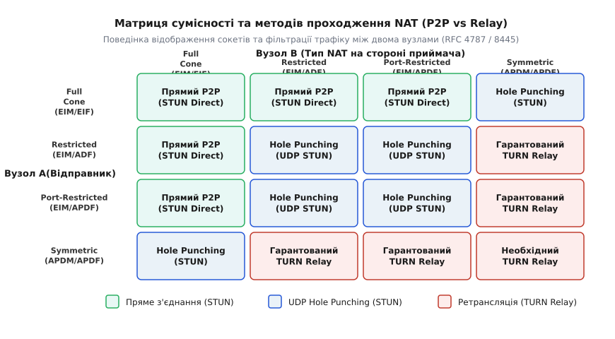
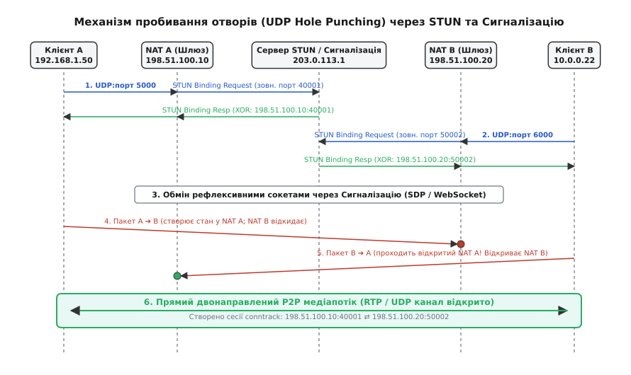
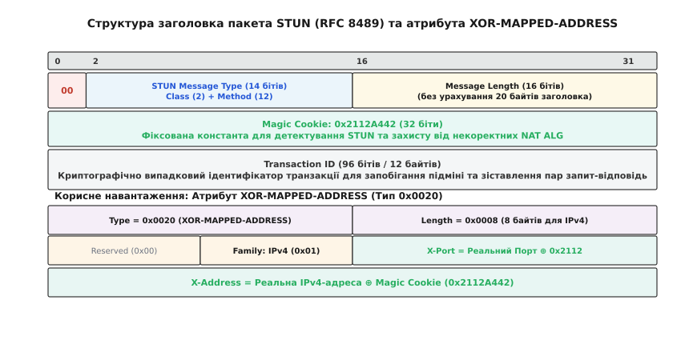
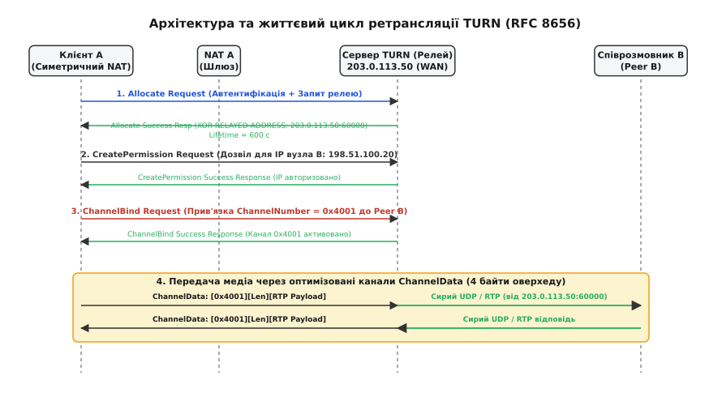
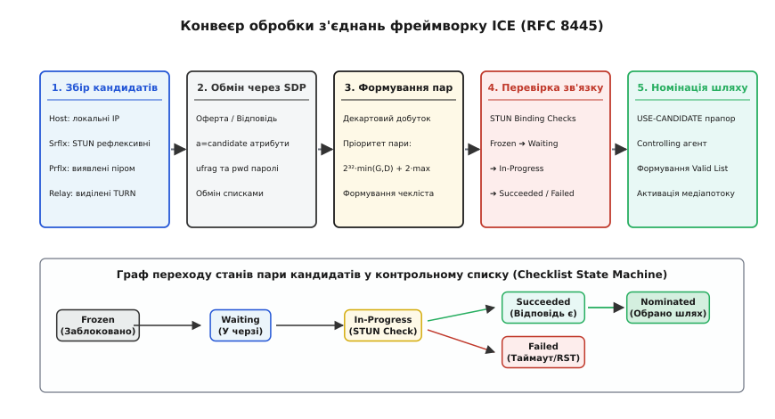

# NAT-траверсаль: STUN, TURN, ICE та подолання міжмережевих екранів

<preknowlist>
- [NAT: трансляція мережевих адрес](topic:com-transport/nat) — принципи SNAT, DNAT, NAPT та таблиці відстеження з'єднань conntrack.
- [TCP проти UDP](topic:com-transport/tcp-vs-udp) — різниця між орієнтованим на потік TCP та незалежними датаграмами UDP.
- [Маршрутизація IP](topic:com-transport/ip-routing) — таблиця маршрутизації, пересилання пакетів та шлюзи за замовчуванням.
- [RTP і RTCP](topic:com-protocol/rtp-rtcp) — потокова передача аудіо та відео реального часу через UDP-сокети.
</preknowlist>

Коли оператор станції керування безпілотним апаратом із локальною IP-адресою `192.168.1.50:5004` за маршрутизатором `198.51.100.10` намагається отримати прямий UDP-відеопотік від віддаленого відеосервера дрона з локальною адресою `10.0.0.22:5004` за маршрутизатором `203.0.113.25`, жоден із пристроїв не має маршрутизованої глобальної адреси. Якщо станція керування надішле перший UDP-пакет на зовнішню адресу `203.0.113.25:5004`, віддалений маршрутизатор беззастережно відкине його, оскільки в його внутрішній таблиці трансляцій немає жодного попереднього вихідного запису від дрона у бік станції. Дрон, зі свого боку, не може надіслати пакет на приватну адресу `192.168.1.50`, оскільки пакети за стандартом RFC 1918 не маршрутизуються в публічному Інтернеті. Прямий двонаправлений зв'язок реального часу виявляється повністю заблокованим.

Механізми, що забезпечують встановлення прямого каналу зв'язку між клієнтами за різними маршрутизаторами та міжмережевими екранами, мають загальну назву **подолання трансляції мережевих адрес (англ. *NAT Traversal*, від лат. *transversus* — поперечний, крізь)**. Для розв'язання цієї проблеми розроблено багаторівневий комплекс протоколів, що охоплює рефлексивне визначення зовнішніх адрес через STUN, гарантовану ретрансляцію через TURN та адаптивну координацію доступних маршрутів за допомогою фреймворку ICE.

---

### 1. Бар'єр трансляції адрес у комунікаціях реального часу

Звичайна клієнт-серверна модель Інтернету (вебперегляд за протоколами HTTP/HTTPS, завантаження файлів) працює поверх трансляції адрес без жодних ускладнень: внутрішній клієнт завжди є активним ініціатором з'єднання. Коли клієнт надсилає вихідний пакет до публічного сервера, маршрутизатор [NAT](topic:com-transport/nat) створює запис у таблиці відстеження станів (`conntrack`), виділяє тимчасовий зовнішній порт і дозволяє надходження відповідей від цього конкретного сервера на цей порт.

У однорангових мережах (Peer-to-Peer, P2P), голосовому зв'язку ([SIP](topic:com-protocol/sip)), відеоконференціях ([WebRTC](topic:com-transport/webrtc)) та телеметрії реального часу ситуація є принципово іншою:
1. **Сигналізація відокремлена від медіапотоку**: встановлення сесії та узгодження параметрів кодеків відбувається через центральний сервер сигналізації (наприклад, через WebSocket або SIP-проксі), але передача важкого медіапотоку аудіо/відео ([RTP](topic:com-protocol/rtp-rtcp)) мусить відбуватися напряму між учасниками для уникнення надлишкових затримок та розвантаження серверної інфраструктури.
2. **Асиметрія міжмережевих екранів**: обидва учасники дзвінка перебувають у стані очікування вхідних медіапакетів від співрозмовника, проте жоден із маршрутизаторів не дозволяє вхідний трафік без попереднього вихідного поштовху зсередини своєї локальної мережі.
3. **Недійсність локальних адрес у сигналізації**: якщо клієнт A запише у тіло повідомлення сигналізації (SDP-оферту) свою внутрішню адресу `192.168.1.50:5000`, клієнт B за іншим роутером не зможе спрямувати на неї жодного пакета.
4. **Асиметрія маршрутизації та відстеження сесій**: якщо пристрій передає дані протоколом UDP, маршрутизатори не бачать прапорців початку чи кінця сесії (як у TCP). Транслятор змушений утримувати відкритий порт на основі евристичних таймерів неактивності, які у багатьох провайдерів закриваються вже за 30 секунд мовчання.

Історичний шлях розвитку цієї технології — від ранніх спроб шлюзів прикладного рівня (ALG) до сучасних стандартів — викладено у вставці [Історія еволюції подолання NAT](topic:com-transport/nat-traversal/hist-traversal-evolution.md).

---

### 2. Класифікація трансляторів за RFC 3489 та RFC 4787: матриця прохідності

Можливість встановлення прямого каналу зв'язку між двома вузлами залежить від двох незалежних характеристик їхніх маршрутизаторів: **поведінки відображення портів (Mapping Behavior)** та **поведінки фільтрації вхідних пакетів (Filtering Behavior)**.

```
+-------------------------------------------------------------------------+
|                  Класифікація трансляції адрес (NAT)                    |
+------------------------------------+------------------------------------+
| Поведінка відображення (RFC 4787)  | Поведінка фільтрації (RFC 4787)    |
+------------------------------------+------------------------------------+
| Endpoint-Independent Mapping (EIM) | Endpoint-Independent Filter (EIF)  |
| Address-Dependent Mapping (ADM)    | Address-Dependent Filter (ADF)     |
| Address & Port-Dep. Mapping (APDM) | Address & Port-Dep. Filter (APDF)  |
+------------------------------------+------------------------------------+
```

#### Традиційні типи NAT за стандартом RFC 3489
* **Full Cone (Повний конус, EIM + EIF)**: внутрішній сокет `(IP_in, Port_in)` отримує фіксований зовнішній сокет `(IP_ext, Port_ext)`. Будь-який зовнішній комп'ютер у світі може надіслати пакет на `(IP_ext, Port_ext)`, і роутер перешле його клієнту.
* **Restricted Cone (Обмежений за адресою, EIM + ADF)**: зовнішній порт є стабільним для всіх напрямків. Вхідні пакети приймаються лише від тих зовнішніх IP-адрес, на які клієнт уже надсилав хоча б один вихідний пакет. Номер віддаленого порту значення не має.
* **Port-Restricted Cone (Обмежений за портом, EIM + APDF)**: зовнішній порт залишається стабільним. Вхідні пакети приймаються **виключно з тієї самої IP-адреси та того самого номера порту**, на які клієнт раніше відправив вихідне повідомлення. Це найбільш поширений тип домашніх Wi-Fi роутерів.
* **Symmetric NAT (Симетричний NAT, APDM + APDF)**: для **кожного нового зовнішнього адресата `(IP_remote, Port_remote)`** роутер створює **новий, унікальний зовнішній порт `Port_ext`**.


*Матриця доступності прямого зв'язку (STUN / Hole Punching) та ретрансляції (TURN) залежно від типів відображення й фільтрації NAT.*

#### Аналіз сумісності зв'язку за матрицею

| Вузол A \ Вузол B | Full Cone | Restricted Cone | Port-Restricted Cone | Symmetric NAT |
| :--- | :---: | :---: | :---: | :---: |
| **Full Cone** | Прямий P2P (STUN) | Прямий P2P (STUN) | Прямий P2P (STUN) | Hole Punching (STUN) |
| **Restricted Cone** | Прямий P2P (STUN) | UDP Hole Punching | UDP Hole Punching | **TURN Relay** |
| **Port-Restricted** | Прямий P2P (STUN) | UDP Hole Punching | UDP Hole Punching | **TURN Relay** |
| **Symmetric NAT** | Hole Punching (STUN) | **TURN Relay** | **TURN Relay** | **TURN Relay (100%)** |

З матриці випливає ключове правило: прямий P2P-зв'язок можливий у всіх комбінаціях конусних трансляторів (EIM), а також між одним конусним та одним симетричним транслятором. Проте коли **обидва учасники перебувають за симетричними трансляторами (або Port-Restricted + Symmetric)**, пряме з'єднання стає неможливим, і єдиним способом зв'язку є проміжний сервер-ретранслятор TURN.

#### Проблема петлі трансляції (Hairpinning / NAT Loopback)

Окремим важливим крайовим випадком є взаємодія двох клієнтів, що знаходяться **всередині однієї локальної мережі** за спільним маршрутизатором NAT (наприклад, два комп'ютери в одному офісі з адресами `192.168.1.10` та `192.168.1.20`), але намагаються з'єднатися за зовнішніми рефлексивними IP-адресами `203.0.113.5:40001` та `203.0.113.5:40002`.

Якщо маршрутизатор не підтримує механізм **Hairpinning (NAT Loopback)**:
1. Клієнт A надсилає пакет на зовнішню адресу `203.0.113.5:40002`.
2. Роутер перенаправляє пакет на локальну адресу клієнта B `192.168.1.20`, але залишає адресу відправника `192.168.1.10`.
3. Клієнт B бачить, що пакет прийшов із його власної підмережі, і відповідає клієнту A напряму через комутатор Ethernet L2 в обхід роутера.
4. Клієнт A отримує відповідь від `192.168.1.20`, хоча очікував її від публічної IP `203.0.113.5`. Стек сокетів клієнта A миттєво скидає сесію через розбіжність адреси джерела.

Фреймворк ICE природно розв'язує цю проблему завдяки паралельному збору локальних кандидатів (`Host Candidates`): виявивши, що прямий зв'язок `192.168.1.10 ⇄ 192.168.1.20` працює безпосередньо через комутатор, ICE обирає його з найвищим пріоритетом, взагалі минаючи петлю Hairpinning на роутері.

---

### 3. Пробивання отворів у міжмережевих екранах (Hole Punching)

Основним методом встановлення прямого двонаправленого з'єднання між двома хостами за конусними трансляторами (EIM) є техніка **пробивання отворів (англ. *Hole Punching*)**.

Принцип дії базується на експлуатації механізму відстеження станів у міжмережевих екранах: вихідний пакет із локальної мережі змушує маршрутизатор тимчасово відкрити зворотний канал для відповідей.


*Послідовність обміну повідомленнями під час пробивання отворів у UDP: запит до STUN, сигналізація та зустрічна ініціалізація з'єднання.*

#### Покроковий алгоритм UDP Hole Punching

1. **Фаза рефлексивного зондування**:
   * Клієнт A (`192.168.1.50:5000`) надсилає UDP-запит до публічного STUN-сервера. Маршрутизатор NAT A підміняє сокет на `198.51.100.10:40001`.
   * Клієнт B (`10.0.0.22:6000`) надсилає UDP-запит до STUN-сервера. Маршрутизатор NAT B підміняє сокет на `198.51.100.20:50002`.
   * STUN-сервер повертає кожному клієнту його публічні координати.
2. **Фаза сигналізації**:
   * Клієнти обмінюються отриманими публічними адресами через сторонній сервер сигналізації (SDP-оферта/відповідь через HTTPS/WebSocket). Клієнт A дізнається адресу `198.51.100.20:50002`, а клієнт B — `198.51.100.10:40001`.
3. **Фаза зустрічного відкриття станів (Hole Punching)**:
   * Клієнт A надсилає перший пробний UDP-пакет зі свого порту `5000` на сокет `198.51.100.20:50002`. Проходячи крізь NAT A, цей пакет створює запис у його таблиці conntrack: *«дозволити вхідний трафік від 198.51.100.20:50002 на порт 40001»*. Коли цей пакет долітає до NAT B, маршрутизатор B відкидає його, оскільки NAT B ще не має дозволу на прийом пакетів від NAT A.
   * Одночасно клієнт B надсилає перший пробний UDP-пакет зі свого порту `6000` на сокет `198.51.100.10:40001`. Цей пакет створює стан у NAT B: *«дозволити вхідний трафік від 198.51.100.10:40001 на порт 50002»*.
4. **Фаза встановлення прямого каналу**:
   * Коли наступний пакет від клієнта B долітає до NAT A, маршрутизатор A звіряє його із записом, створеним на кроці 3, бачить повний збіг адреси й порту та безперешкодно пропускає пакет всередину до клієнта A.
   * Відповідь клієнта A так само безперешкодно проходить крізь відкритий стан у NAT B.
   * Прямий двонаправлений P2P-канал встановлено.

#### Стан сесій у ядрі Linux (Netfilter conntrack)

У підсистемі `nf_conntrack` ядра Linux стан UDP-сесії проходить чітку еволюцію:
* Коли клієнт A відправляє перший пакет, запис conntrack створюється з прапорцем `[UNREPLIED]`, а таймер неактивності встановлюється у значення `nf_conntrack_udp_timeout = 30` секунд.
* Щойно зустрічний пакет від клієнта B успішно проходить крізь транслятор у зворотному напрямку, ядро скидає прапорець `[UNREPLIED]`, позначає сесію як `[ASSURED]` (підтверджена) та збільшує таймер утримання порту до `nf_conntrack_udp_timeout_stream = 120..180` секунд.

#### Специфіка TCP Hole Punching: симультанне відкриття (RFC 5382)

Реалізація пробивання отворів для протоколу TCP є значно складнішою через наявність строгого автомата станів, порядкових номерів (Sequence Numbers) та триетапного рукостискання SYN ➔ SYN-ACK ➔ ACK.

Для TCP застосовується механізм **симультанного відкриття з'єднання (англ. *TCP Simultaneous Open*)**:
1. Обидва клієнти викликають системний виклик `setsockopt(sockfd, SOL_SOCKET, SO_REUSEADDR | SO_REUSEPORT, ...)` на тому самому локальному сокеті.
2. Дізнавшись публічні адреси через STUN, обидва клієнти майже одночасно викликають блокуючий або неблокуючий `connect()` на публічний сокет співрозмовника.
3. Обидва сокети переходять у стан `SYN_SENT` та вистрілюють пакети `TCP SYN` назустріч один одному.
4. Пакет SYN від A створює стан вихідного з'єднання у фаєрволі NAT A. Отримавши зустрічний пакет SYN від B, стек TCP кожного вузла фіксує перехід зі стану `SYN_SENT` безпосередньо у стан `SYN_RECEIVED` (замість звичайного переходу через `LISTEN`), генерує `SYN-ACK` і переводить сокет у робочий стан `ESTABLISHED`.

Робочий приклад програмної реалізації зондування STUN та алгоритму UDP Hole Punching наведено у вставці [Реалізація клієнта STUN та UDP Hole Punching](topic:com-transport/nat-traversal/proj-udp-hole-punching.md).

---

### 4. Протокол STUN (Session Traversal Utilities for NAT, RFC 8489)

Протокол **STUN (англ. *Session Traversal Utilities for NAT*, RFC 5389 / RFC 8489)** є стандартизованим клієнт-серверним протоколом, призначеним для виявлення публічної IP-адреси та порту клієнта, перевірки працездатності мережевого шляху та підтримки активності сесій у трансляторах адрес.


*Структура заголовка STUN та формат атрибута XOR-MAPPED-ADDRESS з маскуванням адреси й порту константою Magic Cookie.*

#### Архітектура заголовка та атрибутів STUN

Кожне повідомлення STUN починається з 20-байтового заголовка, за яким розміщується набір атрибутів у форматі TLV (Type-Length-Value).

1. **Поле типу повідомлення (16 бітів)**:
   * Перші 2 біти завжди дорівнюють `00`, що дозволяє розрізняти STUN від пакетів RTP/RTCP на одному порті.
   * Інші біти кодують **Клас** (`Request = 0b00`, `Indication = 0b01`, `Success = 0b10`, `Error = 0b11`) та **Метод** (`Binding = 0x001`).
2. **Довжина повідомлення (16 бітів)**: розмір наступних атрибутів у байтах (без урахування 20 байтів заголовка).
3. **Magic Cookie (32 біти)**: фіксована константа `0x2112A442`. Слугує для однозначного детектування повідомлень STUN та використовується як маска для кодування адрес.
4. **Transaction ID (96 бітів = 12 байтів)**: криптографічно випадкове число, що пов'язує запит із відповіддю та унеможливлює підміну пакетів сторонніми зловмисниками.

#### Чому застосовується XOR-MAPPED-ADDRESS замість MAPPED-ADDRESS

У ранньому стандарті RFC 3489 сервер повертав публічну адресу клієнта у відкритому вигляді через атрибут `MAPPED-ADDRESS`. Проте маршрутизатори з некоректно реалізованими модулями **ALG (Application Layer Gateway)** сканували всі прохідні UDP-пакети, знаходили всередині корисного навантаження байти публічної IP-адреси роутера і помилково підміняли їх на локальну адресу клієнта (`192.168.1.50`). Це повністю руйнувало роботу протоколу.

Для нейтралізації втручання шлюзів ALG стандарт RFC 5389 ввів обов'язковий атрибут **`XOR-MAPPED-ADDRESS` (тип `0x0020`)**:
* **Маскування порту**: 16-бітний порт XOR-ується зі старшими 16 бітами Magic Cookie (`0x2112`):
  ```
  X_Port = Port ^ 0x2112
  ```
* **Маскування адреси IPv4**: 32-бітна IP-адреса XOR-ується з повним значенням Magic Cookie (`0x2112A442`):
  ```
  X_Address = IPv4 ^ 0x2112A442
  ```

Оскільки замасковані байти більше не нагадують IP-адреси, модулі ALG пропускають пакети без модифікації, а клієнт легко відновлює вихідні значення повторним застосуванням операції `XOR`.

Повний реєстр бінарних атрибутів, правила обробки помилок та структури даних наведено у вставці [Бінарні структури заголовків та атрибутів STUN і TURN](topic:com-transport/nat-traversal/api-stun-turn-headers.md).

---

### 5. Протокол TURN (Traversal Using Relays around NAT, RFC 8656)

Коли обидва клієнти розташовані за симетричними трансляторами (APDM) або за суворими корпоративними міжмережевими екранами, що забороняють будь-який вхідний P2P-трафік, пробивання отворів стає неможливим. У таких умовах зв'язок установлюється за допомогою протоколу **TURN (англ. *Traversal Using Relays around NAT*, RFC 5766 / RFC 8656)**.

Сервер TURN розміщується у публічному сегменті Інтернету з виділеною публічною IP-адресою і виконує роль керованого ретранслятора медіапотоку.


*Життєвий цикл ретрансляції TURN: виділення порту (Allocate), авторизація піра (CreatePermission) та мультиплексування трафіку (ChannelBind).*

#### Життєвий цикл сесії TURN

1. **Виділення релейного сокета (Allocation)**:
   * Клієнт A надсилає на TURN-сервер автентифікований запит `Allocate Request`.
   * Сервер виділяє на своєму зовнішньому інтерфейсі унікальний сокет — **Relayed Transport Address** (наприклад, `203.0.113.50:60000`) — та повертає його клієнту у відповіді `Allocate Success Response` разом із таймером життя сесії (за замовчуванням `LIFETIME = 600` секунд).
2. **Створення дозволів на маршрутизацію (CreatePermission)**:
   * Клієнт A передає свою виділену адресу `203.0.113.50:60000` клієнту B через сигналізацію.
   * Щоб захистити TURN-сервер від перетворення на відкритий релей для спаму та DoS-атак, клієнт A надсилає запит `CreatePermission Request`, вказуючи IP-адресу клієнта B (`198.51.100.20`). Сервер починає приймати пакети для релею `60000` виключно з цієї IP-адреси.
3. **Оптимізована ретрансляція: ChannelBind проти Send/Data Indication**:
   * *Базовий режим (Send/Data Indication)*: клієнт загортає кожен корисний пакет у службове STUN-повідомлення `Send Indication` із зазначенням адреси призначення в атрибуті `XOR-PEER-ADDRESS`. Це створює відчутний накладний оверхед (понад 36 байтів на кожен пакет).
   * *Оптимізований режим (ChannelBind)*: клієнт надсилає запит `ChannelBind Request`, прив'язуючи 16-бітний ідентифікатор каналу (наприклад, `0x4001`) до адреси клієнта B. Після цього клієнт передає дані у форматі **`ChannelData`**, де заголовок становить **рівно 4 байти** (2 байти `ChannelNumber` + 2 байти `Length`). Сервер розпаковує ці 4 байти і шле чистий UDP-пакет піру B від імені сокета `203.0.113.50:60000`.

#### Тунелювання через TLS та TCP (Обхід суворих фаєрволів)

У корпоративних мережах системні адміністратори часто повністю блокують вихідний UDP-трафік на міжмережевих екранах, залишаючи відкритими лише порти TCP 80 (HTTP) та TCP 443 (HTTPS).

Для таких умов протокол TURN підтримує транспортні розширення:
* **TURN поверх TCP**: клієнт встановлює TCP-з'єднання на порт 3478 або 443 сервера TURN. Усі повідомлення STUN та фрейми ChannelData передаються у виділеному потоці TCP.
* **TURN поверх TLS (TURNS)**: з'єднання шифрується за протоколом TLS на порту 443. З погляду міжмережевого екрана трафік виглядає як стандартна захищена HTTPS-сесія. Навіть системи глибокої інспекції пакетів (DPI) не можуть відрізнити зашифрований медіатрафік TURN від звичайного вебсерфінгу.

---

### 6. Фреймворк ICE (Interactive Connectivity Establishment, RFC 8445)

Оскільки клієнт заздалегідь не знає точної топології мережі співрозмовника, використання одного фіксованого методу є неефективним. Стандарт **ICE (англ. *Interactive Connectivity Establishment*, RFC 5245 / RFC 8445)** об'єднує всі доступні технології (пряме з'єднання, STUN, TURN) у єдиний самоналагоджуваний конвеєр.


*П'ять етапів функціонування ICE та граф переходів станів пари кандидатів під час перевірок зв'язності.*

#### 1. Збір кандидатів (Candidate Gathering)
Кожен ICE-агент збирає список усіх своїх можливих транспортних адрес, які називаються **кандидатами (англ. *ICE Candidates*)**:
* **Host Candidate (локальний)**: прямі IP-адреси фізичних та віртуальних мережевих карт хоста (Ethernet, Wi-Fi, VPN-тунелі).
* **Server Reflexive Candidate (`srflx`)**: публічні адреси та порти, отримані через запити STUN Binding до зовнішнього сервера.
* **Relayed Candidate (`relay`)**: гарантовані ретрансляційні адреси, виділені на TURN-серверах.
* **Peer Reflexive Candidate (`prflx`)**: адреси, виявлені динамічно безпосередньо під час перевірок зв'язку, коли вхідний STUN-запит надходить із невідомого раніше порту (характерно для симетричного NAT).

#### 2. Обмін кандидатами через сигналізацію (SDP та Trickle ICE)
Клієнти передають список кандидатів у тілі протоколу сигналізації за допомогою рядків `a=candidate` формату SDP:

```
a=candidate:42349 1 UDP 2130706431 192.168.1.50 5004 typ host
a=candidate:42350 1 UDP 1694501815 198.51.100.10 40001 typ srflx raddr 192.168.1.50 rport 5004
a=candidate:42351 1 UDP 16777215 203.0.113.50 60000 typ relay raddr 198.51.100.10 rport 40001
```

У класичному стандарті ICE клієнт чекав повного завершення збору всіх кандидатів (включно з повільними виділеннями TURN), що додавало до 1–3 секунд затримки перед початком дзвінка. 

Сучасний стандарт **Trickle ICE (RFC 8838)** усуває цю затримку: клієнти відправляють базову SDP-оферту негайно з першими локальними кандидатами Host, а рефлексивні та релейні кандидати транслюють у сигнальний канал асинхронно по мірі їх появи. Перевірки зв'язку починаються паралельно зі збором адрес.

#### 3. Формування та пріоритезація контрольного списку (Checklist)
Отримавши список віддалених кандидатів, ICE-агент формує декартовий добуток локальних і віддалених адрес (пари кандидатів). Для кожної пари обчислюється 64-бітний числовий пріоритет. Формули та математичне обґрунтування детермінованого сортування пар викладено у вставці [Математична модель пріоритезації кандидатів у фреймворку ICE](topic:com-transport/nat-traversal/math-ice-priority.md).

#### 4. Перевірки зв'язності (Connectivity Checks)
ICE-агенти починають надсилати зустрічні тестові повідомлення `STUN Binding Request` безпосередньо між сокетами кожної сформованої пари. Кожна пара у списку проходить через послідовність станів:
* **Frozen (Заблоковано)**: перевірка очікує завершення тестування вищих пріоритетів;
* **Waiting (У черзі)**: пара готова до надсилання перевірочного STUN-пакета;
* **In-Progress (У процесі)**: STUN Binding Request надіслано, очікується відповідь або тайм-аут;
* **Succeeded (Успіх)**: отримано валідну відповідь STUN Binding Response із коректним Transaction ID та підтвердженим кодом автентифікації `MESSAGE-INTEGRITY`;
* **Failed (Невдача)**: вичерпано ліміт повторних спроб або отримано помилку ICMP Unreachable.

#### 5. Ролі Controlling/Controlled та номінація маршруту (Nomination)
Для запобігання конфліктам один із агентів призначається **керівним (Controlling Agent)** (зазвичай ініціатор дзвінка / оферти SDP), а інший — **керованим (Controlled Agent)**.

* **Звичайна номінація (Regular Nomination)**: керівний агент тестує пари. Коли найефективніша пара досягає стану `Succeeded`, він надсилає на неї фінальний STUN-запит зі спеціальним прапорцем **`USE-CANDIDATE`**. Отримавши цей прапорець, обидві сторони негайно активують обраний маршрут для передачі реального медіапотоку RTP.
* **Агресивна номінація (Aggressive Nomination)**: прапорець `USE-CANDIDATE` встановлюється в **кожному першому** STUN Binding Request. Перша пара, що успішно відповість, автоматично стає обраним робочим маршрутом.

#### Полегшена реалізація: ICE Full проти ICE Lite

Для серверних медіашлюзів, медіасерверів (Selective Forwarding Unit, SFU) та малопотужних пристроїв Інтернету речей (IoT) стандарт RFC 8445 визначає спрощений профіль **ICE Lite**:
* **Повнофункціональний агент (Full ICE)**: реалізує повний автомат станів, збирає всі типи кандидатів, формує пари, веде чергу перевірок та самостійно ініціює вихідні перевірочні запити.
* **Полегшений агент (ICE Lite)**: сервер або пристрій має публічну білу IP-адресу, тому йому не потрібні рефлексивні або релейні кандидати. Агент ICE Lite генерує лише кандидатів типу `Host`, **ніколи не надсилає вихідних перевірок зв'язності** та лише відповідає на вхідні STUN Binding Request від віддаленого Full ICE агента. 

Це колосально знижує навантаження на центральні процесори серверів багатокористувацьких відеоконференцій, які одночасно обслуговують тисячі медіасесій та сотні гігабітів транзитного потоку, а також суттєво економить енергію акумуляторів на автономних контролерах.


---

### 7. Підтримка з'єднання та безпека: Keepalive, тайм-аути та Consent Freshness

Встановлення зв'язку за допомогою ICE не гарантує його вічного існування. Оскільки протокол UDP не має стану збереження з'єднання, записи в таблицях conntrack проміжних маршрутизаторів видаляються за тайм-аутом неактивності.

#### Специфіка мобільних мереж: CGNAT та блоковий розподіл портів (PBA)
У стільникових мережах 4G/5G оператори групують сотні тисяч смартфонів та модемів за гігантськими шлюзами операторського рівня **Carrier-Grade NAT (CGNAT)** у виділеному просторі `100.64.0.0/10` (RFC 6598), формуючи так звану подвійну або потрійну трансляцію (NAT444: домашній роутер клієнта ➔ операторський CGNAT ➔ глобальний Інтернет).

Для оптимізації пам'яті трансляторів CGNAT використовує **блоковий розподіл портів (англ. *Port Block Allocation, PBA*)**:
* Кожному абоненту виділяється фіксований діапазон (наприклад, 256 портів: `4000..4255`).
* Якщо внутрішній клієнт відкриває більше 256 сесій, шлюз або скидає з'єднання, або виділяє новий блок на іншій зовнішній IP-адресі. 
* Це призводить до раптової зміни зовнішньої рефлексивної адреси прямо під час дзвінка. Фреймворк ICE адаптується до цієї складної топології за допомогою динамічного виявлення кандидатів типу **Peer Reflexive (`prflx`)**, що дозволяє плавно оновлювати активні маршрути без обриву аудіо- та відеопотоку.


#### Тайм-аути трансляцій та Keepalive-пінги
Більшість комерційних маршрутизаторів та шлюзів CGNAT використовують агресивні таймери скидання UDP-сесій: від **30 до 120 секунд** повної відсутності трафіку.

Для підтримки трансляції у відкритому стані клієнти (WebRTC, SIP-пристрої) періодично (кожні **15–20 секунд**) надсилають легкі повідомлення **STUN Binding Indication** (або порожні пакети UDP). Оскільки клас `Indication` не вимагає відповіді, такий пінг мінімально навантажує мережу, але оновлює таймер conntrack на всіх маршрутизаторах уздовж шляху.

#### Захист від розподілених атак: Consent Freshness (RFC 7675)
У відкритих P2P-системах виникає специфічна загроза: зловмисник може ініціювати WebRTC-сесію, пройти ICE-рукостискання, а потім раптово підставити замість своєї адреси IP-адресу сторонньої жертви та спрямувати на неї гігабітний відеопотік, спричинивши відмову в обслуговуванні (DDoS amplification attack).

Для нейтралізації цієї загрози стандарт **RFC 7675 (*Consent Freshness*)** зобов'язує обидві сторони постійно перевіряти явну згоду віддаленого вузла на прийом трафіку:
1. Клієнт надсилає періодичні запити `STUN Binding Request` кожні **5 секунд** поверх активного медіаканалу.
2. Якщо протягом **30 секунд** від співрозмовника не надійшло жодної валідної відповіді STUN Binding Response, клієнт **зобов'язаний негайно припинити відправку будь-яких медіапакетів** на цей сокет.


---

> 🔧 **Навіщо це.** У польових умовах керування FPV-дронами та безпілотними апаратами через мобільні мережі 4G/LTE дрон та станція керування майже завжди опиняються за шлюзами CGNAT оператора із симетричною трансляцією. Спроба «просто відкрити UDP-порт» призводить до повної відсутності зв'язку. Інтеграція стека ICE/STUN/TURN дозволяє наземній станції за мілісекунди перевірити можливість прямого UDP-пробивання, а за його неможливості — миттєво підняти захищений резервний канал через TURN-релей без втрати відеопотоку та телеметрії апарата.
