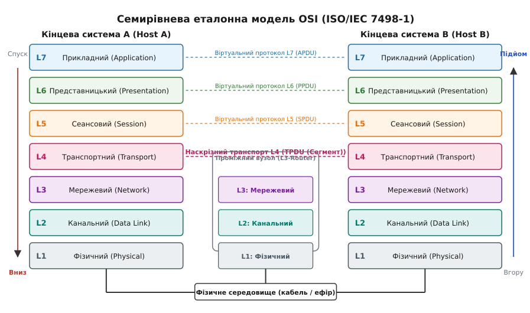
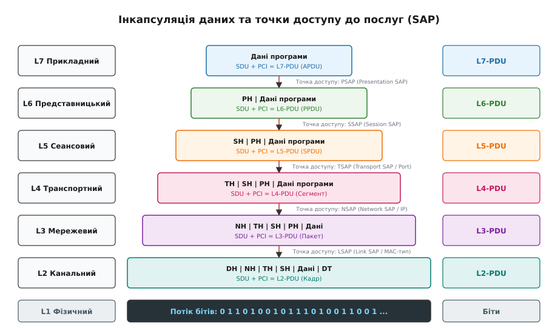
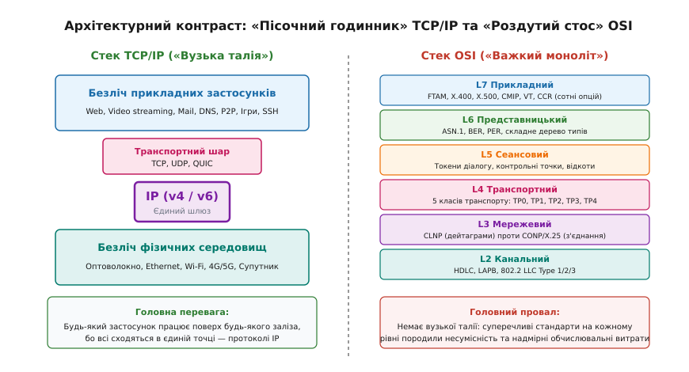
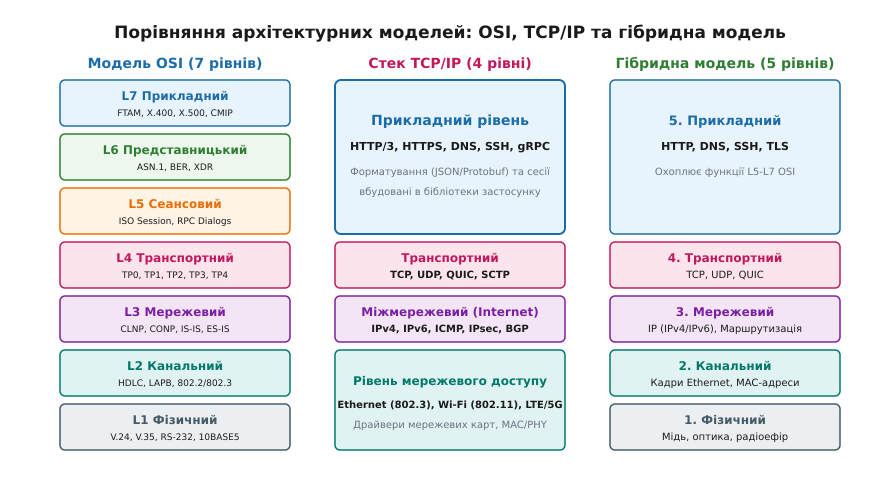

# Семирівнева модель OSI: рівні, стос і чому він виявився важким

<preknowlist>
- [Проєктування пакета](topic:com-transport/packet-design) — двійкові структури заголовків, корисне навантаження, поля довжини та виявлення меж блоків.
- [Керування потоком даних](topic:com-transport/flow-control) — узгодження швидкості передавача з місткістю буфера приймача через віконний механізм.
- [Контроль цілісності CRC](topic:com-modulation/crc) — циклічний надлишковий код для перевірки цілісності двійкових блоків даних.
- [Протоколи ARQ](topic:com-transport/arq-retransmission-schemes) — алгоритми автоматичного повторного надсилання та підтвердження отримання пакетів.
</preknowlist>

Наприкінці 1970-х років об'єднання двох комп'ютерів різних виробників у єдину мережу вимагало створення унікального апаратного та програмного перехідника для кожної пари пристроїв. Якщо мейнфрейм IBM під керуванням архітектури SNA (*Systems Network Architecture*) мав передати масив записів на комп'ютер DEC PDP-11 з протоколом DECnet, інженери стикалися з непереборною монолітністю: специфікація електричного кабелю, правила синхронізації бітів, формат адресації, логіка відновлення втрачених блоків і структура файлу були жорстко скомпоновані в єдиний неподільний програмний комплекс. Заміна коаксіального кабелю на телефонну лінію вимагала повного переписування програми передачі файлів, оскільки код вищого рівня безпосередньо залежав від часових інтервалів і службових бітів фізичного інтерфейсу.

Для подолання цієї системної кризи Міжнародна організація зі стандартизації (ISO, від грец. *isos* — «рівний») спільно з Міжнародним консультативним комітетом з телеграфії та телефонії (CCITT, нині ITU-T) розробила стандарт **ISO/IEC 7498-1** — базову еталонну модель взаємодії відкритих систем **OSI** (англ. *Open Systems Interconnection*, від лат. *inter* — «між» + *connectio* — «зв'язування»). Її фундаментальна мета полягала у створенні суворої шаруватої декомпозиції: розбити процес мережевого обміну на незалежні, взаємозамінні функціональні шари, кожен із яких розв'язує рівно одну ізольовану інженерну задачу та надає стандартизований інтерфейс послуг вищому рівню, повністю приховуючи внутрішні деталі реалізації.

---

## 1. Архітектурна декомпозиція: сім рівнів еталонної моделі

Модель OSI розділяє весь простір мережевої взаємодії на сім послідовних рівнів. Рівні згруповані у дві великі категорії: **середовищні (транзитні) рівні (L1–L3)**, які обробляються кожним проміжним комутатором або маршрутизатором на шляху руху сигналу, та **наскрізні (хостові) рівні (L4–L7)**, логіка яких виконується виключно на кінцевих комп'ютерах відправника та одержувача.


*Семирівнева еталонна модель OSI (ISO/IEC 7498-1): поділ на транзитні вузлові рівні (L1-L3) та наскрізні хостові процеси (L4-L7)*

### 1. Фізичний рівень (Physical Layer, L1)
Фізичний рівень відповідає за неструктуроване транспортування сирого двійкового потоку (послідовності бітів `0` та `1`) через фізичне середовище передачі (мідний кабель, оптичне волокно або радіоефір). 

Він стандартизує:
- Електричні та оптичні характеристики: рівні напруги, полярність імпульсів, довжини хвиль світловодів, порогові значення шумів та імпеданс лінії (наприклад, стандарти RS-232, V.24, 10BASE5, 100BASE-TX PHY).
- Механічні параметри: геометрію роз'ємів, кількість та призначення контактів (RJ-45, DB-9, оптичні конектори LC/SC).
- Функціональні та процедурні правила: методи модуляції сигналу (NRZ, Манчестерське кодування, PAM-4, QAM), тривалість тактового імпульсу та апаратну бітову синхронізацію приймача з передавачем.

Одиницею передачі фізичного рівня є **біт** (англ. *bit*). Фізичний рівень не має жодного уявлення про структуру, призначення чи правильність переданих даних: для нього не існує адрес, заголовків або меж повідомлень.

### 2. Канальний рівень (Data Link Layer, L2)
Канальний рівень перетворює ненадійне фізичне середовище з можливими бітовими помилками на стабільний канал зв'язку між двома безпосередньо з'єднаними сусідніми вузлами (hop-by-hop).

Його ключові механізми включають:
- **Кадрування (Framing):** Перетворення неперервного потоку бітів у дискретні службові блоки — **кадри** (англ. *frames*). Межі кадру виділяються спеціальними стартовими й стоповими послідовностями (преамбули, байти-прапорці `0x7E` у протоколах HDLC) або лічильниками довжини.
- **Фізична адресація:** Ідентифікація інтерфейсів у межах спільного фізичного середовища (наприклад, 48-бітні апаратні MAC-адреси стандарту IEEE 802).
- **Контроль цілісності:** Виявлення бітових спотворень, спричинених шумами лінії, за допомогою надлишкових контрольних сум [CRC](topic:com-modulation/crc) (*Cyclic Redundancy Check*) або контрольної послідовності кадру FCS (*Frame Check Sequence*).
- **Керування доступом до середовища:** Координація одночасної роботи кількох передавачів на спільній шині чи радіоканалі (підрівень MAC — *Media Access Control*, протоколи CSMA/CD, CSMA/CA, маркерне кільце Token Ring).

Канальний рівень гарантує доставку кадру виключно в межах одного локального сегмента мережі. Якщо адресат знаходиться за межами локального лінку, кадр передається проміжному шлюзу.

### 3. Мережевий рівень (Network Layer, L3)
Мережевий рівень забезпечує наскрізну доставку даних між довільними кінцевими системами через гетерогенні складені мережі, що складаються з безлічі різнорідних каналів зв'язку.

Основні функції рівня:
- **Логічна глобальна адресація:** Присвоєння кожному вузлу унікальної ієрархічної мережевої адреси (адреси NSAP у моделі OSI, IP-адреси в інтернеті), яка не залежить від апаратного типу каналу зв'язку.
- **Маршрутизація (Routing):** Визначення оптимального шляху пересилання пакетів через проміжні маршрутизатори за допомогою дистанційно-векторних алгоритмів або протоколів стану каналів (OSPF, IS-IS).
- **Сегментація та збирання (Fragmentation and Reassembly):** Поділ великих блоків даних на менші частини, якщо розмір пакета перевищує максимальний розмір передаваного блоку (MTU) проміжного каналу зв'язку.
- **Керування перевантаженням:** Виявлення заторів у чергах маршрутизаторів та регулювання інтенсивності потоку дейтаграм.

Одиницею інформації мережевого рівня є **пакет** (англ. *packet*). Мережевий рівень звільняє вищі рівні від необхідності знати фізичну топологію проміжних лінків та технології комутації.

### 4. Транспортний рівень (Transport Layer, L4)
Транспортний рівень забезпечує наскрізний (*End-to-End*) зв'язок між конкретними програмними процесами, що виконуються на віддалених комп'ютерах. Це найнижчий рівень, логіка якого функціонує виключно на хостах і ніколи не виконується проміжними мережевими маршрутизаторами.

Функціональні обов'язки:
- **Мультиплексування та адресація процесів:** Розподіл потоків даних між різними прикладними програмами за допомогою портів або селекторів точок доступу TSAP (*Transport Service Access Point*).
- **Сегментація та впорядкування:** Розбиття масивів даних прикладного рівня на **сегменти** (у термінології OSI — транспортні блоки TPDU), нумерація кожного блоку порядковим номером та відновлення правильної послідовності при отриманні.
- **Надійність та відновлення втрат:** Реалізація протоколів автоматичного повторного надсилання [ARQ](topic:com-transport/arq-retransmission-schemes) (*Automatic Repeat reQuest*) із використанням підтверджень (ACK) та ковзних вікон.
- **Наскрізне керування потоком:** Запобігання переповненню буферів приймача швидким передавачем через [механізми віконного контролю](topic:com-transport/flow-control).

У класичному стеку OSI стандартизовано п'ять класів транспортного протоколу (від TP0 для безпомилкових каналів до TP4 для ненадійних дейтаграмних мереж).

### 5. Сеансовий рівень (Session Layer, L5)
Сеансовий рівень керує встановленням, координацією, підтриманням та коректним завершенням діалогів (сесій) між двома взаємодіючими прикладними процесами.

Його призначення:
- **Керування режимом діалогу:** Визначення напрямку передачі даних: симплексний (в один бік), напівдуплексний (по черзі за допомогою передачі маркера-токена) або повнодуплексний (одночасно в обидва боки).
- **Синхронізація діалогу:** Встановлення контрольних точок (синхроточок, *Checkpoints*) всередині тривалого потоку обміну. У разі аварійного обриву каналу зв'язку передача відновлюється не з самого початку, а з останньої успішно підтвердженої контрольної точки (*Resynchronization*).
- **Розподіл активностей (Activity Management):** Логічне групування повідомлень у неподільні транзакції, що запобігає змішуванню результатів паралельних операцій.

Службовий блок сеансового рівня позначається як **SPDU** (*Session Protocol Data Unit*).

### 6. Представницький рівень (Presentation Layer, L6)
Представницький рівень відповідає за узгодження синтаксису, структури та семантики даних, що передаються між гетерогенними комп'ютерними системами.

Головна інженерна проблема, яку він розв'язує, — це відмінності у внутрішньому апаратному поданні інформації:
- Порядок байтів у багатобайтних числах: від старшого до молодшого (Big-Endian) проти від молодшого до старшого (Little-Endian).
- Кодування символьних рядків: ASCII, EBCDIC, UTF-8.
- Формати представлення чисел з плаваючою комою (IEEE 754 проти пропрієтарних форматів IBM/VAX).

Для стандартизації структури повідомлень рівень представлення використовує мову абстрактного опису синтаксису **ASN.1** (*Abstract Syntax Notation One*, ISO 8824) та правила канонічної двійкової серіалізації **BER/PER** (ISO 8825). Також на цьому рівні за специфікацією OSI передбачалися уніфіковані механізми стиснення та криптографічного шифрування даних. Службовий блок має назву **PPDU** (*Presentation Protocol Data Unit*).

### 7. Прикладний рівень (Application Layer, L7)
Прикладний рівень є верхньою межею моделі OSI, яка безпосередньо взаємодіє з користувацькими прикладними програмами (веббраузерами, поштовими клієнтами, термінальними емуляторами, системами управління базами даних).

Він не містить самих користувацьких програм, але надає їм набір стандартизованих протокольних сервісів:
- **FTAM (File Transfer, Access and Management, ISO 8571):** Стандартизована служба віддаленого доступу до файлових систем.
- **X.400 (MHS — Message Handling System):** Всесвітня система обміну електронними повідомленнями.
- **X.500 (Directory Services):** Ієрархічна служба глобальних каталогів ідентифікації користувачів і мережевих ресурсів (прямий прабатько LDAP).
- **CMIP (Common Management Information Protocol, ISO 9596):** Протокол моніторингу та управління мережевим обладнанням.

Службовий блок прикладного рівня позначається як **APDU** (*Application Protocol Data Unit*) або прикладне повідомлення.

---

## 2. Механізм інкапсуляції, структури PDU та точки доступу до послуг (SAP)

Фундаментальним принципом функціонування будь-якого шаруватого стека є суворе розмежування понять **послуги (сервісу)** та **протоколу**:
- **Сервіс** визначає вертикальну взаємодію: що саме рівень `(N)` виконує для вищого рівня `(N+1)` на одній локальній машині.
- **Протокол** визначає горизонтальну взаємодію: набір правил, форматів і послідовностей повідомлень, за якими рівень `(N)` на одній машині спілкується з еквівалентним рівнем-партнером `(N)` на віддаленій машині.


*Ієрархічна інкапсуляція даних: трансформація блоків SDU через додавання заголовків PCI у службові блоки PDU через точки доступу SAP*

### Інкапсуляція та декомпозиція блоків даних (SDU, PCI, PDU)

Кожен рівень оперує трьома чітко визначеними категоріями двійкових блоків даних:

1. **(N)-SDU (Service Data Unit — сервісний блок даних):** Масив «чистих» корисних даних, який рівень `(N+1)` передає рівню `(N)` для транспортування. Для рівня `(N)` внутрішній зміст цього блоку є непрозорим.
2. **(N)-PCI (Protocol Control Information — службова протокольна інформація):** Заголовок (і за потреби кінцевик-трейлер), який рівень `(N)` генерує для свого віддаленого партнера. Заголовок містить адреси, номери послідовностей, прапорці стану, лічильники довжини та контрольні суми.
3. **(N)-PDU (Protocol Data Unit — протокольний блок даних):** Повний результуючий пакет рівня `(N)`, що утворюється шляхом приєднання заголовка PCI до блоку SDU:

```
(N)-PDU = (N)-PCI + (N)-SDU
```

Сформований блок `(N)-PDU` спускається на один ступінь нижче і стає сервісним блоком даних `(N-1)-SDU` для нижчого рівня. Цей рекурсивний процес додавання службових заголовків при русі зверху вниз називається **інкапсуляцією** (від лат. *in* — «в» + *capsula* — «скринька»). 

При отриманні кадру на стороні приймача відбувається зворотний процес — **декапсуляція**: кожен рівень перевіряє свій заголовок `PCI`, відтинає його та передає очищений блок `SDU` вищому рівню через відповідний інтерфейс.

### Точки доступу до послуг (SAP) та сервісні примітиви

Для того щоб рівень `(N)` міг однозначно визначити, якому саме процесу вищого рівня `(N+1)` призначені отримані дані, використовується механізм **точок доступу до послуг (SAP — Service Access Point)**. Точка SAP є абстрактною адресою програмного порту або інтерфейсу на межі між двома суміжними рівнями:

- **LSAP (Link SAP):** Точка доступу канального рівня (байти `DSAP`/`SSAP` у заголовку IEEE 802.2 LLC), що визначає мережевий протокол (IP, CLNP, IPX).
- **NSAP (Network SAP):** Повна мережева адреса вузла, яка ідентифікує конкретний мережевий інтерфейс хоста.
- **TSAP (Transport SAP):** Транспортний селектор (числовий ідентифікатор або порт), що прив'язує транспортне з'єднання до конкретного процесу в операційній системі.
- **SSAP / PSAP:** Сеансові та представницькі селектори, що задають конкретний прикладний контекст.

Взаємодія через точку SAP описується чотирма стандартними типами **сервісних примітивів**:
1. **Request (Запит):** Рівень `(N+1)` ініціює операцію на рівні `(N)` (наприклад, `N-UNITDATA.request` для відправлення дейтаграми).
2. **Indication (Сповіщення):** Рівень `(N)` сповіщає рівень `(N+1)` про надходження вхідних даних або запиту на з'єднання.
3. **Response (Відповідь):** Рівень `(N+1)` підтверджує отримання сповіщення або дає згоду на відкриття з'єднання.
4. **Confirm (Підтвердження):** Рівень `(N)` сповіщає вихідного ініціатора про успішне завершення запитаної операції.

Повний побайтовий опис двійкових заголовків CLNP, TP4 та правила кодування синтаксису ASN.1/BER винесено в довідник [📋 Специфікація двійкових структур PDU та протоколів стеку OSI](topic:com-transport/osi-model/api-osi-pdu-structures.md).

---

## 3. Реальний протокольний стек OSI: стандартизовані протоколи

Еталонна модель ISO 7498-1 була не просто концептуальною схемою: під кожен із семи рівнів міжнародні комітети розробили та стандартизували ціле сімейство повнофункціональних протоколів, що утворили так званий **протокольний стек OSI**.

### Мережевий протокол CLNP (ISO 8473)
**CLNP** (*Connectionless Network Protocol*) — дейтаграмний протокол мережевого рівня, який є прямим функціональним аналогом IPv4 та IPv6. Він оперує адресами NSAP змінної довжини (до 20 байтів на адресу), підтримує фрагментацію, обмеження часу життя пакетів через лічильник `Lifetime` (в одиницях по 500 мс) та контроль цілісності заголовка за допомогою [алгоритму Флетчера (Fletcher-16)](topic:com-modulation/crc).

### Протокол маршрутизації IS-IS (ISO/IEC 10589)
**IS-IS** (*Intermediate System to Intermediate System*) — протокол динамічної маршрутизації на основі відстеження стану каналів (Link-State), розроблений для маршрутизації пакетів CLNP між проміжними системами (маршрутизаторами). Він використовує алгоритм Дейкстри (SPF) для розрахунку найкоротших шляхів, підтримує дворівневу ієрархію маршрутизації (Level-1 всередині області, Level-2 між областями) та працює безпосередньо поверх кадрів канального рівня L2 без проміжних заголовків.

### Транспортні протоколи TP0–TP4 (ISO 8073 / ITU-T X.224)
Транспортний рівень OSI було розділено на п'ять незалежних класів залежно від характеристик надійності нижчого мережевого рівня:
- **TP0 (Simple Class):** Найпростіший протокол без контролю помилок і сегментації, розрахований на ідеальні мережі з гарантованим з'єднанням (X.25).
- **TP1 (Basic Error Recovery Class):** Додає базове відновлення після обривів з'єднання на основі нумерації пакетів.
- **TP2 (Multiplexing Class):** Дозволяє мультиплексувати кілька транспортних сесій в одне мережеве з'єднання X.25.
- **TP3 (Error Recovery and Multiplexing):** Поєднує можливості класів TP1 та TP2.
- **TP4 (Error Detection and Recovery Class):** Повнофункціональний аналог TCP. Розрахований на роботу поверх ненадійних дейтаграмних мереж (CLNP). Забезпечує наскрізний контроль цілісності, ковзне вікно підтверджень, упорядкування сегментів, таймери повторної передачі та керування потоком за допомогою кредитів.

Робочу програмну реалізацію низькорівневого розбору пакетів CLNP та TP4 мовами C та C++ наведено у практичній вставці [⚙️ Парсер двійкових заголовків CLNP та TP4 мовами C та C++](topic:com-transport/osi-model/proj-clnp-parser.md).

---

## 4. Чому стек OSI програв реальну війну за інтернет

Наприкінці 1980-х років уряди США (програма GOSIP), Великої Британії та Європейського Союзу офіційно проголосили стек протоколів OSI обов'язковим державним стандартом. Проте до середини 1990-х років стек OSI зазнав нищівної поразки й був практично повністю витіснений простішим стеком **TCP/IP**.


*Архітектурний контраст: модель «пісочного годинника» TCP/IP із вузькою талією на рівні IP проти перевантаженого монолітного стосу OSI*

Аналіз причин цієї історичної поразки виділяє чотири ключових інженерних та організаційних фактори:

### 1. Ефект «кривих висячих мостів» (The "Apocryphal Hourglass" / "Curved Suspension Bridge")
Як зазначав відомий фахівець із комп'ютерних мереж Ендрю Таненбаум, життєвий цикл успішного стандарту описується парадоксом своєчасності:
- Якщо протокол стандартизувати **занадто рано** — коли практичного досвіду експлуатації ще немає, комітети створюють абстрактні, громіздкі стандарти з масою невиправданих припущень.
- Якщо протокол стандартизувати **занадто пізно** — ринок уже захоплюють пропрієтарні комерційні реалізації, і домовитися про єдиний стандарт стає неможливо.

Стек OSI потрапив у першу пастку: його стандарти створювалися в кабінетах теоретиків до появи працюючого коду. Специфікації містили сотні необов'язкових параметрів, взаємовиключних опцій і надлишкових шарів, що призвело до появи неповоротких і несумісних між собою реалізацій.

### 2. Бюрократизація комітетів ISO проти філософії IETF
Стандартизація в ISO та CCITT велася за класичними бюрократичними правилами міжнародної дипломатії: кожна державна телефонна монополія (PTT) та велика корпорація (IBM, DEC, Bull, Siemens) відстоювали власні комерційні інтереси. Щоб досягти компромісу, комітети не обирали одне найкраще рішення, а вносили пропозиції всіх сторін як взаємовиключні опції стандарту. Крім того, документи ISO були платними й коштували сотні швейцарських франків, що закривало доступ до них студентам, університетам та незалежним розробникам.

На противагу цьому спільнота **IETF** (*Internet Engineering Task Force*), що створювала TCP/IP, керувалася фундаментальним принципом, сформульованим Девідом Кларком у 1992 році:
> *«We reject: kings, presidents and voting. We believe in: rough consensus and running code.»*  
> («Ми відкидаємо: королів, президентів і голосування. Ми віримо в: грубий консенсус і працюючий код».)

Специфікації IETF поширювалися абсолютно безкоштовно у вигляді простих текстових файлів **RFC** (*Request for Comments*), а стандартом міг стати лише той протокол, який мав щонайменше дві незалежні інтероперабельні реалізації, протестовані під реальним навантаженням.

### 3. Архітектурний перекіс: зайвість сеансового та представницького рівнів
У реальній практиці розробки програмного забезпечення виділення рівнів L5 (Session) та L6 (Presentation) в окремі ядра мережевого стека операційної системи виявилося архітектурною помилкою з точки зору **принципу кінцевих точок (End-to-End Principle)**, сформульованого Дж. Зальцером, Д. Рідом та Д. Кларком у 1984 році:
- Стан сеансу, контрольні точки транзакцій і логіка відновлення діалогу є глибоко специфічними для кожного окремого прикладного застосунку (база даних, передача файлу або потік відео мають кардинально різні вимоги до збереження сеансу). Спроба реалізувати універсальний сеансовий рівень у ядрі ОС призвела лише до зайвих накладних витрат процесора та затримок буферизації.
- Серіалізація та узгодження типів даних (ASN.1/BER) вимагали значних обчислювальних ресурсів процесора. Застосунки надали перевагу простим вбудованим бібліотекам синтаксичного розбору (JSON, Protobuf, gRPC) або відкритим текстовим форматам (HTTP), повністю відмовившись від загальносистемного рівня L6.

Транспортний рівень (TCP) та мережевий рівень (IP) узяли на себе всю важку роботу з надійної доставки дейтаграм, а прикладні програми забрали функціонал L5–L6 у власний адресний простір користувача.

### 4. Тріумф відкритого коду BSD UNIX
У 1983 році Університет Берклі випустив операційну систему **4.2BSD UNIX**, яка містила повноцінний, відкритий, стабільний стек TCP/IP та інтуїтивно зрозумілий програмний інтерфейс сокетів (**Berkeley Sockets API**). Будь-який виробник комп'ютерів міг безкоштовно вбудувати цей стек у свою систему. Реалізації стека OSI, навпаки, були закритими, коштували десятки тисяч доларів і вимагали складного програмного інтерфейсу XTI/TLI.

Детальний аналіз історичних подій протокольних воєн, державних директив GOSIP та переломного рішення NSFNET 1990 року викладено у вставці [📜 Протокольні війни 1980-х: як OSI створювали як світовий стандарт і чому переміг TCP/IP](topic:com-transport/osi-model/hist-protocol-wars.md).

---

## 5. Співвідношення моделей: OSI, TCP/IP та сучасна 5-рівнева гібридна модель

Реальний стек Інтернету (TCP/IP) не вкладається безпосередньо в 7-рівневу сітку OSI. Замість семи рівнів архітектура TCP/IP офіційно визначає **чотири рівні** (RFC 1122), тоді як у сучасній інженерній освіті та мережевій практиці використовується **п'ятирівнева гібридна модель**:


*Порівняння архітектурних шарів: зіставлення функцій 7-рівневої моделі OSI, 4-рівневого стеку TCP/IP та 5-рівневої гібридної моделі*

### Зіставлення рівнів:

| Еталонна модель OSI (7 рівнів) | Стек протоколів TCP/IP (4 рівні, RFC 1122) | Сучасна гібридна модель (5 рівнів) | Приклади протоколів та технологій у сучасному інтернеті |
|---|---|---|---|
| **L7. Прикладний (Application)** | <br>**1. Прикладний рівень (Application)**<br>*(Об'єднує функції рівнів L5–L7 OSI)* | **5. Прикладний (Application)** | HTTP/3, HTTPS, DNS, SSH, BGP, gRPC, TLS/SSL, WebSocket |
| **L6. Представницький (Presentation)** | | | |
| **L5. Сеансовий (Session)** | | | |
| **L4. Транспортний (Transport)** | **2. Транспортний рівень (Transport)** | **4. Транспортний (Transport)** | TCP, UDP, QUIC, SCTP |
| **L3. Мережевий (Network)** | **3. Міжмережевий рівень (Internet)** | **3. Мережевий (Network)** | IPv4, IPv6, ICMP, IPsec |
| **L2. Канальний (Data Link)** | <br>**4. Рівень мережевого доступу (Network Access / Link)**<br>*(Об'єднує апаратні драйвери L1–L2)* | **2. Канальний (Data Link)** | Ethernet (IEEE 802.3), Wi-Fi (802.11), PPP, LTE/5G MAC |
| **L1. Фізичний (Physical)** | | **1. Фізичний (Physical)** | 1000BASE-T, Оптоволокно (100GBASE-LR4), Радіоефір |

---

## 6. Жива спадщина OSI в сучасних комп'ютерних мережах

Попри те що чистий протокольний стек OSI (CLNP, TP4, FTAM) так і не став основою світового інтернету, теоретичні концепції та окремі протоколи ISO/OSI залишили глибокий слід у сучасній інженерній індустрії:

1. **Універсальний інженерний словник:** Поняття рівнів моделі OSI стало стандартною мовою класифікації мережевого обладнання та програмних комплексів у всьому світі:
   - **L2-комутатор (L2 Switch):** Пристрій, що пересилає трафік виключно на основі апаратних MAC-адрес канального кадру без аналізу IP-пакетів.
   - **L3-маршрутизатор (L3 Router):** Пристрій, що аналізує мережеві IP-адреси та прокладає маршрути між різними підмережами.
   - **L4-балансувальник навантаження (L4 Load Balancer):** Система, що розподіляє мережевий трафік на основі IP-адрес і номерів TCP/UDP портів без аналізу корисного навантаження (наприклад, IPVS, AWS NLB).
   - **L7-проксі та зворотний шлюз (L7 Reverse Proxy / WAF):** Комплекс, що аналізує повний прикладний контекст повідомлення — HTTP-заголовки, URL-шляхи, сесійні cookie, сертифікати TLS (наприклад, Nginx, Envoy, Cloudflare WAF).
2. **Протокол IS-IS у магістральних мережах (Backbone Networks):** Протокол IS-IS було розширено для підтримки IP-маршрутизації (Integrated IS-IS / Dual IS-IS, RFC 1195). Завдяки високій масштабованості, незалежності від стека IP та стійкості до перевантажень він сьогодні є головним внутрішнім протоколом маршрутизації (IGP) у мережах найбільших світових провайдерів рівня Tier-1 та центрах обробки даних гігантів хмарної індустрії.
3. **Служба каталогів X.500 та протокол LDAP:** Концепція розподіленого дерева каталогів (DIT — *Directory Information Tree*), розроблена в стандарті X.500, лягла в основу полегшеного протоколу доступу до каталогів **LDAP** (*Lightweight Directory Access Protocol*), на якому базуються всі сучасні корпоративні служби автентифікації та контролю доступу (Microsoft Active Directory, FreeIPA, OpenLDAP).
4. **Криптографічні сертифікати X.509:** Формат сертифікатів відкритих ключів X.509, розроблений для захисту запитів каталогу X.500, став світовим стандартом інфраструктури відкритих ключів (PKI). Кожне безпечне з'єднання HTTPS, сертифікат безпеки TLS/SSL, цифровий підпис та захищений ключ SSH сьогодні базуються саме на структурах X.509 та мові ASN.1.
5. **Мова ASN.1 у мобільному зв'язку 4G/5G:** Мова ASN.1 та правила упакованого двійкового кодування PER (*Packed Encoding Rules*) є безальтернативним стандартом консорціуму 3GPP для опису протоколів керування радіоресурсами RRC (*Radio Resource Control*) та інтерфейсів базових станцій у мережах стільникового зв'язку LTE та 5G New Radio.

> 🔧 **Навіщо це мережевому інженеру та розробнику.**
> Знання моделі OSI дає системне бачення архітектури будь-якої комунікаційної системи. Коли в додатку виникає збій зв'язку, інженер не шукає помилку навмання, а локалізує проблему пошарово: від фізичного лінку (`L1: чи є лінк на порті?`) і канального рівня (`L2: чи резолвиться MAC через ARP?`) до мережевого (`L3: чи ходить ICMP ping?`), транспортного (`L4: чи відкривається TCP handshake через syn/ack?`) та прикладного (`L7: який HTTP-статус або код помилки TLS?`). Це перетворює налагодження складної розподіленої системи на швидкий, алгоритмічний та передбачуваний інженерний процес.
