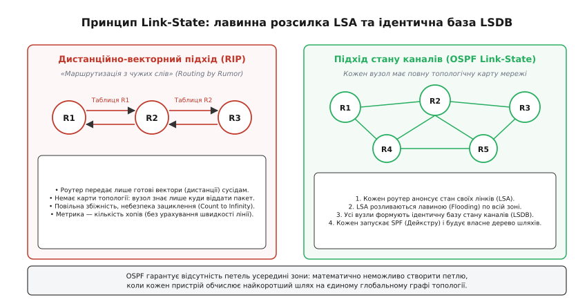
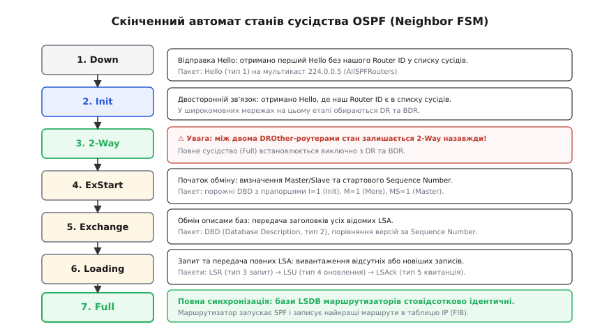
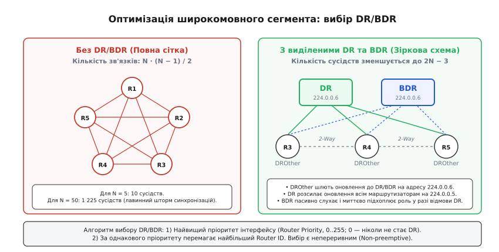
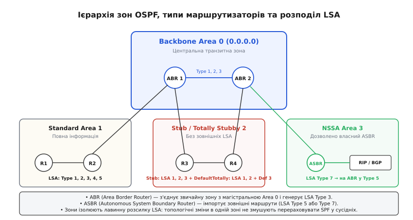

# OSPF: протокол стану каналів

<preknowlist>
- [Маршрутизація IP](root:com-transport/ip-routing) — таблиці маршрутизації, префікси підмереж, longest prefix match, шлюз за замовчуванням.
- [MAC, IP і ARP](root:com-transport/mac-ip-arp) — канальний та мережевий рівні, широкомовні домени (broadcast), резолвінг IP в MAC.
- [Алгоритм Дейкстри](root:sf-algorithms/dijkstra) — пошук найкоротших шляхів у зваженому графі без від'ємних ваг ребер.
- [Затримка й надійність](root:com-transport/latency-reliability) — пропускна здатність, час поширення сигналу, метрики лінків.
</preknowlist>

Коли корпоративна чи операторська мережа налічує десятки маршрутизаторів із резервними оптичними лінками, найменший обрив кабелю або перезавантаження комутатора здатні паралізувати передачу даних, якщо протокол маршрутизації спирається на застарілий дистанційно-векторний підхід (RIP). У дистанційно-векторних мережах вузли обмінюються лише підсумковими таблицями кожні 30 секунд. У разі аварії вони починають передавати один одному спотворені дані, утворюючи маршрутні петлі та поступово збільшуючи лічильник переходів аж до штучної межі в 16 хопів. Протягом кількох хвилин такої збіжності пакети безкінечно кружляють замкненими колами, переповнюючи буфери пам'яті. Ба більше, найпростіший підрахунок кількості переходів змушує мережу обирати прямий застарілий канал 10 Мбіт/с замість швидкісного обхідного шляху 10 Гбіт/с через два проміжних комутатори лише тому, що 1 хоп формально менший за 2 хопи.

Причина цієї кризи криється у фундаментальній сліпоті дистанційно-векторного методу: жоден маршрутизатор не має карти топології і приймає рішення «наосліп», спираючись на неперевірені підсумки сусідів. Щоб забезпечити миттєву збіжність за частки секунди, усунути математичну можливість виникнення петель і скеровувати трафік з урахуванням реальної пропускної здатності ліній, інженери розробили принципово інший клас протоколів — протоколи стану каналів (англ. *Link-State Routing Protocols*).

Головним відкритим стандартом цього класу став протокол **OSPF** (англ. *Open Shortest Path First*, «відкритий протокол першочергового вибору найкоротшого шляху», стандартизований IETF у RFC 2328 для IPv4 та RFC 5340 для IPv6). Замість трансляції готових таблиць кожен маршрутизатор OSPF самостійно досліджує стан власних фізичних інтерфейсів, пакує ці дані в компактні оголошення (LSA) та розсилає їх лавиною всім вузлам зони. У результаті кожен пристрій накопичує ідентичну копію топологічної бази даних (LSDB), перетворює її на математичний граф і самостійно знаходить оптимальні маршрути за допомогою алгоритму Дейкстри.

---

### 1. Концепція стану каналів (Link-State) та усунення маршрутних петель

Фундаментальна відмінність підходу стану каналів від дистанційних векторів полягає у розподілі обов'язків між протоколом передачі даних та обчислювальним алгоритмом:

1. **Локальне спостереження:** маршрутизатор відстежує стан лише безпосередньо підключених інтерфейсів (чи піднято лінк, яка його швидкість, IP-адреса, маска підмережі та хто є сусідом на іншому кінці дроту).
2. **Лавинна розсилка (Flooding):** інформація про стан власних каналів пакується в стандартизовані структури — **оголошення про стан каналів** (LSA, англ. *Link State Advertisement*). Ці оголошення розповсюджуються лавиною від вузла до вузла без жодних змін і модифікацій.
3. **Єдина топологічна база (LSDB):** отримавши LSA від усіх пристроїв, кожен маршрутизатор формує в оперативній пам'яті **базу даних стану каналів** (LSDB, англ. *Link-State Database*). Оскільки всі коректні LSA надійно доставляються кожному вузлу, вміст LSDB на всіх маршрутизаторах усередині однієї зони стає абсолютно ідентичним.
4. **Автономний розрахунок найкоротших шляхів (SPF):** маючи перед очима повну топологічну карту мережі, кожен маршрутизатор представляє її як зважений орієнтований граф `G = (V, E)` і запускає алгоритм Дейкстри. Коренем обчислюваного дерева найкоротших шляхів (SPT, англ. *Shortest Path Tree*) стає сам цей маршрутизатор.


*Принцип стану каналів: замість обміну векторами відстаней кожен маршрутизатор розсилає стан власних зв'язків (LSA), формуючи в усіх вузлів ідентичну базу топології (LSDB) для незалежного розрахунку найкоротших шляхів.*

Завдяки тому, що кожен маршрутизатор бачить повну картину топології, в OSPF усередині зони **математично неможливо створити маршрутну петлю**: алгоритм Дейкстри на графі з додатними вагами ребер завжди будує строго деревоподібну структуру без замкнених циклів.

> 🔧 **Навіщо це в реальній розробці.**
> У великих дата-центрах та корпоративних мережах Link-State протоколи забезпечують час реакції на аварію кабелю в межах 50–200 мілісекунд (проти 30–180 секунд у RIP). Якщо резервна оптична лінія обривається, LSA про зміну стану надсилається миттєво, вузли перераховують локальне дерево шляхів і перемикають апаратні таблиці комутації (FIB) до того, як користувацькі TCP-сесії встигнуть розірватися через тайм-аут.

Детальніше про те, як криза протоколу RIP та експерименти в мережі ARPANET привели до створення стандарту OSPF під керівництвом Джона Моя, розповідає [історія створення OSPF](root:com-transport/ospf/hist-ospf-origins.md).

---

### 2. Ідентифікація маршрутизатора (Router ID) та виявлення сусідів через Hello

Перш ніж обмінюватися топологічними картами, пристрої OSPF повинні знайти один одного в локальних сегментах мережі та узгодити правила взаємодії.

Кожен маршрутизатор у домені OSPF зобов'язаний мати унікальний **ідентифікатор маршрутизатора** (англ. *Router ID*, **RID**) — 32-бітне число, яке записується у форматі IPv4-адреси (наприклад, `1.1.1.1` або `192.168.10.254`). Router ID однозначно маркує вершину в глобальному графі топології.

#### Правило вибору Router ID (у порядку пріоритету):
1. **Ручне налаштування:** значення, явно вказане адміністратором у конфігурації команди `ospf router-id <IP>` (найкраща інженерна практика).
2. **Найвища IP-адреса петльового інтерфейсу (Loopback):** якщо явний RID не задано, обирається найбільша IP-адреса серед активних віртуальних loopback-інтерфейсів (вони ніколи не падають через фізичні проблеми з кабелем).
3. **Найвища IP-адреса фізичного інтерфейсу:** якщо loopback відсутній, обирається найбільша IP-адреса серед активних фізичних портів у стані `UP`.

#### Пошук сусідів за допомогою пакетів Hello
Маршрутизатор періодично (за замовчуванням кожні 10 секунд на каналах Ethernet) відправляє через усі увімкнені інтерфейси службові пакети **Hello** (Type 1). Пакети надсилаються на зарезервовану групову IPv4-адресу `224.0.0.5` (усі маршрутизатори OSPF, `AllSPFRouters`) або `FF02::5` для IPv6.

```
+------------------------------------------------------------------------+
|                          ПАКЕТ OSPF HELLO                              |
|                                                                        |
|  [Router ID: 1.1.1.1]   [Area ID: 0.0.0.0]   [Netmask: /24]            |
|  [HelloInterval: 10s]   [DeadInterval: 40s]  [Priority: 1]             |
|  [DR: 192.168.1.1]      [BDR: 192.168.1.2]   [Options: E-bit=1]        |
|  [Neighbors: 2.2.2.2, 3.3.3.3]                                         |
+------------------------------------------------------------------------+
```

Для того щоб два сусідні маршрутизатори визнали один одного сусідами та почали синхронізацію, у їхніх пакетах Hello **повинні суворо збігатися шість параметрів**:
- **Area ID:** пристрої повинні належати одній і тій самій зоні OSPF.
- **Network Mask:** маска підмережі на спільній ділянці кабелю повинна бути однаковою (для широкомовних сегментів).
- **HelloInterval та RouterDeadInterval:** часові інтервали опитування та очікування мають бути ідентичними (типово 10 с / 40 с). Якщо таймери відрізняються бодай на секунду, зв'язок не встановиться.
- **Authentication:** тип автентифікації (відкритий пароль, MD5, HMAC-SHA) та сам спільний ключ.
- **Stub Area Flags (Options E-bit / N-bit):** обидва маршрутизатори мають однаково розуміти тип зони (чи дозволено зовнішні маршрути).
- **MTU інтерфейсів:** значення максимального розміру IP-пакета повинно збігатися (інакше збій станеться на етапі DBD).

---

### 3. П'ять типів пакетів та скінченний автомат сусідства (FSM)

OSPF визначає п'ять спеціалізованих типів пакетів для повного життєвого циклу маршрутизації:

| Тип | Назва пакета | Функція у протоколі |
| :---: | :--- | :--- |
| **1** | **Hello** | Динамічне виявлення сусідів, узгодження параметрів, контроль працездатності (Keepalive). |
| **2** | **Database Description (DBD)** | Передача компактного переліку заголовків усіх відомих LSA для виявлення розбіжностей. |
| **3** | **Link State Request (LSR)** | Точковий запит повних тіл LSA, яких не вистачає або які застаріли в локальній базі. |
| **4** | **Link State Update (LSU)** | Контейнер, що переносить повноцінні записи LSA під час первинної синхронізації або аварій. |
| **5** | **Link State Acknowledgment (LSAck)** | Підтвердження успішного прийому LSA для забезпечення надійності доставки. |

Процес встановлення повноцінного зв'язку між двома маршрутизаторами описується скінченним автоматом станів (англ. *Neighbor Finite State Machine*):

1. **Down:** початковий стан. Жодних пакетів Hello від сусіда ще не надходило.
2. **Attempt:** використовується лише в мережах NBMA (Frame Relay, ATM): роутер надсилає одноадресні Hello вручну сконфігурованим сусідам.
3. **Init:** маршрутизатор отримав пакет Hello від сусіда, але в полі `Neighbor List` ще не побачив власного Router ID (односторонній зв'язок).
4. **2-Way:** маршрутизатор отримав Hello, де серед списку активних сусідів фігурує його власний Router ID. Це підтверджує наявність двостороннього зв'язку. У сегментах Ethernet на цьому етапі обираються виділені маршрутизатори DR та BDR. Між звичайними вузлами (DROther) стан назавжди залишається `2-Way`.
5. **ExStart:** підготовка до синхронізації баз даних. Маршрутизатори визначають ролі **Master** та **Slave** за допомогою порожніх DBD-пакетів. Роутер із більшим Router ID стає Master і встановлює початковий порядковий номер послідовності (Sequence Number).
6. **Exchange:** маршрутизатори обмінюються заповненими пакетами DBD, що містять 20-байтові заголовки всіх LSA з їхніх баз даних. Порівнюючи отримані заголовки з власними, вузол виявляє, які записи в нього відсутні або мають старіший порядковий номер.
7. **Loading:** активне завантаження відсутньої інформації. Маршрутизатор формує запити **LSR** на потрібні LSA, сусід відповідає пакетами **LSU** з повним вмістом записів, а отримувач підтверджує кожен отриманий блок пакетом **LSAck**.
8. **Full:** бази даних LSDB обох маршрутизаторів повністю ідентичні. Стан повного сусідства (англ. *Full Adjacency*) досягнуто. Маршрутизатор запускає розрахунок алгоритму Дейкстри (SPF).


*Скінченний автомат OSPF: послідовний перехід від виявлення сусіда через Hello-пакети до повної синхронізації баз LSDB за допомогою DBD, LSR, LSU та LSAck.*

Повний бінарний формат кожного байта заголовків, значення прапорців `I`, `M`, `MS` та типи автентифікації детально задокументовано у вставці [бінарні структури пакетів та LSA](root:com-transport/ospf/api-ospf-packets.md).

---

### 4. Оптимізація сегментів множинного доступу: вибір DR та BDR

Коли кілька маршрутизаторів підключено до спільного комутатора Ethernet (середовище широкомовного множинного доступу, Broadcast Multi-Access), пряме встановлення сусідства «кожен із кожним» спричиняє комбінаторний вибух.

Для `N` маршрутизаторів кількість взаємних сусідств (Adjacencies) становить:

```
Кількість зв'язків = N · (N − 1) / 2
```

Для 10 роутерів це 45 сесій синхронізації, а для 50 роутерів — 1225 сесій. Будь-яка зміна лінку породила б лавинний шторм дублюючих пакетів LSU та LSAck, забиваючи комутатор гігабайтами службового трафіку.


*Оптимізація широкомовного сегмента: виділені маршрутизатори DR і BDR скорочують кількість зв'язків з повної сітки до зірки, запобігаючи лавинним штормам повідомлень.*

Для розв'язання цієї проблеми OSPF обирає в кожному багатоабонентському сегменті два спеціальні пристрої:
- **Designated Router (DR):** виділений маршрутизатор, який стає центральним хабом сегмента. Усі інші маршрутизатори встановлюють стан `Full` виключно з DR (та його резервом BDR). Кількість зв'язків скорочується з квадратичної `O(N²)` до лінійної `2N − 3`.
- **Backup Designated Router (BDR):** резервний виділений маршрутизатор, який пасивно дублює всі транзакції DR і миттєво перебирає його обов'язки у разі аварії без повторної синхронізації сегмента.
- **DROther:** усі інші звичайні маршрутизатори сегмента. Між собою вони тримають стан **2-Way** і ніколи не синхронізують бази безпосередньо.

#### Маршрутизація оновлень через дві мультикаст-адреси:
- Коли у звичайного роутера (DROther) падає або піднімається лінк, він надсилає пакет LSU на спеціальну адресу `224.0.0.6` (`AllDRouters`). Цю адресу слухають **лише DR та BDR**.
- Отримавши оновлення, DR підтверджує його і ретранслює пакет LSU на загальну адресу `224.0.0.5` (`AllSPFRouters`), повідомляючи всіх інших учасників сегмента.

#### Алгоритм вибору DR та BDR:
1. **Пріоритет інтерфейсу (Router Priority):** число від 0 до 255 (налаштовується командою `ip ospf priority <0-255>`). Перемагає пристрій із найбільшим пріоритетом. Значення `0` назавжди позбавляє маршрутизатор права брати участь у виборах (він завжди лишається DROther).
2. **Тай-брейк за Router ID:** якщо пріоритети однакові, перемагає маршрутизатор із найбільшим значенням Router ID.
3. **Принцип непереривності (Non-preemptive):** якщо вибори вже відбулися, поява в мережі нового маршрутизатора з вищим пріоритетом або більшим RID **не призводить** до переобрання DR. Це захищає мережу від раптових розривів зв'язку та повторних перерахунків графа при підключенні нового обладнання.

---

### 5. База даних стану каналів (LSDB) та типи оголошень LSA

База даних стану каналів (LSDB) — це не просто таблиця IP-адрес, а структурована база об'єктів різних типів, кожен із яких описує окремий фрагмент мережевої топології.

```
+-------------------------------------------------------------------------+
|                  БАЗА ДАНИХ СТАНУ КАНАЛІВ (LSDB)                        |
|                                                                         |
|  [Type 1: Router-LSA]     -> Опис кожного роутера та його інтерфейсів   |
|  [Type 2: Network-LSA]    -> Опис транзитних мереж Ethernet від DR      |
|  [Type 3: Summary-LSA]    -> Маршрути між зонами (від ABR)              |
|  [Type 4: ASBR Summary]   -> Вартість шляху до ASBR (від ABR)           |
|  [Type 5: External-LSA]   -> Зовнішні імпортовані маршрути (від ASBR)   |
|  [Type 7: NSSA-External]  -> Зовнішні маршрути всередині спецзони NSSA  |
+-------------------------------------------------------------------------+
```

Розглянемо шість ключових типів LSA:

#### Type 1: Router-LSA
Генерується абсолютно **кожним** маршрутизатором окремо для кожної зони, в якій він присутній. Router-LSA перелічує всі безпосередні зв'язки пристрою та їхню вартість. Запис ніколи не виходить за межі своєї зони (Flooding Scope = Area).
Описує 4 типи з'єднань:
- *Point-to-Point:* прямий канал до іншого роутера.
- *Transit Network:* підключення до багатоабонентської мережі (вказує IP-адресу DR).
- *Stub Network:* кінцева підмережа без сусідів (loopback або клієнтська IP-підмережа з маскою).
- *Virtual Link:* логічний тунель через проміжну зону до Area 0.

#### Type 2: Network-LSA
Генерується виключно **виділеним маршрутизатором (DR)** для транзитного сегмента Ethernet. Містить маску підмережі та повний перелік Router ID усіх маршрутизаторів, підключених до цього комутатора. Також не покидає межі своєї зони. Разом Type 1 та Type 2 дають вичерпну картину внутрішньої топології зони.

#### Type 3: Summary-LSA (Inter-Area Prefix)
Генерується прикордонними маршрутизаторами зон (**ABR**, англ. *Area Border Router*). ABR бере відомості про підмережі однієї зони й оголошує їх у сусідні зони у вигляді узагальнених IP-префіксів з відповідною метрикою. Це позбавляє сусідні зони необхідності знати точну структуру чужого графа.

#### Type 4: ASBR Summary-LSA
Також генерується **ABR** і повідомляє маршрутизаторам інших зон про те, де саме розташований прикордонний маршрутизатор автономної системи (**ASBR**, англ. *Autonomous System Boundary Router*) та яка вартість шляху до нього через магістральну зону.

#### Type 5: AS-External-LSA
Генерується **ASBR** для кожного зовнішнього маршруту, перенесеного в OSPF з інших джерел (BGP, RIP, статична маршрутизація). Поширюється по всіх стандартних зонах всієї автономної системи.
Підтримує два типи метрик:
- **E1 (External Type 1):** вартість маршруту розраховується як сума внутрішньої вартості IGP до самого ASBR плюс зовнішня вартість. Використовується, коли в мережі є кілька виходів назовні й треба обрати найближчий.
- **E2 (External Type 2, за замовчуванням):** вартість фіксована і дорівнює лише зовнішній метриці; внутрішня вартість IGP ігнорується при порівнянні маршрутів.

#### Type 7: NSSA-External-LSA
Використовується в спеціальних частково тупикових зонах (**NSSA**, RFC 3101). Дозволяє локальному ASBR всередині NSSA імпортувати зовнішні маршрути, не відкриваючи зону для важких LSA Type 5 з решти інтернету. На виході з NSSA маршрутизатор ABR перетворює LSA Type 7 на стандартні LSA Type 5.

#### Механізм старіння LSA (Aging)
Кожен запис LSA містить 16-бітне поле `LS Age`. Під час створення вік дорівнює 0, а перебуваючи в пам'яті чи передаючись мережею, він щосекунди збільшується на одиницю. Маршрутизатор-генератор зобов'язаний оновлювати власні LSA кожні 30 хвилин (`LSRefreshTime = 1800` с), надсилаючи нову копію зі збільшеним на одиницю `Sequence Number`. Якщо через падіння вузла LSA не оновлюється і його вік сягає `MaxAge = 3600` секунд (1 година), цей запис вважається мертвим, розсилається з віком MaxAge для сповіщення сусідів і назавжди видаляється з бази LSDB.

---

### 6. Розрахунок найкоротших шляхів алгоритмом Дейкстри (SPF)

Коли процес синхронізації LSDB завершено, кожен маршрутизатор запускає алгоритм Дейкстри. Вхідними даними є множина Router-LSA (Type 1) та Network-LSA (Type 2).

#### Формула вартості каналу:
Вартість ребра в графі обчислюється як відношення еталонної смуги до реальної швидкості порту:

```
Cost = Reference_Bandwidth / Interface_Bandwidth
```

За замовчуванням `Reference_Bandwidth = 100 Мбіт/с`. У сучасних мережах з портами 1G, 10G, 100G обов'язково налаштовують вищу еталонну смугу (наприклад, `auto-cost reference-bandwidth 100000` для бази 100 Гбіт/с), щоб гігабітний порт мав вартість `100`, а 10-гігабітний — `10`.

```
        [ R1 ] (Ми тут)
        /      10G  /      \  1G
(c=10)/        \(c=100)
     /            [ R2 ] ---- [ R3 ] ---- [ Підмережа 192.168.50.0/24 ]
        10G (c=10)
```

Маршрутизатор `R1` розглядає два альтернативні шляхи до підмережі `192.168.50.0/24`:
1. Прямий шлях через повільний лінк: `R1 → R3` (вартість `100 + 1 = 101`).
2. Обхідний шлях через швидкісні лінки: `R1 → R2 → R3` (вартість `10 + 10 + 1 = 21`).

Алгоритм Дейкстри детерміновано обирає шлях `R1 → R2 → R3`, оскільки його сумарна метрика `21` значно менша за `101`. Маршрутизатор заносить у таблицю маршрутизації IP (FIB) запис:
`192.168.50.0/24 via 10.0.0.2 (Next-Hop R2), dev eth0, metric 21`.

Якщо кілька шляхів мають абсолютно однакову мінімальну сумарну вартість, OSPF підтримує балансування трафіку за маршрутами однакової вартості (**ECMP**, англ. *Equal-Cost Multi-Path*), рівномірно розподіляючи потоки даних між кількома вихідними інтерфейсами.

Математичне формулювання алгоритму, структуру пріоритетної черги Min-Heap та повний числовий розрахунок складного графа крок за кроком наведено у вставці [математичне виведення та робота алгоритму Дейкстри](root:com-transport/ospf/math-spf-dijkstra.md).

---

### 7. Ієрархія зон OSPF та масштабування мережі

Якщо в єдиній зоні OSPF об'єднати кілька сотень маршрутизаторів, мережа зіткнеться з межею масштабованості:
1. База даних LSDB стане занадто великою, вимагаючи сотні мегабайтів RAM на кожному комутаторі.
2. Розрахунок алгоритму Дейкстри має обчислювальну складність порядка `O(E log V)`. При кожному коливанні фізичного порту (Link Flap) у віддаленому філіалі абсолютно всі процесори маршрутизаторів компанії завантажуватимуться на 100% для повного перерахунку графа.
3. Лавинні розсилки LSU створять шторми службового трафіку.

Для масштабування OSPF впроваджує **дворівневу ієрархію зон** (англ. *Area Hierarchy*). Зона — це сукупність маршрутизаторів та мережевих сегментів із спільною базою LSDB. Топологія всередині зони прихована від решти мережі: за межі зони виходять лише узагальнені маршрути Type 3.


*Ієрархія зон OSPF: магістральна зона Area 0 об'єднує стандартні, тупикові (Stub) та частково тупикові (NSSA) зони, локалізуючи розрахунки SPF та фільтруючи LSA.*

#### Правило магістральної зони (Backbone Area 0):
- Зона з ідентифікатором `0` (або `0.0.0.0`) є **магістральною (Backbone)**.
- **Усі інші стандартні зони зобов'язані мати пряме фізичне чи логічне підключення до Area 0.**
- Трафік між будь-якими двома немагістральними зонами завжди проходить транзитом через магістраль: `Area 1 → Area 0 → Area 2`. Це гарантує деревоподібну міжзонну топологію без петель на рівні зон.

#### Ролі маршрутизаторів в ієрархії:
- **Internal Router (IR):** внутрішній маршрутизатор, усі інтерфейси якого належать одній зоні.
- **Backbone Router (BR):** маршрутизатор, що має хоча б один інтерфейс у зоні `0`.
- **Area Border Router (ABR):** прикордонний маршрутизатор зон, який має інтерфейси одночасно в магістральній зоні `0` та в одній чи кількох звичайних зонах. ABR генерує LSA Type 3 і транслює інформацію між зонами.
- **Autonomous System Boundary Router (ASBR):** маршрутизатор, що з'єднує мережу OSPF із зовнішніми джерелами маршрутів (BGP, інший процес OSPF, статичні маршрути) та генерує LSA Type 5 або Type 7.

#### Віртуальні канали (Virtual Links)
Якщо через топологічні обмеження чи аварію немагістральна зона виявилася відрізаною від Area 0 (або сама Area 0 виявилася розірваною на дві частини), стандарт дозволяє побудувати **Virtual Link** — логічний тунель через проміжну транзитну зону (Non-Backbone Transit Area), який емулює пряме підключення до Area 0.

#### Спеціальні типи зон:
Для оптимізації пам'яті слабких маршрутизаторів на периферії мережі OSPF підтримує чотири типи спеціальних зон:

1. **Standard Area (Стандартна зона):** приймає абсолютно всі типи LSA (Type 1, 2, 3, 4, 5).
2. **Stub Area (Тупикова зона):** блокує зовнішні LSA Type 4 та Type 5. Натомість ABR автоматично впорскує один узагальнений маршрут за замовчуванням `0.0.0.0/0` у вигляді Summary-LSA (Type 3). Це зменшує розмір LSDB у рази.
3. **Totally Stubby Area (Повністю тупикова зона, розширення Cisco/FRR):** блокує не лише Type 4 і 5, а й міжзонні Type 3. Маршрутизатори знають лише власну зону та мають один дефолтний маршрут `0.0.0.0/0` (Type 3) на ABR для всього іншого світу.
4. **Not-So-Stubby Area (NSSA, RFC 3101):** тупикова зона, всередині якої дозволено розмістити власний ASBR. Зовнішні маршрути всередині NSSA поширюються як **LSA Type 7**, а на виході в Area 0 прикордонний ABR автоматично транслює їх у звичайні LSA Type 5.
5. **Totally NSSA:** комбінація Totally Stubby та NSSA (блокує міжзонні Type 3, 4, 5, але дозволяє власний ASBR із LSA Type 7).

---

### 8. OSPFv3 (RFC 5340) для мереж IPv6

З переходом на протокол IPv6 архітектуру OSPF було суттєво перероблено, результатом чого став стандарт **OSPFv3** (RFC 5340).

Головні архітектурні інновації OSPFv3:
- **Відокремлення топології від адресації:** у OSPFv2 Router-LSA (Type 1) одночасно описував і топологію лінків, і IP-адреси підмереж. У OSPFv3 граф топології розраховується виключно на базі ідентифікаторів інтерфейсів без прив'язки до IP-адрес. Самі ж префікси IPv6 переносяться новими спеціальними типами: **Link-LSA** (Type 8, локальний для каналу) та **Intra-Area-Prefix-LSA** (Type 9). Зміна IP-адреси більше не викликає важкого перерахунку алгоритму Дейкстри!
- **Робота на базі каналів (Per-Link), а не підмереж (Per-Subnet):** два роутери можуть бути сусідами на одному фізичному лінку, навіть якщо вони мають різні глобальні підмережі IPv6.
- **Використання Link-Local адрес (`fe80::/10`):** усі службові пакети OSPFv3 та адреси наступного переходу (Next-Hop) базуються виключно на канальних локальних адресах IPv6. Глобальні адреси потрібні лише кінцевим одержувачам трафіку.
- **Підтримка декількох інстанцій (Multi-Instance):** поле `Instance ID` у заголовку дозволяє запускати кілька незалежних процесів OSPF поверх одного спільного фізичного інтерфейсу.

---

### 9. Механізми стабілізації та захисту від коливань топології (SPF Throttling & Dampening)

У великих мережах багаторазові швидкі зміни стану фізичного лінку (Link Flapping, спричинене пошкодженням оптичного конектора чи збоєм живлення) можуть змусити маршрутизатор безперервно перераховувати дерево найкоротших шляхів, завантажуючи центральний процесор на 100%.

Для захисту від таких станів у сучасних реалізаціях OSPF використовується алгоритм динамічного пригнічення затримок SPF (SPF Throttling):
- **`spf-delay` (Initial Delay):** початкова затримка між отриманням першого LSA та стартом розрахунку алгоритму Дейкстри (зазвичай 50 мс). Ця пауза дозволяє накопичити пакети оновлень від сусідніх вузлів і виконати один розрахунок замість десяти.
- **`spf-holdtime` (Hold Time):** мінімальний інтервал очікування між двома послідовними запусками SPF (типово 200 мс). Якщо нові LSA надходять повторно під час періоду hold-time, інтервал подвоюється (експоненційний відкат, Exponential Backoff): 200 мс → 400 мс → 800 мс → 1600 мс.
- **`spf-max-holdtime` (Max Hold Time):** верхня межа експоненційного збільшення інтервалу (зазвичай 5000 мс = 5 с). Після стабілізації топології та відсутності нових LSA протягом інтервалу `spf-max-holdtime` таймери автоматично скидаються до своїх початкових мінімальних значень.

---

### 10. Безударний перезапуск маршрутизатора (OSPF Graceful Restart, RFC 3623)

У промислових маршрутизаторах ядра та комутаторах дата-центрів апаратне пересилання пакетів (Data Plane) відокремлене від керуючого процесора маршрутизації (Control Plane). Перезавантаження демона OSPF під час оновлення програмного забезпечення чи збою не повинно спричиняти переривання потоку транзитних користувацьких даних.

Стандарт **Graceful Restart (GR)** дозволяє виконати безшовний перезапуск процесу OSPF:
1. **Ініціація перезапуску:** маршрутизатор, що готується до перезавантаження (Restarter), розсилає сусідам спеціальне оголошення **Grace-LSA** (Type 9 Opaque LSA), де вказує очікуваний час рестарту (Grace Period, наприклад 120 с) та причину (планове оновлення софту чи аварія).
2. **Режим помічника (Helper Mode):** сусідні маршрутизатори переходять у режим помічника. Вони не скидають стан сусідства в `Down`, не генерують аварійних LSA про падіння зв'язку і продовжують пересилати трафік через інтерфейси вузла, що перезавантажується, спираючись на попередньо запрограмовані апаратні таблиці комутації FIB.
3. **Відновлення синхронізації:** після рестарту вузол надсилає звичайні пакети Hello, піднімає сусідство в режимі тихої синхронізації та отримує копію бази LSDB від помічників без сповіщення решти мережі про факт перезавантаження.

Практичну конфігурацію багатозонної мережі в Linux за допомогою даймона FRR `ospfd`, команди діагностики `vtysh` та робочу реалізацію бінарного парсера пакетів на C і C++ наведено у вставці [практикум конфігурації FRR та реалізація парсера OSPF](root:com-transport/ospf/proj-ospf-lab.md).
