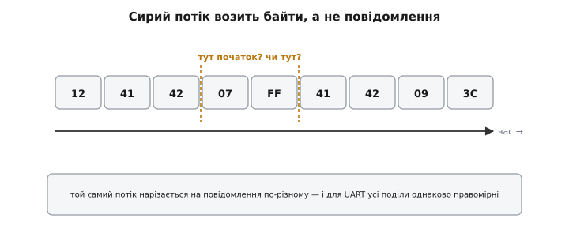
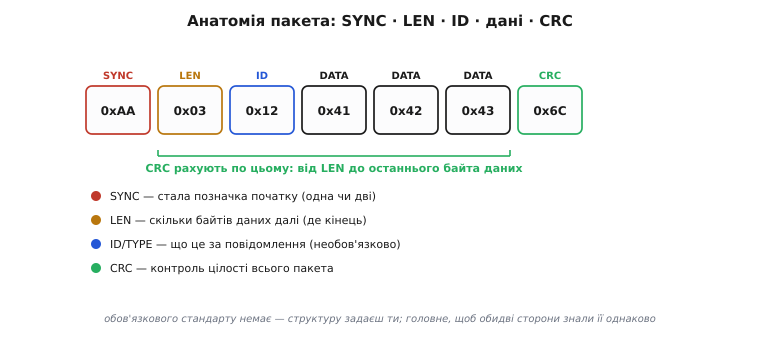
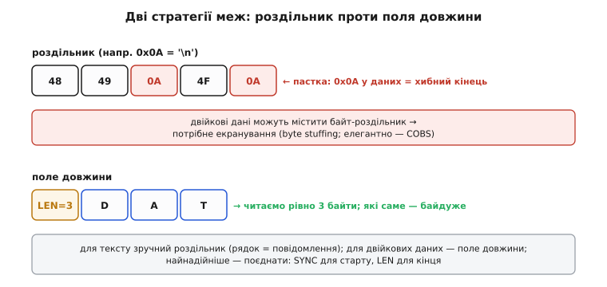
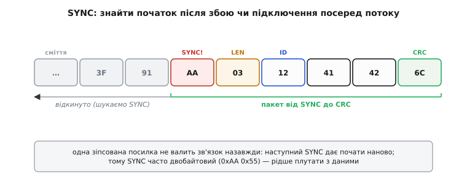
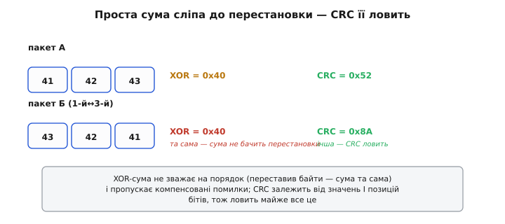
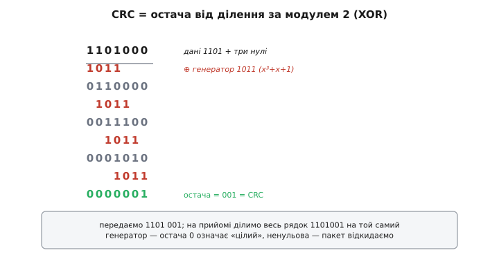
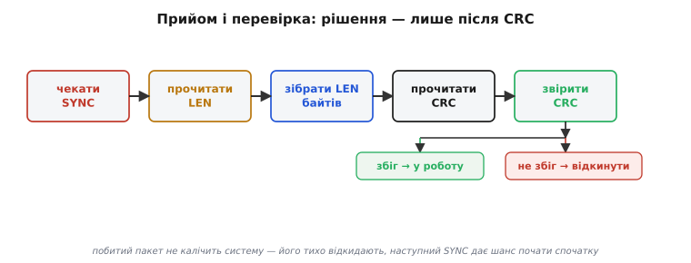

# Проєктування пакета

UART дає надійну «трубу» для байтів — і на цьому його обов'язки закінчуються. Він не знає, де в потоці починається одне повідомлення й закінчується інше, не знає, чи всі байти прибули цілими. Уся ця **структура** — справа рівня вище, який ми будуємо самі: **пакет** (через французьке *paquet* від нідерландського *pak* — «згорток, в'язка»). Хороша новина — будувати його просто, і та сама нехитра конструкція (позначка старту, довжина, контрольна сума) лежить в основі практично всіх реальних послідовних протоколів, від саморобних до телеметрії дронів.

### Сирий потік не має меж

Уявімо, що приймач отримав низку байтів. Де тут повідомлення?


*Суцільний потік байтів сам по собі не каже, де початок повідомлення, де кінець і чи нічого не загубилося. Той самий набір байтів можна «нарізати» кількома способами — і для UART усі вони однаково правомірні.*

Сам по собі потік **неоднозначний**: однакові байти групуються по-різному, і UART не підкаже, який поділ правильний. Гірше: якщо один байт загубився (приймач не встиг забрати попередній — [переповнення](root:com-transport/flow-control)) чи спотворився, усе подальше «з'їде». Тому над сирим потоком накладають **рамку** — структуру, що чітко каже: ось тут пакет починається, стільки в ньому даних, ось так перевірити, що він цілий.

### Анатомія пакета

Класична, перевірена десятиліттями структура пакета складається з чотирьох частин: **позначки старту**, **довжини**, **корисних даних** і **контрольної суми**.


*Типовий пакет: **SYNC** (стала позначка початку), **LEN** (скільки байтів даних далі), необов'язковий **ID/TYPE** (що це за повідомлення), самі **дані** і **CRC** (контроль цілості). CRC рахують від довжини до останнього байта даних — позначку старту в нього не беруть.*

Розгляньмо кожне поле й **навіщо** воно. **SYNC** (скорочено від *synchronization*, від грецького *syn* — «разом» і *chronos* — «час») — одна чи дві сталі (наприклад, `0xAA`) на самому початку: за ними приймач упізнає, що пакет почався. **LEN** (від англійського *length* — «довжина») каже, скільки байтів даних іде далі, тож приймач **знає, де пакет закінчиться**. Часто додають **ID** або **TYPE** — байт-тип повідомлення (це команда? телеметрія? підтвердження?). Далі — власне **дані** (англійською *payload* — «корисний вантаж», на відміну від службової обгортки). І наприкінці — **CRC**, контрольна сума, за якою приймач переконається, що пакет дійшов неушкодженим. Жодного обов'язкового стандарту тут немає — структуру визначаєш ти сам; важливо лише, щоб **обидві сторони** розуміли її однаково.

> 🔧 **Навіщо це.** Узгодити формат пакета — перше, що роблять, коли дві плати (чи плата й комп'ютер) мають обмінятися даними по UART. Поки структура не зафіксована на обох кінцях, навіть найпростіший обмін не злетить: передавач шле байти, а приймач не знає, як їх читати. Тому формат пакета — це фактично «контракт» між прошивками двох пристроїв.

### Дві стратегії меж: роздільник чи довжина

Як саме позначити, **де пакет закінчується**? Є два підходи, і вибір між ними принциповий.


*Угорі: **роздільник** — спеціальний байт (як `\n` у тексті) позначає кінець. Просто, але якщо такий байт трапиться **в даних**, приймач хибно «закриє» пакет. Унизу: **поле довжини** — приймач читає рівно LEN байтів, і вміст йому байдужий; жодних колізій.*

Перший спосіб — **роздільник** (від англійського *delimiter*, від латинського *limes* — «межа»): домовляємося, що повідомлення закінчується певним байтом, як рядок тексту закінчується символом нового рядка `\n` (`0x0A`). Це зручно для **тексту** — рядок дорівнює повідомленню. Але для **двійкових** даних тут пастка: якщо роздільник (`0x0A`) випадково трапиться **всередині** даних, приймач помилково вирішить, що пакет скінчився. Щоб цього уникнути, такі байти доводиться **екранувати** (англійською *byte stuffing* — «набивання байтами»): заміняти спеціальною послідовністю, а на прийомі повертати назад. Поширений і елегантний метод — COBS (*consistent overhead byte stuffing*): він кодує дані так, що байт `0x00` зникає з них зовсім, і тоді нуль вільно служить роздільником, додаючи лише близько одного байта на кожні 254.

Другий спосіб — **поле довжини** (англійською *length prefix*): приймач читає рівно стільки байтів даних, скільки сказано в LEN, і **вміст йому цілком байдужий** — будь-який байт у даних є просто даними. Колізій немає взагалі. Тому для двійкових даних довжина зручніша; а найнадійніше — **поєднати**: SYNC позначає старт, LEN — кінець, і вміст байтів узагалі не впливає на рамку.

> 🔧 **Навіщо це.** Передаєш **текст** (команди, лог) — простий роздільник `\n` чудовий, і парсити легко. Передаєш **двійкові** дані (сирі покази давачів, координати, будь-які байти 0…255) — бери **поле довжини**, інакше рано чи пізно якийсь байт даних збігатиметься з роздільником і ламатиме зв'язок у найгірший момент. Це одна з найпідступніших помилок саморобних протоколів: усе працює, поки в даних випадково не з'явиться «магічний» байт.

### SYNC-байт і самовідновлення

Окремо варто оцінити, наскільки важливий **SYNC**. Він потрібен не лише для першого пакета — він дає приймачеві змогу **відновитися** після будь-якого збою чи якщо той під'єднався до лінії посеред потоку.


*Приймач, що під'єднався посеред потоку (або щойно пережив помилку), бачить спершу «сміття». Він **відкидає** всі байти, поки не натрапить на позначку SYNC (`0xAA`) — і лише відтоді починає збирати пакет: довжину, дані, CRC. Так система сама знаходить межу й відновлюється.*

Логіка проста й могутня: хай що сталося — приймач завжди може просто **чекати наступного SYNC** і з нього почати збирати пакет наново. Це робить протокол **самовідновним**: одна зіпсована посилка не валить зв'язок назавжди, наступний SYNC усе виправляє. Щоб SYNC рідше плутався з випадковими даними, його часто роблять **двобайтовим** (наприклад, `0xAA 0x55`) — таку пару даремно зустріти набагато важче, ніж один байт.

### Контроль цілості: чому не проста сума

Лишилося найцікавіше — **CRC**. Навіщо він, якщо можна просто скласти (чи скласти за XOR) усі байти й переслати цю суму? Бо проста сума **слабка**: вона сліпа до цілого класу помилок.


*Два пакети: у другому переставлено перший і третій байти. XOR-сума **однакова** (`0x40` в обох) — вона не помічає перестановки. А CRC різний (`0x52` проти `0x8A`) — він залежить від порядку й позиції бітів, тож перестановку ловить.*

Проблема простої суми в тому, що вона **не зважає на порядок**: переставив байти місцями — сума та сама. Так само вона часто «не помічає» помилок, які компенсують одна одну. CRC (англійською *cyclic redundancy check*, циклічний надлишковий код) позбавлений цієї вади, бо влаштований принципово інакше: він залежить і від значень, і від **позицій** бітів. Тому CRC ловить усе те, що пропускають і [парність](root:com-modulation/parity-bit), і проста сума: будь-яку одиничну й подвійну помилку, будь-яке непарне їх число, усі **пакетні** збої (поспіль зіпсовані біти) завдовжки до розрядності CRC і переважну більшість решти. За ту саму ціну в кілька байтів CRC дає незрівнянно сильніший захист.

### Як працює CRC

Звідки в CRC така сила? Ідея гарна: дані розглядають як одне велике двійкове число й **ділять** його (за особливою арифметикою «за модулем 2», де віднімання — це XOR) на наперед домовлений **генераторний поліном**. **Остача** від ділення і є CRC.


*Дані 1101 з доданими трьома нулями ділять на генератор 1011 (поліном x³+x+1), послідовно віднімаючи (XOR) дільник. Остача — три біти **001** — і є CRC. Передають дані разом із нею: 1101 001.*

**Порахуймо CRC уручну.** Візьмімо дані 1101 і генератор 1011 (поліном x³+x+1, що дає 3-бітний CRC). Допишемо до даних три нулі й ділитимемо за модулем 2 (XOR):

```
1101000          ← дані 1101 з трьома нулями
1011             ← віднімаємо (XOR) генератор
-------
0110000          ← зсуваємось до наступної одиниці й повторюємо
 1011
-------
0011100
  1011
-------
0001010
   1011
-------
0000001          ← остача = 001 (3 біти) = CRC

передаємо: 1101 001
```

На прийомі приймач ділить **увесь** отриманий рядок (1101001) на той самий генератор. Якщо пакет цілий, остача буде **рівно нуль**; якщо хоч щось спотворилося — остача ненульова, і пакет відкидають. У реальному коді так уручну, звісно, не рахують: 8- чи 16-бітний CRC обчислюють миттєво за готовою таблицею, тож на мікроконтролері він майже безкоштовний. Найпоширеніші — **CRC-8** і **CRC-16** із кількома усталеними генераторними поліномами.

> ⚙️ Усю бітову арифметику CRC можна порахувати наперед і скласти в таблицю на 256 байтів — тоді в гарячому циклі лишається одне звернення до пам'яті на байт замість восьми зсувів. Це й є робочий, табличний [спосіб рахувати CRC](root:com-transport/packet-design/proj-crc-table.md).

### Збирання й перевірка на прийомі

Зберімо все докупи — як приймач збирає й перевіряє пакет.


*Послідовність прийому: чекати SYNC → прочитати LEN → зібрати LEN байтів даних → прочитати CRC → перерахувати CRC і звірити. Якщо сходиться — пакет іде в роботу; якщо ні — його тихо відкидають і знову чекають SYNC.*

Уся краса в останньому кроці: рішення «вірити чи ні» приймають **лише після** перевірки CRC цілого пакета. Побитий пакет не калічить систему — його просто відкидають, а наступний SYNC дає шанс почати спочатку. Це і є та надійність, заради якої ми будували пакет: навіть на зашумленій лінії в роботу потраплять **тільки** неушкоджені повідомлення.

### Пакет у коді

Складімо описане в реальний кадр і розберімо його. Опишемо формат `[SYNC=0xAA][LEN][ID][дані…][CRC8]`: одна позначка старту, байт довжини (скільки байтів іде далі — ID плюс дані), байт-тип, корисні дані й один байт CRC-8 по всьому, окрім SYNC.

:::tabs
```cpp
#include <stdint.h>
#include <stddef.h>
#include <stdbool.h>

#define SYNC 0xAA

// CRC-8, поліном 0x07 (x⁸+x²+x+1) — без таблиці, для наочності
uint8_t crc8(const uint8_t *p, size_t n) {
    uint8_t crc = 0x00;
    for (size_t i = 0; i < n; i++) {
        crc ^= p[i];
        for (int b = 0; b < 8; b++)
            crc = (crc & 0x80) ? (uint8_t)((crc << 1) ^ 0x07)
                               : (uint8_t)(crc << 1);
    }
    return crc;
}
```
```python
SYNC = 0xAA

# CRC-8, поліном 0x07 (x⁸+x²+x+1) — без таблиці, для наочності
def crc8(data: bytes) -> int:
    crc = 0x00
    for byte in data:
        crc ^= byte
        for _ in range(8):
            crc = ((crc << 1) ^ 0x07) & 0xFF if crc & 0x80 else (crc << 1) & 0xFF
    return crc
```
:::

Збираючи кадр, рахуємо CRC по полях LEN, ID і даних — рівно по тих, які приймач зможе перерахувати в себе:

:::tabs
```cpp
// Зібрати кадр у буфер out; повертає його повну довжину в байтах.
size_t build(uint8_t *out, uint8_t id, const uint8_t *data, uint8_t len) {
    out[0] = SYNC;
    out[1] = (uint8_t)(len + 1);   // LEN = ID + дані
    out[2] = id;
    for (uint8_t i = 0; i < len; i++)
        out[3 + i] = data[i];
    out[3 + len] = crc8(&out[1], (size_t)len + 2);  // CRC по LEN..дані
    return (size_t)len + 4;        // SYNC+LEN+ID+дані+CRC
}
```
```python
# Зібрати кадр і повернути його як bytes.
def build(id: int, data: bytes) -> bytes:
    body = bytes([len(data) + 1, id]) + data   # LEN = ID + дані; LEN, ID, дані
    return bytes([SYNC]) + body + bytes([crc8(body)])  # SYNC + тіло + CRC по LEN..дані
```
:::

На прийомі найважливіше — звіряти CRC **перед** тим, як повірити вмісту. Перевіряльник дістає поля з готового кадру й перераховує контрольну суму по тому самому проміжку:

:::tabs
```cpp
// Перевірити кадр довжини n. true — цілий; виходи id/data/len дійсні лише тоді.
bool check(const uint8_t *buf, size_t n,
           uint8_t *id, const uint8_t **data, uint8_t *len) {
    if (n < 4 || buf[0] != SYNC) return false;   // нема SYNC або замало байтів
    uint8_t L = buf[1];                           // LEN = ID + дані
    if ((size_t)L + 3 != n) return false;         // довжина не збігається з кадром
    if (crc8(&buf[1], (size_t)L + 1) != buf[n - 1]) return false;  // CRC не зійшовся
    *id   = buf[2];
    *data = &buf[3];
    *len  = (uint8_t)(L - 1);                      // самі дані, без ID
    return true;
}
```
```python
# Перевірити кадр. Повертає (id, data) для цілого кадру або None.
def check(buf: bytes):
    if len(buf) < 4 or buf[0] != SYNC:            # нема SYNC або замало байтів
        return None
    L = buf[1]                                     # LEN = ID + дані
    if L + 3 != len(buf):                          # довжина не збігається з кадром
        return None
    if crc8(buf[1:2 + L]) != buf[-1]:              # CRC не зійшовся
        return None
    return buf[2], buf[3:2 + L]                    # (id, самі дані без ID)
```
:::

Розберімо живий кадр. Хай ID = `0x12`, дані — два байти `0x41 0x42` (символи 'A' і 'B'). Тоді LEN = 3 (ID + двоє даних), а CRC-8 по `03 12 41 42` дорівнює `0xC9`. У буфері опиниться:

```
AA 03 12 41 42 C9
│  │  │  └──┴── дані 'A' 'B'
│  │  └──────── ID = 0x12
│  └─────────── LEN = 3 (ID + 2 байти даних)
└────────────── SYNC = 0xAA
CRC-8(03 12 41 42) = 0xC9   ← останній байт
```

Приймач відкидатиме байти, доки не побачить `0xAA`, прочитає LEN = 3, забере наступні 3 байти (ID і двоє даних) плюс байт CRC, перерахує CRC-8 по `03 12 41 42` і звірить із `0xC9`. Збіглося — `0x41 0x42` ідуть у роботу як корисні дані; ні — кадр тихо відкидають і чекають наступного SYNC.

> 🔧 **Навіщо це.** Ось мінімальний рецепт власного надійного протоколу поверх UART: **[SYNC][LEN][дані][CRC]**. SYNC дає самовідновлення, LEN — однозначні межі для будь-яких даних, CRC — упевненість у цілості. Додай за потреби ID-тип і номер послідовності (щоб ловити загублені чи здвоєні пакети) — і матимеш структуру, на якій тримаються справжні протоколи телеметрії й керування. Не намагайся «зекономити» на CRC заради простоти: саме він відрізняє іграшковий обмін від такого, якому можна довірити апарат.

Структура пакета каже, що і в якому порядку має приймач прочитати. Але є суто практична перешкода: байти прибувають **по одному й коли завгодно**, а не цілим пакетом нараз. Якщо на кожному кроці зупиняти програму й чекати наступного байта, мікроконтролер не встигатиме робити нічого іншого. Тому збирати пакет треба **не блокуючи** — по байту, зберігаючи стан між викликами; елегантно це робить [скінченний автомат потокового парсера](root:com-protocol/stream-parser).

---
