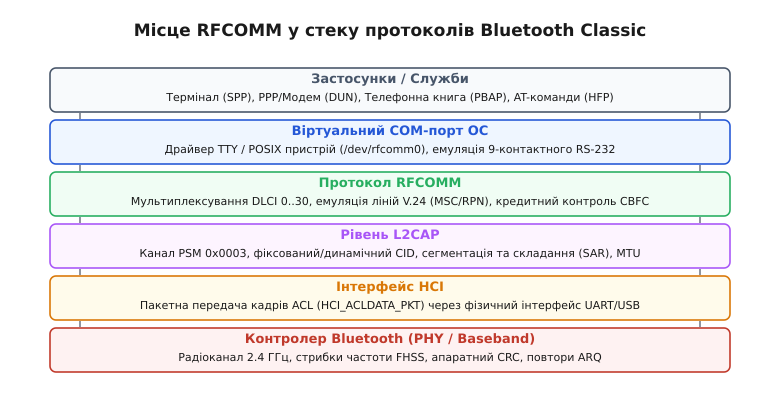
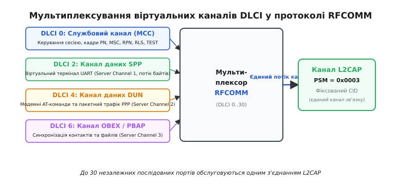
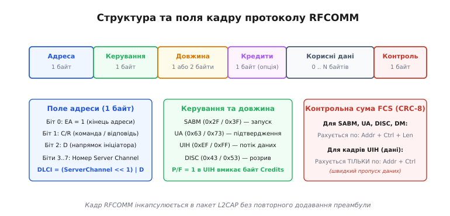
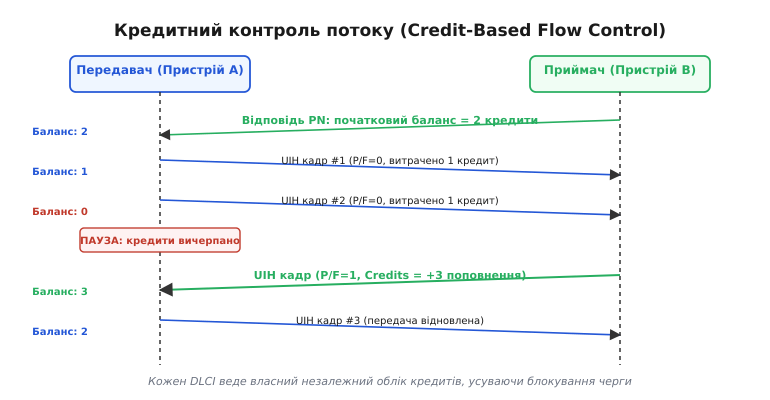
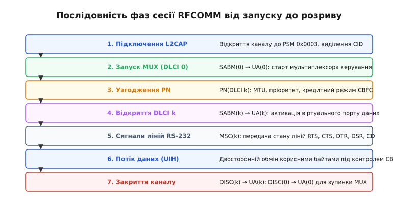

# RFCOMM: емуляція послідовного порту

<preknowlist>
- [Асинхронний послідовний інтерфейс (UART)](topic:com-devices/uart) — базова модель передачі потоку байтів, стартові/стопові біти та лінії квітування.
- [Bluetooth SPP](topic:com-transport/bluetooth-spp) — профіль послідовного порту, концепція заміни дроту бездротовим каналом.
- [Контроль надлишковості (CRC)](topic:com-modulation/crc) — виявлення помилок через поліноміальний контрольний залишок.
</preknowlist>

Коли наприкінці 1990-х років з'явилася технологія Bluetooth, комп'ютерна індустрія вже мала мільйони готових пристроїв та сотні мільйонів рядків коду, розрахованих виключно на асинхронні послідовні порти RS-232 (англ. *Recommended Standard 232*). Зовнішні модеми, GPS-приймачі, промислові контролери автоматизації, касові термінали та медичні датчики спілкувалися з центральними процесорами через фізичний 9-контактний роз'єм D-Sub 9. Системні інтерфейси операційних систем — драйвери POSIX TTY (англ. *teletypewriter*) та комунікаційні виклики Windows Win32 API — надавали програмам неструктурований двосторонній потік байтів із можливістю апаратного квітування лініями напруги.

Прямий перехід на пакетне бездротове радіо вимагав би повного переписування прикладного програмного забезпечення та створення принципово нових мережевих стеків для кожного класу периферії. Щоб забезпечити миттєву сумісність із наявним кодом, консорціум Bluetooth створив протокол **RFCOMM** (англ. *Radio Frequency Communication*, «радіочастотний зв'язок»). Його завдання — повністю відтворити поведінку 9-контактного послідовного кабелю RS-232 поверх ненадійного пакетного радіоканалу з мультиплексуванням до 30 незалежних віртуальних портів.

### Архітектура стека: шлях послідовного потоку

Фізичний радіоканал Bluetooth Classic кардинально відрізняється від мідного дроту: він передає дискретні пакети в інтервалах часу по 625 мікросекунд, стрибає між 79 частотними каналами діапазону 2.4 ГГц і самостійно виправляє спотворення через повторні передачі. Завдання стека протоколів — перетворити цей пакетний потік на прозорий побайтовий інтерфейс.


*Пошарова структура стека Bluetooth Classic: прикладний застосунок працює з віртуальним TTY-портом ОС, RFCOMM мультиплексує потік у кадри та емулює сигнали RS-232, а L2CAP і Baseband забезпечують пакетну радіопередачу.*

Шлях даних крізь стек має чітку послідовність обробки:

1. **Прикладний рівень та драйвер ОС**: програма викликає стандартну функцію `write()` для файлового дескриптора `/dev/rfcomm0` (у Linux) або `COM3` (у Windows). Драйвер послідовного порту сприймає це як передачу сирих байтів в апаратний UART.
2. **Протокол RFCOMM**: модуль ядра перехоплює потік байтів, нарізає його на окремі кадри, додає заголовок віртуального каналу, веде облік дозволених для відправки кредитів і контролює стан ліній керування модемом.
3. **Рівень L2CAP** (англ. *Logical Link Control and Adaptation Protocol*): протокол RFCOMM підключається до L2CAP як окрема служба на фіксованому номері PSM `0x0003` (англ. *Protocol/Service Multiplexer*). L2CAP виділяє логічний ідентифікатор каналу CID (англ. *Channel Identifier*), фрагментує великі кадри відповідно до узгодженого максимального розміру блоку MTU (англ. *Maximum Transmission Unit*) і збирає їх на стороні приймача.
4. **Рівень HCI** (англ. *Host Controller Interface*): упаковані кадри у формі блоків асинхронних даних ACL (англ. *Asynchronous Connection-Oriented*) передаються через фізичну шину (UART або USB) у радіомодем Bluetooth.
5. **Радіоконтролер Baseband**: апаратний чип розбиває дані на радіопакети, додає 24-бітну контрольну суму CRC, шифрує радіоканал і передає сигнал в ефір, автоматично надсилаючи підтвердження прийому ACK та повторюючи втрачені пакети за протоколом ARQ (англ. *Automatic Repeat Request*).

Специфікація RFCOMM спирається на телекомунікаційний стандарт GSM 07.10, адаптований інженерами для специфіки радіостека. Детальний огляд еволюції цього стандарту від телефонних модемів до бездротового зв'язку наведено у вставці [Історія стандарту GSM 07.10](topic:com-transport/rfcomm/hist-gsm-to-rfcomm.md).

### Мультиплексування та ідентифікатори каналів (DLCI)

Одне радіоз'єднання між двома пристроями Bluetooth підтримує лише один загальний логічний канал L2CAP для служби RFCOMM. Проте комп'ютеру та смартфону часто потрібно передавати кілька різних потоків одночасно: наприклад, вести термінальний сеанс керування, опитувати модем AT-командами та передавати файл телефонної книги. 

Для одночасного обслуговування різних завдань RFCOMM реалізує мультиплексування: єдиний потік пакетів L2CAP розділяється на незалежні віртуальні канали, кожен із яких ідентифікується числом **DLCI** (англ. *Data Link Connection Identifier*, ідентифікатор з'єднання каналу даних).


*Мультиплексування до 30 незалежних користувацьких послідовних портів та службового каналу керування DLCI 0 через єдине з'єднання канального рівня L2CAP.*

Простір ідентифікаторів DLCI має чіткий математичний розподіл:

- **DLCI = 0**: постійний **службовий канал керування мультиплексором** (англ. *Multiplexer Control Channel*, MCC). Він відкривається першим під час ініціалізації сесії і ніколи не використовується для передачі користувацьких даних. Через нього передаються команди узгодження параметрів зв'язку, запити на відкриття інших каналів та сигнали стану ліній RS-232.
- **DLCI 2..61**: користувацькі канали передачі даних. Протокол підтримує до 30 серверних каналів (Server Channels з номерами від `1` до `30`).

Щоб уникнути колізій, коли обидва пристрої одночасно вирішують відкрити Server Channel 1, номер DLCI обчислюється з урахуванням ролі пристрою через спеціальний біт напрямку `D` (англ. *Direction bit*):

```
DLCI = (ServerChannel · 2) + D
```

Пристрій, який першим ініціював відкриття службового каналу DLCI 0, отримує статус **ініціатора сесії** (англ. *initiator*), а протилежна сторона стає **відповідачем** (англ. *responder*). Для каналів, які ініціює перший пристрій, біт напрямку дорівнює `D = 1`. Для каналів, які створює відповідач, біт `D = 0`. 

Завдяки цьому зміщенню Server Channel 1 з боку ініціатора отримує `DLCI = 1 · 2 + 1 = 3`, а з боку відповідача — `DLCI = 1 · 2 + 0 = 2`. Два незалежні віртуальні порти мають різні числові ідентифікатори в одному каналі зв'язку, що унеможливлює конфлікти адресації. Ідентифікатори `DLCI = 1`, `62` та `63` зарезервовані специфікацією і не використовуються.

### Анатомія кадру RFCOMM

Усі повідомлення в протоколі RFCOMM оформлюються у вигляді структурованих двійкових блоків — кадрів. Кадр складається з обов'язкових полів адреси, типу операції, довжини даних, корисного навантаження та контрольної суми.


*Побайтова структура кадру RFCOMM: адреса, керування, довжина, опціональний байт кредитів CBFC, корисне навантаження та контрольна сума FCS.*

Розглянемо призначення кожного байта заголовка кадру:

#### 1. Поле адреси (Address Field, 1 байт)

Байт адреси визначає, якому саме віртуальному порту належить цей кадр, і містить такі бітові поля:

- **Біт 0 (`EA`, Extension Address bit)**: біт розширення адреси. В RFCOMM він завжди зафіксований у значенні `1`, що свідчить про використання однобайтового формату адреси.
- **Біт 1 (`C/R`, Command/Response bit)**: позначає тип кадру — команда чи відповідь. Значення залежить від ролі пристрою: для ініціатора сесії команда позначається `C/R = 1`, а відповідь `C/R = 0`. Для відповідача сесії значення дзеркальні: команда `C/R = 0`, відповідь `C/R = 1`.
- **Біти 2..7 (`DLCI`)**: містять 6-бітний ідентифікатор цільового логічного каналу (біт 2 відповідає біту напрямку `D`, а біти 3..7 — номеру Server Channel).

#### 2. Поле керування (Control Field, 1 байт)

Визначає тип виконуваної операції над каналом та містить біт опитування/завершення `P/F` (англ. *Poll/Final bit*, біт 4). Специфікація RFCOMM використовує п'ять базових типів кадрів:

| Назва кадру | Шістнадцятковий код (P/F=0) | Шістнадцятковий код (P/F=1) | Призначення в протоколі |
| :--- | :--- | :--- | :--- |
| **SABM** | `0x2F` | `0x3F` | *Set Asynchronous Balanced Mode*: запит на встановлення логічного з'єднання на вказаному DLCI. |
| **UA** | `0x63` | `0x73` | *Unnumbered Acknowledgement*: позитивне підтвердження успішного відкриття каналу або його закриття. |
| **DM** | `0x0F` | `0x1F` | *Disconnected Mode*: повідомлення про те, що канал закритий, або відхилення запиту на відкриття. |
| **DISC** | `0x43` | `0x53` | *Disconnect*: команда примусового розриву з'єднання на даному DLCI. |
| **UIH** | `0xEF` | `0xFF` | *Unnumbered Information with Header check*: основний робочий кадр передачі даних або службових команд. |

#### 3. Поле довжини (Length Field, 1 або 2 байти)

Поле довжини кодує кількість байтів у блоці корисного навантаження. Воно використовує змінну розрядність за допомогою власного біта розширення `EA` (біт 0 першого байта):

- **Якщо довжина даних ≤ 127 байтів**: використовується 1 байт. Біт 0 встановлюється в `EA = 1`, а біти 1..7 містять 7-бітне значення довжини.
- **Якщо довжина даних > 127 байтів**: використовуються 2 байти. У першому байті біт 0 встановлюється в `EA = 0`, а біти 1..7 кодують молодші 7 бітів довжини. Другий байт цілком (8 бітів) кодує старшу частину довжини, дозволяючи передавати блоки розміром до `32767` байтів.

#### 4. Опціональний байт кредитів (Credits, 1 байт)

Це поле вставляється перед корисними даними **виключно в кадрах UIH**, якщо під час відкриття сесії було увімкнено кредитний контроль потоку (CBFC) і в полі керування встановлено біт `P/F = 1`. Воно містить 8-бітне число (від `0` до `255`), що додає відповідну кількість кредитів на рахунок передавача.

#### 5. Контрольна сума кадру (FCS, Frame Check Sequence, 1 байт)

Останній байт кадру містить 8-бітну контрольну суму CRC для перевірки цілісності заголовка. Вона розраховується за генераторним поліномом стандарту HDLC:

```
G(x) = x⁸ + x² + x + 1
```

Шістнадцятковий вигляд полінома в реверсному представленні дорівнює `0xE0` (або `0x07` у прямому). 

Правило розрахунку FCS в RFCOMM оптимізовано для швидкодії:

- Для командних кадрів (`SABM`, `UA`, `DM`, `DISC`) контрольна сума обчислюється над **трьома полями**: Address, Control та Length.
- Для кадрів передачі даних (`UIH`) контрольна сума обчислюється **виключно над двома полями**: Address та Control.

Поле довжини та корисні дані кадру UIH виключено з розрахунку FCS, оскільки вони повністю захищені 24-бітним апаратним CRC радіоконтролера Baseband. Це позбавляє мікроконтролер необхідності побайтово рахувати контрольну суму для сотень байтів даних у кожному кадрі, суттєво зменшуючи завантаження центрального процесора.

### Протокол керування мультиплексором (DLCI 0)

Службовий канал `DLCI = 0` використовує кадри `UIH` для передачі внутрішніх команд керування (англ. *Multiplexer Control Messages*). Кожне таке повідомлення має власну внутрішню структуру: тип команди (1 байт), довжина параметрів (1 або 2 байти) та значення параметрів.

Специфікація визначає шість типів повідомлень каналу керування:

```
┌─────────────────┬──────────────────┬─────────────────────────────────────────────────┐
│ Тип команди     │ Код (7 біт + EA) │ Призначення та передавані параметри             │
├─────────────────┼──────────────────┼─────────────────────────────────────────────────┤
│ PN              │ 0x20             │ Parameter Negotiation: розмір кадру (MTU),     │
│                 │                  │ пріоритет, режим контролю потоку (CBFC)         │
├─────────────────┼──────────────────┼─────────────────────────────────────────────────┤
│ MSC             │ 0x38             │ Modem Status Command: стан сигналів ліній       │
│                 │                  │ RS-232 (RTS, CTS, DTR, DSR, CD, RI, Break)      │
├─────────────────┼──────────────────┼─────────────────────────────────────────────────┤
│ RPN             │ 0x24             │ Remote Port Negotiation: налаштування бодрейту, │
│                 │                  │ бітів даних, стоп-бітів та парності порту       │
├─────────────────┼──────────────────┼─────────────────────────────────────────────────┤
│ RLS             │ 0x14             │ Remote Line Status: звітування про апаратні     │
│                 │                  │ помилки лінії (Overrun, Parity, Framing)        │
├─────────────────┼──────────────────┼─────────────────────────────────────────────────┤
│ TEST            │ 0x08             │ Test Command: діагностичне ехо-повідомлення    │
│                 │                  │ для перевірки цілісності службового каналу      │
├─────────────────┼──────────────────┼─────────────────────────────────────────────────┤
│ NSC             │ 0x04             │ Non-Supported Command: відповідь у разі         │
│                 │                  │ отримання невідомої або непідтримуваної команди │
└─────────────────┴──────────────────┴─────────────────────────────────────────────────┘
```

Розглянемо детальніше внутрішню будову цих команд:

#### 1. Команда `PN` (Parameter Negotiation)

Надсилається перед відкриттям будь-якого каналу даних для узгодження характеристик зв'язку. Структура параметрів повідомлення `PN`:

- **DLCI**: ідентифікатор логічного каналу, для якого проводяться переговори (1 байт).
- **Пріоритет (Priority)**: число від 0 до 63, що визначає черговість відправки кадрів планувальником.
- **Таймери T1 та T2**: тайм-аути очікування відповіді на кадри керування та підтвердження.
- **Розмір кадру (Frame Size / MTU)**: 2 байти, що задають максимальну довжину корисного навантаження. За замовчуванням це 127 байтів, однак більшість сучасних стеків узгоджують значення 1012 або 1021 байт, що ідеально відповідає розміру 5-слотового радіопакета Bluetooth `DH5` / `3-DH5`.
- **Тип конвергенції (Convergence Layer)**: 4 біти. Значення `0xF` вмикає кредитний контроль потоку (CBFC).
- **Початкові кредити (Initial Credits)**: 1 байт, що визначає стартовий баланс кадрів для передавача.

#### 2. Команда `RPN` (Remote Port Negotiation)

Дозволяє передати віддаленому пристрою повні налаштування фізичного послідовного порту UART:

- **Бодрейт (Baud Rate)**: кодується бітами 0..2 першого байта (значення від 2400 до 230400 бод).
- **Формат символу**: біти 3..4 кодують кількість бітів даних (5, 6, 7 або 8), біт 5 визначає стоп-біти (1 або 2), а біти 6..7 задають контроль парності (none, odd, even, mark, space).
- **Маска керування потоком**: вмикає програмний контроль через символи `XON`/`XOFF` або апаратний через лінії RTS/CTS.

#### 3. Команда `RLS` (Remote Line Status)

Слугує для трансляції апаратних помилок послідовної лінії віддаленому процесору:
- помилка переповнення буфера прийому (Overrun Error, біт 1);
- помилка контролю парності (Parity Error, біт 2);
- помилка кадрування (Framing Error, біт 3 — порушення стоп-біта в UART).

Коли ядро Linux отримує кадр `RLS`, воно виставляє відповідні прапорці помилок у системній структурі `termios` (`PARMRK` / `INPCK`), що дозволяє прикладному процесу зафіксувати апаратні збої лінії.

### Емуляція ліній RS-232: віртуальний 9-контактний кабель

Класичний 9-контактний роз'єм RS-232 (DB-9) містить не лише проводи прийому (`RXD`) та передачі (`TXD`) даних, але й цілу групу сигнальних ліній квітування та керування станом з'єднання. У дротовому підключенні напруга на цих контактах змінюється від -12 В (логічний нуль або неактивний стан) до +12 В (логічна одиниця або активний стан).

У протоколі RFCOMM фізичних проводів немає. Для трансляції стану контактів використовується керуюче повідомлення **MSC** (англ. *Modem Status Command*), яке передає двійкову маску сигналів:

```
┌──────────┬─────────────────────────────┬─────────────────────────────────────────────┐
│ Пін DB-9 │ Сигнал RS-232 (V.24)        │ Біт у повідомленні MSC протоколу RFCOMM    │
├──────────┼─────────────────────────────┼─────────────────────────────────────────────┤
│ Пін 4    │ DTR (Data Terminal Ready)   │ RTC (Ready to Communicate, біт 2)           │
├──────────┼─────────────────────────────┼─────────────────────────────────────────────┤
│ Пін 7    │ RTS (Request to Send)       │ RTR (Ready to Receive, біт 3)               │
├──────────┼─────────────────────────────┼─────────────────────────────────────────────┤
│ Пін 8    │ CTS (Clear to Send)         │ RTR віддаленого модему                      │
├──────────┼─────────────────────────────┼─────────────────────────────────────────────┤
│ Пін 6    │ DSR (Data Set Ready)        │ DV (Data Valid, біт 7)                      │
├──────────┼─────────────────────────────┼─────────────────────────────────────────────┤
│ Пін 1    │ CD / DCD (Carrier Detect)   │ DV (Data Valid, біт 7)                      │
├──────────┼─────────────────────────────┼─────────────────────────────────────────────┤
│ Пін 9    │ RI (Ring Indicator)         │ IC (Incoming Call, біт 6)                   │
├──────────┼─────────────────────────────┼─────────────────────────────────────────────┤
│ —        │ Сигнал розриву (Break)      │ Поле Break Value (біти 4..7 другого байта)  │
└──────────┴─────────────────────────────┴─────────────────────────────────────────────┘
```

Емуляція цих сигналів є критичною для коректної роботи застарілих протоколів:

- **DTR / DSR**: комп'ютер виставляє `RTC = 1`, повідомляючи модем про готовність до сесії зв'язку. Якщо програма на ПК закриває COM-порт, операційна система скидає `RTC = 0`, і віддалений модем автоматично вішає слухавку.
- **RTS / CTS**: апаратний контроль готовності приймати байти. Коли буфер UART заповнюється, пристрій скидає лінію `RTR = 0`, вимагаючи від передавача зробити паузу.
- **Carrier Detect (CD)**: віддалений модем виставляє `DV = 1` лише тоді, коли виявив несучу частоту віддаленої станції. Без сигналу CD операційна система вважає, що зв'язок відсутній, і не починає автентифікацію PPP.
- **Ring Indicator (RI)**: повідомляє комп'ютер про наявність вхідного телефонного дзвінка (`IC = 1`).

> 🔧 **Навіщо це.** Якщо ви пишете прошивку для мікроконтролера або додаток, що взаємодіє зі старим вимірювальним приладом по Bluetooth SPP, недостатньо просто надсилати байти. Якщо прилад очікує апаратного підтвердження готовності, він буде мовчати доти, доки ваш стек не надішле кадр `MSC` із піднятими бітами `RTC = 1` та `RTR = 1` (імітуючи високий рівень на лініях DTR та RTS).

### Кредитний контроль потоку (CBFC)

Найбільшою архітектурною проблемою під час перенесення стандарту GSM 07.10 у бездротове середовище стала організація керування потоком даних (англ. *flow control*).

У класичному стандарті GSM 07.10 використовувався так званий **агрегатний контроль потоку**: коли приймач відчував переповнення пам'яті, він надсилав команду `FCOFF` або виставляв біт `FC = 0` у повідомленні MSC. У радіоканалі Bluetooth цей механізм призводив до двох фатальних наслідків:

1. **Затримка реакції**: через проходження через черги буферів L2CAP та радіоінтервали повідомлення `FCOFF` доходило до передавача через 20–50 мілісекунд. За цей час передавач встигав відправити ще десяток кадрів, які безповоротно переповнювали пам'ять приймача й спричиняли втрату даних.
2. **Блокування всіх каналів**: сигнал `FCOFF` зупиняв мультиплексор повністю. Якщо переповнювався буфер одного повільного порту (наприклад, віртуального термінала), зупинялася передача й на всіх інших 29 каналах.

Для вирішення цієї проблеми консорціум Bluetooth розробив механізм **по-кадрового кредитного контролю** — **CBFC** (англ. *Credit-Based Flow Control*).


*Принцип роботи CBFC: кожен надісланий кадр даних витрачає 1 кредит; при нульовому балансі передача призупиняється, доки приймач не надішле кадр поповнення кредитів.*

Механізм функціонує за строгими правилами:

1. **Незалежний баланс**: кожен логічний канал DLCI має власний окремий лічильник кредитів. Переповнення одного порту ніяк не впливає на пропускну здатність інших.
2. **Одиниця кредиту**: **1 кредит надає право на передачу рівно 1 кадру `UIH`** незалежно від того, скільки байтів міститься всередині кадру (від 1 байта до узгодженого ліміту MTU).
3. **Витрата кредитів**: передавач ініціалізує лічильник числом, отриманим від приймача під час початкового узгодження параметрів `PN`. Перед відправкою кожного кадру передавач перевіряє лічильник: якщо значення > 0, він відправляє кадр і зменшує лічильник на 1. Якщо лічильник дорівнює `0`, передавач **зобов'язаний негайно припинити відправку** нових даних і очікувати поповнення.
4. **Поповнення балансу**: коли застосунок на стороні приймача вичитує дані з внутрішнього буфера і звільняє пам'ять, приймач генерує кадр `UIH` із встановленим бітом `P/F = 1`. У цей кадр додається 1 байт поля `Credits = K`, який повідомляє передавачу: «ти можеш надіслати ще `K` кадрів». Передавач додає число `K` до свого поточного балансу і відновлює передачу.
5. **Нульові накладні витрати**: якщо баланс кредитів не змінюється, кадри даних надсилаються з бітом `P/F = 0`, і додатковий байт кредитів у заголовок не вставляється.

Цей алгоритм гарантує, що приймач ніколи не отримає більше кадрів, ніж здатний розмістити у виділеній оперативній пам'яті, унеможливлюючи переповнення буферів на канальному рівні.

### Життєвий цикл сесії та діаграма станів

Встановлення зв'язку в RFCOMM складається з кількох чітко розмежованих етапів.


*Послідовність встановлення, обслуговування та коректного завершення сесії RFCOMM між двома пристроями Bluetooth.*

Розглянемо повну послідовність подій:

1. **Встановлення зв'язку L2CAP**: клієнт надсилає запит підключення L2CAP до фіксованого порту PSM `0x0003`. Після обміну повідомленнями конфігурації сторони отримують відкритий канал із власними ідентифікаторами CID.
2. **Запуск мультиплексора (DLCI 0)**: клієнт надсилає командний кадр `SABM` з адресою `DLCI = 0`. Сервер відповідає кадром `UA` з адресою `DLCI = 0`. Мультиплексор переходить у стан готовності.
3. **Виявлення служб (SDP)**: перед відкриттям порту даних клієнт зазвичай виконує запит до протоколу SDP (англ. *Service Discovery Protocol*), щоб дізнатися, на якому саме номері Server Channel (від 1 до 30) сервер слухає потрібний профіль (наприклад, службу послідовного порту SPP).
4. **Узгодження параметрів каналу (PN)**: на службовому каналі `DLCI = 0` клієнт надсилає повідомлення `PN` для цільового каналу даних. Сторони узгоджують розмір MTU та вмикають режим кредитного контролю CBFC, видаючи початковий пул кредитів.
5. **Відкриття каналу даних (DLCI k)**: клієнт надсилає командний кадр `SABM` на цільовий `DLCI = k`. Сервер підтверджує відкриття порту кадром `UA` на цьому ж DLCI.
6. **Ініціалізація ліній модему (MSC)**: сторони обмінюються повідомленнями `MSC` на каналі `DLCI = 0` (або всередині каналу даних), виставляючи віртуальні сигнали `RTC = 1` (DTR) та `RTR = 1` (RTS). Відтепер канал вважається повністю готовим до передачі даних.
7. **Потоковий обмін (UIH)**: застосунки передають корисні байти кадрами `UIH`, одночасно здійснюючи облік кредитів CBFC.
8. **Закриття каналу даних**: після завершення передачі клієнт надсилає кадр `DISC` на `DLCI = k`, на що сервер відповідає `UA`. Канал даних переходить у стан закритого.
9. **Зупинка сесії**: коли всі канали даних закриті, клієнт надсилає кадр `DISC` на службовий `DLCI = 0`, отримує відповідь `UA` та розриває базовий канал зв'язку L2CAP.

### Профілі Bluetooth над рівнем RFCOMM

RFCOMM є універсальним фундаментом для цілої низки класичних профілів Bluetooth:

- **SPP (Serial Port Profile)**: базовий профіль заміни послідовного кабелю. Він напряму надає застосункам віртуальний канал RFCOMM як безперервний потік байтів без додаткових протокольних надбудов.
- **DUN (Dial-Up Networking Profile)**: емулює бездротовий телефонний модем. Поверх RFCOMM передаються стандартні AT-команди керування дзвінком (набір номера `ATD*99#`), після чого канал перемикається в режим передачі мережевих пакетів протоколу PPP (англ. *Point-to-Point Protocol*) для виходу в інтернет.
- **HFP (Hands-Free Profile) та HSP (Headset Profile)**: використовують RFCOMM як службовий канал обміну AT-командами між автомобільною магнітолою (або бездротовими навушниками) та телефоном. Через RFCOMM передаються команди виклику, рівень сигналу мережі та команди регулювання гучності, тоді як сам голосовий звук передається паралельно через ізохронні аудіоканали SCO/eSCO.
- **PBAP (Phone Book Access Profile), OPP (Object Push Profile) та FTP (File Transfer Profile)**: використовують протокол обміну двійковими об'єктами **OBEX** (англ. *Object Exchange*), який у класичному Bluetooth інкапсулюється безпосередньо в кадри RFCOMM.

### Накладні витрати, квантування часу та ціна емуляції

Хоча RFCOMM створює для програміста ідеальну ілюзію прямого з'єднання через UART, робота віртуального порту має суттєві фізичні та часові відмінності від апаратного мідного дроту.

#### 1. Протокольні накладні витрати

Кожен кадр даних RFCOMM інкапсулюється в кілька рівнів заголовків стека:

- Заголовок кадру RFCOMM: `3..4` байти (Address, Control, Length, опціональний Credits, FCS).
- Заголовок каналу L2CAP: `4` байти (Length, Channel ID).
- Заголовок пакета HCI ACL: `4` байти (Connection Handle, прапорці PB/BC, Total Data Length).
- Заголовок та захисний інтервал пакетів Baseband: `1..2` байти.

Сумарні накладні витрати становлять **12–14 байтів службових даних на кожен пакет**.

Якщо прикладний код надсилає дані по одному байту (наприклад, у циклі викликає `write(fd, &c, 1)` для кожного введеного символу), кожен 1 корисний байт обростає 14 байтами заголовків. Ефективність використання радіоканалу в такому режимі падає нижче `7%`, а радіоінтерфейс перевантажується службовим трафіком. Для ефективної роботи дані необхідно обов'язково буферизувати блоками по 100–1000 байтів, що узгоджуються з розміром багатослотових пакетів Baseband (`DH3` / `DH5`).

#### 2. Затримка та джитер квантування

У фізичному UART дріт передає біти безперервно з фіксованим часом одного біта (наприклад, при швидкості 115200 бод один байт передається рівно за `86.8` мікросекунд із нульовою варіацією затримки).

У Bluetooth передача прив'язана до таймінгу радіослотів Baseband тривалістю **625 мікросекунд**. Навіть у ідеальних умовах мінімальна затримка доставки кадру становить `1.25..2.5` мілісекунди (час відправки та очікування відповіді слота). За наявності радіозавад чи роботи інших пристроїв на частоті 2.4 ГГц апаратний механізм ARQ повторює пошкоджені пакети, внаслідок чого затримка доставки коливається від одиниць до сотень мілісекунд. 

З цієї причини RFCOMM не можна використовувати для завдань жорсткого реального часу (hard real-time) — наприклад, для прямого програмного смикання ніжками GPIO («bit-banging») або генерації крокових імпульсів двигунів.

#### 3. Фіктивна швидкість віртуального порту

Коли програма викликає функцію зміни швидкості віртуального порту (наприклад, виставляє 9600 бод у налаштуваннях COM-порту), це не уповільнює передачу байтів по радіоканалу. Радіопередавач Bluetooth BR/EDR завжди працює на своїй фізичній швидкості (1 Мбіт/с для Basic Rate або 2–3 Мбіт/с для Enhanced Data Rate). 

Параметр бодрейту в RFCOMM має реальне значення лише тоді, коли Bluetooth-модуль на протилежному кінці з'єднаний із фізичним апаратним чипом UART: у цьому випадку він налаштовує свій апаратний генератор частоти відповідно до переданого значення команди `RPN`.

Детальний опис програмування сокетів RFCOMM у середовищі Linux BlueZ, структур даних та викликів створення віртуальних TTY-нод наведено у вставці [Програмний інтерфейс RFCOMM у Linux BlueZ](topic:com-transport/rfcomm/api-bluez-rfcomm.md).

### Worked-приклад: розбір кадру даних із поповненням кредитів

Розглянемо послідовність сирих байтів, перехоплену аналізатором протоколів у каналі зв'язку між клієнтом та сервером:

```
0x09  0xFF  0x0B  0x04  0x44  0x61  0x74  0x61  0x31  0x86
```

**Крок 1. Аналіз поля адреси (`0x09`)**

Переведемо байт у двійкову форму: `0x09 = 00001001₂`.

```
Біт 0 (EA)   = 1  [однобайтова адреса]
Біт 1 (C/R)  = 0  [кадр відповіді з боку відповідача]
Біт 2 (D)    = 0  [канал створено відповідачем]
Біти 3..7    = 00001₂ = 1  [Server Channel = 1]
```

Ідентифікатор логічного каналу:
```
DLCI = (ServerChannel · 2) + D
     = (1 · 2) + 0             [підстановка: ServerChannel = 1, D = 0 для відповідача]
     = 2                       [обчислення номера каналу]
```
Кадр належить каналу даних `DLCI = 2`.

**Крок 2. Аналіз поля керування (`0xFF`)**

Базовий код кадру передачі даних `UIH` дорівнює `0xEF` (`11101111₂`). 
Байт `0xFF` (`11111111₂`) відрізняється встановленим бітом 4 (`P/F = 1`). Це означає, що кадр містить **додатковий байт поповнення кредитів CBFC**.

**Крок 3. Аналіз поля довжини (`0x0B`)**

Переведемо байт у двійкову форму: `0x0B = 00001011₂`.

```
Біт 0 (EA)  = 1  [однобайтове поле довжини]
Біти 1..7   = 0000101₂ = 5  [довжина корисних даних = 5 байтів]
```

**Крок 4. Аналіз поля кредитів (`0x04`)**

Оскільки біт `P/F = 1`, наступний байт кодує кредити: значення `0x04` означає, що приймач надає передавачу дозвіл на відправку **4 додаткових кадрів даних**.

**Крок 5. Корисне навантаження (`0x44 0x61 0x74 0x61 0x31`)**

Блок із 5 байтів містить символи ASCII:
- `0x44` = `'D'`
- `0x61` = `'a'`
- `0x74` = `'t'`
- `0x61` = `'a'`
- `0x31` = `'1'`

Повідомлення несе рядок `"Data1"`.

**Крок 6. Перевірка контрольної суми FCS (`0x86`)**

Для кадрів `UIH` контрольна сума обчислюється виключно над полями Address (`0x09`) та Control (`0xFF`).

Обчислимо значення CRC-8 з поліномом `0xE0`:
- Вхідний блок: `[0x09, 0xFF]`
- Результат обчислення за поліномом HDLC: `0x86`.

Контрольна сума в кінці пакета точно збігається з розрахованим значенням (`0x86`), підтверджуючи цілісність отриманого кадру.
