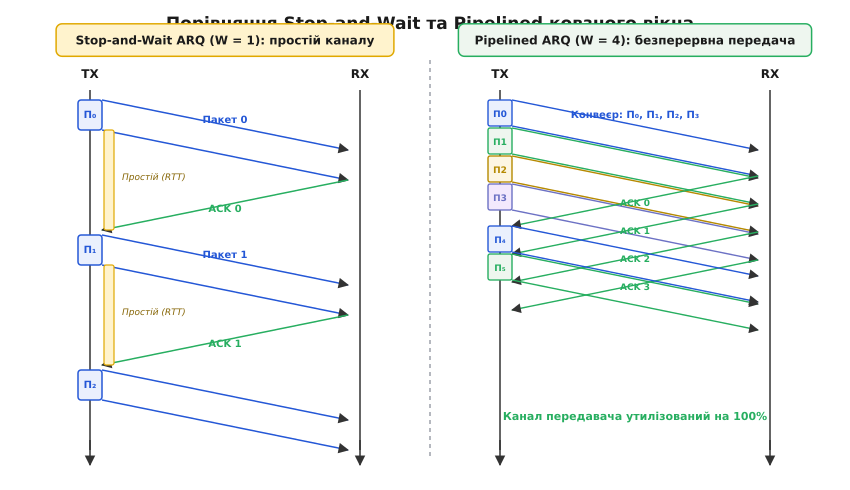
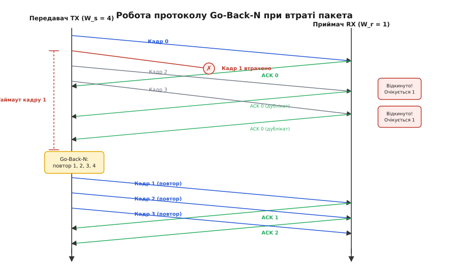
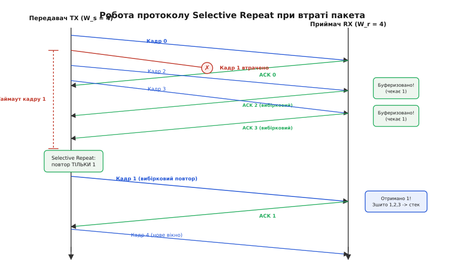
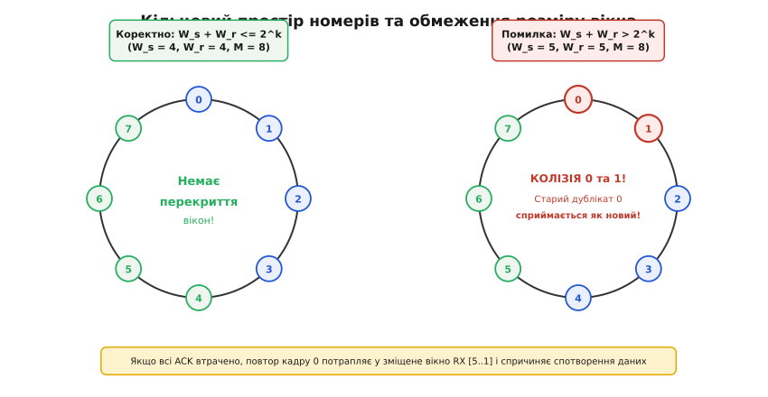
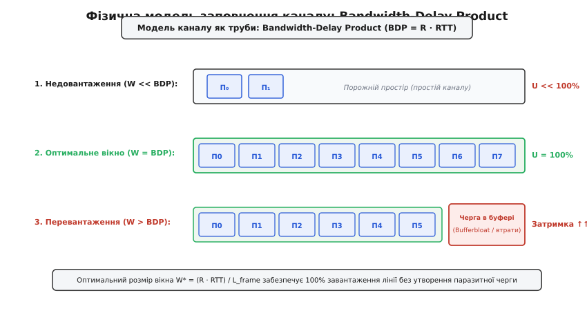
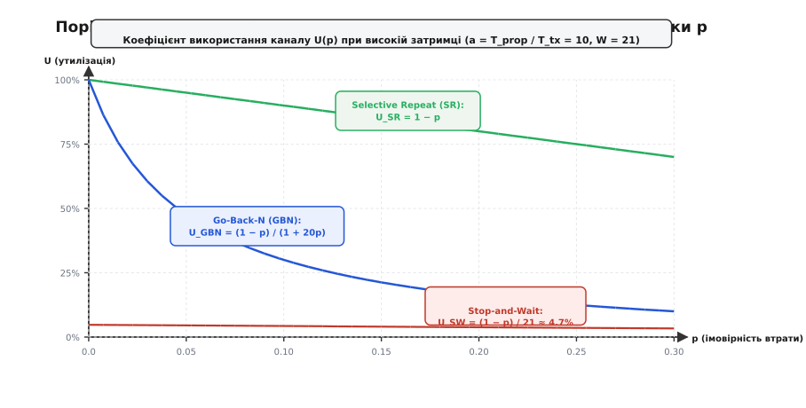

# ARQ зі ковзним вікном: конвеєрна надійність, механіка Go-Back-N та Selective Repeat

<preknowlist>
- [Протоколи ARQ: Stop-and-Wait, Go-Back-N та Selective Repeat](topic:com-transport/arq-retransmission-schemes) — базові принципи підтверджень, таймаути та зворотний зв'язок.
- [Керування потоком даних](topic:com-transport/flow-control) — узгодження швидкості відправника з місткістю буфера приймача.
- [Виявлення помилок за допомогою CRC](topic:com-modulation/crc) — перевірка цілісності блоків даних поліноміальними сумами.
- [Пропускна здатність та пропускна місткість каналу](topic:math-information/bandwidth-capacity) — взаємозв'язок затримки поширення, бітової швидкості та місткості лінії.
</preknowlist>

Якщо передавач випромінює стандартний Ethernet-кадр довжиною `1500` байтів (`12 000` бітів) у гігабітний оптоволоконний лінк зі швидкістю `1` Гбіт/с, фізичний час випромінювання всіх бітів у лінію становить усього `12` мікросекунд (`12` мкс). Якщо цей кабель прокладено між містами на відстань `3000` км, електромагнітна хвиля долає оптичне волокно за `15` мілісекунд (`15 000` мкс), а повний час кругового обігу сигналу та повернення службового підтвердження (`RTT`) складає щонайменше `30` мілісекунд. 

Якщо протокол зв'язку після відправлення одного кадру повністю зупиняє передавач і чекає на прихід підтвердження (як це робить примітивний алгоритм Stop-and-Wait), корисна передача триває `12` мкс, після чого обладнання бездіяльно простоює `30 000` мкс. У результаті реальна пропускна здатність каналу падає з `1 000 000` кбіт/с до жалюгідних `400` кбіт/с, а коефіцієнт використання дорогої магістральної лінії становить усього `0.04%`.

Фізичний канал зв'язку — це не миттєвий дріт, а протяжна труба з кінцевою швидкістю поширення світла. Щоб утилізувати лінію на повну потужність, передавач не повинен чекати на квитанцію за кожен окремий блок: він зобов'язаний безперервно виштовхувати в лінію потік нових кадрів один за одним, утримуючи в середовищі десятки або сотні непідтверджених пакетів одночасно. Цей принцип дістав назву **конвеєрної передачі даних** (англ. *pipelining*), а математичний та алгоритмічний механізм контролю за непідтвердженими блоками — **протоколів автоматичного запиту повторень зі ковзним вікном** (англ. *Sliding Window Automatic Repeat reQuest*, ARQ, від лат. *repetere* — повторювати та *quaerere* — запитувати).

> Детальну історію зародження конвеєрної передачі в мережі ARPANET, перших розробок Вінтона Серфа та Роберта Кана, стандартизації протоколів HDLC і LAPB та появи сучасних опцій TCP SACK викладено у вставці [📜 Від ARPANET до сучасних стеків: історія ковзного вікна](topic:com-transport/sliding-window-sizing-bdp/hist-sliding-window.md).

---

## Фізика конвеєрної передачі (Pipelining) та концепція вікна

Суть конвеєризації полягає в паралелізації процесів випромінювання даних та очікування зворотного зв'язку. Замість послідовності «відправив → заснув → отримав квитанцію → відправив наступний» передавач веде безперервну передачу пакетів із монотонно зростаючими номерами послідовності (англ. *Sequence Numbers*, `Seq`).


*Часова діаграма передачі даних: Stop-and-Wait (ліворуч) утримує передавач у стані простою більшу частину часу RTT, тоді як Pipelined ARQ зі ковзним вікном (праворуч) забезпечує безперервне 100% завантаження фізичного інтерфейсу.*

Щоб зрозуміти просторово-часову структуру сигналу в середовищі, розділимо повну затримку доставки пакета на чотири фізичні складові:

1. **Час випромінювання (Transmission Delay, `T_tx`):** час, протягом якого мережевий контролер виштовхує біти пакета довжиною `L` у фізичний інтерфейс із бітовою швидкістю `R`:
```
T_tx = L / R
```
2. **Час поширення хвилі (Propagation Delay, `T_prop`):** час, необхідний електромагнітному фронту для подолання фізичної відстані `d` між передавачем та одержувачем. Швидкість поширення `v` залежить від середовища: у мідному кабелі та кремнієвому оптоволокні `v = c / n ≈ 200 000` км/с (де показник заломлення `n ≈ 1.5`), а у відкритому космосі та радіоефірі `v = c ≈ 300 000` км/с:
```
T_prop = d / v
```
Для супутникового каналу на геостаціонарній орбіті (`d ≈ 36 000` км) одностороння затримка становить `T_prop ≈ 120` мс, що дає `RTT` понад `480` мс. Для низькоорбітальних угруповань (LEO, висота `550` км) `T_prop` скорочується до `2–4` мс.
3. **Час апаратної обробки (Processing Delay, `T_proc`):** час розрахунку контрольної суми CRC, маршрутизації та перевірки цілісності заголовків (частки мікросекунди).
4. **Час перебування в чергах (Queuing Delay, `T_queue`):** затримка очікування в буферах проміжних комутаторів та маршрутизаторів при виникненні сплесків трафіку.

Співвідношення між просторовою затримкою та часом випромінювання описується безрозмірним параметром **нормалізованої затримки** `a`:

```
a = T_prop / T_tx = (d · R) / (v · L)
```

Параметр `a` показує, скільки пакетів даних може одночасно перебувати в польоті всередині фізичного середовища, наче в довгій трубі. Якщо `a << 1` (короткий дріт SPI між мікроконтролерами на одній друкованій платі), середовище спорожнюється майже миттєво. Якщо ж `a >> 1` (магістральне оптоволокно чи супутниковий лінк), канал зв'язку стає велетенським просторовим накопичувачем.

Проте передавач не може транслювати дані нескінченно без підтверджень:
1. **Обмеженість пам'яті передавача:** кожен відправлений, але ще не підтверджений кадр мусить зберігатися в буфері RAM передавача на випадок, якщо його буде пошкоджено завадою і виникне потреба в повторній передачі.
2. **Обмеженість буфера приймача:** швидкість генерації даних передавачем може перевищувати швидкість їх обробки прикладним процесом на стороні одержувача.
3. **Обмеженість розрядності лічильників:** номери пакетів у заголовку кодуються фіксованою кількістю бітів, тому нескінченне зростання номерів неможливе.

Максимальна кількість кадрів або байтів, яку передавачу дозволено відправити в канал зв'язку без отримання підтвердження, називається **розміром вікна відправника** (англ. *Sender Window Size*, `W_s`).

---

## Анатомія та механіка ковзного вікна

Ковзне вікно — це динамічний логічний інтервал над циклічним простором номерів послідовності, межі якого змінюються в процесі надходження нових даних та зворотних квитанцій.

### Стан черги передавача

Передавач підтримує дві ключові змінні стану:
* **`S_base` (Send Base):** порядковий номер найстарішого надісланого кадру, на який ще не надійшло підтвердження (ліва межа вікна).
* **`S_next` (Next Sequence Number):** порядковий номер наступного кадру, готового до випромінювання в канал зв'язку.

Усі можливі номери послідовності в буфері передавача діляться на чотири неперетинні зони:

```
                  ◄──────────────── W_s (Розмір вікна) ────────────────►
┌───────────────┬─────────────────────────────┬────────────────────────┬───────────────┐
│ Підтверджено  │        У польоті            │   Готові до відправки  │ Заблоковані   │
│ (Acked)       │  (Sent, Not Acknowledged)   │ (Usable, Not Yet Sent) │ (Not Usable)  │
└───────────────┴─────────────────────────────┴────────────────────────┴───────────────┘
                ▲                             ▲                        ▲
                │                             │                        │
             S_base                        S_next              S_base + W_s
```

1. **`Seq < S_base`:** кадри, які вже відправлені, успішно прийняті приймачем та підтверджені. Їх видалено з буфера повторної передачі.
2. **`S_base ≤ Seq < S_next`:** кадри, що вже випромінені в лінію, але ще не підтверджені (перебувають «у польоті» всередині фізичного середовища або в черзі обробки приймача).
3. **`S_next ≤ Seq < S_base + W_s`:** кадри, які передавач має право відправити негайно, не чекаючи надходження нових підтверджень.
4. **`Seq ≥ S_base + W_s`:** заблокована зона. Передавач не має права надсилати ці кадри доти, доки ліва межа `S_base` не зрушиться вправо після приходу чергового підтвердження.

### Рух вікна під час передачі

Коли прикладний процес передає протоколу новий блок даних, передавач перевіряє умову `S_next < S_base + W_s`:
* Якщо умова виконується, кадр отримує номер `S_next`, зберігається в буфері, випромінюється в лінію, і покажчик `S_next` інкрементується.
* Якщо вікно заповнене (`S_next == S_base + W_s`), передавач блокує подальше приймання даних від прикладного рівня або повертає помилку заповнення черги.

Коли від одержувача надходить підтвердження `ACK`, ліва межа `S_base` зміщується вперед до підтвердженого номера. Оскільки права межа обчислюється як `S_base + W_s`, усе вікно немовби «ковзає» вправо по масиву даних, відкриваючи дозвіл на випромінювання нових блоків.

> Формат розміщення номерів послідовності та полів керування вікном у стандартних канальних протоколах детально описано у вставці [📋 Специфікація біт-орієнтованого кадру HDLC та поля керування вікном](topic:com-transport/sliding-window-sizing-bdp/api-hdlc-framing.md).

---

## Алгоритм Go-Back-N (GBN): кумулятивні підтвердження та скидання черги

Алгоритм **Go-Back-N** («Повернись на N назад») — це найпростіша конвеєрна схема ARQ, розроблена для систем із суворим обмеженням оперативної пам'яті на стороні приймача.

### Принцип роботи приймача GBN

Головна властивість приймача GBN: **розмір приймального вікна дорівнює одиниці (`W_r = 1`)**. Приймач не має буфера для збереження пакетів, що надійшли з порушенням черговості.

Приймач підтримує єдину змінну стану — `R_next` (очікуваний номер послідовності):
* Якщо надходить кадр із номером `Seq == R_next` і контрольна сума CRC правильна, приймач приймає кадр, віддає дані прикладному процесу, збільшує лічильник `R_next = (R_next + 1) mod M` і надсилає передавачеві позитивне підтвердження `ACK`.
* Якщо надходить кадр із будь-яким іншим номером `Seq ≠ R_next` (навіть якщо цей кадр повністю неушкоджений, але прибув раніше через втрату попереднього кадру), приймач **без вагань відкидає його тіло**. У відповідь приймач повторно відправляє підтвердження на останній успішно прийнятий блок (`ACK (R_next - 1)`).

### Кумулятивні підтвердження (Cumulative ACK)

У GBN квитанція `ACK n` має **кумулятивну (накопичувальну)** семантику: вона підтверджує успішний прийом **усіх без винятку** кадрів із номерами від початку до номера `n` включно.

Кумулятивні підтвердження забезпечують високу стійкість до втрат у зворотному каналі: якщо передавач відправив кадри `0, 1, 2`, а підтвердження `ACK 0` та `ACK 1` загубилися в дорозі, але `ACK 2` успішно дійшов до передавача, передавач розуміє, що кадри `0` та `1` також були прийняті, і зміщує свою базу відразу на `S_base = 3`.

### Робота таймера та сценарій втрати кадру

Передавач GBN використовує **один спільний таймер повторної передачі** (англ. *Retransmission Timeout*, `RTO`), прив'язаний до найстарішого непідтвердженого кадру `S_base`:
* Таймер запускається в момент відправлення кадру, коли буфер був порожнім (`S_base == S_next`).
* Щоразу, коли приходить валідний `ACK`, що зміщує `S_base` вперед, таймер перезапускається для нового кадру `S_base` (або зупиняється, якщо всі кадри підтверджено).
* Якщо таймер спливає (відбувся таймаут), передавач робить висновок, що кадр `S_base` втрачено. Оскільки приймач викинув усі наступні кадри, передавач зобов'язаний **повернутися назад і повторно передати всі кадри вікна** від `S_base` до `S_next - 1`.


*Робота протоколу Go-Back-N при втраті пакета 1: кадри 2 та 3 доходять до приймача, але відкидаються через відсутність буфера. Після таймауту передавач повторно транслює всі кадри 1, 2, 3.*

### Ціна простоти GBN

Перевага GBN полягає в мінімальних апаратних вимогах до приймача: для нього не потрібна динамічна пам'ять, структури сортування чи логіка перевпорядкування.

Проте на каналах із великою затримкою поширення або високим рівнем завад GBN спричиняє колосальні перевитрати пропускної здатності. Якщо у вікні розміром `W = 100` губиться один перший кадр, передавач успішно доставить решту `99` пакетів до приймача, але приймач їх знищить, і після таймауту лінія буде змушена повторно передавати всі `100` кадрів заново.

---

## Алгоритм Selective Repeat (SR): індивідуальні підтвердження та буферизація

Протокол **вибіркового повтору** (англ. *Selective Repeat*, SR) усуває неефективність GBN шляхом буферизації невпорядкованих даних на стороні одержувача та вибіркової повторної передачі виключно пошкоджених блоків.

### Принцип роботи приймача SR

Приймач Selective Repeat має власне повноцінне **приймальне вікно розміру `W_r > 1`**, яке визначає діапазон номерів послідовності, які приймач готовий прийняти та зберегти в пам'яті:

```
[R_base, R_base + W_r - 1]
```

* **Кадр у межах вікна (`Seq ∈ [R_base, R_base + W_r - 1]`):** якщо контрольна сума правильна, кадр записується у відповідний слот приймального буфера. Приймач негайно відправляє передавачеві **індивідуальне підтвердження** `ACK Seq` саме на цей отриманий номер.
* **Кадр на початку вікна (`Seq == R_base`):** якщо отримано кадр, якого бракувало на лівій межі, приймач зшиває всі неперервно накопичені в буфері блоки (`R_base, R_base + 1, ...`) і пакетом передає їх прикладному процесу. Після цього ліва межа `R_base` зміщується вправо до першого ще не отриманого пакета.
* **Кадр із попереднього вікна (`Seq ∈ [R_base - W_r, R_base - 1]`):** це дублікат старого кадру, чий `ACK` міг загубитися у зворотному каналі. Приймач відкидає тіло даних, але **обов'язково повторно надсилає `ACK Seq`**, щоб розблокувати завислий передавач.
* **Кадр за межами вікна:** ігнорується без генерації відповіді.

### Механіка передавача SR

Передавач Selective Repeat відстежує стан кожного відправленого пакета окремо:
* Кожен слот передавального буфера має прапорці `in_flight` (у польоті) та `acked` (підтверджено).
* Для кожного кадру ведеться власний незалежний таймер (або впорядкована черга пріоритетів таймерів).
* При отриманні `ACK n` передавач позначає слот `n` як підтверджений і зупиняє його таймер.
* Ліва межа `S_base` зміщується вперед лише тоді, коли підтверджено найстаріший пакет `S_base`.
* Якщо спливає таймер для кадру `k`, передавач **повторно випромінює виключно кадр `k`**, не чіпаючи інші успішно доставлені пакети вікна.


*Робота протоколу Selective Repeat при втраті пакета 1: кадри 2 та 3 буферизуються на RX, генеруючи вибіркові ACK. Після таймауту TX повторює виключно кадр 1, після чого приймач передає весь блок 1, 2, 3 у стек додатку.*

> Робочий програмний код симулятора та повні автомати станів Go-Back-N і Selective Repeat наведено у вставці [⚙️ Реалізація автоматів станів Go-Back-N та Selective Repeat](topic:com-transport/sliding-window-sizing-bdp/proj-sliding-window.md).

---

## Математичні обмеження на розміри вікна та простір послідовних номерів

У будь-якому реальному мережевому протоколі номер послідовності кадру кодується в заголовку фіксованою кількістю бітів `k`. Це означає, що простір номерів послідовності обмежений скінченною множиною:

```
M = 2^k,   Seq ∈ {0, 1, 2, ..., 2^k - 1}
```

Після досягнення номера `2^k - 1` лічильник обнуляється (`wrap-around`): наступний кадр знову отримує номер `0`.

Ця циклічність породжує фундаментальне математичне обмеження: **якщо розмір вікна вибрано занадто великим відносно `2^k`, приймач не зможе розрізнити, чи є отриманий пакет новим кадром із наступного циклу нумерації, чи запізнілим дублікатом старого кадру з попереднього кола.**


*Кільцевий простір номерів M = 8 (k = 3 біти): при коректному розмірі вікна W_s + W_r <= 8 (ліворуч) перекриття відсутнє; при перевищенні ліміту (праворуч) повтор кадру 0 нерозпізнавано потрапляє в нове вікно приймача.*

### 1. Границя розміру вікна для Go-Back-N

У протоколі Go-Back-N розмір приймального вікна дорівнює `W_r = 1`.

> **Теорема GBN:** Для коректної роботи алгоритму Go-Back-N на кільці номерів `M = 2^k` розмір вікна передавача `W_s` повинен задовольняти строгу нерівність:
> ```
> W_s ≤ 2^k - 1
> ```

**Приклад катастрофи при `W_s = 2^k`:**
Нехай `k = 2` біти (`M = 4`, номери `0, 1, 2, 3`), і ми помилково призначили `W_s = 4`.
1. Передавач надсилає кадри `0, 1, 2, 3`.
2. Приймач успішно приймає всі 4 кадри, віддає їх додатку, надсилає підтвердження `ACK 0, 1, 2, 3` і очікує наступний кадр `Seq = (3 + 1) mod 4 = 0`.
3. Усі 4 пакети `ACK` втрачаються в каналі через заваду.
4. На передавачі спливає таймаут для кадру `0`. Передавач повторно надсилає старий кадр `0`.
5. Приймач бачить кадр `Seq = 0`. Оскільки він чекає `R_next = 0`, він вирішує, що це **абсолютно новий кадр 0 із наступного циклу**, і записує старі дані у файл вдруге!

Якщо ж `W_s ≤ 2^k - 1` (наприклад, `W_s = 3`), то після прийому трьох кадрів приймач чекатиме `R_next = 3`. Повторний старий кадр `0` не збігається з `3` і буде безпечно відкинутий.

### 2. Границя розміру вікон для Selective Repeat

У Selective Repeat приймач сам зберігає вікно розміром `W_r > 1`.

> **Теорема Selective Repeat:** Для коректної роботи протоколу вибіркового повтору на кільці номерів `M = 2^k` сума розмірів вікон передавача та приймача не повинна перевищувати потужність простору номерів:
> ```
> W_s + W_r ≤ 2^k
> ```
> Для стандартного симетричного випадку з однаковими буферами (`W_s = W_r = W`):
> ```
> W ≤ 2^(k - 1) = 2^k / 2
> ```

**Приклад катастрофи при `W_s = W_r = 3` на кільці `M = 4` (`W > M/2`):**
1. Передавач надсилає кадри `0, 1, 2` (`TX_win = [0..2]`).
2. Приймач успішно отримує кадри `0, 1, 2`, надсилає `ACK 0, 1, 2` і зміщує своє приймальне вікно на 3 позиції вперед: `RX_win = [3, 0, 1]`.
3. Усі `ACK` губляться в каналі.
4. Передавач за таймаутом повторює старий кадр `0`.
5. Приймач дивиться на своє вікно `RX_win = [3, 0, 1]`. Номер `0` потрапляє в активний діапазон! Приймач записує дублікат старого кадру `0` у буфер як новий пакет.

Щоб уникнути перекриття вікон, розмір буфера Selective Repeat **ніколи не може перевищувати половини простору послідовних номерів**.

> Строгі математичні доведення обох теорем на кільці лишків `ℤ_(2^k)` та виведення ймовірнісних формул наведено у вставці [🧮 Математичне обґрунтування меж розміру вікна та ймовірнісної пропускної здатності ARQ](topic:com-transport/sliding-window-sizing-bdp/math-window-limits.md).

---

## Bandwidth-Delay Product (BDP) та динамічне керування вікном

Фізична спроможність каналу утримувати дані описується **добутком пропускної здатності на затримку** (англ. *Bandwidth-Delay Product*, BDP):

```
BDP = R · RTT   [біт]
```

BDP визначає об'єм «труби» між передавачем та одержувачем. Якщо поділити BDP на розмір одного кадру даних `L_frame`, ми отримаємо **оптимальний розмір вікна `W*`** у кадрах:

```
W* = BDP / L_frame = (R · RTT) / L_frame = 1 + 2 · (T_prop / T_tx)
```


*Фізична модель заповнення каналу як труби: недовантаження (W << BDP) спричиняє простій лінії; оптимальний режим (W = BDP) забезпечує 100% утилізацію; надлишкове вікно (W > BDP) переповнює буфери проміжних маршрутизаторів (Bufferbloat).*

### Три режими завантаження лінії

1. **Недовантаження (`W < W*`):** розмір вікна замалий, щоб заповнити трубу. Передавач відправляє всі `W` кадрів швидше, ніж повертається перший `ACK`, після чого змушений простоювати. Канал використовується лише на частку `W / W*`.
2. **Оптимальне заповнення (`W = W*`):** перший `ACK` повертається на передавач рівно в ту мікросекунду, коли передавач завершує випромінювання останнього `W`-го кадру у вікні. Передавач не простоює жодної частки секунди, забезпечуючи **100% коефіцієнт використання каналу** (`U = 1.0`).
3. **Перевантаження та Bufferbloat (`W > W*`):** якщо дозволити передавачу відправляти більше даних, ніж вміщує фізичний канал, надлишкові пакети не полетять швидше — вони почнуть накопичуватися в чергах буферів проміжних комутаторів та маршрутизаторів. Це породжує явище **Bufferbloat**: затримка передачі різко зростає від мілісекунд до секунд, виникає джитер, а при переповненні буферів маршрутизатор починає масово скидати пакети (англ. *Tail Drop*).

### Динамічне маніпулювання вікном у реальних мережах

У сучасних транспортних протоколах (зокрема TCP) розмір діючого вікна передавача `W` не є статичним і обчислюється як мінімум із двох незалежних обмежень:

```
W_effective = min( rwnd, cwnd )
```

* **`rwnd` (Receiver Advertised Window — Керування потоком):** розмір вікна, який приймач повідомляє в кожному зворотному пакеті `ACK`. Він показує, скільки вільної пам'яті залишилося в буфері операційної системи на боці одержувача. Якщо прикладний процес не читає дані, `rwnd` зменшується до нуля (Zero Window), повністю зупиняючи передавача.
* **`cwnd` (Congestion Window — Керування заторами):** розмір вікна, який передавач динамічно розраховує самостійно за допомогою алгоритмів Slow Start, Congestion Avoidance, CUBIC або BBR. `cwnd` оцінює реальну пропускну здатність вузького місця (bottleneck) проміжної мережі.

### Опція масштабування вікна (TCP Window Scale, RFC 1323)

Оригінальний заголовок TCP виділяє під поле `Window Size` рівно 16 бітів, що обмежує максимальне вікно величиною `65 535` байтів (64 КБ).

На сучасних лініях зв'язку 10 Гбіт/с із трансконтинентальною затримкою `RTT = 100` мс фізичний об'єм BDP становить:

```
BDP = 10 000 000 000 біт/с · 0.1 с = 1 000 000 000 біт = 125 МБ
```

Обмеження 64 КБ дозволило б утилізувати лише `0.05%` пропускної здатності 10-гігабітного каналу. Для подолання цього бар'єра RFC 1323 ввів опцію Window Scale, яка під час тристороннього рукостискання (SYN) узгоджує коефіцієнт двійкового зсуву `S ∈ [0..14]`. Реальний розмір вікна обчислюється як `Window_Bytes = Window_Field · 2^S`, що розширює максимальне вікно до `1` ГБ (`65 535 · 2¹⁴ ≈ 1 073 725 440` байтів) і дозволяє повністю наситити найшвидші магістральні канали світу.

---

## Вибіркові підтвердження SACK та виявлення дублікатів (D-SACK)

Хоча базовий заголовок TCP розрахований на кумулятивні підтвердження (як у GBN), стандарт RFC 2018 упровадив опцію вибіркового підтвердження (англ. *Selective Acknowledgment*, SACK), яка перетворила TCP на високоефективний гібрид із Selective Repeat.

### Формат блоків SACK

Опція SACK передається в додаткових полях заголовка TCP (Kind=5). Вона містить перелік неперервних діапазонів байтів, які приймач уже успішно отримав і зберіг у буфері, але які ще не можуть бути підтверджені кумулятивним номером `ACK` через наявність пропусків (дірок) попереду:

```
+---------+---------+-------------------------------------------------+
| Kind=5  | Length  |               SACK Блоки (до 4 пар)             |
| (1 байт)| (1 байт)|  [Left Edge 1 (4B)] [Right Edge 1 (4B)] ...     |
+---------+---------+-------------------------------------------------+
```

Оскільки максимальний розмір заголовка TCP разом з усіма опціями обмежений 60 байтами (з яких 20 байтів займає базовий заголовок, а 40 байтів — опції), у заголовок TCP вміщується щонайбільше **4 блоки SACK** (або 3 блоки, якщо паралельно використовується опція часових позначок TCP Timestamps).

### Виявлення непотрібних повторів за допомогою D-SACK (RFC 2883)

Якщо пакет не загубився, а лише затримався в черзі маршрутизатора і прибув після того, як передавач уже відправив його повторну копію за таймаутом, приймач стикається з дублікатом.

Розширення **D-SACK** (Duplicate SACK) дозволяє приймачеві в першому блоці SACK зазначити діапазон байтів щойно отриманого дубльованого пакета. Побачивши D-SACK, передавач отримує безцінну діагностичну інформацію:
1. Кадр не був втрачений фізично — спрацював передчасний фальшивий таймаут (Spurious Timeout).
2. Затримка каналу зросла, тому необхідно скоригувати розрахунок дисперсії `RTT`.
3. Немає потреби зменшувати вікно перевантаження `cwnd` удвічі (як при реальній втраті), що запобігає безпідставному падінню швидкості з'єднання.

---

## Адаптивна оцінка таймауту RTO: алгоритм Джейкобсона та правило Карна

Критичним елементом будь-якого ARQ-протоколу є точність налаштування таймера очікування `RTO`. Якщо призначити `RTO` занадто малим, передавач почне генерувати шторм паразитної повторної передачі ще до того, як легітимний `ACK` встигне повернутися з мережі. Якщо ж призначити `RTO` занадто великим, після реальної втрати пакета лінія зв'язку зависне в простої на сотні мілісекунд.

У глобальних мережах затримка `RTT` не є сталою величиною — вона зазнає постійних флуктуацій через джитер та черги комутаторів. Для динамічного відстеження затримки Ван Джейкобсон розробив алгоритм оцінки середнього часу та його дисперсії, стандартизований у RFC 6298.

### Математичний фільтр Джейкобсона

Для кожного виміряного значення поточного кругового обігу `RTT_sample` протокол оновлює дві змінні: згладжене середнє `SRTT` (Smoothed RTT) та згладжену абсолютну варіацію `RTTVAR` (RTT Variation):

```
RTTVAR = (1 - β) · RTTVAR + β · |SRTT - RTT_sample|   [де β = 1/4 = 0.25]
SRTT = (1 - α) · SRTT + α · RTT_sample               [де α = 1/8 = 0.125]
```

Значення таймауту повторної передачі `RTO` розраховується як середнє значення плюс чотирикратне стандартне відхилення:

```
RTO = SRTT + max( G, 4 · RTTVAR )
```
(де `G` — роздільна здатність системного таймера, зазвичай `1` мс, а мінімальний поріг `RTO` обмежується величиною `200` мс або `1` с).

### Правило Карна (Karn's Algorithm)

При повторній передачі виникає класична **неоднозначність квитанцій** (англ. *retransmission ambiguity*): якщо кадр було надіслано двічі, і прийшов `ACK`, передавач не знає, чи це відповідь на першу (запізнілу) спробу, чи на другу. 

Алгоритм Філа Карна встановлює два залізні правила:
1. **Заборона вимірювань:** вибірка `RTT_sample` ніколи не розраховується для кадрів, які були передані повторно.
2. **Експоненціальне відтермінування (Exponential Backoff):** щоразу, коли таймаут спрацьовує повторно для того самого кадру, значення `RTO` подвоюється: `RTO = 2 · RTO` (аж до максимального ліміту, наприклад `64` с).

---

## Буферизація в ядрах операційних систем та автопідстроювання TCP (Autotuning)

В операційних системах сімейства Linux/Unix та Windows буфери ковзного вікна реалізовані на рівні сокетних черг ядра.

```
       Простір користувача (User Space)
  [ write(fd, buf, len) ]       [ read(fd, buf, len) ]
            │                                ▲
════════════╪════════════════════════════════╪═════════════════
       Простір ядра (Kernel Space)
            ▼                                │
   +-----------------+              +-----------------+
   | Черга передачі  |              | Черга прийому   |
   |   SO_SNDBUF     |              |   SO_RCVBUF     |
   | (sk_buff queue) |              | (sk_buff queue) |
   +-----------------+              +-----------------+
            │                                ▲
            ▼ [DMA TX Ring]                  │ [DMA RX Ring]
   +──────────────────────────────────────────────────+
   |        Мережевий адаптер (NIC Controller)        |
   +──────────────────────────────────────────────────+
```

У сучасних ядрах Linux розміри буферів не фіксуються статично через `setsockopt(SO_RCVBUF)`, а динамічно масштабуються підсистемою **TCP Autotuning** (параметри `net.ipv4.tcp_wmem` та `net.ipv4.tcp_rmem`). Ядро безперервно вимірює добуток `BDP = Bandwidth · RTT` поточного з'єднання і автоматично розширює пам'ять черги `sk_buff` аж до кількох десятків мегабайтів, гарантуючи 100% утилізацію каналу без ручного втручання адміністратора.

---

## Гібридний ARQ (HARQ) у стільникових мережах 4G LTE та 5G NR

У мобільних бездротових мережах рівень помилок у радіоефірі через завади та багатопроменеве завмирання може сягати `10–20%`. Застосування чистого програмного Selective Repeat на транспортному рівні спричинило б катастрофічні затримки, оскільки кожен таймаут вимагав би десятків мілісекунд на передачу пакетів через базові станції та опорну мережу.

Для розв'язання цієї проблеми в стандартах LTE та 5G NR реалізовано двоконтурну систему надійності:

```
 +-------------------------------------------------------------+
 | Рівень RLC (Radio Link Control) — Повільний Selective Repeat|
 | Вікно: до 18 бітів Seq, RTT ~ 20-50 мс, гарантія порядку   |
 +-------------------------------------------------------------+
                                ▲
                                │ (Передає залишковий 0.1% помилок)
                                ▼
 +-------------------------------------------------------------+
 | Рівень MAC / PHY — Надшвидкий Hybrid ARQ (HARQ)             |
 | 8-16 паралельних процесів Stop-and-Wait, RTT ~ 1-4 мс       |
 | Апаратне накопичення енергії сигналу (Soft Combining)       |
 +-------------------------------------------------------------+
```

1. **Нижній рівень (PHY/MAC HARQ):** працює безпосередньо в апаратурі трансивера (FPGA/ASIC). Якщо блок даних прийнято з помилкою CRC, приймач **не викидає спотворені байти**. Він зберігає аналогові рівні напруги (англ. *Soft Bits / Log-Likelihood Ratios*, LLR) у пам'яті. Передавач надсилає повторну копію (Chase Combining) або додаткові надлишкові біти коду FEC (Incremental Redundancy). Приймач математично додає енергію двох сигналів, успішно декодуючи пакет навіть при глибокому шумі. HARQ знижує залишковий рівень втрат з `10%` до `0.1%`.
2. **Верхній рівень (RLC AM):** працює за схемою повноцінного Selective Repeat ARQ із ковзним вікном. Він підхоплює ті поодинокі `0.1%` пакетів, які не зміг врятувати рівень HARQ після 4 апаратних спроб, гарантуючи абсолютно непомильний потік для протоколів IP та TCP.

---

## Порівняльний аналіз пропускної здатності та ціна вибору

Продуктивність протоколів ARQ описується **коефіцієнтом використання каналу** (англ. *Channel Utilization*, `U`) — часткою часу, протягом якої лінія зв'язку передає корисні неушкоджені біти:

```
Throughput = U · R   [біт/с]
```

Нехай `p` — імовірність втрати або пошкодження окремого кадру в каналі (Frame Error Rate), а `a = T_prop / T_tx` — нормалізована затримка поширення.

При оптимальному розмірі вікна (`W ≥ 1 + 2a`):
* **Stop-and-Wait:** `U_SW = (1 - p) / (1 + 2a)`
* **Go-Back-N:** `U_GBN = (1 - p) / (1 + (W - 1) · p)`
* **Selective Repeat:** `U_SR = 1 - p`


*Графік залежності коефіцієнта використання каналу U від імовірності втрати кадру p при високій затримці (a = 10, W = 21): Selective Repeat зберігає лінійну залежність U = 1 - p, тоді як Go-Back-N стрімко деградує при зростанні втрат.*

### Підсумкова таблиця інженерних компромісів

| Характеристика | Stop-and-Wait | Go-Back-N (GBN) | Selective Repeat (SR) |
| :--- | :--- | :--- | :--- |
| **Розмір вікна передавача `W_s`** | `1` | `≤ 2^k - 1` | `≤ 2^(k - 1)` |
| **Розмір вікна приймача `W_r`** | `1` | `1` (без буфера) | `≤ 2^(k - 1)` (буфер перевпорядкування) |
| **Тип підтверджень** | Індивідуальний `ACK 0/1` | Кумулятивний `ACK n` | Індивідуальний / SACK |
| **Керування таймерами** | 1 таймер | 1 таймер (для `S_base`) | Окремий таймер на кожен кадр (або Timing Wheel) |
| **Поведінка при втраті кадру** | Повтор одного кадру | Повтор ВСЬОГО вікна з `S_base` | Повтор ТІЛЬКИ втраченого кадру |
| **Чутливість до затримки `RTT`** | Катастрофічна (`U ~ 1/RTT`) | Низька (при малих втратах `p`) | Нульова (за умови `W ≥ BDP`) |
| **Чутливість до втрат `p`** | Помірна | **Дуже висока** (деградація `~ 1/Wp`) | **Мінімальна** (`U = 1 - p`) |
| **Вимоги до пам'яті RAM** | Мінімальні (1 кадр) | Мінімальні (1 кадр на RX) | Високі (буфер на `W` кадрів на обох боках) |
| **Складність реалізації** | Тривіальна | Низька | Середня / Висока |
| **Типові сфери застосування** | Прості датчики, UART, TFTP | LAPB (X.25), CAN-шини, USB | TCP SACK, QUIC, Wi-Fi 802.11, 4G/5G RLC |

---

## Інженерний синтез: від теорії до сучасних стеків

Ковзне вікно — це один із найелегантніших винаходів комп'ютерної інженерії, що перетворив фізично ненадійні та просторово рознесені канали зв'язку на фундамент глобального швидкісного Інтернету.

Розвиток протоколів ковзного вікна за останні п'ятдесят років пройшов чітку еволюційну траєкторію:
1. **Епоха дефіциту пам'яті (1970–1980-ті):** домінування алгоритму Go-Back-N у протоколах X.25 LAPB та HDLC. Пам'ять була занадто дорогою, тому викидання неушкоджених кадрів приймачем вважалося прийнятною платою за простоту заліза.
2. **Епоха глобалізації та зростання BDP (1990–2000-ні):** трансокеанські оптоволоконні магістралі та супутникові канали зробили вартість повторної передачі цілого вікна неприпустимо високою. Упровадження TCP SACK (RFC 2018) перетворило Інтернет на гібридну систему з вибірковим повтором.
3. **Сучасна епоха (2010–2020-ті):** у мобільних мережах LTE/5G та новому стандарті HTTP/3 (протокол QUIC) Selective Repeat реалізовано на рівні незалежних мультиплексованих потоків. Відмова від єдиного блокуючого вікна на користь паралельних вікон потоків остаточно усунула проблему затримки початку черги (Head-of-Line Blocking), дозволивши досягати гігабітних швидкостей навіть на зашумлених радіоканалах.
