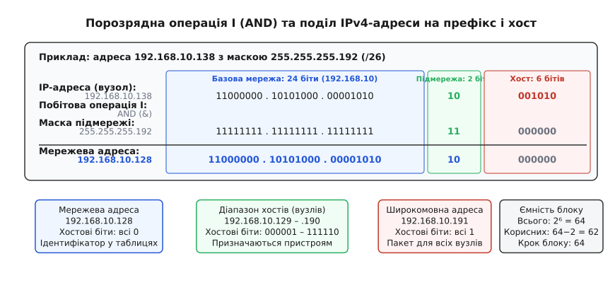
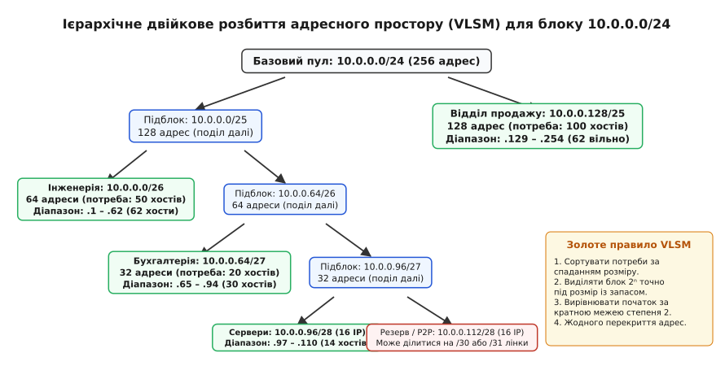
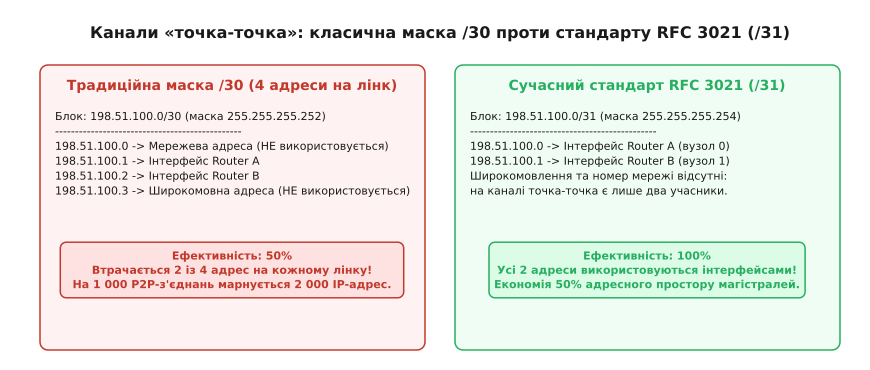
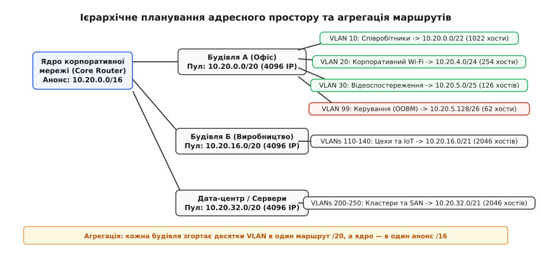

# Адресація підмереж: маски, поділ і розрахунок

<preknowlist>
- [Маршрутизація IP](root:com-transport/ip-routing) — таблиці маршрутизації, пересилання пакетів, інтерфейси та next-hop.
- [MAC, IP і ARP](root:com-transport/mac-ip-arp) — адресація, протокол розв'язання адрес і широкомовні домени.
- [CIDR і префікси](root:com-transport/cidr) — безкласова адресація, довжина префікса та агрегація маршрутів.
</preknowlist>

Коли локальна мережа підприємства розростається з двадцяти комп'ютерів до кількох сотень або тисяч пристроїв, об'єднаних спільними комутаторами другого рівня (L2), інфраструктура опиняється перед загрозою широкомовного колапсу. Усі пристрої перебувають в одному пласкому широкомовному домені: кожен службовий кадр протоколу ARP, запит на отримання конфігурації DHCP або оголошення сервісів mDNS змушений ретранслюватися через усі порти всіх комутаторів. Мережевий адаптер кожного підключеного комп'ютера отримує цей кадр і генерує апаратне переривання центрального процесора, змушуючи операційну систему розпаковувати пакет лише для того, щоб з'ясувати, що він адресований іншому вузлу. За кількох тисяч машин корисна пропускна здатність кабельних ліній стрімко падає, а процесори хостів витрачають помітну частку часу на обробку стороннього фонового шуму.

Одночасно виникає критичний бар'єр інформаційної безпеки та керованості. Якщо бухгалтерія, відділ кадрів, наукові лабораторії, сервери баз даних і відкритий гостьовий Wi-Fi підключені до єдиного спільного мережевого середовища, будь-який відвідувач із ноутбуком чи заражений вірусом комп'ютер може запустити програму перехоплення трафіку (сніфер), здійснити атаку отруєння ARP-кешу (англ. *ARP cache poisoning*) і читати незашифровані фінансові відомості або перехоплювати паролі доступу.

Єдиним архітектурним вирішенням цієї проблеми є **підмережева адресація** (англ. *subnet addressing*, або *subnetting*, від лат. *sub* — «під» та англ. *net* — «мережа») — поділ єдиного адресного простору організації на менші, логічно ізольовані мережеві сегменти (**підмережі**), сполучені між собою маршрутизаторами третього рівня (L3). Маршрутизатори локалізують широкомовний трафік у межах кожного підрозділу, забезпечують контроль доступу між сегментами та дозволяють будувати масштабовані мережі довільної складності.

---

### Анатомія маски підмережі та двійкова логіка маршрутизації

Будь-який мережевий пристрій з інтерфейсом IPv4 володіє 32-бітною адресою. Проте сама по собі IP-адреса не несе інформації про те, яка частина її бітів ідентифікує мережу, а яка — конкретний пристрій. Для визначення цієї межі разом із IP-адресою завжди налаштовується другий 32-бітний параметр — **маска підмережі** (англ. *subnet mask*).

Маска підмережі являє собою суцільну послідовність двійкових одиниць `1`, за якою йде суцільна послідовність двійкових нулів `0`. Розриви в масці (наприклад, одиниці після нулів) суворо заборонені стандартом IP. Одиничні розряди вказують на біти, які належать номеру мережі та підмережі (префіксу), а нульові розряди — на біти, які кодують номер конкретного вузла (хоста).

Коли мережевий стек операційної системи хоста готує до відправки IP-пакет, він повинен ухвалити фундаментальне рішення:
- чи перебуває адреса отримувача в **тій самій локальній підмережі** (у цьому випадку пакет запаковується в канальний Ethernet-кадр і відправляється безпосередньо отримувачу через протокол [MAC, IP і ARP](root:com-transport/mac-ip-arp));
- чи адреса отримувача належить до **віддаленої підмережі** (у цьому випадку пакет відправляється на канальну адресу шлюзу за замовчуванням — Default Gateway, яким виступає інтерфейс найближчого маршрутизатора).

Для цієї перевірки мережевий стек виконує просту й надзвичайно швидку апаратну операцію — **порозрядне логічне множення (AND)**. Таблиця істинності операції AND повертає `1` лише тоді, коли обидва вхідні біти дорівнюють `1`:

```
0 AND 0 = 0
0 AND 1 = 0
1 AND 0 = 0
1 AND 1 = 1
```

Хост застосовує маску підмережі до власної IP-адреси, а потім до IP-адреси призначення. Якщо результати збігаються:

```
(Власна IP-адреса AND Маска) == (IP-адреса призначення AND Маска)
```

це означає, що вузол-відправник і вузол-отримувач підключені до одного фізичного канального сегмента, і маршрутизація L3 не потрібна. Якщо результати різняться, пакет негайно передається шлюзу.

Розглянемо внутрішню анатомію адреси `192.168.10.138` з маскою `255.255.255.192` (префікс `/26`):

```
IP-адреса хоста :  11000000 . 10101000 . 00001010 . 10 001010  (192.168.10.138)
Маска підмережі :  11111111 . 11111111 . 11111111 . 11 000000  (255.255.255.192)
                   └────────── префікс (26 бітів) ────────┘ └хост┘
Порозрядне AND  :  11000000 . 10101000 . 00001010 . 10 000000  (192.168.10.128)
```


*Порозрядна операція І (AND) між IP-адресою та маскою виділяє мережевий ідентифікатор 192.168.10.128, обнуляючи 6 хостових бітів. Це розділяє адреси на ідентифікатор мережі, корисний діапазон хостів та широкомовну адресу.*

У результаті накладання маски в кожній підмережі утворюються дві спеціальні зарезервовані адреси, які **заборонено призначати мережевим інтерфейсам кінцевих пристроїв**:

1. **Мережева адреса (Network Address):** адреса, у якій усі хостові біти встановлено в `0` (`192.168.10.128`). Вона ідентифікує саму підмережу як єдине ціле і використовується маршрутизаторами в таблицях пересилання [маршрутизації IP](root:com-transport/ip-routing).
2. **Спрямована широкомовна адреса (Directed Broadcast Address):** адреса, у якій усі хостові біти встановлено в `1` (`192.168.10.191`). Пакет, надісланий на цю адресу, приймається та обробляється всіма без винятку активними хостами цієї конкретної підмережі.

Історично підмережі виникли в середині 1980-х років для порятунку університетських кампусів від вибуху розмірів глобальних таблиць маршрутизації. Подробиці створення стандарту RFC 950 та причини тривалої історичної заборони «нульової підмережі» викладено у вставці про [історію RFC 950 та подолання класового моноліту](root:com-transport/subnet-addressing/hist-rfc950-subnetting.md).

---

### Життєвий цикл IP-пакета та взаємодія з ядром операційної системи

Для глибшого розуміння розглянемо, як мережевий стек ядра Linux (підсистема IPv4 FIB) обробляє вихідний пакет за наявності налаштованої підмережі.

Коли прикладний процес викликає системний виклик `sendto()` для відправки сокетного буфера `sk_buff`, ядро виконує функцію маршрутизації `ip_route_output_key()`. Алгоритм перевірки складається з таких фаз:

1. **Зіставлення з локальною підмережею:**
   Ядро бере IP-адресу призначення та виконує бітову операцію `dest_ip & netmask`. Якщо отримане значення збігається з мережевою адресою інтерфейсу (наприклад, `192.168.10.128`), ядро позначає маршрут як безпосередньо підключений (`RTN_UNICAST, scope link`).
2. **Локальна резолюція канального рівня:**
   Для безпосередньо підключеного вузла ядро звертається до внутрішньої таблиці сусідів (ARP cache). Якщо запис для цільової IP-адреси присутній, пакет негайно обрамляється Ethernet-заголовком із MAC-адресою цільового вузла. Якщо запис відсутній, ядро генерує локальний широкомовний ARP Request (`Who has 192.168.10.150? Tell 192.168.10.138`).
3. **Маршрутизація через шлюз:**
   Якщо адреса призначення не збігається з локальною підмережею, пошук у префіксному дереві ядра піднімається до маршруту за замовчуванням `0.0.0.0/0`. Ядро підставляє як IP-адресу наступного переходу (next-hop) адресу шлюзу за замовчуванням (Default Gateway, наприклад `192.168.10.129`). Пакет інкапсулюється в Ethernet-кадр, де в полі Destination MAC вказується апаратна адреса маршрутизатора, тоді як у полі Destination IP назавжди залишається кінцева IP-адреса віддаленого хоста.
4. **Обробка широкомовних адрес:**
   Якщо адреса призначення збігається зі спрямованим широкомовленням `192.168.10.191`, ядро маркує пакет типом `RTN_BROADCAST` і передає мережевому драйверу команду надіслати кадр на апаратну MAC-адресу `FF:FF:FF:FF:FF:FF`.

---

### Розрахунок ємності та формула корисних хостів

Кількість пристроїв, які можна розмістити в межах однієї підмережі, визначається виключно кількістю нульових бітів у масці підмережі.

Нехай `N` — довжина префікса (кількість одиничних бітів у масці від 0 до 32). Тоді кількість хостових бітів `h` становить:

```
h = 32 − N
```

За допомогою `h` бітів можна закодувати рівно `2ʰ = 2³²⁻ᴺ` унікальних двійкових комбінацій. Оскільки дві комбінації (усі нулі та всі одиниці) зарезервовано під номер мережі та широкомовну адресу, формула кількості **корисних адрес хостів** (англ. *usable host addresses*) набуває вигляду:

```
Кількість корисних хостів = 2³²⁻ᴺ − 2 = 2ʰ − 2
```

Строге алгебраїчне виведення цієї формули, доведення теореми про кратність меж за степенями двійки та аналіз ультраметричного простору адрес наведено у вставці про [математику бітових масок та двійкового розбиття простору](root:com-transport/subnet-addressing/math-vlsm-geometry.md).

Нижче наведено зведену таблицю стандартних підмереж IPv4, які найчастіше застосовуються в корпоративних та операторських мережах:

| Префікс | Маска підмережі (десяткова) | Маска (Hex) | Хостові біти (`h`) | Крок підмережі (`2ʰ`) | Корисні хости (`2ʰ − 2`) | Типове призначення |
| :--- | :--- | :--- | :---: | :---: | :---: | :--- |
| **/20** | `255.255.240.0` | `0xFFFFF000` | 12 | 4096 | 4094 | Великий кампус університету |
| **/22** | `255.255.252.0` | `0xFFFFFC00` | 10 | 1024 | 1022 | Загальнокорпоративний Wi-Fi |
| **/24** | `255.255.255.0` | `0xFFFFFF00` | 8 | 256 | 254 | Стандартний офісний VLAN |
| **/25** | `255.255.255.128` | `0xFFFFFF80` | 7 | 128 | 126 | Середній відділ компанії |
| **/26** | `255.255.255.192` | `0xFFFFFFC0` | 6 | 64 | 62 | Невеликий відділ, Wi-Fi зона |
| **/27** | `255.255.255.224` | `0xFFFFFFE0` | 5 | 32 | 30 | Серверна стійка, DMZ |
| **/28** | `255.255.255.240` | `0xFFFFFFF0` | 4 | 16 | 14 | Мережа керування (OOBM) |
| **/29** | `255.255.255.248` | `0xFFFFFFF8` | 3 | 8 | 6 | Кластер міжмережевих екранів |
| **/30** | `255.255.255.252` | `0xFFFFFFFC` | 2 | 4 | 2 | Класичний канал точка-точка |
| **/31** | `255.255.255.254` | `0xFFFFFFFE` | 1 | 2 | 2 (RFC 3021) | Сучасний P2P-лінк маршрутизаторів |
| **/32** | `255.255.255.255` | `0xFFFFFFFF` | 0 | 1 | 1 (Host Route) | Loopback-інтерфейс, VPN-клієнт |

Зі збільшенням довжини префікса на 1 біт кількість доступних підмереж подвоюється, а місткість кожної підмережі зменшується вдвічі.

---

### Покроковий алгоритм швидкого розрахунку підмереж

У польових умовах та під час налаштування мережевого обладнання інженеру необхідно за лічені секунди визначати параметри підмережі в умі, без переведення чисел у повний 32-бітний двійковий код. Для цього застосовується універсальний алгоритм на основі концепції **магічного числа** (англ. *magic number*, або кроку блоку).

Алгоритм складається з п'яти кроків:

#### Крок 1. Визначення граничного октету

Граничним (англ. *interesting octet*) називається той октет маски, значення якого не дорівнює `255` і не дорівнює `0`.
- якщо префікс лежить у діапазоні `/9` – `/16`, граничним є **другий октет**;
- якщо префікс лежить у діапазоні `/17` – `/24`, граничним є **третій октет**;
- якщо префікс лежить у діапазоні `/25` – `/32`, граничним є **четвертий октет**.

Усі октети ліворуч від граничного переносяться в результат без змін. Усі октети праворуч від граничного в мережевій адресі обнуляються (`0`), а в широкомовній адресі заповнюються числом `255`.

#### Крок 2. Розрахунок магічного числа (кроку підмережі)

Магічне число `Δ` визначається відніманням десяткового значення маски в граничному октеті від числа 256:

```
Δ = 256 − Маска_граничного_октету
```

Число `Δ` завжди є степенем двійки (`128, 64, 32, 16, 8, 4, 2, 1`) і показує точну відстань між початками сусідніх підмереж у цьому октеті.

#### Крок 3. Пошук мережевої адреси

У граничному октеті мережева адреса дорівнює найбільшому числу, кратному `Δ`, яке не перевищує відповідний октет вихідної IP-адреси:

```
Мережевий_октет = ⌊ Октет_IP / Δ ⌋ · Δ
```

#### Крок 4. Пошук широкомовної адреси

Граничний октет наступної підмережі дорівнює `Мережевий_октет + Δ`. Відповідно, широкомовна адреса поточної підмережі в граничному октеті дорівнює:

```
Широкомовний_октет = Мережевий_октет + Δ − 1
```

#### Крок 5. Визначення діапазону корисних хостів

- **Перший корисний хост:** `Мережева адреса + 1` (додається 1 до останнього октету).
- **Останній корисний хост:** `Широкомовна адреса − 1` (віднімається 1 від останнього октету).

---

#### Практичний приклад розрахунку №1: адреса 172.16.45.100/22

**Вхідні дані:** IP-адреса `172.16.45.100`, маска `/22` (`255.255.252.0`).

1. **Граничний октет:** префікс `/22` потрапляє в діапазон `/17` – `/24`, отже граничним є **3-й октет** (значення `45` в IP та `252` у масці).
2. **Магічне число:** `Δ = 256 − 252 = 4`.
3. **Мережева адреса:**
   - 1-й та 2-й октети переносяться: `172.16.`;
   - 3-й октет: найбільше кратне 4, що не перевищує 45 — це `44` (`44 = 11 · 4`);
   - 4-й октет обнуляється: `.0`.
   - **Мережева адреса:** `172.16.44.0`.
4. **Широкомовна адреса:**
   - 3-й октет наступної підмережі: `44 + 4 = 48`;
   - 3-й октет поточної широкомовної адреси: `48 − 1 = 47`;
   - 4-й октет заповнюється одиницями: `.255`.
   - **Широкомовна адреса:** `172.16.47.255`.
5. **Діапазон корисних хостів:** від `172.16.44.1` до `172.16.47.254` (разом `2¹⁰ − 2 = 1022` хости).

---

#### Практичний приклад розрахунку №2: адреса 192.168.1.138/27

**Вхідні дані:** IP-адреса `192.168.1.138`, маска `/27` (`255.255.255.224`).

1. **Граничний октет:** префікс `/27` вказує на **4-й октет** (значення `138` в IP та `224` у масці).
2. **Магічне число:** `Δ = 256 − 224 = 32`.
3. **Мережева адреса:**
   - перші 3 октети: `192.168.1.`;
   - 4-й октет: найбільше кратне 32, що не перевищує 138 — це `128` (`128 = 4 · 32`).
   - **Мережева адреса:** `192.168.1.128`.
4. **Широкомовна адреса:**
   - 4-й октет наступної підмережі: `128 + 32 = 160`;
   - 4-й октет поточної широкомовної адреси: `160 − 1 = 159`.
   - **Широкомовна адреса:** `192.168.1.159`.
5. **Діапазон хостів:** від `192.168.1.129` до `192.168.1.158` (разом `2⁵ − 2 = 30` хостів).

---

#### Практичний приклад розрахунку №3: адреса 10.50.18.5/20

**Вхідні дані:** IP-адреса `10.50.18.5`, маска `/20` (`255.255.240.0`).

1. **Граничний октет:** префікс `/20` вказує на **3-й октет** (значення `18` в IP та `240` у масці).
2. **Магічне число:** `Δ = 256 − 240 = 16`.
3. **Мережева адреса:**
   - 1-й та 2-й октети: `10.50.`;
   - 3-й октет: найбільше кратне 16, що не перевищує 18 — це `16` (`16 = 1 · 16`);
   - 4-й октет обнуляється: `.0`.
   - **Мережева адреса:** `10.50.16.0`.
4. **Широкомовна адреса:**
   - 3-й октет наступної підмережі: `16 + 16 = 32`;
   - 3-й октет поточної широкомовної адреси: `32 − 1 = 31`;
   - 4-й октет: `.255`.
   - **Широкомовна адреса:** `10.50.31.255`.
5. **Діапазон хостів:** від `10.50.16.1` до `10.50.31.254` (разом `2¹² − 2 = 4094` хости).

---

#### Практичний приклад розрахунку №4: публічна підмережа 198.51.100.27/29

**Вхідні дані:** IP-адреса `198.51.100.27`, маска `/29` (`255.255.255.248`).

1. **Граничний октет:** префікс `/29` вказує на **4-й октет** (значення `27` в IP та `248` у масці).
2. **Магічне число:** `Δ = 256 − 248 = 8`.
3. **Мережева адреса:**
   - перші 3 октети: `198.51.100.`;
   - 4-й октет: найбільше кратне 8, що не перевищує 27 — це `24` (`24 = 3 · 8`).
   - **Мережева адреса:** `198.51.100.24`.
4. **Широкомовна адреса:**
   - 4-й октет наступної підмережі: `24 + 8 = 32`;
   - 4-й октет поточної широкомовної адреси: `32 − 1 = 31`.
   - **Широкомовна адреса:** `198.51.100.31`.
5. **Діапазон корисних хостів:** від `198.51.100.25` до `198.51.100.30` (разом `2³ − 2 = 6` корисних серверів DMZ).

> 🔧 **Навіщо це.**
> Розрахунок магічного числа є базовим інструментом під час аналізу мережевих збоїв. Якщо сервер з адресою `192.168.1.138/27` не може встановити зв'язок зі шлюзом `192.168.1.1`, адміністратор миттєво бачить: шлюз розташований у першій підмережі (`.0` – `.31`), тоді як сервер випадково налаштований у п'ятій підмережі (`.128` – `.159`). Вони перебувають у різних широкомовних доменах і не почують один одного без проміжного маршрутизатора.

---

### Змінна довжина маски (VLSM): подолання неефективності FLSM

У ранній період розвитку комп'ютерних мереж використовувалося маскування фіксованої довжини (Fixed Length Subnet Masking, FLSM). За моделлю FLSM усі підмережі в межах одного адресного пулу мусили мати однакову маску.

Це призводило до величезного перевитрачання адресного простору. Якщо компанія виділяла маску `/24` (254 хости) для поверху офісу на 200 співробітників, вона була змушена використовувати таку ж маску `/24` для віддаленого складу на 5 комп'ютерів (де марнувалося 249 адрес) і для каналу зв'язку між двома маршрутизаторами (де з 254 адрес використовувалися лише 2, а 252 адреси втрачалися назавжди).

Вирішенням цієї кризи стало впровадження концепції **VLSM** (англ. *Variable Length Subnet Masking*, змінна довжина маски підмережі, стандартизована в RFC 1878). VLSM дозволяє ієрархічно ділити адресний простір на блоки різного розміру, підбираючи маску підмережі точно під реальну фізичну потребу кожного окремого сегмента.


*Ієрархічне розбиття пулу 10.0.0.0/24: ліва гілка ділиться на дрібні блоки /26, /27 та /28 під інженерію, бухгалтерію та сервери, а права гілка /25 виділяється цілком під великий відділ продажу.*

#### Золоте правило VLSM

Щоб запобігти накладанню адресних інтервалів та виключити утворення непридатних адресних дірок (зовнішньої фрагментації), планування VLSM підпорядковується залізному інженерному правилу:

**Усі запити на підмережі обов'язково сортуються за спаданням кількості необхідних хостів (від найбільшого блоку до найменшого).**

Якщо спочатку виділити великі підмережі (`/22`, `/24`), а потім дрібні (`/28`, `/30`, `/31`), кожен блок автоматично починається на адресі, що ділиться націло на його розмір. Якщо ж порушити цей порядок і призначити спочатку малий блок `/30`, наступний великий блок `/24` буде неможливо розмістити поруч: доведеться пропустити понад дві сотні адрес для досягнення наступної кратної межі.

Повний алгоритмічний розбір, вихідний код автономного VLSM-калькулятора мовами C та C++ та детальне трасування пам'яті наведено у практичній вставці про [алгоритм та калькулятор VLSM-планування](root:com-transport/subnet-addressing/proj-vlsm-allocator.md).

---

### Канали «точка-точка»: класична маска /30 проти стандарту RFC 3021 (/31)

Окремим класом комп'ютерних мереж є виділені канали зв'язку між двома маршрутизаторами (Point-to-Point лінки: оптичні з'єднання Dark Fiber, тунелі GRE/IPsec або послідовні інтерфейси). На такому каналі фізично існують лише два пристрої — маршрутизатор A та маршрутизатор B.

Історично для з'єднання двох маршрутизаторів використовувалася маска `/30` (`255.255.255.252`):

```
Блок: 198.51.100.0/30 (4 адреси)
----------------------------------
198.51.100.0  ->  Мережева адреса (не призначається)
198.51.100.1  ->  Інтерфейс Router A (використовується)
198.51.100.2  ->  Інтерфейс Router B (використовується)
198.51.100.3  ->  Широкомовна адреса (не призначається)
```

Маска `/30` має суттєвий архітектурний недолік: із 4 виділених адрес корисними є лише 2. Рівно **50% адресного простору марнується**. У масштабних мережах інтернет-провайдерів (ISP), великих дата-центрах або корпоративних бекбонах із 10 000 магістральних лінків маска `/30` вимагає 40 000 IP-адрес, з яких 20 000 адрес виявляються викинутими на непотрібні службові номери.

Для ліквідації цього марнування у грудні 2000 року було прийнято стандарт **RFC 3021** (*Using 31-Bit Prefixes on IPv4 Point-to-Point Links*), який стандартизував використання префікса **/31** (`255.255.255.254`).


*Класична маска /30 втрачає дві з чотирьох адрес на мережевий номер і широкомовлення (50% втрат). Стандарт RFC 3021 (/31) виділяє рівно дві адреси на два інтерфейси, забезпечуючи 100% утилізацію.*

У префіксі `/31` хостова частина містить лише 1 біт, що дає рівно дві адреси: `0` та `1`.
На каналі точка-точка:
- поняття спрямованого широкомовлення втрачає сенс: відправлений пакет може потрапити виключно до єдиного сусіда на протилежному кінці дроту;
- мережева адреса не конфліктує з номерами інтерфейсів у таблицях безпосередньо підключених маршрутів.

Тому адреса зі значенням `0` призначається першому маршрутизатору (`198.51.100.0`), а адреса зі значенням `1` — другому маршрутизатору (`198.51.100.1`). Ефективність використання адрес становить **100%**.

Стандарт RFC 3021 підтримується всіма сучасними операційними системами (Linux, FreeBSD) та мережевим обладнанням (Cisco IOS/IOS-XE/NX-OS, Juniper Junos, Arista EOS, MikroTik RouterOS) і є обов'язковим стандартом де-факто для побудови сучасних опорних мереж та інфраструктури центрів обробки даних.

---

### Архітектура та проєктування адресного простору підприємства

Професійне проєктування мережі підприємства починається не з підбору випадкових адрес для окремих комп'ютерів, а зі створення строгої багаторівневої ієрархічної структури.


*Ієрархічна модель адресації: корпоративний блок 10.20.0.0/16 ділиться на блоки /20 для окремих будівель, які всередині розпадаються на функціональні VLAN. Маршрутизатори ядра бачать лише компактні узагальнені анонси.*

Головні принципи проєктування масштабованого адресного простору:

#### 1. Функціональна та безпекова сегментація (VLAN-based Subnetting)

Кожна категорія пристроїв отримує власний виділений VLAN та окрему IP-підмережу:
- **Робочі станції співробітників (User Access):** типово великі підмережі `/24` – `/22` з динамічною роздачею адрес через DHCP;
- **Корпоративний та гостьовий Wi-Fi:** ізольовані підмережі з коротким часом оренди DHCP-адрес (Lease Time) та обмеженням доступу до внутрішніх ресурсів;
- **Серверний сегмент (Data Center / Server Farm):** підмережі зі статичною адресацією, високою щільністю та багаторівневим захистом міжмережевими екранами;
- **IP-телефонія (Voice over IP) та відеоконференції:** окремі підмережі з налаштованими політиками пріоритезації трафіку (QoS);
- **Системи безпеки та інженерія:** IP-камери відеоспостереження, СКУД (контроль доступу), кліматичні контролери та датчики IoT;
- **Мережа позасмугового керування (Out-of-Band Management, OOBM):** ізольований сегмент `/27` – `/26` для підключення портів IPMI/iLO/iDRAC серверів, консольних серверів та інтерфейсів керування комутаторами. Трафік керування ніколи не повинен перетинатися з користувацькими даними.

#### 2. Дружність до агрегації маршрутів (Summarization-friendly Design)

Адресні блоки виділяються географічно або структурно великими неперервними ступенями двійки (наприклад, кожній філії чи окремій будівлі виділяється єдиний блок `/20` або `/19`).
Завдяки цьому прикордонний маршрутизатор будівлі анонсує в ядро мережі за протоколами OSPF або BGP **лише один сумарний маршрут** замість десятків дрібних маршрутів окремих підрозділів. Це радикально зменшує навантаження на процесори маршрутизаторів ядра та прискорює збіжність мережі у разі аварій.

#### 3. Закладання запасу на зростання (Growth Factor Padding)

Розмір кожної підмережі розраховується з урахуванням прогнозованого зростання штату на 30–50% протягом найближчих 3–5 років. Якщо у відділі сьогодні працює 50 осіб, виділення блоку `/26` (62 хости) є помилкою, оскільки прийом на роботу 13 нових працівників вичерпає підмережу. Правильним рішенням є виділення блоку `/25` (126 хостів) або резервування сусіднього блоку `/26` для можливого майбутнього об'єднання в `/25`.

#### 4. Стандартні шаблони внутрішнього розподілу адрес у підмережі

Для спрощення адміністрування та моніторингу всередині кожної підмережі `/24` використовується єдиний загальнокорпоративний шаблон призначення IP-адрес:
- `1` – `5`: адреси інтерфейсів шлюзів за замовчуванням (Default Gateways) та віртуальних адрес протоколів відмовостійкості (HSRP, VRRP, CARP);
- `6` – `20`: статичні адреси мережевої інфраструктури (керовані комутатори, точки доступу Wi-Fi, принт-сервери);
- `21` – `50`: статичні сервери підрозділу та локальні мережеві сховища (NAS);
- `51` – `240`: динамічний пул адрес, які автоматично видаються сервером DHCP клієнтським робочим станціям;
- `241` – `254`: резервний статичний пул для діагностичного обладнання інженерів.

---

### Адресація сучасних фабрик центрів обробки даних (Leaf-Spine)

У сучасних дата-центрах відмовилися від класичної трирівневої топології на користь двоярусної фабрики Клоза (Leaf-Spine архітектура). Підмережева адресація такої фабрики оптимізована під максимальну швидкість апаратної комутації:

1. **Міжкомутаторні лінки Leaf-Spine:**
   Кожен комутатор рівня Leaf з'єднаний з кожним комутатором Spine прямим оптичним лінком 100G/400G. Для кожного такого лінка виділяється підмережа `/31`. Якщо фабрика містить 32 Leaf та 4 Spine комутатори, створюється `32 · 4 = 128` підмереж `/31` (разом 256 IP-адрес), що займає всього один префікс `/24`.
2. **Loopback-інтерфейси комутаторів (/32):**
   Кожен комутатор отримує унікальну 32-бітну адресу з префіксом `/32` на віртуальному Loopback-інтерфейсі. Ця адреса ніколи не вимикається фізично і слугує:
   - ідентифікатором маршрутизатора (Router ID) у протоколах BGP та OSPF/IS-IS;
   - кінцевою точкою тунелювання VTEP (VXLAN Tunnel Endpoint) для побудови віртуальних мереж EVPN-VXLAN.
3. **Anycast Default Gateway:**
   Усі Leaf-комутатори налаштовуються з однаковою IP-адресою шлюзу на віртуальних інтерфейсах SVI (Switch Virtual Interface) для кожного клієнтського VLAN. Завдяки цьому віртуальна машина при міграції (vMotion) з одного сервера на інший зберігає свою IP-адресу та маску, продовжуючи працювати без розриву активних TCP-з'єднань.

---

### Типові інженерні пастки та їх діагностика

Під час експлуатації та модифікації адресного простору найчастіше виникають чотири критичні дефекти:

1. **Конфлікт перекриття підмереж (Overlapping Subnets):**
   Виникає, коли в різних частинах корпоративної мережі або на різних інтерфейсах маршрутизатора випадково налаштовують підмережі, діапазони яких перетинаються (наприклад, `10.1.0.0/23` та `10.1.1.0/24`). Маршрутизатор направляє трафік за правилом найдовшого префікса (Longest Prefix Match), через що частина хостів стає непередбачувано недоступною. Виявляється перевіркою вирівнювання за допомогою формули перетину в IPAM-системах.
2. **Розривні мережі (Discontiguous Networks):**
   Ситуація, коли дві однакові підмережі розділені посередині іншим адресним простором. За використання застарілих протоколів маршрутизації з автоматичною класовою агрегацією трафік починає балансуватися між двома різними фізичними локаціями, породжуючи 50% втрат пакетів (Blackholing).
3. **Помилка бітового зсуву на межі октету (Octet Boundary Confusion):**
   Часта помилка початківців: вважати, що маска `/23` у третьому октеті може починатися з будь-якого непарного числа (наприклад, `10.0.1.0/23`). Оскільки крок для `/23` становить 2, третій октет зобов'язаний бути **парним** (`0, 2, 4, 6...`). Запис `10.0.1.0/23` насправді позначає хостову адресу всередині підмережі `10.0.0.0/23`.
4. **Втрата зв'язку через неправильну маску на кінцевому хості:**
   Якщо сервер налаштовано з маскою `/24` (`192.168.1.10/24`), а шлюз — з маскою `/23` (`192.168.0.1/23`), сервер вважатиме вузол `192.168.0.50` віддаленим і марно відправлятиме трафік на шлюз, тоді як сусідній вузол відповідатиме йому напряму на канальному рівні. Асиметрія масок породжує односторонню втрату зв'язку та приховані затримки.

#### Консольна діагностика проблем маскування

Для швидкого виявлення помилок маскування в командному рядку Linux та мережевих операційних систем застосовують таку послідовність команд:

```bash
# Перевірка призначеної IP-адреси, повної довжини префікса та широкомовної адреси
ip -4 addr show dev eth0

# Перевірка локальних та магістральних маршрутів у таблиці FIB ядра
ip route show

# Перевірка відповідності IP-адрес та MAC-адрес у таблиці ARP
ip neigh show

# Трасування маршруту з виявленням несподіваних проміжних переходів (Next-hop loop)
traceroute -n 192.168.1.50
```

Якщо команда `ip route show` демонструє два маршрути з однаковою метрикою, що перекривають один одного (наприклад, `10.0.0.0/24 dev eth0` та `10.0.0.0/23 dev eth1`), це однозначно сигналізує про помилку топологічного планування, яка вимагає негайного виправлення масок.

Підмережева адресація у поєднанні з технологією безкласової міждоменної маршрутизації [CIDR і префікси](root:com-transport/cidr) утворює математичний фундамент адресації глобального Інтернету, забезпечуючи надійну ізоляцію, високу швидкість обробки пакетів та раціональне використання ресурсів мережевого простору.
