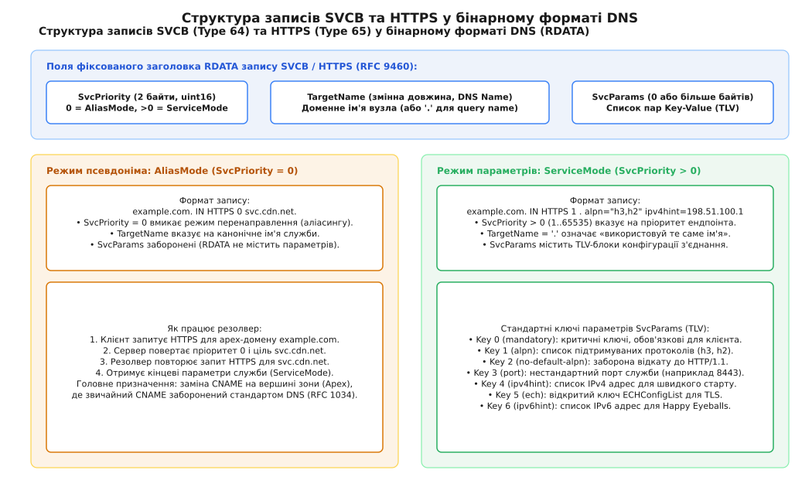
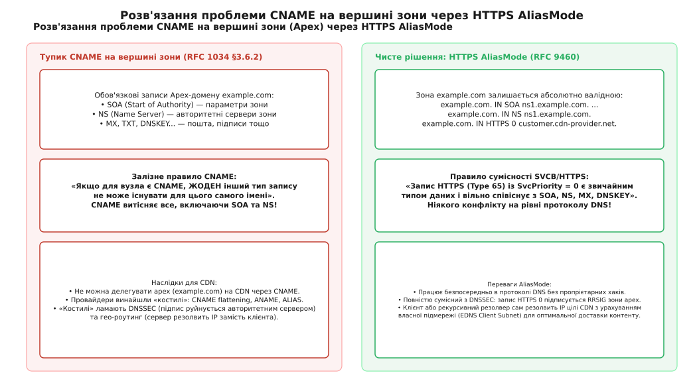
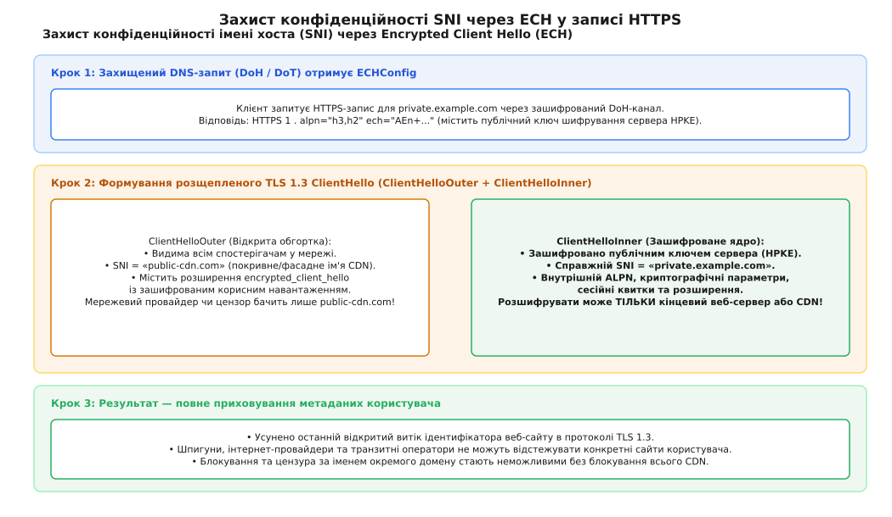
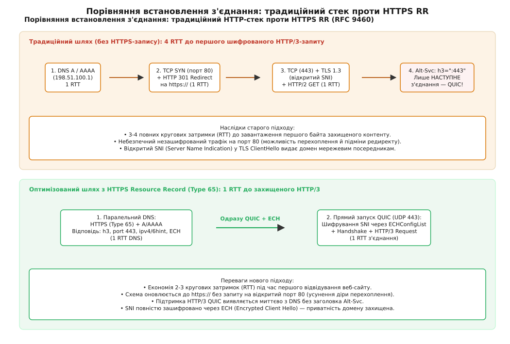

# Записи SVCB і HTTPS: параметри служби в одній відповіді DNS

<preknowlist>
- [DHCP і DNS](root:com-transport/dhcp-dns) — структура DNS-повідомлення, ресурсні записи A та AAAA, рекурсивний пошук.
- [Записи DNS SRV і NAPTR](root:com-transport/dns-srv-naptr) — виявлення служб за пріоритетом і портом та причини, чому SRV не прижився у веб-браузерах.
- [HTTP/3 та QUIC](root:com-transport/http3-deployment-and-tuning) — мультиплексування потоків поверх UDP, транспортні параметри та заголовок Alt-Svc.
- [TLS Handshake](root:sf-security/tls-handshake) — встановлення шифрованого з'єднання, розширення ALPN та проблема відкритого SNI.
</preknowlist>

Коли веб-браузер намагається відкрити сайт `example.com`, він потрапляє у виснажливий ланцюг послідовних мережевих запитів. Традиційна система доменних імен (англ. *Domain Name System*, DNS) уміє відповідати лише IP-адресами через записи A та AAAA. Вона нічого не знає про те, який прикладний протокол підтримує сервер (застарілий HTTP/1.1, HTTP/2 чи сучасний HTTP/3 поверх QUIC), на якому порту запущено службу, чи вимагає сайт обов'язкового переходу на шифрований протокол HTTPS, і який відкритий ключ потрібен для захисту імені домену в протоколі TLS 1.3.

Щоб з'ясувати ці параметри, клієнт змушений діяти навпомацки. Спочатку він відкриває незахищене TCP-з'єднання на порт 80 (одна кругова затримка, RTT), відправляє запит HTTP GET і отримує відповідь із кодом `301 Moved Permanently` та заголовком перенаправлення на `https://` (ще одна затримка). Потім браузер відкриває нове TCP-з'єднання на порт 443 (третя затримка), виконує TLS-рукостискання, де передає доменне ім'я сайту відкритим текстом у полі SNI (четверта затримка), надсилає запит HTTP/2 і лише у відповіді знаходить заголовок `Alt-Svc: h3=":443"`. Тільки під час *наступного* підключення браузер нарешті зможе скористатися швидким протоколом QUIC.

Такий каскад витрачає від трьох до чотирьох кругових затримок (сотні мілісекунд на мобільних чи супутникових каналах), наражає користувача на перехоплення первинного незашифрованого HTTP-трафіку та розкриває імена відвідуваних ресурсів проміжним спостерігачам. До того ж оператори мереж доставки контенту (англ. *Content Delivery Network*, CDN) не можуть направити вершину доменної зони (`example.com`) на свої сервери через запис CNAME, оскільки стандарт DNS забороняє співіснування CNAME з обов'язковими записами зони SOA та NS.

Усі ці проблеми породжені однією причиною: класичний DNS відокремлює трансляцію імен від оголошення параметрів служби. Щоб усунути це обмеження, інженерний консорціум IETF у листопаді 2023 року затвердив стандарт RFC 9460, який ввів два нові типи ресурсних записів: узагальнений запис зв'язування служби **SVCB** (тип 64) та спеціалізований запис **HTTPS** (тип 65).

## Чому веб переріс класичний DNS

Фундаментальний конфлікт між веб-стеком і DNS полягає в різниці рівнів абстракції. Для протоколу IP комп'ютер у мережі визначається виключно числовою адресою. Але для сучасного вебу адреса — це лише точка входу до складної розподіленої інфраструктури, яка оперує версіями протоколів, контекстами безпеки, сертифікатами та політиками маршрутизації.

Спроби вирішити цю розбіжність робилися неодноразово, проте кожне попереднє рішення мало критичні вади, що завадили його повноцінній інтеграції у веб-браузери:

1. **Записи DNS SRV (RFC 2782).** Запис SRV успішно розв'язав проблему виявлення портів і пріоритетів для протоколів SIP та XMPP. Але веб-браузери відмовилися від SRV через конфлікт із моделлю походження (англ. *Same-Origin Policy*). Якщо користувач уводить `http://example.com/`, а SRV повертає нестандартний порт або інший хост, виникає плутанина: до якого домену прив'язувати куки (cookies) та дозволи безпеки? Крім того, SRV має жорсткий формат і не дозволяє передавати списки протоколів чи криптографічні ключі.
2. **Заголовок HTTP Alt-Svc (RFC 7838).** Заголовок альтернативних служб дозволяє серверу повідомити клієнту про наявність HTTP/3. Проте він надходить у відповіді HTTP, тобто вже *після* того, як клієнт витратив час на встановлення TCP- та TLS-з'єднань. Під час першого «холодного» візиту користувач не отримує жодного виграшу у швидкості.
3. **Тупик CNAME на вершині зони (RFC 1034 §3.6.2).** За стандартом DNS вузол із записом CNAME не може містити жодних інших типів записів. Але корінь домену (англ. *zone apex*, наприклад `example.com`) зобов'язаний містити записи SOA та NS. Тому спрямувати apex-домен на CDN через CNAME неможливо. Провайдери винайшли пропрієтарні трюки (CNAME Flattening, ALIAS), які ламають перевірку цифрових підписів DNSSEC і знищують географічну маршрутизацію запитів.

Про те, як індустрія сорок років шукала вихід із цих компромісів, детально розповідає [історія еволюції виявлення веб-служб від CNAME до RFC 9460](root:com-transport/svcb-https-records/hist-svcb-https-evolution.md).

Подолати ці обмеження вдалося лише завдяки створенню механізму, здатного передати повний набір параметрів з'єднання безпосередньо у першій відповіді DNS.

## Анатомія записів SVCB та HTTPS: один заголовок і два режими

Специфікація RFC 9460 визначає два споріднені типи ресурсних записів, зареєстровані в реєстрі IANA:

* **SVCB (Service Binding, тип 64, `0x0040`):** узагальнений тип для довільних прикладних служб. Він використовує префіксні схеми іменування (наприклад, `_8443._foo.example.com`), аналогічно до SRV, але з розширюваним набором параметрів.
* **HTTPS (тип 65, `0x0041`):** спеціалізована форма SVCB, розроблена спеціально для схем `http://` та `https://`. Вона запитується безпосередньо за доменним ім'ям (наприклад, `example.com`) без жодних префіксів із підкресленнями.

Обидва типи мають ідентичний внутрішній двійковий формат корисного навантаження (RDATA). Поле RDATA містить три ключові компоненти: числове поле пріоритету `SvcPriority`, доменне ім'я цілі `TargetName` та список параметрів `SvcParams`.

```
Структура RDATA на дроті (RFC 9460):
┌──────────────────────────────┬────────────────────────────────┬───────────────────────────┐
│ SvcPriority (2 байти uint16) │ TargetName (DNS Domain Name)   │ SvcParams (TLV-параметри) │
└──────────────────────────────┴────────────────────────────────┴───────────────────────────┘
```

Значення поля `SvcPriority` є головним перемикачем логіки роботи клієнта і розділяє поведінку запису на два взаємовиключні режими:


*Двійковий формат RDATA: нульовий пріоритет переводить клієнт у режим аліасингу (AliasMode), тоді як додатний пріоритет активує режим параметрів служби (ServiceMode) із передачею TLV-блоків.*

1. **Режим псевдоніма (`AliasMode`, коли `SvcPriority == 0`):** Запис працює як безпечний псевдонім (аліас), вказуючи, що служба розташована за іншим доменним іменем `TargetName`. У цьому режимі хвіст параметрів `SvcParams` зобов'язаний бути порожнім.
2. **Режим параметрів служби (`ServiceMode`, коли `SvcPriority > 0`):** Запис описує конкретну кінцеву точку (ендпоінт) служби. Число `SvcPriority` (від 1 до 65535) задає пріоритет ендпоінта: менше число означає вищу перевагу під час вибору цілі клієнтом. У цьому режимі `TargetName` вказує на ім'я хоста (або містить одну крапку `.`, що позначає поточне ім'я запиту), а поле `SvcParams` містить двійкові пари ключ-значення (TLV).

> 🔧 **Навіщо це.** Завдяки розділенню на два режими один і той самий тип запису одночасно вирішує задачу делегування домену на сторонній CDN (AliasMode) і задачу миттєвої оптимізації транспортного стеку (ServiceMode) без потреби створювати окремі несумісні розширення протоколу.

Повні таблиці двійкового кодування на дроті, правила розміщення полів та перелік типів даних зібрано у [довіднику параметрів записів SVCB та HTTPS](root:com-transport/svcb-https-records/api-svcb-https-params.md).

## Розв'язання глухого кута на вершині зони: AliasMode

Головною перешкодою для власників доменів понад тридцять років була неможливість спрямувати голий домен `example.com` на хмарний сервіс чи CDN без використання складних серверних перенаправлень або нестандартних DNS-милиць.

Режим `AliasMode` запису HTTPS повністю знімає це обмеження. Запис із нульовим пріоритетом має вигляд:

```text
example.com.  3600  IN  HTTPS  0  customer-site.cdn-provider.net.
```

На відміну від CNAME, запис типу HTTPS (Type 65) є звичайним ресурсним записом даних. Стандарт DNS забороняє співіснування тільки для типу CNAME, але не накладає жодних обмежень на інші типи. Тому запис `HTTPS 0` абсолютно легально і без конфліктів співіснує в одній зоні разом із записами `SOA`, `NS`, `MX`, `TXT` та криптографічними ключами `DNSKEY`.


*Зліва: CNAME на apex-домені руйнує обов'язкові записи SOA та NS. Справа: HTTPS AliasMode легально співіснує з усіма записами зони, дозволяючи рекурсивний перехід до цілі CDN.*

### Механіка роботи резолвера в AliasMode

Коли клієнт або рекурсивний резолвер обробляє запит до домену з псевдонімом:
1. Клієнт надсилає запит на запис типу HTTPS для `example.com`.
2. Авторитетний сервер повертає запис `HTTPS 0 customer-site.cdn-provider.net.` разом із підписом DNSSEC RRSIG.
3. Резолвер бачить `SvcPriority = 0` і виконує рекурсивний перехід: він надсилає новий запит на тип HTTPS та типи A/AAAA вже для цільового домену `customer-site.cdn-provider.net`.
4. Для цільового домену CDN повертає повноцінний запис `ServiceMode` (`SvcPriority > 0`) з параметрами з'єднання та IP-адресами найближчого датацентру.

Для захисту від нескінченних циклів аліасингу (`A -> B -> A`) стандарт RFC 9460 встановлює максимальну межу переходів: резолвер припиняє пошук і повертає помилку `SERVFAIL`, якщо ланцюжок аліасів перевищує **8 кроків**.

При цьому повністю зберігається ланцюг довіри **DNSSEC**: авторитетний сервер зони `example.com` підписує власний запис `HTTPS 0` статичним ключем зони в офлайн-режимі. Резолвер валідує підпис первинної зони, а потім незалежно валідує підписи цільової зони CDN. Крім того, оскільки кінцевий запит до CDN виконує рекурсивний резолвер клієнта, CDN отримує інформацію про підмережу користувача через розширення EDNS0 Client Subnet (ECS) і направляє його на географічно найближчий сервер.

### Кейс SaaS-інфраструктури та автоматична видача сертифікатів

Режим `AliasMode` став незамінним інструментом для мультидоменних хмарних платформ (SaaS, хостинг інтернет-магазинів або платформи статичних сайтів). Раніше, коли користувач хотів прив'язати власний apex-домен `mybrand.com` до платформи, йому доводилося або делегувати весь домен на DNS-сервери провайдера, або налаштовувати фіксовані A-записи на один спільний IP.

За допомогою `HTTPS 0` клієнт публікує один рядок `mybrand.com. IN HTTPS 0 saas-ingress.platform.com.`. Це забезпечує:
* **Автоматичну видачу сертифікатів TLS (ACME / Let's Encrypt):** Протоколи перевірки володіння доменом (HTTP-01 або TLS-ALPN-01) прозоро слідують за аліасом, дозволяючи платформі генерувати та оновлювати сертифікати без втручання користувача.
* **Миттєве перемикання трафіку при аваріях:** Платформа може змінити маршрутизацію або перевести тисячі клієнтських доменів на резервний кластер за секунди, оновивши записи на боці `saas-ingress.platform.com`, без необхідності змінювати зону `mybrand.com`.

### Порівняння поведінки CNAME, ALIAS-хаків та HTTPS AliasMode

Щоб побачити якісну різницю між підходами, зіставимо їхні ключові властивості:

| Властивість | Звичайний CNAME | Провайдерський ALIAS / ANAME | HTTPS AliasMode (RFC 9460) |
| :--- | :--- | :--- | :--- |
| **Дозволено на Apex-домені** | Ні (руйнує SOA та NS) | Так (через внутрішній резолвінг) | **Так** (стандартний тип даних) |
| **Сумісність із DNSSEC** | Так (на субдоменах) | **Ні** (динамічні IP ламають RRSIG) | **Так** (статичний підпис RRSIG) |
| **Збереження EDNS Client Subnet** | Так | **Ні** (бачить IP авторитетного DNS) | **Так** (резолвить клієнтський рекурсор) |
| **Підтримка на рівні стандартів** | RFC 1034 (1987) | Відсутня (пропрієтарні хаки) | **RFC 9460 (2023)** |
| **Передача параметрів протоколу** | Ні | Ні | **Так** (у кінцевому ServiceMode) |

## Параметри служби (ServiceMode): що саме повідомляє DNS

Коли `SvcPriority > 0`, запис містить конфігурацію для безпосереднього підключення до служби. Запис зони у текстовому форматі може виглядати так:

```text
example.com.  3600  IN  HTTPS  1  . (
                          alpn="h3,h2"
                          port=8443
                          ipv4hint=198.51.100.1,198.51.100.2
                          ipv6hint=2001:db8::1
                          ech="AEn+DQBFDgAgACA6+u7T...=="
                          )
```

Розглянемо кожне поле цього запису та його роль у процесі з'єднання.

### Цільове ім'я (`TargetName`)

Значення `.` (одна крапка) вказує, що цільовим хостом є саме те ім'я, для якого запитувався запис (`example.com`). Якщо служба винесена на окремий сервер, тут може бути вказано інше доменне ім'я (наприклад, `edge-01.example.com.`), для якого резолвер автоматично шукатиме IP-адреси.

### Узгодження протоколу (`alpn` та `no-default-alpn`)

Параметр `alpn` (ключ 1) містить список протоколів прикладного рівня (англ. *Application-Layer Protocol Negotiation*, RFC 7301), які підтримує сервер, у порядку спадання пріоритету: `h3` (HTTP/3 поверх QUIC), `h2` (HTTP/2 поверх TLS/TCP) тощо.

Побачивши у відповіді DNS ідентифікатор `h3`, браузер дізнається про доступність HTTP/3 **до відправки першого байта у мережу**. Йому більше не потрібно чекати заголовка `Alt-Svc` від HTTP/2 сервера: браузер може негайно ініціалізувати QUIC-з'єднання через сокет UDP.

Параметр-прапорець `no-default-alpn` (ключ 2, нульова довжина) вказує, що сервер відмовляється від застарілих протоколів за замовчуванням (`http/1.1`). Якщо клієнт не вміє працювати з переліченими в `alpn` протоколами, він зобов'язаний розірвати спробу підключення, що запобігає атакам примусового зниження версії (downgrade attacks).

### Нестандартний порт (`port`)

Параметр `port` (ключ 3, 2 байти uint16) дозволяє повідомити клієнту, що веб-служба слухає на нестандартному порту (наприклад, `8443`). При цьому в адресному рядку браузера користувач бачить чистий URL `https://example.com/` без дратівливого суфікса `:8443`, а контекст безпеки Origin залишається канонічним.

### Адресні підказки (`ipv4hint` та `ipv6hint`)

Параметри `ipv4hint` (ключ 4) та `ipv6hint` (ключ 6) містять масиви сирих IP-адрес сервера.

Це критична оптимізація для алгоритму **Happy Eyeballs v2** (RFC 8305): клієнту не потрібно чекати завершення окремих DNS-запитів на типи A та AAAA. Отримавши запис HTTPS, він одразу витягує IP-адреси з підказок і паралельно запускає підключення до IPv6 та IPv4 адрес. Окремі запити A/AAAA виконуються фоном виключно для оновлення системного кешу DNS.

### Критичні ключі (`mandatory`)

Параметр `mandatory` (ключ 0) містить перелік числових ідентифікаторів інших ключів, які є критично важливими для цього з'єднання. Якщо сервер додав новий обов'язковий параметр, який клієнт не підтримує (наприклад, майбутній квантово-стійкий протокол), клієнт зобов'язаний пропустити цей запис `ServiceMode` і перейти до наступного за пріоритетом.

### Співіснування з заголовками Alt-Svc у рантаймі (RFC 9460 §9.6)

У практичній експлуатації виникає питання: як співвідносяться параметри протоколу із запису DNS HTTPS та динамічні заголовки `Alt-Svc`, отримані від сервера під час активної сесії?

Стандарт RFC 9460 §9.6 встановлює чітку ієрархію:
1. **Ініціалізація (Bootstrap):** Запис HTTPS є авторитетним джерелом для початкового запуску з'єднання (cold start), визначаючи протокол за замовчуванням та адресу першого підключення.
2. **Динамічне перенаправлення (Runtime Steering):** Якщо під час сесії сервер повертає заголовок `Alt-Svc: h3="backup.example.com:443"; ma=3600`, клієнт використовує цю альтернативну службу для наступних HTTP-запитів, оскільки сервер може динамічно розподіляти навантаження на основі поточної завантаженості конкретних вузлів без очікування закінчення DNS TTL.
3. **Пріоритет безпеки:** Заголовок `Alt-Svc` не може послабити політики безпеки, оголошені в DNS (наприклад, скасувати шифрування ECH або обійти обмеження `no-default-alpn`).

## Приховування домену: Encrypted Client Hello (ECH)

Найбільшим криптографічним проривом, інтегрованим у записи HTTPS, стала підтримка розширення **ECH** (англ. *Encrypted Client Hello*, RFC 9460 §10).

У попередніх версіях протоколу TLS, включно з базовим TLS 1.3, перше повідомлення клієнта `ClientHello` передавалося відкрито. Воно містило розширення SNI (англ. *Server Name Indication* — індикація імені сервера), яке повідомляло веб-серверу, сертифікат якого саме сайту запитує браузер. Через це будь-який пасивний спостерігач у мережі (інтернет-провайдер, оператор Wi-Fi або державна система фільтрації) міг точно бачити, які саме сайти відвідує користувач, навіть якщо подальший трафік був зашифрований.

ECH вирішує цю проблему шляхом розщеплення привітання клієнта на дві частини:
1. **`ClientHelloOuter` (відкрита зовнішня обгортка):** містить безпечне фасадне ім'я CDN (покривне ім'я, англ. *public cover name*, наприклад `cloudflare.com`), видиме для всіх зовнішніх спостерігачів.
2. **`ClientHelloInner` (зашифроване внутрішнє ядро):** містить справжнє приватне доменне ім'я сайту (`secret.example.com`), список ALPN та криптографічні параметри. Воно шифрується за допомогою алгоритму HPKE (англ. *Hybrid Public Key Encryption*, RFC 9180) за відкритим ключем веб-сервера.


*Клієнт отримує відкритий ключ сервера у параметрі `ech` запису HTTPS, шифрує справжній SNI усередині `ClientHelloInner` і ховає його за публічним покривним доменом у `ClientHelloOuter`.*

Щоб зашифрувати `ClientHelloInner`, клієнт повинен знати відкритий ключ сервера ще до надсилання першого пакета. Запис HTTPS передає цей ключ у параметрі `ech` (ключ 5) у вигляді структури `ECHConfigList`.

### Внутрішня архітектура HPKE та захист від аналізу довжини (Padding)

Криптографічний захист ECH базується на стандарті HPKE (RFC 9180), який комбінує асиметричну схему інкапсуляції ключів (KEM, зазвичай `DHKEM(X25519, HKDF-SHA256)`), функцію деривації ключів (KDF, `HKDF-SHA256`) та автентифіковане шифрування з додатковими даними (AEAD, `AES-128-GCM` або `ChaCha20-Poly1305`).

Крім шифрування самого імені, ECH усуває витік інформації через розмір пакета (англ. *traffic analysis*). Якщо домен `a.com` має довжину 5 символів, а `very-long-secret-portal.com` — 28 символів, спостерігач міг би вгадати сайт за довжиною зашифрованого блоку. Щоб нівелювати цю загрозу, структура `ECHConfig` містить поле `maximum_name_length`. Клієнт автоматично доповнює (padding) `ClientHelloInner` нульовими байтами до максимальної довжини, роблячи всі зашифровані привітання однаковими за розміром.

### Ротація ключів та механізм `retry_configs`

Веб-сервери та CDN періодично змінюють свої приватні ключі ECH (наприклад, щогодини). Якщо клієнт скористався застарілим кешованим записом DNS, він надішле `ClientHelloInner`, зашифрований старим ключем.

У такому разі сервер:
1. Не відхиляє з'єднання помилкою, а завершує TLS-рукостискання для відкритого покривного імені `ClientHelloOuter`.
2. У розширенні `encrypted_client_hello` повідомлення `EncryptedExtensions` сервер повертає актуальну структуру `retry_configs` із новими публічними ключами.
3. Клієнт прозоро для користувача перешифровує `ClientHelloInner` новим ключем і негайно повторює запит без повторного запиту до DNS.

## Стискання затримок: злиття редиректу та миттєвий HTTP/3

Інтеграція параметрів служби в DNS дозволяє радикально скоротити час встановлення з'єднання за рахунок двох фундаментальних оптимізацій: неявного оновлення схеми та випереджального запуску QUIC.

### Неявне оновлення схеми (Scheme Upgrade)

Коли користувач вводить в адресному рядку браузера голий домен `example.com`, браузер за замовчуванням формує URL зі схемою `http://example.com/`. Раніше це неминуче призводило до відправки незахищеного HTTP-запиту на порт 80 для отримання редиректу на HTTPS.

Розділ 9.5 RFC 9460 вводить механізм **автоматичного оновлення схеми**: якщо для домену існує будь-який валідний запис типу HTTPS (у режимі AliasMode або ServiceMode), клієнт зобов'язаний автоматично підвищити схему до `https://` і вважати порт за замовчуванням рівним 443.

Браузер взагалі не відкриває TCP-з'єднання на порт 80 і не робить відкритих HTTP-запитів. Це економить щонайменше 2 RTT і повністю блокує атаки типу SSL-Stripping, коли зловмисник у локальній мережі перехоплює первинний редирект 301.

### Миттєвий старт HTTP/3

Завдяки наявності параметра `alpn="h3"` та адресних підказок `ipv4hint`/`ipv6hint`, клієнт одразу надсилає пакет `QUIC Initial` через UDP на порт 443.


*Традиційний шлях вимагає до 4 кругових затримок (RTT) до першого шифрованого HTTP/3-запиту. Оптимізований шлях із записом HTTPS досягає тієї самої мети за 1 RTT із повним шифруванням SNI.*

Порівняймо баланс затримок для першого відвідування сайту:

```
Традиційний стек (без HTTPS RR):
1. DNS A/AAAA lookup                       ──> 1 RTT
2. TCP SYN (порт 80) + HTTP 301 Redirect   ──> 1 RTT
3. TCP SYN (порт 443) + TLS 1.3 Handshake  ──> 1 RTT
4. HTTP/2 GET + відповідь Alt-Svc: h3      ──> 1 RTT
Разом до виявлення HTTP/3: 4 RTT (наприклад, 400 мс при RTT = 100 мс).

Стек із записом HTTPS (RFC 9460):
1. DNS HTTPS + A/AAAA (паралельно)         ──> 1 RTT (отримано h3, IP-підказки та ключ ECH)
2. QUIC Handshake + ECH + HTTP/3 Request   ──> 1 RTT
Разом до отримання перших даних HTTP/3: 2 RTT (200 мс).
Економія: 2 повні кругові затримки та 100% захист метаданих!
```

Якщо ж клієнт раніше вже взаємодіяв із цим сервером і має збережений сесійний квиток (session ticket), протокол QUIC дозволяє відправити HTTP-запит у режимі **0-RTT** (Early Data) у першому ж пакеті разом із зашифрованим через ECH привітанням.

## Алгоритм вибору ендпоінтів та Happy Eyeballs

Сучасний клієнт (наприклад, мережевий рушій Chromium чи Apple URLSession) під час отримання відповіді DNS реалізує комплексний алгоритм побудови черги з'єднань:

```
1. Отримання відповіді DNS:
   - Якщо знайдено AliasMode (пріоритет 0): перейти до TargetName (до 8 разів).
   - Якщо знайдено ServiceMode: згрупувати записи за зростанням SvcPriority.

2. Формування пулу кандидатів у межах найменшого SvcPriority:
   - Взяти перетин серверного ALPN та підтримуваних клієнтом протоколів (h3, h2).
   - Якщо no-default-alpn встановлено і перетин порожній -> відкинути запис.
   - Зіставити IP-адреси: скомбінувати ipv6hint / ipv4hint із результатами запитів AAAA / A.

3. Ініціалізація з'єднання за алгоритмом Happy Eyeballs v2 (RFC 8305):
   - Пріоритет 1: спроба QUIC (h3) по IPv6.
   - Затримка таймера 250 мс: якщо з'єднання не встановлено -> паралельна спроба QUIC (h3) по IPv4.
   - Якщо UDP заблоковано (ICMP Port Unreachable або таймаут) -> паралельний відкат до TCP/TLS (h2).
   - Якщо весь поточний пріоритет недоступний -> перехід до наступного SvcPriority.
```

Такий підхід забезпечує максимальну стійкість: користувач отримує найшвидший доступний протокол без ризику зависання пристрою у разі локальних блокувань UDP-трафіку.

## Простеження живого обміну через системні утиліти

Щоб побачити, як записи HTTPS виглядають у реальній мережі, виконаємо запит до одного з тестових серверів ECH за допомогою утиліти `dig`:

```bash
dig +yaml HTTPS crypto.cloudflare.com
```

У відповіді авторитетного сервера DNS повертається структурований набір полів:

```yaml
- type: HTTPS
  name: crypto.cloudflare.com.
  class: IN
  ttl: 300
  rdata:
    priority: 1
    target: .
    params:
      alpn: ["h3", "h2"]
      ipv4hint: ["162.159.137.85", "162.159.138.85"]
      ipv6hint: ["2606:4700:7::a29f:8955", "2606:4700:7::a29f:8a55"]
      ech: "AEn+DQBFDQAQACA6+u7TU2j6s0v4L...=="
```

Коли клієнтська бібліотека (наприклад `curl` версії 8.4+ з підтримкою ECH) виконує запит:

```bash
curl --ech exact --http3 https://crypto.cloudflare.com/cdn-cgi/trace
```

У мережевому дампі `tcpdump` можна спостерігати таку послідовність дій:
1. Клієнт надсилає DoH-запит на `HTTPS crypto.cloudflare.com` та одразу отримує відкритий ключ ECH і список IP-адрес.
2. Клієнт формує UDP-пакет `QUIC Initial` безпосередньо на адресу `2606:4700:7::a29f:8955:443`.
3. У полі SNI відкритого заголовка передається фасадне ім'я `cloudflare.com`.
4. Справжнє ім'я `crypto.cloudflare.com` надійно сховане всередині зашифрованого розширення ECH.
5. Сервер розшифровує привітання, підтверджує протокол `h3` і повертає контент за 1 RTT без жодного відкритого витоку метаданих.

## Архітектура CDN та мультипровайдерне балансування

Для великих веб-сервісів та CDN-платформ записи SVCB та HTTPS відкрили принципово нові можливості архітектурного масштабування:

* **Фронтальні та бекенд-проксі (CFS / Backend Origin):** На межі мережі CDN розгортаються сервери Client-Facing Server (CFS), які обслуговують відкриті покривні імена ECH та приймають з'єднання QUIC/TLS. Після розшифрування ECH запит прозоро перенаправляється до внутрішнього бекенду (Origin), де зберігається приватний сертифікат сайту.
* **Мультипровайдерне балансування (Multi-CDN):** Адміністратор може опублікувати декілька записів HTTPS із різними значеннями `SvcPriority` або однаковими пріоритетами, делегуючи трафік одночасно на Cloudflare, Fastly та AWS CloudFront. Клієнти автоматично рандомізують вибір у межах одного пріоритету та миттєво переходять на резервний CDN у разі аварії, без очікування оновлення записів DNS зони.
* **Уніфікація майбутніх протоколів:** Запис SVCB (Type 64) вже сьогодні стандартизовано для роботи протоколів DNS-over-QUIC (`doq`), DNS-over-HTTPS (`dohpath`, RFC 9461), а також тунелів WebRTC та корпоративних протоколів доступу.

## Практична реалізація та інтеграція в клієнти

Розбір двійкового формату SVCB та HTTPS вимагає ретельної перевірки меж буферів, правильного декодування доменних імен без стиснення та суворого контролю порядку ключів.

Детальний приклад реалізації автономного розбирача RDATA з обробкою всіх типів помилок та побудовою плану з'єднань наведено у практичній вставці [розбір двійкового формату записів SVCB та HTTPS на C і C++](root:com-transport/svcb-https-records/proj-svcb-parser.md).

Сьогодні підтримка записів HTTPS інтегрована у всі провідні клієнтські та серверні системи:
* **Браузери:** Chromium (з версії 85+), Apple Safari (iOS 14+, macOS 11+) та Mozilla Firefox (з версії 92+) виконують випереджальні запити HTTPS-записів під час кожного введення URL в адресному рядку.
* **Операційні системи:** Мережеві стеки Apple Network.framework та Windows 11 DNS Client автоматично запитують тип 65 під час резолвінгу веб-хостів.
* **Утиліти командного рядка:** Починаючи з версії 7.88.0, утиліта `curl` підтримує опцію `--ech` та автоматично використовує записи HTTPS для виявлення параметрів ECH та HTTP/3 через системний або DoH-резолвер.
* **Авторитетні DNS-сервери:** BIND (з версії 9.18+), Knot DNS (3.1+), PowerDNS Authoritative (4.7+) та NSD (4.3+) нативно підтримують типи 64 і 65 у синтаксисі файлів зон та вміють автоматично додавати адресні записи цільового хоста у додаткову секцію (Additional Section) відповіді.

## Безпека, DNSSEC та стійкість до блокувань

Оскільки записи SVCB та HTTPS несуть критичні параметри безпеки, вони змінюють вимоги до довіри системі DNS.

Якщо резолвер використовує звичайний незашифрований протокол DNS через UDP (порт 53), зловмисник у локальній мережі може легко перехопити пакет і видалити запис HTTPS із відповіді. У такому разі браузер не дізнається про наявність ECH або HTTP/3 і буде змушений відкотитися до звичайного HTTP/2 з відкритим передаванням SNI.

Щоб запобігти таким атакам зниження захисту (англ. *downgrade attacks*):
1. **Обов'язкова валідація DNSSEC:** Якщо доменна зона підписана за допомогою DNSSEC, видалення або підміна запису HTTPS призведе до невалідності підпису RRSIG і резолвер заблокує відповідь із помилкою `SERVFAIL`.
2. **Захищений транспорт DNS (DoH / DoT / DoQ):** Використання DNS поверх HTTPS (RFC 8484) або DNS поверх TLS (RFC 7858) захищає сам канал доставки відповідей від авторитетних серверів до клієнта, унеможливлюючи модифікацію параметрів посередниками.

Завдяки стандарту RFC 9460 система DNS перестала бути просто пасивною «телефонною книгою» адрес і перетворилася на повноцінний криптографічно захищений рівень узгодження параметрів прикладних служб, заклавши основу для швидкого, безпечного та приватного інтернету наступного покоління.
