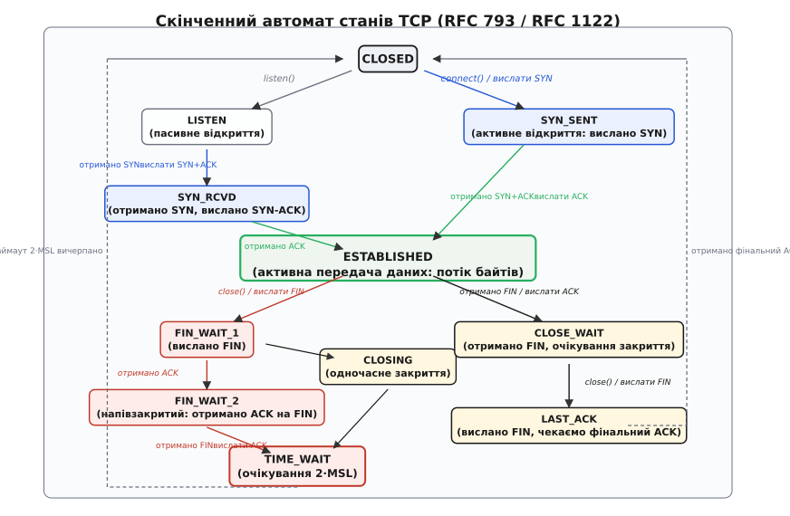
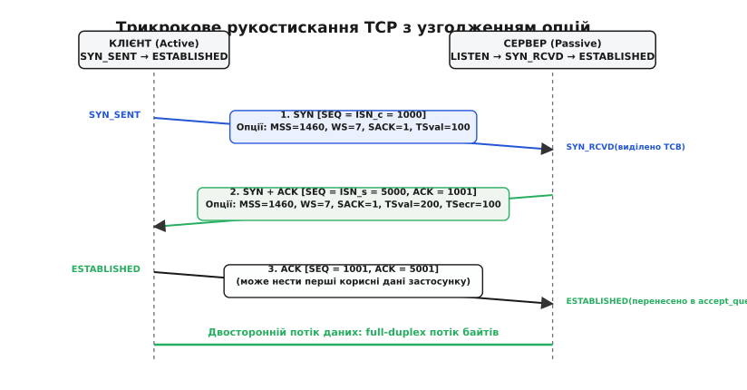
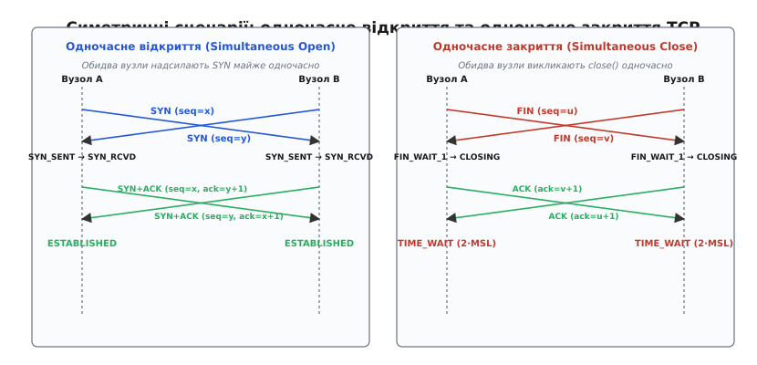
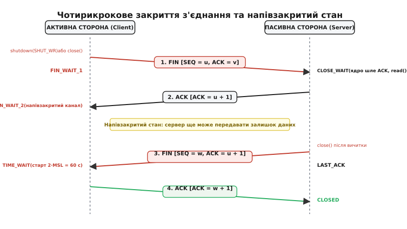
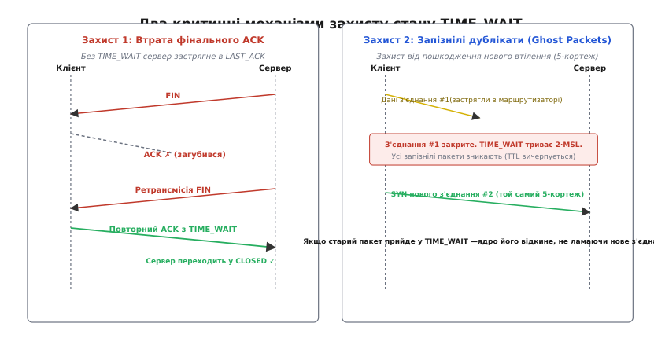

# Життєвий цикл TCP-з'єднання: встановлення, напівзакриття, TIME_WAIT

<preknowlist>
- [TCP проти UDP: надійність чи швидкість](root:com-transport/tcp-vs-udp) — фундаментальна різниця між орієнтованим на з'єднання потоком та незалежними датаграмами.
- [Ковзне вікно та ARQ](root:com-transport/sliding-window-sizing-bdp) — механізм підтвердження доставки, керування потоком і буферизація.
- [Нумерація послідовностей](root:com-transport/sequence-numbering) — відлік байтів у потоці, колізії номерів і простір 32-бітних чисел.
</preknowlist>

У комп'ютерних мережах із комутацією пакетів протокол IP не надає жодних гарантій своєчасності доставки, збереження первинного порядку чи цілісності послідовності датаграм. Окремі пакети можуть затримуватися в буферах маршрутизаторів на десятки секунд, дублюватися на проміжних вузлах або долати мережу різними фізичними маршрутами. Якщо два комп'ютери просто почнуть передавати байти без попереднього узгодження, отримувач не матиме точки відліку для виявлення пропущених фрагментів, буфери ядра переповняться, а старі пакети від попередніх закритих програм пошкодять дані нового сеансу.

Для перетворення ненадійного середовища доставки дейтаграм на надійний двосторонній байтовий потік протокол TCP (*Transmission Control Protocol*, лат. *transmissio* — передавання) реалізує суворий **скінченний автомат станів** (FSM, *Finite State Machine*, лат. *status* — положення). Цей автомат фіксує кожен крок існування з'єднання — від синхронізації початкових номерів послідовностей і динамічного узгодження розмірів буферів до штатного напівзакриття каналів і захисного карантину адрес після розриву зв'язку.

## 1. Скінченний автомат станів TCP (11 станів FSM)

Специфікації RFC 793 та RFC 1122 визначають одинадцять взаємовиключних станів, у яких може перебувати кінцева точка TCP-з'єднання (структура `struct sock` у ядрі операційної системи). Кожен перехід між станами відбувається виключно у відповідь на зовнішні події: виклик системної функції прикладним процесом (`connect()`, `listen()`, `close()`, `shutdown()`), надходження мережевого сегмента з певними прапорцями (`SYN`, `ACK`, `FIN`, `RST`) або спрацювання внутрішнього таймера ядра.


*Граф станів скінченного автомата TCP (RFC 793, RFC 1122) із розділенням фаз відкриття, передачі даних та закриття.*

Автомат станів чітко розмежовує роль активного вузла (клієнта, який ініціює контакт) та пасивного вузла (сервера, який очікує вхідних запитів).

- **`CLOSED`**: Початковий фіктивний стан. Сокета не існує в таблиці активних з'єднань, або йому ще не виділено структуру блоку керування передачею (*Transmission Control Block*, TCB).
- **`LISTEN`**: Пасивний стан сервера після виконання системного виклику `listen()`. Сокет готовий приймати запити на відкриття з'єднання на прив'язаному порту.
- **`SYN_SENT`**: Активний стан клієнта після виклику `connect()`. Клієнт надіслав пакет `SYN` і чекає на підтвердження та зустрічний запит від сервера.
- **`SYN_RCVD`**: Проміжний стан сервера. Отримано запит `SYN`, виділено попередню структуру TCB, відправлено відповідь `SYN-ACK`, очікується фінальний `ACK` клієнта.
- **`ESTABLISHED`**: Робочий стан повноцінного двостороннього зв'язку (*full-duplex*). Обидва напрямки потоку синхронізовано, застосунки передають корисні дані викликами `read()` та `write()`.
- **`FIN_WAIT_1`**: Перша фаза активного закриття. Процес викликав `close()` або `shutdown(SHUT_WR)`, ядро надіслало пакет `FIN` і чекає на `ACK`.
- **`FIN_WAIT_2`**: Друга фаза активного закриття (напівзакритий стан). Отримано `ACK` на власний `FIN`. Вихідний канал закрито, але вхідний канал залишається відкритим — вузол очікує `FIN` від партнера.
- **`CLOSE_WAIT`**: Пасивний стан очікування закриття. Вузол отримав `FIN` від партнера, ядро автоматично відповіло `ACK`, а локальний процес сповіщено про кінець вхідного потоку (виклик `read()` повертає `0`). Вузол може продовжувати відправку залишку даних.
- **`CLOSING`**: Рідкісний стан одночасного закриття. Обидві сторони надіслали `FIN` майже одночасно й отримали чужий `FIN` до надходження квитанції `ACK` на власний запит.
- **`LAST_ACK`**: Фінальна фаза пасивного закриття. Застосунок на стороні `CLOSE_WAIT` завершив передачу залишку даних і викликав `close()`. Ядро відправило власний `FIN` і чекає фінальний `ACK`.
- **`TIME_WAIT`**: Захисний стан очікування після активного закриття. Обидві сторони обмінялися `FIN`, але ініціатор утримує 5-кортеж сокета заблокованим протягом подвійного максимального часу життя сегмента (`2·MSL`) для очищення мережі від запізнілих пакетів.

---

## 2. Трьохетапне рукостискання (Three-Way Handshake)

З'єднання починається з процедури трьохетапного рукостискання (англ. *handshake*). Головне завдання цієї фази — синхронізувати початкові номери послідовностей (ISN) обох хостів, перевірити двосторонню досяжність вузлів та узгодити розширені параметри зв'язку.


*Послідовність трикрокового рукостискання, генерація початкових номерів послідовностей (ISN) та узгодження параметрів заголовка.*

Послідовність кроків виконується за строго детермінованим алгоритмом:

1. **Крок 1: Клієнт надсилає `SYN` (`SYN_SENT`)**  
   Клієнтський процес викликає `connect()`. Ядро операційної системи генерує 32-бітний початковий номер послідовності `ISN_c` (наприклад, `1000`) і формує сегмент із встановленим прапорцем `SYN` (*Synchronize*), полем `Sequence Number = 1000` та набором опцій у заголовку. Пакет `SYN` не несе корисних даних застосунку, проте за протоколом споживає рівно один номер послідовності.
2. **Крок 2: Сервер відповідає `SYN-ACK` (`SYN_RCVD`)**  
   Серверний сокет, перебуваючи в стані `LISTEN`, отримує пакет `SYN`. Ядро створює запис у черзі напіввідкритих з'єднань (`syn_backlog`), генерує власний незалежний номер послідовності `ISN_s` (наприклад, `5000`) і надсилає відповідь із прапорцями `SYN` та `ACK` (*Acknowledgment*, лат. *recognitio* — визнання). У цьому сегменті поле `Sequence Number = 5000`, а поле `Acknowledgment Number = 1001` (`ISN_c + 1`), що однозначно підтверджує отримання запиту клієнта.
3. **Крок 3: Клієнт надсилає `ACK` (`ESTABLISHED`)**  
   Клієнт отримує `SYN-ACK`. Оскільки номер підтвердження збігається з `ISN_c + 1`, клієнт переконується, що сервер відповідає саме на його запит. Клієнт переводить сокет у стан `ESTABLISHED` і відправляє сегмент із прапорцем `ACK`, де `Sequence Number = 1001`, а `Acknowledgment Number = 5001` (`ISN_s + 1`). Цей третій пакет уже може містити перші корисні дані прикладного рівня (наприклад, початковий запит HTTP).
4. **Завершення на сервері**  
   Отримавши фінальний `ACK`, сервер переводить з'єднання в стан `ESTABLISHED`, вилучає його з `syn_backlog` і переносить у чергу повністю готових з'єднань (`accept_queue`). Системний виклик `accept()` повертає процес-серверу новий файловий дескриптор для роботи з цим клієнтом.

Чому для надійної синхронізації обов'язково потрібні три пакети, а двокликова схема зазнає неминучого краху через запізнілі дублікати, детально показано у вставці про [трикрокове рукостискання](root:com-transport/tcp-connection-lifecycle/hist-three-way-handshake.md).

### Генерація початкових номерів послідовності (ISN)

Початковий номер послідовності не може бути константою (наприклад, нулем) чи простим лінійним лічильником, що скидається при перезавантаженні. Якби два послідовні з'єднання між тими самими IP-адресами та портами починалися з однакових `ISN`, запізнілі сегменти від попередньої закритої сесії були б прийняті новим з'єднанням як легітимні свіжі дані.

Ба більше, прості лінійні генератори ISN відкривали можливість атак спуфінгу (*IP Spoofing*): зловмисник міг наосліп вгадати `ISN_s` сервера, надіслати підроблений `SYN` від імені довіреного вузла, підтвердити його сліпим `ACK` і виконати неавторизовані команди.

Сучасні операційні системи формують ISN за стандартом RFC 6528, комбінуючи апаратний мікросекундний таймер та криптографічний геш (SipHash) від 4-кортежу сокета із секретним ключем ядра:

```
ISN = (Час_мкс) + SipHash(src_ip, src_port, dst_ip, dst_port, Secret_Key) (mod 2³²)
```

Це гарантує, що для стороннього спостерігача значення ISN виглядають абсолютно випадковими, але для кожного конкретного з'єднання вони монотонно зростають у часі, унеможливлюючи перетин просторів нумерації.

### Одночасне відкриття (Simultaneous Open)

У розподілених peer-to-peer мережах можлива ситуація, коли два вузли одночасно викликають `connect()` на адреси один одного. Обидва вузли надсилають пакети `SYN` і переходять зі стану `CLOSED` у `SYN_SENT`.


*Рідкісні симетричні переходи скінченного автомата: одночасне відкриття через SYN_RCVD та одночасне закриття через стан CLOSING.*

Коли вузол у стані `SYN_SENT` замість очікуваного `SYN-ACK` отримує зустрічний чистий `SYN`, він розуміє, що відбувається одночасне відкриття. Вузол переходить у стан `SYN_RCVD` і відправляє у відповідь `SYN-ACK`. Отримавши зустрічний `SYN-ACK`, обидва вузли переходять у стан `ESTABLISHED`. З'єднання успішно відкривається за чотири сегменти без жодних конфліктів чи дублювання ресурсів.

### Захист від атак вичерпання черги: SYN-Cookies (RFC 4987)

Під час трьохетапного рукостискання сервер перебуває у вразливому стані `SYN_RCVD`: отримавши `SYN`, ядро алокує повноцінну структуру TCB у пам'яті та утримує її в черзі `syn_backlog`, очікуючи на фінальний `ACK` клієнта. Зловмисник може надіслати мільйони підроблених пакетів `SYN` із неіснуючих IP-адрес (атака SYN-Flood). Сервер виділяє пам'ять, відправляє пакети `SYN-ACK` у порожнечу і швидко вичерпує чергу напіввідкритих з'єднань, після чого починає відкидати запити легітимних клієнтів.

Для захисту від цієї загрози Ден Бернштайн (*Daniel J. Bernstein*) та Ерік Шенк (*Eric Schenk*) розробили механізм **SYN Cookies** (параметр `net.ipv4.tcp_syncookies = 1`). При переповненні черги `syn_backlog` ядро повністю припиняє виділяти пам'ять під структуру TCB для нових пакетів `SYN`. Натомість ядро кодує всю інформацію про параметри з'єднання безпосередньо всередині 32-бітного початкового номера послідовності `ISN_s`:

```
ISN_s = [ 5 бітів: дискретний час (t mod 32) ]
      + [ 3 біти: індекс таблиці MSS ]
      + [ 24 біти: криптографічний геш SipHash(src_ip, src_port, dst_ip, dst_port, t, Secret) ]
```

Сервер відправляє цей сконструйований `SYN-ACK` і миттєво забуває про клієнта, не витрачаючи жодного байта оперативної пам'яті. Коли легітимний клієнт надсилає у відповідь фінальний `ACK` із полем `Acknowledgment Number = ISN_s + 1`, сервер віднімає одиницю, вилучає поля, верифікує криптографічний геш за поточним часом `t`, розпаковує погоджений MSS і лише тепер створює повноцінну структуру сокета в стані `ESTABLISHED`. Якщо ж клієнт був фальшивим, жодного `ACK` не надійде, а сервер не витратить жодних ресурсів.

---

## 3. Узгодження параметрів та розширення заголовка (TCP Options)

Стандартний заголовок TCP має фіксовану довжину 20 байтів. Проте поле `Data Offset` (4 біти) дозволяє розширювати розмір заголовка до 60 байтів за рахунок блоку **опцій TCP** (*TCP Options*). Опції узгоджуються виключно під час трьохетапного рукостискання (у сегментах `SYN` та `SYN-ACK`). Якщо опцію не було запропоновано або підтверджено в рукостисканні, вона не може використовуватися під час передачі даних.

```
+---------------+---------------+---------------------------------------+
|  Kind (1 байт)| Length (1 байт)|         Дані опції (Length - 2)       |
+---------------+---------------+---------------------------------------+
```

### Основні опції життєвого циклу

1. **MSS (Maximum Segment Size, Опція 2, 4 байти):**  
   Повідомляє партнеру максимальний обсяг корисних даних застосунку (без урахування заголовків TCP та IP), який вузол здатний прийняти в одному сегменті. Зазвичай MSS розраховується на основі MTU інтерфейсу: для стандартного Ethernet (`MTU = 1500` байтів) значення `MSS = 1500 - 20 (IP) - 20 (TCP) = 1460` байтів. Узгодження MSS запобігає фрагментації пакетів на мережевому рівні IP.
2. **Window Scale (WSopt, Опція 3, 3 байти, RFC 7323):**  
   Класичне поле розміру вікна в заголовку TCP має довжину 16 бітів і обмежене значенням `65 535` байтів (64 КБ). Для високошвидкісних каналів зв'язку з великим добутком пропускної здатності на затримку (BDP, *Bandwidth-Delay Product*) 64 КБ є вузьким місцем, що не дозволяє утилізувати гігабітні канали. Опція Window Scale задає логарифмічний коефіцієнт зсуву `S ∈ [0..14]`, множачи значення вікна на `2ˢ`. Це дозволяє масштабувати вікно прийому до `65 535 × 2¹⁴ ≈ 1` ГБ.
3. **SACK Permitted (Опція 4, 2 байти, RFC 2018):**  
   Прапорець дозволу вибіркового підтвердження (*Selective Acknowledgment*). Дозволяє отримувачу інформувати відправника про окремі ізольовані блоки байтів, які були успішно прийняті за межами пропущеного фрагмента. Це усуває необхідність повторної передачі всього вікна даних за протоколом Go-Back-N.
4. **TCP Timestamps (TSopt, Опція 8, 10 байтів, RFC 7323):**  
   Містить два 32-бітних поля: значення мітки часу відправника `TSval` (*Timestamp Value*) та ехо-відповідь останньої отриманої мітки від партнера `TSecr` (*Timestamp Echo Reply*). Використовується для двох критичних задач:
   - **Точне вимірювання RTT:** Дозволяє розраховувати час кругового обігу пакетів для кожного окремого сегмента без додаткових службових опитувань.
   - **Алгоритм PAWS (Protection Against Wrapped Sequences):** У 10-гігабітних мережах 32-бітний лічильник послідовностей обертається за кілька секунд. Алгоритм PAWS порівнює поля `TSval` сегментів: якщо номер послідовності повторився, але мітка часу старіша за поточну, ядро відкидає такий пакет як запізнілий фантом попереднього кола.

---

## 4. Фаза активної передачі даних (ESTABLISHED)

Перебуваючи в стані `ESTABLISHED`, протокол TCP забезпечує надійний, повнодуплексний потік байтів без збереження меж повідомлень. Застосунок записує байти довільними порціями через `write()`, а ядро самостійно агрегує їх у сегменти розміром до MSS.

Надійність передачі спирається на три взаємопов'язані механізми:

1. **Накопичувальні квитанції (Cumulative ACK):** Номер підтвердження `ACK` завжди вказує на номер **наступного очікуваного байта**. Якщо вузол передав квитанцію `ACK = 5000`, це є суворою гарантією того, що всі байти з номерами від `0` до `4999` включно прийняті, перевірені за контрольною сумою та розміщені в буфері прийому.
2. **Попутні підтвердження (Piggybacking):** Прапорець `ACK` виставлений практично в кожному пакеті фази передачі даних. Якщо вузол передає корисні дані у зворотному напрямку, він не генерує окремий службовий пакет для підтвердження, а вкладає актуальне значення `ACK` безпосередньо в заголовок сегмента з даними.
3. **Керування потоком і перевантаженням:** Стан `ESTABLISHED` безперервно адаптує швидкість передачі під можливості приймача (вікно прийому `rcv_wnd`) та стан проміжних маршрутизаторів мережі (вікно перевантаження `cwnd`), динамічно регулюючи обсяг непідтверджених даних у польоті.

### Виявлення «мертвих» напіввідкритих з'єднань: TCP Keepalive

Якщо комп'ютер клієнта раптово втрачає живлення, зависає операційна система або фізичний мережевий кабель від'єднується, жоден пакет `FIN` або `RST` не відправляється в мережу. Сервер залишається в стані `ESTABLISHED` назавжди, марно утримуючи пам'ять буферів сокета.

Для виявлення таких мовчазних розривів стек TCP реалізує механізм **TCP Keepalive** (RFC 1122). Якщо з'єднання перебуває в повній бездіяльності протягом інтервалу `tcp_keepalive_time` (за замовчуванням 7200 секунд, тобто 2 години), ядро автоматично відправляє спеціальний зондувальний пакет-пустушку (*probe packet*) із номером послідовності `SEQ = SND.NXT - 1` та нульовою довжиною корисних даних.

Якщо партнер живий, він зобов'язаний відповісти квитанцією `ACK`. Якщо відповіді немає, ядро повторює зондування кожні `tcp_keepalive_intvl` секунд (типово 75 с). Якщо після `tcp_keepalive_probes` спроб (типово 9 поспіль) жоден `ACK` не надійшов, ядро примусово розриває з'єднання, знищує сокет і повертає застосунку системну помилку `ETIMEDOUT`.

У високонавантажених сервісах двогодинний стандартний інтервал є надто повільним, тому параметри Keepalive налаштовуються на рівні кожного сокета через опції `TCP_KEEPIDLE`, `TCP_KEEPINTVL` та `TCP_KEEPCNT` (наприклад, перевірка кожні 15 секунд).

---

## 5. Чотириетапне завершення з'єднання та напівзакритий стан (Half-Close)

Оскільки TCP є повнодуплексним протоколом, кожен із двох напрямків передачі даних повинен закриватися абсолютно незалежно. Для повного двостороннього розриву з'єднання потрібно чотири керуючі повідомлення: два пакети `FIN` (по одному від кожного вузла) та два підтвердження `ACK`.


*Процедура симетричного розриву зв'язку з фазою напівзакритого сокета та переходами у FIN_WAIT_2 і CLOSE_WAIT.*

### Послідовність чотирикрокового закриття

1. **Крок 1: Активне закриття (`FIN_WAIT_1`)**  
   Застосунок на клієнті завершує роботу й викликає `close()` або `shutdown(SHUT_WR)`. Ядро клієнта вичищає буфер відправки, досилає всі залишки даних і надсилає сегмент із прапорцем `FIN` (*Finish*) та номером `SEQ = u`. Клієнтський сокет переходить у стан `FIN_WAIT_1`. Прапорець `FIN` означає: «Я більше не передаватиму нових даних у цьому з'єднанні».
2. **Крок 2: Пасивне підтвердження (`CLOSE_WAIT` та `FIN_WAIT_2`)**  
   Серверне ядро отримує `FIN`. Воно негайно генерує квитанцію `ACK = u + 1` і переводить сокет у стан `CLOSE_WAIT`. Отримавши цей `ACK`, клієнт переходить у стан `FIN_WAIT_2`. При цьому сервер сповіщає процес користувача про надходження кінця файлу (EOF): виклик `read()` на сервері повертає `0`.
3. **Фаза напівзакритого сокета (Half-Close)**  
   Канал передачі Клієнт → Сервер повністю закрито. Проте канал Сервер → Клієнт залишається цілком працездатним. Серверний процес може продовжувати обробку, формувати підсумковий результат і надсилати його клієнту кількома викликами `write()`. Клієнт у стані `FIN_WAIT_2` успішно читає ці дані через `read()`.
4. **Крок 3: Завершення з боку сервера (`LAST_ACK`)**  
   Серверний процес завершує відправку відповіді й викликає `close()`. Серверне ядро формує власний пакет `FIN` із номером `SEQ = w` та квитанцією `ACK = u + 1`. Серверний сокет переходить у стан `LAST_ACK`.
5. **Крок 4: Фінальне підтвердження (`TIME_WAIT` та `CLOSED`)**  
   Клієнт отримує `FIN` від сервера, вичитує залишок даних (черговий `read()` повертає `0`) і надсилає фінальну квитанцію `ACK = w + 1`. Клієнт переводить сокет у захисний стан `TIME_WAIT`. Сервер, отримавши цей фінальний `ACK`, миттєво знищує структуру сокета й переходить у стан `CLOSED`.

Повний опис програмного керування напівзакриттям сокетів, взаємодії з асинхронними подієвими циклами `epoll` та приклади на C/C++ наведено у вставці [практична реалізація напівзакритого сокета](root:com-transport/tcp-connection-lifecycle/proj-half-close.md).

### Одночасне закриття (Simultaneous Close)

Якщо обидва вузли вирішують закрити з'єднання одночасно, вони обидва надсилають `FIN` і переходять зі стану `ESTABLISHED` у `FIN_WAIT_1`. Отримавши зустрічний `FIN` замість очікуваного `ACK`, обидва сокети переходять у проміжний стан `CLOSING` і надсилають квитанції `ACK`. Отримавши відповідні `ACK`, обидва вузли переходять у стан `TIME_WAIT`.

---

## 6. Аварійне скидання з'єднання (RST)

Прапорець `RST` (*Reset*) призначений для миттєвого анулювання з'єднання в обхід стандартного чотирикрокового обміну. Пакет `RST` не вимагає підтвердження квитанцією `ACK`, не споживає номерів послідовності та змушує отримувача негайно знищити сокет, скинути всі буфери в пам'яті й повернути прикладній програмі помилку `ECONNRESET` (*Connection reset by peer*) або `EPIPE` (*Broken pipe*).

```
   Відправник RST                                    Отримувач RST
         |                                                 |
         | -------------- RST [SEQ = v] -----------------> |
         |                                                 |
  [Сокет знищено]                                  [Помилка ECONNRESET]
  (TIME_WAIT немає)                                 (Сокет знищено)
```

### Основні причини генерації RST

1. **Підключення до неіснуючого сервісу:** Якщо клієнт надсилає `SYN` на порт хоста, де жоден процес не викликав `listen()`, ядро віддаленого хоста автоматично відповідає пакетом `RST+ACK`. Клієнтський виклик `connect()` негайно повертає помилку `ECONNREFUSED` (*Connection refused*).
2. **Надходження даних на закритий сокет:** Якщо процес викликав `close(fd)`, повністю знищивши дескриптор, а від партнера продовжують надходити пакети з корисними даними, ядро не має куди доставити ці байти й генерує `RST`.
3. **Наявність непрочитаних даних при закритті:** Якщо в буфері прийому сокета залишалися непрочитані дані застосунку в момент, коли процес викликав `close()`, ядро вважає це втратою інформації, скасовує штатну відправку `FIN` і негайно надсилає `RST`.
4. **Примусове скидання через `SO_LINGER`:** Якщо застосунок налаштував опцію `SO_LINGER` із нульовим таймаутом (`l_onoff = 1, l_linger = 0`), виклик `close()` генерує `RST`, що дозволяє миттєво звільнити порт без входу в стан `TIME_WAIT`.
5. **Захист від спуфінгу (RFC 5961):** Якщо вузол отримує пакет `RST`, чий номер послідовності потрапляє у вікно прийому, але не збігається точно з наступним очікуваним номером (`RCV.NXT`), ядро не скидає з'єднання відразу. Натомість воно надсилає контрольний пакет `Challenge ACK` для верифікації легітимності відправника.

---

## 7. Анатомія та ціна стану TIME_WAIT

Стан `TIME_WAIT` (іноді званий станом `2MSL`) є найбільш обговорюваним і водночас найбільш критичним елементом архітектури TCP. Сокет переходить у цей стан лише на тій стороні, яка **першою ініціювала закриття з'єднання** (активне закриття).

Тривалість перебування в `TIME_WAIT` становить `2·MSL` (*Maximum Segment Lifetime* — максимальний теоретичний час життя пакета в глобальній мережі). Стандарт RFC 793 визначає MSL рівним 120 секундам (`2·MSL = 240` с). У ядрі операційної системи Linux константу `TCP_TIMEWAIT_LEN` жорстко зафіксовано на рівні 60 секунд (`MSL = 30` с).


*Дві фундаментальні функції TIME_WAIT: гарантування доставки фінального ACK та захист нового втілення з'єднання від блукаючих сегментів.*

### Дві фундаментальні причини існування TIME_WAIT

1. **Гарантія надійного завершення повнодуплексного з'єднання:**  
   Розглянемо випадок, коли фінальний пакет `ACK` (крок 4 закриття), надісланий клієнтом, губиться в мережі. Сервер, перебуваючи в стані `LAST_ACK`, не отримує підтвердження на свій `FIN`. Спрацьовує таймер повторної передачі сервера, і сервер знову надсилає пакет `FIN`.  
   Якби клієнт після відправки першого `ACK` відразу переходив у стан `CLOSED` і вивільняв сокет, на повторний `FIN` сервера клієнтське ядро відповіло б пакетом `RST` (оскільки з'єднання більше не існує). Сервер отримав би помилку аварійного розриву замість успішного штатного закриття.  
   Перебуваючи в стані `TIME_WAIT`, клієнт пам'ятає параметри з'єднання. Отримавши повторний `FIN`, клієнт перевідправляє фінальний `ACK` і перезапускає таймер `2·MSL`, дозволяючи серверу штатно перейти в стан `CLOSED`.
2. **Захист від запізнілих дублікатів (Ghost Packets) у новому з'єднанні:**  
   Будь-яке TCP-з'єднання однозначно ідентифікується 5-кортежем сокета:
   ```
   {Протокол (TCP), Local IP, Local Port, Remote IP, Remote Port}
   ```
   Уявімо, що клієнт відкрив з'єднання, передав дані, закрив його й відразу відкрив нове з'єднання з абсолютно тим самим 5-кортежем (нове втілення з'єднання, *new incarnation*). Якщо якийсь пакет даних від старого з'єднання застряг у чергах маршрутизаторів, а потім вивільнився й надійшов до сервера, сервер міг би прийняти ці старі дані як частину нового потоку, якщо їхні номери послідовностей випадково потраплять у поточне вікно прийому.  
   Карантин тривалістю `2·MSL` гарантує, що будь-який пакет, який блукає в мережі, або буде доставлений і відкинутий старим сокетом, або загине через вичерпання лічильника `TTL` (*Time to Live*) в заголовку IP.

### Проблема вичерпання ефемерних портів (Ephemeral Port Exhaustion)

У високонавантажених системах (наприклад, мікросервісах або зворотних проксі-серверах Nginx/Envoy, які виконують тисячі коротких HTTP-запитів на секунду до фіксованої IP-адреси бекенду) стан `TIME_WAIT` породжує важку системну проблему.

Кожне нове вихідне клієнтське з'єднання потребує виділення унікального локального ефемерного порту з діапазону `net.ipv4.ip_local_port_range` (за замовчуванням `32768..60999`, тобто `28 232` порти). Якщо клієнт відкриває і закриває 1000 з'єднань на секунду, то вже через 28 секунд увесь пул ефемерних портів опиняється заблокованим у стані `TIME_WAIT`.

Наступний системний виклик `connect()` завершується аварійною помилкою:

```
connect() failed: EADDRNOTAVAIL (Cannot assign requested address)
```

Сервіс повністю втрачає можливість створювати нові мережеві підключення, незважаючи на наявність вільної оперативної пам'яті та процесорного часу.

---

## 8. Керування та оптимізація в ядрі Linux

Для подолання проблеми вичерпання портів та оптимізації продуктивності стек Linux надає спеціальні параметри ядра та опції сокетів.

### Механізм `net.ipv4.tcp_tw_reuse`

Параметр `tcp_tw_reuse` (увімкнено за замовчуванням у сучасних ядрах зі значенням `2`) дозволяє ядру безпечно виділяти порт, що перебуває в стані `TIME_WAIT`, для нового вихідного клієнтського з'єднання.

Повторне використання сокета дозволяється виключно за виконання двох суворих умов:

1. Для обох кінцевих точок увімкнено опцію TCP Timestamps (`net.ipv4.tcp_timestamps = 1`, RFC 7323).
2. Мітка часу `TSval` нового пакета `SYN` є строго більшою за останню мітку часу, зафіксовану в попередньому з'єднанні.

Завдяки алгоритму PAWS ядро надійно відрізняє пакети нового з'єднання від старих запізнілих дублікатів. Якщо під час створення нового з'єднання надходить старий пакет від попередньої сесії, його мітка часу виявляється застарілою, і ядро мовчки відкидає його. Це повністю усуває проблему вичерпання ефемерних портів на вихідних клієнтських вузлах без шкоди для надійності даних.

> ⚠️ **Чому було видалено `tcp_tw_recycle`:**  
> Параметр `tcp_tw_recycle`, що існував у Linux до версії 4.12, намагався прискорити переробку сокетів `TIME_WAIT` як для вихідних, так і для вхідних з'єднань. Проте він зберігав останню мітку часу для кожної IP-адреси. Якщо кілька клієнтів виходили в мережу через спільний шлюз NAT, їхні внутрішні апаратні таймери не були синхронізовані. Коли клієнт із меншим таймером надсилав `SYN` після клієнта з більшим таймером, сервер вважав цей `SYN` запізнілим пакетом і мовчки відкидав його. Це ламало роботу тисяч користувачів, через що опцію було повністю ліквідовано з кодової бази ядра.

### Параметри `tcp_fin_timeout` та `tcp_max_tw_buckets`

- **`net.ipv4.tcp_fin_timeout` (типово 60 с):** Визначає максимальний час утримання осиротілого сокета в стані `FIN_WAIT_2`. Якщо віддалений сервер завис і не надсилає свій `FIN`, ядро примусово знищує сокет після спливу цього таймауту.
- **`net.ipv4.tcp_max_tw_buckets` (типово 65536–262144):** Встановлює жорсткий ліміт на загальну кількість сокетів `TIME_WAIT` у системі. При переповненні таблиці ядро миттєво знищує найстаріші сокети `TIME_WAIT` і виводить попередження в системний журнал: `TCP: time wait bucket table overflow`.

Повний довідник усіх параметрів сокетів, системних структур, значень та утиліт моніторингу наведено в окремому документі: [довідник системних параметрів TCP](root:com-transport/tcp-connection-lifecycle/api-tcp-tunables.md).

---

## 9. Практична діагностика станів сокетів

Для спостереження за життєвим циклом з'єднань у виробничих серверах під управлінням Linux використовується утиліта `ss` (*Socket Statistics*):

```bash
# Підрахунок з'єднань у кожному стані FSM
ss -s

# Перегляд усіх сокетів у стані TIME_WAIT з числовими портами
ss -tan state time-wait

# Пошук з'єднань, завислих у CLOSE_WAIT (помилка виклику close() у коді застосунку)
ss -tan state close-wait

# Інспекція внутрішніх таймерів TCP (відображення часу до виходу з TIME_WAIT)
ss -tano state time-wait
```

### Програмне налаштування сокета для надійної роботи

Нижче наведено приклад правильного налаштування сокета мовами C та C++ із використанням опцій `SO_REUSEADDR`, `TCP_NODELAY` та встановленням таймаутів.

:::tabs
```c
#define _GNU_SOURCE
#include <stdio.h>
#include <stdlib.h>
#include <string.h>
#include <unistd.h>
#include <errno.h>
#include <sys/types.h>
#include <sys/socket.h>
#include <netinet/in.h>
#include <netinet/tcp.h>

int create_optimized_server(int port) {
    int fd = socket(AF_INET, SOCK_STREAM, 0);
    if (fd < 0) {
        perror("socket");
        return -1;
    }

    /* Дозволити миттєвий bind() при наявності сокетів у стані TIME_WAIT */
    int reuse = 1;
    if (setsockopt(fd, SOL_SOCKET, SO_REUSEADDR, &reuse, sizeof(reuse)) < 0) {
        perror("setsockopt SO_REUSEADDR");
        close(fd);
        return -1;
    }

    /* Вимкнути алгоритм Нейгла для мінімізації затримок */
    int nodelay = 1;
    if (setsockopt(fd, IPPROTO_TCP, TCP_NODELAY, &nodelay, sizeof(nodelay)) < 0) {
        perror("setsockopt TCP_NODELAY");
        close(fd);
        return -1;
    }

    struct sockaddr_in addr;
    memset(&addr, 0, sizeof(addr));
    addr.sin_family = AF_INET;
    addr.sin_addr.s_addr = htonl(INADDR_ANY);
    addr.sin_port = htons((uint16_t)port);

    if (bind(fd, (struct sockaddr *)&addr, sizeof(addr)) < 0) {
        perror("bind");
        close(fd);
        return -1;
    }

    if (listen(fd, 1024) < 0) {
        perror("listen");
        close(fd);
        return -1;
    }

    return fd;
}
```
```cpp
#include <iostream>
#include <string_view>
#include <expected>
#include <system_error>
#include <memory>
#include <cstring>
#include <unistd.h>
#include <sys/types.h>
#include <sys/socket.h>
#include <netinet/in.h>
#include <netinet/tcp.h>

class ServerSocket {
private:
    int fd_{-1};

public:
    explicit ServerSocket(int fd = -1) noexcept : fd_{fd} {}
    ~ServerSocket() noexcept {
        if (fd_ >= 0) {
            ::close(fd_);
        }
    }

    ServerSocket(const ServerSocket&) = delete;
    ServerSocket& operator=(const ServerSocket&) = delete;

    ServerSocket(ServerSocket&& other) noexcept : fd_{other.fd_} {
        other.fd_ = -1;
    }

    ServerSocket& operator=(ServerSocket&& other) noexcept {
        if (this != &other) {
            if (fd_ >= 0) {
                ::close(fd_);
            }
            fd_ = other.fd_;
            other.fd_ = -1;
        }
        return *this;
    }

    [[nodiscard]] int get() const noexcept { return fd_; }
    [[nodiscard]] bool valid() const noexcept { return fd_ >= 0; }
};

[[nodiscard]] std::expected<ServerSocket, std::error_code>
create_cpp_server(uint16_t port) noexcept {
    int raw_fd = ::socket(AF_INET, SOCK_STREAM, 0);
    if (raw_fd < 0) {
        return std::unexpected(std::error_code(errno, std::generic_category()));
    }

    ServerSocket server(raw_fd);

    // Дозволити повторне використання порту при TIME_WAIT
    const int reuse = 1;
    if (::setsockopt(server.get(), SOL_SOCKET, SO_REUSEADDR, &reuse, sizeof(reuse)) < 0) {
        return std::unexpected(std::error_code(errno, std::generic_category()));
    }

    // Вимкнути затримку алгоритму Нейгла
    const int nodelay = 1;
    if (::setsockopt(server.get(), IPPROTO_TCP, TCP_NODELAY, &nodelay, sizeof(nodelay)) < 0) {
        return std::unexpected(std::error_code(errno, std::generic_category()));
    }

    sockaddr_in addr{};
    addr.sin_family = AF_INET;
    addr.sin_addr.s_addr = htonl(INADDR_ANY);
    addr.sin_port = htons(port);

    if (::bind(server.get(), reinterpret_cast<const sockaddr*>(&addr), sizeof(addr)) < 0) {
        return std::unexpected(std::error_code(errno, std::generic_category()));
    }

    if (::listen(server.get(), 1024) < 0) {
        return std::unexpected(std::error_code(errno, std::generic_category()));
    }

    return server;
}
```
:::

> 🔧 **Навіщо це.**  
> Розуміння скінченного автомата TCP є фундаментом побудови відмовостійких розподілених систем. Знання природи `TIME_WAIT` та налаштування `tcp_tw_reuse` рятує сервіси мікросервісної архітектури та зворотні проксі від раптового вичерпання ефемерних портів під піковими навантаженнями. Вміння розрізняти `CLOSE_WAIT` (помилка коду, де застосунок забув викликати `close()`) та `FIN_WAIT_2` (зависання партнера) дозволяє локалізувати витоки дескрипторів за лічені секунди за допомогою команди `ss -s`. Нарешті, використання напівзакритого стану через `shutdown(SHUT_WR)` є єдиним надійним способом передачі потоків невідомого розміру без ризику втрати відповідей через раптові пакети `RST`.
