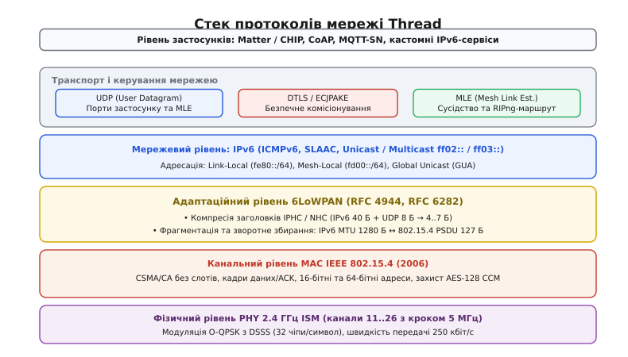
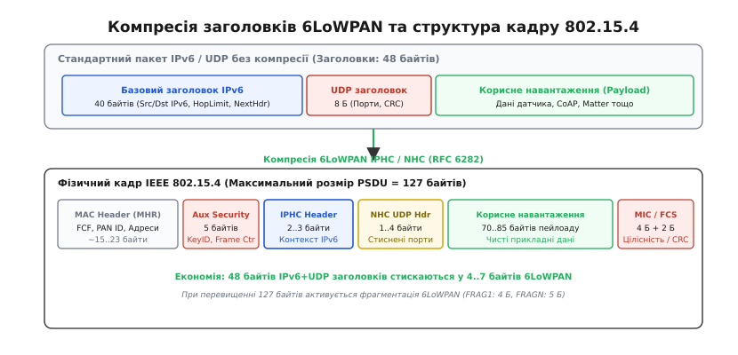
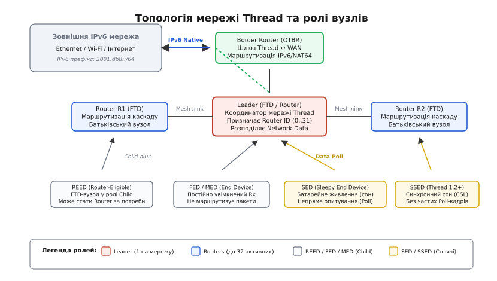
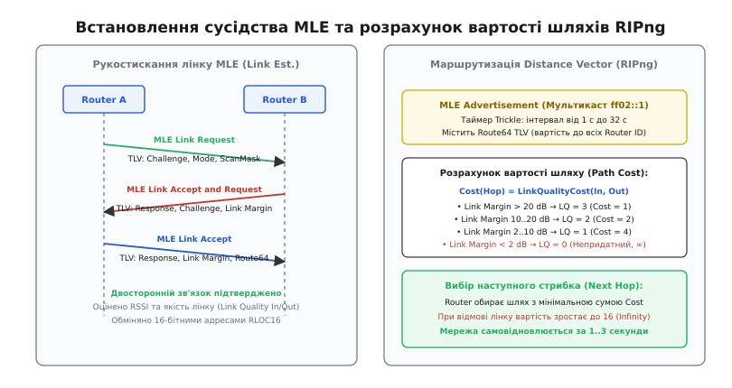
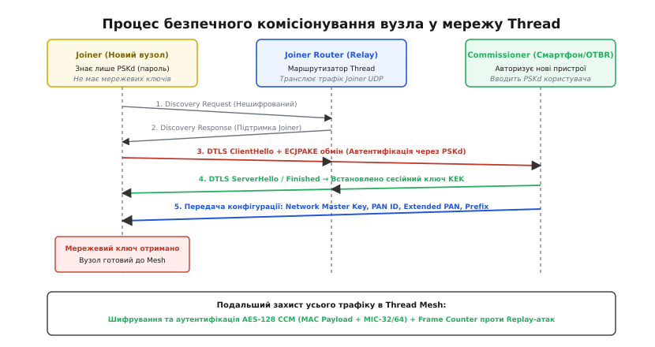

# Thread: IPv6-mesh протокол для IoT на основі IEEE 802.15.4

<preknowlist>
- [TCP проти UDP](topic:com-transport/tcp-vs-udp) — транспортний рівень: відмінності датаграм без з'єднання від надійного потоку.
- [TLS Handshake](topic:sf-security/tls-handshake) — криптографічне рукостискання, обмін ключами та захист каналу.
- [Проєктування пакета](topic:com-transport/packet-design) — структура канальних PDU, заголовки, вирівнювання та контроль цілісності CRC.
- [CRC](topic:com-modulation/crc) — алгоритми циклічного надлишкового коду для виявлення бітових помилок у кадрах.
</preknowlist>

Коли в сучасному житловому будинку або промисловому приміщенні розгортають мережу з кількох сотень бездротових сенсорів, термостатів та розумних замків, класична топологія «зірка» на базі Wi-Fi зазнає краху: радіосигнал 2.4 ГГц згасає за залізобетонними стінами, центральна точка доступу перевантажується сотнями одночасних асоціацій, а радіотракт Wi-Fi зі струмом споживання 50–100 мА розряджає літієву дискову батарейку датчика менш ніж за дві доби. Традиційні бездротові мережі Zigbee вирішували проблему покриття за рахунок ретрансляції, проте створили нову критичну проблему — залежність від єдиного апаратного координатора та відсутність нативного Інтернет-протоколу: вихід з ладу координатора паралізує мережу, а передача даних на смартфон вимагає спеціального шлюзу-транслятора прикладного рівня, який перепаковує пропрієтарні кадри в TCP/IP.

Для подолання цих обмежень альянс провідних технологічних компаній створив протокол **Thread** (англ. *thread* — нитка, зв'язний ланцюг; англ. *mesh* — петля, сітка; лат. *adaptare* — пристосовувати). Thread є захищеним, самовідновлюваним, безкоординаторним комірчастим протоколом бездротового зв'язку, побудованим на базі відкритого радіоінтерфейсу IEEE 802.15.4 на частоті 2.4 ГГц та адаптаційного рівня 6LoWPAN. Головна відмінність Thread полягає в наскрізній підтримці стеку IPv6: кожен мікроконтролер у мережі отримує власну повноцінну IP-адресу, обмінюється стандартними UDP-датаграмами без проміжних шлюзів трансляції та підтримує банківський рівень криптографічного захисту AES-128 CCM.


*Стек протоколів Thread: радіочастотний та канальний рівні IEEE 802.15.4 поєднуються з адаптаційним рівнем 6LoWPAN, що забезпечує прозоре функціонування маршрутизації IPv6, безпеки MLE/DTLS та сучасних прикладних екосистем, таких як Matter.*

Детальну історію появи протоколу, передумови відмови від координаторів Zigbee та формування консорціуму Thread Group викладено у вставці [Від закритих шлюзів Zigbee до відкритого IP-mesh: історія народження Thread](topic:com-transport/thread-mesh/hist-thread-origins.md).

---

### Фізичний (PHY) та канальний (MAC) рівні IEEE 802.15.4

Фундаментом, на якому розгортається вся архітектура Thread, є міжнародний стандарт IEEE 802.15.4-2006, оптимізований для низькошвидкісного бездротового зв'язку персонального радіусу дії (LR-WPAN, *Low-Rate Wireless Personal Area Networks*) з наднизьким енергоспоживанням.

#### Частотний план та пряме розширення спектра DSSS
Thread працює у неліцензованому глобальному частотному діапазоні 2.4 ГГц ISM (*Industrial, Scientific, Medical*), використовуючи 16 каналів, пронумерованих від 11 до 26:

```
f_c = 2405 + 5 · (k - 11) МГц, де k ∈ [11, 26]
```

Міжканальний інтервал становить 5 МГц, а ширина випромінюваного спектра кожного каналу дорівнює 2 МГц. Для забезпечення надійного прийому сигналу в умовах сильних електромагнітних завад від працюючих поруч мереж Wi-Fi та Bluetooth застосовується метод прямого розширення спектра **DSSS** (*Direct Sequence Spread Spectrum*) у поєднанні з модуляцією **O-QPSK** (*Offset Quadrature Phase Shift Keying* — квадратурна фазова маніпуляція зі зсувом) та напівсинусоїдальним формуванням радіоімпульсів (Half-sine pulse shaping).

```
Вхідний потік даних (250 кбіт/с)
  │ (групування по 4 біти)
  ▼
Символ даних (16 можливих комбінацій, швидкість 62.5 ксимв/с)
  │ (відображення за таблицею псевдовипадкових послідовностей)
  ▼
32-чіпова послідовність (чіпова швидкість 2.0 Мчіп/с)
  │ (розподіл на парні/непарні чіпи зі зсувом T_c = 0.5 мкс)
  ▼
Модулятор O-QPSK ──> Радіоефір 2.4 ГГц
```

Кожні 4 вхідні біти корисних даних утворюють один символ (швидкість передачі символів складає 62.5 ксимв/с). Цей символ відображається у фіксовану 32-чіпову ортогональну двійкову послідовність. Отримана чіпова послідовність модулюється на радіочастотну несучу зі швидкістю 2.0 Мчіп/с. Коефіцієнт розширення спектра становить `32 / 4 = 8` (на кожен інформаційний біт припадає 8 чіпів). 

Завдяки цьому приймач отримує виграш від обробки (Processing Gain), що дозволяє успішно демодулювати пакети навіть тоді, коли рівень сигналу опускається до -100 дБм, або коли співвідношення сигнал/шум (SNR) у каналі має від'ємне значення. Чиста швидкість передачі бітів в ефірі становить рівно 250 кбіт/с.

#### Формат фізичного кадру PPDU
Максимальний розмір пакетного блоку даних фізичного рівня (PSDU, *PHY Service Data Unit*) у стандарті IEEE 802.15.4 обмежений рівно **127 байтами**. Це апаратне обмеження зумовлене розміром вбудованих апаратних буферів FIFO у радіотрансиверах та необхідністю мінімізувати ймовірність виникнення бітових помилок при безперервній передачі на низьких швидкостях.

Фізичний пакет PPDU складається з трьох полів:
1. **Синхронізаційний заголовок SHR (5 байтів):** 4 байти преамбули (послідовність нульових бітів для тактової синхронізації приймача) та 1 байт розділювача початку кадру SFD (*Start-of-Frame Delimiter*, фіксоване значення `0xA7`).
2. **Заголовок фізичного рівня PHR (1 байт):** містить 7-бітне поле довжини кадру (Frame Length), яке вказує точну кількість байтів у PSDU (від 0 до 127).
3. **Корисне навантаження фізичного рівня PSDU (до 127 байтів):** повний кадр канального рівня MAC (MPDU).

#### Канальний рівень MAC: доступ до середовища та адресація
На канальному рівні Thread використовує неслотований протокол множинного доступу з контролем несучої та запобіганням колізіям **CSMA/CA** (*Carrier Sense Multiple Access with Collision Avoidance*).

Перед початком передачі радіомодем виконує оцінку чистоти каналу CCA (*Clear Channel Assessment*), слухаючи радіоефір протягом 8 періодів символів (128 мкс). Якщо рівень потужності сигналу перевищує поріг чутливості (зазвичай -75 дБм), передавач відкладає спробу на випадковий інтервал часу (Backoff Period), що обчислюється за формулою:

```
Backoff = random(0, 2^BE - 1) · 320 мкс
```

де `BE` (*Backoff Exponent*) — експоненційний показник затримки, який початково дорівнює 3 і збільшується на 1 після кожної невдалої спроби до максимуму 5.

Канальний рівень визначає два типи мережевих адрес:
* **Розширена адреса (Extended Address / EUI-64):** 64-бітний глобально унікальний ідентифікатор, присвоєний мікроконтролеру виробником або згенерований випадковим чином.
* **Коротка адреса (Short Address / 16-bit MAC Address):** 16-бітний локальний ідентифікатор, який динамічно призначається координатором під час підключення вузла до мережі для зменшення накладних витрат у заголовках.

Усі кадри даних, що потребують підтвердження, супроводжуються миттєвим апаратним кадром **ACK**, який надсилається одержувачем через 192 мкс (міжкадровий інтервал SIFS, *Short Interframe Spacing*) без виконання процедури CCA. Цілісність кадру контролюється 16-бітною контрольною сумою FCS (*Frame Check Sequence*), що розраховується за поліномом CRC-16 CCITT (`x¹⁶ + x¹² + x⁵ + 1`).

---

### Адаптаційний рівень 6LoWPAN (RFC 4944, RFC 6282)

Впровадження протоколу IPv6 у вбудовані радіомережі зіткнулося з критичною архітектурною суперечністю:
1. Стандарт IPv6 (RFC 8200) категорично вимагає, щоб будь-який канал зв'язку забезпечував мінімальний розмір максимального блоку передачі (MTU, *Maximum Transmission Unit*) не менше **1280 байтів**.
2. Максимальний фізичний розмір кадру IEEE 802.15.4 становить лише **127 байтів**. Після віднімання заголовка MAC (MHR, до 23 байтів), заголовка безпеки канального рівня (Auxiliary Security Header, 5 байтів) та контрольної суми FCS (2 байти) для передачі мережевого пакета залишається лише **80–97 байтів**.
3. Стандартний заголовок IPv6 має фіксовану довжину **40 байтів**, а заголовок транспортного протоколу UDP — **8 байтів**. Якби пакети передавалися без змін, 48 байтів накладних витрат залишали б для корисних даних датчика лише 30–40 байтів, а передача повного 1280-байтного пакета вимагала б розбиття на 15–18 окремих радіокадрів.

Для розв'язання цієї проблеми між канальним рівнем MAC та мережевим рівнем IPv6 інтегровано адаптаційний рівень **6LoWPAN** (*IPv6 over Low-Power Wireless Personal Area Networks*), який реалізує два ключові механізми: компресію заголовків та фрагментацію.


*Механізм компресії 6LoWPAN: заголовок IPv6 (40 байтів) та заголовок UDP (8 байтів) стискаються адаптаційним рівнем у компактний блок розміром 4–7 байтів, вивільняючи максимальний обсяг кадру 802.15.4 під корисне навантаження.*

#### Компресія заголовків IPHC та NHC (RFC 6282)
Специфікація 6LoWPAN IPHC (*IP Header Compression*) дозволяє замінити 40-байтний заголовок IPv6 компактним 2- або 3-байтним заголовком компресії на основі контекстних правил:

```
 0                   1
 0 1 2 3 4 5 6 7 8 9 0 1 2 3 4 5
+-+-+-+-+-+-+-+-+-+-+-+-+-+-+-+-+
|0 1 1|TF |NH|HLIM|CID|SAC|SAM|DAC|DAM|
+-+-+-+-+-+-+-+-+-+-+-+-+-+-+-+-+
```

* **Базовий префікс `011b` (3 біти):** ідентифікує формат IPHC.
* **Поле TF (Traffic Class & Flow Label, 2 біти):** якщо пріоритет трафіку та мітка потоку дорівнюють нулю (типово для 99% трафіку IoT), обидва 4-байтні поля повністю вилучаються із заголовка (`TF = 11b`).
* **Поле NH (Next Header, 1 біт):** якщо наступний заголовок (наприклад UDP) стискається наступним рівнем NHC, значення біта встановлюється в `1`, а 1-байтне поле Next Header вилучається.
* **Поле HLIM (Hop Limit, 2 біти):** стискає 8-бітне поле ліміту стрибків до фіксованих значень 1, 64 або 255.
* **Поля адресації SAC/SAM/DAC/DAM (Source/Destination Address Compression):**
  * Якщо адреса є Link-Local (`fe80::/64`), 64-бітний префікс повністю відкидається.
  * Якщо адреса належить до відомого контексту мережі Mesh-Local (`fd00::/64`), вона стискається на основі спільного контексту (Context Identifier, CID).
  * 64-бітний інтерфейсний суфікс IID (*Interface Identifier*) не передається взагалі (`SAM/DAM = 11b`), оскільки він точно відновлюється одержувачем із 64-бітної або 16-бітної апаратної MAC-адреси, наявної в заголовку кадру 802.15.4.

Завдяки IPHC 40-байтний заголовок IPv6 зменшується до **2 байтів** (для локального обміну) або **3–7 байтів** (для глобальної маршрутизації).

Компресія **NHC** (*Next Header Compression*) додатково стискає 8-байтний заголовок UDP:
* Довжина пакета вилучається, оскільки вона обчислюється з довжини кадру 802.15.4.
* Якщо номери портів джерела та призначення знаходяться в діапазоні динамічних портів стиснення `0xF0B0..0xF0BF` (використовуються системними службами Thread та CoAP), кожен 16-бітний порт кодується лише 4 бітами.
* 8-байтний заголовок UDP стискається до **4 байтів** (1 байт прапорців NHC, 1 байт стиснених портів та 2 байти контрольної суми UDP Checksum).

У підсумку 48 байтів заголовків IPv6+UDP перетворюються на **6 байтів** 6LoWPAN, залишаючи понад 75 байтів для корисних даних застосунку.

#### Фрагментація та зворотне збирання
Якщо розмір стисненого IPv6-пакета разом із прикладними даними перевищує доступний залишок кадру 802.15.4, 6LoWPAN виконує автоматичну фрагментацію на канальному рівні:

1. **Перший фрагмент (First Fragment):** позначається 4-байтним заголовком `FRAG1`:
   * Префікс `11000b` (5 бітів);
   * `datagram_size` (11 бітів) — повний розмір нефрагментованого IPv6-пакета;
   * `datagram_tag` (16 бітів) — унікальний числовий ідентифікатор датаграми, спільний для всіх її частин.
2. **Наступні фрагменти (Subsequent Fragments):** позначаються 5-байтним заголовком `FRAGN`:
   * Префікс `11100b` (5 бітів), поля `datagram_size` та `datagram_tag`;
   * `datagram_offset` (8 бітів) — зміщення поточного фрагмента від початку датаграми, виражене у 8-байтних блоках.

Одержувач виділяє буфер зворотного збирання (Reassembly Buffer) і запускає таймер очікування (зазвичай 1.5–2 секунди). Якщо протягом цього часу всі фрагменти датаграми успішно надійшли, пакет збирається і передається вище на рівень IPv6. Якщо хоча б один фрагмент втрачено в ефірі, весь зібраний буфер скидається.

---

### Топологія мережі Mesh та ролі вузлів

Thread відмовляється від вразливої деревоподібної топології на користь повнозв'язної комірчастої топології (Mesh), де маршрутизація здійснюється децентралізовано, а мережа здатна самовідновлюватися при виході з ладу будь-якого вузла.


*Топологія мережі Thread: Border Router забезпечує вихід у WAN, Leader координує мережеві параметри, Routers утворюють ядро маршрутизації, а кінцеві пристрої (End Devices) та сплячі вузли (SED) підключаються до батьківських маршрутизаторів.*

Усі пристрої в мережі Thread класифікуються за двома базовими апаратними типами: **FTD** (*Full Thread Device* — повнофункціональний пристрій) та **MTD** (*Minimal Thread Device* — мінімальний пристрій). На основі цих типів формуються конкретні системні ролі.

#### Ролі повнофункціональних пристроїв (FTD)
1. **Leader (Координатор мережі):** у кожному сегменті мережі Thread існує рівно один Leader. На відміну від координатора Zigbee, Leader не є фіксованим апаратним пристроєм. Перший увімкнений маршрутизатор автоматично проголошує себе Leader'ом. Він централізовано призначає унікальні 6-бітні ідентифікатори маршрутизаторів (Router ID, значення від 0 до 31 або 63), веде облік активних маршрутів та поширює конфігураційні дані (Network Data). Якщо поточний Leader знеструмлюється або зазнає збою, інші маршрутизатори протягом лічених секунд проводять децентралізоване голосування та обирають нового Leader'а без розриву зв'язку для кінцевих пристроїв.
2. **Router (Маршрутизатор):** вузол із постійним живленням від електромережі, який приймає та пересилає пакети між іншими вузлами мережі, бере участь у дистанційно-векторній маршрутизації та виступає батьківським вузлом (Parent) для кінцевих пристроїв. У мережі Thread одночасно може працювати до **32 активних маршрутизаторів**.
3. **REED (Router-Eligible End Device):** пристрій FTD, який наразі працює в ролі дочірнього вузла (Child), проте має повний програмний стек і достатній запас пам'яті, щоб у будь-який момент підвищити свій статус до повноцінного Router. Якщо Leader фіксує погіршення зв'язності або якщо наявні маршрутизатори вичерпали ліміт підключення дочірніх вузлів, REED отримує команду на підвищення (Promotion) і стає новим активним маршрутизатором.
4. **FED (Full End Device):** повнофункціональний вузол із постійно увімкненим приймачем (Rx-On-When-Idle), який ніколи не підвищує свій статус до Router і передає всі вихідні пакети виключно через свій батьківський вузол.

#### Ролі мінімальних та сплячих пристроїв (MTD)
5. **MED (Minimal End Device):** пристрій із суворими обмеженнями за обсягом Flash/RAM (наприклад розумна розетка чи настінний вимикач), приймач якого увімкнений постійно, проте стек не містить модулів розрахунку таблиць маршрутизації.
6. **SED (Sleepy End Device):** автономний датчик із живленням від батарейок (датчик відкриття дверей, витоку води, температури). Приймач і передавач SED вимкнені 99.9% часу, а мікроконтролер перебуває у стані глибокого сну зі споживанням 1–2 мкА. SED взаємодіє зі світом через **непряме опитування** (Indirect Polling):
   * Коли зовнішній клієнт надсилає пакет на адресу SED, батьківський маршрутизатор (Parent) перехоплює його і зберігає у своєму внутрішньому буфері.
   * Періодично (наприклад кожні 3–5 секунд) SED прокидається на 2–3 мс і надсилає короткий кадр `MAC Data Request`.
   * Маршрутизатор відповідає кадром ACK із встановленим прапорцем наявності даних (`Frame Pending = 1`), після чого передає накопичений пакет з буфера.
7. **SSED (Synchronized Sleepy End Device, Thread 1.2+):** сплячий пристрій нового покоління, що використовує механізм **CSL** (*Coordinated Sampled Listening*). Батьківський вузол і SSED синхронізують локальні таймери. Вузол прокидається на 160 мкс у строго визначені моменти часу без надсилання енерговитратних опитувань Data Request. Це знижує середній струм споживання в режимі очікування до субмікроамперного рівня, збільшуючи термін служби батарейки CR2032 до 5–10 років.

#### Border Router (Прикордонний маршрутизатор)
**Thread Border Router (OTBR)** виконує роль прозорого шлюзу між комірчастою радіомережею 802.15.4 та зовнішніми мережами IP (Wi-Fi, Ethernet або 4G/5G). 

На відміну від шлюзів Zigbee, Border Router:
* Не перетворює і не перепаковує прикладні протоколи.
* Працює як стандартний маршрутизатор третього рівня IPv6 (IP Forwarder), пересилаючи датаграми без зміни корисного навантаження.
* Анонсує в мережу Thread глобальні префікси IPv6 (*Global Unicast Prefix*, GUA) через механізм SLAAC.
* Забезпечує роботу сервісів **NAT64 / DNS64** для прозорого звернення вузлів Thread до застарілих зовнішніх серверів IPv4.
* Транслює мультикаст-трафік **mDNS / DNS-SD** (Thread 1.3+), завдяки чому будь-який смартфон у домашній мережі Wi-Fi миттєво знаходить сервіси датчиків Thread за стандартним протоколом Zeroconf.

---

### Протокол встановлення зв'язку MLE та дистанційно-векторна маршрутизація (RIPng)

Усі операції з формування сусідства, вимірювання якості каналів та обміну маршрутами виконуються спеціалізованим протоколом **MLE** (*Mesh Link Establishment*, RFC 7554). Повідомлення MLE передаються поверх транспортного рівня UDP на порт `19788`.

```
 Router A (RLOC 0x3800)                           Router B (RLOC 0x5800)
    │                                                │
    │ 1. MLE Link Request (Challenge A)              │
    ├───────────────────────────────────────────────>│
    │                                                │
    │ 2. MLE Link Accept and Request                 │
    │    (Response A + Challenge B + Link Margin B)  │
    │<───────────────────────────────────────────────┤
    │                                                │
    │ 3. MLE Link Accept                             │
    │    (Response B + Link Margin A + Route64 TLV)  │
    ├───────────────────────────────────────────────>│
    │                                                │
    ▼ [Двосторонній зв'язок встановлено. Вартість = 1] ▼
```


*Процес встановлення зв'язку MLE та дистанційно-векторна маршрутизація: тристороннє рукостискання верифікує двосторонню якість радіоканалу та захист від атак повтору, після чого маршрутизатори обмінюються Route64 TLV за таймером Trickle.*

#### Механізм встановлення суміжності лінку
Для встановлення надійного зв'язку між двома маршрутизаторами `Router A` та `Router B` виконується тристороннє рукостискання:

1. **MLE Link Request:** Вузол A генерує псевдовипадковий 64-бітний криптографічний Nonce (`Challenge`), вкладає свій прапорець конфігурації `Mode` і надсилає запит сусіду.
2. **MLE Link Accept and Request:** Вузол B приймає запит, вимірює рівень вхідного сигналу RSSI і розраховує запас завадостійкості (`Link Margin = RSSI - Sensitivity`). Вузол B генерує математичну відповідь `Response` (підпис отриманого Challenge мережевим ключем), додає власний `Challenge` для зустрічної перевірки і відправляє комбіноване повідомлення.
3. **MLE Link Accept:** Вузол A перевіряє відповідь, фіксує симетричність лінку, відправляє свій `Response`, виміряний запас зворотного сигналу та актуальну таблицю маршрутизації `Route64 TLV`.

Детальний двійковий формат полів, бітові маски та словник структури інформаційних елементів TLV описано у вставці [Специфікація TLV протоколу MLE та діагностичні команди OpenThread](topic:com-transport/thread-mesh/api-mle-tlv.md).

#### Дистанційно-векторна маршрутизація Distance Vector на базі RIPng
Маршрутизатори Thread не використовують ресурсомісткі протоколи стану каналів (Link-State на зразок OSPF), які вимагають збереження повної топологічної карти в пам'яті кожного мікроконтролера. Замість цього застосовується оптимізований дистанційно-векторний протокол на базі **RIPng** (*Routing Information Protocol next generation*, RFC 2080).

Кожен радіолінк між сусідами отримує оцінку якості `LQ ∈ {0, 1, 2, 3}` на основі запасу потужності сигналу над порогом демодуляції:
* `LQ = 3` (запас > 20 дБ) → вартість переходу `Cost = 1`.
* `LQ = 2` (запас 10..20 дБ) → вартість переходу `Cost = 2`.
* `LQ = 1` (запас 2..10 дБ) → вартість переходу `Cost = 4`.
* `LQ = 0` (запас < 2 дБ) → вартість `Cost = ∞` (канал непридатний).

Вартість одного стрибка між маршрутизаторами розраховується як максимум від вартостей вхідного та вихідного напрямків:

```
Cost(Hop) = max( Cost(LQ_in), Cost(LQ_out) )
```

Маршрутизатори періодично обмінюються повідомленнями `MLE Advertisement`, які містять вектор вартостей до всіх активних Router ID (`Route64 TLV`). Для мінімізації службового трафіку широкомовні розсилки керуються адаптивним таймером **Trickle** (RFC 6206):
* У стані спокою інтервал трансляцій подвоюється після кожного успішного циклу від `I_min = 1 с` до `I_max = 32 с`.
* У разі виявлення розриву зв'язку чи зміни топології таймер миттєво скидається до `1 с`, забезпечуючи реконвергенцію маршрутів за лічені секунди.

---

### Безпека мережі, автентифікація та комісіонування

Безпека в Thread інтегрована в саму архітектуру протоколу і діє одночасно на канальному та транспортному рівнях.


*Безпечне введення пристрою в експлуатацію: новий вузол (Joiner) автентифікується перед комісіонером за паролем PSKd за протоколом DTLS ECJPAKE, після чого отримує мережевий ключ для подальшого шифрування AES-128 CCM.*

#### Шифрування та цілісність кадрів AES-128 CCM
Усі пакети IEEE 802.15.4 у мережі Thread на канальному рівні шифруються та аутентифікуються єдиним 128-бітним мережевим майстер-ключем (**Network Key**) за алгоритмом **AES-128 CCM** (*Counter with CBC-MAC*).

Режим CCM забезпечує одночасно конфіденційність (шифрування корисного навантаження) та цілісність (генерацію 32- або 64-бітного коду аутентифікації повідомлення MIC, *Message Integrity Code*). Поля заголовка MAC (адреси відправника та одержувача, номер послідовності, PAN ID) залишаються відкритими для маршрутизації, але обов'язково входять у розрахунок коду цілісності MIC як додаткові автентифіковані дані (AAD, *Additional Authenticated Data*). Будь-яка спроба підміни адрес чи полів кадру стороннім спостерігачем призводить до відкидання пакета апаратним криптографічним блоком приймача.

Для захисту від атак повторного відтворення (Replay Attacks) кожен вузол веде монотонно зростаючий 32-бітний лічильник кадрів **Frame Counter**. Приймач запам'ятовує останнє значення лічильника для кожного сусіда: якщо вхідний пакет містить лічильник, менший або рівний збереженому значенню, пакет негайно відкидається.

#### Процедура комісіонування (Commissioning Protocol)
Введення нового пристрою (**Joiner**) у зашифровану мережу без попереднього запису секретного майстер-ключа здійснюється за допомогою протоколу комісіонування на базі сесії **DTLS** (*Datagram Transport Layer Security*):

1. Користувач вводить тимчасовий текстовий пароль пристрою (**PSKd**, *Pre-Shared Key for Device*, наприклад `J01NME` або QR-код Matter) у мобільний додаток комісіонера (**Commissioner**).
2. Новий вузол Joiner надсилає нешифрований широкомовний запит `Discovery Request` на всіх радіоканалах.
3. Найближчий маршрутизатор, налаштований як **Joiner Router**, відповідає вузлу і стає прозорим ретранслятором UDP-трафіку між Joiner та Commissioner.
4. Joiner та Commissioner встановлюють захищену сесію DTLS, використовуючи протокол автентифікації з нульовим розголошенням **ECJPAKE** (*Elliptic Curve Password Authenticated Key Exchange*). Цей алгоритм гарантує, що навіть якщо зловмисник перехопить увесь радіотрафік процедури підключення, він не зможе відновити ні пароль PSKd, ні згенерований сесійний ключ шифрування KEK (*Key Encryption Key*).
5. Після успішної перевірки пароля Commissioner передає вузлу Joiner повний набір конфігурації мережі (Active Operational Dataset): Network Key, PAN ID, Extended PAN ID, номер каналу та префікс Mesh-Local.
6. Joiner завершує сесію DTLS, налаштовує свій радіотрансивер на отримані параметри і приєднується до мережі Thread як повноправний захищений вузол.

#### Розділення мережі на сегменти та автоматичне злиття (Partitioning & Healing)
У масштабних будівлях виникнення фізичних радіоперешкод (наприклад, зачинення масивних протипожежних металевих дверей чи знеструмлення проміжного поверху) може розірвати радіовидимість між двома групами маршрутизаторів. 

У класичних протоколах із фіксованим координатором це призводить до повної зупинки тієї половини мережі, яка втратила зв'язок із координатором. У Thread реалізовано повністю автономний механізм обробки розділення (**Network Partitioning**):
* Маршрутизатори ізольованого сегмента фіксують відсутність анонсів від поточного Leader'а після завершення таймауту очікування.
* Найбільш пріоритетний Router автоматично бере на себе роль Leader'а нового локального розділу, генерує новий випадковий 32-бітний ідентифікатор розділу `Partition ID` і продовжує обслуговувати локальний трафік датчиків та актуаторів без розриву з'єднань.
* Коли радіоперешкоду усунуто і два розділи знову чують анонси один одного, стек порівнює числову вагу розділів (**Partition Weight**):
```
Partition Weight = (Кількість активних Router ID << 16) | Partition Sequence
```
* Розділ із меншою вагою автоматично підпорядковується більшому розділу: його локальний Leader добровільно складає повноваження і переходить у статус Router, а всі вузли плавно оновлюють свої конфігураційні таблиці та ідентифікатор розділу без переривання передачі призначених для користувача даних.

#### Ротація ключів безпеки та захист від компрометації (Key Rotation)
Для запобігання переповненню 32-бітного лічильника Frame Counter у багаторічних інсталяціях та захисту від потенційної компрометації вузлів Thread підтримує процедуру безшовної планової ротації ключів.

Мережевий майстер-ключ використовується як вхідний матеріал для криптографічної функції формування ключів (KDF на основі HMAC-SHA-256). Щоразу, коли значення 32-бітного параметра `Key Sequence Counter` збільшується на одиницю, стек обчислює новий робочий ключ шифрування канального рівня. Щоб пристрої, які тимчасово перебували в режимі сну, не втратили зв'язок під час зміни ключів, маршрутизатори одночасно підтримують дійсними три покоління ключів: попередній ключ (`K_prev`), поточний (`K_curr`) та наступний (`K_next`). Якщо вхідний кадр зашифровано старим ключем, він успішно розшифровується, а вузол-відправник отримує оновлений номер послідовності для негайного переходу на актуальний ключ.

Практичну реалізацію ініціалізації вузла, конфігурації робочого набору та передачі UDP-телеметрії на мовах C та C++ наведено у вставці [Реалізація вузла Thread та передача UDP-телеметрії через OpenThread API](topic:com-transport/thread-mesh/proj-openthread-node.md).

---

> 🔧 **Навіщо це в реальній розробці.**
> У традиційних проєктах IoT на базі Zigbee або Bluetooth розробники змушені створювати складні проміжні сервери-транслятори та підтримувати окремі кодові бази для радіомодулів і хмарних сервісів. Застосування Thread усуває цю прірву: вбудований мікроконтролер спілкується зі світом через стандартні сокети BSD за протоколами IPv6 та CoAP так само природно, як серверний бекенд.
> 
> Завдяки відмові від координатора та апаратній підтримці самовідновлення топології, мережа Thread витримує раптове вимкнення до 30% вузлів без втрати працездатності, а підтримка сплячих режимів SED та SSED дозволяє датчикам працювати роками від однієї мініатюрної батарейки. Саме поєднання нативного IPv6, відкритої кодової бази OpenThread та відсутності єдиної точки відмови зробило Thread безальтернативним стандартом бездротового зв'язку для глобальної екосистеми розумного будинку Matter.
