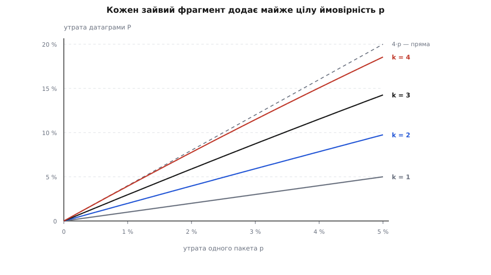
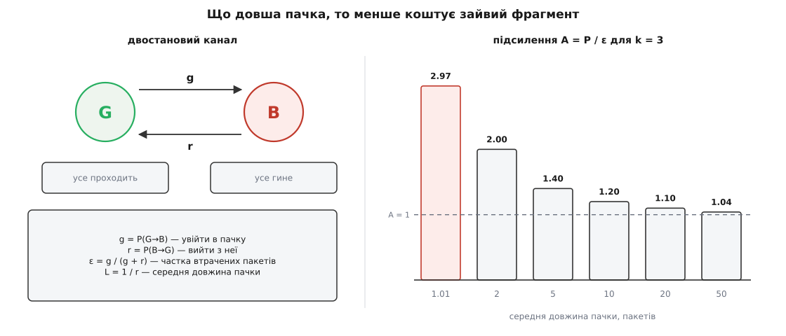

# 🧮 Арифметика втрат: фрагменти, пачки, вікно, повтори

Чотири числа вирішують, як писати код над датаграмами: ймовірність утратити датаграму, розрізану на k фрагментів; поправка на те, що втрати в мережі йдуть пачками, а не поодинці; глибина вікна номерів, потрібна щоб упізнати дубль; ціна повторів у схемі «послав і чекаю». Далі всі чотири виводяться з нуля й доводяться до чисел, які можна підставити у свій випадок.

## Чому ймовірності фрагментів перемножуються

Датаграма, розрізана на фрагменти, не має проміжних станів. Приймальний IP тримає шматки в буфері й віддає нагору лише повністю зібрану датаграму; шматок, що не дійшов, нічим не замінити, і через кілька секунд буфер просто спорожняють. Отже подія «датаграма дожила» — це перетин k подій «фрагмент i дожив», а не їхня сума. Це та сама конструкція, що й [послідовна система в теорії надійності, де відмова будь-якого одного елемента валить усе ціле](topic:math-probability/system-reliability-math).

Візьмімо найпростіше припущення: кожен фрагмент гине з імовірністю p, і долі фрагментів [незалежні — знання про долю одного нічого не каже про долю іншого](topic:math-probability/independent-trials). Тоді ймовірності виживання перемножуються:

```text
P(дожили всі k)  = (1 − p)ᵏ
P(датаграма зникла) = 1 − (1 − p)ᵏ
```

Спокуса написати замість цього просто k·p зрозуміла, і наближення справді майже правильне — але подивімося, де саме воно хибить. Для k = 2 перелік випадків дає

```text
P(загинув хоч один) = p + p − p²  = 2p − p²
1 − (1 − p)²        = 2p − p²        ✓
```

Доданок p² — це випадок «загинули обидва», який у сумі p + p порахований двічі. Точна формула нічого не додає до наївної суми, вона лише **знімає подвійний облік**. Звідси відразу видно напрям похибки: k·p завжди трохи **перебільшує** ризик, ніколи не применшує.

## Скільки коштує кожен зайвий фрагмент

Підставмо числа. Рядок — утрата одного пакета p, стовпчик — кількість фрагментів k, у клітинці — ймовірність утратити цілу датаграму.

| p | k = 1 | k = 2 | k = 3 | k = 4 |
|---|---|---|---|---|
| 0.1 % | 0.100 % | 0.200 % | 0.300 % | 0.399 % |
| 0.5 % | 0.500 % | 0.998 % | 1.493 % | 1.985 % |
| 1 % | 1.000 % | 1.990 % | 2.970 % | 3.940 % |
| 2 % | 2.000 % | 3.960 % | 5.881 % | 7.763 % |
| 5 % | 5.000 % | 9.750 % | 14.263 % | 18.549 % |



*На робочих значеннях p криві майже не відрізняються від прямих із нахилом k; пунктир 4·p відходить від кривої k = 4 лише під правим краєм.*

Зручна міра — **підсилення** A = P ⁄ p: у скільки разів фрагментована датаграма вразливіша за нефрагментовану на тому самому каналі.

```text
p = 0.1 %:  A = 1.000  1.999  2.997  3.994   (k = 1…4)
p = 1 %:    A = 1.000  1.990  2.970  3.940
p = 5 %:    A = 1.000  1.950  2.853  3.710
```

Підсилення тримається впритул до k і повзе вниз лише на поганих каналах. Практичний висновок з таблиці один: **розрізати датаграму навпіл — це майже подвоїти втрати**, і жодна економія на кількості викликів `sendto` цього не окупає.

## Коли можна множити в думці

Наближенням P ≈ k·p користуються всі, тож варто знати його точну ціну. З нерівностей Бонферроні (обриваємо перелік випадків на парах):

```text
P ≥ k·p − C(k,2)·p²  = k·p − k(k−1)p²/2

похибка наближення   k·p − P ≤ k(k−1)p²/2
відносна похибка     (k·p − P) / (k·p) ≤ (k − 1)·p / 2
```

Межа виявляється майже точною, а не грубою оцінкою згори:

```text
k = 3, p = 1 %:   справжня похибка 0.997 %,  межа 1.000 %
k = 4, p = 5 %:   справжня похибка 7.253 %,  межа 7.500 %
```

Звідси правило, яке легко тримати в голові: щоб множення в думці помилялося менш ніж на відсоток, треба (k − 1)·p ⁄ 2 ≤ 0.01, тобто

```text
p ≤ 2 % / (k − 1)

k = 2 → p до 2 %
k = 3 → p до 1 %
k = 4 → p до 0.67 %
```

На типовому провідному сегменті з 0.1 % утрат наближення дає похибку в соті частки відсотка, і точну формулу можна не діставати взагалі. На мобільному каналі з 5 % — уже можна помилитися на десяту частину відповіді.

## Пачки: двостановий канал

Незалежність — припущення, а не властивість мережі. Реальні втрати збиваються в пачки: перевантажена черга відкидає не один пакет, а всі, що надходять, поки не звільниться місце; радіоканал під завадою псує підряд усе, що встигло долетіти. Класична модель такої поведінки — двостановий ланцюг Маркова, який Едґар Ґілберт запропонував 1960 року в Bell System Technical Journal («Capacity of a burst-noise channel», т. 39, с. 1253–1265), а Е. О. Елліотт узагальнив 1963-го (там само, т. 42, с. 1977–1997). Модель відтоді так і зветься моделлю Ґілберта–Елліотта і лишається робочим інструментом для [каналів, де помилки йдуть суцільними смугами](topic:com-modulation/burst-error).

Канал має два стани: **G** (добрий) — усе проходить, і **B** (поганий) — усе гине. Перехід G → B стається з імовірністю g на пакет, перехід B → G — з імовірністю r. Це [ланцюг Маркова на двох станах, де майбутнє залежить лише від поточного стану, а не від усієї історії](topic:math-probability/markov-chain), тож його усталений розподіл рахується в один рядок.



*Ліворуч — параметри моделі; праворуч — підсилення для датаграми з трьох фрагментів при незмінній частці втрат 1 % і різній середній довжині пачки.*

```text
усталена частка часу в B   ε = g / (g + r)      ← це і є виміряна втрата пакетів
середня довжина пачки      L = 1 / r            ← скільки пакетів гине підряд
```

Тепер головне. Фрагменти однієї датаграми летять **упритул**: на каналі 100 Мбіт/с кадр на 1500 байтів займає 120 мкс, тож три фрагменти проходять за 360 мкс — незрівнянно швидше, ніж триває пачка, що вимірюється мілісекундами. Отже перший фрагмент виживе, якщо канал зараз у стані G, а кожен наступний — якщо канал **не встиг перейти** в B:

```text
P(дожили всі k) = (1 − ε) · (1 − g)ᵏ⁻¹
P(датаграма зникла) = 1 − (1 − ε)·(1 − g)ᵏ⁻¹
```

Перевіримо модель на межі. Втрати незалежні тоді й тільки тоді, коли ймовірність опинитися в B не залежить від того, де ми зараз: g = 1 − r. Підставивши, дістаємо ε = g і L = 1 ⁄ (1 − ε) ≈ 1.01 для ε = 1 % — тобто **незалежні втрати в цій моделі це просто пачки середньою довжиною в один пакет**, і формула мусить звестися до попередньої. Так і є.

Тепер тримаємо виміряну втрату ε = 1 % сталою й подовжуємо пачку (k = 3, g = ε·r ⁄ (1 − ε)):

| середня пачка L | g | P(датаграма зникла) | підсилення A |
|---|---|---|---|
| 1.01 (незалежні) | 0.010000 | 2.970 % | 2.970 |
| 2 | 0.005051 | 1.998 % | 1.998 |
| 5 | 0.002020 | 1.400 % | 1.400 |
| 10 | 0.001010 | 1.200 % | 1.200 |
| 20 | 0.000505 | 1.100 % | 1.100 |
| 50 | 0.000202 | 1.040 % | 1.040 |
| → ∞ | → 0 | → 1.000 % | → 1.000 |

Результат протилежний до інтуїції «пачка з'їдає всі мої фрагменти одразу, отже фрагментувати ще страшніше». Підсилення не зростає, а **спадає** — до одиниці. Причина проста, щойно її побачити: зайвий фрагмент коштує рівно стільки, скільки коштує **зайва незалежна нагода померти**. Коли канал убиває пачками, ці нагоди не незалежні: якщо пачка накрила датаграму, вона накрила б і одненький маленький пакет на її місці, а якщо не накрила — вона з великою ймовірністю не встигне початися за ті 360 мкс, поки летять усі три фрагменти. У крайньому випадку нескінченно довгих пачок фрагментація не коштує нічого: датаграма гине рівно тоді, коли канал стоїть.

Отже при незмінній частці втрат ε незалежна модель дає **завищену** оцінку ризику для однієї датаграми — вона песимістична, а не оптимістична. Це важливо визнати чесно, бо саме з неї виростає непорозуміння: справжня шкода від пачок ховається зовсім не тут.

## Де незалежна модель справді бреше

Шкода ховається в розподілі втрат у часі. Порахуймо ймовірність, що загинуть n **датаграм підряд** — для потоку, де кожна датаграма вміщається в один пакет.

```text
незалежні втрати:  P = εⁿ
двостановий канал: P = ε · (1 − r)ⁿ⁻¹
```

При ε = 1 % і середній пачці L = 5 пакетів:

| n підряд | незалежна модель | двостановий канал | у скільки разів більше |
|---|---|---|---|
| 2 | 1.0·10⁻⁴ | 8.0·10⁻³ | 80 |
| 3 | 1.0·10⁻⁶ | 6.4·10⁻³ | 6.4·10³ |
| 5 | 1.0·10⁻¹⁰ | 4.1·10⁻³ | 4.1·10⁷ |

Ось де незалежна модель бреше — і бреше на сім порядків. Подія «п'ять датаграм поспіль у нікуди», яку незалежна арифметика оголошує неможливою (раз на десять мільярдів), насправді трапляється чотири рази на тисячу. Для потоку телеметрії на 1000 датаграм за секунду пачки починаються двічі на секунду, і в кожній другій із них гине п'ять вибірок і більше: дірка від 5 мс — приблизно щосекунди. Саме за нею доведеться проєктувати буфер, а не за середньою втратою.

> 🔧 **Навіщо це.** Дві оцінки з тієї самої моделі помиляються в різні боки, і плутати їх дорого. Коли рахуєш, чи виправдана фрагментація, незалежна формула дає безпечну оцінку згори — пачки можуть тільки покращити результат. Коли рахуєш глибину буфера, час без даних або кількість повторів, та сама формула дає числа, менші за правду на порядки, бо вона нічого не знає про згуртованість утрат. Одна модель, дві протилежні ролі: верхня межа для однієї датаграми й нікудишній орієнтир для серії.

## Черга: ризик рахується не від p, а від вільних місць

Є ще один механізм, у якому фрагментація таки коштує **більше** за незалежну оцінку, і він не про кореляцію в часі, а про геометрію черги. Пачка з k фрагментів приходить на вузьке місце разом. Датаграма загине тоді й тільки тоді, коли в черзі бракує місця під усі k — тобто коли число вільних комірок F у мить приходу менше за k.

```text
P(датаграма зникла) = P(F < k) = 1 − Π (1 − hⱼ),  j = 0 … k−1
де  hⱼ = P(F = j | F ≥ j)   — «ризик обірватися рівно на j-му вільному місці»
і   ε  = h₀                  — утрата одного маленького пакета
```

Ця форма відразу пояснює, звідки взагалі береться незалежна формула. Якщо hⱼ однакове для всіх j (вільне місце розподілене геометрично), добуток згортається в (1 − ε)ᵏ і ми дістаємо рівно 1 − (1 − ε)ᵏ: для ε = 1 % і k = 3 це ті самі 2.9701 %. Тобто **незалежна формула — це не універсальний закон, а окремий випадок сталого ризику hⱼ**. І варто ризикові перестати бути сталим, як відповідь їде в той чи інший бік:

```text
черга хронічно повна (hⱼ росте): P(F=0)=1 %, P(F=1)=2 %, P(F=2)=5 %
  → P(F < 3) = 8 %      A = 8.0     ← у 2.7 раза гірше за незалежну оцінку

затори рідкі, зате глухі (hⱼ спадає): P(F=0)=1 %, P(F=1)=0.2 %, P(F=2)=0.1 %
  → P(F < 3) = 1.3 %    A = 1.3     ← майже без підсилення, як у довгій пачці
```

Наслідок для вимірювання прямий: **виміряна на одиночних пробах частка втрат не переноситься на пачки**. Одиночна проба міряє h₀ і нічого більше, а доля фрагментованої датаграми залежить від h₁, h₂ — від форми хвоста вільного місця, якої проба не бачить. Хочеш знати, скільки коштує фрагментація на твоєму шляху, — шли пачки по k пакетів і рахуй, скільки з них дійшло цілими. Виміряти три числа дешевше, ніж вгадати форму [розподілу заповнення черги, від якої залежать і затримка, і втрати](topic:com-transport/queue-theory-networks).

## Розмір вікна дедуплікації

Вікно номерів — це пам'ять про останні W номерів позаду найбільшого прийнятого. Усе, що відстало більш ніж на W, відкидають без розгляду. Отже помилка від замалого вікна цілком конкретна: **законна, але запізніла датаграма буде відкинута як стара** — це чиста додаткова втрата, яку ти зробив собі сам. Звідси й умова.

Вікно міряється в номерах, запізнення — у секундах, зв'язує їх темп потоку R (датаграм за секунду):

```text
W ≥ R · T_запізнення
```

Лишається чесно порахувати T_запізнення — найбільший вік датаграми, яку ми ще хочемо прийняти. Доданків два, і другий зазвичай забувають.

**Переставляння.** Датаграма пішла іншим шляхом і прийшла після сусідок. Це десятки мілісекунд, і брати сюди середнє безглуздо — треба [високий квантиль виміряного розкиду, бо саме хвіст, а не середина, визначає, як часто ми будемо помилятися](topic:math-probability/percentiles-quantiles). Якщо хвіст запізнень спадає експоненційно із середнім 3 мс, то вікно на 64 номери при R = 1000 датаграм/с покриває 64 мс:

```text
частка помилково відкинутих = e^(−0.064 / 0.003) ≈ 5.4·10⁻¹⁰
```

Проти власної втрати каналу в 1 % це ніщо, і 64 біти (один регістр `uint64_t`) для чистого потоку цілком вистачає.

**Повтори.** Щойно над UDP з'являються повтори, дублі приходять не з мережі, а від власного відправника — і не через 20 мс, а через тайм-аут. Копія датаграми, повторена через 200 мс, при тому самому темпі відстає вже на 200 номерів:

```text
R = 1000 датаграм/с, переставляння 20 мс, тайм-аут повтору 200 мс
T_запізнення = 0.020 + 0.200 = 0.220 с
W ≥ 1000 · 0.220 = 220  →  беремо 256 біт = 32 байти на співрозмовника
```

Вікно на 64 номери тут не «трохи мале» — воно просто не бачить власних повторів як дублів і не має шансу їх упізнати. Ціна виправлення мізерна: 32 байти на співрозмовника, 320 кілобайтів на десять тисяч співрозмовників. Для потоку на 10 000 датаграм/с той самий розрахунок дає 2200 номерів → 4096 біт = 512 байтів на кожного, і ось тут пам'ять уже варто порахувати.

**Ширина самого номера — окреме питання.** Вікно захищає від запізнілих, лічильник — від примар. Номери порівнюють кільцево, і давній дубль, що відстав більш ніж на половину кільця, виглядатиме **новішим** за поточний максимум: його приймуть як свіжу датаграму. Отже треба, щоб за максимальний час життя пакета в мережі лічильник не встиг обійти півкільця. Усталена оцінка цього часу — дві хвилини (MSL, maximum segment lifetime, з RFC 793):

```text
16-бітний номер: 2¹⁵ / R секунд до півобороту
  R = 1000/с  →  32.8 с   ✗ менше за 120 с — примара пройде як нова
  безпечно лише до R = 2¹⁵ / 120 ≈ 273 датаграми/с

32-бітний номер: 2³¹ / R
  R = 1000/с      →  24.9 доби   ✓
  R = 1 000 000/с →  35.8 хв      ✓ (запас уже видно неозброєним оком)
```

Шістнадцяти бітів вистачає на телеметрію в кілька сотень вибірок за секунду й не вистачає на все, що швидше. Чотири байти під номер закривають питання для будь-якого реального темпу.

## «Послав і чекаю»: спроби, час, частка корисного

Найпростіша [схема надійності: відправник шле датаграму й чекає підтвердження, а не дочекавшись — шле ще раз](topic:com-transport/reliable-link). Раунд складається з двох незалежних подій: датаграма долітає (не гине з імовірністю p_f) і підтвердження вертається (не гине з імовірністю p_r).

```text
успіх раунду   s = (1 − p_f)(1 − p_r)
провал раунду  q = 1 − s
```

Кількість спроб N до першого успіху має [геометричний розподіл — той, що описує чекання першого успіху в серії однакових незалежних спроб](topic:math-probability/geometric-distribution), і його середнє виводиться в один рядок без жодних сум. Перша спроба є завжди; з імовірністю q все починається спочатку, і чекати доведеться стільки ж:

```text
E[N] = 1 + q·E[N]   →   E[N] = 1 / (1 − q) = 1 / s
```

Візьмімо конкретні числа: p_f = p_r = 2 %, корисне навантаження 1200 байтів, заголовки IP+UDP 28 байтів, підтвердження 8 байтів даних.

```text
s = 0.98 · 0.98 = 0.9604      q = 0.0396
E[спроб відправника]  = 1 / s          = 1.0412
E[приходів до приймача] = (1 − p_f) / s = 1.0204
E[дублів у приймача]  = 1.0204 − 1     = 0.0204
```

Останній рядок варто прочитати уважно: **2 % успішно доставлених датаграм прийдуть двічі** — не через дива в мережі, а тому що загинуло підтвердження, а не дані. Це і є та кількість дублів, задля якої існує вікно номерів; без нього приймач обробить кожну п'ятдесяту команду двічі.

Частка корисного в байтах на дроті:

```text
у прямий бік: 1.0412 · (1200 + 28) = 1278.6 Б
підтвердження: 1.0204 · (8 + 28)   =   36.7 Б
разом                              = 1315.3 Б

корисно = 1200 / 1315.3 = 91.23 %
для порівняння, зовсім без утрат: 1200 / 1264 = 94.94 %
```

Втрати з'їли майже чотири відсоткові пункти — небагато. А тепер те, що з'їдає справді багато. Невдалий раунд коштує тайм-аут, вдалий — коло затримки:

```text
RTT = 40 мс, тайм-аут = 200 мс
E[час] = (1/s − 1)·0.200 + 0.040 = 0.0412·0.200 + 0.040 = 48.2 мс

темп = 1200 Б / 48.2 мс = 24.9 кБ/с ≈ 199 кбіт/с
```

Двісті кілобіт за секунду — **незалежно від швидкості каналу**. На стомегабітному лінку з RTT 40 мс у польоті могло б бути 500 000 байтів (добуток пропускної здатності на затримку), а схема тримає в польоті рівно 1200:

```text
використання каналу = 1200 / 500 000 = 0.24 %
```

Це не наслідок утрат — це наслідок самої схеми «одне повідомлення в польоті». Утрати ж псують хвіст. Імовірність, що знадобиться більш ніж n спроб, дорівнює qⁿ:

```text
P(N > 1) = 3.96·10⁻²   час на 2 спроби = 240 мс
P(N > 2) = 1.57·10⁻³   час на 3 спроби = 440 мс
P(N > 3) = 6.2·10⁻⁵    час на 4 спроби = 640 мс
```

Отже 99.9 % повідомлень укладаються у три спроби, тобто в 440 мс. Це число — правильна відповідь на питання «який тайм-аут виставити рівнем вище»: не середнє 48 мс, а хвіст 440 мс.

## Чому саме хвіст ламається від пачок

Останній розрахунок мовчки припускав, що спроби незалежні. На пачковому каналі це припущення хибне саме там, де воно найдорожче. Повтор летить через тайм-аут — і якщо тайм-аут коротший за поганий період, повтор потрапляє в ту саму пачку, що вбила оригінал.

Нехай поганий період триває в середньому T_B = 300 мс, а залишок його тривалості розподілений експоненційно. Тоді ймовірність, що через тайм-аут канал усе ще поганий:

```text
c = P(наступна спроба провалиться | попередня провалилася) ≈ e^(−тайм-аут / T_B)
c = e^(−0.200 / 0.300) = 0.513
```

Замість 3.96 % друга спроба провалюється з імовірністю 51 %. Порахуймо, що це робить із середнім і з хвостом (перша спроба провалюється з тією самою ймовірністю q = 0.0396, кожна наступна — з c):

```text
E[N] = 1 + q/(1 − c) = 1 + 0.0396/0.487 = 1.081   (було 1.041)

P(N ≥ 3): 2.03·10⁻²  проти  1.57·10⁻³   — у 13 разів більше
P(N ≥ 4): 1.04·10⁻²  проти  6.2·10⁻⁵    — у 168 разів більше
```

Середнє майже не зрушило — з 1.04 до 1.08 спроби. Хвіст виріс у 168 разів. Кожне соте повідомлення потребує чотирьох і більше спроб, тобто щонайменше 640 мс замість обіцяних 440 — і бюджет затримки, порахований за незалежною моделлю, розсипається саме на тих випадках, заради яких його рахували.

Ліки видно просто з формули: c = e^(−тайм-аут ⁄ T_B) спадає, коли тайм-аут росте. Подвоюймо його на кожному повторі:

```text
тайм-аут 200 мс → c = e^(−0.67) = 0.513
тайм-аут 400 мс → c = e^(−1.33) = 0.264
тайм-аут 800 мс → c = e^(−2.67) = 0.069
```

Уже друге подвоєння виводить повтор із пачки: замість «стукати в зачинені двері» з тією самою частотою, відправник відходить рівно настільки, щоб канал устиг ожити. Ось і кількісна підстава експоненційного відступу — не традиція й не самі лише міркування про перевантаження, а арифметика: без нього повтори згорають усередині того самого поганого періоду, а хвіст затримки росте на два порядки при майже незмінному середньому.
