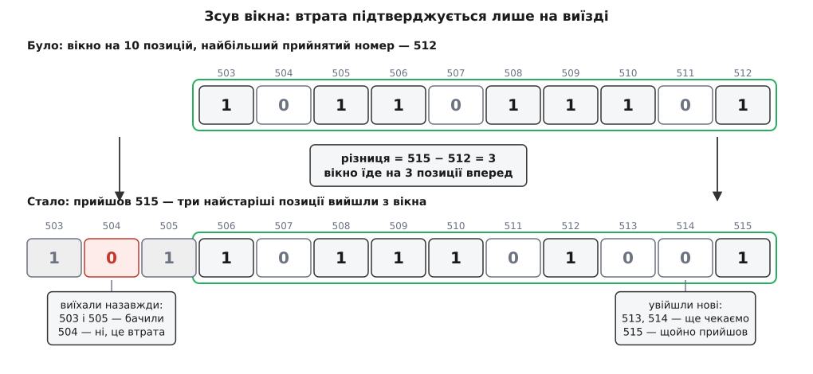

# ⚙️ Приймальне вікно на 64 біти: код, що за сталий час розрізняє нову датаграму, запізнілу й дубль

Приймач на UDP, отримавши датаграму, мусить іще до передачі вмісту застосункові відповісти собі на питання «я це вже бачив?» — бо від відповіді залежить, оновлювати стан чи мовчки викинути. Нижче — робочий приймальний бік на C: один 32-бітний номер, один 64-бітний регістр, жодної алокації, жодного циклу по історії й чесні лічильники втрат, дублів і перестановок.

## Що саме має вміти приймач

Домовмося про вхід і вихід точно — половина помилок у такому коді береться з нечіткого контракту.

На вході — беззнаковий 32-бітний номер, який відправник кладе в кожну датаграму й збільшує на одиницю. [Сам номер, його місце в заголовку й ціна кожного зайвого байта — окрема розмова](topic:com-transport/sequence-numbering); нам досить того, що номер є, що він зростає й що після найбільшого значення повертається до нуля.

На виході — рівно одне з чотирьох рішень:

- **нова** — номер більший за все, що приходило досі; це найсвіжіші дані;
- **запізніла** — номер менший за найбільший бачений, але саме цього номера ще не було: датаграма законна, просто прийшла не в тому порядку;
- **дубль** — цей номер уже приймали;
- **надто стара** — номер настільки давній, що приймач уже не пам'ятає, бачив він його чи ні; розсудити неможливо, тож відкидаємо.

Три обмеження роблять задачу цікавою. Робота на одну датаграму має бути сталою, без циклу по номерах: інакше сплеск трафіку перетворить приймач на найповільніше місце системи. Пам'ять теж стала й наперед відома: приймач може працювати місяцями, а структура, що росте з кількістю датаграм, рано чи пізно з'їсть усе. І третє — жодного припущення про те, з якого номера почне відправник: він може стартувати з одиниці, а може з випадкового числа.

## Ідея: найбільший номер плюс одна маска

Щоб упізнати дубль, треба пам'ятати, які номери вже приходили. Пам'ятати всі не вийде, та й не треба: перестановка в мережі має обмежену глибину, тож датаграма, старша за найновішу на кількадесят номерів, — це або дубль, або щось настільки запізніле, що його вміст усе одно нікому не потрібен. Отже, пам'ять може бути короткою — на останні N номерів.

Уся структура з цього й випливає. Тримаємо `top` — найбільший прийнятий номер — і 64-бітну маску `bits`, у якій **біт k означає «номер `top − k` уже бачили»**. Біт 0 — це сам `top`, і після прийняття він завжди стоїть.

Такий відлік від `top`, а не від нуля чи від якогось абсолютного початку, — не примха. Він робить перевірку арифметикою над однією різницею: щоб дізнатися, чи бачили номер `s`, треба порахувати `top − s` і подивитися на біт з таким індексом. Ніякого пошуку, ніякого ділення, ніякого перетворення номера в адресу комірки.

Ширина 64 біти взята не навмання. У стандарті IPsec ESP (RFC 4303) точнісінько таке вікно захищає від переграних пакетів, і специфікація вимагає підтримувати щонайменше 32 позиції, а вікно на 64 називає бажаним і рекомендує як типове. Для звичайного застосунку це до того ж рівно один машинний регістр — маска, зсув і перевірка біта коштують по одній інструкції.

## Скільки один від одного: різниця по колу

Порівнювати номери як звичайні числа не можна: лічильник скінченний і після найбільшого значення повертається до нуля, тож свіжий номер 3 виявиться «меншим» за старий 4294967290. Правильне порівняння — різниця в [доповняльному коді](topic:hw-arch/twos-complement).

```c
#include <stdint.h>

/* Наскільки seq попереду top. Додатне — попереду, від'ємне — позаду.
   Розширення до 64 біт робить безпечним подальше заперечення. */
static int64_t seq_ahead(uint32_t seq, uint32_t top)
{
    uint32_t raw = seq - top;                 /* різниця за модулем 2³², без переповнення */
    return (raw & 0x80000000u) ? (int64_t)raw - 4294967296LL : (int64_t)raw;
}
```

Беззнакове віднімання `seq - top` дає відстань по колу від `top` до `seq`. Якщо ця відстань менша за півколо, номер попереду; якщо більша — насправді ми зайшли з іншого боку, тобто номер позаду, і різниця дорівнює `raw − 2³²`. Саме це й робить умова: старший біт `raw` — це і є перевірка «більше чи менше за півколо».

Той самий результат дає коротший запис `(int32_t)(seq - top)`, і його пишуть частіше. Він покладається на дві речі: що приведення завеликого беззнакового значення до знакового типу дає обгортання за модулем (у C17 це поведінка, визначена реалізацією, хоча всі поширені компілятори роблять саме так) і що `uint32_t` не просунеться до ширшого знакового типу перед відніманням — а це вже залежить від розрядності `int` на платформі. [Правила просування цілих типів у C підступні саме тим, що спрацьовують мовчки](topic:sf-lang/integer-promotion), тому в коді нижче стоїть довший, але безумовно визначений варіант.

## Структура і головна функція

```c
#include <stdint.h>
#include <string.h>

#define ARW_BITS 64

typedef enum {
    ARW_NEW,        /* новіша за все бачене */
    ARW_LATE,       /* запізніла, але ще не бачена — законна */
    ARW_DUPLICATE,  /* цей номер уже приймали */
    ARW_TOO_OLD     /* позаду вікна — розсудити неможливо */
} arw_verdict;

typedef struct {
    uint32_t top;        /* найбільший прийнятий номер */
    uint32_t first;      /* найменший номер, який ми взагалі бачили */
    uint64_t bits;       /* біт k ⇔ «номер top − k бачили»; біт 0 завжди 1 */
    int      started;    /* чи ініціалізовано першою датаграмою */

    uint64_t accepted;   /* прийнято унікальних номерів */
    uint64_t lost;       /* підтверджені втрати */
    uint64_t duplicate;  /* відкинуто як дублі */
    uint64_t reordered;  /* прийнято не по порядку */
    uint64_t too_old;    /* відкинуто як надто старі */
} arw;

void arw_init(arw *w) { memset(w, 0, sizeof *w); }
```

Лічильник одиничних бітів — єдина операція, важча за зсув. На всіх сучасних процесорах це одна інструкція, [і компілятор дістає її вбудованою функцією](topic:sf-algorithms/popcount); запасний варіант потрібен лише для чужих компіляторів.

```c
static int arw_popcount64(uint64_t x)
{
#if defined(__GNUC__) || defined(__clang__)
    return __builtin_popcountll(x);
#else
    x = x - ((x >> 1) & 0x5555555555555555ULL);
    x = (x & 0x3333333333333333ULL) + ((x >> 2) & 0x3333333333333333ULL);
    x = (x + (x >> 4)) & 0x0F0F0F0F0F0F0F0FULL;
    return (int)((x * 0x0101010101010101ULL) >> 56);
#endif
}

/* Скільки позицій вікна відповідають номерам, які справді існували.
   Одразу після старту вікно «висить» над номерами, яких відправник ще
   не слав, — без цієї поправки вони порахуються втраченими. */
static unsigned arw_live(const arw *w)
{
    uint64_t span = (uint64_t)(uint32_t)(w->top - w->first) + 1;
    return span < ARW_BITS ? (unsigned)span : ARW_BITS;
}
```

Тепер сама перевірка. Три гілки: вперед, назад у межах вікна, назад за межі вікна.

:::tabs
```c
arw_verdict arw_update(arw *w, uint32_t seq)
{
    if (!w->started) {                    /* перша датаграма задає точку відліку */
        w->started  = 1;
        w->top      = seq;
        w->first    = seq;
        w->bits     = 1;
        w->accepted = 1;
        return ARW_NEW;
    }

    int64_t d = seq_ahead(seq, w->top);

    if (d > 0) {                          /* новіша: вікно їде вперед на d позицій */
        unsigned live = arw_live(w);
        if (d < ARW_BITS) {
            unsigned stay   = ARW_BITS - (unsigned)d;   /* позицій лишається у вікні */
            uint64_t fallen = w->bits >> stay;          /* зсув 1..63 — законний */
            unsigned real   = live > stay ? live - stay : 0;
            w->lost += real - (unsigned)arw_popcount64(fallen);
            w->bits <<= (unsigned)d;                    /* зсув 1..63 — законний */
            w->bits |= 1;
        } else {
            /* Стрибок ширший за вікно: старий вміст виїхав цілком, а ще
               d − 64 номерів проскочили вікно наскрізь.
               Зсув на 64 і більше в C — невизначена поведінка, тож не зсуваємо. */
            w->lost += (live - (unsigned)arw_popcount64(w->bits))
                     + ((uint64_t)d - ARW_BITS);
            w->bits  = 1;
        }
        w->top = seq;
        w->accepted++;
        return ARW_NEW;
    }

    if (d <= -(int64_t)ARW_BITS) {        /* позаду вікна — пам'яті вже не лишилося */
        w->too_old++;
        return ARW_TOO_OLD;
    }

    unsigned k   = (unsigned)(-d);        /* 0..63 — відстань позаду top */
    uint64_t bit = (uint64_t)1 << k;      /* k ≤ 63 — законний зсув */

    if (w->bits & bit) {
        w->duplicate++;
        return ARW_DUPLICATE;
    }

    if (k >= arw_live(w))                 /* номер із-перед нашого старту */
        w->first = seq;
    w->bits |= bit;
    w->accepted++;
    w->reordered++;
    return ARW_LATE;
}
```
```rust
const BITS: i64 = 64;

#[derive(Clone, Copy, PartialEq, Debug)]
enum Verdict { New, Late, Duplicate, TooOld }

#[derive(Default)]
struct Window {
    top: u32, first: u32, bits: u64, started: bool,
    accepted: u64, lost: u64, duplicate: u64, reordered: u64, too_old: u64,
}

impl Window {
    fn live(&self) -> i64 {
        (self.top.wrapping_sub(self.first) as i64 + 1).min(BITS)
    }

    fn update(&mut self, seq: u32) -> Verdict {
        if !self.started {
            self.started = true;
            self.top = seq;
            self.first = seq;
            self.bits = 1;
            self.accepted = 1;
            return Verdict::New;
        }

        let d = seq.wrapping_sub(self.top) as i32 as i64;

        if d > 0 {
            let live = self.live();
            // checked_shl повертає None замість зсуву на 64 і більше — те, що в C
            // є невизначеною поведінкою, тут стає звичайною гілкою match
            match self.bits.checked_shl(d as u32) {
                Some(shifted) => {
                    let stay = BITS - d;                    // позицій лишається у вікні
                    let fallen = self.bits >> stay;         // d старших позицій
                    let real = (live - stay).max(0);
                    self.lost += (real - fallen.count_ones() as i64) as u64;
                    self.bits = shifted | 1;
                }
                None => {
                    self.lost += (live - self.bits.count_ones() as i64) as u64
                               + (d - BITS) as u64;
                    self.bits = 1;
                }
            }
            self.top = seq;
            self.accepted += 1;
            return Verdict::New;
        }

        if d <= -BITS {
            self.too_old += 1;
            return Verdict::TooOld;
        }

        let k = (-d) as u32;
        let bit = 1u64 << k;
        if self.bits & bit != 0 {
            self.duplicate += 1;
            return Verdict::Duplicate;
        }

        if k as i64 >= self.live() {
            self.first = seq;
        }
        self.bits |= bit;
        self.accepted += 1;
        self.reordered += 1;
        Verdict::Late
    }
}
```
:::

Гілки на Rust ті самі, але зсув на завелику кількість позицій там не тихе лихо, а `None` з `checked_shl` — мова робить пастку видимою в типі. У режимі зневадження звичайний `<<` на 64 просто панікує, тобто помилка виявляється на першому ж стрибку, а не через місяць у полі.

## Чому втрату можна визнати лише на виїзді

Найспокусливіший спосіб рахувати втрати — найгірший. Виглядає він так: прийшла нова датаграма, різниця з попередньою `d`, отже втрачено `d − 1`. Уже за хвилину роботи такий лічильник бреше в рази, бо кожна перестановка спершу виглядає прогалиною, а потім прогалина заповнюється — і зменшувати лічильник назад доводиться заднім числом, плутаючись, яку саме прогалину заповнили.

Вікно дає точну відповідь безкоштовно, треба лише поставити питання в правильний момент. **Доки номер усередині вікна, він не втрачений, а невідомий**: біт нуль, і датаграма ще цілком може прийти. Момент істини — виїзд. Коли вікно рухається вперед і позиція виходить за його край з нулем, вона більше ніколи не зможе змінитися: навіть якщо та датаграма прилетить, вердикт буде «надто стара». Ось тоді, і тільки тоді, це підтверджена втрата.

Звідси й формула в коді. Зсув на `d` позицій виштовхує за край `d` найстаріших; серед них `arw_popcount64(fallen)` мають одиницю, а решта — нулі, і саме їх додаємо до `lost`. Поправка `real` відкидає ті позиції, що відповідають номерам, яких відправник ніколи не слав. Від'ємним цей вираз стати не може: біт стоїть тільки на позиції реального номера, тож одиниць серед виїжджаючих не більше, ніж живих позицій серед них.

Гілка стрибка ширшого за вікно рахує те саме, тільки доданків стає два. Виїжджають усі живі позиції одразу, тож нулів серед них `live − popcount(bits)`. А номери від `top + 1` до `seq − 64` не потрапляють у нове вікно взагалі: воно накриває лише останні 64, і в цих номерів немає навіть шансу колись прийти — вони втрачені відразу, усі `d − 64` штук.

> 🔧 **Навіщо це.** Лічильник, що бреше, гірший за відсутній: за ним ухвалюють рішення — знижувати частоту передачі, перемикати канал, будити оператора. Приймач, який кричить про десять відсотків утрат там, де насправді лише перестановка на дві позиції, змусить команду тижнями шукати проблему в мережі, якої там немає. Відкладене визнання втрати коштує один зайвий рядок і робить число довірливим.

## Ручний прогін одного зсуву



*Виїхавши за край, позиція більше не змінить свого стану — тільки тут нуль перетворюється на підтверджену втрату; нулі всередині вікна ще нічого не означають.*

Візьмімо вікно на десять позицій — рахувати легше, а логіка та сама. Найбільший прийнятий номер 512, у вікні сліди номерів 503–512, причому 504, 507 і 511 ще не приходили. Прилітає 515.

**Умова: `top` = 512, вікно 10 позицій, `first` давно позаду, приходить `seq` = 515.**

```text
d     = 515 − 512 = 3               → нова, вікно їде на 3
stay  = 10 − 3 = 7                  → сім позицій лишаються у вікні
виїжджають позиції 7, 8, 9          → номери 505, 504, 503
серед них одиниць: 505 і 503 = 2
lost += 3 − 2 = 1                   → підтверджена втрата: 504
нове вікно: 506…515
входять 513 і 514 нулями            → ще не втрата, ще чекаємо
```

Номери 507 і 511 лишилися у вікні нулями й у лічильник не потрапили — правильно: вони ще можуть прийти. Число 504 більше не має шансів і стає втратою назавжди.

## Хто виграє: політика для даних-стану

Вікно відповідає на питання «чи бачив я цей номер». Питання «чи брати цей вміст» — інше, і плутанина між ними породжує помилку, яку важко впіймати очима: запізніла телеметрія затирає свіжішу, і апарат на карті стрибає назад.

Для даних, де кожна датаграма замінює попередню — координати, температура, положення джойстика, — правило одне: **новіше виграє**. Запізніла датаграма законна з погляду вікна й водночас непотрібна з погляду застосунку.

```c
typedef struct { float lat, lon, alt; } fix;

typedef struct {
    arw win;
    fix cur;
    int has_fix;
} state_sink;

void on_datagram(state_sink *s, uint32_t seq, const fix *f)
{
    switch (arw_update(&s->win, seq)) {
    case ARW_NEW:                       /* свіжіше за все бачене — беремо */
        s->cur = *f;
        s->has_fix = 1;
        break;
    case ARW_LATE:                      /* законна, але вміст уже застарів */
    case ARW_DUPLICATE:
    case ARW_TOO_OLD:
        break;                          /* стан не чіпаємо */
    }
}
```

Один `case ARW_NEW` — і вся політика. Зверніть увагу, що `ARW_LATE` тут потрібен окремо від `ARW_DUPLICATE` не для рішення (обидва нічого не змінюють), а для статистики: перше означає перестановку в мережі, друге — повтор, і причини в них різні.

## Прогін із втратами, дублями й перестановкою

Тест має ганяти не окремі випадки, а одну послідовність, у якій усі чотири вердикти трапляються впереміш — саме так і поводиться справжня мережа. Наприкінці лишається невидана обіцянка: частина номерів досі сидить у вікні нулями. Щоб закрити рахунок, потрібна фінальна функція.

```c
/* Визнати втраченими всі номери, що досі висять у вікні нулями.
   Викликати РІВНО ОДИН раз, коли потік завершено. */
uint64_t arw_flush(arw *w)
{
    if (!w->started) return 0;
    unsigned live = arw_live(w);
    /* зсув на 64 — та сама невизначена поведінка, тому окрема гілка */
    uint64_t mask = (live >= ARW_BITS) ? ~(uint64_t)0
                                       : (((uint64_t)1 << live) - 1);
    uint64_t pending = live - (uint64_t)arw_popcount64(w->bits & mask);
    w->lost += pending;
    return pending;
}
```

```c
#include <stdio.h>
#include <assert.h>

int main(void)
{
    /* Відправник слав 1…200 поспіль. Мережа зробила з цього таке:
       4 обігнала 3; 4 прилетіла двічі; 7 обігнала 6; 12 обігнала 9 і 5;
       далі величезний стрибок на 200, а останньою — давно списана 5. */
    static const uint32_t wire[] = {
        1, 2, 4, 3, 4, 7, 6, 12, 9, 5, 200, 5
    };

    arw w;
    arw_init(&w);
    for (size_t i = 0; i < sizeof wire / sizeof wire[0]; i++)
        arw_update(&w, wire[i]);
    arw_flush(&w);

    printf("прийнято %llu, втрачено %llu, дублів %llu, "
           "перестановок %llu, надто старих %llu\n",
           (unsigned long long)w.accepted,  (unsigned long long)w.lost,
           (unsigned long long)w.duplicate, (unsigned long long)w.reordered,
           (unsigned long long)w.too_old);

    assert(w.accepted  == 10);   /* 1,2,3,4,5,6,7,9,12,200 */
    assert(w.duplicate == 1);    /* друга четвірка */
    assert(w.reordered == 4);    /* 3, 6, 9 і 5 прийшли після новіших */
    assert(w.too_old   == 1);    /* остання п'ятірка — уже поза вікном */
    assert(w.lost      == 190);

    /* Головна перевірка: рахунок мусить зійтися до одиниці.
       Від найменшого баченого номера до найбільшого — 200 номерів,
       і кожен із них або прийнятий, або визнаний утраченим. */
    assert(w.accepted + w.lost == 200);
    return 0;
}
```

Остання перевірка — найцінніша, і саме її варто лишати в тесті назавжди. Вона не звіряє окремі числа з очікуваннями, а стверджує **інваріант**: жоден номер не може ні загубитися з обліку, ні порахуватися двічі. Будь-яка помилка в межах вікна — забутий нуль на виїзді, зайва одиниця в `real`, зсув не на ту кількість позицій — негайно ламає цю рівність, хай на скількох завгодно випадкових послідовностях.

Варто простежити, звідки береться 190. Стрибок з 12 на 200 виносить із вікна три нулі (номери 8, 10, 11) і додає 124 номери, що проскочили вікно наскрізь — від 13 до 136. Разом 127. Далі `arw_flush` визнає втраченими 63 номери, що лишилися у вікні нулями, — від 137 до 199. Разом 190, а з десятьма прийнятими — рівно 200.

## Скільки це коштує

Робота на датаграму — стала й дуже мала: одне віднімання, одне порівняння, один-два зсуви, одна операція `popcount` і кілька додавань. Жодного циклу, жодної залежності від розміру вікна, жодного звернення до пам'яті поза самою структурою. Структура займає 64 байти, і на власне вікно з них іде 16: два номери й маска, решта — п'ять лічильників. Її тримають по одній на кожного відправника в масиві або хеш-таблиці, тож навіть тисяча співрозмовників коштує 64 кілобайти.

Вікно ширше за машинне слово змінює картину. Маска стає масивом, зсув на `d` позицій — переміщенням цілого масиву, і ціна перевірки перестає бути сталою: при вікні на 4096 позицій кожен зсув перебирає 64 слова. Задачу розв'язали окремим стандартом — RFC 6479 «IPsec Anti-Replay Algorithm without Bit Shifting» (Сянян Чжан і Тіна Цоу, січень 2012). Ідея в тому, щоб тримати кільце блоків по N бітів і замість зсуву переставляти індекс блока, чистячи лише ті блоки, через які вікно щойно переїхало; платою є надлишок — фактично захищений діапазон трохи менший за виділену пам'ять. Доки вікна вистачає 64 позицій, усього цього не потрібно.

## Пастки

**Зсув на 64 і більше — невизначена поведінка.** Це найважливіша пастка всієї конструкції, і вона тиха. Стандарт C прямо каже: якщо праворуч від оператора зсуву стоїть від'ємне число або число, не менше за ширину просунутого лівого операнда, поведінка невизначена (це формулювання винесене в правило INT34-C стандарту безпечного кодування CERT C). Практика ще підступніша за стандарт: інструкція зсуву на x86-64 бере з лічильника лише молодші шість бітів, тому `bits << 64` перетворюється на `bits << 0` — маска лишається незмінною, вікно нібито поїхало на 64 позиції вперед, а всі старі позначки лишилися на місці. Наслідок — приймач починає вважати дублями зовсім нові датаграми й тихо викидає їх годинами. Інші архітектури поводяться інакше: десь такий зсув дає нуль, десь лічильник маскується за власним правилом — і саме через цей розбрід стандарт нічого й не обіцяє. А з увімкненою оптимізацією компілятор має право зробити з цим місцем узагалі що завгодно, [бо невизначена поведінка дозволяє йому припустити, що така гілка недосяжна](topic:sf-lang/undefined-behavior). Тому в коді вище стрибок ширший за вікно — окрема гілка без жодного зсуву, а маска у `arw_flush` будується через тернарний оператор, а не через `(1 << live) - 1`.

**Ініціалізація нулями замість першої датаграми.** Якщо просто занулити структуру й піти в загальну гілку, перша ж датаграма з номером 40000 дасть різницю 40000 від уявного `top` = 0 — і `lost` стрибне на сорок тисяч ще до того, як застосунок отримав перший байт. А відправники з добрих міркувань часто починають нумерацію не з одиниці, а з випадкового числа, тож стрибок буде до двох мільярдів. Звідси прапорець `started`: перша датаграма не порівнюється ні з чим, а задає точку відліку. Поле `first` розв'язує другу половину тієї ж проблеми — доки від старту минуло менше 64 номерів, частина вікна висить над номерами, яких ніхто не слав, і без поправки `real` вони теж порахувалися б утратами.

**Перезапуск відправника з нуля.** Апарат перезавантажився й почав нумерацію наново, а приймач тримає `top` = 50000. Різниця виходить близько мінус п'ятдесяти тисяч, вердикт — «надто стара», і так буде для кожної наступної датаграми: канал живий, дані йдуть, приймач мовчки викидає все й ніколи сам із цього не вийде. Чесний розв'язок — покласти в заголовок **епоху**: випадкове число, яке відправник обирає при старті й не змінює до наступного перезавантаження.

```c
typedef struct { uint32_t epoch, seq; } hdr;

typedef struct {
    state_sink sink;
    uint32_t   epoch;
    int        have_epoch;
} peer;

void on_packet(peer *p, const hdr *h, const fix *f)
{
    if (!p->have_epoch || h->epoch != p->epoch) {   /* відправник перезапустився */
        arw_init(&p->sink.win);                     /* нумерація починається наново */
        p->epoch = h->epoch;
        p->have_epoch = 1;
    }
    on_datagram(&p->sink, h->seq, f);
}
```

Якщо формат на дроті вже зафіксований і місця під епоху нема, лишається евристика: кілька десятків підряд відкинутих «надто старих», які при цьому **зростають самі між собою**, — ознака живого потоку з іншою нумерацією, а не купи старих дублів, що прилітають урозсип. Умова зростання тут обов'язкова, інакше запізніла пачка справжніх старих датаграм скине вікно на рівному місці. Ціна евристики — кілька десятків утрачених датаграм на кожен перезапуск, і це чесна ціна за відсутнє поле.

**Замалий номер.** Спокуса заощадити два байти й узяти `uint16_t` обертається тим, що півколо, на якому тримається порівняння, звужується до 32768 номерів.

**Умова: потік 1000 датаграм на секунду, розрив зв'язку на 40 секунд.**

```text
32-бітний номер: півколо = 2³¹ = 2147483648
                 час до збою = 2147483648 / 1000 ≈ 24.8 доби

16-бітний номер: півколо = 2¹⁵ = 32768
                 час до збою = 32768 / 1000 ≈ 32.8 с   ← коротше за розрив
```

Після сорока секунд мовчання шістнадцятибітний лічильник відправника перейде півкола, різниця прочитається як від'ємна, і приймач сприйме свіжий потік як старий. Тридцять два біти дають запас у двадцять чотири доби для того ж потоку — саме тому їх і беруть за замовчуванням, а не тому, що «так заведено».

**Вікно саме по собі не захищає від зловмисника.** Назва «антиреплейне» прийшла з криптографії, а разом із нею приходить і хибне відчуття безпеки. У IPsec це вікно працює **після** перевірки коду автентичності: номер підписаний разом із рештою пакета, тож підробити його не вийде. Гола ж конструкція над UDP довіряє номеру беззастережно — і нападник, надіславши одну датаграму з номером `top + 2000000`, миттєво жене вікно вперед і змушує приймач відкидати всі справжні датаграми як надто старі. Це відмова в обслуговуванні ціною одного пакета. Якщо потік треба захищати від умисного втручання, номер має бути накритий [кодом автентичності повідомлення](topic:sf-security/hmac) і перевірятися **до** входу у вікно; [самі схеми захисту від переграних повідомлень мають власні вимоги, ширші за одну бітову маску](topic:sf-security/replay-protection). Без цього все написане вище лишається тим, чим воно є: інструментом проти примх мережі, а не проти людини.
