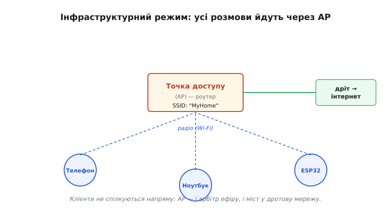
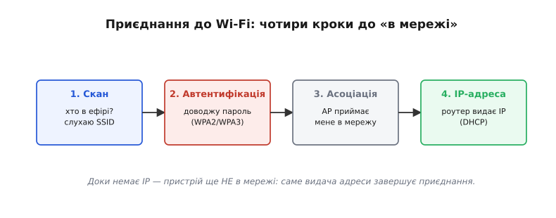
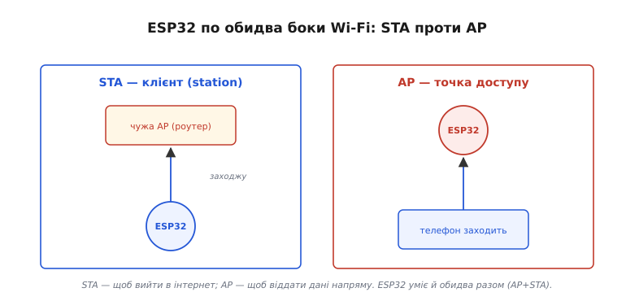
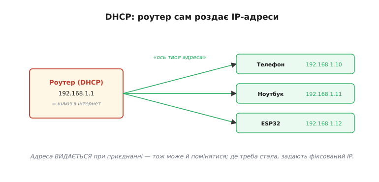
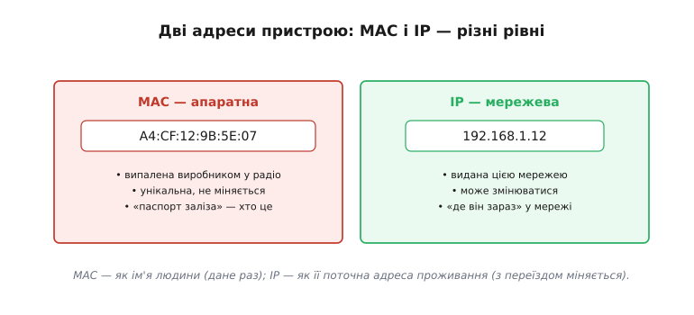
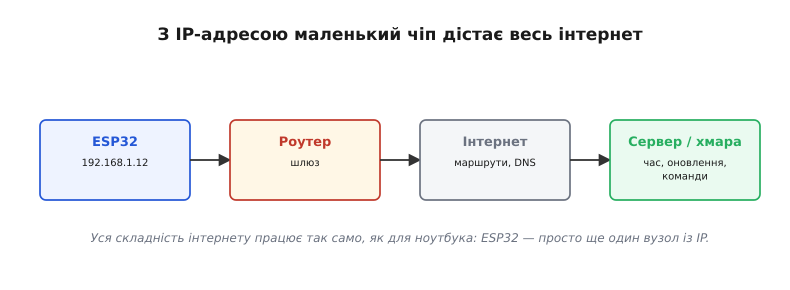
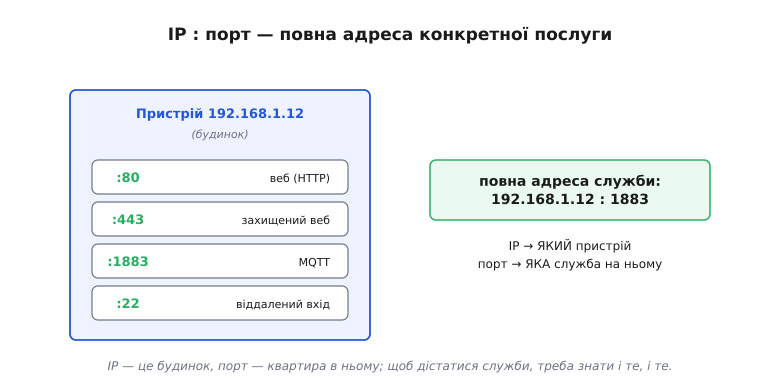

# Wi-Fi

Wi-Fi — це не просто «радіо», а ціла **система** поверх нього: спосіб під'єднати пристрій до мережі так, ніби він з'єднаний дротом, і дати йому повний доступ до інтернету. Сама назва нічого технічного не означає — її вигадало брендингове агентство, а народну розшифровку «wireless fidelity» приклеїли вже потім ([звідки взялася назва](topic:com-transport/wifi/hist-wifi-name.md)). За цим брендом стоїть родина стандартів **IEEE 802.11**, і весь обмін підпорядкований їм. Для розробника найцінніше тут — що вся складність радіо й мережі схована, і маленький чіп на кшталт ESP32 стає **повноцінним вузлом мережі** за кілька рядків коду. Щоб користуватися цим свідомо, розберімо ключові поняття: точку доступу, приєднання, режими чіпа й, головне, **IP-адресу**, з якої й відкривається весь інтернет.

### Інфраструктурний режим: усе через точку доступу

Звичайний Wi-Fi працює в **інфраструктурному** режимі: пристрої не говорять напряму один з одним, а всі підключаються до центрального вузла — **точки доступу** (англ. *access point*, AP), якою зазвичай є домашній роутер.


*Усі пристрої — **клієнти** — під'єднуються по радіо до **точки доступу**, а вона з'єднує їх між собою й виводить у решту мережі (часто дротом — в інтернет). Клієнти не спілкуються напряму: усе йде через AP. Ім'я мережі — **SSID** — це те, що видно у списку Wi-Fi.*

Точка доступу — це водночас **хаб** і **міст**: вона і керує тим, хто в мережі, і з'єднує радіо-світ із дротовим (виходом в інтернет). Звідси й перше практичне поняття — **SSID** (англ. *Service Set Identifier*, «ідентифікатор набору служб»), ім'я мережі: саме його обирають у списку Wi-Fi і вказують пристрою, до якої мережі приєднатися.

### Як приєднатися: скан, пароль, IP

Приєднання до Wi-Fi — це коротка послідовність кроків, однакова і для телефона, і для ESP32.


*Спершу **скан** — знайти доступні мережі (їхні SSID лунають в ефірі). Тоді **автентифікація** — довести, що знаєш пароль (шифрування WPA2/WPA3). Далі **асоціація** — AP приймає клієнта в мережу. І нарешті **IP-адреса** — роутер видає пристрою адресу (через DHCP), і лише тоді той по-справжньому «в мережі».*

Пароль перевіряє не довільна схема, а **WPA2** чи новіший **WPA3** (англ. *Wi-Fi Protected Access*) — стандартні протоколи захисту, що шифрують ефір; саме вони не дають сусідові ні підключитися, ні підслухати твій трафік. У коді ESP32 усе це зазвичай стискається в один рядок на кшталт `WiFi.begin("MyHome", "пароль")` — а решту (скан, рукостискання, шифрування) робить вбудований стек. Важливий нюанс: **доки пристрій не отримав IP-адресу, він ще не «в мережі»**. Саме видача IP завершує приєднання.

### Два режими чіпа: STA і AP

Чіп на кшталт ESP32 може бути **по обидва боки** Wi-Fi — і це не дрібниця, а основа багатьох практичних рішень.


*У режимі **STA** (англ. *station*, клієнт) ESP32 приєднується до наявної мережі — точно як телефон до домашнього Wi-Fi. У режимі **AP** (точка доступу) він **сам** створює мережу, і вже інші пристрої заходять до нього. ESP32 уміє навіть обидва режими одночасно (AP+STA).*

Це дуже практично. **STA** потрібен, щоб вийти в інтернет — пристрій стає клієнтом домашньої мережі. **AP** зручний, коли треба віддати дані **напряму**, без роутера: наприклад, ESP32 піднімає власну мережу й сторінку налаштувань, до якої під'єднуєшся телефоном, щоб ввести пароль домашнього Wi-Fi. А режим **AP+STA** дозволяє і бути в домашній мережі, і водночас приймати прямі підключення.

### На яких частотах це працює

Радіо Wi-Fi живе у вільних (неліцензованих) діапазонах — там, де не треба дозволу регулятора. Історично перший і досі найпоширеніший — **2.4 ГГц** (точніше, смуга ISM 2.400–2.4835 ГГц): далеко б'є, легко проходить крізь стіни, але тісний і людний — його ділять Bluetooth, бездротові миші, навіть мікрохвильові печі. Пізніше додали **5 ГГц**: там значно більше місця й менше завад, але вища частота гірше проходить крізь перешкоди, тож дальність коротша.

Смугу 2.4 ГГц розбито на пронумеровані **канали** через кожні 5 МГц, але сам сигнал Wi-Fi займає близько 20–22 МГц — тобто **ширший за відстань між сусідніми каналами**, і вони перекриваються. Тому на практиці радять канали **1, 6 та 11**: лише ця трійка не накладається одна на одну, і три такі мережі поруч не заважають сусідам. Скільки каналів узагалі дозволено (й чи доступний, скажімо, 14-й) залежить від країни — радіоефір регулюють по-різному.

Усередині каналу дані несе не одна несуча, а сотня вузьких піднесучих одразу — схема **OFDM** (англ. *Orthogonal Frequency-Division Multiplexing*, «ортогональне частотне ущільнення»). Сам цей принцип старший за Wi-Fi; у стандарт 802.11 його ввели з версією 802.11a (5 ГГц, 1999), а до 2.4 ГГц він прийшов з 802.11g (2003). OFDM добре тримається в реальному ефірі, де сигнал приходить кількома шляхами з відбиттями, — і саме розв'язання цієї задачі багатопроменевості [почалося не в мережах, а в радіоастрономії](topic:com-transport/wifi/hist-csiro-ofdm.md).

> 🔧 **Навіщо це.** Коли ESP32 «бачить» Wi-Fi погано, винна часто не програма, а ефір. Перевір діапазон: дешеві модулі (як базовий ESP32) працюють **лише на 2.4 ГГц** — якщо роутер роздає гостьову мережу тільки на 5 ГГц, пристрій її просто не побачить. А якщо зв'язок рветься в людному місці — спробуй розвести роутери по каналах 1/6/11, щоб вони не глушили один одного.

### IP-адреси й DHCP

Тепер — про ту саму IP-адресу. Коли пристрій приєднується, роутер автоматично видає йому **IP-адресу** (англ. *Internet Protocol address*) — номер, за яким його знаходять у мережі. Робить це служба **DHCP** (англ. *Dynamic Host Configuration Protocol*, «протокол динамічного налаштування вузла»), вбудована в роутер.


*Роутер (зазвичай сам із адресою 192.168.1.1 — це **шлюз** в інтернет) роздає приєднаним пристроям адреси: телефону 192.168.1.10, ноутбуку .11, ESP32 .12. Так кожен отримує свою адресу в локальній мережі автоматично.*

Локальні адреси виду **192.168.x.x** (є й інші приватні діапазони) роздаються в межах твоєї мережі; адреса .1 зазвичай належить самому роутеру й слугує **шлюзом** — воротами в інтернет. Один важливий наслідок: оскільки IP **видається** при приєднанні, він може **мінятися** — пристрій, переприєднавшись, дістане іншу адресу. Тому, коли потрібна стала адреса (щоб до пристрою завжди можна було звернутися), задають **фіксований** IP.

### Дві адреси: MAC і IP

Тут варто розрізнити дві зовсім різні «адреси», які має пристрій, бо їх часто плутають.


***MAC-адреса** (як-от A4:CF:12:9B:5E:07) зашита виробником у саме радіо, унікальна й не міняється — «паспорт заліза». **IP-адреса** (192.168.1.12) видається мережею й може змінюватися — «адреса в цій мережі». Це два різні рівні.*

Гарна аналогія: **MAC** (англ. *Media Access Control*, «керування доступом до середовища») — як ім'я людини, незмінне й дане раз, а **IP** — як її поточна адреса проживання, яка змінюється з переїздом. MAC зашита в чіп назавжди й унікальна на весь світ; IP залежить від того, у якій мережі пристрій зараз. Маршрутизація по інтернету працює з **IP**-адресами, а [MAC потрібен для доставки в межах однієї локальної ланки](topic:com-transport/mac-ip-arp). Обидві потрібні, але на різних рівнях.

### З IP відкривається весь інтернет

І ось головне диво Wi-Fi. Щойно пристрій отримав IP-адресу, він користується тим самим **TCP/IP**, що й будь-який комп'ютер, — і йому стає доступний **весь інтернет**.


*ESP32 (192.168.1.12) через роутер-шлюз виходить в інтернет, а звідти — до сервера чи хмари. З IP-адресою маленький чіп шле дані в хмару, тягне точний час, оновлення, команди — як повноцінний учасник мережі. Уся складність інтернету (маршрути, DNS, сервери) працює так само, як для ноутбука.*

Радіо тут перетворюється на **ворота** в мережу. Те, що було копійчаним мікроконтролером, тепер може звертатися до серверів по всьому світу: надсилати телеметрію в хмару, отримувати команди, синхронізувати час, завантажувати оновлення. І все це — стандартними засобами інтернету, бо для мережі ESP32 — просто ще один вузол із IP-адресою. Саме тому Wi-Fi-пристрій так легко зробити «розумним»: не треба винаходити зв'язок, досить підключитися до наявної інфраструктури.

### IP : порт = адреса послуги

Лишилася одна деталь, без якої картина неповна. IP-адреса доводить тебе до **пристрою**, але на одному пристрої може працювати **багато** служб одразу. Яку з них ти хочеш? На це відповідає **порт**.


*Повна адреса служби — це IP **і** порт: 192.168.1.12:1883. IP (192.168.1.12) каже, **який пристрій**; порт (1883) — **яка служба** на ньому. Приклади: порт 80 — веб (HTTP), 1883 — MQTT, 22 — віддалений вхід, або власний номер для власної служби.*

Аналогія проста: **IP — це будинок, а порт — квартира** в ньому. Щоб дістатися конкретної служби, треба знати і те, і те. Стандартні служби мають усталені порти (веб — 80, захищений веб — 443, MQTT — 1883), а для власного протоколу обираєш будь-який вільний номер. Пара «IP:порт» — це повна адреса, за якою один пристрій звертається до конкретної служби на іншому.

### Приєднання в коді

Зберімо все докупи на живому прикладі. На ESP32 (фреймворк Arduino) приєднатися до мережі й переконатися, що пристрій справді «в мережі», — це лічені рядки. Уся суть теми тут видима: даємо SSID із паролем, **чекаємо на IP** і лише тоді працюємо далі.

**Умова:** під'єднати ESP32 до домашнього Wi-Fi і не рушати з місця, доки не отримано IP-адресу.

:::tabs
```cpp
#include <WiFi.h>

const char* SSID = "MyHome";
const char* PASS = "пароль";

void setup() {
    Serial.begin(115200);
    WiFi.mode(WIFI_STA);            // режим клієнта (station)
    WiFi.begin(SSID, PASS);         // скан + автентифікація + асоціація

    // чекаємо саме на IP: статус WL_CONNECTED настає з видачею адреси DHCP
    while (WiFi.status() != WL_CONNECTED) {
        delay(250);
        Serial.print('.');
    }
    Serial.print("\nIP: ");
    Serial.println(WiFi.localIP());   // напр. 192.168.1.12 — тепер ми в мережі
}
```
```micropython
import network
import time

SSID = "MyHome"
PASS = "пароль"

wlan = network.WLAN(network.STA_IF)   # режим клієнта (station)
wlan.active(True)
wlan.connect(SSID, PASS)              # скан + автентифікація + асоціація

# чекаємо саме на IP: isconnected() стає True з видачею адреси DHCP
while not wlan.isconnected():
    time.sleep_ms(250)
    print(".", end="")

print("\nIP:", wlan.ifconfig()[0])    # напр. 192.168.1.12 — тепер ми в мережі
```
:::

Розгляньмо ключове місце — умову циклу:

```
WiFi.status() == WL_CONNECTED   ⇄   роутер видав IP через DHCP
0.0.0.0                         →   адреси ще немає, працювати рано
```

Поки адреса `0.0.0.0` — стек ще не пройшов усі кроки приєднання, і будь-яка спроба відкрити з'єднання провалиться. Тому правильний шаблон — **не «після `WiFi.begin` одразу слати дані», а «слати, коли є IP»**. Щойно в `localIP()` з'явилася справжня адреса, пристрій — повноцінний вузол: відкривай з'єднання за потрібним **IP:порт** і працюй.

> 🔧 **Навіщо це.** Це базовий словник будь-якого мережевого пристрою. Підключаючи ESP32 до Wi-Fi, ти: даєш йому **SSID і пароль** (`WiFi.begin`), чекаєш, поки він отримає **IP** (інакше він ще не в мережі), і далі відкриваєш з'єднання за адресою **IP:порт** потрібного сервера. Якщо «не працює» — перевір саме ці кроки: чи приєднався (правильні SSID і пароль), чи отримав IP (а не 0.0.0.0), і чи правильні адреса й порт сервера. А для пристрою, до якого звертаються **ззовні**, подбай про сталу адресу — DHCP-IP може змінитися.

З Wi-Fi і IP пристрій стає вузлом мережі. Лишається ключове питання, від якого залежить надійність обміну: **як** саме доставляти дані по цій мережі — з гарантією чи якнайшвидше? Сам по собі радіоканал [доставляє пакети «як вийде» (best-effort), без гарантій](topic:com-transport/on-chip-radio) — і поверх нього мережа пропонує два різні характери доставки, [надійний потік TCP проти швидкого UDP](topic:com-transport/tcp-vs-udp). Вибір між ними визначає характер усього зв'язку.
