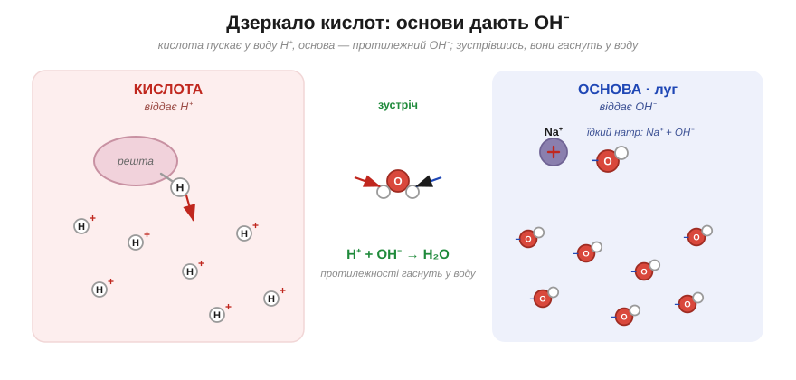
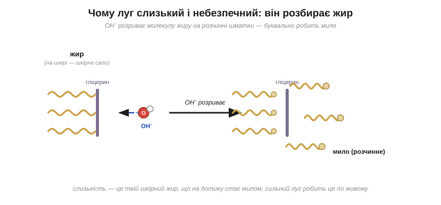

# Основи

Ось буденна загадка. Потри між пальцями розчин соди або просто мильну воду — і пальці стануть слизькі, наче намащені, хоча жодного масла на них немає. А тепер уяви ту саму слизькість, але вже від засобу для прочищання труб: там вона означає смертельну небезпеку для шкіри. Звідки ж береться це слизьке відчуття — і чому воно буває то цілком безпечним, то роз'їдливим?

Якщо кислота — це постачальник H⁺, то основа виявляється її точним дзеркалом. **Основа** у воді відпускає протилежну частинку — іон **OH⁻**, який називають гідроксидом: це пара з атомів Оксигену й Гідрогену, що має зайвий електрон, а тому заряджена «мінусом». Звідки він береться, найкраще видно на прикладах. Їдкий натр, він же каустична сода, — це просто Na⁺ і OH⁻, складені разом, тож у воді він сипле гідроксидом жменями. А нашатир — розчин аміаку — добуває OH⁻ хитрішим способом: видирає H⁺ у самих молекул води, а те, що від води лишається, і є OH⁻. Так само, відбираючи H⁺ у води, добувають гідроксид харчова та кальцинована сода — тільки значно лагідніше. Будь-яку основу, що розчиняється у воді, називають **лугом**.

> 🔗 Кислота — речовина, що у воді відпускає вільний іон Гідрогену H⁺ (голий протон); саме він робить розчин кислим на смак і роз'їдливим. Основа — її дзеркало. [читати](root:course/basic-chemistry/./acids-bases/acids/b)

*Основа — дзеркало кислоти: замість H⁺ вона пускає у воду OH⁻; а коли ці двоє зустрічаються, вони складаються у звичайну воду.*

Тепер про ту слизькість — бо це і є OH⁻ у дії, і механізм тут гарний. Гідроксид-іон накидається на жир і розриває його великі молекули на дрібніші, вже розчинні шматки — тобто буквально перетворює жир на мило. А коли луг торкається шкіри, він починає робити те саме з твоїм власним шкірним салом: оте слизьке відчуття на пальцях — це і є твій же жир, що просто на дотику перетворюється на мило. У слабкого лугу, як-от мило чи сода, це відбувається ледь-ледь і цілком безпечно. А сильний луг робить це швидко й по-живому, беручись роз'їдати вже й саму шкіру під салом, — ось чому з ним поводяться обережно, як із вогнем.

*OH⁻ розриває молекулу жиру на розчинні шматки — робить мило; на шкірі цим «милом» стає твій власний жир, тому сильний луг небезпечний.*

Складімо тепер обидва табори поруч, і проступить гарна симетрія: кислота кисла на смак і пускає у воду H⁺, а основа слизька на дотик і пускає OH⁻. І ось найголовніше: ці двоє — точні протилежності. Спробуй угадати, що станеться, коли вільний H⁺ зустріне у воді вільний OH⁻?.. Вони складаються докупи — плюс до мінуса — і дають звичайнісіньку воду, H₂O, гаснучи одне в одному. На цьому взаємознищенні й тримається вся боротьба кислот та основ — а зважити її числом дає змогу шкала pH.

> 🔗 pH — єдине число (від 0 до 14), що показує, чий бік перемагає: менше за 7 — править кислота (більше H⁺), більше за 7 — луг (більше OH⁻), рівно 7 — нічия, чиста вода. [читати](root:course/basic-chemistry/./acids-bases/ph-indicators/b)

> 🏠 Ось чому мило й сода так добре відмивають жирне: луг розбиває жирну плівку на розчинні шматочки — те саме, від чого він слизький на пальцях, у раковині працює вже на нашу користь.
