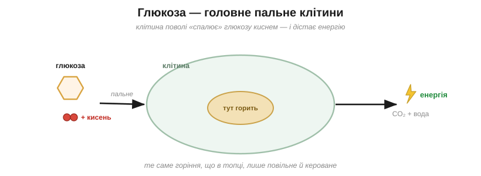
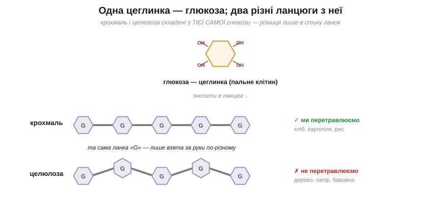

# Вуглеводи

<preknowlist>
- [Атоми й молекули](root:course/basic-chemistry/./atom/atoms-molecules/b) — речовина складена з атомів (Карбон, Оксиген…), що з'єднуються в молекули.
- [Карбон](root:course/basic-chemistry/./carbon-chains/carbon/b) — Карбон уміє зчіплюватися в довгі ланцюги, кістяк усієї органіки.
</preknowlist>

Скибка хліба тебе нагодує, а трісочка деревини — ні, хоча дерево й пшениця виросли, по суті, з того самого поля під тим самим сонцем. І ось що по-справжньому дивно: і хліб, і деревина складені з однієї й тієї самої цеглинки — з глюкози. Як та сама цеглинка буває то поживним обідом, то неїстівною трісткою?

Спершу придивімося до самої цеглинки. **Глюкоза** — це маленький цукор із шести Карбонів, згорнутий кільцем і рясно обвішаний групами –OH. До речі, тепер зрозуміло, чому цукор так легко розчиняється у воді: тих водолюбних груп –OH на ньому повно, а саме вони тягнуть молекулу в табір «подібне до води». Глюкоза — це головне пальне тіла: кожна клітина поволі «спалює» її киснем, добуваючи з неї енергію, а кров розносить її по всьому організму. Те, що в побуті звуть «цукром у крові», — це і є глюкоза.

> 🔗 Вода розчиняє те, що на неї схоже: молекули з водолюбними групами –OH охоче змішуються з нею, а жирне й неполярне — ні. [читати](root:course/basic-chemistry/./solutions/dissolution/b)

*Клітина поволі «спалює» глюкозу киснем — те саме горіння, що й у топці, лише м'яке й кероване: з нього тіло й бере енергію.*

А тепер зчепимо багато глюкоз в один довгий ланцюг — точнісінько як окремі ланки-намистини зчеплюються в довгий полімер. Якщо ланки з'єднати між собою одним способом, виходить **крохмаль** — саме так рослини складають енергію про запас у картоплі, рисі, зерні.

> 🔗 Полімер — це довгий ланцюг із багатьох однакових ланок-намистин, з'єднаних одна за одною; від способу зчеплення залежать властивості всього ланцюга. [читати](root:course/basic-chemistry/./carbon-chains/polymers/b)

І в нас є ферменти, заточені рвати рівно ці з'єднання, тож крохмаль ми спокійно перетравлюємо назад на глюкозу, тобто на пальне. А тепер та сама глюкоза, але ланки в ланцюзі повернуті й з'єднані трішки інакше — і це вже **целюлоза**: деревина, папір, бавовна, волокно рослин. Здавалося б, дрібний поворот у способі з'єднання — а наші ферменти-ножиці до нього вже не пасують, не можуть його розрізати. Тому целюлозу ми не перетравлюємо зовсім: вона проходить крізь нас наскрізь як клітковина. (А корови й терміти тримають у собі особливих мікробів, чиї ножиці те з'єднання таки ріжуть, — тому й здатні живитися самою травою та деревом.)

*Крохмаль і целюлоза складені з тієї самої ланки-глюкози; різниця лише в тому, як ланки взято за руки, — а від неї залежить, їжа це чи дерево.*

Спробуй тепер сам відповісти на загадку, з якої ми почали: чому ж хліб ми їмо, а трісочку ні, коли обидва — ланцюги з тієї самої глюкози?.. Бо вся справа не в тому, з чого вони складені (склад однаковий), а в тому, **як** саме ланки взято за руки: до одного способу з'єднання наші ферменти-ножиці підходять, а до іншого — ні. Одна цеглинка, дві долі, і вирішує спосіб зчеплення.

> 🏠 Хліб, рис і картопля — це крохмаль; вата, папір і бавовняна футболка — целюлоза; і те, і те — довгі ланцюги з тієї самої глюкози, тільки зчеплені по-різному.
