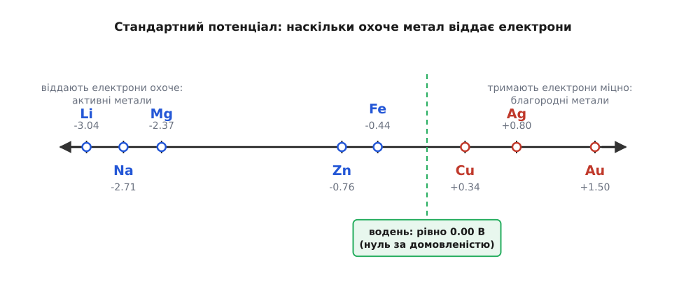
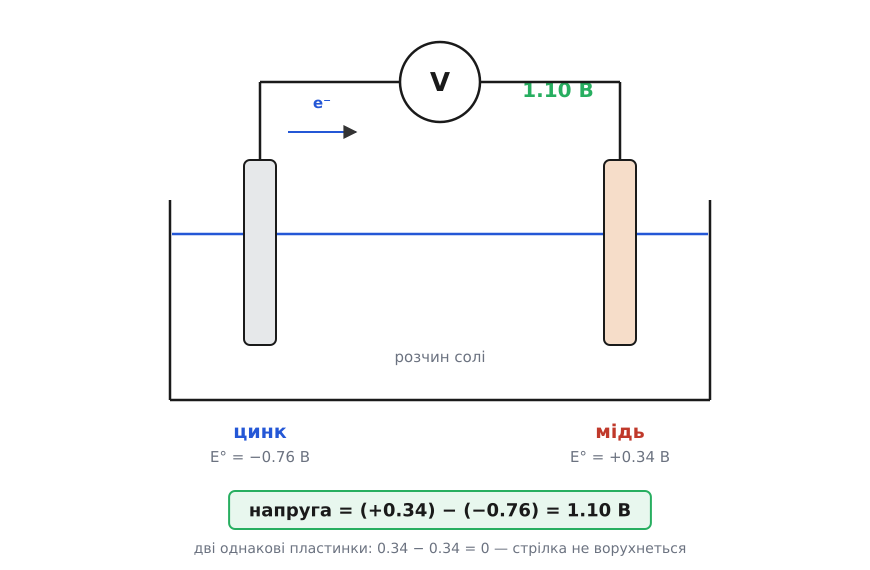

# Стандартний електродний потенціал і ряд активності

<preknowlist>
- [Типи реакцій](root:basic-chemistry/reaction-types) — що таке окисно-відновна реакція: електрони переходять від одного атома до іншого.
- [Активність і іржа](root:basic-chemistry/activity-corrosion) — ряд активності: метали шикуються за охотою віддавати електрони.
- [Іони в розчині](root:basic-chemistry/ions-solution) — сіль у воді розпадається на заряджені іони, тож метал може піти в розчин іоном.
</preknowlist>

Ряд активності дає порядок, але не дає міри. З нього видно, що цинк щедріший на електрони за мідь, — а от наскільки щедріший, він мовчить. Чи більша прірва між цинком і міддю, ніж між міддю й сріблом? Порядок цього не скаже, як не скаже й шеренга за зростом, на скільки саме сантиметрів один хлопець вищий за іншого. А без числа не зібрати батарейку: невідомо ж наперед, скільки вольтів вона видасть.

Здавалося б, що тут думати — візьми вольтметр і зміряй охоту цинку. Але вольтметр має два щупи. Він завжди показує *різницю* між двома точками, а не запас в одній: [напруга взагалі існує лише між двома місцями](topic:physics/voltage). Приклади один щуп до цинкової пластинки в розчині — а другий куди? Хоч куди його встроми, він і сам буде з якогось металу зі своєю власною охотою, і прилад покаже суміш двох відповідей. Охоту одного-єдиного металу зміряти неможливо в принципі.

Вихід той самий, який знайшли колись географи з висотою гір. Висота теж завжди «над чимось», тому обрали рівень моря й від нього ведуть відлік. Хіміки обрали свій рівень моря — **водневий електрод**: платинову пластинку, обмиту газуватим воднем, у кислоті певної міцності. Його потенціал вважають рівно 0.00 В — не тому, що там «нічого немає», а тому, що з чогось треба починати. Тепер кожен метал міряють супроти цього нуля, і виходить число — **стандартний електродний потенціал** E° (лат. *potentia* — спроможність). «Стандартний» тут означає «за домовлених умов»: 25 °C і певна концентрація іонів, бо від тепла й міцності розчину показ трохи повзе.

Число читається просто. Мінус означає, що метал розлучається з електронами охочіше за водень, плюс — що тримається за них міцніше. У цинку −0.76, у заліза −0.44, у міді +0.34, у золота +1.50, а в літію аж −3.04: він і є найщедріший з ужиткових металів. І тепер видно головне: ряд активності — це і є цей список, вишикуваний за числом. Він не окремий закон, а просто впорядкована таблиця потенціалів, з якої стерли самі цифри.


*Ліворуч від водневого нуля — метали, що віддають електрони охоче, праворуч — ті, що тримають міцно; ряд активності — це та сама шкала, з якої стерли числа.*

Заради чого ж заводили цифри? Заради того, що з ними можна рахувати. Постав у розчин солі дві різні металеві пластинки, з'єднай їх дротом через вольтметр — і стрілка покаже саме різницю їхніх потенціалів. Не суму, не середнє, а різницю: щедрий метал жене електрони, скупий їх приймає, і що далі ці двоє один від одного на шкалі, то дужче штовхає.

**Скільки вольтів дасть пара цинк — мідь?**

```
E°(мідь)  = +0.34 В    тримає електрони міцніше
E°(цинк)  = −0.76 В    віддає охочіше

напруга = E°(більше) − E°(менше)
        = (+0.34) − (−0.76)
        = 1.10 В
```

Рівно 1.10 В вольтметр і покаже. А якщо занурити дві однакові мідні пластинки, різниця буде 0.34 − 0.34 = 0, і стрілка не ворухнеться: напругу родить не сам розчин, а різниця між двома металами.


*Дві різні пластинки в одному розчині: напруга дорівнює різниці їхніх потенціалів, тож із двох однакових не вийде нічого.*

Та сама різниця відповідає й на друге питання — чи піде реакція сама. Залізний цвях у розчині мідної солі вкривається міддю, бо різниця (+0.34) − (−0.44) додатна: щедріше залізо справді витісняє скупішу мідь. А мідний дріт у розчині залізної солі так і лишиться чистим — там різниця від'ємна, тобто реакція мусила б іти проти власної охоти металів, а сама собою вона так не піде.

Історія цих чисел почалася з жаб'ячої лапки, що сіпалася на металевому гачку, — [звідки взялися перші батареї](root:basic-chemistry/electrode-potential/hist-volta-pile.md). Ґальвані вирішив, що бачить «тваринну електрику»; Вольта заперечив — сіпає не жаба, а пара різних металів, і на доказ склав із них першу батарею. Праві, як з'ясувалося згодом, були обидва, але саме та суперечка дала світові джерело струму.

> 🏠 **Де це вдома.** Пальчикова батарейка дає близько 1.5 В — це різниця потенціалів цинку та манган(IV) оксиду в її начинці. А літієва «таблетка» дає близько 3 В із того самого об'єму, бо літій стоїть на шкалі найдалі ліворуч: більша різниця — більша напруга.

> 🧪 **Спробуй сам.** Устроми в лимон оцинкований цвях і мідну монету поруч (щоб не торкалися) і приклади щупи мультиметра — побачиш майже вольт. А тепер заміни цвях на другу таку саму монету: показ упаде до нуля. Різниця металів, а не сам лимон, робить батарейку.
