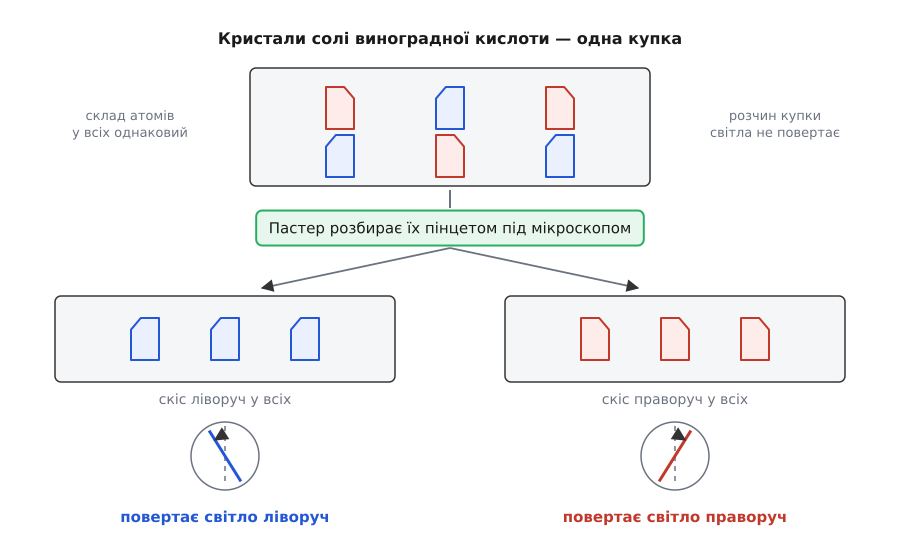

# 📜 Як хіміки побачили, що молекула має форму

Формула каже лише склад — які атоми й по скільки, — і десь до середини XIX століття хімікам здавалося, що цього досить; що атоми ще й якось розставлені в просторі, довели спершу пінцет із мікроскопом, а чверть століття по тому — зухвала здогадка двадцятидворічного голландця.

## Дві кислоти, які нічим не відрізнялися

На стінках винних бочок осідає твердий наліт — винний камінь. З нього здавна добували **винну кислоту**, звичайну й добре вивчену. Але зрідка з того самого осаду виходила інша кислота, яку назвали **виноградною** (лат. racemus — гроно винограду; звідси й теперішнє слово «рацемат»). Німецький хімік Айльгард Мічерліх (Eilhard Mitscherlich) у 1844 році порівняв обидві й перелічив збіги: та сама формула, та сама вага, ті самі кристали з тими самими кутами, та сама поведінка в реакціях. Різниця була одна-єдина — і не хімічна.

```
винна кислота        C₄H₆O₆   розчин повертає світло праворуч
виноградна кислота   C₄H₆O₆   розчин світла не повертає
```

Про «повертає світло» треба сказати окремо. Звичайне світло коливається в усіх площинах одразу; крізь спеціальний фільтр проходить лише те, що коливається в одній, — таке світло звуть [поляризованим](book:physics/light-polarization). Ще 1815 року француз Жан-Батіст Біо (Jean-Baptiste Biot) помітив: розчини деяких природних речовин цю площину помітно повертають — одні праворуч, інші ліворуч. Розчин винної кислоти повертав. Розчин виноградної — ні.

Для хімії того часу це був скандал. Речовина вважалася повністю визначеною [своїм складом](root:basic-chemistry/formulas) і тим, який атом з ким з'єднаний. Дві речовини, у яких геть усе це збігається, мусили бути однією й тією самою.

## Пінцет і мікроскоп: Париж, 1848

За загадку взявся двадцятип'ятирічний Луї Пастер (Louis Pasteur), лаборант Вищої нормальної школи в Парижі. Він приготував ту саму подвійну натрій-амонієву сіль, з якою працював Мічерліх, виростив із неї кристали й поклав під мікроскоп.

Мічерліх твердив, що кристали обох кислот однакові. Пастер побачив, що ні. У кристалів виноградної солі був крихітний скіс на одному ріжку — і приблизно в половини кристалів той скіс дивився в один бік, а в решти дзеркально в інший. Дві форми, як ліва рукавичка й права, лежали впереміш в одній купці.

Далі були години з пінцетом: Пастер розібрав купку на дві — «ліві» кристали окремо, «праві» окремо. Розчинив кожну купку у воді й пропустив крізь розчини поляризоване світло. Один розчин повернув площину праворуч, другий — ліворуч, і рівно настільки ж. А коли він змішав обидва розчини порівну, повертання зникло: два протилежні повороти погасили один одного, і вийшла та сама «байдужа» виноградна кислота.


*Купка виноградної солі мовчить, бо в ній порівну лівих і правих кристалів, і їхні повороти гасять один одного; розібрана надвоє, вона озивається двома протилежними голосами.*

Далі — сцена, яку в хімії переказують досі. Пастер побіг до Біо, і той, сімдесятичотирирічний, зажадав побачити дослід власними очима. У Колеж де Франс Біо сам приготував реактиви, сам розчинив кристали, сам поставив розчини в поляриметр — і, побачивши два протилежні повороти, сказав молодшому колезі, що так любив науку все життя, аж тепер від цього в нього калатає серце.

Висновок був неминучий. Склад однаковий, зв'язки однакові — а речовини різні. Отже, різниця сидить у тому, **як** атоми розставлені в просторі: одна молекула є дзеркальним відображенням іншої, і накласти їх одну на одну не вдається так само, як не вдається натягнути ліву рукавичку на праву руку. Назву цій властивості дав уже 1893 року британський фізик Вільям Томсон, лорд Кельвін, — **хіральність** (гр. cheir — рука).

> 🧪 **Спробуй сам.** Світло з екрана телефона вже поляризоване. Подивися на білий екран крізь поляризаційні сонцезахисні окуляри й поволі повертай їх — на якомусь куті екран майже погасне. А тепер постав між екраном і окулярами прозору склянку з густим цукровим сиропом: екран знову проясниться, ще й забарвиться. Це не фокус — цукор теж хіральний, його молекули повертають площину поляризації, і ти щойно повторив дослід Біо на кухні.

## Скільки в цьому було везіння

Чесно кажучи, чимало. Та натрій-амонієва сіль розділяється на дзеркальні кристали лише нижче приблизно 26 °C; тепліше — і скоси на ріжках не з'являються зовсім. Пастер писав, що кристалізувати треба зранку, бо від денного тепла кристали підтають і дрібні скоси зникають. Та й потрібну сіль йому фактично підказав Мічерліх. Історики хімії досі сперечаються, чого тут було більше — щастя чи підготовленої голови; сам Пастер згодом сказав знамените: у справах спостереження випадок сприяє лише підготовленому розумові. Дослід задокументований його ж публікаціями 1848 року, а от барвисті подробиці переказів — на кшталт того, що він кинувся Біо на шию просто в коридорі, — це радше добрий анекдот, ніж протокол.

## Тетраедр, з якого спершу сміялися

Пастер довів, **що** форма є. Яка вона — не знав ніхто, і ще чверть століття це лишалося фактом без пояснення.

Ось у чому була заковика. Якщо намалювати чотири різні групи навколо атома [Карбону](root:basic-chemistry/carbon) на плоскому аркуші, дзеркальної пари не вийде взагалі: плоску фігуру завжди можна перевернути й накласти на її відображення. Гірше того, з плоского розкладу випливають аж три різні речовини — залежно від того, які групи стоять навпроти яких. А природа вперто показувала протилежне: одну речовину у двох дзеркальних варіантах.

5 вересня 1874 року голландець Якоб Гендрік Вант-Гофф (Jacobus Henricus van 't Hoff), якому щойно виповнилося 22, видав тоненьку брошуру голландською: чотири зв'язки Карбону дивляться не в площину, а у вершини **тетраедра** — трикутної піраміди з чотирма однаковими гранями. Порахуймо варіанти тепер. Чотири різні групи на вершинах тетраедра дають рівно один спосіб з'єднання — і рівно два його дзеркальні виконання, які не суміщаються ніяким поворотом. Точнісінько те, що бачив Пастер під мікроскопом.

У листопаді того ж року в бюлетені Французького хімічного товариства вийшла праця француза з Ельзасу Жозефа Ашіля Ле Беля (Joseph Achille Le Bel) — з тією самою ідеєю. Обидва того року працювали в паризькій лабораторії Шарля Вюрца й обидва потім клялися, що про тетраедр один з одним не говорили ніколи.

## «Пегас, позичений у ветеринарної школи»

Прийняли ідею не одразу. У 1877 році Герман Кольбе (Hermann Kolbe) — німецький хімік першої величини, головний редактор Journal für praktische Chemie — вилив на Вант-Гоффа таке: якийсь доктор Вант-Гофф із Ветеринарної школи в Утрехті, вочевидь, не має смаку до точного хімічного дослідження, тож йому здалося зручніше осідлати Пегаса (певно, позиченого в тій-таки Ветеринарній школі) і сповістити світові, як у зухвалому польоті на вершину хімічного Парнасу йому привиділися атоми, розставлені в просторі.

Кольбе не був диваком: саме він у 1845 році вперше зібрав оцтову кислоту з неорганічних речовин і тим підважив віру, ніби органічні речовини робить лише життя. Він щиро вважав розмови про розташування атомів у просторі фантазіями, бо жодних атомів ніхто не бачив. А влучив у болюче свідомо: Вант-Гофф і справді викладав тоді у ветеринарній школі.

Вийшло навпаки. Лайка в поважному журналі зробила невідомій брошурі рекламу, за тетраедр заступився авторитетний Йоганнес Вісліценус, того ж 1877-го вийшов німецький переклад, і десь до 1880 року ідея стала загальновизнаною. Кольбе помер 1884-го, так і не поступившись.

Вант-Гофф у 1901 році отримав найпершу Нобелівську премію з хімії — щоправда, не за тетраедр, а за пізніші роботи зі швидкості реакцій та осмотичного тиску. Ле Бель, який устиг те саме й майже тоді ж, лишився в тіні свого ровесника.

А формула речовини з того часу перестала бути повним її описом. Поруч із питанням «які атоми і як з'єднані» стало друге, не менш важливе — «як воно стоїть у просторі»; речовини з однаковим складом, але різною будовою дістали навіть окрему назву — [ізомери](root:basic-chemistry/isomers). І все це виросло з купки кристалів, мікроскопа й пінцета в руках у двадцятип'ятирічного лаборанта.
