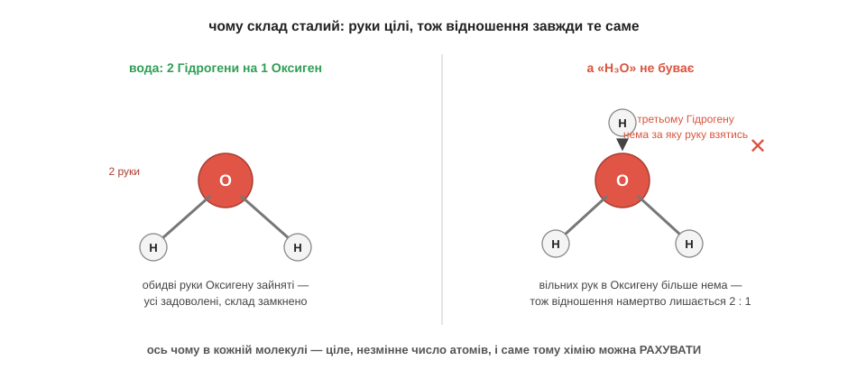

# Сталі відношення

Кухар, готуючи борщ, кладе солі «дрібку», а як на смак мало — додасть ще трохи. Художник підмішує до фарби «крапельку» синього, а захоче — крапельку ще. У звичайному житті кількості — приблизні, на око, до смаку: трохи більше, трохи менше, нічого страшного. А тепер поглянь на воду. У ній завжди, скрізь і за будь-яких умов рівно два атоми Гідрогену на один атом Оксигену. Не «два з половиною», не «трохи більше водню сьогодні» — а точнісінько два до одного, у краплі з-під крана, у хмарі над морем і в найдорожчій лабораторії світу. Чому ж хімія така сувора до чисел там, де кухня цілком вільна?

Відповідь ховається в самих атомах — точніше, у тих «руках», якими вони чіпляються один за одного. Кожен атом має певне, незмінне число таких рук, і число це — завжди ціле. В Оксигену їх рівно дві, у Гідрогену — рівно одна.

Число «рук» атома — скільки зв'язків він здатен утворити — називають [валентністю](root:basic-chemistry/valence); в Оксигену вона дорівнює 2, у Гідрогену — 1.

А тепер придивися, що це означає для води. Дві руки Оксигену треба чимось зайняти, і кожен Гідроген може запропонувати лише одну руку — отже, щоб усі руки зчепилися, на один Оксиген потрібно саме два Гідрогени. Не один (тоді одна рука Оксигену лишиться висіти вільна) і не три (третьому Гідрогену вже нема за яку руку взятися). Рівно два. Відношення «два до одного» не вигадане й не домовлене — воно намертво задане тим, що рук у атомів ціле число.

*Дві руки Оксигену зчіплюються рівно з двома Гідрогенами; третій Гідроген зайвий — рук більше немає, тож відношення намертво лишається 2 : 1.*

Спробуй тепер сам пересвідчитися, наскільки це жорстко. Уяви, що ти дуже хочеш зробити воду, у якій на один Оксиген припадало б три Гідрогени, — таке собі «H₃O». Береш молекулу води й намагаєшся приліпити до неї третій Гідроген. Що з нього вийде?.. Нічого: обидві руки Оксигену вже зайняті першими двома Гідрогенами, а до чого причепитися третьому — немає. Він просто не втримається й відпаде. Хоч скільки додавай водню до води, зайве не пристане — відношення вперто лишиться два до одного. Ось чому хімічний склад речовини сталий: він тримається не на домовленості людей, а на тому, що атоми цілі й рук у них ціле число.

А тепер — найголовніший висновок, заради якого все це й говорилося. Раз кожна речовина має сталий, незмінний склад із цілих чисел атомів, то з цими числами можна робити арифметику: складати, ділити, перераховувати. Якби речовини складалися «на смак», як борщ, — сьогодні трохи більше водню, завтра трохи менше, — то жодна формула не мала б сенсу, жодне рівняння не сходилося б, і рахувати в хімії було б нічого. Хімія може рахувати саме тому, що відношення в ній сталі й цілі. Числа в хімії — не канцелярія й не примха підручника, яку треба визубрити; вони просто відображають оту жорстку цілість атомів та їхніх рук. Уся хімічна арифметика — формули, рівняння, перерахунки кількостей — виростає з однієї цієї думки.

> 🏠 Напис H₂O на пляшці — це не позначка «приблизно водень із киснем», а точний рецепт із незмінною пропорцією; будь-яка вода на світі складена рівно так само.
