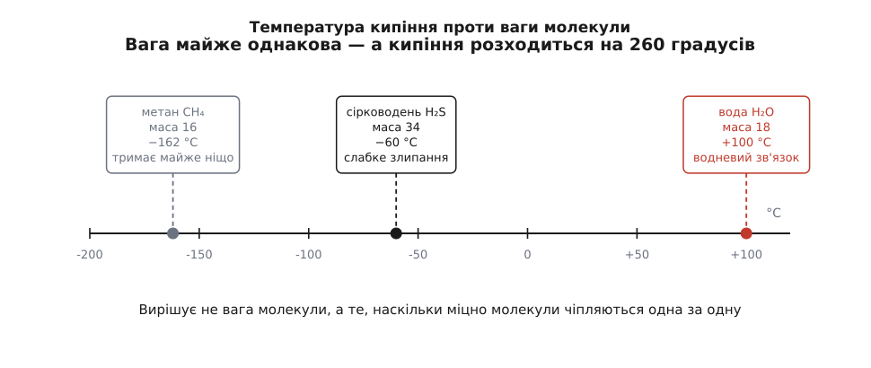
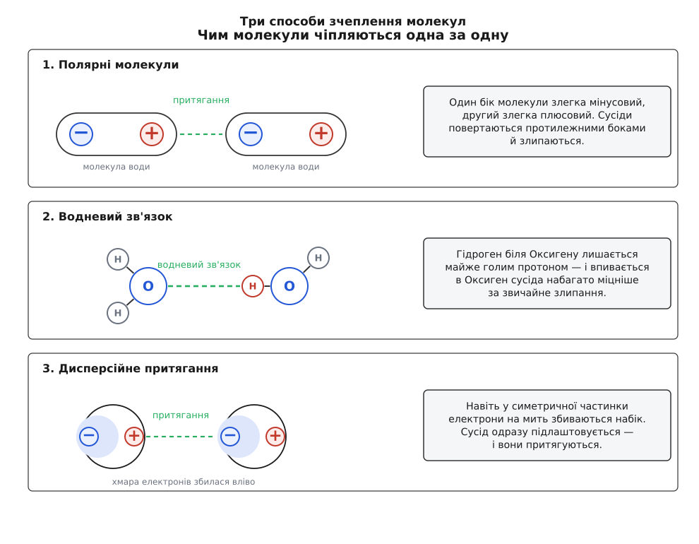

# Міжмолекулярні сили

<preknowlist>
- [Атоми й молекули](root:basic-chemistry/atoms-molecules) — речовина складається з молекул, а молекула — з кількох зчеплених атомів.
- [Іонний і ковалентний](root:basic-chemistry/ionic-covalent) — що таке спільна електронна пара і чому в молекули води один бік злегка плюсовий, а другий злегка мінусовий.
- [Будова атома](root:basic-chemistry/inside-atom) — плюсове ядро й рухлива хмара мінусових електронів навколо нього.
- [Молекули чи ґратка](root:basic-chemistry/molecules-lattice) — тверда речовина буває або з окремих молекул, або суцільною ґраткою.
</preknowlist>

Налий повну склянку води — вона стоятиме скільки завгодно. А тепер спробуй так само набрати склянку повітря: воно розлетиться, ще й не встигнеш донести. Здається, ніби річ у вазі: важке лежить, легке летить. Але ось прикрість. Молекула води H₂O важить вісімнадцять одиниць, а молекула азоту N₂, з якого повітря переважно й складається, — двадцять вісім. Легше лежить у склянці, а важче розлітається. Отже, справа геть не у вазі.

Придивімося тоді, що ж відбувається, коли вода все-таки полетить, — коли вона закипить. Пара над чайником — це ті самі неушкоджені молекули H₂O: жоден зв'язок усередині них не порвався, Оксиген як тримав двох Гідрогенів, так і тримає. Виходить, кипіння зруйнувало не зв'язки в молекулі, а щось інше — те, що доти тримало молекули **одна коло одної**. Значить, таке зчеплення справді існує, і саме воно тримає воду в склянці. Лишається з'ясувати, з чого воно взялося.

Тягнути на такій крихітній відстані вміє лише одна річ — електричний заряд: плюс притягує мінус. Але молекула загалом нейтральна, плюсів і мінусів у ній порівну. Вихід із цієї суперечності єдиний: нейтральна **загалом** ще не означає рівномірна **всередині**.

Так і є у води. [Оксиген перетягує спільні електронні пари ближче до себе](root:basic-chemistry/ionic-covalent), тож його бік молекули стає злегка мінусовим, а обидва Гідрогени лишаються злегка плюсовими. Такі молекули-магнітики повертаються одна до одної протилежними боками й злипаються. Зчеплення це в десятки разів слабше за справжній зв'язок — тому нагрівання рве саме його, а молекули лишає цілими.

Та коли поставити воду поруч із її найближчим родичем, виявиться, що самої лише полярності замало. Сірка стоїть у таблиці просто під Оксигеном, тож сірководень H₂S збудований точно так само й важить майже вдвічі більше. За всіма розрахунками розігнати його молекули має бути важче — а він кипить при −60 °C, тоді як вода аж при +100 °C. Сто шістдесят градусів різниці на порожньому місці.

Причина в самому Гідрогені. Коли він причеплений до Оксигену (а ще до Нітрогену чи Флуору), його єдиний електрон відтягнуто так сильно, що від атома лишається майже голий протон — точковий плюс, не прикритий нічим. Такий оголений плюс впивається в мінусовий бік сусідньої молекули незрівнянно міцніше за звичайне злипання. Це чіпляння дістало окрему назву — **водневий зв'язок**. Сірка тягне електрони слабше, голого протона в сірководні не виходить — і вся перевага зникає.

```
речовина     молекула   маса   кипить при    що тримає молекули
метан        CH₄         16     −162 °C      майже ніщо
вода         H₂O         18     +100 °C      водневий зв'язок
сірководень  H₂S         34      −60 °C      слабке злипання
```


*Метан, вода й сірководень мають майже однакову вагу, а розходяться на сотні градусів: вирішує не вага молекули, а сила зчеплення між молекулами.*

Саме водневі зв'язки роблять воду рідиною за звичайних умов — без них вона була б газом, а Землю не було б кому населяти. Вони ж тримають докупи дві нитки [ДНК](root:basic-chemistry/dna): по всій довжині спіралі літери сусідніх ниток зчеплені між собою саме так, тому клітина легко розводить нитки, коли їй треба прочитати запис.

Досі все трималося на тому, що в молекули є заряджені боки. Але є частинки, у яких їх немає зовсім. Молекула метану CH₄ симетрична, як кулька: жодного плюсового чи мінусового боку. Молекула кисню O₂ складена з двох однакових атомів, які тягнуть спільні пари рівно порівну. Атом гелію взагалі один-однісінький. Чіплятися їм, здавалося б, нічим — а проте охолоди їх достатньо, і всі вони скрапляться: кисень при −183 °C, гелій при −269 °C. Отже, притягання є навіть між ідеально симетричними частинками.

Розгадка — у тому, що електронна хмара не стоїть на місці. Електрони весь час рухаються, і в кожну окрему мить їх випадково буває трохи більше з одного боку, ніж з іншого. На цю мить частинка таки має плюсовий і мінусовий бік — тільки миттєвий. Хмара сусіда одразу відгукується: її електрони відсуваються від наведеного мінуса — і сусід перекошується в той бік, у який треба, щоб вони притяглися. Мить збігає, перекіс виникає в іншому місці, а сусід знову підлаштовується так, щоб виходило притягання. Тому воно ніколи не усереднюється в нуль. Це **дисперсійне притягання**.

> 🏠 **Де це вдома.** Скотч і наліпка тримаються на гладенькій поверхні не «клеєм», а саме цим притяганням: м'який шар просто щільно повторює всі нерівності, і мільйони молекул опиняються впритул. На тому самому стоїть і гекон: 2002 року вчені показали, що незліченні волосинки на його лапках чіпляються за скло чистим дисперсійним притяганням — без жодного клею й без жодних присосок.

Поодинці ця сила мізерна, зате вона є між будь-якими частинками, і вона тим більша, чим більша електронна хмара. Ось чому родина галогенів так дивно розкладається: легенький фтор F₂ — газ, важчий хлор Cl₂ — теж газ, іще важчий бром Br₂ — уже рідина, а найважчий йод I₂ — тверді кристали. Молекули однаково влаштовані, різняться лише розміром хмари. З тієї самої причини бензин вивітрюється за хвилини, а парафін свічки, складений із таких самих ланцюгів, тільки набагато довших, лишається твердим.


*Полярні молекули шикуються протилежними боками; голий протон Гідрогену впивається в Оксиген сусіда — це водневий зв'язок; а симетричні частинки чіпляються миттєвими перекосами електронної хмари.*

> 🧪 **Спробуй сам.** Потри пластикову гребінку об волосся й піднеси до тоненького струмочка води з крана. Струмінь помітно вигнеться до гребінки — це молекули води повертаються до неї своїм плюсовим боком. Ти щойно побачив на власні очі, що в молекули справді є заряджені боки.

Усі ці слабкі притягання між цілими молекулами звуть **силами Ван дер Ваальса**; водневий зв'язок зазвичай виділяють окремо, бо він помітно сильніший за решту. Історія в цих сил вийшла довга: сам Ван дер Ваальс здогадався про них із поведінки газів, а звідки береться притягання між симетричними частинками, зрозуміли лише через півстоліття. [Як це було](root:basic-chemistry/intermolecular-forces/hist-van-der-waals.md).

Температура плавлення й кипіння, [поверхневий натяг](topic:physics/surface-tension), від якого крапля збирається в кульку, здатність рідини змочувати скло — усе це вирішують не зв'язки всередині молекул, а оте слабке чіпляння між ними. Знай, наскільки чіпкі молекули речовини, — і вже вгадаєш, чи буде вона газом, рідиною чи твердою.
