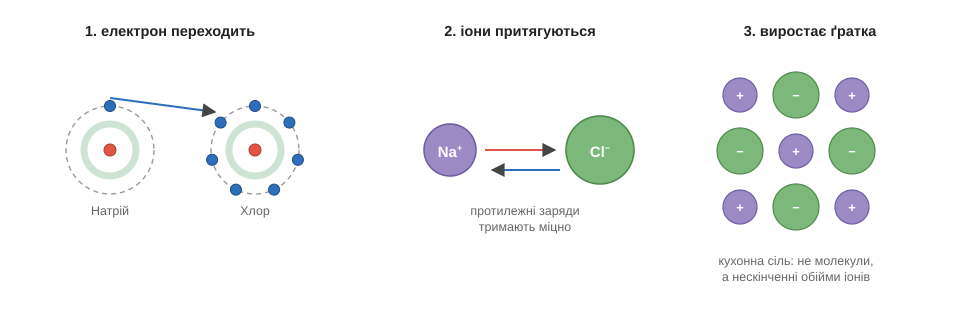
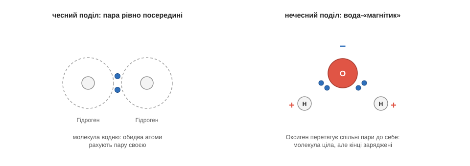

# Іонний і ковалентний

Загадка солі тепер майже сама проситься на розв'язок. З одного боку — натрій, у якого на зовнішній поличці один самотній зайвий електрон, що його натрій радо позбувся б. З іншого — хлор, якому до повної полички бракує рівно одного електрона. Кращої пари годі й шукати: те, що зайве одному, — це саме те, чого потребує інший. Лишилося подивитися зблизька, що ж відбувається в мить їхньої зустрічі.

Перший крок очевидний: електрон переходить від натрію до хлору. І обом одразу стає добре — у натрію відкривається повна нижча поличка, у хлору закривається остання прогалина. Та разом із електроном змінюється ще дещо, на що варто звернути пильну увагу. Доти кожен атом був електрично нейтральний: скільки протонів-плюсів у ядрі, стільки ж електронів-мінусів навколо. А тепер натрій віддав один мінус — і в нього лишився зайвий, неврівноважений плюс; хлор же прийняв чужий мінус — і набув зайвого мінуса. Заряджений атом називають **іоном**, і записують це маленьким значком згори: натрій став Na⁺, хлор — Cl⁻. А далі спрацьовує просте правило зарядів: протилежні заряди притягуються. Плюсовий Na⁺ і мінусовий Cl⁻ тягнуться один до одного й міцно злипаються.

Те саме притягання, що зчіплює тепер готові іони, тримає купи й [сам атом](root:basic-chemistry/inside-atom): плюсове ядро з протонів і хмара мінусових електронів навколо не розлітаються саме через притягання протилежних зарядів.

Оце притягання готових іонів і є **іонний зв'язок** — спершу передача електрона, а тоді взаємні обійми протилежних зарядів.

І ось вона, розгадка мирної солі. У сільничці немає ні буйного металу, ні отруйного газу — там зовсім інші частинки: спокійні, врівноважені іони Na⁺ і Cl⁻, кожен із повною поличкою. Іон натрію схожий на натрій-метал не більше, ніж вовк на вівцю, хоч називаються майже однаково. Звідси випливає правило, яке варто закарбувати раз і назавжди: властивості речовини належать **не тому, з чого її зроблено, а тому, що з цього вийшло**. Тепер ми бачимо механізм цієї думки в дії.

У складній речовині атоми зчеплені зв'язками й дають зовсім новий матеріал, тоді як у [суміші](root:basic-chemistry/mixtures) компоненти лише перемішані й зберігають свої властивості — тому сіль не схожа на натрій із хлором, а солона вода схожа і на сіль, і на воду.

І ще одна дрібниця, яка скоро стане важливою: кожен Na⁺ намагається оточити себе хлорами з усіх боків, а кожен Cl⁻ — натріями, тож сіль виходить не окремими молекулами, а суцільною ґраткою, де плюси й мінуси чергуються, мов клітинки шахівниці.

А тепер — другий випадок, зовсім інший. Що буде, коли зустрінуться двоє, кому обом невигідно віддавати, бо обом електронів **бракує**? Найпростіший приклад — два атоми водню: кожному до повної першої полички не вистачає одного електрона, і жоден не збирається свій останній комусь дарувати. Здавалося б, глухий кут — та атоми знаходять елегантний вихід. Вони не віддають і не забирають, а **складаються**: кожен викладає свій єдиний електрон у спільну пару, і ця пара кружляє тепер навколо обох ядер одразу. Хитрість у тому, що спільну пару кожен з атомів чесно рахує **своєю** — отже, обидва ніби дістали жадану повну поличку, хоч насправді поділили двох електронів на двох. Саме ця спільна пара й тримає їх разом. Такий зв'язок називають **ковалентним** — це не крадіжка, як в іонному, а спільне володіння. Так збудована молекула водню, так киснева частинка тримає два атоми разом, так само Оксиген утримує двох Гідрогенів у молекулі води — і взагалі більшість молекул на світі складена саме ковалентними зв'язками.

І тут є тонкість, заради якої варто було все це затівати, бо вона ще не раз нам знадобиться. Спільне володіння не завжди буває чесним. Коли пару ділять два однакові атоми — як два водні, — вони тягнуть її до себе з однаковою силою, тож пара висить рівно посередині, по-справедливому. Але Оксиген, скажімо, тягне електрони помітно сильніше за Гідроген. І в молекулі води обидві спільні пари виявляються перетягнутими ближче до Оксигену. Молекула загалом лишається цілою й незарядженою, але всередині неї заряд тепер розподілений нерівно: біля Оксигену збирається трохи надлишку мінуса, а біля обох Гідрогенів лишається трохи плюса. Молекулу, в якої отак з'явилися злегка заряджені кінці, називають **полярною**. Воду зручно уявляти собі крихітним магнітиком із плюсовим і мінусовим боком — лише пам'ятай, що тягнуть тут не магнітні полюси, а звичайні електричні заряди. Саме цей образ води-магнітика й пояснює, чому вода розчиняє мало не все на світі.

Саме так речовина й [розчиняється](root:basic-chemistry/dissolution): полярні кінці води чіпляються до іонів речовини й розтягують ґратку на окремі іони, оточуючи кожен своїм роєм молекул, — так сіль і зникає у воді.

*Електрон переходить від Натрію до Хлору, готові іони Na⁺ і Cl⁻ притягуються, і з їхніх обіймів виростає ґратка кухонної солі.*

*У молекулі водню спільна пара сидить рівно посередині; у воді Оксиген перетягує обидві пари до себе — і молекула набуває злегка заряджених кінців.*

Отже, перед нами дві стратегії: віддати-забрати дає іонний зв'язок, поділитися спільною парою — ковалентний. Є й третя, найдивніша, — спосіб, у який тримаються купи [самі метали](root:basic-chemistry/metallic-bond): атоми скидають зовнішні електрони у спільне «море», що вільно тече між плюсовими остовами й зчіплює їх усі разом, — звідси блиск, ковкість і провідність металів.
