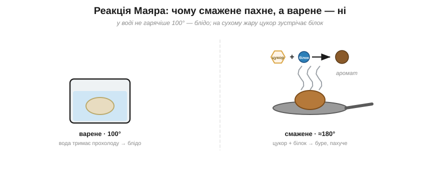
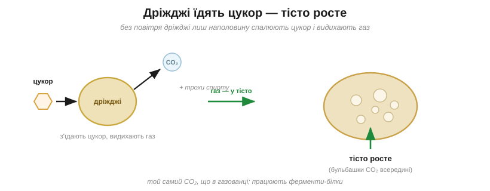

# Кухонна хімія

<preknowlist>
- [Атоми й молекули](root:basic-chemistry/atoms-molecules) — речовини складені з молекул, а молекули — зі скріплених атомів.
- [Реакція](root:basic-chemistry/reaction) — як одні речовини перетворюються на інші, утворюючи нові.
</preknowlist>

Зварена картоплина — бліда й прісна. А та сама картоплина, кинута на розпечену пательню, золотіє, береться хрумкою скоринкою й пахне так, що аж слина набігає. Картопля одна й та сама — то що ж такого зробив сухий жар, чого не змогла вода? Кухня — це насправді справжня хімічна лабораторія, і два щоденні кухонні дива показують у ній мало не всю хімію речовин та реакцій.

Почнімо зі скоринки. Тут уся справа в одній важливій дрібниці: вода, хоч як її грій, ніколи не стає гарячішою за сто градусів — вона закипає й вище температуру не пускає. А ось суха пательня чи духовка розжарюються куди дужче, до двохсот і більше. І саме там, на такому жару, зустрічаються дві молекули — [цукри](root:basic-chemistry/carbohydrates) й амінокислоти [білків](root:basic-chemistry/fats-proteins). Цукри — солодкі молекули з вуглецю, водню й кисню, головне «пальне» живого; білки складені з амінокислот, невеликих молекул, де поряд сидять кислотна й азотна (аміно-) групи. На сильному жару вони беруться одна за одну й починають плести сотні нових бурих, запашних молекул — той самий дух підсмаженої грінки, рум'яної скоринки, смаженої цибулі; саме азотна група амінокислот і дає ту буру барву.

Цю зустріч цукрів із білками на жару й називають **реакцією Маяра** (за французьким хіміком Луї-Камілем Маяром, який описав її 1912 року). А варене лишається блідим і прісним тільки тому, що вода тримає його надто прохолодним — нижче за поріг, з якого ця реакція починається. Спробуй тепер сам пояснити, чому шматок м'яса на гарячій сковороді вкривається смачною скоринкою, а в каструлі з водою лишається сірим?.. Бо в сковороді жар сягає тих двохсот градусів, потрібних реакції Маяра, а кипляча вода не пускає м'ясо гарячіше за сто — і реакція просто не запускається.

*У воді не гарячіше 100° — їжа лишається блідою; на сухому жару цукри й білки зустрічаються й дають буру пахучу скоринку.*

Друге кухонне диво — як саме росте хлібне тісто. **Дріжджі** — це крихітні живі грибки; дай їм цукру з борошна, і вони заходяться його їсти заради енергії. Та без повітря дріжджі спалюють той цукор не до кінця, а лише наполовину — і видихають при цьому **вуглекислий газ** (а заразом трохи спирту). Бульбашки цього газу застрягають у тягучому тісті, і воно від них пухне й підіймається. А той спирт, що утворюється поряд, — то, до речі, уся суть вина й пива.

*Дріжджі з'їдають цукор і видихають вуглекислий газ; його бульбашки застрягають у тісті й підіймають його.*

Придивися, що спільного в цих двох дивах. І рум'яна скоринка, і підняте тісто — це хімія, якою всім заправляє одне: тепло. Бо чим тепліше, тим швидше й частіше стикаються молекули, а отже, тим жвавіше біжить будь-яке перетворення — у цьому вся суть [швидкості реакції](root:basic-chemistry/reaction-rate). Ось тільки міра тепла в них зовсім різна. Реакції Маяра потрібен сильний сухий жар, що переганяє їжу за водяну стелю в сто градусів, — інакше скоринці нізвідки взятися. А дріжджі — живі, і їм смакує лагідне тепло: у ньому вони їдять і газують найохочіше, тимчасом як на холоді ледь ворушаться, і тісто підходить годинами. Виходить, що варячи й смажачи, ти весь цей час, сам того не помічаючи, крутиш один і той самий важіль — температуру, а з нею й швидкість своєї домашньої хімії.

> 🏠 **Де це вдома.** Тому м'ясо задля скоринки кладуть на сильно розжарену сковороду чи гриль, а не в каструлю з водою; з тієї ж причини хліб рум'яниться в тостері, а на парі лишився б блідим. А тісто, навпаки, ставлять підходити в тепле місце — ближче до теплої плити чи батареї: у теплі дріжджам працюється жваво, а на холоді вони засинають, і тісто так і не підійметься.

> 🧪 **Спробуй сам.** Насип у порожню пляшку ложку цукру й пакетик сухих дріжджів, залий теплою (не гарячою!) водою, збовтай і натягни на шийку повітряну кульку. За півгодини-годину в теплі кулька сама почне надуватися — це дріжджі наїлися цукру й видихають вуглекислий газ, той самий, що підіймає тісто. Постав таку саму пляшку в холодильник — і кулька лишиться млявою: на холоді дріжджі сплять.
